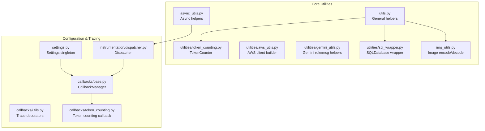
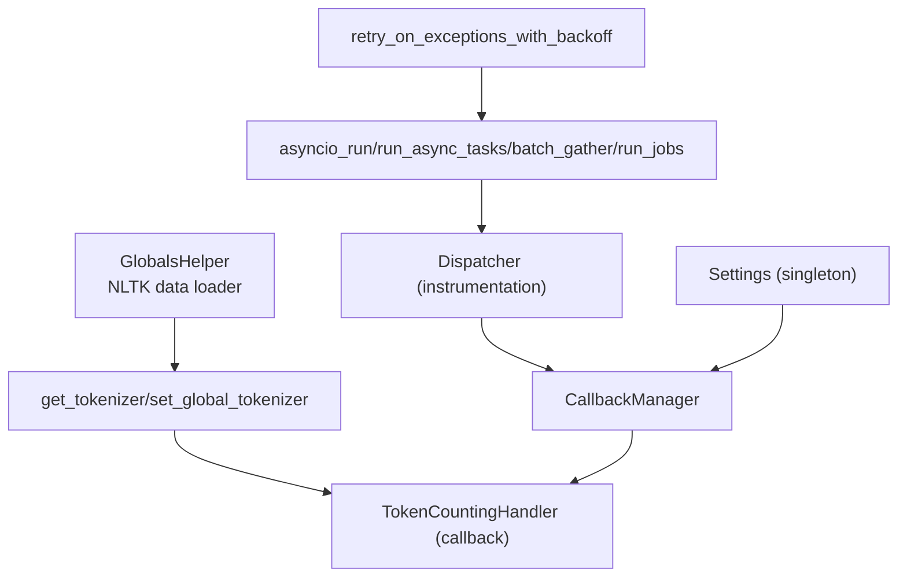
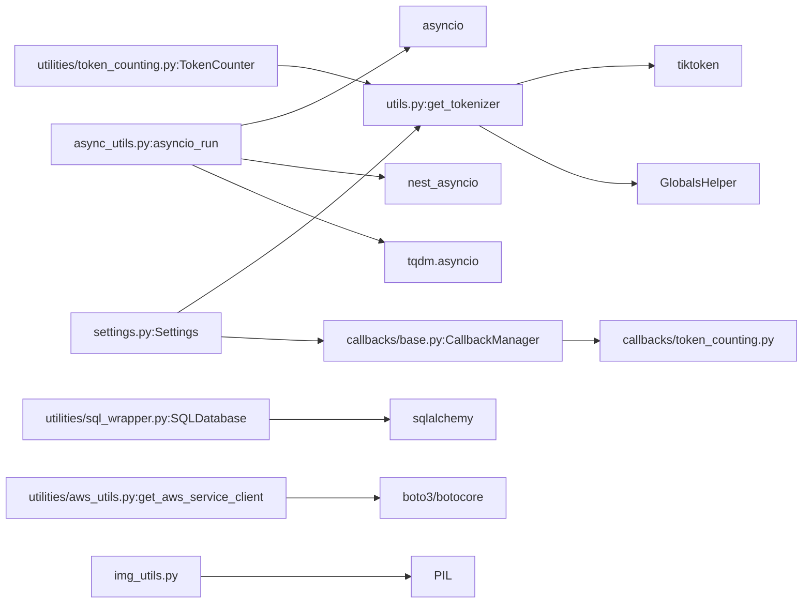

# Utility Functions and Helpers

<cite>
**Referenced Files in This Document**
- [utils.py](file://llama-index-core/llama_index/core/utils.py)
- [async_utils.py](file://llama-index-core/llama_index/core/async_utils.py)
- [token_counting.py](file://llama-index-core/llama_index/core/utilities/token_counting.py)
- [aws_utils.py](file://llama-index-core/llama_index/core/utilities/aws_utils.py)
- [gemini_utils.py](file://llama-index-core/llama_index/core/utilities/gemini_utils.py)
- [sql_wrapper.py](file://llama-index-core/llama_index/core/utilities/sql_wrapper.py)
- [img_utils.py](file://llama-index-core/llama_index/core/img_utils.py)
- [settings.py](file://llama-index-core/llama_index/core/settings.py)
- [dispatcher.py](file://llama-index-core/llama_index/core/instrumentation/dispatcher.py)
- [base.py](file://llama-index-core/llama_index/core/callbacks/base.py)
- [utils.py](file://llama-index-core/llama_index/core/callbacks/utils.py)
- [token_counting.py](file://llama-index-core/llama_index/core/callbacks/token_counting.py)
</cite>

## Table of Contents
1. [Introduction](#introduction)
2. [Project Structure](#project-structure)
3. [Core Components](#core-components)
4. [Architecture Overview](#architecture-overview)
5. [Detailed Component Analysis](#detailed-component-analysis)
6. [Dependency Analysis](#dependency-analysis)
7. [Performance Considerations](#performance-considerations)
8. [Troubleshooting Guide](#troubleshooting-guide)
9. [Conclusion](#conclusion)

## Introduction
This document provides comprehensive documentation for LlamaIndex utility functions, helper classes, and common utilities. It covers:
- Text processing and token counting helpers
- Data transformation and batching utilities
- Type conversion and image manipulation helpers
- Configuration management via Settings
- Logging and tracing integration via instrumentation and callbacks
- Performance optimization helpers for async workloads
- Best practices and integration patterns

The goal is to make these utilities accessible to both new and experienced users, with clear parameter specifications, return value descriptions, usage examples, and diagrams where helpful.

## Project Structure
Utilities are primarily located under the core module:
- General-purpose utilities: [utils.py](file://llama-index-core/llama_index/core/utils.py)
- Async utilities: [async_utils.py](file://llama-index-core/llama_index/core/async_utils.py)
- Instrumentation dispatcher: [dispatcher.py](file://llama-index-core/llama_index/core/instrumentation/dispatcher.py)
- Callbacks and tracing: [base.py](file://llama-index-core/llama_index/core/callbacks/base.py), [utils.py](file://llama-index-core/llama_index/core/callbacks/utils.py), [token_counting.py](file://llama-index-core/llama_index/core/callbacks/token_counting.py)
- Dedicated utility modules:
  - Token counting: [token_counting.py](file://llama-index-core/llama_index/core/utilities/token_counting.py)
  - AWS client creation: [aws_utils.py](file://llama-index-core/llama_index/core/utilities/aws_utils.py)
  - Gemini role/message helpers: [gemini_utils.py](file://llama-index-core/llama_index/core/utilities/gemini_utils.py)
  - SQL wrapper: [sql_wrapper.py](file://llama-index-core/llama_index/core/utilities/sql_wrapper.py)
  - Image helpers: [img_utils.py](file://llama-index-core/llama_index/core/img_utils.py)
- Configuration management: [settings.py](file://llama-index-core/llama_index/core/settings.py)

**Diagram sources**
- [utils.py](file://llama-index-core/llama_index/core/utils.py#L1-L705)
- [async_utils.py](file://llama-index-core/llama_index/core/async_utils.py#L1-L175)
- [token_counting.py](file://llama-index-core/llama_index/core/utilities/token_counting.py#L1-L104)
- [aws_utils.py](file://llama-index-core/llama_index/core/utilities/aws_utils.py#L1-L53)
- [gemini_utils.py](file://llama-index-core/llama_index/core/utilities/gemini_utils.py#L1-L66)
- [sql_wrapper.py](file://llama-index-core/llama_index/core/utilities/sql_wrapper.py#L1-L249)
- [img_utils.py](file://llama-index-core/llama_index/core/img_utils.py#L1-L41)
- [settings.py](file://llama-index-core/llama_index/core/settings.py#L1-L249)
- [dispatcher.py](file://llama-index-core/llama_index/core/instrumentation/dispatcher.py#L1-L9)
- [base.py](file://llama-index-core/llama_index/core/callbacks/base.py#L196-L234)
- [utils.py](file://llama-index-core/llama_index/core/callbacks/utils.py#L40-L61)
- [token_counting.py](file://llama-index-core/llama_index/core/callbacks/token_counting.py)

**Section sources**
- [utils.py](file://llama-index-core/llama_index/core/utils.py#L1-L705)
- [async_utils.py](file://llama-index-core/llama_index/core/async_utils.py#L1-L175)
- [settings.py](file://llama-index-core/llama_index/core/settings.py#L1-L249)

## Core Components
This section summarizes the primary utility categories and their responsibilities.

- General utilities
  - Global tokenization and caching: [get_tokenizer](file://llama-index-core/llama_index/core/utils.py#L143-L172), [set_global_tokenizer](file://llama-index-core/llama_index/core/utils.py#L134-L140)
  - ID generation: [get_new_id](file://llama-index-core/llama_index/core/utils.py#L175-L181), [get_new_int_id](file://llama-index-core/llama_index/core/utils.py#L184-L190)
  - Retry with exponential backoff: [retry_on_exceptions_with_backoff](file://llama-index-core/llama_index/core/utils.py#L229-L275), [aretry_on_exceptions_with_backoff](file://llama-index-core/llama_index/core/utils.py#L277-L322)
  - Batch iteration: [iter_batch](file://llama-index-core/llama_index/core/utils.py#L358-L370)
  - Progress wrappers: [get_tqdm_iterable](file://llama-index-core/llama_index/core/utils.py#L384-L398)
  - Text truncation: [truncate_text](file://llama-index-core/llama_index/core/utils.py#L351-L355)
  - Cache dir resolution: [get_cache_dir](file://llama-index-core/llama_index/core/utils.py#L424-L438)
  - Color printing: [print_text](file://llama-index-core/llama_index/core/utils.py#L552-L568)
  - Torch device inference: [infer_torch_device](file://llama-index-core/llama_index/core/utils.py#L571-L583)
  - Binary resolver: [resolve_binary](file://llama-index-core/llama_index/core/utils.py#L614-L704)

- Async utilities
  - Event loop runner: [asyncio_run](file://llama-index-core/llama_index/core/async_utils.py#L25-L65)
  - Task execution with progress: [run_async_tasks](file://llama-index-core/llama_index/core/async_utils.py#L68-L100)
  - Batching and throttling: [batch_gather](file://llama-index-core/llama_index/core/async_utils.py#L108-L118), [run_jobs](file://llama-index-core/llama_index/core/async_utils.py#L137-L174)

- Token counting utilities
  - TokenCounter class: [TokenCounter](file://llama-index-core/llama_index/core/utilities/token_counting.py#L10-L104)
  - Token counting callback: [TokenCountingHandler](file://llama-index-core/llama_index/core/callbacks/token_counting.py)

- AWS utilities
  - AWS client builder: [get_aws_service_client](file://llama-index-core/llama_index/core/utilities/aws_utils.py#L7-L52)

- Gemini utilities
  - Role mapping and message merging: [merge_neighboring_same_role_messages](file://llama-index-core/llama_index/core/utilities/gemini_utils.py#L29-L65)

- SQL wrapper
  - SQLDatabase class: [SQLDatabase](file://llama-index-core/llama_index/core/utilities/sql_wrapper.py#L10-L249)

- Image utilities
  - Base64 encode/decode: [img_2_b64](file://llama-index-core/llama_index/core/img_utils.py#L11-L25), [b64_2_img](file://llama-index-core/llama_index/core/img_utils.py#L28-L40)

- Configuration management
  - Settings singleton: [Settings](file://llama-index-core/llama_index/core/settings.py#L248-L249)

**Section sources**
- [utils.py](file://llama-index-core/llama_index/core/utils.py#L143-L172)
- [utils.py](file://llama-index-core/llama_index/core/utils.py#L229-L275)
- [async_utils.py](file://llama-index-core/llama_index/core/async_utils.py#L25-L65)
- [token_counting.py](file://llama-index-core/llama_index/core/utilities/token_counting.py#L10-L104)
- [aws_utils.py](file://llama-index-core/llama_index/core/utilities/aws_utils.py#L7-L52)
- [gemini_utils.py](file://llama-index-core/llama_index/core/utilities/gemini_utils.py#L29-L65)
- [sql_wrapper.py](file://llama-index-core/llama_index/core/utilities/sql_wrapper.py#L10-L249)
- [img_utils.py](file://llama-index-core/llama_index/core/img_utils.py#L11-L40)
- [settings.py](file://llama-index-core/llama_index/core/settings.py#L248-L249)

## Architecture Overview
The utilities integrate with the broader framework through:
- Global tokenization and caching for consistent token counting across modules
- Async orchestration for efficient parallelism and progress reporting
- Instrumentation and callbacks for tracing and metrics
- Configuration management for LLMs, embeddings, tokenizers, and node parsers

**Diagram sources**
- [utils.py](file://llama-index-core/llama_index/core/utils.py#L44-L125)
- [utils.py](file://llama-index-core/llama_index/core/utils.py#L229-L275)
- [async_utils.py](file://llama-index-core/llama_index/core/async_utils.py#L25-L174)
- [dispatcher.py](file://llama-index-core/llama_index/core/instrumentation/dispatcher.py#L1-L9)
- [base.py](file://llama-index-core/llama_index/core/callbacks/base.py#L196-L234)
- [token_counting.py](file://llama-index-core/llama_index/core/callbacks/token_counting.py)
- [settings.py](file://llama-index-core/llama_index/core/settings.py#L17-L249)

## Detailed Component Analysis

### Token Counter and Token Utilities
- Purpose: Estimate token usage for messages and tools; provide a reusable tokenizer via global settings.
- Key functions and classes:
  - TokenCounter: [TokenCounter](file://llama-index-core/llama_index/core/utilities/token_counting.py#L10-L104)
  - Global tokenizer: [get_tokenizer](file://llama-index-core/llama_index/core/utils.py#L143-L172)
  - Token counting callback: [TokenCountingHandler](file://llama-index-core/llama_index/core/callbacks/token_counting.py)

Usage pattern:
- Initialize TokenCounter with a tokenizer or rely on global tokenizer
- Estimate tokens for lists of ChatMessage objects
- Optionally estimate tokens for tool definitions

Best practices:
- Prefer the global tokenizer for consistency across the app
- Use TokenCountingHandler to capture accurate token usage during LLM calls

**Section sources**
- [token_counting.py](file://llama-index-core/llama_index/core/utilities/token_counting.py#L10-L104)
- [utils.py](file://llama-index-core/llama_index/core/utils.py#L143-L172)
- [token_counting.py](file://llama-index-core/llama_index/core/callbacks/token_counting.py)

### AWS Client Builder
- Purpose: Construct AWS service clients with standardized retries and timeouts.
- Function: [get_aws_service_client](file://llama-index-core/llama_index/core/utilities/aws_utils.py#L7-L52)

Parameters:
- service_name: AWS service name
- region_name: AWS region
- aws_access_key_id, aws_secret_access_key, aws_session_token: Credentials
- profile_name: Named profile
- max_retries: Number of retry attempts
- timeout: Connection timeout in seconds

Returns:
- boto3 client instance

Usage example:
- Build a client for S3 or DynamoDB with configured retry/backoff

**Section sources**
- [aws_utils.py](file://llama-index-core/llama_index/core/utilities/aws_utils.py#L7-L52)

### Gemini Role and Message Helpers
- Purpose: Normalize and merge chat messages for Gemini compatibility.
- Function: [merge_neighboring_same_role_messages](file://llama-index-core/llama_index/core/utilities/gemini_utils.py#L29-L65)

Behavior:
- Merges adjacent messages with the same effective role
- Converts roles to Gemini-compatible mapping

**Section sources**
- [gemini_utils.py](file://llama-index-core/llama_index/core/utilities/gemini_utils.py#L29-L65)

### SQL Database Wrapper
- Purpose: Provide a simplified interface to interact with SQL databases using SQLAlchemy.
- Class: [SQLDatabase](file://llama-index-core/llama_index/core/utilities/sql_wrapper.py#L10-L249)

Key capabilities:
- Reflect metadata, include/exclude tables, handle views
- Insert data into tables
- Execute SQL queries and truncate long results
- Retrieve table info with optional indexes and comments

Usage example:
- Instantiate from URI, reflect schema, run queries, insert records

**Section sources**
- [sql_wrapper.py](file://llama-index-core/llama_index/core/utilities/sql_wrapper.py#L10-L249)

### Image Utilities
- Purpose: Convert between PIL Images and base64-encoded strings.
- Functions:
  - [img_2_b64](file://llama-index-core/llama_index/core/img_utils.py#L11-L25)
  - [b64_2_img](file://llama-index-core/llama_index/core/img_utils.py#L28-L40)

**Section sources**
- [img_utils.py](file://llama-index-core/llama_index/core/img_utils.py#L11-L40)

### Async Utilities
- Purpose: Simplify async execution, progress reporting, and concurrency control.
- Functions:
  - [asyncio_run](file://llama-index-core/llama_index/core/async_utils.py#L25-L65)
  - [run_async_tasks](file://llama-index-core/llama_index/core/async_utils.py#L68-L100)
  - [batch_gather](file://llama-index-core/llama_index/core/async_utils.py#L108-L118)
  - [run_jobs](file://llama-index-core/llama_index/core/async_utils.py#L137-L174)

Integration patterns:
- Use run_jobs to limit concurrency with a semaphore
- Use run_async_tasks with progress for notebook environments

**Section sources**
- [async_utils.py](file://llama-index-core/llama_index/core/async_utils.py#L25-L174)

### General Utilities
- Purpose: Provide common helpers for tokenization, retries, batching, progress, caching, and binary resolution.
- Highlights:
  - Global tokenization and caching: [get_tokenizer](file://llama-index-core/llama_index/core/utils.py#L143-L172), [set_global_tokenizer](file://llama-index-core/llama_index/core/utils.py#L134-L140)
  - Retry with exponential backoff: [retry_on_exceptions_with_backoff](file://llama-index-core/llama_index/core/utils.py#L229-L275), [aretry_on_exceptions_with_backoff](file://llama-index-core/llama_index/core/utils.py#L277-L322)
  - Batch iteration: [iter_batch](file://llama-index-core/llama_index/core/utils.py#L358-L370)
  - Progress wrappers: [get_tqdm_iterable](file://llama-index-core/llama_index/core/utils.py#L384-L398)
  - Cache dir resolution: [get_cache_dir](file://llama-index-core/llama_index/core/utils.py#L424-L438)
  - Binary resolver: [resolve_binary](file://llama-index-core/llama_index/core/utils.py#L614-L704)

**Section sources**
- [utils.py](file://llama-index-core/llama_index/core/utils.py#L134-L172)
- [utils.py](file://llama-index-core/llama_index/core/utils.py#L229-L322)
- [utils.py](file://llama-index-core/llama_index/core/utils.py#L358-L398)
- [utils.py](file://llama-index-core/llama_index/core/utils.py#L424-L438)
- [utils.py](file://llama-index-core/llama_index/core/utils.py#L614-L704)

### Configuration Management (Settings)
- Purpose: Centralized configuration for LLM, embeddings, tokenizer, node parser, prompt helper, and transformations.
- Class: [Settings](file://llama-index-core/llama_index/core/settings.py#L248-L249)

Key properties:
- llm, embed_model, tokenizer, node_parser, prompt_helper, transformations
- Aliases: text_splitter for node_parser
- Chunk size and overlap setters/getters for compatible node parsers

Integration patterns:
- Access Settings singleton to configure defaults globally
- Assign LLM/embeddings/tokenizer/node parser to customize behavior

**Section sources**
- [settings.py](file://llama-index-core/llama_index/core/settings.py#L17-L249)

### Instrumentation and Tracing
- Purpose: Enable tracing spans and integrate with callback managers.
- Components:
  - Dispatcher: [dispatcher.py](file://llama-index-core/llama_index/core/instrumentation/dispatcher.py#L1-L9)
  - CallbackManager lifecycle: [start_trace/end_trace](file://llama-index-core/llama_index/core/callbacks/base.py#L196-L234)
  - Trace decorators: [utils.py](file://llama-index-core/llama_index/core/callbacks/utils.py#L40-L61)

Usage example:
- Wrap operations with callback manager traces for detailed timing and metrics

**Section sources**
- [dispatcher.py](file://llama-index-core/llama_index/core/instrumentation/dispatcher.py#L1-L9)
- [base.py](file://llama-index-core/llama_index/core/callbacks/base.py#L196-L234)
- [utils.py](file://llama-index-core/llama_index/core/callbacks/utils.py#L40-L61)

## Dependency Analysis
Utilities depend on each other and external libraries as follows:

**Diagram sources**
- [utils.py](file://llama-index-core/llama_index/core/utils.py#L143-L172)
- [async_utils.py](file://llama-index-core/llama_index/core/async_utils.py#L25-L174)
- [token_counting.py](file://llama-index-core/llama_index/core/utilities/token_counting.py#L10-L104)
- [sql_wrapper.py](file://llama-index-core/llama_index/core/utilities/sql_wrapper.py#L10-L249)
- [aws_utils.py](file://llama-index-core/llama_index/core/utilities/aws_utils.py#L7-L52)
- [img_utils.py](file://llama-index-core/llama_index/core/img_utils.py#L1-L41)
- [settings.py](file://llama-index-core/llama_index/core/settings.py#L17-L249)
- [base.py](file://llama-index-core/llama_index/core/callbacks/base.py#L196-L234)
- [token_counting.py](file://llama-index-core/llama_index/core/callbacks/token_counting.py)

**Section sources**
- [utils.py](file://llama-index-core/llama_index/core/utils.py#L143-L172)
- [async_utils.py](file://llama-index-core/llama_index/core/async_utils.py#L25-L174)
- [token_counting.py](file://llama-index-core/llama_index/core/utilities/token_counting.py#L10-L104)
- [sql_wrapper.py](file://llama-index-core/llama_index/core/utilities/sql_wrapper.py#L10-L249)
- [aws_utils.py](file://llama-index-core/llama_index/core/utilities/aws_utils.py#L7-L52)
- [img_utils.py](file://llama-index-core/llama_index/core/img_utils.py#L1-L41)
- [settings.py](file://llama-index-core/llama_index/core/settings.py#L17-L249)
- [base.py](file://llama-index-core/llama_index/core/callbacks/base.py#L196-L234)
- [token_counting.py](file://llama-index-core/llama_index/core/callbacks/token_counting.py)

## Performance Considerations
- Use TokenCounter and TokenCountingHandler to estimate and track token usage early to prevent context overflow.
- Prefer run_jobs with a bounded semaphore to control concurrency and resource usage.
- Use iter_batch for memory-efficient processing of large datasets.
- Leverage get_tqdm_iterable for progress bars in CLI and notebooks.
- Cache directories and global tokenizers reduce repeated initialization overhead.

[No sources needed since this section provides general guidance]

## Troubleshooting Guide
Common issues and resolutions:
- Missing tiktoken: Install tiktoken to initialize the global tokenizer.
  - Reference: [get_tokenizer](file://llama-index-core/llama_index/core/utils.py#L143-L172)
- AWS credential errors: Verify credentials and region; the AWS client builder raises explicit errors on invalid configuration.
  - Reference: [get_aws_service_client](file://llama-index-core/llama_index/core/utilities/aws_utils.py#L7-L52)
- SQL errors: Use run_sql to catch programming and operational errors; ensure table names and schema are correct.
  - Reference: [SQLDatabase.run_sql](file://llama-index-core/llama_index/core/utilities/sql_wrapper.py#L215-L248)
- Nested async loops: Apply nest_asyncio or use async entry methods to avoid nested event loop errors.
  - Reference: [asyncio_run](file://llama-index-core/llama_index/core/async_utils.py#L25-L65)
- Retries and backoff: Configure ErrorToRetry with custom predicates to filter which exceptions should be retried.
  - Reference: [retry_on_exceptions_with_backoff](file://llama-index-core/llama_index/core/utils.py#L229-L275)

**Section sources**
- [utils.py](file://llama-index-core/llama_index/core/utils.py#L143-L172)
- [aws_utils.py](file://llama-index-core/llama_index/core/utilities/aws_utils.py#L7-L52)
- [sql_wrapper.py](file://llama-index-core/llama_index/core/utilities/sql_wrapper.py#L215-L248)
- [async_utils.py](file://llama-index-core/llama_index/core/async_utils.py#L25-L65)
- [utils.py](file://llama-index-core/llama_index/core/utils.py#L229-L275)

## Conclusion
LlamaIndex utilities provide a robust foundation for text processing, async orchestration, configuration management, and instrumentation. By leveraging TokenCounter, async helpers, Settings, and instrumentation, developers can build scalable, observable, and maintainable applications. Follow the best practices outlined above to integrate these utilities effectively and avoid common pitfalls.