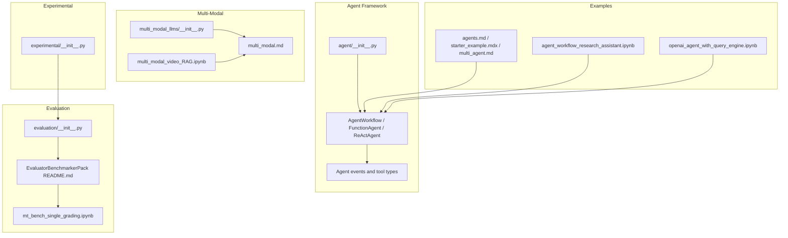
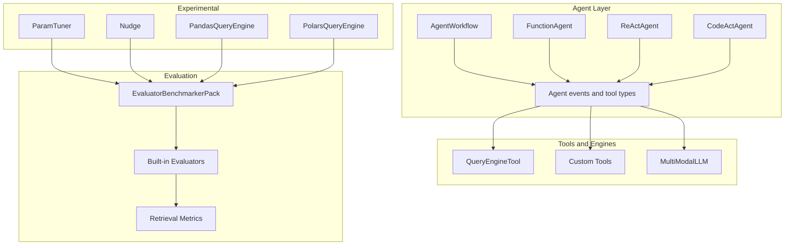
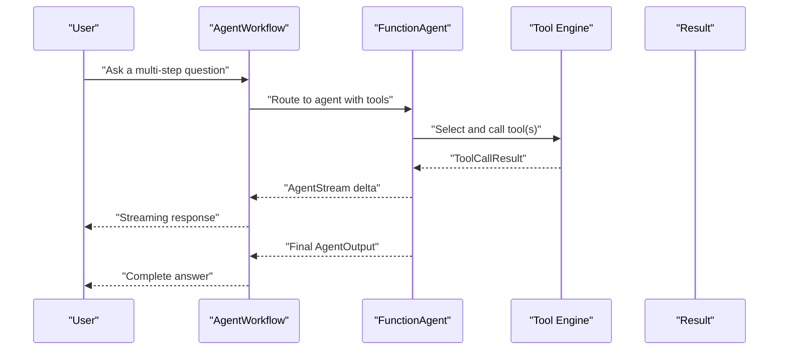
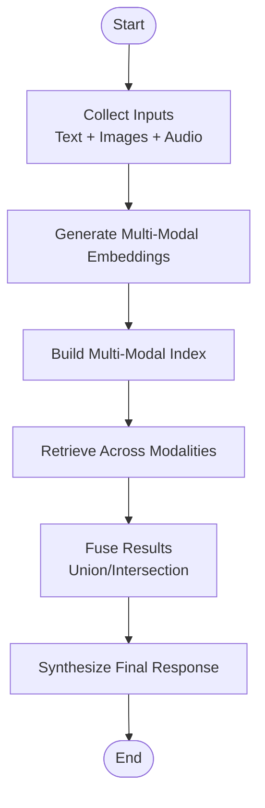
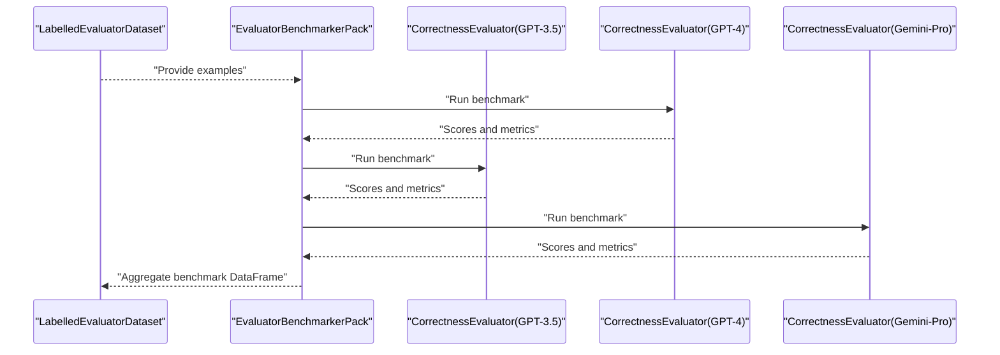
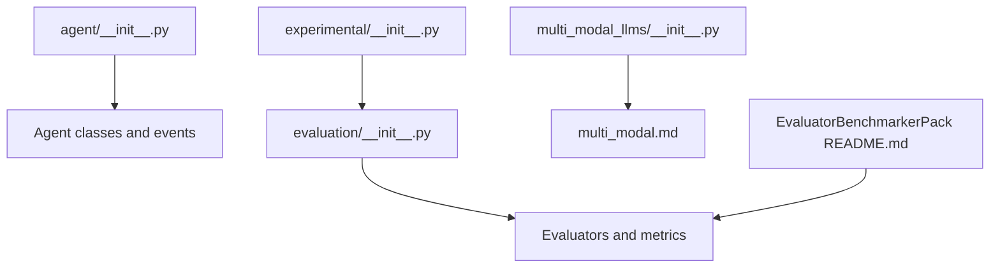

# Advanced Features

<cite>
**Referenced Files in This Document**
- [agents.md](file://docs/src/content/docs/framework/use_cases/agents.md)
- [starter_example.mdx](file://docs/src/content/docs/framework/getting_started/starter_example.mdx)
- [multi_agent.md](file://docs/src/content/docs/framework/understanding/agent/multi_agent.md)
- [multi_modal.md](file://docs/src/content/docs/framework/understanding/multi_modal.md)
- [agent_workflow_research_assistant.ipynb](file://docs/examples/agent/agent_workflow_research_assistant.ipynb)
- [openai_agent_with_query_engine.ipynb](file://docs/examples/agent/openai_agent_with_query_engine.ipynb)
- [multi_modal_video_RAG.ipynb](file://docs/examples/multi_modal/multi_modal_video_RAG.ipynb)
- [mt_bench_single_grading.ipynb](file://docs/examples/evaluation/mt_bench_single_grading.ipynb)
- [EvaluatorBenchmarkerPack README.md](file://llama-index-packs/llama-index-packs-evaluator-benchmarker/README.md)
- [evaluation/__init__.py](file://llama-index-core/llama_index/core/evaluation/__init__.py)
- [agent/__init__.py](file://llama-index-core/llama_index/core/agent/__init__.py)
- [multi_modal_llms/__init__.py](file://llama-index-core/llama_index/core/multi_modal_llms/__init__.py)
- [experimental/__init__.py](file://llama-index-experimental/llama_index/experimental/__init__.py)
</cite>

## Table of Contents
1. [Introduction](#introduction)
2. [Project Structure](#project-structure)
3. [Core Components](#core-components)
4. [Architecture Overview](#architecture-overview)
5. [Detailed Component Analysis](#detailed-component-analysis)
6. [Dependency Analysis](#dependency-analysis)
7. [Performance Considerations](#performance-considerations)
8. [Troubleshooting Guide](#troubleshooting-guide)
9. [Conclusion](#conclusion)
10. [Appendices](#appendices)

## Introduction
This document presents the advanced features of LlamaIndex beyond basic Retrieval-Augmented Generation (RAG). It focuses on:
- Agent framework: agent architectures, tool integration, workflow orchestration, and custom agent development
- Multi-modal processing: image retrieval, audio processing, mixed-media applications, and extending to custom modalities
- Evaluation and benchmarking: built-in evaluators, custom metrics, benchmark datasets, and performance optimization
- Experimental features and cutting-edge capabilities
- Practical examples for research assistants, customer support agents, content creation tools, and specialized multi-modal applications
- Advanced patterns for scaling, optimization, and production deployment
- Security considerations, privacy controls, and compliance requirements

## Project Structure
LlamaIndex organizes advanced capabilities across core modules, examples, and packs:
- Agent framework: agent classes, workflows, and orchestration utilities
- Multi-modal: multi-modal LLM interfaces and end-to-end workflows
- Evaluation: built-in evaluators, retrieval-specific metrics, and benchmarking packs
- Experimental: cutting-edge query engines and tuning utilities
- Examples: notebooks demonstrating agents, multi-modal RAG, and evaluation pipelines

**Diagram sources**
- [agent/__init__.py](file://llama-index-core/llama_index/core/agent/__init__.py#L1-L38)
- [multi_modal.md](file://docs/src/content/docs/framework/understanding/multi_modal.md#L114-L123)
- [multi_modal_video_RAG.ipynb](file://docs/examples/multi_modal/multi_modal_video_RAG.ipynb#L1-L120)
- [evaluation/__init__.py](file://llama-index-core/llama_index/core/evaluation/__init__.py#L1-L87)
- [EvaluatorBenchmarkerPack README.md](file://llama-index-packs/llama-index-packs-evaluator-benchmarker/README.md#L22-L83)
- [mt_bench_single_grading.ipynb](file://docs/examples/evaluation/mt_bench_single_grading.ipynb#L1-L120)
- [experimental/__init__.py](file://llama-index-experimental/llama_index/experimental/__init__.py#L1-L11)
- [agents.md](file://docs/src/content/docs/framework/use_cases/agents.md#L1-L16)
- [starter_example.mdx](file://docs/src/content/docs/framework/getting_started/starter_example.mdx#L38-L84)
- [multi_agent.md](file://docs/src/content/docs/framework/understanding/agent/multi_agent.md#L80-L90)

**Section sources**
- [agent/__init__.py](file://llama-index-core/llama_index/core/agent/__init__.py#L1-L38)
- [multi_modal.md](file://docs/src/content/docs/framework/understanding/multi_modal.md#L114-L123)
- [evaluation/__init__.py](file://llama-index-core/llama_index/core/evaluation/__init__.py#L1-L87)
- [experimental/__init__.py](file://llama-index-experimental/llama_index/experimental/__init__.py#L1-L11)

## Core Components
- Agent framework
  - Agent classes: FunctionAgent, ReActAgent, CodeActAgent, AgentWorkflow, BaseWorkflowAgent
  - Tool integration: ToolCall, ToolCallResult, Agent events, structured outputs
  - Orchestration: streaming events, multi-agent patterns, orchestrator-agent-as-tool
- Multi-modal processing
  - MultiModalLLM interface and metadata
  - End-to-end workflows for text, image, and audio modalities
  - Mixed-media retrieval and synthesis
- Evaluation and benchmarking
  - Built-in evaluators: correctness, relevance, faithfulness, pairwise comparison
  - Retrieval metrics: HitRate, MRR, and metric resolution
  - Benchmarking pack for evaluator comparison
- Experimental features
  - Pandas and Polars query engines
  - Parameter tuner and nudges

**Section sources**
- [agent/__init__.py](file://llama-index-core/llama_index/core/agent/__init__.py#L1-L38)
- [multi_modal_llms/__init__.py](file://llama-index-core/llama_index/core/multi_modal_llms/__init__.py#L1-L10)
- [evaluation/__init__.py](file://llama-index-core/llama_index/core/evaluation/__init__.py#L1-L87)
- [experimental/__init__.py](file://llama-index-experimental/llama_index/experimental/__init__.py#L1-L11)

## Architecture Overview
The advanced architecture integrates agents, tools, and multi-modal capabilities with robust evaluation and experimental features.

**Diagram sources**
- [agent/__init__.py](file://llama-index-core/llama_index/core/agent/__init__.py#L1-L38)
- [evaluation/__init__.py](file://llama-index-core/llama_index/core/evaluation/__init__.py#L1-L87)
- [EvaluatorBenchmarkerPack README.md](file://llama-index-packs/llama-index-packs-evaluator-benchmarker/README.md#L22-L83)
- [experimental/__init__.py](file://llama-index-experimental/llama_index/experimental/__init__.py#L1-L11)

## Detailed Component Analysis

### Agent Framework
- Agent architectures
  - FunctionAgent: suitable for function-calling LLMs; integrates tools and orchestrates execution
  - ReActAgent: plan, act, observe loop for non-function-calling LLMs
  - CodeActAgent: code-centric agent for reproducible, executable outputs
  - AgentWorkflow: orchestration with streaming events, structured outputs, and multi-agent patterns
- Tool integration
  - ToolCall and ToolCallResult encapsulate tool invocation and results
  - QueryEngineTool and custom tools enable modular, reusable capabilities
- Workflow management
  - Streaming events enable real-time progress and transparency
  - Orchestrator-agent-as-tools pattern centralizes decision-making while leveraging sub-agents as tools

**Diagram sources**
- [agents.md](file://docs/src/content/docs/framework/use_cases/agents.md#L1-L16)
- [starter_example.mdx](file://docs/src/content/docs/framework/getting_started/starter_example.mdx#L38-L84)
- [agent/__init__.py](file://llama-index-core/llama_index/core/agent/__init__.py#L1-L38)

Practical examples:
- Basic agent with a calculator tool
- Agent workflow for research assistance integrating browser tools and search
- Agent with query engine tools for financial data retrieval

**Section sources**
- [agents.md](file://docs/src/content/docs/framework/use_cases/agents.md#L1-L16)
- [starter_example.mdx](file://docs/src/content/docs/framework/getting_started/starter_example.mdx#L38-L84)
- [multi_agent.md](file://docs/src/content/docs/framework/understanding/agent/multi_agent.md#L80-L90)
- [agent_workflow_research_assistant.ipynb](file://docs/examples/agent/agent_workflow_research_assistant.ipynb#L1-L253)
- [openai_agent_with_query_engine.ipynb](file://docs/examples/agent/openai_agent_with_query_engine.ipynb#L1-L279)
- [agent/__init__.py](file://llama-index-core/llama_index/core/agent/__init__.py#L1-L38)

### Multi-Modal Processing
- MultiModalLLM interface and metadata support heterogeneous inputs
- End-to-end workflows for text, image, and audio modalities
- Mixed-media retrieval and synthesis across modalities
- Practical example: multi-modal video RAG combining CLIP embeddings, image/audio/text retrieval, and synthesis

**Diagram sources**
- [multi_modal.md](file://docs/src/content/docs/framework/understanding/multi_modal.md#L114-L123)
- [multi_modal_video_RAG.ipynb](file://docs/examples/multi_modal/multi_modal_video_RAG.ipynb#L1-L120)

Practical examples:
- Multi-modal video RAG with CLIP embeddings and LanceDB
- Multi-modal retrieval with mixed media sources

**Section sources**
- [multi_modal.md](file://docs/src/content/docs/framework/understanding/multi_modal.md#L114-L123)
- [multi_modal_video_RAG.ipynb](file://docs/examples/multi_modal/multi_modal_video_RAG.ipynb#L1-L120)
- [multi_modal_llms/__init__.py](file://llama-index-core/llama_index/core/multi_modal_llms/__init__.py#L1-L10)

### Evaluation and Benchmarking
- Built-in evaluators
  - Correctness, Faithfulness, Answer Relevancy, Context Relevancy, Relevancy, Pairwise Comparison, Semantic Similarity
  - Retrieval-specific evaluators and metrics (HitRate, MRR)
- Benchmarking pack
  - EvaluatorBenchmarkerPack for comparative evaluation against reference evaluators
  - Metrics include number_examples, invalid_predictions, correlation, MAE, Hamming distance
- Example pipeline
  - Mini MT-Bench single grading dataset with GPT-3.5, GPT-4, and Gemini-Pro evaluators

**Diagram sources**
- [EvaluatorBenchmarkerPack README.md](file://llama-index-packs/llama-index-packs-evaluator-benchmarker/README.md#L22-L83)
- [mt_bench_single_grading.ipynb](file://docs/examples/evaluation/mt_bench_single_grading.ipynb#L276-L281)

Practical example:
- Comparative benchmarking of evaluators on a mini MT-Bench dataset

**Section sources**
- [evaluation/__init__.py](file://llama-index-core/llama_index/core/evaluation/__init__.py#L1-L87)
- [EvaluatorBenchmarkerPack README.md](file://llama-index-packs/llama-index-packs-evaluator-benchmarker/README.md#L22-L83)
- [mt_bench_single_grading.ipynb](file://docs/examples/evaluation/mt_bench_single_grading.ipynb#L276-L281)

### Experimental Features and Cutting-Edge Capabilities
- PandasQueryEngine and PolarsQueryEngine for dataframe-centric query engines
- ParamTuner for hyperparameter tuning
- Nudge for adaptive prompting and feedback loops
- Integration with evaluation and benchmarking for performance optimization

**Section sources**
- [experimental/__init__.py](file://llama-index-experimental/llama_index/experimental/__init__.py#L1-L11)

### Practical Examples
- Research assistant agent
  - AgentWorkflow with browser tools and DuckDuckGo search
  - Streaming progress and synthesized results
- Customer support agent
  - FunctionAgent with query engine tools for domain-specific retrieval
  - Structured tool usage and contextual synthesis
- Content creation tools
  - Multi-modal video RAG synthesizing text, images, and audio
- Specialized multi-modal applications
  - Mixed-media retrieval and fusion across text, image, and audio

**Section sources**
- [agent_workflow_research_assistant.ipynb](file://docs/examples/agent/agent_workflow_research_assistant.ipynb#L1-L253)
- [openai_agent_with_query_engine.ipynb](file://docs/examples/agent/openai_agent_with_query_engine.ipynb#L1-L279)
- [multi_modal_video_RAG.ipynb](file://docs/examples/multi_modal/multi_modal_video_RAG.ipynb#L1-L120)

## Dependency Analysis
The advanced features rely on cohesive APIs and modular integrations:
- Agent framework depends on tool schemas and event streams
- Multi-modal builds on embedding and indexing abstractions
- Evaluation leverages dataset abstractions and metric computation
- Experimental features integrate with evaluation for optimization

**Diagram sources**
- [agent/__init__.py](file://llama-index-core/llama_index/core/agent/__init__.py#L1-L38)
- [evaluation/__init__.py](file://llama-index-core/llama_index/core/evaluation/__init__.py#L1-L87)
- [experimental/__init__.py](file://llama-index-experimental/llama_index/experimental/__init__.py#L1-L11)
- [multi_modal_llms/__init__.py](file://llama-index-core/llama_index/core/multi_modal_llms/__init__.py#L1-L10)
- [EvaluatorBenchmarkerPack README.md](file://llama-index-packs/llama-index-packs-evaluator-benchmarker/README.md#L22-L83)

**Section sources**
- [agent/__init__.py](file://llama-index-core/llama_index/core/agent/__init__.py#L1-L38)
- [evaluation/__init__.py](file://llama-index-core/llama_index/core/evaluation/__init__.py#L1-L87)
- [experimental/__init__.py](file://llama-index-experimental/llama_index/experimental/__init__.py#L1-L11)
- [EvaluatorBenchmarkerPack README.md](file://llama-index-packs/llama-index-packs-evaluator-benchmarker/README.md#L22-L83)

## Performance Considerations
- Agent orchestration
  - Prefer streaming events for responsiveness and progress visibility
  - Use structured outputs to reduce parsing overhead
- Multi-modal retrieval
  - Optimize embedding backends and vector stores for hybrid retrieval
  - Fuse results via intersection/union strategies aligned with downstream needs
- Evaluation
  - Cache judge responses for rate-limited LLMs
  - Batch predictions judiciously to balance throughput and cost
- Experimental features
  - Use Pandas/Polars engines for dataframe-heavy workloads
  - Tune parameters with ParamTuner to improve accuracy and latency

[No sources needed since this section provides general guidance]

## Troubleshooting Guide
- Agent tool invocation failures
  - Inspect ToolCallResult deltas and logs for tool errors
  - Validate tool schemas and parameter serialization
- Multi-modal indexing issues
  - Confirm embedding models and vector store configurations
  - Verify mixed-media preprocessing (images, audio transcription)
- Evaluation pipeline errors
  - Check dataset loading and evaluator alignment
  - Monitor rate limits and cache invalidations
- Experimental feature stability
  - Validate engine compatibility and metric consistency
  - Use small batches to isolate regressions

**Section sources**
- [mt_bench_single_grading.ipynb](file://docs/examples/evaluation/mt_bench_single_grading.ipynb#L347-L358)
- [openai_agent_with_query_engine.ipynb](file://docs/examples/agent/openai_agent_with_query_engine.ipynb#L242-L255)

## Conclusion
LlamaIndex’s advanced features enable sophisticated agentic systems, robust multi-modal processing, comprehensive evaluation, and experimental capabilities. By leveraging agent workflows, modular tools, multi-modal embeddings, and benchmarking frameworks—combined with performance optimizations and production-ready patterns—you can build scalable, secure, and compliant AI applications tailored to complex domains.

[No sources needed since this section summarizes without analyzing specific files]

## Appendices
- Security and privacy
  - Restrict tool access and enforce least-privilege patterns
  - Sanitize inputs and outputs; apply guardrails for sensitive domains
  - Encrypt persistent artifacts and vector stores
- Compliance
  - Audit tool usage and agent decisions
  - Log streaming events and structured outputs for traceability
  - Align evaluation metrics with domain-specific compliance goals

[No sources needed since this section provides general guidance]