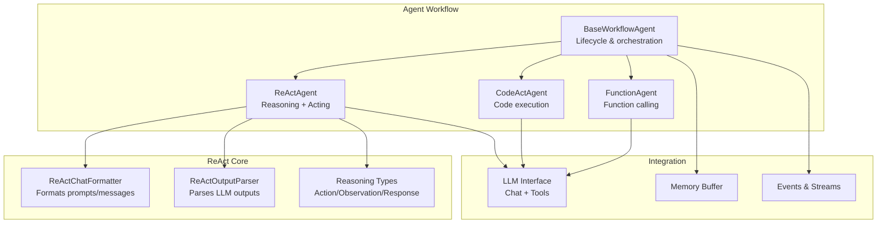
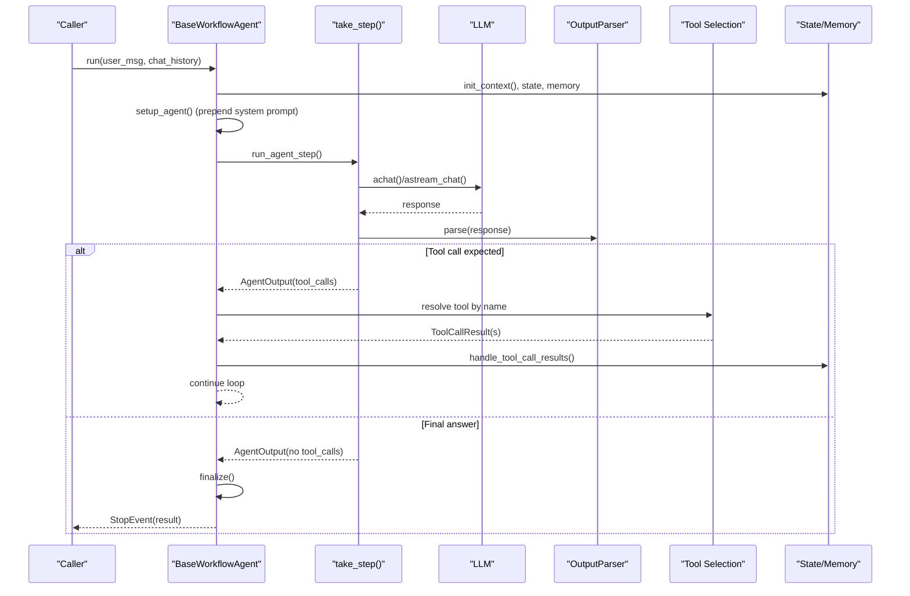
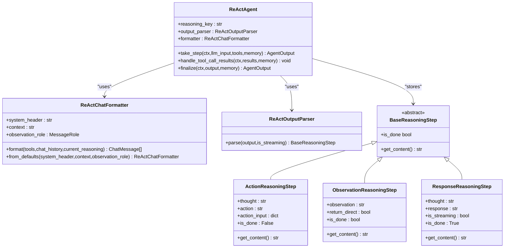
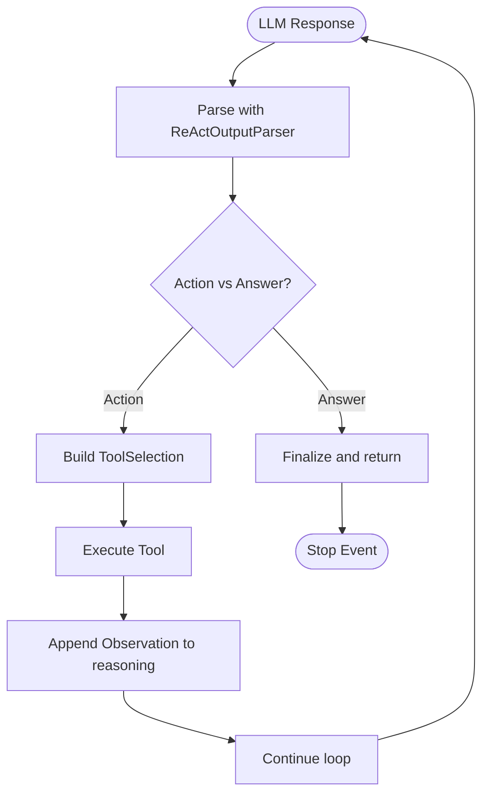
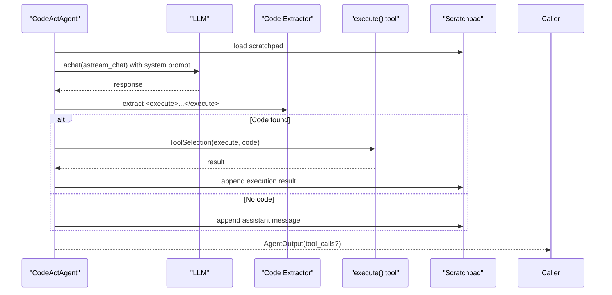
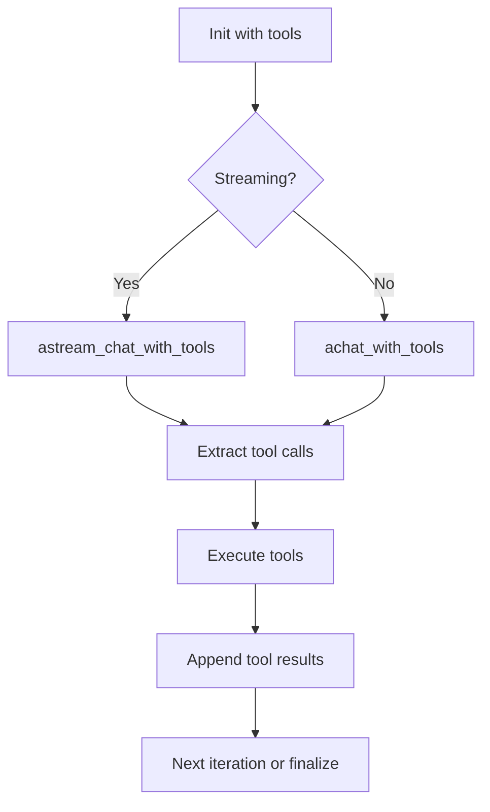
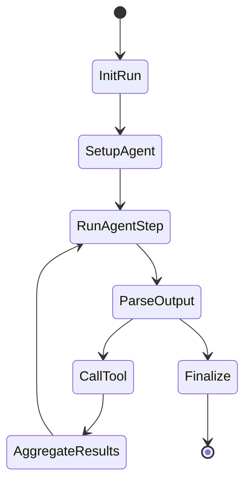
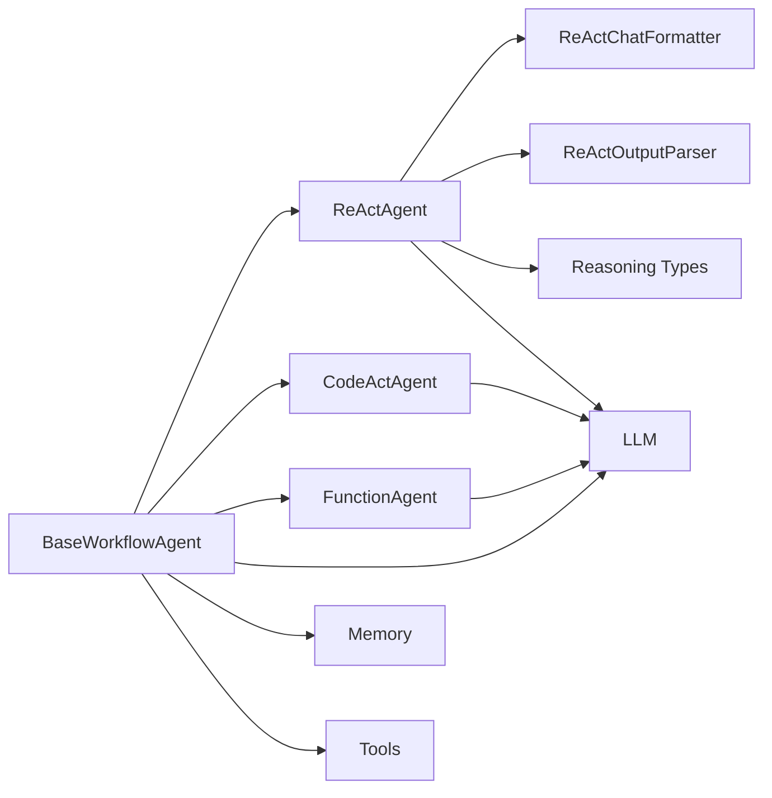

# Agent Architectures and Types

<cite>
**Referenced Files in This Document**
- [react_agent.py](file://llama-index-core/llama_index/core/agent/workflow/react_agent.py)
- [codeact_agent.py](file://llama-index-core/llama_index/core/agent/workflow/codeact_agent.py)
- [function_agent.py](file://llama-index-core/llama_index/core/agent/workflow/function_agent.py)
- [base_agent.py](file://llama-index-core/llama_index/core/agent/workflow/base_agent.py)
- [formatter.py](file://llama-index-core/llama_index/core/agent/react/formatter.py)
- [output_parser.py](file://llama-index-core/llama_index/core/agent/react/output_parser.py)
- [types.py](file://llama-index-core/llama_index/core/agent/react/types.py)
- [llm.py](file://llama-index-core/llama_index/core/llms/llm.py)
- [test_react_agent.py](file://llama-index-core/tests/agent/workflow/test_react_agent.py)
- [test_single_agent_workflow.py](file://llama-index-core/tests/agent/workflow/test_single_agent_workflow.py)
- [react_agent.ipynb](file://docs/examples/workflow/react_agent.ipynb)
</cite>

## Table of Contents
1. [Introduction](#introduction)
2. [Project Structure](#project-structure)
3. [Core Components](#core-components)
4. [Architecture Overview](#architecture-overview)
5. [Detailed Component Analysis](#detailed-component-analysis)
6. [Dependency Analysis](#dependency-analysis)
7. [Performance Considerations](#performance-considerations)
8. [Troubleshooting Guide](#troubleshooting-guide)
9. [Conclusion](#conclusion)

## Introduction
This document explains the agent architectures and types in the LlamaIndex framework. It focuses on:
- ReAct agents with reasoning and acting cycles, including ReActChatFormatter and ReActOutputParser
- CodeAct agents for code execution tasks
- Function agents for structured function calling
- Agent selection criteria, use cases, and performance characteristics
- Practical examples for instantiation, configuration, and execution
- Lifecycle management, state handling, and error recovery mechanisms

## Project Structure
The agent implementations live under the agent workflow subsystem and integrate with the broader workflow runtime. Core modules include:
- Base workflow agent infrastructure
- ReAct agent with formatter and output parser
- CodeAct agent for code execution
- Function agent for function calling
- Tests and examples demonstrating usage

**Diagram sources**
- [base_agent.py](file://llama-index-core/llama_index/core/agent/workflow/base_agent.py#L83-L252)
- [react_agent.py](file://llama-index-core/llama_index/core/agent/workflow/react_agent.py#L36-L301)
- [codeact_agent.py](file://llama-index-core/llama_index/core/agent/workflow/codeact_agent.py#L62-L400)
- [function_agent.py](file://llama-index-core/llama_index/core/agent/workflow/function_agent.py#L18-L196)
- [formatter.py](file://llama-index-core/llama_index/core/agent/react/formatter.py#L51-L141)
- [output_parser.py](file://llama-index-core/llama_index/core/agent/react/output_parser.py#L69-L128)
- [types.py](file://llama-index-core/llama_index/core/agent/react/types.py#L9-L76)

**Section sources**
- [base_agent.py](file://llama-index-core/llama_index/core/agent/workflow/base_agent.py#L83-L252)
- [react_agent.py](file://llama-index-core/llama_index/core/agent/workflow/react_agent.py#L36-L301)
- [codeact_agent.py](file://llama-index-core/llama_index/core/agent/workflow/codeact_agent.py#L62-L400)
- [function_agent.py](file://llama-index-core/llama_index/core/agent/workflow/function_agent.py#L18-L196)
- [formatter.py](file://llama-index-core/llama_index/core/agent/react/formatter.py#L51-L141)
- [output_parser.py](file://llama-index-core/llama_index/core/agent/react/output_parser.py#L69-L128)
- [types.py](file://llama-index-core/llama_index/core/agent/react/types.py#L9-L76)

## Core Components
- BaseWorkflowAgent: Provides shared lifecycle, state, memory, tool orchestration, streaming, and error handling. It defines abstract hooks for take_step, handle_tool_call_results, and finalize.
- ReActAgent: Implements the ReAct pattern with a reasoning chain (Thought → Action → Observation → Answer). Uses ReActChatFormatter and ReActOutputParser.
- CodeActAgent: Executes code generated by the LLM using a dedicated execute tool and maintains a scratchpad of conversation history plus code execution results.
- FunctionAgent: Performs structured function calling via LLM function/tool APIs, supporting parallel or sequential tool calls.

Key capabilities:
- Prompt management and updates
- Streaming deltas and structured outputs
- Early stopping and max iteration handling
- Handoff and return-direct semantics
- Tool discovery via static tools or retriever

**Section sources**
- [base_agent.py](file://llama-index-core/llama_index/core/agent/workflow/base_agent.py#L83-L252)
- [react_agent.py](file://llama-index-core/llama_index/core/agent/workflow/react_agent.py#L36-L301)
- [codeact_agent.py](file://llama-index-core/llama_index/core/agent/workflow/codeact_agent.py#L62-L400)
- [function_agent.py](file://llama-index-core/llama_index/core/agent/workflow/function_agent.py#L18-L196)

## Architecture Overview
The agents are workflow-based, orchestrated by BaseWorkflowAgent. Each agent type plugs into the lifecycle:
- Initialization and context setup
- Formatting input (including system prompts and tool descriptions)
- LLM inference (with optional streaming)
- Parsing tool calls or final answers
- Tool execution and aggregation
- Finalization and memory persistence

**Diagram sources**
- [base_agent.py](file://llama-index-core/llama_index/core/agent/workflow/base_agent.py#L424-L711)
- [react_agent.py](file://llama-index-core/llama_index/core/agent/workflow/react_agent.py#L116-L232)
- [function_agent.py](file://llama-index-core/llama_index/core/agent/workflow/function_agent.py#L100-L145)
- [codeact_agent.py](file://llama-index-core/llama_index/core/agent/workflow/codeact_agent.py#L261-L349)

## Detailed Component Analysis

### ReAct Agent Pattern
The ReAct agent alternates between reasoning and acting:
- Formatting: ReActChatFormatter composes system headers, tool descriptions, and prior reasoning into a chat list.
- Reasoning: ReActOutputParser interprets LLM outputs into ActionReasoningStep or ResponseReasoningStep.
- Acting: Selected tool is executed; ObservationReasoningStep is appended to reasoning.
- Loop until ResponseReasoningStep is reached.

**Diagram sources**
- [react_agent.py](file://llama-index-core/llama_index/core/agent/workflow/react_agent.py#L36-L301)
- [formatter.py](file://llama-index-core/llama_index/core/agent/react/formatter.py#L51-L141)
- [output_parser.py](file://llama-index-core/llama_index/core/agent/react/output_parser.py#L69-L128)
- [types.py](file://llama-index-core/llama_index/core/agent/react/types.py#L9-L76)

**Diagram sources**
- [react_agent.py](file://llama-index-core/llama_index/core/agent/workflow/react_agent.py#L116-L232)
- [output_parser.py](file://llama-index-core/llama_index/core/agent/react/output_parser.py#L69-L128)
- [types.py](file://llama-index-core/llama_index/core/agent/react/types.py#L22-L76)

Practical usage highlights:
- Prompt customization via update_prompts and get_prompts
- Streaming deltas forwarded to event streams
- Retry messages for malformed outputs

**Section sources**
- [react_agent.py](file://llama-index-core/llama_index/core/agent/workflow/react_agent.py#L64-L114)
- [output_parser.py](file://llama-index-core/llama_index/core/agent/react/output_parser.py#L69-L128)
- [test_react_agent.py](file://llama-index-core/tests/agent/workflow/test_react_agent.py#L6-L27)

### CodeAct Agent
The CodeAct agent specializes in generating and executing code:
- Adds an execute tool dynamically
- Builds a system prompt with tool descriptions
- Extracts code from XML-style tags and executes it
- Maintains a scratchpad of conversation and execution results
- Supports handoff via function-calling LLM when configured

**Diagram sources**
- [codeact_agent.py](file://llama-index-core/llama_index/core/agent/workflow/codeact_agent.py#L261-L349)

Key behaviors:
- Validates tool types and rejects unsupported tools
- Enforces function-tool signatures without context requirements
- Streams deltas and thinking deltas when supported
- Persists scratchpad to memory on finalize

**Section sources**
- [codeact_agent.py](file://llama-index-core/llama_index/core/agent/workflow/codeact_agent.py#L62-L400)

### Function Agent
The Function agent performs structured function calling:
- Requires a function-calling LLM
- Optionally enforces initial tool choice and parallel tool calls
- Streams tool calls alongside text deltas
- Handles return-direct semantics and handoff

**Diagram sources**
- [function_agent.py](file://llama-index-core/llama_index/core/agent/workflow/function_agent.py#L100-L145)

**Section sources**
- [function_agent.py](file://llama-index-core/llama_index/core/agent/workflow/function_agent.py#L18-L196)

### BaseWorkflowAgent: Lifecycle, State, and Error Recovery
BaseWorkflowAgent orchestrates the entire lifecycle:
- Context initialization (memory, state, max iterations, early stopping)
- Input formatting with system prompt and state injection
- Step execution, tool call orchestration, and result aggregation
- Structured output generation via structured_output_fn or output_cls
- Error handling and retries via retry_messages

**Diagram sources**
- [base_agent.py](file://llama-index-core/llama_index/core/agent/workflow/base_agent.py#L370-L711)

**Section sources**
- [base_agent.py](file://llama-index-core/llama_index/core/agent/workflow/base_agent.py#L83-L252)
- [base_agent.py](file://llama-index-core/llama_index/core/agent/workflow/base_agent.py#L424-L711)

## Dependency Analysis
- ReActAgent depends on ReActChatFormatter and ReActOutputParser for prompt formatting and output parsing.
- All agents depend on BaseWorkflowAgent for lifecycle, memory, and tool orchestration.
- CodeActAgent depends on a provided code_execute_fn and adds an execute tool.
- FunctionAgent depends on a function-calling LLM and supports parallel tool calls.
- BaseWorkflowAgent integrates with LLMs, memory, tools, and the workflow runtime.

**Diagram sources**
- [base_agent.py](file://llama-index-core/llama_index/core/agent/workflow/base_agent.py#L83-L252)
- [react_agent.py](file://llama-index-core/llama_index/core/agent/workflow/react_agent.py#L36-L301)
- [codeact_agent.py](file://llama-index-core/llama_index/core/agent/workflow/codeact_agent.py#L62-L400)
- [function_agent.py](file://llama-index-core/llama_index/core/agent/workflow/function_agent.py#L18-L196)
- [formatter.py](file://llama-index-core/llama_index/core/agent/react/formatter.py#L51-L141)
- [output_parser.py](file://llama-index-core/llama_index/core/agent/react/output_parser.py#L69-L128)
- [types.py](file://llama-index-core/llama_index/core/agent/react/types.py#L9-L76)

**Section sources**
- [base_agent.py](file://llama-index-core/llama_index/core/agent/workflow/base_agent.py#L83-L252)
- [react_agent.py](file://llama-index-core/llama_index/core/agent/workflow/react_agent.py#L36-L301)
- [codeact_agent.py](file://llama-index-core/llama_index/core/agent/workflow/codeact_agent.py#L62-L400)
- [function_agent.py](file://llama-index-core/llama_index/core/agent/workflow/function_agent.py#L18-L196)

## Performance Considerations
- Streaming: Enable streaming for long-running agents to reduce latency and improve responsiveness. BaseWorkflowAgent and agents forward deltas to the event stream.
- Tool parallelism: FunctionAgent supports allow_parallel_tool_calls to reduce total latency when tools are independent.
- Early stopping: Configure early_stopping_method to either raise on max iterations or generate a final response to bound runtime.
- Memory: Persist intermediate messages to memory on finalize to avoid recomputation and maintain continuity.
- Prompt caching: ReActAgent exposes prompt retrieval/update to reuse and customize system headers efficiently.

[No sources needed since this section provides general guidance]

## Troubleshooting Guide
Common issues and remedies:
- Malformed ReAct output: ReActAgent returns retry_messages with guidance to correct formatting.
- Missing function-calling LLM: FunctionAgent raises an error if the LLM is not a function-calling model.
- Unsupported tools in CodeActAgent: Rejects non-FunctionTool and tools requiring context.
- Tool not found: BaseWorkflowAgent emits an error ToolOutput when a tool name is unresolved.
- Max iterations exceeded: Early stopping either raises an error or generates a final response depending on configuration.

**Section sources**
- [react_agent.py](file://llama-index-core/llama_index/core/agent/workflow/react_agent.py#L162-L195)
- [function_agent.py](file://llama-index-core/llama_index/core/agent/workflow/function_agent.py#L108-L109)
- [codeact_agent.py](file://llama-index-core/llama_index/core/agent/workflow/codeact_agent.py#L124-L147)
- [base_agent.py](file://llama-index-core/llama_index/core/agent/workflow/base_agent.py#L620-L644)
- [base_agent.py](file://llama-index-core/llama_index/core/agent/workflow/base_agent.py#L524-L529)

## Practical Examples and Execution Patterns
- ReAct agent instantiation and execution:
  - See notebook example for constructing tools and running the agent.
  - Tests demonstrate prompt customization and update_prompts behavior.

- Function agent with calculator tools:
  - Fixture builds a ReActAgent with FunctionTool-based arithmetic functions and a mock function-calling LLM.

- LLM integration:
  - Base LLM methods construct ReActAgent instances and drive the workflow with memory and chat history.

**Section sources**
- [react_agent.ipynb](file://docs/examples/workflow/react_agent.ipynb#L411-L461)
- [test_react_agent.py](file://llama-index-core/tests/agent/workflow/test_react_agent.py#L6-L27)
- [test_single_agent_workflow.py](file://llama-index-core/tests/agent/workflow/test_single_agent_workflow.py#L61-L85)
- [llm.py](file://llama-index-core/llama_index/core/llms/llm.py#L800-L830)
- [llm.py](file://llama-index-core/llama_index/core/llms/llm.py#L870-L902)

## Agent Selection Criteria and Use Cases
- Choose ReActAgent when:
  - You need transparent reasoning traces (Thought → Action → Observation → Answer)
  - You want flexible tool usage with explicit reasoning steps
  - You need robust parsing of mixed text and tool-use outputs

- Choose CodeActAgent when:
  - Tasks require iterative code generation and execution
  - You have a safe execution environment for dynamic code
  - You want to combine natural language with executable artifacts

- Choose FunctionAgent when:
  - You rely on native function/tool calling of the LLM
  - You need structured, typed tool invocation
  - You want to leverage parallel tool execution for throughput

- Consider BaseWorkflowAgent features when:
  - You need streaming, structured outputs, and state management
  - You require handoff and return-direct semantics
  - You need robust error handling and retry mechanisms

[No sources needed since this section provides general guidance]

## Conclusion
LlamaIndex offers a cohesive agent architecture built on a shared workflow foundation. ReActAgent excels at interpretability and iterative reasoning, CodeActAgent at code-centric tasks, and FunctionAgent at structured tool calling. Together with BaseWorkflowAgent’s lifecycle, state, and error-handling capabilities, these agents provide a flexible toolkit for diverse AI-assisted workflows.