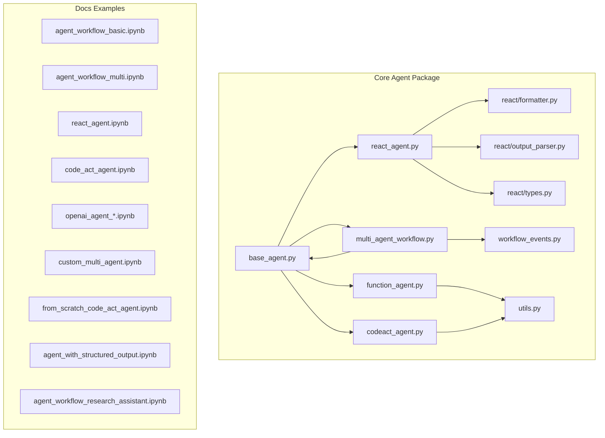
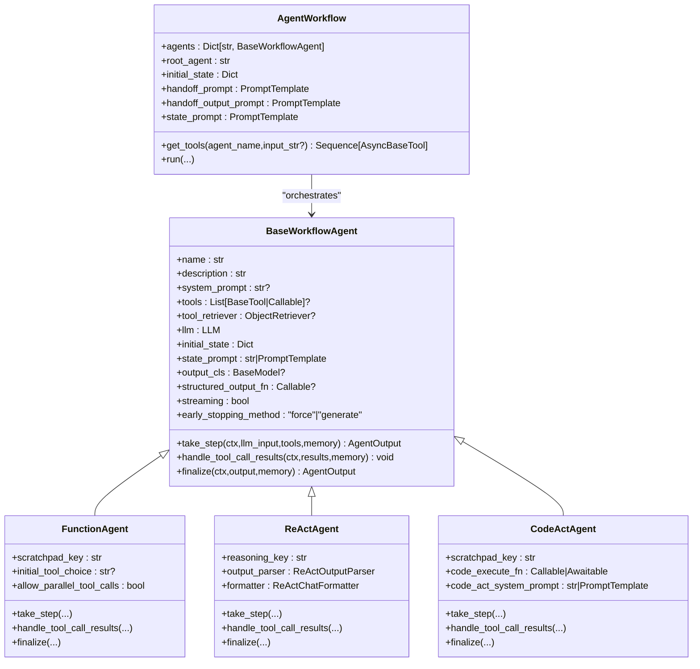
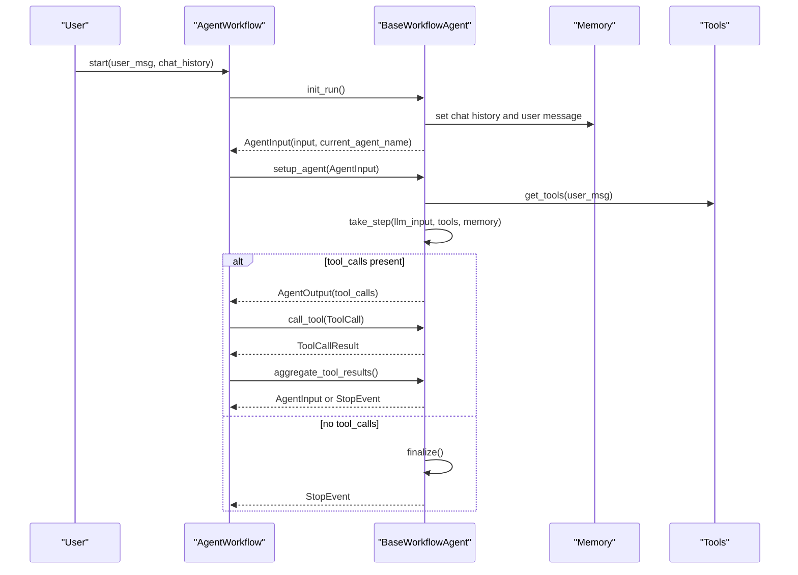
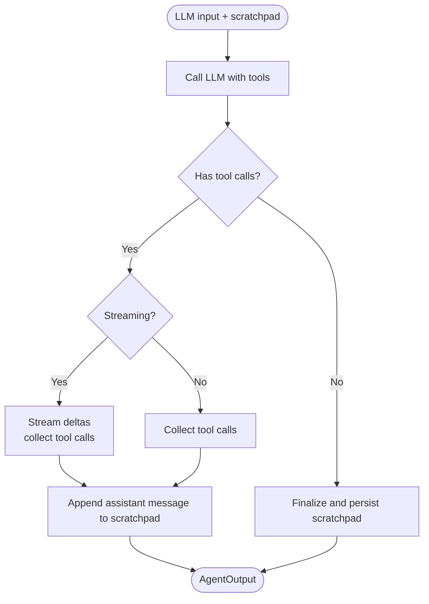
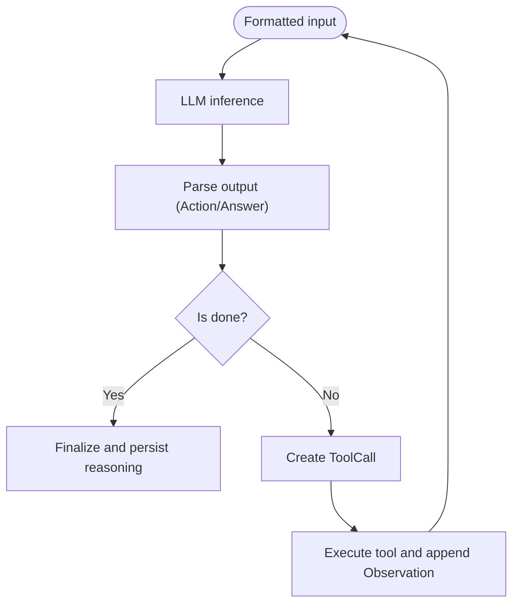
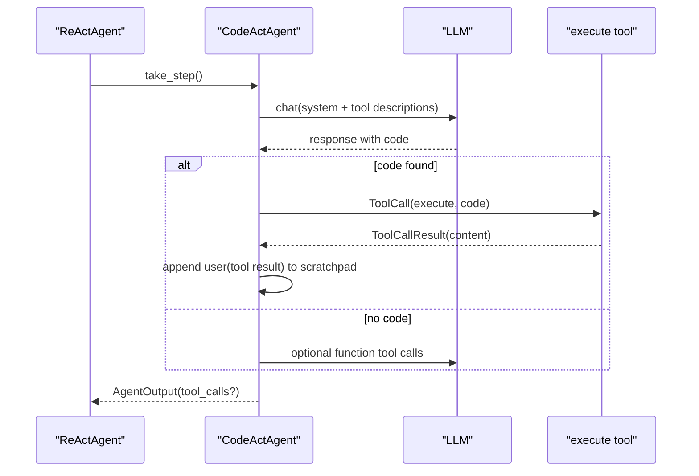
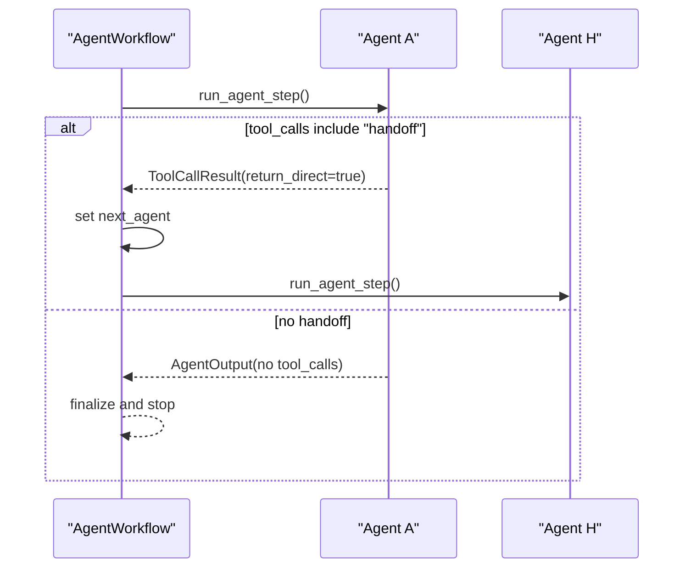
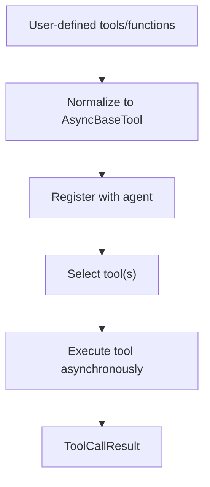
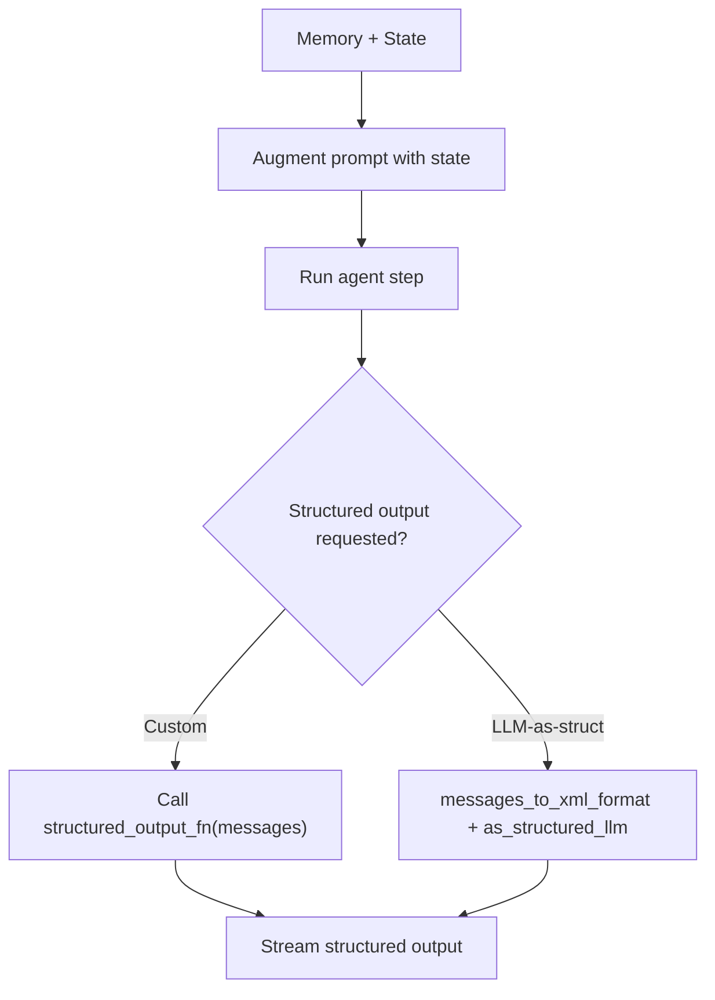
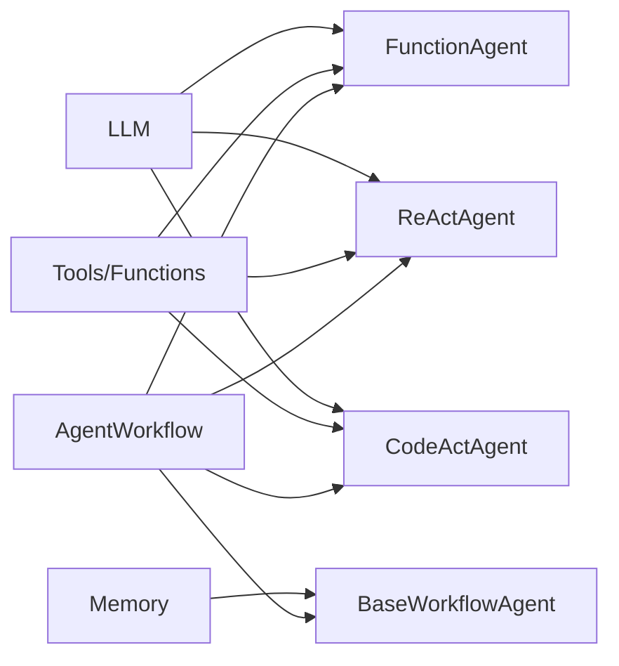

# Agent Framework

<cite>
**Referenced Files in This Document**
- [__init__.py](file://llama-index-core/llama_index/core/agent/__init__.py)
- [base_agent.py](file://llama-index-core/llama_index/core/agent/workflow/base_agent.py)
- [function_agent.py](file://llama-index-core/llama_index/core/agent/workflow/function_agent.py)
- [codeact_agent.py](file://llama-index-core/llama_index/core/agent/workflow/codeact_agent.py)
- [react_agent.py](file://llama-index-core/llama_index/core/agent/workflow/react_agent.py)
- [multi_agent_workflow.py](file://llama-index-core/llama_index/core/agent/workflow/multi_agent_workflow.py)
- [workflow_events.py](file://llama-index-core/llama_index/core/agent/workflow/workflow_events.py)
- [formatter.py](file://llama-index-core/llama_index/core/agent/react/formatter.py)
- [output_parser.py](file://llama-index-core/llama_index/core/agent/react/output_parser.py)
- [types.py](file://llama-index-core/llama_index/core/agent/react/types.py)
- [utils.py](file://llama-index-core/llama_index/core/agent/utils.py)
- [index.md](file://docs/examples/agent/index.md)
- [agent_workflow_basic.ipynb](file://docs/examples/agent/agent_workflow_basic.ipynb)
- [agent_workflow_multi.ipynb](file://docs/examples/agent/agent_workflow_multi.ipynb)
- [react_agent.ipynb](file://docs/examples/agent/react_agent.ipynb)
- [react_agent_with_query_engine.ipynb](file://docs/examples/agent/react_agent_with_query_engine.ipynb)
- [code_act_agent.ipynb](file://docs/examples/agent/code_act_agent.ipynb)
- [openai_agent_with_query_engine.ipynb](file://docs/examples/agent/openai_agent_with_query_engine.ipynb)
- [openai_agent_retrieval.ipynb](file://docs/examples/agent/openai_agent_retrieval.ipynb)
- [openai_agent_context_retrieval.ipynb](file://docs/examples/agent/openai_agent_context_retrieval.ipynb)
- [openai_agent_lengthy_tools.ipynb](file://docs/examples/agent/openai_agent_lengthy_tools.ipynb)
- [openai_agent_query_cookbook.ipynb](file://docs/examples/agent/openai_agent_query_cookbook.ipynb)
- [anthropic_agent.ipynb](file://docs/examples/agent/anthropic_agent.ipynb)
- [gemini_agent.ipynb](file://docs/examples/agent/gemini_agent.ipynb)
- [mistral_agent.ipynb](file://docs/examples/agent/mistral_agent.ipynb)
- [bedrock_converse_agent.ipynb](file://docs/examples/agent/bedrock_converse_agent.ipynb)
- [nvidia_agent.ipynb](file://docs/examples/agent/nvidia_agent.ipynb)
- [custom_multi_agent.ipynb](file://docs/examples/agent/custom_multi_agent.ipynb)
- [from_scratch_code_act_agent.ipynb](file://docs/examples/agent/from_scratch_code_act_agent.ipynb)
- [agent_with_structured_output.ipynb](file://docs/examples/agent/agent_with_structured_output.ipynb)
- [agents_as_tools.ipynb](file://docs/examples/agent/agents_as_tools.ipynb)
- [return_direct_agent.ipynb](file://docs/examples/agent/return_direct_agent.ipynb)
- [agent_workflow_research_assistant.ipynb](file://docs/examples/agent/agent_workflow_research_assistant.ipynb)
- [nvidia_document_research_assistant_for_blog_creation.ipynb](file://docs/examples/agent/nvidia_document_research_assistant_for_blog_creation.ipynb)
- [nvidia_sub_question_query_engine.ipynb](file://docs/examples/agent/nvidia_sub_question_query_engine.ipynb)
- [multi_agent_workflow_with_weaviate_queryagent.ipynb](file://docs/examples/agent/multi_agent_workflow_with_weaviate_queryagent.ipynb)
- [agent_builder.ipynb](file://docs/examples/agent/agent_builder.ipynb)
</cite>

## Table of Contents
1. [Introduction](#introduction)
2. [Project Structure](#project-structure)
3. [Core Components](#core-components)
4. [Architecture Overview](#architecture-overview)
5. [Detailed Component Analysis](#detailed-component-analysis)
6. [Dependency Analysis](#dependency-analysis)
7. [Performance Considerations](#performance-considerations)
8. [Troubleshooting Guide](#troubleshooting-guide)
9. [Conclusion](#conclusion)
10. [Appendices](#appendices)

## Introduction
This document explains the LlamaIndex agent framework for building autonomous AI agents and orchestrating workflows. It covers agent architectures (ReAct agents, function-call agents, code-act agents), tool integration and function calling, workflow orchestration (including multi-agent handoffs), memory and state management, and practical examples across domains such as research assistance, customer support, and code execution. It also provides configuration guidance, performance tuning tips, debugging techniques, and security considerations for safe agent execution.

## Project Structure
The agent framework is implemented primarily under the core module’s agent package, with supporting examples and notebooks in the docs examples directory. The key areas are:
- Agent base and orchestration: workflow agents, multi-agent workflows, and shared utilities
- Agent types: ReAct, Function Calling, and CodeAct agents
- ReAct-specific formatting and parsing for reasoning traces
- Tool integration and structured output helpers
- Examples and tutorials demonstrating real-world usage

**Diagram sources**
- [base_agent.py](file://llama-index-core/llama_index/core/agent/workflow/base_agent.py#L83-L120)
- [function_agent.py](file://llama-index-core/llama_index/core/agent/workflow/function_agent.py#L18-L30)
- [react_agent.py](file://llama-index-core/llama_index/core/agent/workflow/react_agent.py#L36-L47)
- [codeact_agent.py](file://llama-index-core/llama_index/core/agent/workflow/codeact_agent.py#L62-L80)
- [multi_agent_workflow.py](file://llama-index-core/llama_index/core/agent/workflow/multi_agent_workflow.py#L96-L120)
- [workflow_events.py](file://llama-index-core/llama_index/core/agent/workflow/workflow_events.py#L24-L94)
- [formatter.py](file://llama-index-core/llama_index/core/agent/react/formatter.py#L51-L104)
- [output_parser.py](file://llama-index-core/llama_index/core/agent/react/output_parser.py#L69-L127)
- [types.py](file://llama-index-core/llama_index/core/agent/react/types.py#L9-L76)
- [utils.py](file://llama-index-core/llama_index/core/agent/utils.py#L12-L42)

**Section sources**
- [__init__.py](file://llama-index-core/llama_index/core/agent/__init__.py#L1-L38)
- [index.md](file://docs/examples/agent/index.md)

## Core Components
- BaseWorkflowAgent: Shared orchestration, memory, tool retrieval, streaming, and lifecycle hooks for all agent types.
- FunctionAgent: Uses LLM function calling to produce tool calls and manage a scratchpad of messages.
- ReActAgent: Implements explicit reasoning steps (think-action-observe-answer) with a formatter and output parser.
- CodeActAgent: Generates and executes code using a dedicated execute tool, optionally integrating with function-calling LLMs.
- AgentWorkflow: Multi-agent orchestration with handoff, shared memory, and coordinated tool availability.
- Events and Streams: Typed events for input, streaming deltas, tool calls, and structured outputs.

Key capabilities:
- Tool integration: Tools and functions are normalized to async tools, with optional retrieval via an object retriever.
- Memory: ChatMemoryBuffer by default; state stored in workflow context and optionally augmented into prompts.
- Structured outputs: Both custom functions and LLM-as-structured-output via XML formatting and schema validation.
- Streaming: Optional streaming responses with tool-call extraction for function agents.

**Section sources**
- [base_agent.py](file://llama-index-core/llama_index/core/agent/workflow/base_agent.py#L83-L139)
- [function_agent.py](file://llama-index-core/llama_index/core/agent/workflow/function_agent.py#L18-L49)
- [react_agent.py](file://llama-index-core/llama_index/core/agent/workflow/react_agent.py#L36-L78)
- [codeact_agent.py](file://llama-index-core/llama_index/core/agent/workflow/codeact_agent.py#L62-L122)
- [multi_agent_workflow.py](file://llama-index-core/llama_index/core/agent/workflow/multi_agent_workflow.py#L96-L184)
- [workflow_events.py](file://llama-index-core/llama_index/core/agent/workflow/workflow_events.py#L24-L94)
- [utils.py](file://llama-index-core/llama_index/core/agent/utils.py#L12-L42)

## Architecture Overview
The framework builds on a workflow runtime. Agents are steps in a workflow, emitting typed events and interacting with tools and memory. Multi-agent workflows dynamically switch agents and support handoffs.

**Diagram sources**
- [base_agent.py](file://llama-index-core/llama_index/core/agent/workflow/base_agent.py#L83-L139)
- [function_agent.py](file://llama-index-core/llama_index/core/agent/workflow/function_agent.py#L18-L49)
- [react_agent.py](file://llama-index-core/llama_index/core/agent/workflow/react_agent.py#L36-L78)
- [codeact_agent.py](file://llama-index-core/llama_index/core/agent/workflow/codeact_agent.py#L62-L122)
- [multi_agent_workflow.py](file://llama-index-core/llama_index/core/agent/workflow/multi_agent_workflow.py#L96-L184)

## Detailed Component Analysis

### BaseWorkflowAgent
- Responsibilities: initialization, memory setup, tool resolution, streaming LLM calls, tool invocation, iteration limits, early stopping, structured output generation, and finalize hooks.
- Key fields: name, description, system_prompt, tools/tool_retriever, llm, initial_state/state_prompt, output_cls/structured_output_fn, streaming, early_stopping_method.
- Lifecycle: init_run → setup_agent → run_agent_step → parse_agent_output → call_tool → aggregate_tool_results → loop or stop.

**Diagram sources**
- [base_agent.py](file://llama-index-core/llama_index/core/agent/workflow/base_agent.py#L370-L506)
- [multi_agent_workflow.py](file://llama-index-core/llama_index/core/agent/workflow/multi_agent_workflow.py#L378-L479)

**Section sources**
- [base_agent.py](file://llama-index-core/llama_index/core/agent/workflow/base_agent.py#L83-L139)
- [base_agent.py](file://llama-index-core/llama_index/core/agent/workflow/base_agent.py#L260-L333)
- [base_agent.py](file://llama-index-core/llama_index/core/agent/workflow/base_agent.py#L424-L506)

### FunctionAgent
- Uses LLM function calling to produce tool calls; maintains a scratchpad of messages.
- Supports initial_tool_choice and parallel tool calls.
- Handles tool results by appending tool and assistant messages to scratchpad.

**Diagram sources**
- [function_agent.py](file://llama-index-core/llama_index/core/agent/workflow/function_agent.py#L100-L145)

**Section sources**
- [function_agent.py](file://llama-index-core/llama_index/core/agent/workflow/function_agent.py#L18-L49)
- [function_agent.py](file://llama-index-core/llama_index/core/agent/workflow/function_agent.py#L100-L145)
- [function_agent.py](file://llama-index-core/llama_index/core/agent/workflow/function_agent.py#L147-L196)

### ReActAgent
- Implements explicit reasoning steps: Thought → Action → Action Input → Observation → Answer.
- Uses a formatter to combine system header, tools, chat history, and reasoning steps.
- Uses an output parser to detect tool use vs final answer and to recover from malformed outputs.

**Diagram sources**
- [react_agent.py](file://llama-index-core/llama_index/core/agent/workflow/react_agent.py#L116-L232)
- [formatter.py](file://llama-index-core/llama_index/core/agent/react/formatter.py#L65-L104)
- [output_parser.py](file://llama-index-core/llama_index/core/agent/react/output_parser.py#L69-L127)
- [types.py](file://llama-index-core/llama_index/core/agent/react/types.py#L22-L76)

**Section sources**
- [react_agent.py](file://llama-index-core/llama_index/core/agent/workflow/react_agent.py#L36-L78)
- [react_agent.py](file://llama-index-core/llama_index/core/agent/workflow/react_agent.py#L116-L232)
- [react_agent.py](file://llama-index-core/llama_index/core/agent/workflow/react_agent.py#L234-L301)
- [formatter.py](file://llama-index-core/llama_index/core/agent/react/formatter.py#L51-L104)
- [output_parser.py](file://llama-index-core/llama_index/core/agent/react/output_parser.py#L69-L127)
- [types.py](file://llama-index-core/llama_index/core/agent/react/types.py#L9-L76)

### CodeActAgent
- Generates code wrapped in special tags and executes it via a dedicated tool.
- Optionally integrates with function-calling LLMs for additional tool calls.
- Validates tool types and enforces constraints (no context-required tools).

**Diagram sources**
- [codeact_agent.py](file://llama-index-core/llama_index/core/agent/workflow/codeact_agent.py#L261-L349)

**Section sources**
- [codeact_agent.py](file://llama-index-core/llama_index/core/agent/workflow/codeact_agent.py#L62-L122)
- [codeact_agent.py](file://llama-index-core/llama_index/core/agent/workflow/codeact_agent.py#L198-L349)
- [codeact_agent.py](file://llama-index-core/llama_index/core/agent/workflow/codeact_agent.py#L351-L400)

### Multi-Agent Orchestration (AgentWorkflow)
- Manages multiple agents with a root agent and optional handoff tool.
- Provides shared memory, state, and prompt modules across agents.
- Supports early stopping and structured output generation at the workflow level.

**Diagram sources**
- [multi_agent_workflow.py](file://llama-index-core/llama_index/core/agent/workflow/multi_agent_workflow.py#L70-L90)
- [multi_agent_workflow.py](file://llama-index-core/llama_index/core/agent/workflow/multi_agent_workflow.py#L665-L743)

**Section sources**
- [multi_agent_workflow.py](file://llama-index-core/llama_index/core/agent/workflow/multi_agent_workflow.py#L96-L184)
- [multi_agent_workflow.py](file://llama-index-core/llama_index/core/agent/workflow/multi_agent_workflow.py#L245-L264)
- [multi_agent_workflow.py](file://llama-index-core/llama_index/core/agent/workflow/multi_agent_workflow.py#L665-L743)

### Tool Integration and Function Calling
- Tools/functions are normalized to async tools; reserved tool name “handoff” is enforced.
- FunctionAgent uses LLM-provided tool calls; ReActAgent parses explicit reasoning steps; CodeActAgent generates code and may call additional tools.
- Tool selection and execution are streamed for FunctionAgent.

**Diagram sources**
- [base_agent.py](file://llama-index-core/llama_index/core/agent/workflow/base_agent.py#L193-L220)
- [base_agent.py](file://llama-index-core/llama_index/core/agent/workflow/base_agent.py#L334-L368)
- [function_agent.py](file://llama-index-core/llama_index/core/agent/workflow/function_agent.py#L100-L145)

**Section sources**
- [base_agent.py](file://llama-index-core/llama_index/core/agent/workflow/base_agent.py#L193-L220)
- [base_agent.py](file://llama-index-core/llama_index/core/agent/workflow/base_agent.py#L334-L368)
- [function_agent.py](file://llama-index-core/llama_index/core/agent/workflow/function_agent.py#L100-L145)

### Structured Outputs and State Persistence
- Structured output: either a custom function or LLM-as-structured-output via XML formatting and schema validation.
- State: maintained in workflow context and optionally injected into prompts to guide agent decisions.

**Diagram sources**
- [base_agent.py](file://llama-index-core/llama_index/core/agent/workflow/base_agent.py#L556-L591)
- [utils.py](file://llama-index-core/llama_index/core/agent/utils.py#L12-L42)

**Section sources**
- [base_agent.py](file://llama-index-core/llama_index/core/agent/workflow/base_agent.py#L115-L130)
- [base_agent.py](file://llama-index-core/llama_index/core/agent/workflow/base_agent.py#L556-L591)
- [utils.py](file://llama-index-core/llama_index/core/agent/utils.py#L12-L42)

### Practical Examples and Use Cases
- Research assistant: multi-step retrieval and synthesis with ReAct or function agents.
- Customer support: multi-agent handoff with contextual state and conversation history.
- Code execution: CodeActAgent with a safe execution function and optional tool integration.
- Domain agents: specialized agents with tailored system prompts and tool sets.

Examples in the repository demonstrate:
- Basic and multi-agent workflows
- ReAct and function-agent configurations
- CodeAct usage with and without query engines
- Structured outputs and agent-as-tool patterns

**Section sources**
- [agent_workflow_basic.ipynb](file://docs/examples/agent/agent_workflow_basic.ipynb)
- [agent_workflow_multi.ipynb](file://docs/examples/agent/agent_workflow_multi.ipynb)
- [react_agent.ipynb](file://docs/examples/agent/react_agent.ipynb)
- [react_agent_with_query_engine.ipynb](file://docs/examples/agent/react_agent_with_query_engine.ipynb)
- [code_act_agent.ipynb](file://docs/examples/agent/code_act_agent.ipynb)
- [openai_agent_with_query_engine.ipynb](file://docs/examples/agent/openai_agent_with_query_engine.ipynb)
- [openai_agent_retrieval.ipynb](file://docs/examples/agent/openai_agent_retrieval.ipynb)
- [openai_agent_context_retrieval.ipynb](file://docs/examples/agent/openai_agent_context_retrieval.ipynb)
- [openai_agent_lengthy_tools.ipynb](file://docs/examples/agent/openai_agent_lengthy_tools.ipynb)
- [openai_agent_query_cookbook.ipynb](file://docs/examples/agent/openai_agent_query_cookbook.ipynb)
- [anthropic_agent.ipynb](file://docs/examples/agent/anthropic_agent.ipynb)
- [gemini_agent.ipynb](file://docs/examples/agent/gemini_agent.ipynb)
- [mistral_agent.ipynb](file://docs/examples/agent/mistral_agent.ipynb)
- [bedrock_converse_agent.ipynb](file://docs/examples/agent/bedrock_converse_agent.ipynb)
- [nvidia_agent.ipynb](file://docs/examples/agent/nvidia_agent.ipynb)
- [custom_multi_agent.ipynb](file://docs/examples/agent/custom_multi_agent.ipynb)
- [from_scratch_code_act_agent.ipynb](file://docs/examples/agent/from_scratch_code_act_agent.ipynb)
- [agent_with_structured_output.ipynb](file://docs/examples/agent/agent_with_structured_output.ipynb)
- [agents_as_tools.ipynb](file://docs/examples/agent/agents_as_tools.ipynb)
- [return_direct_agent.ipynb](file://docs/examples/agent/return_direct_agent.ipynb)
- [agent_workflow_research_assistant.ipynb](file://docs/examples/agent/agent_workflow_research_assistant.ipynb)
- [nvidia_document_research_assistant_for_blog_creation.ipynb](file://docs/examples/agent/nvidia_document_research_assistant_for_blog_creation.ipynb)
- [nvidia_sub_question_query_engine.ipynb](file://docs/examples/agent/nvidia_sub_question_query_engine.ipynb)
- [multi_agent_workflow_with_weaviate_queryagent.ipynb](file://docs/examples/agent/multi_agent_workflow_with_weaviate_queryagent.ipynb)
- [agent_builder.ipynb](file://docs/examples/agent/agent_builder.ipynb)

## Dependency Analysis
- Coupling: Agents depend on LLMs, tools, memory, and workflow runtime. Multi-agent workflow centralizes tool availability and handoff logic.
- Cohesion: Each agent encapsulates its own reasoning/formatting/parsing logic while sharing common orchestration via BaseWorkflowAgent.
- External integrations: Tools and LLMs are the primary external dependencies; memory and prompts are configurable.

**Diagram sources**
- [base_agent.py](file://llama-index-core/llama_index/core/agent/workflow/base_agent.py#L83-L139)
- [function_agent.py](file://llama-index-core/llama_index/core/agent/workflow/function_agent.py#L18-L49)
- [react_agent.py](file://llama-index-core/llama_index/core/agent/workflow/react_agent.py#L36-L78)
- [codeact_agent.py](file://llama-index-core/llama_index/core/agent/workflow/codeact_agent.py#L62-L122)
- [multi_agent_workflow.py](file://llama-index-core/llama_index/core/agent/workflow/multi_agent_workflow.py#L96-L184)

**Section sources**
- [base_agent.py](file://llama-index-core/llama_index/core/agent/workflow/base_agent.py#L83-L139)
- [multi_agent_workflow.py](file://llama-index-core/llama_index/core/agent/workflow/multi_agent_workflow.py#L96-L184)

## Performance Considerations
- Streaming: Enable streaming for long-running agents to improve perceived latency; ensure the LLM supports streaming.
- Parallel tool calls: FunctionAgent allows parallel tool execution to reduce total latency when tools are independent.
- Early stopping: Choose “generate” method to produce a final response instead of raising an error at iteration limits.
- Prompt augmentation: Keep state prompt concise; avoid excessive context that inflates token usage.
- Tool normalization: Prefer lightweight tools and avoid unnecessary context injection to reduce overhead.

[No sources needed since this section provides general guidance]

## Troubleshooting Guide
Common issues and remedies:
- Empty or malformed ReAct output: The ReAct output parser returns retry messages to guide the LLM to correct formatting.
- Tool not found: Tool lookup failures return error ToolOutputs; verify tool names and availability.
- Max iterations exceeded: Increase max_iterations or use early_stopping_method="generate".
- Structured output validation errors: The structured output stream warns on validation failures; adjust the schema or function accordingly.
- Handoff misconfiguration: Ensure handoff tool is available and that can_handoff_to lists are consistent.

**Section sources**
- [react_agent.py](file://llama-index-core/llama_index/core/agent/workflow/react_agent.py#L186-L195)
- [base_agent.py](file://llama-index-core/llama_index/core/agent/workflow/base_agent.py#L518-L529)
- [workflow_events.py](file://llama-index-core/llama_index/core/agent/workflow/workflow_events.py#L49-L67)
- [multi_agent_workflow.py](file://llama-index-core/llama_index/core/agent/workflow/multi_agent_workflow.py#L70-L90)

## Conclusion
The LlamaIndex agent framework provides a robust, extensible foundation for building autonomous agents. With ReAct, function-calling, and code-execution agents, integrated tooling, multi-agent orchestration, and strong memory/state support, it enables practical solutions across diverse domains. By leveraging streaming, structured outputs, and careful configuration, teams can achieve responsive, reliable, and secure agent systems.

[No sources needed since this section summarizes without analyzing specific files]

## Appendices

### Agent Configuration Options
- BaseWorkflowAgent: name, description, system_prompt, tools, tool_retriever, can_handoff_to, llm, initial_state, state_prompt, output_cls, structured_output_fn, streaming, early_stopping_method.
- FunctionAgent: scratchpad_key, initial_tool_choice, allow_parallel_tool_calls.
- ReActAgent: reasoning_key, output_parser, formatter.
- CodeActAgent: scratchpad_key, code_execute_fn, code_act_system_prompt.
- AgentWorkflow: agents, root_agent, initial_state, handoff_prompt, handoff_output_prompt, state_prompt, output_cls, structured_output_fn, early_stopping_method.

**Section sources**
- [base_agent.py](file://llama-index-core/llama_index/core/agent/workflow/base_agent.py#L90-L139)
- [function_agent.py](file://llama-index-core/llama_index/core/agent/workflow/function_agent.py#L21-L29)
- [react_agent.py](file://llama-index-core/llama_index/core/agent/workflow/react_agent.py#L39-L46)
- [codeact_agent.py](file://llama-index-core/llama_index/core/agent/workflow/codeact_agent.py#L67-L80)
- [multi_agent_workflow.py](file://llama-index-core/llama_index/core/agent/workflow/multi_agent_workflow.py#L99-L113)

### Security Considerations
- Code execution: Limit execution scope and sanitize inputs; validate and constrain the code_execute_fn to prevent arbitrary code execution.
- Tool access control: Restrict tool availability per agent; avoid exposing sensitive tools unless necessary.
- Prompt injection: Use strict state_prompt and handoff prompts; validate inputs and avoid echoing untrusted content.
- Structured output: Validate schemas and handle conversion warnings to prevent downstream misuse.

[No sources needed since this section provides general guidance]