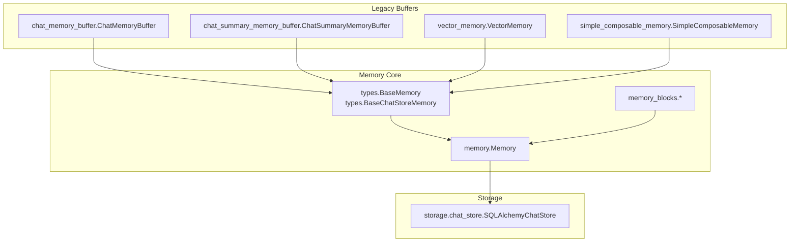
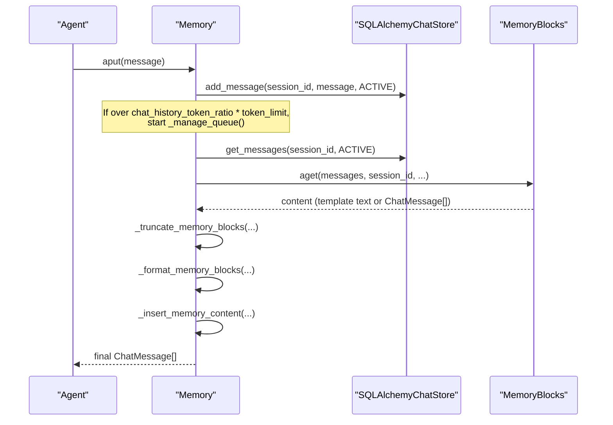
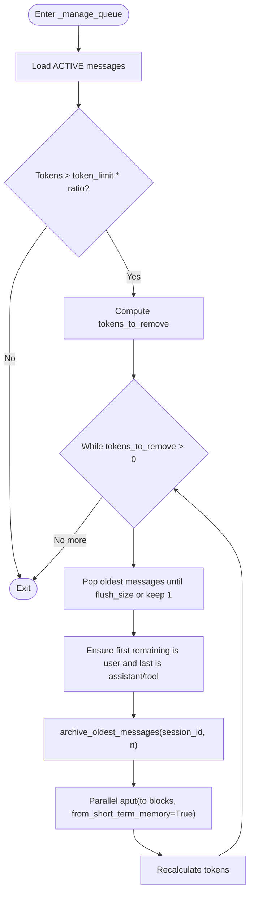
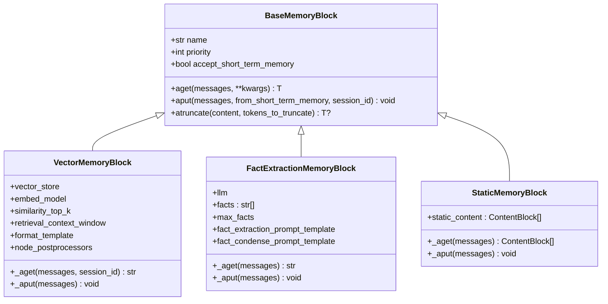
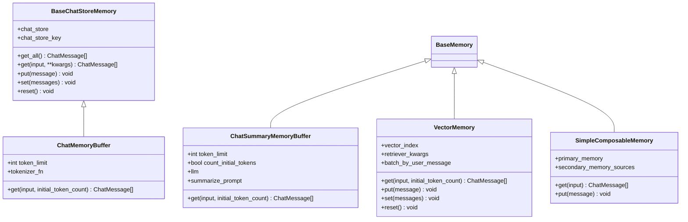
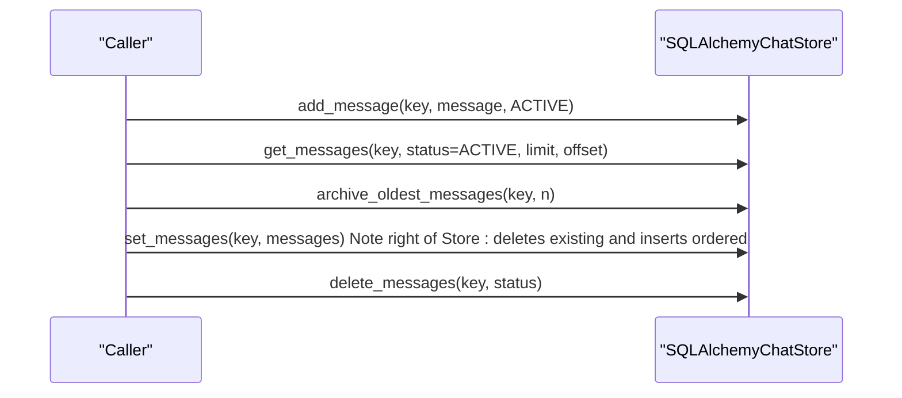
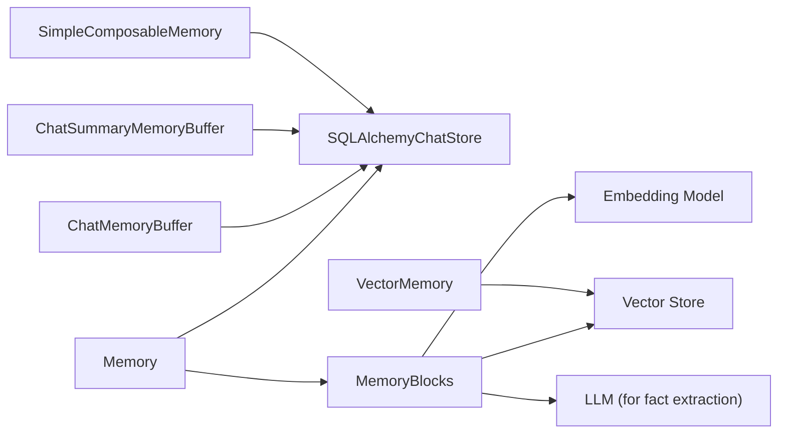

# Agent Memory and State Persistence

<cite>
**Referenced Files in This Document**
- [memory/__init__.py](file://llama-index-core/llama_index/core/memory/__init__.py)
- [memory/types.py](file://llama-index-core/llama_index/core/memory/types.py)
- [memory/chat_memory_buffer.py](file://llama-index-core/llama_index/core/memory/chat_memory_buffer.py)
- [memory/chat_summary_memory_buffer.py](file://llama-index-core/llama_index/core/memory/chat_summary_memory_buffer.py)
- [memory/vector_memory.py](file://llama-index-core/llama_index/core/memory/vector_memory.py)
- [memory/simple_composable_memory.py](file://llama-index-core/llama_index/core/memory/simple_composable_memory.py)
- [memory/memory.py](file://llama-index-core/llama_index/core/memory/memory.py)
- [memory/memory_blocks/vector.py](file://llama-index-core/llama_index/core/memory/memory_blocks/vector.py)
- [memory/memory_blocks/fact.py](file://llama-index-core/llama_index/core/memory/memory_blocks/fact.py)
- [memory/memory_blocks/static.py](file://llama-index-core/llama_index/core/memory/memory_blocks/static.py)
- [storage/chat_store/sql.py](file://llama-index-core/llama_index/core/storage/chat_store/sql.py)
</cite>

## Table of Contents
1. [Introduction](#introduction)
2. [Project Structure](#project-structure)
3. [Core Components](#core-components)
4. [Architecture Overview](#architecture-overview)
5. [Detailed Component Analysis](#detailed-component-analysis)
6. [Dependency Analysis](#dependency-analysis)
7. [Performance Considerations](#performance-considerations)
8. [Troubleshooting Guide](#troubleshooting-guide)
9. [Conclusion](#conclusion)
10. [Appendices](#appendices)

## Introduction
This document explains agent memory systems and state persistence in LlamaIndex with a focus on:
- Conversation history buffers: ChatMemoryBuffer and ChatSummaryMemoryBuffer
- Long-term knowledge retention via vector-based memory blocks
- Memory orchestration with Memory and memory blocks
- Storage backends and retrieval strategies
- Summarization, context window management, and optimization patterns
- Practical examples for persistent conversations, knowledge retention, and personalized behavior
- Security, privacy, cleanup, and external storage integration

## Project Structure
The memory subsystem centers around:
- Core memory abstractions and implementations
- Memory blocks for specialized knowledge types
- A unified Memory orchestrator backed by a SQL chat store
- Legacy buffers retained for backward compatibility

**Diagram sources**
- [memory/types.py](file://llama-index-core/llama_index/core/memory/types.py#L14-L153)
- [memory/memory.py](file://llama-index-core/llama_index/core/memory/memory.py#L179-L800)
- [memory/memory_blocks/vector.py](file://llama-index-core/llama_index/core/memory/memory_blocks/vector.py#L29-L202)
- [memory/chat_memory_buffer.py](file://llama-index-core/llama_index/core/memory/chat_memory_buffer.py#L19-L167)
- [memory/chat_summary_memory_buffer.py](file://llama-index-core/llama_index/core/memory/chat_summary_memory_buffer.py#L26-L341)
- [memory/vector_memory.py](file://llama-index-core/llama_index/core/memory/vector_memory.py#L48-L207)
- [memory/simple_composable_memory.py](file://llama-index-core/llama_index/core/memory/simple_composable_memory.py#L14-L164)
- [storage/chat_store/sql.py](file://llama-index-core/llama_index/core/storage/chat_store/sql.py#L35-L457)

**Section sources**
- [memory/__init__.py](file://llama-index-core/llama_index/core/memory/__init__.py#L1-L27)

## Core Components
- Base abstractions define the contract for memory operations (get/put/set/reset) and chat-store-backed memories.
- Memory orchestrates a FIFO queue, enforces token budgets, and injects content from memory blocks into prompts.
- Memory blocks encapsulate specialized retrieval and extraction strategies (vector, facts, static).
- Storage is handled by SQLAlchemyChatStore with status tracking for efficient queue management.

Key responsibilities:
- Token budgeting and context window management
- Conversation integrity during trimming (preserving complete turns)
- Injection of memory content into system or user messages
- Asynchronous operations and session scoping

**Section sources**
- [memory/types.py](file://llama-index-core/llama_index/core/memory/types.py#L14-L153)
- [memory/memory.py](file://llama-index-core/llama_index/core/memory/memory.py#L179-L800)
- [storage/chat_store/sql.py](file://llama-index-core/llama_index/core/storage/chat_store/sql.py#L35-L457)

## Architecture Overview
The Memory orchestrator coordinates:
- An active chat history stored in a SQL table with status tracking
- A waterfall mechanism that moves older messages to memory blocks when token limits are reached
- Retrieval and formatting of memory block content into templates or chat messages
- Injection into the final prompt via system or user insertion modes

**Diagram sources**
- [memory/memory.py](file://llama-index-core/llama_index/core/memory/memory.py#L607-L800)
- [storage/chat_store/sql.py](file://llama-index-core/llama_index/core/storage/chat_store/sql.py#L222-L404)
- [memory/memory_blocks/vector.py](file://llama-index-core/llama_index/core/memory/memory_blocks/vector.py#L100-L202)

## Detailed Component Analysis

### Memory Orchestration (Memory)
- Maintains a FIFO queue with token budgeting and a flush size for efficient trimming.
- Preserves conversation integrity by keeping complete user-assistant-tool turns together.
- Waterfalls trimmed messages to memory blocks and archives them for later retrieval.
- Supports injection of memory content into system or user messages via a template.

**Diagram sources**
- [memory/memory.py](file://llama-index-core/llama_index/core/memory/memory.py#L655-L794)
- [storage/chat_store/sql.py](file://llama-index-core/llama_index/core/storage/chat_store/sql.py#L370-L404)

**Section sources**
- [memory/memory.py](file://llama-index-core/llama_index/core/memory/memory.py#L179-L800)

### Memory Blocks
- VectorMemoryBlock: Encodes batches of messages into nodes and retrieves semantically similar content for contextual injection.
- FactExtractionMemoryBlock: Extracts explicit facts from conversation segments and condenses them under a cap.
- StaticMemoryBlock: Provides fixed content blocks for instructions or constants.

**Diagram sources**
- [memory/memory.py](file://llama-index-core/llama_index/core/memory/memory.py#L94-L177)
- [memory/memory_blocks/vector.py](file://llama-index-core/llama_index/core/memory/memory_blocks/vector.py#L29-L202)
- [memory/memory_blocks/fact.py](file://llama-index-core/llama_index/core/memory/memory_blocks/fact.py#L66-L177)
- [memory/memory_blocks/static.py](file://llama-index-core/llama_index/core/memory/memory_blocks/static.py#L8-L40)

**Section sources**
- [memory/memory_blocks/vector.py](file://llama-index-core/llama_index/core/memory/memory_blocks/vector.py#L29-L202)
- [memory/memory_blocks/fact.py](file://llama-index-core/llama_index/core/memory/memory_blocks/fact.py#L66-L177)
- [memory/memory_blocks/static.py](file://llama-index-core/llama_index/core/memory/memory_blocks/static.py#L8-L40)

### Legacy Buffers
- ChatMemoryBuffer: Stores chat history with token-aware trimming and supports serialization.
- ChatSummaryMemoryBuffer: Keeps recent full-text and summarizes older content using an LLM.
- VectorMemory: Backed by a vector index; stores message batches and retrieves by semantic similarity.
- SimpleComposableMemory: Composes primary and secondary memory sources into a unified history.

**Diagram sources**
- [memory/types.py](file://llama-index-core/llama_index/core/memory/types.py#L82-L153)
- [memory/chat_memory_buffer.py](file://llama-index-core/llama_index/core/memory/chat_memory_buffer.py#L19-L167)
- [memory/chat_summary_memory_buffer.py](file://llama-index-core/llama_index/core/memory/chat_summary_memory_buffer.py#L26-L341)
- [memory/vector_memory.py](file://llama-index-core/llama_index/core/memory/vector_memory.py#L48-L207)
- [memory/simple_composable_memory.py](file://llama-index-core/llama_index/core/memory/simple_composable_memory.py#L14-L164)

**Section sources**
- [memory/chat_memory_buffer.py](file://llama-index-core/llama_index/core/memory/chat_memory_buffer.py#L19-L167)
- [memory/chat_summary_memory_buffer.py](file://llama-index-core/llama_index/core/memory/chat_summary_memory_buffer.py#L26-L341)
- [memory/vector_memory.py](file://llama-index-core/llama_index/core/memory/vector_memory.py#L48-L207)
- [memory/simple_composable_memory.py](file://llama-index-core/llama_index/core/memory/simple_composable_memory.py#L14-L164)

### Storage Backend: SQLAlchemyChatStore
- Provides asynchronous CRUD operations for chat messages with status tracking.
- Supports ACTIVE and ARCHIVED statuses to enable efficient FIFO and watermarking.
- Offers methods to add, set, delete, archive, and retrieve messages with optional limits and offsets.
- Initializes tables lazily and supports schema configuration for supported databases.

**Diagram sources**
- [storage/chat_store/sql.py](file://llama-index-core/llama_index/core/storage/chat_store/sql.py#L171-L404)

**Section sources**
- [storage/chat_store/sql.py](file://llama-index-core/llama_index/core/storage/chat_store/sql.py#L35-L457)

## Dependency Analysis
- Memory depends on:
  - SQLAlchemyChatStore for durable, status-aware storage
  - Memory blocks for specialized retrieval/extraction
  - Tokenizer for token estimation
- Memory blocks depend on:
  - Vector stores for retrieval and embedding models for encoding
  - LLMs for fact extraction and summarization (indirectly via Memory)
- Legacy buffers depend on:
  - SimpleChatStore or chat store loading utilities for persistence

**Diagram sources**
- [memory/memory.py](file://llama-index-core/llama_index/core/memory/memory.py#L179-L800)
- [memory/memory_blocks/vector.py](file://llama-index-core/llama_index/core/memory/memory_blocks/vector.py#L29-L202)
- [storage/chat_store/sql.py](file://llama-index-core/llama_index/core/storage/chat_store/sql.py#L35-L457)
- [memory/chat_memory_buffer.py](file://llama-index-core/llama_index/core/memory/chat_memory_buffer.py#L19-L167)
- [memory/chat_summary_memory_buffer.py](file://llama-index-core/llama_index/core/memory/chat_summary_memory_buffer.py#L26-L341)
- [memory/vector_memory.py](file://llama-index-core/llama_index/core/memory/vector_memory.py#L48-L207)
- [memory/simple_composable_memory.py](file://llama-index-core/llama_index/core/memory/simple_composable_memory.py#L14-L164)

**Section sources**
- [memory/__init__.py](file://llama-index-core/llama_index/core/memory/__init__.py#L1-L27)

## Performance Considerations
- Token budgeting:
  - Use token_flush_size and chat_history_token_ratio to balance responsiveness and context length.
  - Prefer batched embeddings for vector memory block insertion to reduce overhead.
- Retrieval efficiency:
  - Tune similarity_top_k and retrieval_context_window to limit post-processing costs.
  - Apply node postprocessors judiciously; cache or reuse embeddings when possible.
- Queue management:
  - Conversation integrity preserves complete turns; ensure sufficient capacity to avoid frequent trimming.
- Storage:
  - Use async_database_uri or shared AsyncEngine for throughput; consider schema for multi-tenant deployments.

[No sources needed since this section provides general guidance]

## Troubleshooting Guide
Common issues and resolutions:
- Token limit exceeded:
  - Adjust token_limit, token_flush_size, or chat_history_token_ratio.
  - Verify tokenizer_fn correctness and ensure it matches the LLM’s tokenizer.
- Conversation integrity anomalies:
  - Confirm that assistant/tool messages are paired and not orphaned during trimming.
- Serialization and loading:
  - Use from_dict/from_string helpers for legacy buffers; ensure chat_store is loaded properly.
- Vector memory retrieval:
  - Ensure vector store supports delete_nodes and stores text; verify embedding model availability.
- Session scoping:
  - Set session_id consistently across a conversation to isolate retrieval and injection.

**Section sources**
- [memory/chat_memory_buffer.py](file://llama-index-core/llama_index/core/memory/chat_memory_buffer.py#L37-L50)
- [memory/chat_summary_memory_buffer.py](file://llama-index-core/llama_index/core/memory/chat_summary_memory_buffer.py#L65-L82)
- [memory/vector_memory.py](file://llama-index-core/llama_index/core/memory/vector_memory.py#L75-L88)
- [memory/memory.py](file://llama-index-core/llama_index/core/memory/memory.py#L251-L274)

## Conclusion
LlamaIndex provides a robust, extensible memory system:
- Memory orchestrates token-aware conversation history and integrates memory blocks seamlessly.
- VectorMemoryBlock enables long-term knowledge retention with semantic retrieval.
- Legacy buffers offer backward compatibility for simpler setups.
- SQLAlchemyChatStore delivers reliable persistence with status tracking and efficient operations.

[No sources needed since this section summarizes without analyzing specific files]

## Appendices

### Practical Examples and Patterns
- Persistent conversations:
  - Initialize Memory with a session_id and add messages via aput; retrieve via aget to build prompts.
  - Use chat_history_token_ratio to reserve headroom for dynamic memory blocks.
- Knowledge retention:
  - Add a VectorMemoryBlock to capture recent turns; configure similarity_top_k and retrieval_context_window.
  - Periodically archive older messages to keep the active queue lean.
- Personalized behavior:
  - Add a FactExtractionMemoryBlock to continuously extract explicit facts; cap max_facts to prevent noise.
  - Inject static instructions via StaticMemoryBlock for consistent behavior.
- Summarization and context window management:
  - For long histories, rely on ChatSummaryMemoryBuffer to summarize older content using an LLM.
  - Combine with Memory’s waterfall to keep summaries fresh and relevant.
- Security and privacy:
  - Restrict access to session_id-scoped data; avoid embedding sensitive metadata.
  - Clear or anonymize data via reset or delete_messages when appropriate.
- External storage integration:
  - Configure async_database_uri for production-grade databases; use db_schema for multi-tenant isolation.
  - For in-memory scenarios, rely on dump/load mechanisms for snapshotting and restoration.

[No sources needed since this section provides general guidance]