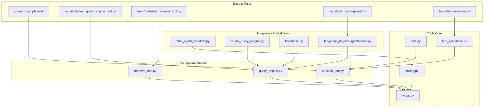
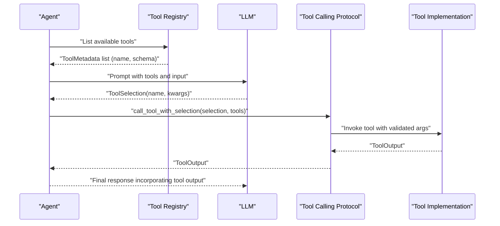
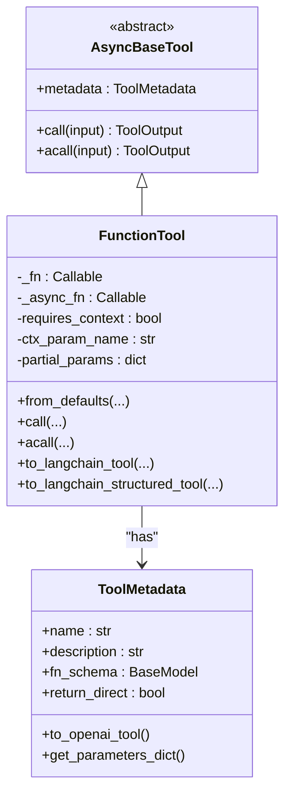
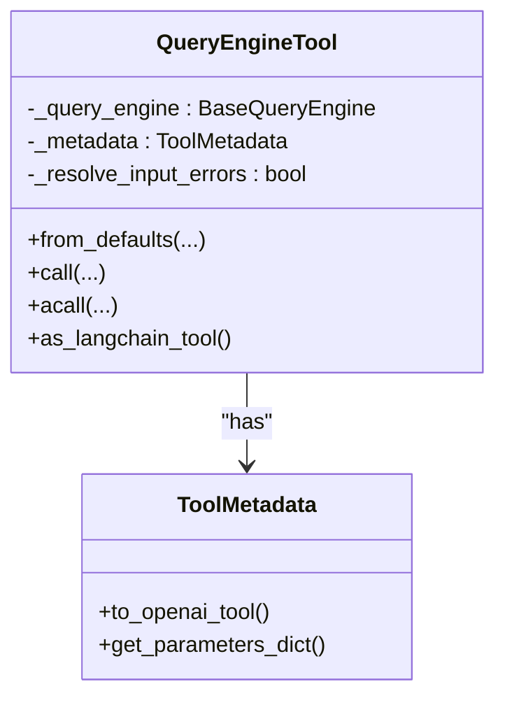
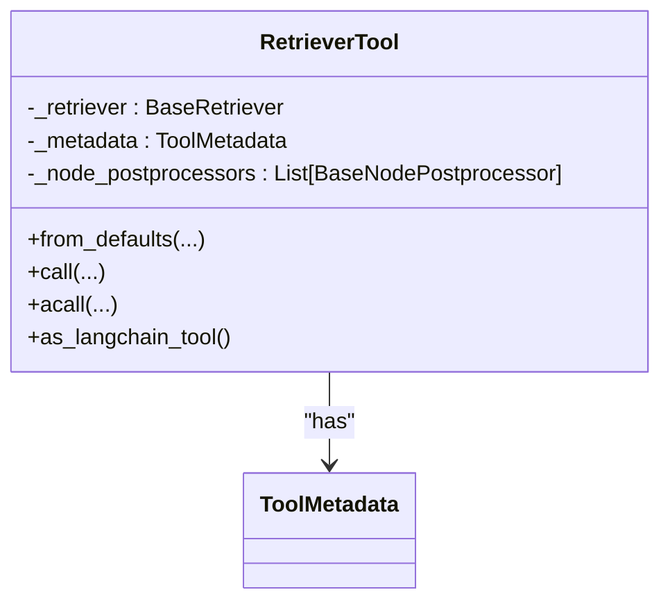
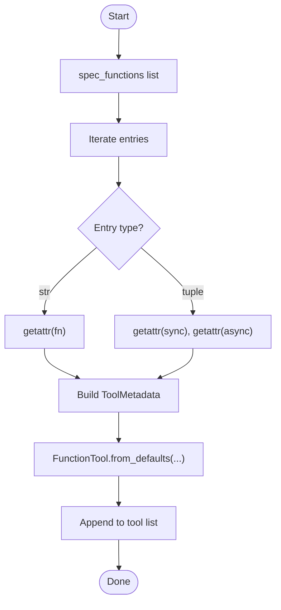
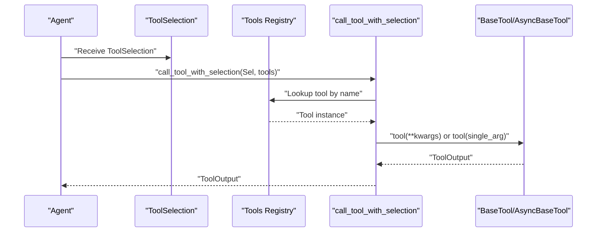
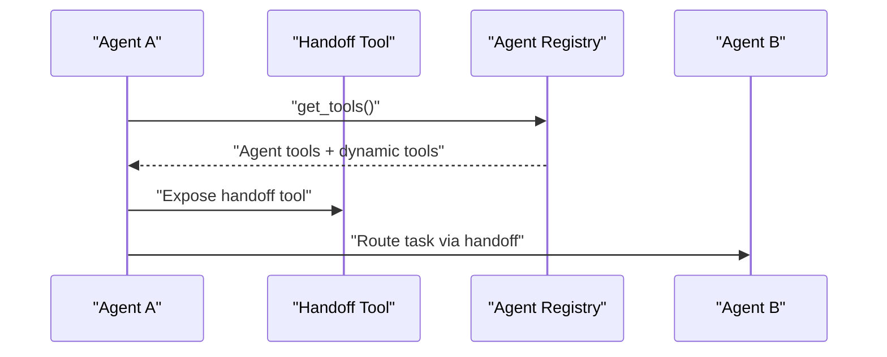
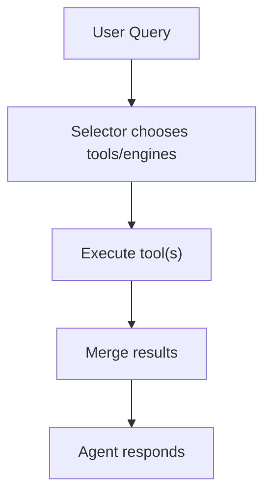
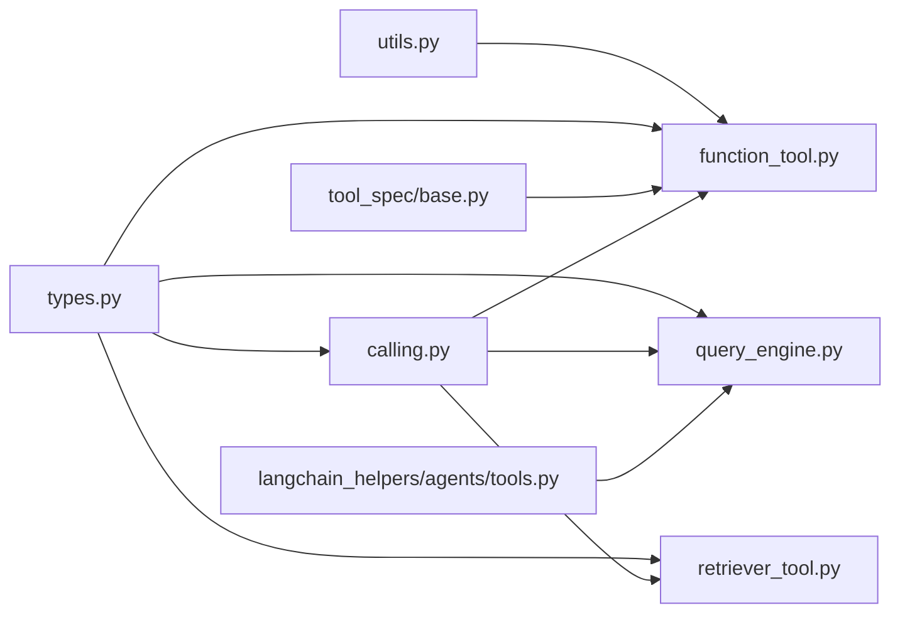

# Tool Integration and Function Calling

<cite>
**Referenced Files in This Document**
- [function_tool.py](file://llama-index-core/llama_index/core/tools/function_tool.py)
- [query_engine.py](file://llama-index-core/llama_index/core/tools/query_engine.py)
- [retriever_tool.py](file://llama-index-core/llama_index/core/tools/retriever_tool.py)
- [types.py](file://llama-index-core/llama_index/core/tools/types.py)
- [calling.py](file://llama-index-core/llama_index/core/tools/calling.py)
- [utils.py](file://llama-index-core/llama_index/core/tools/utils.py)
- [base.py](file://llama-index-core/llama_index/core/tools/tool_spec/base.py)
- [test_query_engine_tool.py](file://llama-index-core/tests/tools/test_query_engine_tool.py)
- [test_retriever_tool.py](file://llama-index-core/tests/tools/test_retriever_tool.py)
- [multi_agent_workflow.py](file://llama-index-core/llama_index/core/agent/workflow/multi_agent_workflow.py)
- [router_query_engine.py](file://llama-index-core/llama_index/core/query_engine/router_query_engine.py)
- [base.py](file://llama-index-core/llama_index/core/query_engine/flare/base.py)
- [base.py](file://llama-index-core/llama_index/core/base/base_selector.py)
- [base.py](file://llama-index-core/llama_index/core/langchain_helpers/agents/tools.py)
- [starter_example.mdx](file://docs/src/content/docs/framework/getting_started/starter_example.mdx)
- [test_tool_required.py](file://llama-index-integrations/llms/llama-index-llms-vertex/tests/test_tool_required.py)
- [base.py](file://llama-index-integrations/tools/llama-index-tools-signnow/llama_index/tools/signnow/base.py)
</cite>

## Table of Contents
1. [Introduction](#introduction)
2. [Project Structure](#project-structure)
3. [Core Components](#core-components)
4. [Architecture Overview](#architecture-overview)
5. [Detailed Component Analysis](#detailed-component-analysis)
6. [Dependency Analysis](#dependency-analysis)
7. [Performance Considerations](#performance-considerations)
8. [Troubleshooting Guide](#troubleshooting-guide)
9. [Conclusion](#conclusion)
10. [Appendices](#appendices)

## Introduction
This document explains how LlamaIndex agents integrate tools and perform function calling. It covers the abstraction layer for tools, including FunctionTool, QueryEngineTool, and RetrieverTool, along with tool specification patterns, function calling protocols, parameter validation, registration/discovery, invocation workflows, composition and chaining strategies, and practical examples. It also addresses security, rate limiting, error handling, output parsing, and integration with agent decision-making.

## Project Structure
The tool system centers around a small set of core modules under the tools package, plus supporting utilities and tests. The key areas are:
- Tool abstractions and types
- Tool implementations (FunctionTool, QueryEngineTool, RetrieverTool)
- Tool calling protocol and adapters
- Tool specification and schema generation
- Tests validating behavior and usage patterns

**Diagram sources**
- [types.py](file://llama-index-core/llama_index/core/tools/types.py#L168-L280)
- [calling.py](file://llama-index-core/llama_index/core/tools/calling.py#L1-L107)
- [utils.py](file://llama-index-core/llama_index/core/tools/utils.py#L21-L109)
- [base.py](file://llama-index-core/llama_index/core/tools/tool_spec/base.py#L64-L115)
- [function_tool.py](file://llama-index-core/llama_index/core/tools/function_tool.py#L67-L449)
- [query_engine.py](file://llama-index-core/llama_index/core/tools/query_engine.py#L17-L114)
- [retriever_tool.py](file://llama-index-core/llama_index/core/tools/retriever_tool.py#L26-L136)
- [multi_agent_workflow.py](file://llama-index-core/llama_index/core/agent/workflow/multi_agent_workflow.py#L245-L266)
- [router_query_engine.py](file://llama-index-core/llama_index/core/query_engine/router_query_engine.py#L316-L322)
- [base.py](file://llama-index-core/llama_index/core/query_engine/flare/base.py#L247-L278)
- [base.py](file://llama-index-core/llama_index/core/langchain_helpers/agents/tools.py)
- [starter_example.mdx](file://docs/src/content/docs/framework/getting_started/starter_example.mdx#L45-L84)
- [test_query_engine_tool.py](file://llama-index-core/tests/tools/test_query_engine_tool.py#L19-L46)
- [test_retriever_tool.py](file://llama-index-core/tests/tools/test_retriever_tool.py#L60-L107)
- [test_tool_required.py](file://llama-index-integrations/llms/llama-index-llms-vertex/tests/test_tool_required.py#L201-L211)
- [base.py](file://llama-index-integrations/tools/llama-index-tools-signnow/llama_index/tools/signnow/base.py#L146-L154)

**Section sources**
- [function_tool.py](file://llama-index-core/llama_index/core/tools/function_tool.py#L1-L449)
- [query_engine.py](file://llama-index-core/llama_index/core/tools/query_engine.py#L1-L114)
- [retriever_tool.py](file://llama-index-core/llama_index/core/tools/retriever_tool.py#L1-L136)
- [types.py](file://llama-index-core/llama_index/core/tools/types.py#L1-L280)
- [calling.py](file://llama-index-core/llama_index/core/tools/calling.py#L1-L107)
- [utils.py](file://llama-index-core/llama_index/core/tools/utils.py#L1-L109)
- [base.py](file://llama-index-core/llama_index/core/tools/tool_spec/base.py#L1-L115)

## Core Components
- ToolMetadata: Defines tool name, description, JSON schema for parameters, and return behavior.
- ToolOutput: Standardized output container with content blocks, raw input/output, and error flags.
- BaseTool and AsyncBaseTool: Abstract interfaces for synchronous and asynchronous tools.
- FunctionTool: Wraps arbitrary functions, auto-generates schemas, supports callbacks and context injection.
- QueryEngineTool: Bridges a BaseQueryEngine to a tool interface.
- RetrieverTool: Bridges a BaseRetriever to a tool interface with optional node postprocessing.
- Tool calling utilities: call_tool/acall_tool and selection helpers to invoke tools by name and arguments.
- Tool specification: BaseToolSpec converts class methods to FunctionTool instances with metadata.

Key capabilities:
- Parameter validation via Pydantic schemas derived from function signatures.
- Automatic schema generation and docstring parsing for parameter descriptions.
- Context-aware tool invocation with optional workflow context injection.
- Async/sync interoperability via adapters.
- Tool output normalization into content blocks for downstream processing.

**Section sources**
- [types.py](file://llama-index-core/llama_index/core/tools/types.py#L23-L104)
- [types.py](file://llama-index-core/llama_index/core/tools/types.py#L106-L166)
- [types.py](file://llama-index-core/llama_index/core/tools/types.py#L168-L280)
- [function_tool.py](file://llama-index-core/llama_index/core/tools/function_tool.py#L67-L381)
- [query_engine.py](file://llama-index-core/llama_index/core/tools/query_engine.py#L17-L114)
- [retriever_tool.py](file://llama-index-core/llama_index/core/tools/retriever_tool.py#L26-L136)
- [calling.py](file://llama-index-core/llama_index/core/tools/calling.py#L10-L107)
- [base.py](file://llama-index-core/llama_index/core/tools/tool_spec/base.py#L64-L115)
- [utils.py](file://llama-index-core/llama_index/core/tools/utils.py#L21-L109)

## Architecture Overview
The tool integration pipeline connects agents to external capabilities through a unified abstraction. Agents enumerate tools (either static or dynamically discovered), serialize tool metadata for model consumption, receive tool selections, and execute tools via a standardized calling protocol.

**Diagram sources**
- [calling.py](file://llama-index-core/llama_index/core/tools/calling.py#L63-L107)
- [types.py](file://llama-index-core/llama_index/core/tools/types.py#L168-L227)
- [function_tool.py](file://llama-index-core/llama_index/core/tools/function_tool.py#L300-L381)
- [query_engine.py](file://llama-index-core/llama_index/core/tools/query_engine.py#L68-L86)
- [retriever_tool.py](file://llama-index-core/llama_index/core/tools/retriever_tool.py#L76-L123)

## Detailed Component Analysis

### FunctionTool
FunctionTool wraps a callable (sync or async) and exposes a unified interface. It:
- Infers tool metadata from function signatures and docstrings.
- Generates a Pydantic schema for parameter validation.
- Supports callbacks to override or refine ToolOutput.
- Accepts partial parameters and injects workflow context when annotated.
- Normalizes outputs into content blocks.

**Diagram sources**
- [function_tool.py](file://llama-index-core/llama_index/core/tools/function_tool.py#L67-L381)
- [types.py](file://llama-index-core/llama_index/core/tools/types.py#L23-L104)
- [types.py](file://llama-index-core/llama_index/core/tools/types.py#L168-L227)

Key behaviors:
- Parameter extraction and schema generation via function introspection and docstring parsing.
- Context injection detection and enforcement.
- Output parsing into content blocks for multimodal compatibility.
- Callback hooks to transform results or force direct returns.

Practical usage patterns:
- Creating tools from plain functions with automatic schema inference.
- Using callbacks to post-process results or enforce return_direct semantics.
- Integrating with LangChain via conversion helpers.

**Section sources**
- [function_tool.py](file://llama-index-core/llama_index/core/tools/function_tool.py#L67-L381)
- [utils.py](file://llama-index-core/llama_index/core/tools/utils.py#L21-L109)
- [types.py](file://llama-index-core/llama_index/core/tools/types.py#L23-L104)
- [types.py](file://llama-index-core/llama_index/core/tools/types.py#L168-L227)

### QueryEngineTool
Wraps a BaseQueryEngine to behave as a tool. It:
- Accepts inputs via positional args or kwargs with a default “input” key.
- Executes synchronous and asynchronous queries.
- Returns ToolOutput with content and raw response.

**Diagram sources**
- [query_engine.py](file://llama-index-core/llama_index/core/tools/query_engine.py#L17-L114)
- [types.py](file://llama-index-core/llama_index/core/tools/types.py#L23-L104)

Behavior highlights:
- Flexible input resolution with a fallback to stringify kwargs when enabled.
- Conversion to LangChain tool for interoperability.

Validation and error handling:
- Raises explicit errors when input is missing and error resolution is disabled.

**Section sources**
- [query_engine.py](file://llama-index-core/llama_index/core/tools/query_engine.py#L17-L114)
- [test_query_engine_tool.py](file://llama-index-core/tests/tools/test_query_engine_tool.py#L19-L46)

### RetrieverTool
Wraps a BaseRetriever to expose retrieval as a tool:
- Builds a query string from args and kwargs.
- Applies optional node postprocessors.
- Aggregates node content into ToolOutput.

**Diagram sources**
- [retriever_tool.py](file://llama-index-core/llama_index/core/tools/retriever_tool.py#L26-L136)
- [types.py](file://llama-index-core/llama_index/core/tools/types.py#L23-L104)

Validation and error handling:
- Raises an error if no input is provided.
- Supports async retrieval and postprocessing.

**Section sources**
- [retriever_tool.py](file://llama-index-core/llama_index/core/tools/retriever_tool.py#L26-L136)
- [test_retriever_tool.py](file://llama-index-core/tests/tools/test_retriever_tool.py#L60-L107)

### Tool Specification Patterns and Discovery
BaseToolSpec converts class methods into FunctionTool instances:
- Supports sync-only, async-only, or paired sync/async method specs.
- Derives metadata from function names and docstrings when not provided.
- Produces lists of FunctionTool for immediate use.

**Diagram sources**
- [base.py](file://llama-index-core/llama_index/core/tools/tool_spec/base.py#L64-L115)

Dynamic discovery:
- Some integrations dynamically discover tools (e.g., MCP-based tools) and delegate to underlying specs.

**Section sources**
- [base.py](file://llama-index-core/llama_index/core/tools/tool_spec/base.py#L64-L115)
- [base.py](file://llama-index-integrations/tools/llama-index-tools-signnow/llama_index/tools/signnow/base.py#L146-L154)

### Function Calling Protocol and Invocation
The calling protocol:
- Validates parameter counts and dispatches single-arg vs multi-arg invocations.
- Adapts sync tools to async when needed.
- Captures exceptions into ToolOutput with is_error flag and exception reference.

**Diagram sources**
- [calling.py](file://llama-index-core/llama_index/core/tools/calling.py#L63-L107)
- [types.py](file://llama-index-core/llama_index/core/tools/types.py#L272-L280)

**Section sources**
- [calling.py](file://llama-index-core/llama_index/core/tools/calling.py#L10-L107)
- [types.py](file://llama-index-core/llama_index/core/tools/types.py#L272-L280)

### Tool Registration, Discovery, and Invocation Workflows
- Static registration: Tools are passed directly to agents.
- Dynamic discovery: ToolSpec-based systems produce tools on demand.
- Multi-agent handoff: Agents can expose a handoff tool to route tasks to other agents.

**Diagram sources**
- [multi_agent_workflow.py](file://llama-index-core/llama_index/core/agent/workflow/multi_agent_workflow.py#L245-L266)

**Section sources**
- [multi_agent_workflow.py](file://llama-index-core/llama_index/core/agent/workflow/multi_agent_workflow.py#L245-L266)

### Tool Composition, Conditional Selection, and Chaining
- Router query engines select among multiple query engines based on metadata and queries.
- Flare-style engines support retrieve and query modes and can chain retrieval and synthesis steps.
- Selectors wrap ToolMetadata to choose appropriate tools or engines.

**Diagram sources**
- [router_query_engine.py](file://llama-index-core/llama_index/core/query_engine/router_query_engine.py#L316-L322)
- [base.py](file://llama-index-core/llama_index/core/query_engine/flare/base.py#L247-L278)
- [base.py](file://llama-index-core/llama_index/core/base/base_selector.py#L72-L86)

**Section sources**
- [router_query_engine.py](file://llama-index-core/llama_index/core/query_engine/router_query_engine.py#L316-L322)
- [base.py](file://llama-index-core/llama_index/core/query_engine/flare/base.py#L247-L278)
- [base.py](file://llama-index-core/llama_index/core/base/base_selector.py#L72-L86)

### Practical Examples
- Basic function tool usage with an agent workflow demonstrates tool schema serialization and invocation.
- QueryEngineTool and RetrieverTool tests show supported input formats and error handling.

**Section sources**
- [starter_example.mdx](file://docs/src/content/docs/framework/getting_started/starter_example.mdx#L45-L84)
- [test_query_engine_tool.py](file://llama-index-core/tests/tools/test_query_engine_tool.py#L19-L46)
- [test_retriever_tool.py](file://llama-index-core/tests/tools/test_retriever_tool.py#L60-L107)

## Dependency Analysis
High-level dependencies:
- Tool implementations depend on ToolMetadata and ToolOutput.
- FunctionTool depends on schema generation utilities and context handling.
- Calling utilities depend on tool metadata and async adapters.
- Integrations (LangChain, Vertex) consume tool metadata and ToolSelection.

**Diagram sources**
- [utils.py](file://llama-index-core/llama_index/core/tools/utils.py#L21-L109)
- [function_tool.py](file://llama-index-core/llama_index/core/tools/function_tool.py#L67-L381)
- [query_engine.py](file://llama-index-core/llama_index/core/tools/query_engine.py#L17-L114)
- [retriever_tool.py](file://llama-index-core/llama_index/core/tools/retriever_tool.py#L26-L136)
- [calling.py](file://llama-index-core/llama_index/core/tools/calling.py#L10-L107)
- [base.py](file://llama-index-core/llama_index/core/tools/tool_spec/base.py#L64-L115)
- [base.py](file://llama-index-core/llama_index/core/langchain_helpers/agents/tools.py)

**Section sources**
- [utils.py](file://llama-index-core/llama_index/core/tools/utils.py#L21-L109)
- [function_tool.py](file://llama-index-core/llama_index/core/tools/function_tool.py#L67-L381)
- [query_engine.py](file://llama-index-core/llama_index/core/tools/query_engine.py#L17-L114)
- [retriever_tool.py](file://llama-index-core/llama_index/core/tools/retriever_tool.py#L26-L136)
- [calling.py](file://llama-index-core/llama_index/core/tools/calling.py#L10-L107)
- [base.py](file://llama-index-core/llama_index/core/tools/tool_spec/base.py#L64-L115)
- [base.py](file://llama-index-core/llama_index/core/langchain_helpers/agents/tools.py)

## Performance Considerations
- Prefer async tool implementations for I/O-bound operations to avoid blocking.
- Use partial_params and callbacks to minimize repeated computation and tailor outputs.
- Limit tool schema verbosity to reduce prompt size; sanitize long descriptions.
- Cache tool outputs when appropriate to avoid redundant calls.
- Apply node postprocessors judiciously to avoid heavy transformations on large result sets.

## Troubleshooting Guide
Common issues and resolutions:
- Missing input to tools: QueryEngineTool raises when input is absent and error resolution is disabled; ensure kwargs include “input” or enable resolve_input_errors.
- Invalid tool selection: Ensure ToolSelection names match registered tool names; verbose logging helps diagnose mismatches.
- Context injection failures: If a function expects a Context parameter, provide it explicitly; otherwise, a ValueError is raised.
- Long descriptions: ToolMetadata.to_openai_tool enforces a description length limit; shorten descriptions or move details to prompts.
- Mixed sync/async: Use adapt_to_async_tool to wrap sync tools when invoking asynchronously.

**Section sources**
- [query_engine.py](file://llama-index-core/llama_index/core/tools/query_engine.py#L101-L114)
- [function_tool.py](file://llama-index-core/llama_index/core/tools/function_tool.py#L304-L310)
- [types.py](file://llama-index-core/llama_index/core/tools/types.py#L89-L103)
- [calling.py](file://llama-index-core/llama_index/core/tools/calling.py#L63-L107)

## Conclusion
LlamaIndex provides a robust, extensible tool system that unifies function, query engine, and retriever capabilities behind a consistent interface. With automatic schema generation, flexible invocation protocols, and strong integration points, agents can compose complex workflows, route tasks dynamically, and safely handle diverse outputs. By following the patterns documented here—parameter validation, output parsing, error handling, and composition—you can build secure, maintainable, and efficient tool-based agents.

## Appendices

### Security Considerations
- Validate and sanitize tool inputs; avoid executing untrusted code.
- Enforce rate limits at the tool boundary to prevent abuse.
- Restrict tool exposure to trusted agents; use handoff tools carefully.
- Log tool invocations and outputs for auditing; redact sensitive data.

### Rate Limiting Strategies
- Integrate throttling around external API calls inside tools.
- Use circuit breakers to fail fast under sustained errors.
- Batch retriever calls when possible to reduce overhead.

### Tool Output Parsing and Formatting
- Normalize outputs to content blocks for multimodal responses.
- Use ToolOutput.is_error and exception fields for reliable error propagation.
- Employ callbacks to transform raw outputs into agent-friendly formats.

### Integration with Agent Decision-Making
- ToolMetadata.return_direct enables tools to bypass agent synthesis when appropriate.
- ToolSelection-driven invocation aligns tool execution with agent reasoning cycles.
- LangChain interop via conversion helpers extends tool ecosystems.

**Section sources**
- [types.py](file://llama-index-core/llama_index/core/tools/types.py#L106-L166)
- [types.py](file://llama-index-core/llama_index/core/tools/types.py#L168-L227)
- [test_tool_required.py](file://llama-index-integrations/llms/llama-index-llms-vertex/tests/test_tool_required.py#L201-L211)