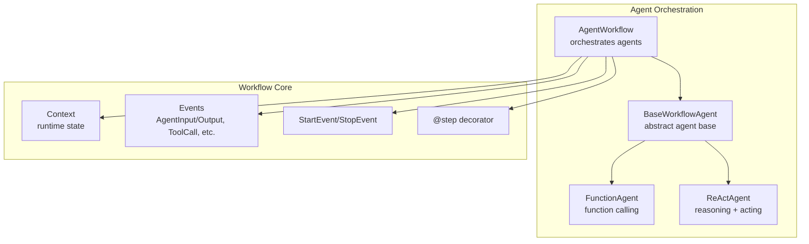
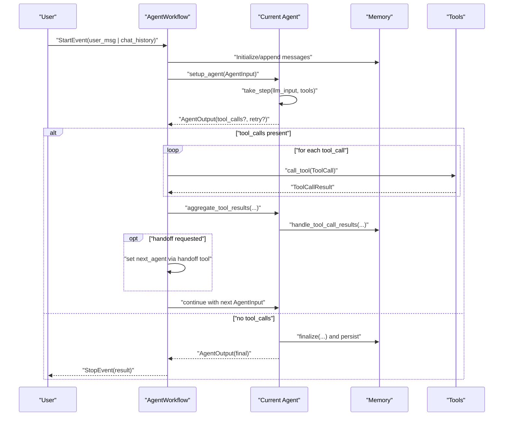
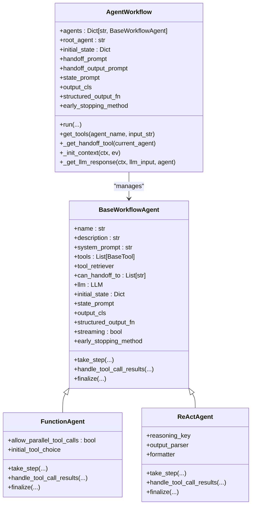
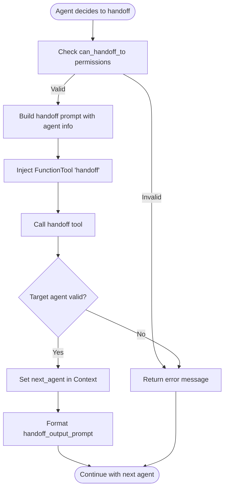
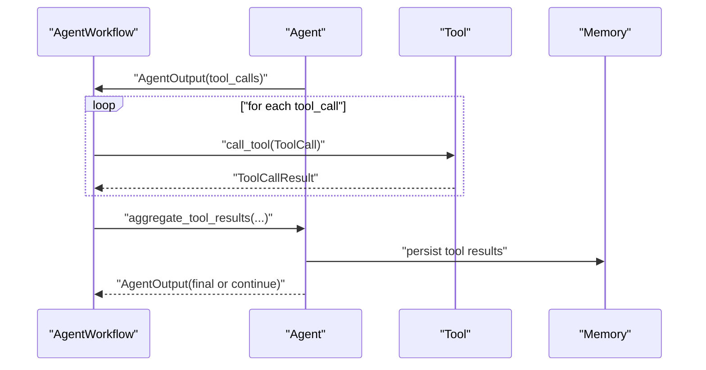
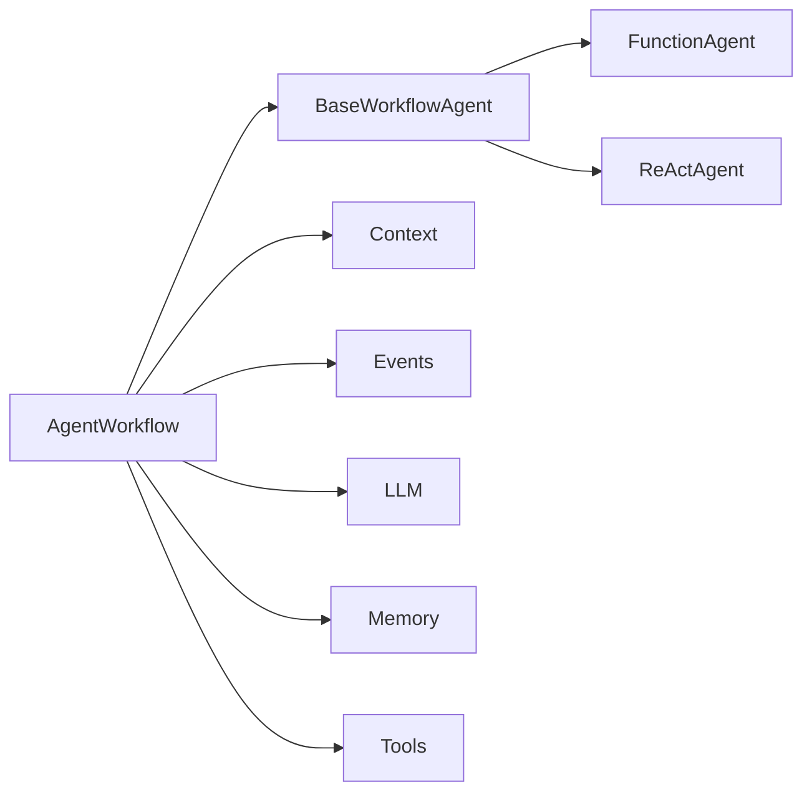

# Workflow Orchestration and Multi-Agent Coordination

<cite>
**Referenced Files in This Document**
- [multi_agent_workflow.py](file://llama-index-core/llama_index/core/agent/workflow/multi_agent_workflow.py)
- [base_agent.py](file://llama-index-core/llama_index/core/agent/workflow/base_agent.py)
- [function_agent.py](file://llama-index-core/llama_index/core/agent/workflow/function_agent.py)
- [react_agent.py](file://llama-index-core/llama_index/core/agent/workflow/react_agent.py)
- [workflow_events.py](file://llama-index-core/llama_index/core/agent/workflow/workflow_events.py)
- [__init__.py](file://llama-index-core/llama_index/core/workflow/__init__.py)
- [events.py](file://llama-index-core/llama_index/core/workflow/events.py)
- [types.py](file://llama-index-core/llama_index/core/workflow/types.py)
- [context.py](file://llama-index-core/llama_index/core/workflow/context.py)
- [service.py](file://llama-index-core/llama_index/core/workflow/service.py)
- [CHANGELOG.md](file://CHANGELOG.md)
- [deprecated_terms.md](file://docs/src/content/docs/framework/changes/deprecated_terms.md)
- [state.md](file://docs/src/content/docs/framework/understanding/agent/state.md)
</cite>

## Table of Contents
1. [Introduction](#introduction)
2. [Project Structure](#project-structure)
3. [Core Components](#core-components)
4. [Architecture Overview](#architecture-overview)
5. [Detailed Component Analysis](#detailed-component-analysis)
6. [Dependency Analysis](#dependency-analysis)
7. [Performance Considerations](#performance-considerations)
8. [Troubleshooting Guide](#troubleshooting-guide)
9. [Conclusion](#conclusion)
10. [Appendices](#appendices)

## Introduction
This document explains workflow orchestration and multi-agent coordination in LlamaIndex with a focus on the AgentWorkflow class. It covers how multiple agents are orchestrated, how tasks are decomposed and routed, how handoffs occur, and how inter-agent communication is modeled. It also documents configuration, execution monitoring, advanced patterns (hierarchical workflows, parallel execution, conditional branching), persistence and recovery, debugging, performance optimization, and scalability.

## Project Structure
The workflow orchestration system is centered around the AgentWorkflow class and supporting agent implementations. The core modules include:
- AgentWorkflow orchestrator and agent base classes
- FunctionAgent and ReActAgent implementations
- Workflow events and typed contexts
- Core workflow primitives (Context, StartEvent, StopEvent, step decorators)

**Diagram sources**
- [multi_agent_workflow.py](file://llama-index-core/llama_index/core/agent/workflow/multi_agent_workflow.py#L96-L310)
- [base_agent.py](file://llama-index-core/llama_index/core/agent/workflow/base_agent.py#L83-L192)
- [function_agent.py](file://llama-index-core/llama_index/core/agent/workflow/function_agent.py#L18-L146)
- [react_agent.py](file://llama-index-core/llama_index/core/agent/workflow/react_agent.py#L36-L232)
- [workflow_events.py](file://llama-index-core/llama_index/core/agent/workflow/workflow_events.py#L24-L112)
- [__init__.py](file://llama-index-core/llama_index/core/workflow/__init__.py#L1-L23)

**Section sources**
- [multi_agent_workflow.py](file://llama-index-core/llama_index/core/agent/workflow/multi_agent_workflow.py#L96-L310)
- [base_agent.py](file://llama-index-core/llama_index/core/agent/workflow/base_agent.py#L83-L192)
- [__init__.py](file://llama-index-core/llama_index/core/workflow/__init__.py#L1-L23)

## Core Components
- AgentWorkflow: Orchestrates multiple agents, manages handoffs, enforces iteration limits, streams intermediate results, and supports structured outputs.
- BaseWorkflowAgent: Abstract base for agents, defines shared configuration (tools, system prompt, state prompt, streaming, early stopping), and common lifecycle steps.
- FunctionAgent: Uses function-calling LLMs to decide tool use and parallelism.
- ReActAgent: Uses explicit reasoning traces (Think/Action/Observe/Answer) to drive tool use.
- Events: Typed event types for orchestration (AgentInput, AgentOutput, ToolCall, ToolCallResult, AgentStream, AgentStreamStructuredOutput, AgentWorkflowStartEvent).
- Context: Persistent runtime state store for memory, agent registry, handoff permissions, state, and iteration counters.

Key capabilities:
- Task decomposition via tool calls and reasoning steps
- Agent handoff with permission checks and dynamic tool injection
- Iteration control with early stopping modes
- Structured output generation via custom function or Pydantic model
- Streaming output and structured output events

**Section sources**
- [multi_agent_workflow.py](file://llama-index-core/llama_index/core/agent/workflow/multi_agent_workflow.py#L96-L310)
- [base_agent.py](file://llama-index-core/llama_index/core/agent/workflow/base_agent.py#L83-L192)
- [function_agent.py](file://llama-index-core/llama_index/core/agent/workflow/function_agent.py#L18-L146)
- [react_agent.py](file://llama-index-core/llama_index/core/agent/workflow/react_agent.py#L36-L232)
- [workflow_events.py](file://llama-index-core/llama_index/core/agent/workflow/workflow_events.py#L24-L112)

## Architecture Overview
AgentWorkflow composes agents and orchestrates their interactions. It initializes Context, injects a handoff tool when permitted, routes tool calls, aggregates results, and optionally finalizes with structured outputs. Agents implement take_step, handle_tool_call_results, and finalize to define their behavior.

**Diagram sources**
- [multi_agent_workflow.py](file://llama-index-core/llama_index/core/agent/workflow/multi_agent_workflow.py#L378-L744)
- [base_agent.py](file://llama-index-core/llama_index/core/agent/workflow/base_agent.py#L370-L711)
- [workflow_events.py](file://llama-index-core/llama_index/core/agent/workflow/workflow_events.py#L24-L112)

## Detailed Component Analysis

### AgentWorkflow Orchestration
AgentWorkflow coordinates multi-agent runs:
- Validates agents and ensures unique names and descriptions for multi-agent workflows
- Injects a dynamic handoff tool per agent based on can_handoff_to permissions
- Manages Context initialization (memory, agent registry, handoff permissions, state, iteration counters)
- Streams AgentStream events for real-time updates
- Supports early stopping with two modes: force (error) and generate (final LLM-generated response)
- Aggregates tool results and routes to next agent or finalizes

**Diagram sources**
- [multi_agent_workflow.py](file://llama-index-core/llama_index/core/agent/workflow/multi_agent_workflow.py#L96-L310)
- [base_agent.py](file://llama-index-core/llama_index/core/agent/workflow/base_agent.py#L83-L192)
- [function_agent.py](file://llama-index-core/llama_index/core/agent/workflow/function_agent.py#L18-L146)
- [react_agent.py](file://llama-index-core/llama_index/core/agent/workflow/react_agent.py#L36-L232)

**Section sources**
- [multi_agent_workflow.py](file://llama-index-core/llama_index/core/agent/workflow/multi_agent_workflow.py#L96-L310)
- [base_agent.py](file://llama-index-core/llama_index/core/agent/workflow/base_agent.py#L83-L192)

### Handoff Mechanisms and Inter-Agent Communication
- Dynamic handoff tool injection: For each agent, a FunctionTool named “handoff” is created with a prompt listing valid recipients based on can_handoff_to.
- Validation: The tool checks that the target agent exists and that the current agent is permitted to handoff to it.
- State propagation: The handoff tool returns a formatted message using handoff_output_prompt, and the orchestrator switches current_agent_name in Context.
- Return-direct semantics: If a tool returns directly (e.g., a retrieval tool), the workflow can terminate early unless the tool is the handoff tool itself.

**Diagram sources**
- [multi_agent_workflow.py](file://llama-index-core/llama_index/core/agent/workflow/multi_agent_workflow.py#L70-L90)
- [multi_agent_workflow.py](file://llama-index-core/llama_index/core/agent/workflow/multi_agent_workflow.py#L213-L264)

**Section sources**
- [multi_agent_workflow.py](file://llama-index-core/llama_index/core/agent/workflow/multi_agent_workflow.py#L70-L90)
- [multi_agent_workflow.py](file://llama-index-core/llama_index/core/agent/workflow/multi_agent_workflow.py#L213-L264)

### Task Routing and Execution Monitoring
- Tool selection and execution: AgentWorkflow emits ToolCall events and waits for ToolCallResult events, aggregating results before deciding the next step.
- Streaming: Both AgentWorkflow and BaseWorkflowAgent support streaming; AgentStream events carry deltas, tool_calls, and raw LLM outputs.
- Structured outputs: Agents can produce structured outputs via a custom function or a Pydantic model; AgentStreamStructuredOutput events propagate these to observers.

**Diagram sources**
- [multi_agent_workflow.py](file://llama-index-core/llama_index/core/agent/workflow/multi_agent_workflow.py#L627-L744)
- [base_agent.py](file://llama-index-core/llama_index/core/agent/workflow/base_agent.py#L609-L711)
- [workflow_events.py](file://llama-index-core/llama_index/core/agent/workflow/workflow_events.py#L38-L112)

**Section sources**
- [multi_agent_workflow.py](file://llama-index-core/llama_index/core/agent/workflow/multi_agent_workflow.py#L627-L744)
- [base_agent.py](file://llama-index-core/llama_index/core/agent/workflow/base_agent.py#L609-L711)
- [workflow_events.py](file://llama-index-core/llama_index/core/agent/workflow/workflow_events.py#L38-L112)

### Advanced Patterns
- Hierarchical workflows: Use nested AgentWorkflow instances or configure agents with specialized roles (root, escalation, subject matter expert). Handoff permissions define the hierarchy edges.
- Parallel agent execution: Enable parallel tool calls in FunctionAgent via allow_parallel_tool_calls to accelerate multi-tool workflows.
- Conditional branching: Implement conditional logic in agent prompts or tool outputs; use structured outputs to guide routing decisions.
- Dynamic tool retrieval: Agents can use tool_retriever to fetch tools on demand, enabling adaptive capabilities.

**Section sources**
- [function_agent.py](file://llama-index-core/llama_index/core/agent/workflow/function_agent.py#L26-L29)
- [base_agent.py](file://llama-index-core/llama_index/core/agent/workflow/base_agent.py#L101-L104)

### Practical Examples
- Research assistant workflow: A root ReActAgent decomposes queries into literature search, synthesis, and citation extraction. Agents handoff to domain experts (FunctionAgent) for specialized tasks. Early stopping prevents runaway loops.
- Customer support multi-agent system: A root FunctionAgent handles initial triage and escalates to specialized agents (e.g., billing, technical) based on intent and context. Handoff tool enforces escalation policies.
- Collaborative problem-solving scenario: Multiple ReActAgents collaborate via shared memory and handoffs, with each agent adding reasoning steps until a solution is produced.

[No sources needed since this section provides conceptual examples]

### Workflow Configuration
- Initialization: Provide agents, root_agent, prompts, initial_state, output_cls or structured_output_fn, and early_stopping_method.
- Per-agent configuration: Tools, tool_retriever, system_prompt, can_handoff_to, streaming, and state_prompt.
- Runtime parameters: max_iterations, memory override, and start_event customization.

**Section sources**
- [multi_agent_workflow.py](file://llama-index-core/llama_index/core/agent/workflow/multi_agent_workflow.py#L99-L183)
- [base_agent.py](file://llama-index-core/llama_index/core/agent/workflow/base_agent.py#L140-L192)

### Workflow Persistence, Checkpointing, and Recovery
- Context store: AgentWorkflow persists runtime state (memory, agents, can_handoff_to, state, current_agent_name, max_iterations, num_iterations, formatted_input_with_state) in Context.store.
- Memory: ChatMemoryBuffer stores conversation history; agents append reasoning/tool results upon finalize.
- Recovery: Starting a new run with an existing Context resumes execution; the orchestrator detects running contexts and continues seamlessly.

**Section sources**
- [multi_agent_workflow.py](file://llama-index-core/llama_index/core/agent/workflow/multi_agent_workflow.py#L266-L310)
- [base_agent.py](file://llama-index-core/llama_index/core/agent/workflow/base_agent.py#L271-L300)
- [state.md](file://docs/src/content/docs/framework/understanding/agent/state.md#L1-L20)

### Debugging, Performance Optimization, and Scalability
- Debugging: Inspect AgentStream events for deltas and tool_calls; use AgentStreamStructuredOutput to validate structured outputs; leverage retry_messages for ReAct parsing errors.
- Performance: Enable streaming for long-running agents; tune max_iterations; prefer parallel tool calls for FunctionAgent when safe; cache tool retrieval results.
- Scalability: Use hierarchical workflows and handoffs to distribute load; separate agents by responsibility; monitor iteration counts and early stopping behavior.

**Section sources**
- [workflow_events.py](file://llama-index-core/llama_index/core/agent/workflow/workflow_events.py#L38-L94)
- [base_agent.py](file://llama-index-core/llama_index/core/agent/workflow/base_agent.py#L301-L333)
- [multi_agent_workflow.py](file://llama-index-core/llama_index/core/agent/workflow/multi_agent_workflow.py#L518-L545)

## Dependency Analysis
AgentWorkflow depends on:
- BaseWorkflowAgent implementations (FunctionAgent, ReActAgent)
- Workflow primitives (Context, StartEvent, StopEvent, step)
- Events for orchestration (AgentInput, AgentOutput, ToolCall, ToolCallResult)
- Tooling (BaseTool, AsyncBaseTool, FunctionTool)
- Memory (BaseMemory, ChatMemoryBuffer)
- LLMs (ChatMessage, ChatResponse)

**Diagram sources**
- [multi_agent_workflow.py](file://llama-index-core/llama_index/core/agent/workflow/multi_agent_workflow.py#L96-L310)
- [base_agent.py](file://llama-index-core/llama_index/core/agent/workflow/base_agent.py#L83-L192)
- [__init__.py](file://llama-index-core/llama_index/core/workflow/__init__.py#L1-L23)

**Section sources**
- [multi_agent_workflow.py](file://llama-index-core/llama_index/core/agent/workflow/multi_agent_workflow.py#L96-L310)
- [base_agent.py](file://llama-index-core/llama_index/core/agent/workflow/base_agent.py#L83-L192)
- [__init__.py](file://llama-index-core/llama_index/core/workflow/__init__.py#L1-L23)

## Performance Considerations
- Streaming reduces latency for long responses; ensure the LLM supports streaming.
- Parallel tool calls can reduce total latency for independent operations.
- Limit max_iterations to prevent runaway loops; use early_stopping_method="generate" to gracefully finish long runs.
- Use tool_retriever to avoid loading heavy tool sets upfront.

[No sources needed since this section provides general guidance]

## Troubleshooting Guide
Common issues and resolutions:
- Missing user_msg or chat_history: Ensure a valid user message or non-system chat history is provided.
- Handoff failures: Verify agent names and can_handoff_to permissions; confirm the handoff tool prompt contains required placeholders.
- Parsing errors (ReAct): Retry messages are returned to help the LLM self-correct; validate output format expectations.
- Structured output validation: AgentStreamStructuredOutput warns on Pydantic conversion failures; review the model definition.

**Section sources**
- [multi_agent_workflow.py](file://llama-index-core/llama_index/core/agent/workflow/multi_agent_workflow.py#L378-L425)
- [workflow_events.py](file://llama-index-core/llama_index/core/agent/workflow/workflow_events.py#L80-L94)
- [base_agent.py](file://llama-index-core/llama_index/core/agent/workflow/base_agent.py#L556-L591)

## Conclusion
AgentWorkflow provides a robust foundation for multi-agent orchestration in LlamaIndex. By combining flexible agent implementations, dynamic handoffs, structured outputs, and streaming, it enables sophisticated collaborative workflows. Proper configuration of agents, prompts, and runtime parameters, along with careful monitoring and tuning, ensures reliable, scalable, and maintainable systems.

[No sources needed since this section summarizes without analyzing specific files]

## Appendices

### Migration Notes
- Deprecated agent classes (e.g., FunctionCallingAgent, ReActAgent, AgentRunner) have been superseded by workflow-based agents and AgentWorkflow.
- Adopt AgentWorkflow and BaseWorkflowAgent-based agents for future-proof deployments.

**Section sources**
- [CHANGELOG.md](file://CHANGELOG.md#L1300-L1320)
- [deprecated_terms.md](file://docs/src/content/docs/framework/changes/deprecated_terms.md#L50-L70)