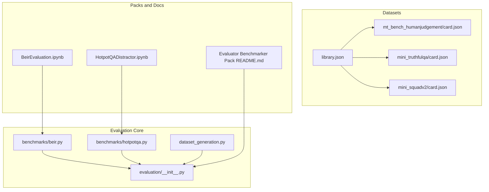
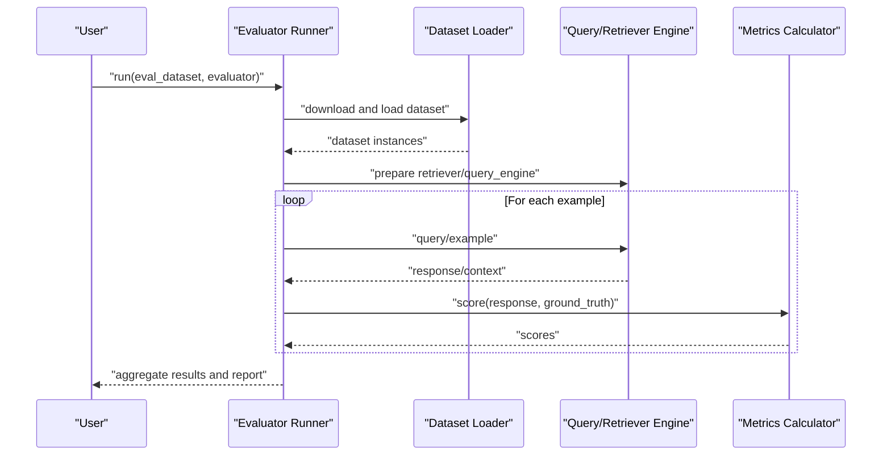
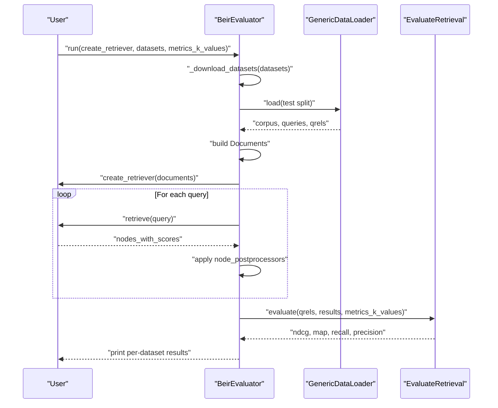
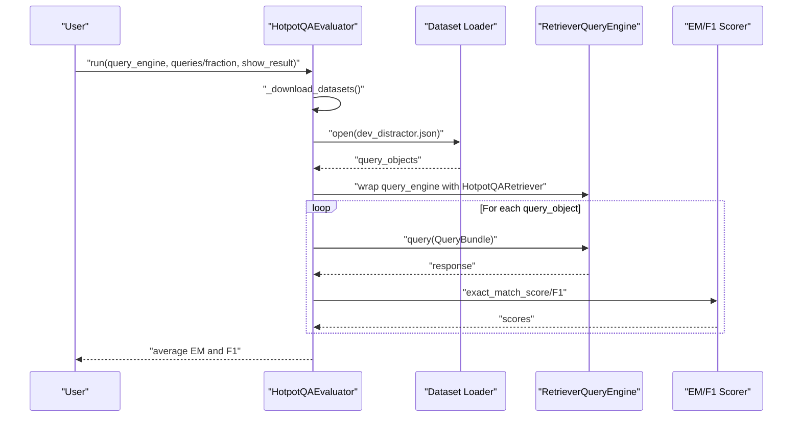
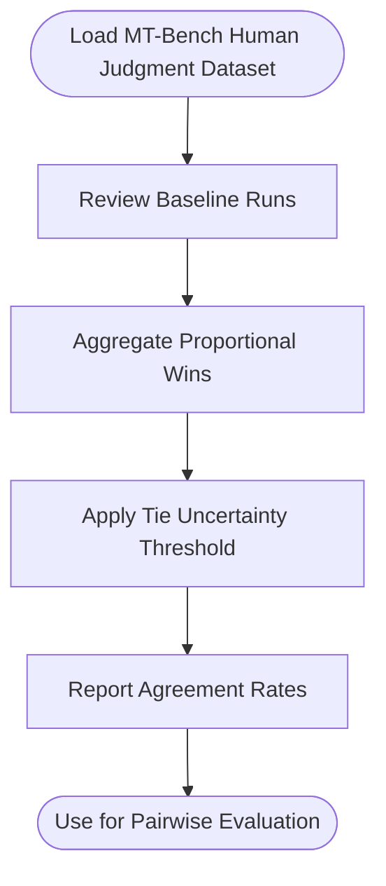
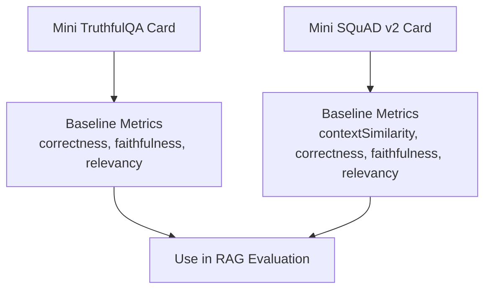
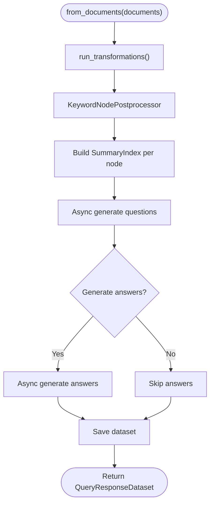
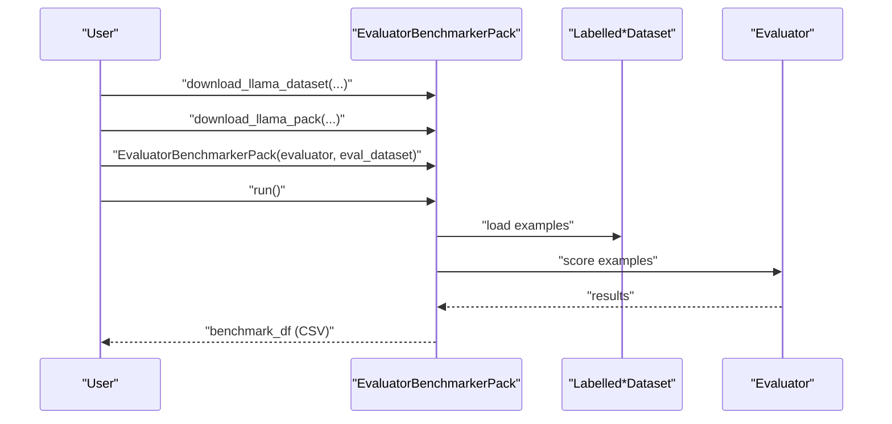
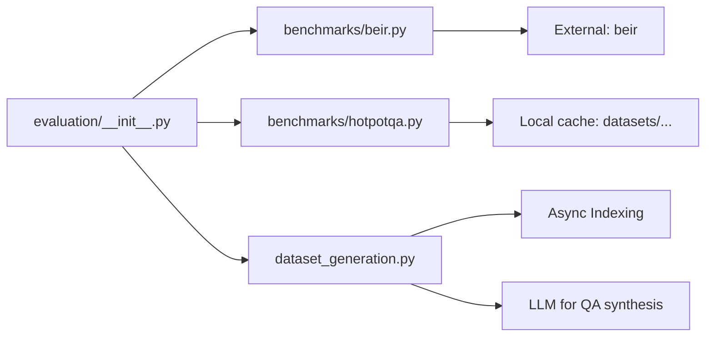

# Benchmark Datasets and Standard Evaluations

<cite>
**Referenced Files in This Document**
- [library.json](file://llama-datasets/library.json)
- [card.json (mt_bench_humanjudgement)](file://llama-datasets/mt_bench_humanjudgement/card.json)
- [card.json (mini_truthfulqa)](file://llama-datasets/mini_truthfulqa/card.json)
- [card.json (mini_squadv2)](file://llama-datasets/mini_squadv2/card.json)
- [README.md (Evaluator Benchmarker Pack)](file://llama-index-packs/llama-index-packs-evaluator-benchmarker/README.md)
- [beir.py](file://llama-index-core/llama_index/core/evaluation/benchmarks/beir.py)
- [hotpotqa.py](file://llama-index-core/llama_index/core/evaluation/benchmarks/hotpotqa.py)
- [dataset_generation.py](file://llama-index-core/llama_index/core/evaluation/dataset_generation.py)
- [__init__.py (evaluation)](file://llama-index-core/llama_index/core/evaluation/__init__.py)
- [BeirEvaluation.ipynb](file://docs/examples/evaluation/BeirEvaluation.ipynb)
- [HotpotQADistractor.ipynb](file://docs/examples/evaluation/HotpotQADistractor.ipynb)
</cite>

## Table of Contents
1. [Introduction](#introduction)
2. [Project Structure](#project-structure)
3. [Core Components](#core-components)
4. [Architecture Overview](#architecture-overview)
5. [Detailed Component Analysis](#detailed-component-analysis)
6. [Dependency Analysis](#dependency-analysis)
7. [Performance Considerations](#performance-considerations)
8. [Troubleshooting Guide](#troubleshooting-guide)
9. [Conclusion](#conclusion)
10. [Appendices](#appendices)

## Introduction
This document describes the benchmark datasets and standard evaluation protocols available in the LlamaIndex ecosystem. It covers:
- The curated library of benchmark datasets (including BEIR, MT-Bench human judgment, TruthfulQA, HotpotQA, and domain-specific datasets)
- Evaluation protocols and scoring methodologies
- Automatic dataset downloading and preparation utilities
- Examples of running standard evaluations with LlamaIndex
- Interpreting results and comparing against baseline systems
- Dataset generation capabilities and custom dataset creation workflows
- Licensing, ethical considerations, and attribution requirements
- Guidance for selecting appropriate benchmarks for different use cases and domains

## Project Structure
The benchmarking assets are organized across three primary areas:
- Curated dataset cards and metadata under llama-datasets
- Evaluation utilities and benchmark runners under llama-index-core/evaluation
- Example notebooks and pack documentation under docs and llama-index-packs

**Diagram sources**
- [library.json](file://llama-datasets/library.json#L1-L88)
- [card.json (mt_bench_humanjudgement)](file://llama-datasets/mt_bench_humanjudgement/card.json#L1-L59)
- [card.json (mini_truthfulqa)](file://llama-datasets/mini_truthfulqa/card.json#L1-L28)
- [card.json (mini_squadv2)](file://llama-datasets/mini_squadv2/card.json#L1-L28)
- [beir.py](file://llama-index-core/llama_index/core/evaluation/benchmarks/beir.py#L1-L110)
- [hotpotqa.py](file://llama-index-core/llama_index/core/evaluation/benchmarks/hotpotqa.py#L1-L214)
- [dataset_generation.py](file://llama-index-core/llama_index/core/evaluation/dataset_generation.py#L1-L341)
- [__init__.py (evaluation)](file://llama-index-core/llama_index/core/evaluation/__init__.py#L1-L87)
- [README.md (Evaluator Benchmarker Pack)](file://llama-index-packs/llama-index-packs-evaluator-benchmarker/README.md#L1-L83)
- [BeirEvaluation.ipynb](file://docs/examples/evaluation/BeirEvaluation.ipynb#L1-L175)
- [HotpotQADistractor.ipynb](file://docs/examples/evaluation/HotpotQADistractor.ipynb#L1-L229)

**Section sources**
- [library.json](file://llama-datasets/library.json#L1-L88)
- [__init__.py (evaluation)](file://llama-index-core/llama_index/core/evaluation/__init__.py#L1-L87)

## Core Components
- BEIR retrieval benchmark runner: Downloads and evaluates on BEIR datasets using a retriever factory and standard IR metrics.
- HotpotQA distractor benchmark: Loads a dev distractor dataset and evaluates answer correctness using EM/F1; includes a mock retriever that supplies provided contexts.
- Dataset generation utilities: Provides legacy and modern dataset generation APIs for building synthetic QA datasets from documents.
- Evaluator Benchmarker Pack: A reusable pack for running single-grading and pairwise-grading evaluations on labeled datasets and reporting agreement rates.

Key evaluation modules and exports are exposed via the evaluation package init.

**Section sources**
- [beir.py](file://llama-index-core/llama_index/core/evaluation/benchmarks/beir.py#L12-L110)
- [hotpotqa.py](file://llama-index-core/llama_index/core/evaluation/benchmarks/hotpotqa.py#L23-L214)
- [dataset_generation.py](file://llama-index-core/llama_index/core/evaluation/dataset_generation.py#L1-L341)
- [__init__.py (evaluation)](file://llama-index-core/llama_index/core/evaluation/__init__.py#L1-L87)

## Architecture Overview
The evaluation architecture centers around dataset cards, evaluation runners, and optional packs for standardized benchmarking.

[No sources needed since this diagram shows conceptual workflow, not actual code structure]

## Detailed Component Analysis

### BEIR Retrieval Benchmark
The BEIR evaluator automates downloading datasets, converting corpora to Documents, constructing a retriever via a factory, and computing standard IR metrics (NDCG, MAP, Recall, Precision) at configurable k values. It integrates with the BEIR Python library and caches datasets under a standard cache directory.

**Diagram sources**
- [beir.py](file://llama-index-core/llama_index/core/evaluation/benchmarks/beir.py#L26-L110)

**Section sources**
- [beir.py](file://llama-index-core/llama_index/core/evaluation/benchmarks/beir.py#L12-L110)
- [BeirEvaluation.ipynb](file://docs/examples/evaluation/BeirEvaluation.ipynb#L125-L142)

Scoring methodology:
- Uses standard IR metrics computed over ranked results versus qrels.
- Supports configurable k values (e.g., 3, 10, 30) and prints per-dataset metric dictionaries.

Automatic downloading:
- Downloads dataset archives from BEIR URLs into a cache directory and unzips them.
- Raises errors for invalid datasets and cleans up partial cache directories.

### HotpotQA Distractor Benchmark
The HotpotQA evaluator downloads a dev distractor dataset, constructs a mock retriever that supplies the provided 10-source contexts per question, and evaluates answer correctness using exact match and F1 scores. It supports sampling a fraction or fixed number of queries.

**Diagram sources**
- [hotpotqa.py](file://llama-index-core/llama_index/core/evaluation/benchmarks/hotpotqa.py#L28-L124)
- [hotpotqa.py](file://llama-index-core/llama_index/core/evaluation/benchmarks/hotpotqa.py#L125-L159)

**Section sources**
- [hotpotqa.py](file://llama-index-core/llama_index/core/evaluation/benchmarks/hotpotqa.py#L23-L214)
- [HotpotQADistractor.ipynb](file://docs/examples/evaluation/HotpotQADistractor.ipynb#L85-L130)

Scoring methodology:
- Exact Match (EM) and F1 score computed after normalizing answers.
- Averages scores across sampled queries.

Automatic downloading:
- Streams and saves the dev distractor dataset to a cache directory.

### MT-Bench Human Judgment Dataset
The MT-Bench human judgment dataset card defines a labeled pairwise dataset derived from human preferences. It includes baseline runs and aggregated metrics such as agreement rates with and without ties, and uncertainty thresholds for ties.

**Diagram sources**
- [card.json (mt_bench_humanjudgement)](file://llama-datasets/mt_bench_humanjudgement/card.json#L1-L59)

**Section sources**
- [card.json (mt_bench_humanjudgement)](file://llama-datasets/mt_bench_humanjudgement/card.json#L1-L59)
- [README.md (Evaluator Benchmarker Pack)](file://llama-index-packs/llama-index-packs-evaluator-benchmarker/README.md#L1-L83)

### TruthfulQA and Mini-SQuAD v2 Datasets
Mini TruthfulQA and Mini-SQuAD v2 cards describe subsets of their respective benchmarks, including number of observations, human-authored examples, and baseline metrics for LlamaIndex configurations.

**Diagram sources**
- [card.json (mini_truthfulqa)](file://llama-datasets/mini_truthfulqa/card.json#L1-L28)
- [card.json (mini_squadv2)](file://llama-datasets/mini_squadv2/card.json#L1-L28)

**Section sources**
- [card.json (mini_truthfulqa)](file://llama-datasets/mini_truthfulqa/card.json#L1-L28)
- [card.json (mini_squadv2)](file://llama-datasets/mini_squadv2/card.json#L1-L28)

### Dataset Generation Utilities
The dataset generation module provides legacy and modern APIs to generate synthetic QA datasets from documents. It supports:
- Generating questions per chunk asynchronously
- Optionally generating answers per question
- Filtering nodes via keyword postprocessing
- Saving/loading datasets to/from JSON

**Diagram sources**
- [dataset_generation.py](file://llama-index-core/llama_index/core/evaluation/dataset_generation.py#L166-L323)

**Section sources**
- [dataset_generation.py](file://llama-index-core/llama_index/core/evaluation/dataset_generation.py#L1-L341)

### Evaluator Benchmarker Pack
The Evaluator Benchmarker Pack enables quick benchmarking of evaluators on labeled datasets. It supports:
- Single-grading and pairwise-grading datasets
- Downloading datasets and packs via CLI or Python
- Running evaluations and saving results to CSV

**Diagram sources**
- [README.md (Evaluator Benchmarker Pack)](file://llama-index-packs/llama-index-packs-evaluator-benchmarker/README.md#L22-L83)

**Section sources**
- [README.md (Evaluator Benchmarker Pack)](file://llama-index-packs/llama-index-packs-evaluator-benchmarker/README.md#L1-L83)

## Dependency Analysis
The evaluation package exposes a broad set of evaluators and runners. The BEIR and HotpotQA benchmarks depend on external libraries and dataset caches. The dataset generation utilities rely on asynchronous indexing and LLMs for question/answer synthesis.

**Diagram sources**
- [__init__.py (evaluation)](file://llama-index-core/llama_index/core/evaluation/__init__.py#L1-L87)
- [beir.py](file://llama-index-core/llama_index/core/evaluation/benchmarks/beir.py#L1-L110)
- [hotpotqa.py](file://llama-index-core/llama_index/core/evaluation/benchmarks/hotpotqa.py#L1-L214)
- [dataset_generation.py](file://llama-index-core/llama_index/core/evaluation/dataset_generation.py#L1-L341)

**Section sources**
- [__init__.py (evaluation)](file://llama-index-core/llama_index/core/evaluation/__init__.py#L1-L87)

## Performance Considerations
- BEIR evaluation speed depends on retriever similarity_top_k and embedding throughput; adjust top-k and embedding model accordingly.
- Asynchronous question/answer generation reduces latency when generating large datasets.
- Caching dataset archives avoids repeated downloads and speeds up subsequent runs.
- For HotpotQA, using a reranker can improve answer quality at the cost of extra compute.

[No sources needed since this section provides general guidance]

## Troubleshooting Guide
Common issues and resolutions:
- Missing BEIR installation: The BEIR evaluator raises an ImportError if the beir library is not installed; install it to enable BEIR benchmarking.
- Invalid BEIR dataset identifiers: If a dataset URL is unreachable, the evaluator removes the cached directory and raises a ValueError; verify dataset names and connectivity.
- HotpotQA dev distractor download failures: Streaming download handles network interruptions; ensure sufficient disk space and retry if needed.
- Dataset generation timeouts: Increase concurrency or reduce batch sizes; ensure adequate LLM quota and rate limits.

**Section sources**
- [beir.py](file://llama-index-core/llama_index/core/evaluation/benchmarks/beir.py#L18-L25)
- [beir.py](file://llama-index-core/llama_index/core/evaluation/benchmarks/beir.py#L37-L44)
- [hotpotqa.py](file://llama-index-core/llama_index/core/evaluation/benchmarks/hotpotqa.py#L34-L57)

## Conclusion
LlamaIndex provides a comprehensive suite of benchmark datasets and evaluation utilities spanning retrieval, factoid QA, and human preference comparisons. The BEIR and HotpotQA runners automate dataset preparation and scoring, while dataset generation utilities support custom synthetic datasets. The Evaluator Benchmarker Pack streamlines pairwise and single-grading evaluations on labeled datasets. Select benchmarks aligned with your domain and evaluation goals, and leverage caching and reranking to optimize performance.

[No sources needed since this section summarizes without analyzing specific files]

## Appendices

### Dataset Library Overview
The dataset library enumerates curated datasets with IDs, authors, and keywords to guide selection.

```mermaid
graph TB
LIB["library.json"] --> PG["PaulGrahamEssayDataset"]
LIB --> BT["BraintrustCodaHelpDeskDataset"]
LIB --> PF["PatronusAIFinanceBenchDataset"]
LIB --> BL["BlockchainSolanaDataset"]
LIB --> MQ["MiniTruthfulQADataset"]
LIB --> LL["Llama2PaperDataset"]
LIB --> UB["Uber10KDataset2021"]
LIB --> MS["MiniSquadV2Dataset"]
LIB --> OC["OriginOfCovid19Dataset"]
LIB --> EP["EvaluatingLlmSurveyPaperDataset"]
LIB --> CQ["CovidQaDataset"]
LIB --> MC["MiniCovidQaDataset"]
LIB --> HO["HistoryOfAlexnetDataset"]
LIB --> DK["DocugamiKgRagSec10Q"]
LIB --> MH["MtBenchHumanJudgementDataset"]
LIB --> MM["MiniMtBenchSingleGradingDataset"]
LIB --> ME["MiniEsgBenchDataset"]
```

**Diagram sources**
- [library.json](file://llama-datasets/library.json#L1-L88)

**Section sources**
- [library.json](file://llama-datasets/library.json#L1-L88)

### Example Workflows and Interpretation

- BEIR evaluation example:
  - Demonstrates downloading a BEIR dataset, building a retriever with a sentence-transformer embedding, and printing IR metrics at multiple k values.
  - Interpretation: Higher scores indicate better ranking quality; compare across models and embedding choices.

  **Section sources**
  - [BeirEvaluation.ipynb](file://docs/examples/evaluation/BeirEvaluation.ipynb#L125-L142)

- HotpotQA distractor example:
  - Shows evaluating a simple engine and then adding a reranker; compares EM and F1 scores.
  - Interpretation: Short, factoid answers optimized; reranking can improve precision.

  **Section sources**
  - [HotpotQADistractor.ipynb](file://docs/examples/evaluation/HotpotQADistractor.ipynb#L85-L130)
  - [HotpotQADistractor.ipynb](file://docs/examples/evaluation/HotpotQADistractor.ipynb#L183-L193)

- MT-Bench human judgment:
  - Use the labeled pairwise dataset to evaluate human preference agreement; tie handling and uncertainty thresholds are defined in the dataset card.

  **Section sources**
  - [card.json (mt_bench_humanjudgement)](file://llama-datasets/mt_bench_humanjudgement/card.json#L1-L59)
  - [README.md (Evaluator Benchmarker Pack)](file://llama-index-packs/llama-index-packs-evaluator-benchmarker/README.md#L22-L83)

### Licensing, Ethical Considerations, and Attribution
- Dataset sources and URLs are documented in dataset cards; always review the originating licenses and terms before use.
- When reproducing baseline results, cite the original papers and datasets as indicated in the dataset cards.
- For human preference datasets (e.g., MT-Bench), ensure compliance with any data usage policies and ethical guidelines of the hosting platform.

**Section sources**
- [card.json (mt_bench_humanjudgement)](file://llama-datasets/mt_bench_humanjudgement/card.json#L8-L10)
- [card.json (mini_truthfulqa)](file://llama-datasets/mini_truthfulqa/card.json#L8)
- [card.json (mini_squadv2)](file://llama-datasets/mini_squadv2/card.json#L8)

### Selecting Benchmarks by Use Case
- Retrieval-focused tasks: Use BEIR with appropriate k values and embedding models; tune top-k and rerankers.
- Factoid QA: Use HotpotQA (distractor setting) or Mini-SQuAD v2; focus on EM/F1 and short-answer prompts.
- Truthful reasoning: Use Mini TruthfulQA to assess faithfulness and correctness against knowledge.
- Human preference alignment: Use MT-Bench human judgment for pairwise comparisons and agreement metrics.

**Section sources**
- [beir.py](file://llama-index-core/llama_index/core/evaluation/benchmarks/beir.py#L50-L110)
- [hotpotqa.py](file://llama-index-core/llama_index/core/evaluation/benchmarks/hotpotqa.py#L61-L124)
- [card.json (mini_truthfulqa)](file://llama-datasets/mini_truthfulqa/card.json#L1-L28)
- [card.json (mini_squadv2)](file://llama-datasets/mini_squadv2/card.json#L1-L28)
- [card.json (mt_bench_humanjudgement)](file://llama-datasets/mt_bench_humanjudgement/card.json#L1-L59)