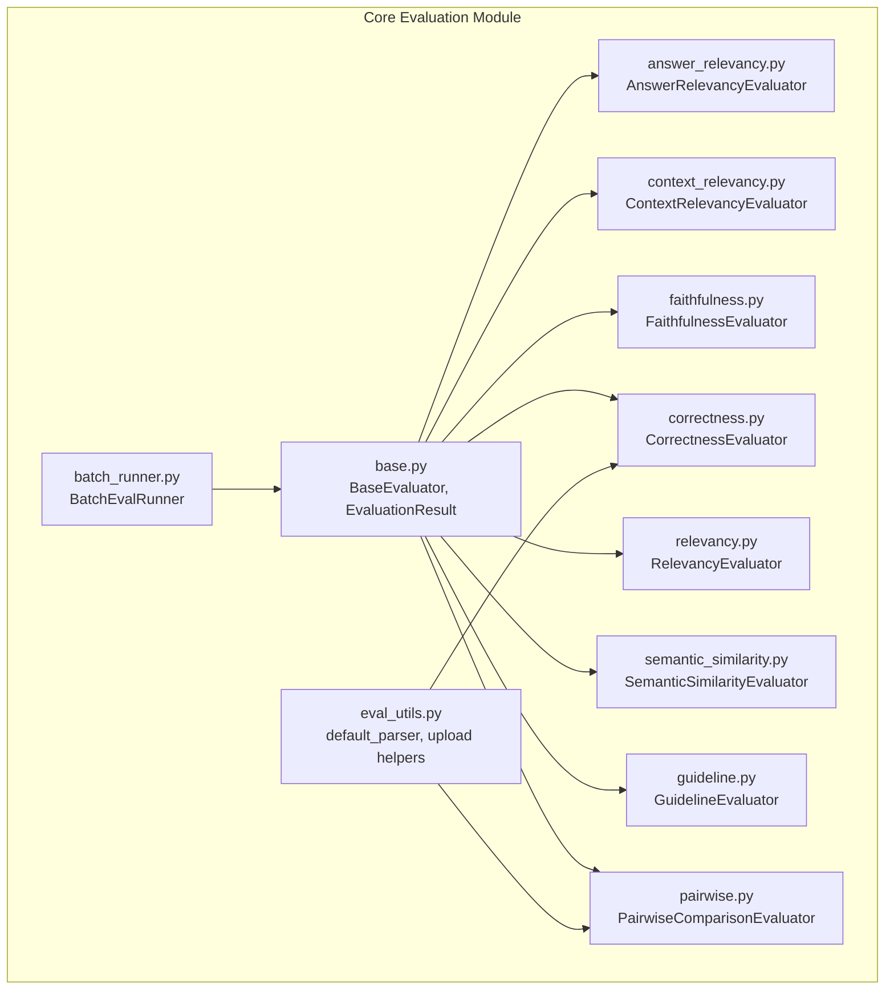
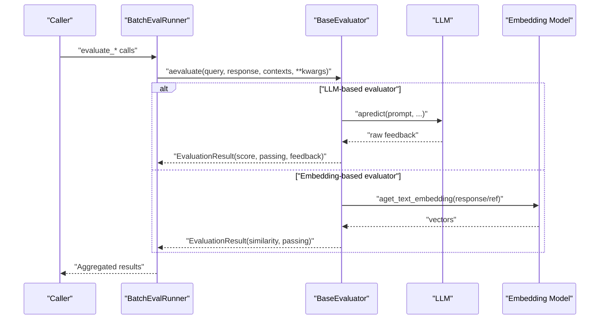
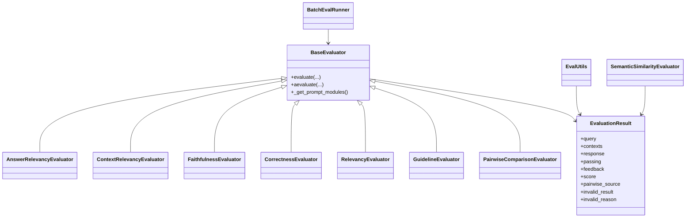

# Built-in Evaluators and Metrics

<cite>
**Referenced Files in This Document**
- [base.py](file://llama-index-core/llama_index/core/evaluation/base.py)
- [answer_relevancy.py](file://llama-index-core/llama_index/core/evaluation/answer_relevancy.py)
- [context_relevancy.py](file://llama-index-core/llama_index/core/evaluation/context_relevancy.py)
- [faithfulness.py](file://llama-index-core/llama_index/core/evaluation/faithfulness.py)
- [correctness.py](file://llama-index-core/llama_index/core/evaluation/correctness.py)
- [relevancy.py](file://llama-index-core/llama_index/core/evaluation/relevancy.py)
- [semantic_similarity.py](file://llama-index-core/llama_index/core/evaluation/semantic_similarity.py)
- [guideline.py](file://llama-index-core/llama_index/core/evaluation/guideline.py)
- [pairwise.py](file://llama-index-core/llama_index/core/evaluation/pairwise.py)
- [batch_runner.py](file://llama-index-core/llama_index/core/evaluation/batch_runner.py)
- [eval_utils.py](file://llama-index-core/llama_index/core/evaluation/eval_utils.py)
- [__init__.py](file://llama-index-core/llama_index/core/evaluation/__init__.py)
- [usage_pattern.md](file://docs/src/content/docs/framework/module_guides/evaluating/usage_pattern.md)
- [index.md](file://docs/src/content/docs/framework/module_guides/evaluating/index.md)
</cite>

## Table of Contents
1. [Introduction](#introduction)
2. [Project Structure](#project-structure)
3. [Core Components](#core-components)
4. [Architecture Overview](#architecture-overview)
5. [Detailed Component Analysis](#detailed-component-analysis)
6. [Dependency Analysis](#dependency-analysis)
7. [Performance Considerations](#performance-considerations)
8. [Troubleshooting Guide](#troubleshooting-guide)
9. [Conclusion](#conclusion)
10. [Appendices](#appendices)

## Introduction
This document explains the LlamaIndex built-in evaluators and metrics system. It covers all response evaluators included in the core evaluation module: AnswerRelevancyEvaluator, ContextRelevancyEvaluator, FaithfulnessEvaluator, CorrectnessEvaluator, RelevancyEvaluator, SemanticSimilarityEvaluator, GuidelineEvaluator, and PairwiseComparisonEvaluator. For each evaluator, it documents:
- Purpose and target use cases
- Inputs and evaluation logic
- Scoring and interpretation
- Parameters and configuration options
- Practical usage patterns and examples (via file references)
- Performance characteristics and best practices
- Selection criteria and limitations
- Troubleshooting and optimization tips

## Project Structure
The evaluation system is centered in the core evaluation module. Key files include the base evaluator interface, individual evaluator implementations, batch evaluation utilities, and shared evaluation utilities.

**Diagram sources**
- [base.py](file://llama-index-core/llama_index/core/evaluation/base.py#L46-L89)
- [answer_relevancy.py](file://llama-index-core/llama_index/core/evaluation/answer_relevancy.py#L49-L147)
- [context_relevancy.py](file://llama-index-core/llama_index/core/evaluation/context_relevancy.py#L66-L178)
- [faithfulness.py](file://llama-index-core/llama_index/core/evaluation/faithfulness.py#L98-L206)
- [correctness.py](file://llama-index-core/llama_index/core/evaluation/correctness.py#L69-L154)
- [relevancy.py](file://llama-index-core/llama_index/core/evaluation/relevancy.py#L42-L145)
- [semantic_similarity.py](file://llama-index-core/llama_index/core/evaluation/semantic_similarity.py#L13-L82)
- [guideline.py](file://llama-index-core/llama_index/core/evaluation/guideline.py#L41-L126)
- [pairwise.py](file://llama-index-core/llama_index/core/evaluation/pairwise.py#L92-L282)
- [batch_runner.py](file://llama-index-core/llama_index/core/evaluation/batch_runner.py#L75-L444)
- [eval_utils.py](file://llama-index-core/llama_index/core/evaluation/eval_utils.py#L222-L246)

**Section sources**
- [__init__.py](file://llama-index-core/llama_index/core/evaluation/__init__.py#L1-L39)
- [index.md](file://docs/src/content/docs/framework/module_guides/evaluating/index.md#L1-L79)

## Core Components
- BaseEvaluator: Abstract base class defining the evaluation interface and async/sync evaluation methods. Provides a standardized contract for all evaluators.
- EvaluationResult: Standardized result structure returned by all evaluators, including query, contexts, response, passing flag, feedback, score, pairwise source, and invalid result flags.

Key behaviors:
- All evaluators accept query, response, contexts, and optional kwargs.
- Many evaluators accept prompt templates and parser functions to customize scoring and feedback extraction.
- Some evaluators rely on embedding similarity (SemanticSimilarityEvaluator) or LLM-based judgment (others).
- BatchEvalRunner orchestrates parallel evaluation across multiple evaluators and datasets.

**Section sources**
- [base.py](file://llama-index-core/llama_index/core/evaluation/base.py#L12-L89)
- [batch_runner.py](file://llama-index-core/llama_index/core/evaluation/batch_runner.py#L75-L111)
- [usage_pattern.md](file://docs/src/content/docs/framework/module_guides/evaluating/usage_pattern.md#L5-L45)

## Architecture Overview
The evaluation pipeline typically follows this flow:
- Prepare inputs: query, response, contexts, and optional reference answer or guidelines.
- Select one or more evaluators depending on goals (faithfulness, relevancy, correctness, etc.).
- Run evaluation via BaseEvaluator.evaluate or BatchEvalRunner for batch runs.
- Interpret EvaluationResult fields (passing, score, feedback).
- Optionally upload results to LlamaCloud for centralized tracking.

**Diagram sources**
- [batch_runner.py](file://llama-index-core/llama_index/core/evaluation/batch_runner.py#L195-L348)
- [correctness.py](file://llama-index-core/llama_index/core/evaluation/correctness.py#L120-L154)
- [semantic_similarity.py](file://llama-index-core/llama_index/core/evaluation/semantic_similarity.py#L59-L82)

## Detailed Component Analysis

### BaseEvaluator and EvaluationResult
- BaseEvaluator defines evaluate and aevaluate, plus prompt modules hooks.
- EvaluationResult standardizes outputs: query, contexts, response, passing, feedback, score, pairwise_source, invalid_result, invalid_reason.

Practical usage:
- Use evaluate for quick synchronous evaluation.
- Use aevaluate for async workflows.
- Use evaluate_response when working with LlamaIndex Response objects.

**Section sources**
- [base.py](file://llama-index-core/llama_index/core/evaluation/base.py#L46-L89)
- [usage_pattern.md](file://docs/src/content/docs/framework/module_guides/evaluating/usage_pattern.md#L5-L45)

### AnswerRelevancyEvaluator
Purpose:
- Determines whether a generated response is relevant to the query.

Inputs:
- query, response (required)
- Optional: eval_template, refine_template, parser_function, score_threshold, raise_error

Logic:
- Calls LLM with a structured prompt to assess relevance.
- Parses score and feedback; normalizes score by score_threshold.
- Supports raising errors on invalid parsing.

Scoring and interpretation:
- Score is normalized; higher is better.
- Interpretation depends on threshold; passing indicates acceptable relevance.

Parameters and configuration:
- llm, eval_template, refine_template, parser_function, score_threshold, raise_error

Performance characteristics:
- Single LLM call per evaluation.
- Lightweight; minimal overhead.

Selection criteria and limitations:
- Best for standalone relevance checks.
- Not suitable for hallucination detection.

**Section sources**
- [answer_relevancy.py](file://llama-index-core/llama_index/core/evaluation/answer_relevancy.py#L49-L147)

### ContextRelevancyEvaluator
Purpose:
- Determines whether retrieved contexts are relevant to the query.

Inputs:
- query, contexts (required)
- Optional: eval_template, refine_template, parser_function, score_threshold, raise_error

Logic:
- Builds a SummaryIndex from contexts and queries it with a QA prompt.
- Uses refine template to update scores when contexts are refined.
- Parses score and feedback; normalizes score by score_threshold.

Scoring and interpretation:
- Score normalized; higher is better.
- Interpretation depends on threshold.

Parameters and configuration:
- llm, eval_template, refine_template, parser_function, score_threshold, raise_error

Performance characteristics:
- Creates an index from contexts and performs a query; cost scales with number of contexts.

Selection criteria and limitations:
- Requires contexts; not applicable when evaluating without retrieved context.
- Refinement adds extra LLM calls.

**Section sources**
- [context_relevancy.py](file://llama-index-core/llama_index/core/evaluation/context_relevancy.py#L66-L178)

### FaithfulnessEvaluator
Purpose:
- Checks whether a response is faithful to the provided contexts (detects hallucinations).

Inputs:
- query, response, contexts (required)
- Optional: eval_template, refine_template, raise_error

Logic:
- Builds a SummaryIndex from contexts and asks the LLM whether the response is supported by the contexts.
- Uses model-specific templates when available; otherwise falls back to default.

Scoring and interpretation:
- Binary: passing=True if “yes” detected; otherwise False.
- Score is 1.0 or 0.0.

Parameters and configuration:
- llm, eval_template, refine_template, raise_error

Performance characteristics:
- Index creation plus a query; cost scales with number of contexts.

Selection criteria and limitations:
- Requires contexts.
- Template availability depends on model metadata.

**Section sources**
- [faithfulness.py](file://llama-index-core/llama_index/core/evaluation/faithfulness.py#L98-L206)

### CorrectnessEvaluator
Purpose:
- Judges the correctness of a generated answer against a reference answer.

Inputs:
- query, response (required), reference (required)
- Optional: eval_template, score_threshold, parser_function

Logic:
- Uses a chat-style prompt to judge relevance and correctness on a 1–5 scale.
- Applies a parser to extract score and reasoning.

Scoring and interpretation:
- Score on 1–5 scale; higher is better.
- Passing determined by score_threshold.

Parameters and configuration:
- llm, eval_template, score_threshold, parser_function

Performance characteristics:
- Single LLM call; moderate cost.

Selection criteria and limitations:
- Requires reference answer.
- Subjective; relies on judge LLM.

**Section sources**
- [correctness.py](file://llama-index-core/llama_index/core/evaluation/correctness.py#L69-L154)

### RelevancyEvaluator
Purpose:
- Checks whether a response is in line with the provided contexts for a given query.

Inputs:
- query, response, contexts (all required)
- Optional: eval_template, refine_template, raise_error

Logic:
- Builds a SummaryIndex from contexts and asks the LLM whether the response aligns with the context.
- Uses refine template to update alignment judgments.

Scoring and interpretation:
- Binary: passing=True if “yes”; otherwise False.
- Score is 1.0 or 0.0.

Parameters and configuration:
- llm, eval_template, refine_template, raise_error

Performance characteristics:
- Index creation plus a query; cost scales with number of contexts.

Selection criteria and limitations:
- Requires contexts.
- Requires both query and response.

**Section sources**
- [relevancy.py](file://llama-index-core/llama_index/core/evaluation/relevancy.py#L42-L145)

### SemanticSimilarityEvaluator
Purpose:
- Compares embeddings of generated and reference answers to compute similarity.

Inputs:
- response, reference (required)
- Optional: embed_model, similarity_fn, similarity_mode, similarity_threshold

Logic:
- Embeds both texts and computes similarity using a configurable similarity function or mode.
- Determines passing based on similarity_threshold.

Scoring and interpretation:
- Continuous similarity score; higher is better.
- Passing determined by threshold.

Parameters and configuration:
- embed_model, similarity_fn, similarity_mode, similarity_threshold

Performance characteristics:
- Two embedding calls plus similarity computation; cost depends on embedding provider.

Selection criteria and limitations:
- Requires reference answer.
- Assumes embeddings capture semantic meaning effectively.

**Section sources**
- [semantic_similarity.py](file://llama-index-core/llama_index/core/evaluation/semantic_similarity.py#L13-L82)

### GuidelineEvaluator
Purpose:
- Evaluates whether a response adheres to specified guidelines.

Inputs:
- query, response (required)
- Optional: guidelines, eval_template, output_parser

Logic:
- Uses a structured prompt to critique the response against guidelines.
- Parses a structured result with passing and feedback.

Scoring and interpretation:
- Binary: passing flag; score 1.0 or 0.0.

Parameters and configuration:
- llm, guidelines, eval_template, output_parser

Performance characteristics:
- Single LLM call; lightweight.

Selection criteria and limitations:
- Requires explicit guidelines.
- Feedback is structured via Pydantic parser.

**Section sources**
- [guideline.py](file://llama-index-core/llama_index/core/evaluation/guideline.py#L41-L126)

### PairwiseComparisonEvaluator
Purpose:
- Compares two responses to a query and determines which is better using a judge LLM.

Inputs:
- query, response, second_response (required), reference (optional)
- Optional: eval_template, parser_function, enforce_consensus

Logic:
- Asks a judge LLM to compare two responses.
- Optionally enforces consensus by flipping answer order and reconciling votes.
- Parser extracts passing (boolean), score (0.0, 0.5, or 1.0), and feedback.

Scoring and interpretation:
- Score 1.0 if first is better, 0.0 if second is better, 0.5 for tie.
- Passing is True if first better, False if second better, None for tie.

Parameters and configuration:
- llm, eval_template, parser_function, enforce_consensus

Performance characteristics:
- Judge LLM call plus optional flipped evaluation.
- Consensus enforcement doubles judge calls.

Selection criteria and limitations:
- Requires two candidate responses.
- Enforce_consensus increases cost and complexity.

**Section sources**
- [pairwise.py](file://llama-index-core/llama_index/core/evaluation/pairwise.py#L92-L282)

### BatchEvalRunner and Utilities
- BatchEvalRunner: Orchestrates parallel evaluation across multiple evaluators, supports both string responses and Response objects, and can upload results to LlamaCloud.
- eval_utils: Provides helpers like default_parser, upload_eval_results, upload_eval_dataset, and utilities to collect responses and aggregate results.

Best practices:
- Use BatchEvalRunner for multi-metric, multi-example evaluations.
- Use default_parser for correctness-style evaluators.
- Use upload_eval_results for centralized tracking.

**Section sources**
- [batch_runner.py](file://llama-index-core/llama_index/core/evaluation/batch_runner.py#L75-L444)
- [eval_utils.py](file://llama-index-core/llama_index/core/evaluation/eval_utils.py#L178-L246)

## Dependency Analysis
Evaluator interplay and dependencies:
- All evaluators depend on BaseEvaluator and EvaluationResult.
- LLM-based evaluators depend on an LLM instance (Settings.llm by default).
- Embedding-based evaluators depend on an embedding model (Settings.embed_model by default).
- BatchEvalRunner coordinates multiple evaluators and integrates with LlamaCloud upload utilities.

**Diagram sources**
- [base.py](file://llama-index-core/llama_index/core/evaluation/base.py#L46-L89)
- [answer_relevancy.py](file://llama-index-core/llama_index/core/evaluation/answer_relevancy.py#L49-L147)
- [context_relevancy.py](file://llama-index-core/llama_index/core/evaluation/context_relevancy.py#L66-L178)
- [faithfulness.py](file://llama-index-core/llama_index/core/evaluation/faithfulness.py#L98-L206)
- [correctness.py](file://llama-index-core/llama_index/core/evaluation/correctness.py#L69-L154)
- [relevancy.py](file://llama-index-core/llama_index/core/evaluation/relevancy.py#L42-L145)
- [semantic_similarity.py](file://llama-index-core/llama_index/core/evaluation/semantic_similarity.py#L13-L82)
- [guideline.py](file://llama-index-core/llama_index/core/evaluation/guideline.py#L41-L126)
- [pairwise.py](file://llama-index-core/llama_index/core/evaluation/pairwise.py#L92-L282)
- [batch_runner.py](file://llama-index-core/llama_index/core/evaluation/batch_runner.py#L75-L111)
- [eval_utils.py](file://llama-index-core/llama_index/core/evaluation/eval_utils.py#L178-L246)

## Performance Considerations
- LLM-based evaluators:
  - Cost scales with number of LLM calls; batching and rate limiting recommended.
  - Use enforce_consensus judiciously (e.g., PairwiseComparisonEvaluator) as it doubles judge calls.
- Embedding-based evaluators:
  - Cost scales with number of embedding calls; cache embeddings when possible.
- Index-based evaluators:
  - ContextRelevancyEvaluator, FaithfulnessEvaluator, RelevancyEvaluator build indices from contexts; cost grows with context volume.
- Parallelization:
  - Use BatchEvalRunner with worker limits and semaphores to control concurrency and avoid throttling.
- Retry and exponential backoff:
  - BatchEvalRunner workers use retries to handle transient failures.

[No sources needed since this section provides general guidance]

## Troubleshooting Guide
Common issues and resolutions:
- Invalid parsing:
  - Some evaluators (e.g., AnswerRelevancyEvaluator, ContextRelevancyEvaluator) return invalid_result when parser cannot extract score/feedback. Enable raise_error to surface exceptions early.
- Threshold mismatches:
  - Adjust score_threshold for AnswerRelevancyEvaluator and CorrectnessEvaluator to align with desired pass/fail criteria.
- Missing inputs:
  - Ensure required inputs are provided (e.g., contexts for FaithfulnessEvaluator/RelevancyEvaluator, reference for CorrectnessEvaluator/SemanticSimilarityEvaluator).
- Pairwise consensus inconclusive:
  - When enforce_consensus is enabled, flipped order may yield inconsistent results; consider disabling it or reviewing judge prompts.
- Embedding similarity thresholds:
  - Tune similarity_threshold for SemanticSimilarityEvaluator to balance precision and recall.
- Upload failures:
  - Verify credentials and project/app names when using upload_eval_results.

**Section sources**
- [answer_relevancy.py](file://llama-index-core/llama_index/core/evaluation/answer_relevancy.py#L129-L146)
- [context_relevancy.py](file://llama-index-core/llama_index/core/evaluation/context_relevancy.py#L160-L177)
- [faithfulness.py](file://llama-index-core/llama_index/core/evaluation/faithfulness.py#L187-L201)
- [correctness.py](file://llama-index-core/llama_index/core/evaluation/correctness.py#L147-L153)
- [pairwise.py](file://llama-index-core/llama_index/core/evaluation/pairwise.py#L176-L234)
- [semantic_similarity.py](file://llama-index-core/llama_index/core/evaluation/semantic_similarity.py#L69-L81)

## Conclusion
LlamaIndex provides a comprehensive, extensible evaluation toolkit. Choose evaluators based on your needs:
- FaithfulnessEvaluator for hallucination detection
- ContextRelevancyEvaluator for retrieval quality
- CorrectnessEvaluator for reference-grounded quality
- SemanticSimilarityEvaluator for semantic parity without references
- AnswerRelevancyEvaluator and RelevancyEvaluator for relevance checks
- GuidelineEvaluator for policy adherence
- PairwiseComparisonEvaluator for comparative assessment

Combine them with BatchEvalRunner and eval_utils for scalable, reproducible evaluation pipelines.

[No sources needed since this section summarizes without analyzing specific files]

## Appendices

### Practical Usage Patterns and Examples
- General usage pattern and EvaluationResult interpretation:
  - See [usage_pattern.md](file://docs/src/content/docs/framework/module_guides/evaluating/usage_pattern.md#L5-L45)
- Concept and module overview:
  - See [index.md](file://docs/src/content/docs/framework/module_guides/evaluating/index.md#L16-L79)

### Evaluator Selection Criteria
- Use FaithfulnessEvaluator when you need to detect hallucinations using provided contexts.
- Use ContextRelevancyEvaluator to assess retrieval quality.
- Use CorrectnessEvaluator when you have a reference answer for comparison.
- Use SemanticSimilarityEvaluator when you want a reference-free, embedding-based similarity metric.
- Use AnswerRelevancyEvaluator for standalone response relevance.
- Use RelevancyEvaluator when both response and contexts must align.
- Use GuidelineEvaluator to enforce organizational or domain-specific policies.
- Use PairwiseComparisonEvaluator when comparing two candidate responses.

[No sources needed since this section provides general guidance]