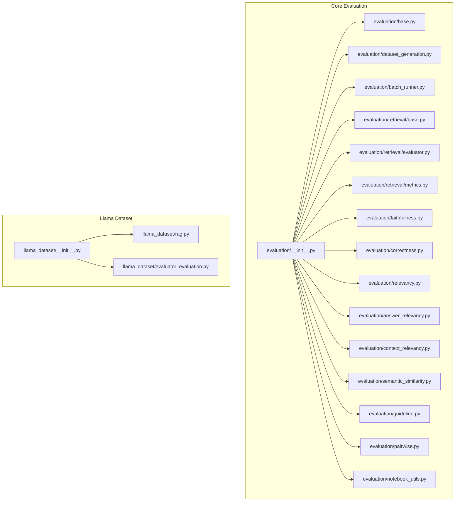
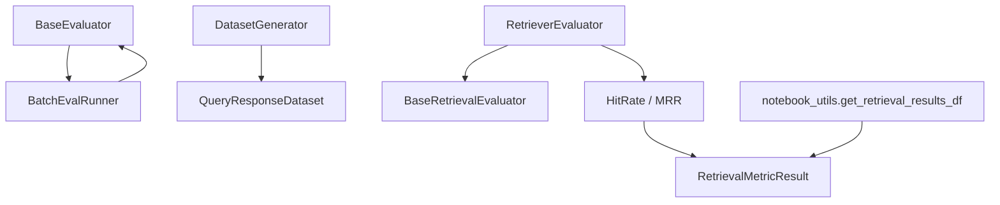
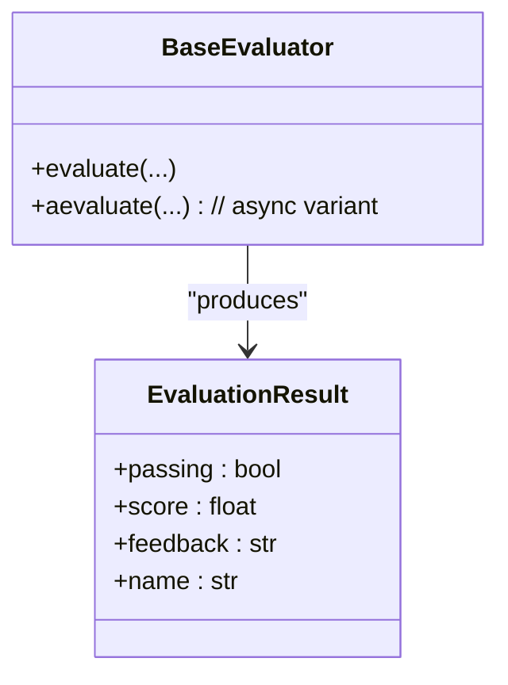
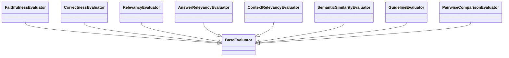
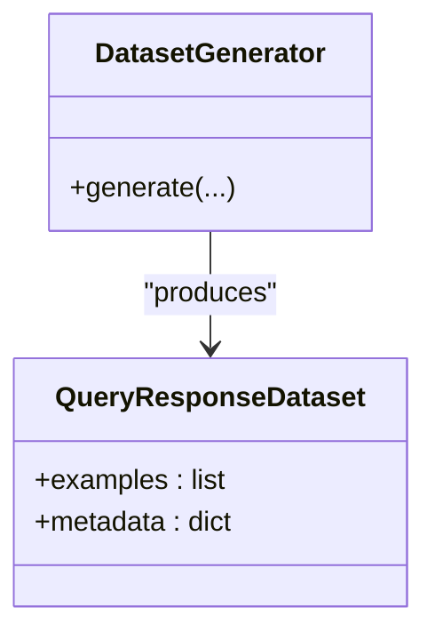
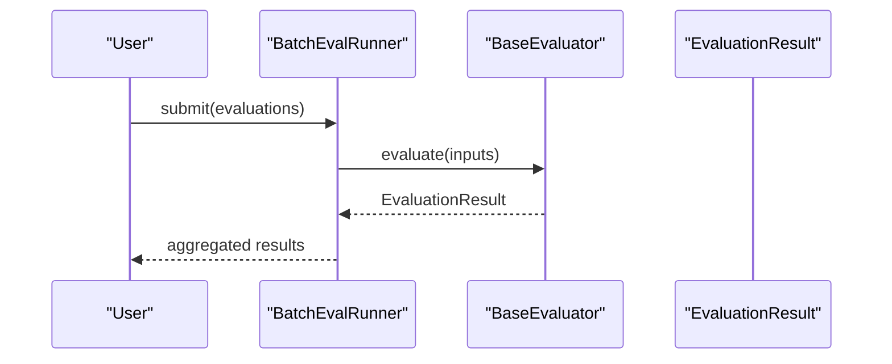
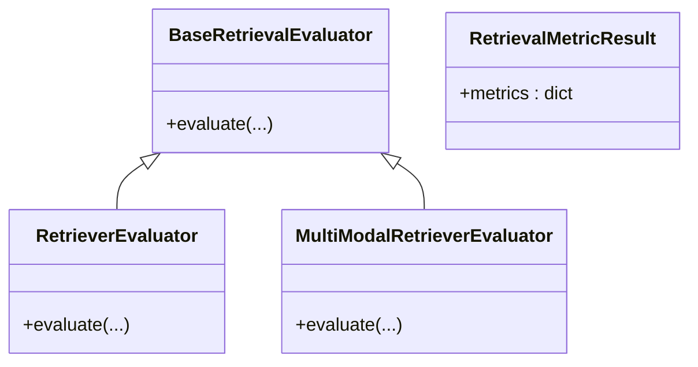
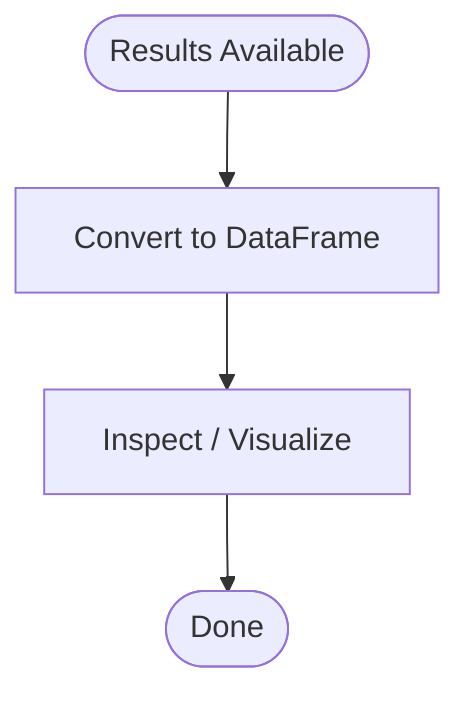
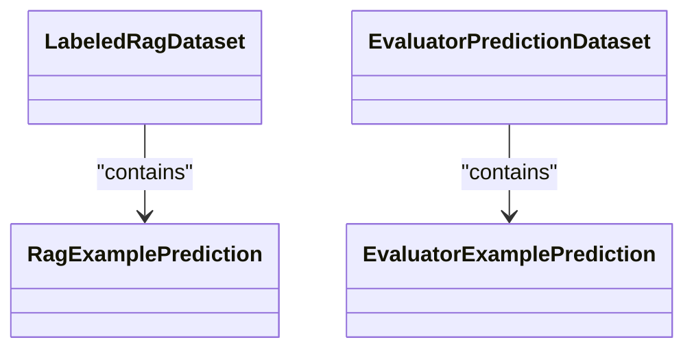
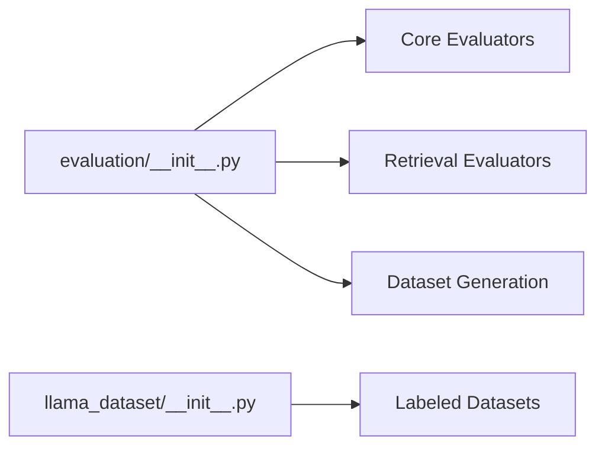

# Custom Evaluation Development

<cite>
**Referenced Files in This Document**
- [evaluation/__init__.py](file://llama-index-core/llama_index/core/evaluation/__init__.py)
- [llama_dataset/__init__.py](file://llama-index-core/llama_index/core/llama_dataset/__init__.py)
- [evaluation/base.py](file://llama-index-core/llama_index/core/evaluation/base.py)
- [evaluation/dataset_generation.py](file://llama-index-core/llama_index/core/evaluation/dataset_generation.py)
- [evaluation/batch_runner.py](file://llama-index-core/llama_index/core/evaluation/batch_runner.py)
- [evaluation/retrieval/base.py](file://llama-index-core/llama_index/core/evaluation/retrieval/base.py)
- [evaluation/retrieval/evaluator.py](file://llama-index-core/llama_index/core/evaluation/retrieval/evaluator.py)
- [evaluation/retrieval/metrics.py](file://llama-index-core/llama_index/core/evaluation/retrieval/metrics.py)
- [evaluation/faithfulness.py](file://llama-index-core/llama_index/core/evaluation/faithfulness.py)
- [evaluation/correctness.py](file://llama-index-core/llama_index/core/evaluation/correctness.py)
- [evaluation/relevancy.py](file://llama-index-core/llama_index/core/evaluation/relevancy.py)
- [evaluation/answer_relevancy.py](file://llama-index-core/llama_index/core/evaluation/answer_relevancy.py)
- [evaluation/context_relevancy.py](file://llama-index-core/llama_index/core/evaluation/context_relevancy.py)
- [evaluation/semantic_similarity.py](file://llama-index-core/llama_index/core/evaluation/semantic_similarity.py)
- [evaluation/guideline.py](file://llama-index-core/llama_index/core/evaluation/guideline.py)
- [evaluation/pairwise.py](file://llama-index-core/llama_index/core/evaluation/pairwise.py)
- [llama_dataset/rag.py](file://llama-index-core/llama_index/core/llama_dataset/rag.py)
- [llama_dataset/evaluator_evaluation.py](file://llama-index-core/llama_index/core/llama_dataset/evaluator_evaluation.py)
- [evaluation/notebook_utils.py](file://llama-index-core/llama_index/core/evaluation/notebook_utils.py)
</cite>

## Table of Contents
1. [Introduction](#introduction)
2. [Project Structure](#project-structure)
3. [Core Components](#core-components)
4. [Architecture Overview](#architecture-overview)
5. [Detailed Component Analysis](#detailed-component-analysis)
6. [Dependency Analysis](#dependency-analysis)
7. [Performance Considerations](#performance-considerations)
8. [Troubleshooting Guide](#troubleshooting-guide)
9. [Conclusion](#conclusion)
10. [Appendices](#appendices)

## Introduction
This document explains how to build custom evaluation systems in LlamaIndex. It covers the BaseEvaluator interface, building custom metrics, designing evaluation protocols, generating synthetic datasets with DatasetGenerator and QueryResponseDataset, and composing multi-criteria evaluations. It also details result formatting, statistical analysis integration, visualization capabilities, reproducibility and versioning, collaborative development practices, and performance optimization strategies.

## Project Structure
The evaluation subsystem is primarily located under llama-index-core in two key areas:
- Core evaluation APIs and built-in evaluators
- Llama dataset abstractions for labeled RAG and evaluator predictions

**Diagram sources**
- [evaluation/__init__.py](file://llama-index-core/llama_index/core/evaluation/__init__.py#L1-L87)
- [llama_dataset/__init__.py](file://llama-index-core/llama_index/core/llama_dataset/__init__.py#L1-L62)

**Section sources**
- [evaluation/__init__.py](file://llama-index-core/llama_index/core/evaluation/__init__.py#L1-L87)
- [llama_dataset/__init__.py](file://llama-index-core/llama_index/core/llama_dataset/__init__.py#L1-L62)

## Core Components
- BaseEvaluator: Defines the contract for custom evaluators, including evaluation input/output structures and scoring semantics.
- Built-in evaluators: Faithfulness, Correctness, Relevancy, Answer Relevancy, Context Relevancy, Semantic Similarity, Guideline, Pairwise Comparison.
- DatasetGenerator and QueryResponseDataset: Synthetic dataset creation and structure for evaluation data.
- BatchEvalRunner: Runs multiple evaluations efficiently.
- Retrieval evaluation: Base retrieval evaluator, retriever evaluators, and retrieval metrics (HitRate, MRR).
- Notebook utilities: Helpers for tabular result presentation.

Key exports and aliases are exposed via the evaluation module’s public API.

**Section sources**
- [evaluation/__init__.py](file://llama-index-core/llama_index/core/evaluation/__init__.py#L3-L86)
- [llama_dataset/__init__.py](file://llama-index-core/llama_index/core/llama_dataset/__init__.py#L3-L61)

## Architecture Overview
The evaluation architecture separates concerns into:
- Protocol definition (BaseEvaluator, Retrieval base)
- Built-in evaluators (specialized metric implementations)
- Dataset generation (synthetic QA pairs and structured datasets)
- Execution orchestration (batch runner)
- Metrics and retrieval evaluation (standalone metrics and retriever evaluators)
- Results formatting (notebook utilities)

**Diagram sources**
- [evaluation/base.py](file://llama-index-core/llama_index/core/evaluation/base.py)
- [evaluation/batch_runner.py](file://llama-index-core/llama_index/core/evaluation/batch_runner.py)
- [evaluation/dataset_generation.py](file://llama-index-core/llama_index/core/evaluation/dataset_generation.py)
- [evaluation/retrieval/base.py](file://llama-index-core/llama_index/core/evaluation/retrieval/base.py)
- [evaluation/retrieval/evaluator.py](file://llama-index-core/llama_index/core/evaluation/retrieval/evaluator.py)
- [evaluation/retrieval/metrics.py](file://llama-index-core/llama_index/core/evaluation/retrieval/metrics.py)
- [evaluation/notebook_utils.py](file://llama-index-core/llama_index/core/evaluation/notebook_utils.py)

## Detailed Component Analysis

### BaseEvaluator Interface and Implementation Patterns
- Purpose: Define a uniform evaluation interface for custom metrics.
- Typical responsibilities:
  - Accept evaluation inputs (query, response, contexts, reference).
  - Compute score(s) and optional explanation.
  - Return standardized EvaluationResult.
- Implementation tips:
  - Normalize scores to a consistent scale.
  - Provide deterministic behavior for reproducibility.
  - Support batch-friendly designs for throughput.

**Diagram sources**
- [evaluation/base.py](file://llama-index-core/llama_index/core/evaluation/base.py)

**Section sources**
- [evaluation/base.py](file://llama-index-core/llama_index/core/evaluation/base.py)

### Built-in Evaluators and Metric Families
- FaithfulnessEvaluator: Verifies claims in the response are supported by provided context.
- CorrectnessEvaluator: Compares generated response to a reference answer.
- RelevancyEvaluator: Checks relevance of retrieved context to the query.
- AnswerRelevancyEvaluator: Measures relevance of the final answer to the query.
- ContextRelevancyEvaluator: Measures relevance of each context item to the query.
- SemanticSimilarityEvaluator: Uses semantic similarity against reference.
- GuidelineEvaluator: Enforces adherence to explicit guidelines.
- PairwiseComparisonEvaluator: Compares two candidate responses.

Implementation pattern:
- Each evaluator encapsulates a specific metric or heuristic.
- They accept the same evaluation inputs and return EvaluationResult.

**Diagram sources**
- [evaluation/faithfulness.py](file://llama-index-core/llama_index/core/evaluation/faithfulness.py)
- [evaluation/correctness.py](file://llama-index-core/llama_index/core/evaluation/correctness.py)
- [evaluation/relevancy.py](file://llama-index-core/llama_index/core/evaluation/relevancy.py)
- [evaluation/answer_relevancy.py](file://llama-index-core/llama_index/core/evaluation/answer_relevancy.py)
- [evaluation/context_relevancy.py](file://llama-index-core/llama_index/core/evaluation/context_relevancy.py)
- [evaluation/semantic_similarity.py](file://llama-index-core/llama_index/core/evaluation/semantic_similarity.py)
- [evaluation/guideline.py](file://llama-index-core/llama_index/core/evaluation/guideline.py)
- [evaluation/pairwise.py](file://llama-index-core/llama_index/core/evaluation/pairwise.py)
- [evaluation/base.py](file://llama-index-core/llama_index/core/evaluation/base.py)

**Section sources**
- [evaluation/faithfulness.py](file://llama-index-core/llama_index/core/evaluation/faithfulness.py)
- [evaluation/correctness.py](file://llama-index-core/llama_index/core/evaluation/correctness.py)
- [evaluation/relevancy.py](file://llama-index-core/llama_index/core/evaluation/relevancy.py)
- [evaluation/answer_relevancy.py](file://llama-index-core/llama_index/core/evaluation/answer_relevancy.py)
- [evaluation/context_relevancy.py](file://llama-index-core/llama_index/core/evaluation/context_relevancy.py)
- [evaluation/semantic_similarity.py](file://llama-index-core/llama_index/core/evaluation/semantic_similarity.py)
- [evaluation/guideline.py](file://llama-index-core/llama_index/core/evaluation/guideline.py)
- [evaluation/pairwise.py](file://llama-index-core/llama_index/core/evaluation/pairwise.py)

### DatasetGenerator and QueryResponseDataset
- DatasetGenerator: Creates synthetic evaluation datasets programmatically.
- QueryResponseDataset: Structured container for query-response pairs plus optional reference and metadata.

Typical usage:
- Generate synthetic QA pairs for domains where ground-truth is expensive.
- Store and version datasets alongside evaluation runs.

**Diagram sources**
- [evaluation/dataset_generation.py](file://llama-index-core/llama_index/core/evaluation/dataset_generation.py)

**Section sources**
- [evaluation/dataset_generation.py](file://llama-index-core/llama_index/core/evaluation/dataset_generation.py)

### BatchEvalRunner
- Purpose: Execute multiple evaluations concurrently and aggregate results.
- Benefits: Reduces total runtime, supports consistent logging and progress tracking.

**Diagram sources**
- [evaluation/batch_runner.py](file://llama-index-core/llama_index/core/evaluation/batch_runner.py)
- [evaluation/base.py](file://llama-index-core/llama_index/core/evaluation/base.py)

**Section sources**
- [evaluation/batch_runner.py](file://llama-index-core/llama_index/core/evaluation/batch_runner.py)

### Retrieval Evaluation
- BaseRetrievalEvaluator: Defines retrieval evaluation protocol.
- RetrieverEvaluator: Standard retriever evaluation using provided metrics.
- MultiModalRetrieverEvaluator: Extends evaluation to multimodal retrieval.
- RetrievalMetricResult: Aggregated metric results (e.g., HitRate, MRR).
- resolve_metrics: Utility to select and configure metrics.

**Diagram sources**
- [evaluation/retrieval/base.py](file://llama-index-core/llama_index/core/evaluation/retrieval/base.py)
- [evaluation/retrieval/evaluator.py](file://llama-index-core/llama_index/core/evaluation/retrieval/evaluator.py)
- [evaluation/retrieval/metrics.py](file://llama-index-core/llama_index/core/evaluation/retrieval/metrics.py)

**Section sources**
- [evaluation/retrieval/base.py](file://llama-index-core/llama_index/core/evaluation/retrieval/base.py)
- [evaluation/retrieval/evaluator.py](file://llama-index-core/llama_index/core/evaluation/retrieval/evaluator.py)
- [evaluation/retrieval/metrics.py](file://llama-index-core/llama_index/core/evaluation/retrieval/metrics.py)

### Notebook Utilities and Result Formatting
- notebook_utils.get_retrieval_results_df: Converts retrieval evaluation results into a DataFrame for quick inspection and visualization.

**Diagram sources**
- [evaluation/notebook_utils.py](file://llama-index-core/llama_index/core/evaluation/notebook_utils.py)

**Section sources**
- [evaluation/notebook_utils.py](file://llama-index-core/llama_index/core/evaluation/notebook_utils.py)

### Llama Dataset Abstractions for Evaluation
- LabeledRagDataset and related types: Provide labeled examples and prediction datasets for RAG evaluation.
- EvaluatorPredictionDataset and related types: Capture evaluator predictions and labels for comparative analysis.

**Diagram sources**
- [llama_dataset/rag.py](file://llama-index-core/llama_index/core/llama_dataset/rag.py)
- [llama_dataset/evaluator_evaluation.py](file://llama-index-core/llama_index/core/llama_dataset/evaluator_evaluation.py)

**Section sources**
- [llama_dataset/rag.py](file://llama-index-core/llama_index/core/llama_dataset/rag.py)
- [llama_dataset/evaluator_evaluation.py](file://llama-index-core/llama_index/core/llama_dataset/evaluator_evaluation.py)

## Dependency Analysis
- Public API exposure: evaluation/__init__.py re-exports core evaluators, dataset generation utilities, retrieval evaluators, and metrics.
- Dataset module: llama_dataset/__init__.py exposes labeled datasets and prediction datasets for evaluation workflows.
- Cohesion: Evaluation components are cohesive around a shared EvaluationResult and evaluation input contracts.
- Coupling: Built-in evaluators depend on BaseEvaluator; retrieval evaluators depend on BaseRetrievalEvaluator and metrics.

**Diagram sources**
- [evaluation/__init__.py](file://llama-index-core/llama_index/core/evaluation/__init__.py#L1-L87)
- [llama_dataset/__init__.py](file://llama-index-core/llama_index/core/llama_dataset/__init__.py#L1-L62)

**Section sources**
- [evaluation/__init__.py](file://llama-index-core/llama_index/core/evaluation/__init__.py#L1-L87)
- [llama_dataset/__init__.py](file://llama-index-core/llama_index/core/llama_dataset/__init__.py#L1-L62)

## Performance Considerations
- Use BatchEvalRunner to parallelize evaluations and reduce wall-clock time.
- Prefer lightweight scorers and cache expensive computations (e.g., embeddings) when appropriate.
- Minimize repeated I/O and network calls during evaluation loops.
- For retrieval evaluation, precompute embeddings or indices to accelerate metric computation.
- Control concurrency and resource limits to avoid saturation of underlying LLMs or embedding endpoints.

[No sources needed since this section provides general guidance]

## Troubleshooting Guide
- Non-deterministic results: Ensure evaluators reset internal state and rely on provided inputs only.
- Score normalization: Verify custom evaluators return normalized scores consistent with built-ins.
- Missing references: For correctness and faithfulness evaluators, confirm reference answers and contexts are present.
- Retrieval metrics: Validate that ground-truth labels and predicted rankings align in terms of IDs and ordering.
- Notebook visualization: Confirm RetrievalMetricResult keys match expectations before converting to DataFrame.

**Section sources**
- [evaluation/notebook_utils.py](file://llama-index-core/llama_index/core/evaluation/notebook_utils.py)

## Conclusion
LlamaIndex provides a robust, extensible evaluation framework. By implementing BaseEvaluator, leveraging built-in evaluators, generating synthetic datasets, orchestrating batch runs, and integrating retrieval metrics, teams can design comprehensive, reproducible, and collaborative evaluation systems. The included dataset abstractions and notebook utilities further streamline result analysis and visualization.

[No sources needed since this section summarizes without analyzing specific files]

## Appendices

### Step-by-Step: Implementing a Domain-Specific Evaluator
- Define a class inheriting from BaseEvaluator.
- Implement evaluate to compute a domain-relevant score given query, response, contexts, and optional reference.
- Return an EvaluationResult with passing flag, score, feedback, and a descriptive name.
- Test with BatchEvalRunner to validate performance and determinism.

**Section sources**
- [evaluation/base.py](file://llama-index-core/llama_index/core/evaluation/base.py)
- [evaluation/batch_runner.py](file://llama-index-core/llama_index/core/evaluation/batch_runner.py)

### Step-by-Step: Building a Multi-Criteria Evaluation System
- Compose multiple evaluators (e.g., Faithfulness, Correctness, Relevancy).
- Use BatchEvalRunner to run them in parallel across a dataset.
- Aggregate per-example scores and derive composite metrics (mean, confidence intervals).
- Export results to DataFrame for statistical analysis and visualization.

**Section sources**
- [evaluation/batch_runner.py](file://llama-index-core/llama_index/core/evaluation/batch_runner.py)
- [evaluation/notebook_utils.py](file://llama-index-core/llama_index/core/evaluation/notebook_utils.py)

### Step-by-Step: Creating a Custom Scoring Function
- Implement a scorer that accepts the same inputs as BaseEvaluator.evaluate.
- Normalize scores to a fixed range and optionally add penalties for missing references or out-of-scope content.
- Wrap the scorer in a minimal evaluator class that returns EvaluationResult.

**Section sources**
- [evaluation/base.py](file://llama-index-core/llama_index/core/evaluation/base.py)

### Step-by-Step: Designing an Evaluation Protocol
- Define evaluation inputs: query, response, contexts, reference.
- Select evaluators aligned with goals (faithfulness, correctness, relevancy, domain-specific).
- Decide scoring thresholds and pass/fail criteria.
- Version datasets and evaluator configurations; track provenance and metadata.

**Section sources**
- [evaluation/dataset_generation.py](file://llama-index-core/llama_index/core/evaluation/dataset_generation.py)

### Step-by-Step: Synthetic Dataset Creation
- Use DatasetGenerator to produce QueryResponseDataset instances.
- Populate metadata for stratification and reproducibility.
- Persist datasets alongside evaluation runs for auditing.

**Section sources**
- [evaluation/dataset_generation.py](file://llama-index-core/llama_index/core/evaluation/dataset_generation.py)

### Step-by-Step: Retrieval Evaluation
- Prepare ground-truth labels and predicted rankings.
- Use RetrieverEvaluator with desired metrics (HitRate, MRR).
- Convert results to DataFrame for reporting and dashboarding.

**Section sources**
- [evaluation/retrieval/evaluator.py](file://llama-index-core/llama_index/core/evaluation/retrieval/evaluator.py)
- [evaluation/retrieval/metrics.py](file://llama-index-core/llama_index/core/evaluation/retrieval/metrics.py)
- [evaluation/notebook_utils.py](file://llama-index-core/llama_index/core/evaluation/notebook_utils.py)

### Step-by-Step: Complex Scenarios
- Multi-turn conversations: Aggregate per-turn evaluations and compute session-level scores.
- Hallucination detection: Combine FaithfulnessEvaluator with domain-specific checklists.
- Bias assessment: Add GuidelineEvaluator with explicit bias criteria and PairwiseComparisonEvaluator for fairness checks.

**Section sources**
- [evaluation/guideline.py](file://llama-index-core/llama_index/core/evaluation/guideline.py)
- [evaluation/pairwise.py](file://llama-index-core/llama_index/core/evaluation/pairwise.py)
- [evaluation/faithfulness.py](file://llama-index-core/llama_index/core/evaluation/faithfulness.py)

### Reproducibility, Versioning, and Collaboration
- Pin evaluator versions and dataset hashes.
- Store evaluation configs and metadata (LLM settings, prompt versions).
- Use LabeledRagDataset and EvaluatorPredictionDataset to share labeled examples and predictions across teams.
- Track provenance of synthetic datasets and evaluation runs.

**Section sources**
- [llama_dataset/rag.py](file://llama-index-core/llama_index/core/llama_dataset/rag.py)
- [llama_dataset/evaluator_evaluation.py](file://llama-index-core/llama_index/core/llama_dataset/evaluator_evaluation.py)

### Best Practices for Evaluation System Architecture
- Keep evaluators pure and deterministic.
- Encapsulate external dependencies behind interfaces.
- Separate concerns: data generation, evaluation execution, metrics, and reporting.
- Use BatchEvalRunner for throughput; apply backpressure for rate-limited APIs.
- Document evaluation protocols and scoring heuristics for team alignment.

[No sources needed since this section provides general guidance]