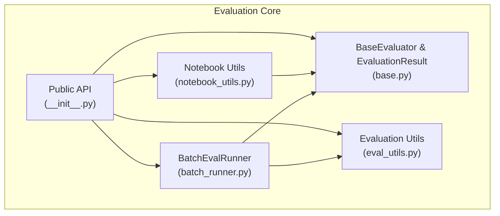
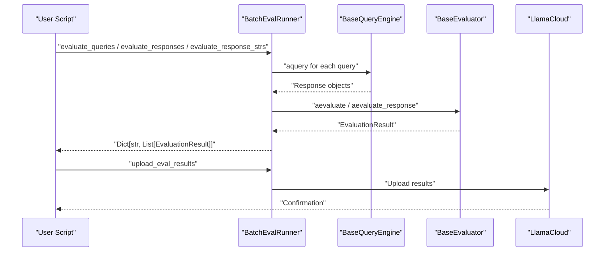
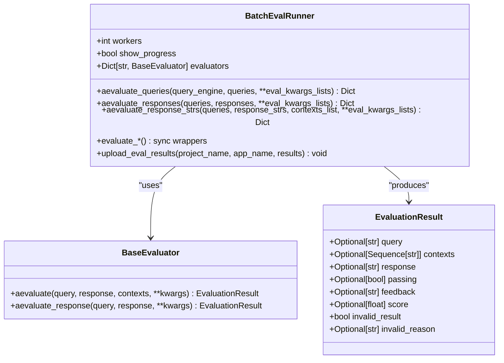
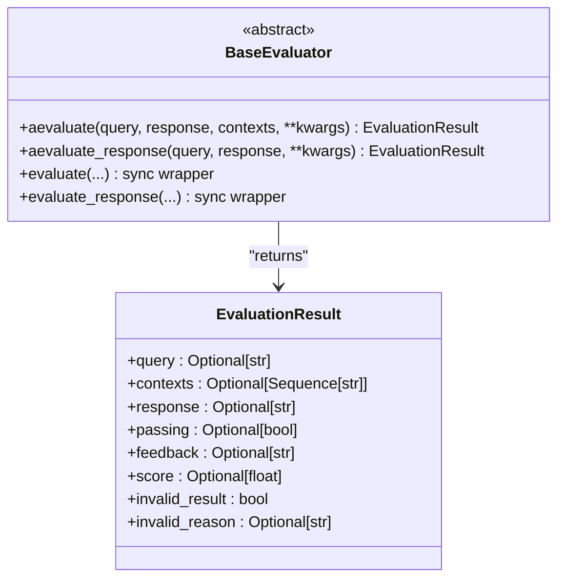
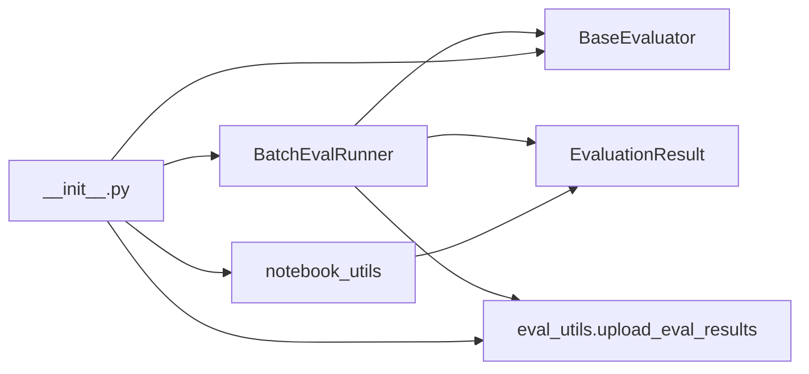

# Evaluation Pipelines and Automation

<cite>
**Referenced Files in This Document**
- [batch_runner.py](file://llama-index-core/llama_index/core/evaluation/batch_runner.py)
- [notebook_utils.py](file://llama-index-core/llama_index/core/evaluation/notebook_utils.py)
- [base.py](file://llama-index-core/llama_index/core/evaluation/base.py)
- [eval_utils.py](file://llama-index-core/llama_index/core/evaluation/eval_utils.py)
- [__init__.py](file://llama-index-core/llama_index/core/evaluation/__init__.py)
- [batch_eval.ipynb](file://docs/examples/evaluation/batch_eval.ipynb)
- [prometheus_evaluation.ipynb](file://docs/examples/evaluation/prometheus_evaluation.ipynb)
- [TransformsEval.ipynb](file://docs/examples/transforms/TransformsEval.ipynb)
- [ensemble_retrieval.ipynb](file://docs/examples/retrievers/ensemble_retrieval.ipynb)
- [auto_merging_retriever.ipynb](file://docs/examples/retrievers/auto_merging_retriever.ipynb)
- [param_optimizer.ipynb](file://docs/examples/param_optimizer/param_optimizer.ipynb)
- [emotion_prompt.ipynb](file://docs/examples/prompts/emotion_prompt.ipynb)
- [MetadataReplacementDemo.ipynb](file://docs/examples/node_postprocessor/MetadataReplacementDemo.ipynb)
- [CHANGELOG.md](file://CHANGELOG.md)
</cite>

## Table of Contents
1. [Introduction](#introduction)
2. [Project Structure](#project-structure)
3. [Core Components](#core-components)
4. [Architecture Overview](#architecture-overview)
5. [Detailed Component Analysis](#detailed-component-analysis)
6. [Dependency Analysis](#dependency-analysis)
7. [Performance Considerations](#performance-considerations)
8. [Troubleshooting Guide](#troubleshooting-guide)
9. [Conclusion](#conclusion)
10. [Appendices](#appendices)

## Introduction
This document explains how to build robust evaluation pipelines and automation systems using LlamaIndex. It focuses on:
- BatchEvalRunner for executing large-scale evaluations with concurrency control and retries
- Aggregation and statistical analysis of evaluation results
- Notebook utilities for visualization and reporting
- Automated pipelines, continuous monitoring, and A/B testing frameworks
- Orchestration of multi-evaluator workflows, dataset management, and report generation
- Scheduling, resource management, and cost optimization strategies
- CI/CD integration, production monitoring, and alerting
- Data retention, archiving, and longitudinal performance tracking

## Project Structure
The evaluation subsystem centers around a small set of cohesive modules:
- Batch evaluation orchestration and concurrency
- Base evaluator interface and result model
- Utilities for uploading results and building datasets
- Notebook helpers for quick visualization and reporting
- Public API exports

**Diagram sources**
- [batch_runner.py](file://llama-index-core/llama_index/core/evaluation/batch_runner.py#L75-L444)
- [base.py](file://llama-index-core/llama_index/core/evaluation/base.py#L12-L140)
- [eval_utils.py](file://llama-index-core/llama_index/core/evaluation/eval_utils.py#L178-L246)
- [notebook_utils.py](file://llama-index-core/llama_index/core/evaluation/notebook_utils.py#L12-L91)
- [__init__.py](file://llama-index-core/llama_index/core/evaluation/__init__.py#L1-L87)

**Section sources**
- [__init__.py](file://llama-index-core/llama_index/core/evaluation/__init__.py#L1-L87)

## Core Components
- BatchEvalRunner: Asynchronous batch executor for evaluating queries, responses, or response strings across multiple evaluators with worker limits and retries.
- BaseEvaluator and EvaluationResult: Standardized evaluator interface and result schema used across all evaluation metrics.
- Evaluation Utils: Helpers for uploading results, building datasets, downloading datasets from hub, and parsing raw evaluator outputs.
- Notebook Utils: Convenience functions to convert evaluation results into DataFrames for reporting and comparison.

Key capabilities:
- Parallelism via asyncio semaphores and gather
- Retry logic for transient failures
- Flexible per-evaluator runtime kwargs
- Upload to LlamaCloud for centralized tracking
- Pandas-backed aggregation and reporting

**Section sources**
- [batch_runner.py](file://llama-index-core/llama_index/core/evaluation/batch_runner.py#L75-L444)
- [base.py](file://llama-index-core/llama_index/core/evaluation/base.py#L12-L140)
- [eval_utils.py](file://llama-index-core/llama_index/core/evaluation/eval_utils.py#L178-L246)
- [notebook_utils.py](file://llama-index-core/llama_index/core/evaluation/notebook_utils.py#L12-L91)

## Architecture Overview
The evaluation pipeline integrates query engines, evaluators, and asynchronous orchestration. Results are aggregated and optionally uploaded to LlamaCloud for long-term storage and visualization.

**Diagram sources**
- [batch_runner.py](file://llama-index-core/llama_index/core/evaluation/batch_runner.py#L319-L348)
- [batch_runner.py](file://llama-index-core/llama_index/core/evaluation/batch_runner.py#L412-L444)
- [base.py](file://llama-index-core/llama_index/core/evaluation/base.py#L76-L135)
- [eval_utils.py](file://llama-index-core/llama_index/core/evaluation/eval_utils.py#L178-L220)

## Detailed Component Analysis

### BatchEvalRunner
Responsibilities:
- Manage concurrency with a semaphore
- Validate inputs and normalize lengths
- Support multi-evaluator kwargs and per-item runtime parameters
- Provide sync and async entry points
- Aggregate results by evaluator name
- Upload results to LlamaCloud

Concurrency and retries:
- Uses asyncio gather with a semaphore to cap workers
- Wraps worker coroutines with exponential backoff retry

Multi-evaluator kwargs:
- Supports per-evaluator kwargs lists keyed by evaluator name
- Validates nested structures and aligns lengths

Asynchronous vs synchronous:
- Async variants return Dict[str, List[EvaluationResult]]
- Sync wrappers delegate to asyncio_run

Upload integration:
- Delegates upload to eval_utils.upload_eval_results

**Diagram sources**
- [batch_runner.py](file://llama-index-core/llama_index/core/evaluation/batch_runner.py#L75-L444)
- [base.py](file://llama-index-core/llama_index/core/evaluation/base.py#L46-L140)

**Section sources**
- [batch_runner.py](file://llama-index-core/llama_index/core/evaluation/batch_runner.py#L75-L444)

### EvaluationResult and BaseEvaluator
- EvaluationResult captures query, contexts, response, score, feedback, and flags for invalid results.
- BaseEvaluator defines async and sync evaluation APIs, plus convenience methods for Response objects.

**Diagram sources**
- [base.py](file://llama-index-core/llama_index/core/evaluation/base.py#L12-L140)

**Section sources**
- [base.py](file://llama-index-core/llama_index/core/evaluation/base.py#L12-L140)

### Evaluation Utils
Capabilities:
- Upload evaluation results to LlamaCloud
- Build labeled datasets and upload questions
- Download datasets from LlamaHub via CLI subprocess
- Parse raw evaluator outputs into score and reasoning

Usage patterns:
- upload_eval_results for centralized tracking
- upload_eval_dataset for dataset lifecycle management
- default_parser for standardizing evaluator text outputs

**Section sources**
- [eval_utils.py](file://llama-index-core/llama_index/core/evaluation/eval_utils.py#L178-L246)

### Notebook Utilities
Functions:
- get_retrieval_results_df: Compute average retrieval metrics across multiple retrievers
- get_eval_results_df: Convert EvaluationResult arrays into DataFrames and compute means

Assumptions:
- Requires pandas
- Validates input lengths and metric presence

**Section sources**
- [notebook_utils.py](file://llama-index-core/llama_index/core/evaluation/notebook_utils.py#L12-L91)

### Example Workflows and Orchestration
- Batch evaluation notebooks demonstrate:
  - Using BatchEvalRunner with multiple evaluators and workers
  - Passing per-item eval kwargs
  - Integrating with query engines and evaluators
- Parameter optimization and prompt tuning notebooks show how to chain evaluation with hyperparameter sweeps.

Examples of notebooks that use BatchEvalRunner:
- [batch_eval.ipynb](file://docs/examples/evaluation/batch_eval.ipynb)
- [prometheus_evaluation.ipynb](file://docs/examples/evaluation/prometheus_evaluation.ipynb)
- [TransformsEval.ipynb](file://docs/examples/transforms/TransformsEval.ipynb)
- [ensemble_retrieval.ipynb](file://docs/examples/retrievers/ensemble_retrieval.ipynb)
- [auto_merging_retriever.ipynb](file://docs/examples/retrievers/auto_merging_retriever.ipynb)
- [param_optimizer.ipynb](file://docs/examples/param_optimizer/param_optimizer.ipynb)
- [emotion_prompt.ipynb](file://docs/examples/prompts/emotion_prompt.ipynb)
- [MetadataReplacementDemo.ipynb](file://docs/examples/node_postprocessor/MetadataReplacementDemo.ipynb)

**Section sources**
- [batch_eval.ipynb](file://docs/examples/evaluation/batch_eval.ipynb#L1-L200)
- [prometheus_evaluation.ipynb](file://docs/examples/evaluation/prometheus_evaluation.ipynb#L560-L570)
- [TransformsEval.ipynb](file://docs/examples/transforms/TransformsEval.ipynb#L250-L280)
- [ensemble_retrieval.ipynb](file://docs/examples/retrievers/ensemble_retrieval.ipynb#L660-L740)
- [auto_merging_retriever.ipynb](file://docs/examples/retrievers/auto_merging_retriever.ipynb#L880-L960)
- [auto_merging_retriever.ipynb](file://docs/examples/retrievers/auto_merging_retriever.ipynb#L1070-L1080)
- [param_optimizer.ipynb](file://docs/examples/param_optimizer/param_optimizer.ipynb#L220-L280)
- [emotion_prompt.ipynb](file://docs/examples/prompts/emotion_prompt.ipynb#L188-L200)
- [MetadataReplacementDemo.ipynb](file://docs/examples/node_postprocessor/MetadataReplacementDemo.ipynb#L700-L760)

## Dependency Analysis
- BatchEvalRunner depends on BaseEvaluator and EvaluationResult, and optionally uploads via eval_utils.
- Notebook utilities depend on pandas and EvaluationResult types.
- Public API re-exports core evaluation classes and utilities.

**Diagram sources**
- [batch_runner.py](file://llama-index-core/llama_index/core/evaluation/batch_runner.py#L75-L444)
- [base.py](file://llama-index-core/llama_index/core/evaluation/base.py#L46-L140)
- [eval_utils.py](file://llama-index-core/llama_index/core/evaluation/eval_utils.py#L178-L246)
- [notebook_utils.py](file://llama-index-core/llama_index/core/evaluation/notebook_utils.py#L12-L91)
- [__init__.py](file://llama-index-core/llama_index/core/evaluation/__init__.py#L1-L87)

**Section sources**
- [__init__.py](file://llama-index-core/llama_index/core/evaluation/__init__.py#L1-L87)

## Performance Considerations
- Concurrency control: Tune workers to balance throughput and resource usage. The semaphore caps concurrent tasks.
- Retry strategy: Built-in exponential backoff reduces transient failure impact.
- Input validation: Ensures aligned lengths and prevents misalignment errors that could cause wasted work.
- Async batching: Gathering tasks minimizes overhead compared to sequential loops.
- Cost optimization:
  - Limit workers to avoid rate limiting or quota exhaustion
  - Use smaller batches for long-running evaluators
  - Prefer uploading results in bulk to reduce network overhead
- Resource management:
  - Monitor memory usage during large-scale evaluations
  - Use context managers and proper cleanup for long-running jobs

[No sources needed since this section provides general guidance]

## Troubleshooting Guide
Common issues and resolutions:
- Missing inputs: At least one of queries or response_strs/responses must be provided; otherwise, a validation error is raised.
- Length mismatch: All provided sequences must have equal length; otherwise, a validation error is raised.
- Empty or malformed evaluator output: Use default_parser to safely extract score and reasoning; handle empty strings gracefully.
- Missing pandas: Notebook utilities require pandas; install it to enable DataFrame conversions.
- Upload failures: Ensure credentials and project/app names are correct; verify network connectivity and permissions.

**Section sources**
- [batch_runner.py](file://llama-index-core/llama_index/core/evaluation/batch_runner.py#L112-L142)
- [eval_utils.py](file://llama-index-core/llama_index/core/evaluation/eval_utils.py#L222-L246)
- [notebook_utils.py](file://llama-index-core/llama_index/core/evaluation/notebook_utils.py#L18-L23)

## Conclusion
LlamaIndex provides a concise, extensible framework for building scalable evaluation pipelines. BatchEvalRunner offers safe, parallelized execution with retries and flexible per-evaluator configuration. Combined with notebook utilities and LlamaCloud integration, teams can automate evaluation workflows, continuously monitor performance, and generate actionable reports for A/B testing and production monitoring.

[No sources needed since this section summarizes without analyzing specific files]

## Appendices

### Automated Pipeline Design and Continuous Monitoring
- Schedule periodic evaluations using cron or CI/CD triggers
- Store results in LlamaCloud for historical tracking and regression detection
- Use notebook utilities to generate weekly/monthly reports
- Alert on performance drops or increased error rates

[No sources needed since this section provides general guidance]

### A/B Testing Frameworks
- Compare multiple evaluators or configurations side-by-side
- Use get_retrieval_results_df for retrieval metrics and get_eval_results_df for answer quality
- Track significance using paired comparisons and confidence intervals

[No sources needed since this section provides general guidance]

### Evaluation Datasets and Longitudinal Tracking
- Build labeled datasets with upload_eval_dataset and manage versions over time
- Archive old results and datasets periodically to control costs
- Use changelog entries to track regressions or improvements across releases

**Section sources**
- [CHANGELOG.md](file://CHANGELOG.md#L7910-L7920)
- [CHANGELOG.md](file://CHANGELOG.md#L8340-L8345)