# Evaluation and Benchmarking

<cite>
**Referenced Files in This Document**
- [evaluation/__init__.py](file://llama-index-core/llama_index/core/evaluation/__init__.py)
- [answer_relevancy.py](file://llama-index-core/llama_index/core/evaluation/answer_relevancy.py)
- [context_relevancy.py](file://llama-index-core/llama_index/core/evaluation/context_relevancy.py)
- [faithfulness.py](file://llama-index-core/llama_index/core/evaluation/faithfulness.py)
- [correctness.py](file://llama-index-core/llama_index/core/evaluation/correctness.py)
- [relevancy.py](file://llama-index-core/llama_index/core/evaluation/relevancy.py)
- [batch_runner.py](file://llama-index-core/llama_index/core/evaluation/batch_runner.py)
- [dataset_generation.py](file://llama-index-core/llama_index/core/evaluation/dataset_generation.py)
- [library.json](file://llama-datasets/library.json)
- [mini_truthfulqa/README.md](file://llama-datasets/mini_truthfulqa/README.md)
- [mini_mt_bench_singlegrading/README.md](file://llama-datasets/mini_mt_bench_singlegrading/README.md)
- [docs/examples/evaluation/batch_eval.ipynb](file://docs/examples/evaluation/batch_eval.ipynb)
- [docs/examples/evaluation/mt_bench_human_judgement.ipynb](file://docs/examples/evaluation/mt_bench_human_judgement.ipynb)
- [docs/examples/evaluation/prometheus_evaluation.ipynb](file://docs/examples/evaluation/prometheus_evaluation.ipynb)
- [docs/examples/retrievers/auto_merging_retriever.ipynb](file://docs/examples/retrievers/auto_merging_retriever.ipynb)
- [docs/src/content/docs/framework/optimizing/evaluation/e2e_evaluation.md](file://docs/src/content/docs/framework/optimizing/evaluation/e2e_evaluation.md)
</cite>

## Table of Contents
1. [Introduction](#introduction)
2. [Project Structure](#project-structure)
3. [Core Components](#core-components)
4. [Architecture Overview](#architecture-overview)
5. [Detailed Component Analysis](#detailed-component-analysis)
6. [Dependency Analysis](#dependency-analysis)
7. [Performance Considerations](#performance-considerations)
8. [Troubleshooting Guide](#troubleshooting-guide)
9. [Conclusion](#conclusion)
10. [Appendices](#appendices)

## Introduction
This document describes the LlamaIndex evaluation and benchmarking framework for RAG systems. It explains built-in evaluators (answer relevancy, context relevancy, faithfulness, correctness), benchmark datasets (BEIR, MT-Bench, TruthfulQA, and domain-specific sets), and how to design evaluation protocols, develop custom metrics, and run automated, batched, and continuous evaluations. It also covers best practices, pitfalls, optimization strategies, reproducibility, bias detection, and fairness assessment.

## Project Structure
The evaluation framework centers around:
- Built-in evaluators for answer quality, context quality, faithfulness, and correctness
- A batch runner for parallelized evaluation
- Dataset generation utilities and curated benchmark datasets
- Example notebooks and documentation for end-to-end workflows

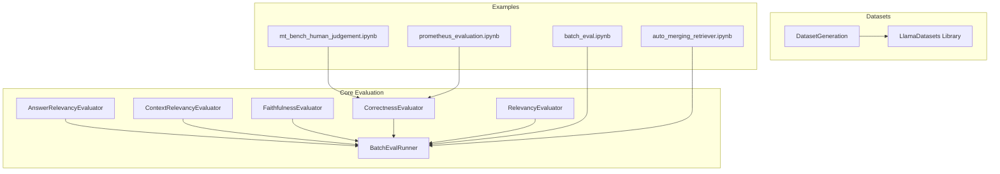

**Diagram sources**
- [evaluation/__init__.py](file://llama-index-core/llama_index/core/evaluation/__init__.py#L1-L87)
- [batch_runner.py](file://llama-index-core/llama_index/core/evaluation/batch_runner.py#L75-L444)
- [dataset_generation.py](file://llama-index-core/llama_index/core/evaluation/dataset_generation.py#L1-L341)
- [docs/examples/evaluation/batch_eval.ipynb](file://docs/examples/evaluation/batch_eval.ipynb#L253-L312)
- [docs/examples/evaluation/mt_bench_human_judgement.ipynb](file://docs/examples/evaluation/mt_bench_human_judgement.ipynb#L86-L130)
- [docs/examples/evaluation/prometheus_evaluation.ipynb](file://docs/examples/evaluation/prometheus_evaluation.ipynb#L1110-L1167)
- [docs/examples/retrievers/auto_merging_retriever.ipynb](file://docs/examples/retrievers/auto_merging_retriever.ipynb#L926-L1019)

**Section sources**
- [evaluation/__init__.py](file://llama-index-core/llama_index/core/evaluation/__init__.py#L1-L87)

## Core Components
- Built-in evaluators:
  - AnswerRelevancyEvaluator: assesses whether a response matches the query’s intent and perspective.
  - ContextRelevancyEvaluator: checks if retrieved context aligns with the query and can support a full answer.
  - FaithfulnessEvaluator: verifies that the response is supported by the provided context(s).
  - CorrectnessEvaluator: compares generated answers against a reference answer on a 1–5 scale.
  - RelevancyEvaluator: determines if a response is consistent with the provided context.
- BatchEvalRunner: orchestrates parallel evaluation across multiple evaluators and inputs, with retries and optional upload to LlamaCloud.
- DatasetGeneration: generates synthetic QA pairs from documents and supports dataset creation for evaluation.
- Benchmark datasets: curated labeled datasets for TruthfulQA, MT-Bench, BEIR, and domain-specific RAG tasks.

**Section sources**
- [answer_relevancy.py](file://llama-index-core/llama_index/core/evaluation/answer_relevancy.py#L1-L147)
- [context_relevancy.py](file://llama-index-core/llama_index/core/evaluation/context_relevancy.py#L1-L178)
- [faithfulness.py](file://llama-index-core/llama_index/core/evaluation/faithfulness.py#L1-L206)
- [correctness.py](file://llama-index-core/llama_index/core/evaluation/correctness.py#L1-L154)
- [relevancy.py](file://llama-index-core/llama_index/core/evaluation/relevancy.py#L1-L145)
- [batch_runner.py](file://llama-index-core/llama_index/core/evaluation/batch_runner.py#L75-L444)
- [dataset_generation.py](file://llama-index-core/llama_index/core/evaluation/dataset_generation.py#L1-L341)
- [library.json](file://llama-datasets/library.json#L1-L88)

## Architecture Overview
The evaluation pipeline integrates query engines, evaluators, and batch runners to produce standardized metrics. It supports:
- Single evaluator runs
- Multi-evaluator batch runs
- Upload to LlamaCloud for centralized reporting
- Dataset-driven evaluation via labeled RAG datasets

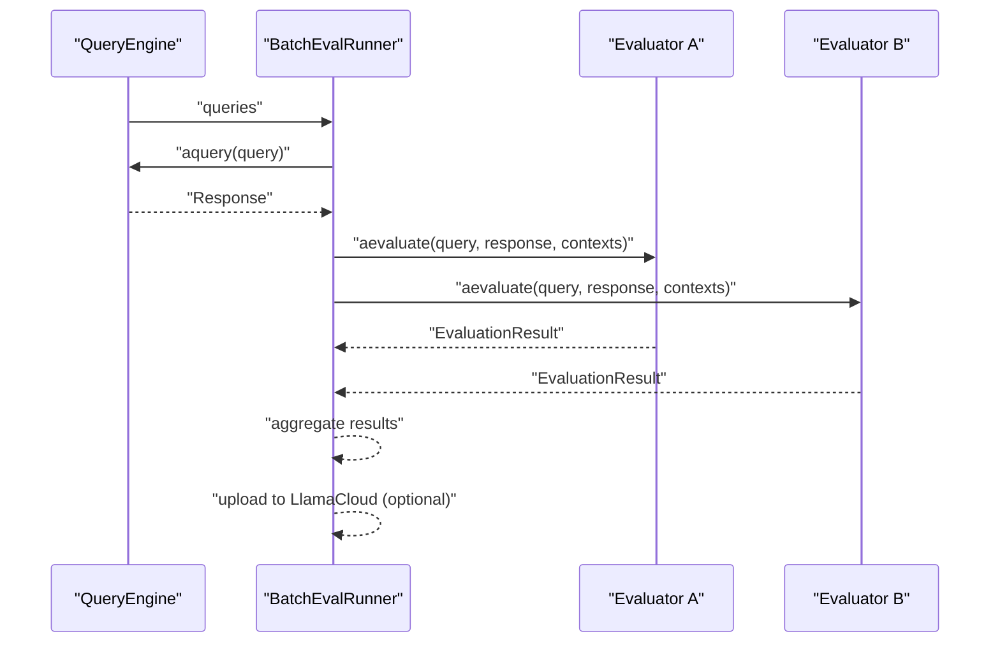

**Diagram sources**
- [batch_runner.py](file://llama-index-core/llama_index/core/evaluation/batch_runner.py#L319-L348)
- [batch_runner.py](file://llama-index-core/llama_index/core/evaluation/batch_runner.py#L261-L317)

## Detailed Component Analysis

### Built-in Evaluators

#### AnswerRelevancyEvaluator
- Purpose: Determine if a response aligns with the query’s subject matter and focus.
- Inputs: query, response.
- Output: normalized score and feedback.
- Parser: extracts numeric score and reasoning from model output.

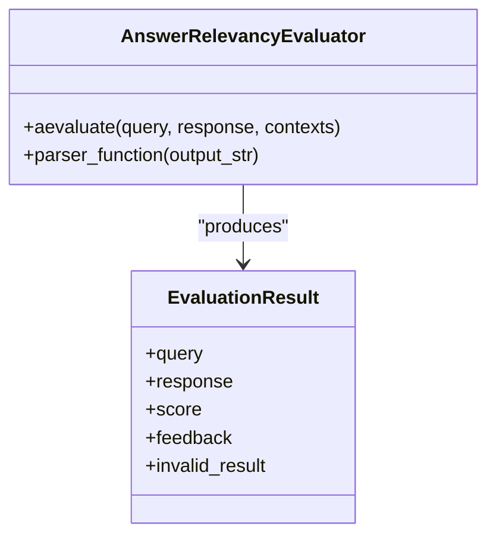

**Diagram sources**
- [answer_relevancy.py](file://llama-index-core/llama_index/core/evaluation/answer_relevancy.py#L49-L147)

**Section sources**
- [answer_relevancy.py](file://llama-index-core/llama_index/core/evaluation/answer_relevancy.py#L1-L147)

#### ContextRelevancyEvaluator
- Purpose: Assess whether retrieved context supports the query and can fully answer it.
- Inputs: query, contexts.
- Method: builds a SummaryIndex and uses templates to evaluate and refine.
- Parser: extracts score and feedback.

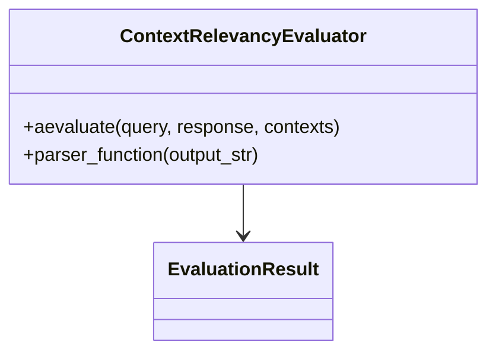

**Diagram sources**
- [context_relevancy.py](file://llama-index-core/llama_index/core/evaluation/context_relevancy.py#L66-L178)

**Section sources**
- [context_relevancy.py](file://llama-index-core/llama_index/core/evaluation/context_relevancy.py#L1-L178)

#### FaithfulnessEvaluator
- Purpose: Detect hallucinations by verifying response statements against context.
- Inputs: query (as statement), contexts.
- Method: uses a query engine over context to classify YES/NO; supports model-specific templates.

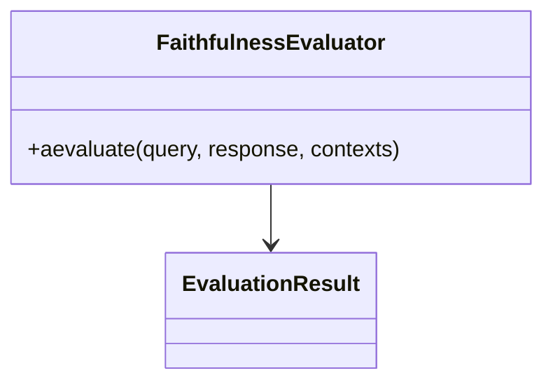

**Diagram sources**
- [faithfulness.py](file://llama-index-core/llama_index/core/evaluation/faithfulness.py#L98-L206)

**Section sources**
- [faithfulness.py](file://llama-index-core/llama_index/core/evaluation/faithfulness.py#L1-L206)

#### CorrectnessEvaluator
- Purpose: Compare generated answer to a reference answer on a 1–5 scale.
- Inputs: query, generated answer, reference answer.
- Threshold: passing score configurable (default 4.0).

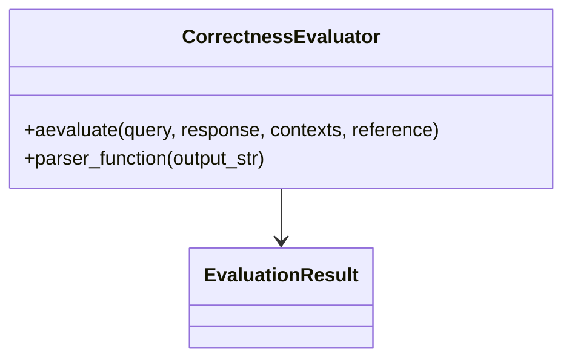

**Diagram sources**
- [correctness.py](file://llama-index-core/llama_index/core/evaluation/correctness.py#L69-L154)

**Section sources**
- [correctness.py](file://llama-index-core/llama_index/core/evaluation/correctness.py#L1-L154)

#### RelevancyEvaluator
- Purpose: Determine if a response is consistent with provided context.
- Inputs: query, response, contexts.
- Method: constructs a combined prompt and classifies YES/NO.

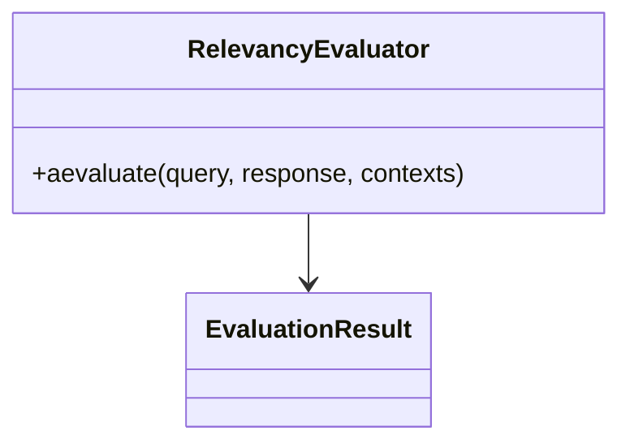

**Diagram sources**
- [relevancy.py](file://llama-index-core/llama_index/core/evaluation/relevancy.py#L42-L145)

**Section sources**
- [relevancy.py](file://llama-index-core/llama_index/core/evaluation/relevancy.py#L1-L145)

### BatchEvalRunner
- Parallelizes evaluation across multiple evaluators and inputs.
- Supports:
  - evaluate_response_strs
  - evaluate_responses
  - evaluate_queries (fetches responses via a query engine)
- Includes retry logic and optional upload to LlamaCloud.

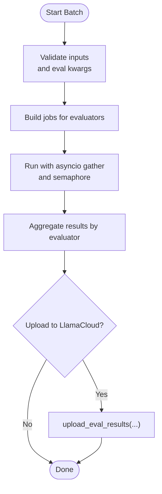

**Diagram sources**
- [batch_runner.py](file://llama-index-core/llama_index/core/evaluation/batch_runner.py#L112-L181)
- [batch_runner.py](file://llama-index-core/llama_index/core/evaluation/batch_runner.py#L195-L259)
- [batch_runner.py](file://llama-index-core/llama_index/core/evaluation/batch_runner.py#L261-L317)
- [batch_runner.py](file://llama-index-core/llama_index/core/evaluation/batch_runner.py#L319-L348)
- [batch_runner.py](file://llama-index-core/llama_index/core/evaluation/batch_runner.py#L412-L444)

**Section sources**
- [batch_runner.py](file://llama-index-core/llama_index/core/evaluation/batch_runner.py#L75-L444)

### Dataset Generation and Benchmark Datasets
- DatasetGeneration: creates question-answer pairs from documents and supports labeled datasets for evaluation.
- LlamaDatasets library: curated datasets including TruthfulQA, MT-Bench, BEIR, and domain-specific RAG datasets.

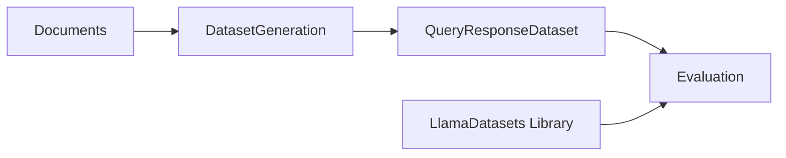

**Diagram sources**
- [dataset_generation.py](file://llama-index-core/llama_index/core/evaluation/dataset_generation.py#L117-L341)
- [library.json](file://llama-datasets/library.json#L1-L88)

**Section sources**
- [dataset_generation.py](file://llama-index-core/llama_index/core/evaluation/dataset_generation.py#L1-L341)
- [library.json](file://llama-datasets/library.json#L1-L88)

### Example Workflows and Automated Pipelines
- Batch evaluation notebooks demonstrate computing per-metric scores and aggregating results.
- MT-Bench human judgment and Prometheus/GPT-4 correctness evaluations illustrate multi-evaluator workflows.
- Auto-merging retriever example shows batch evaluation across multiple metrics.

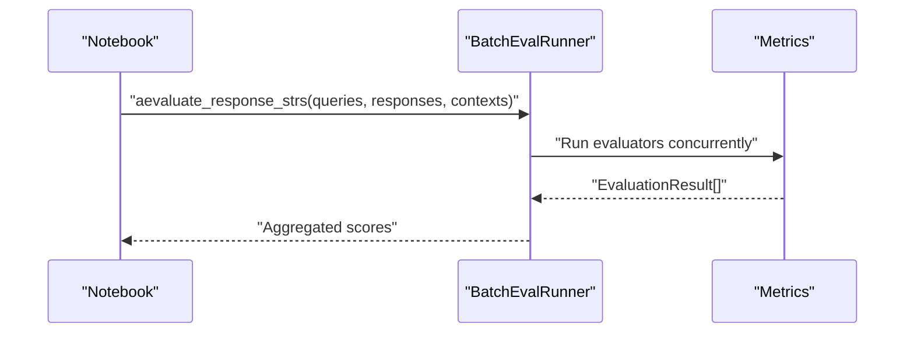

**Diagram sources**
- [docs/examples/evaluation/batch_eval.ipynb](file://docs/examples/evaluation/batch_eval.ipynb#L253-L312)
- [docs/examples/evaluation/prometheus_evaluation.ipynb](file://docs/examples/evaluation/prometheus_evaluation.ipynb#L1110-L1167)
- [docs/examples/retrievers/auto_merging_retriever.ipynb](file://docs/examples/retrievers/auto_merging_retriever.ipynb#L926-L1019)

**Section sources**
- [docs/examples/evaluation/batch_eval.ipynb](file://docs/examples/evaluation/batch_eval.ipynb#L253-L312)
- [docs/examples/evaluation/mt_bench_human_judgement.ipynb](file://docs/examples/evaluation/mt_bench_human_judgement.ipynb#L86-L130)
- [docs/examples/evaluation/prometheus_evaluation.ipynb](file://docs/examples/evaluation/prometheus_evaluation.ipynb#L1110-L1167)
- [docs/examples/retrievers/auto_merging_retriever.ipynb](file://docs/examples/retrievers/auto_merging_retriever.ipynb#L926-L1019)

## Dependency Analysis
- Core module exports all evaluators and runners for easy import.
- BatchEvalRunner depends on BaseEvaluator and EvaluationResult contracts.
- FaithfulnessEvaluator optionally selects model-specific templates based on LLM metadata.

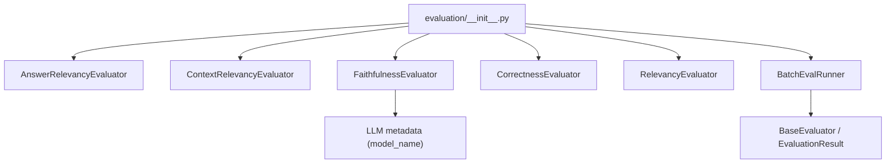

**Diagram sources**
- [evaluation/__init__.py](file://llama-index-core/llama_index/core/evaluation/__init__.py#L1-L87)
- [batch_runner.py](file://llama-index-core/llama_index/core/evaluation/batch_runner.py#L75-L98)
- [faithfulness.py](file://llama-index-core/llama_index/core/evaluation/faithfulness.py#L117-L144)

**Section sources**
- [evaluation/__init__.py](file://llama-index-core/llama_index/core/evaluation/__init__.py#L1-L87)
- [batch_runner.py](file://llama-index-core/llama_index/core/evaluation/batch_runner.py#L75-L98)
- [faithfulness.py](file://llama-index-core/llama_index/core/evaluation/faithfulness.py#L117-L144)

## Performance Considerations
- Parallelism: BatchEvalRunner uses semaphores and asyncio.gather to maximize throughput while respecting rate limits.
- Retry and backoff: Built-in tenacity retry reduces transient failures.
- Rate limiting: Adjust batch sizes and sleep intervals for LLM providers with strict quotas.
- Indexing overhead: ContextRelevancyEvaluator and FaithfulnessEvaluator build temporary indices; cache or reuse where feasible.

[No sources needed since this section provides general guidance]

## Troubleshooting Guide
Common issues and remedies:
- Invalid parser output: Some evaluators return invalid_result when parsing fails; enable raise_error or adjust templates.
- Mismatched input lengths: BatchEvalRunner validates that all input sequences have equal length.
- Missing inputs: Evaluators require query and either response or contexts depending on the metric.
- Upload failures: LlamaCloud upload requires credentials and project/app names; verify configuration.

**Section sources**
- [answer_relevancy.py](file://llama-index-core/llama_index/core/evaluation/answer_relevancy.py#L129-L146)
- [context_relevancy.py](file://llama-index-core/llama_index/core/evaluation/context_relevancy.py#L142-L177)
- [faithfulness.py](file://llama-index-core/llama_index/core/evaluation/faithfulness.py#L172-L201)
- [correctness.py](file://llama-index-core/llama_index/core/evaluation/correctness.py#L134-L153)
- [batch_runner.py](file://llama-index-core/llama_index/core/evaluation/batch_runner.py#L112-L142)
- [batch_runner.py](file://llama-index-core/llama_index/core/evaluation/batch_runner.py#L412-L444)

## Conclusion
LlamaIndex provides a robust, extensible evaluation toolkit for RAG systems. Built-in evaluators cover core dimensions—relevance, faithfulness, and correctness—while BatchEvalRunner enables scalable, parallelized evaluation. Curated datasets and example notebooks streamline benchmarking and continuous monitoring. Adopt the best practices below to ensure reliable, reproducible, and fair assessments.

## Appendices

### Built-in Metrics and Their Purposes
- Answer Relevancy: measures alignment between query and response.
- Context Relevancy: measures support and sufficiency of retrieved context.
- Faithfulness: detects hallucinations by checking contextual support.
- Correctness: compares generated answers to reference answers on a 1–5 scale.

**Section sources**
- [answer_relevancy.py](file://llama-index-core/llama_index/core/evaluation/answer_relevancy.py#L49-L147)
- [context_relevancy.py](file://llama-index-core/llama_index/core/evaluation/context_relevancy.py#L66-L178)
- [faithfulness.py](file://llama-index-core/llama_index/core/evaluation/faithfulness.py#L98-L206)
- [correctness.py](file://llama-index-core/llama_index/core/evaluation/correctness.py#L69-L154)

### Benchmark Datasets
- TruthfulQA: truth-telling benchmark; use MiniTruthfulQADataset for quick evaluation.
- MT-Bench: multi-turn reasoning benchmark; use MiniMtBenchSingleGradingDataset for single-grader correctness evaluation.
- BEIR: lexical and semantic retrieval benchmarks; available via LlamaDatasets library.
- Domain-specific: finance, SEC filings, KG-RAG, and more.

**Section sources**
- [mini_truthfulqa/README.md](file://llama-datasets/mini_truthfulqa/README.md#L1-L75)
- [mini_mt_bench_singlegrading/README.md](file://llama-datasets/mini_mt_bench_singlegrading/README.md#L1-L83)
- [library.json](file://llama-datasets/library.json#L1-L88)

### Designing Evaluation Protocols
- Define target outcomes: relevance, faithfulness, correctness, and domain-specific goals.
- Select complementary metrics: e.g., combine FaithfulnessEvaluator with CorrectnessEvaluator.
- Choose datasets: mix curated benchmarks with domain-specific datasets.
- Plan batch sizes and rate limits to balance speed and cost.
- Automate pipelines: integrate BatchEvalRunner into CI/CD for continuous monitoring.

[No sources needed since this section provides general guidance]

### Statistical Significance Testing
- Use paired comparisons across multiple runs to estimate variance.
- Report confidence intervals for aggregated scores.
- Apply appropriate tests (e.g., bootstrap) when comparing systems.

[No sources needed since this section provides general guidance]

### Practical Application Scenarios
- Research assistant: prioritize FaithfulnessEvaluator and ContextRelevancyEvaluator to ensure accurate citations and grounded answers.
- Customer support: emphasize AnswerRelevancyEvaluator and RelevancyEvaluator to keep responses aligned with user intents.
- Specialized domains (finance, legal): augment correctness evaluation with domain-specific rubrics and reference answers.

[No sources needed since this section provides general guidance]

### Best Practices and Pitfalls
- Best practices:
  - Use model-specific templates where available (e.g., FaithfulnessEvaluator catalog).
  - Normalize thresholds and scoring scales across evaluators.
  - Log raw feedback and invalid results for auditability.
  - Version prompts and datasets for reproducibility.
- Common pitfalls:
  - Over-reliance on a single metric leading to gaming behavior.
  - Ignoring rate limits causing throttling and failed runs.
  - Poor prompt design resulting in inconsistent parsing.

[No sources needed since this section provides general guidance]

### Reproducibility, Bias Detection, and Fairness
- Reproducibility:
  - Pin LLM models, templates, and dataset versions.
  - Store prompt variants and parser configurations.
- Bias detection:
  - Stratify evaluation by demographic or topic subgroups.
  - Audit disagreement among evaluators (e.g., GPT-4 vs Prometheus).
- Fairness:
  - Ensure balanced representation across domains and populations.
  - Monitor disparate performance across subpopulations and apply targeted mitigations.

**Section sources**
- [docs/src/content/docs/framework/optimizing/evaluation/e2e_evaluation.md](file://docs/src/content/docs/framework/optimizing/evaluation/e2e_evaluation.md#L58-L61)