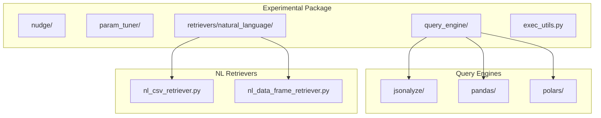
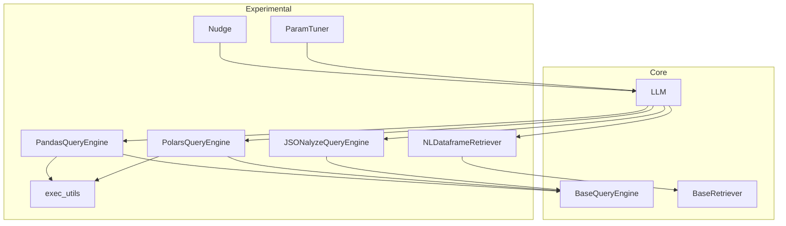
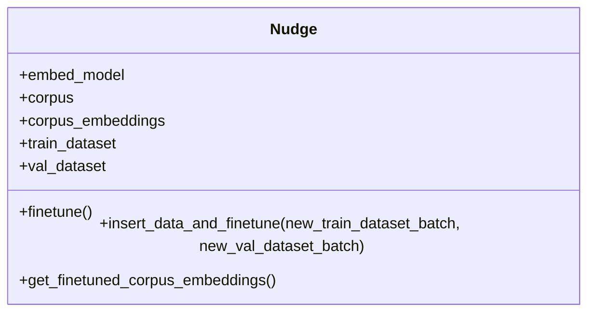
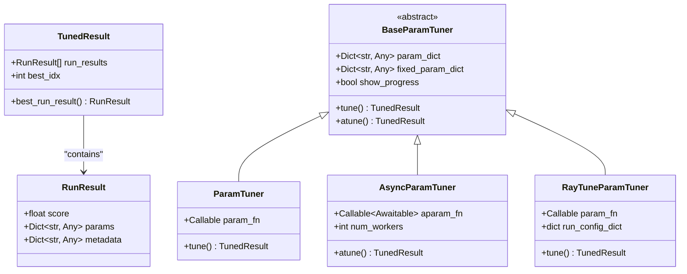
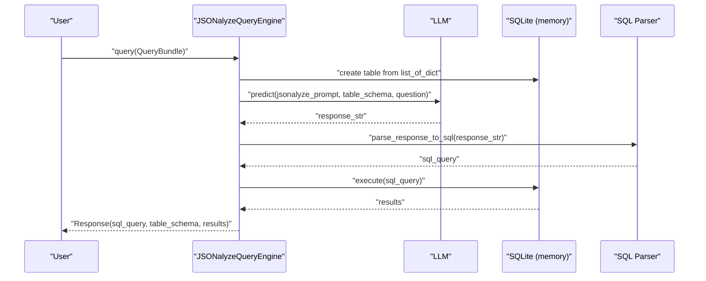
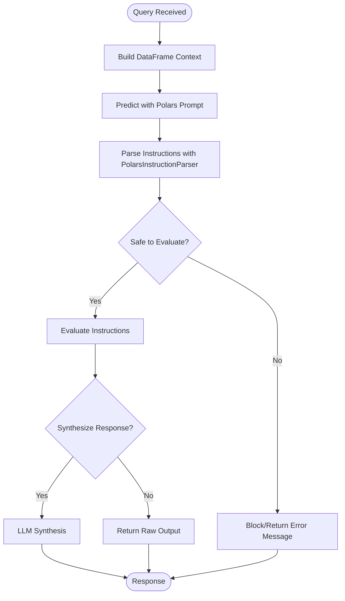
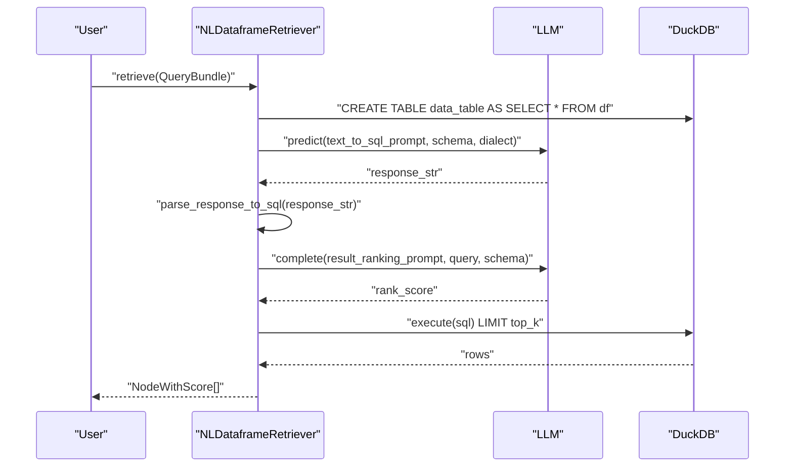
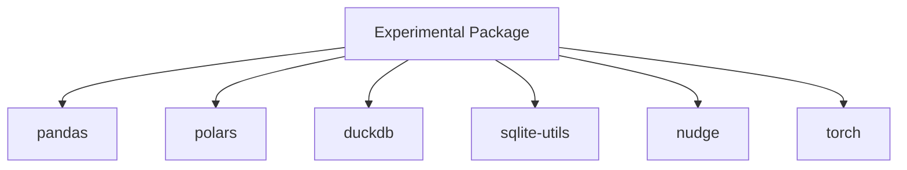

# Experimental Features

<cite>
**Referenced Files in This Document**
- [README.md](file://llama-index-experimental/README.md)
- [pyproject.toml](file://llama-index-experimental/pyproject.toml)
- [__init__.py](file://llama-index-experimental/llama_index/experimental/__init__.py)
- [exec_utils.py](file://llama-index-experimental/llama_index/experimental/exec_utils.py)
- [base.py (Nudge)](file://llama-index-experimental/llama_index/experimental/nudge/base.py)
- [base.py (ParamTuner)](file://llama-index-experimental/llama_index/experimental/param_tuner/base.py)
- [jsonalyze_query_engine.py](file://llama-index-experimental/llama_index/experimental/query_engine/jsonalyze/jsonalyze_query_engine.py)
- [pandas_query_engine.py](file://llama-index-experimental/llama_index/experimental/query_engine/pandas/pandas_query_engine.py)
- [polars_query_engine.py](file://llama-index-experimental/llama_index/experimental/query_engine/polars/polars_query_engine.py)
- [nl_csv_retriever.py](file://llama-index-experimental/llama_index/experimental/retrievers/natural_language/nl_csv_retriever.py)
- [nl_data_frame_retriever.py](file://llama-index-experimental/llama_index/experimental/retrievers/natural_language/nl_data_frame_retriever.py)
- [README.md (Natural Language Retrievers)](file://llama-index-experimental/llama_index/experimental/retrievers/natural_language/README.md)
- [test_pandas.py](file://llama-index-experimental/tests/test_pandas.py)
- [test_polars.py](file://llama-index-experimental/tests/test_polars.py)
</cite>

## Table of Contents
1. [Introduction](#introduction)
2. [Project Structure](#project-structure)
3. [Core Components](#core-components)
4. [Architecture Overview](#architecture-overview)
5. [Detailed Component Analysis](#detailed-component-analysis)
6. [Dependency Analysis](#dependency-analysis)
7. [Performance Considerations](#performance-considerations)
8. [Troubleshooting Guide](#troubleshooting-guide)
9. [Conclusion](#conclusion)
10. [Appendices](#appendices)

## Introduction
This document covers the experimental features in the LlamaIndex ecosystem, focusing on cutting-edge capabilities and emerging technologies. It explains:
- The nudging system for adaptive prompting and parameter adjustment
- Parameter tuning capabilities for hyperparameter optimization and model configuration
- Experimental query engines for JSON data, pandas, and polars
- Natural language retrievers for CSV data, data frames, and structured data retrieval
- Practical examples of adaptive systems, automated optimization, and novel retrieval patterns
- Stability, migration paths, and integration with stable components
- Limitations, performance considerations, and roadmap for feature maturation

These features live in the experimental package and are subject to change until they mature and graduate to core.

**Section sources**
- [README.md](file://llama-index-experimental/README.md#L1-L6)

## Project Structure
The experimental package organizes features by domain:
- nudge: Adaptive embedding fine-tuning using NUDGE
- param_tuner: Hyperparameter optimization utilities
- query_engine: JSONalyze, pandas, and polars query engines
- retrievers/natural_language: NL retrievers for CSV, data frames, and JSON
- exec_utils: Safe evaluation utilities for experimental engines

**Diagram sources**
- [__init__.py](file://llama-index-experimental/llama_index/experimental/__init__.py#L1-L11)
- [jsonalyze_query_engine.py](file://llama-index-experimental/llama_index/experimental/query_engine/jsonalyze/jsonalyze_query_engine.py#L1-L363)
- [pandas_query_engine.py](file://llama-index-experimental/llama_index/experimental/query_engine/pandas/pandas_query_engine.py#L1-L251)
- [polars_query_engine.py](file://llama-index-experimental/llama_index/experimental/query_engine/polars/polars_query_engine.py#L1-L234)
- [nl_csv_retriever.py](file://llama-index-experimental/llama_index/experimental/retrievers/natural_language/nl_csv_retriever.py#L1-L37)
- [nl_data_frame_retriever.py](file://llama-index-experimental/llama_index/experimental/retrievers/natural_language/nl_data_frame_retriever.py#L1-L218)

**Section sources**
- [__init__.py](file://llama-index-experimental/llama_index/experimental/__init__.py#L1-L11)
- [pyproject.toml](file://llama-index-experimental/pyproject.toml#L26-L39)

## Core Components
- Nudge: Adaptive embedding fine-tuning leveraging NUDGE-N/ M with validation datasets and GPU acceleration
- ParamTuner: Grid-based and async hyperparameter optimization with progress reporting and optional Ray Tune integration
- JSONalyze Query Engine: Natural language to SQL over JSON lists using an in-memory SQLite database
- Pandas Query Engine: Natural language to pandas code with safe output parsing and optional response synthesis
- Polars Query Engine: Natural language to polars code with safe output parsing and optional response synthesis
- Natural Language Retrievers: DuckDB-backed NL-to-SQL retrieval for CSV, data frames, and JSON with schema-aware ranking

**Section sources**
- [base.py (Nudge)](file://llama-index-experimental/llama_index/experimental/nudge/base.py#L15-L163)
- [base.py (ParamTuner)](file://llama-index-experimental/llama_index/experimental/param_tuner/base.py#L52-L285)
- [jsonalyze_query_engine.py](file://llama-index-experimental/llama_index/experimental/query_engine/jsonalyze/jsonalyze_query_engine.py#L220-L363)
- [pandas_query_engine.py](file://llama-index-experimental/llama_index/experimental/query_engine/pandas/pandas_query_engine.py#L54-L251)
- [polars_query_engine.py](file://llama-index-experimental/llama_index/experimental/query_engine/polars/polars_query_engine.py#L53-L234)
- [nl_csv_retriever.py](file://llama-index-experimental/llama_index/experimental/retrievers/natural_language/nl_csv_retriever.py#L15-L37)
- [nl_data_frame_retriever.py](file://llama-index-experimental/llama_index/experimental/retrievers/natural_language/nl_data_frame_retriever.py#L71-L218)

## Architecture Overview
The experimental components integrate with LlamaIndex core abstractions:
- Query engines extend BaseQueryEngine and use LLMs to generate executable code or SQL
- NL retrievers translate natural language to SQL using DuckDB and schema metadata
- Nudge adapts embeddings using external libraries and integrates with embedding models
- ParamTuner orchestrates grid search and async execution with optional distributed tuning

**Diagram sources**
- [pandas_query_engine.py](file://llama-index-experimental/llama_index/experimental/query_engine/pandas/pandas_query_engine.py#L14-L251)
- [polars_query_engine.py](file://llama-index-experimental/llama_index/experimental/query_engine/polars/polars_query_engine.py#L14-L234)
- [jsonalyze_query_engine.py](file://llama-index-experimental/llama_index/experimental/query_engine/jsonalyze/jsonalyze_query_engine.py#L18-L363)
- [nl_data_frame_retriever.py](file://llama-index-experimental/llama_index/experimental/retrievers/natural_language/nl_data_frame_retriever.py#L6-L218)
- [base.py (Nudge)](file://llama-index-experimental/llama_index/experimental/nudge/base.py#L15-L163)
- [base.py (ParamTuner)](file://llama-index-experimental/llama_index/experimental/param_tuner/base.py#L52-L285)
- [exec_utils.py](file://llama-index-experimental/llama_index/experimental/exec_utils.py#L1-L173)

## Detailed Component Analysis

### Nudge: Adaptive Embedding Fine-Tuning
Nudge adapts corpus embeddings using NUDGE-N or NUDGE-M with validation datasets. It:
- Validates and installs required dependencies (nudge, torch, numpy)
- Infers device and initializes NUDGE model
- Converts datasets to NUDGE format and computes embeddings
- Supports incremental insertion of new data batches with safety checks

**Diagram sources**
- [base.py (Nudge)](file://llama-index-experimental/llama_index/experimental/nudge/base.py#L15-L163)

**Section sources**
- [base.py (Nudge)](file://llama-index-experimental/llama_index/experimental/nudge/base.py#L15-L163)

### ParamTuner: Hyperparameter Optimization
ParamTuner provides:
- Grid search over parameter spaces with progress tracking
- Synchronous and asynchronous tuning
- Optional Ray Tune integration for distributed tuning
- Structured RunResult and TunedResult models

**Diagram sources**
- [base.py (ParamTuner)](file://llama-index-experimental/llama_index/experimental/param_tuner/base.py#L12-L285)

**Section sources**
- [base.py (ParamTuner)](file://llama-index-experimental/llama_index/experimental/param_tuner/base.py#L52-L285)

### JSONalyze Query Engine
JSONalyze converts natural language queries into SQL over JSON lists using an in-memory SQLite database. It:
- Loads a list of dictionaries into a temporary SQLite table
- Generates SQL via LLM using a dedicated prompt
- Parses and validates SQL output
- Executes query and synthesizes a response if requested

**Diagram sources**
- [jsonalyze_query_engine.py](file://llama-index-experimental/llama_index/experimental/query_engine/jsonalyze/jsonalyze_query_engine.py#L220-L363)

**Section sources**
- [jsonalyze_query_engine.py](file://llama-index-experimental/llama_index/experimental/query_engine/jsonalyze/jsonalyze_query_engine.py#L220-L363)

### Pandas Query Engine
PandasQueryEngine translates natural language to pandas code:
- Uses a prompt to generate executable pandas instructions
- Safely parses and evaluates instructions using restricted globals
- Optionally synthesizes a response from the computed result

**Diagram sources**
- [pandas_query_engine.py](file://llama-index-experimental/llama_index/experimental/query_engine/pandas/pandas_query_engine.py#L177-L210)
- [exec_utils.py](file://llama-index-experimental/llama_index/experimental/exec_utils.py#L135-L173)

**Section sources**
- [pandas_query_engine.py](file://llama-index-experimental/llama_index/experimental/query_engine/pandas/pandas_query_engine.py#L54-L251)
- [exec_utils.py](file://llama-index-experimental/llama_index/experimental/exec_utils.py#L1-L173)
- [test_pandas.py](file://llama-index-experimental/tests/test_pandas.py#L81-L181)

### Polars Query Engine
PolarsQueryEngine translates natural language to polars expressions:
- Uses a prompt to generate executable polars instructions
- Safely parses and evaluates instructions using restricted globals
- Optionally synthesizes a response from the computed result

**Diagram sources**
- [polars_query_engine.py](file://llama-index-experimental/llama_index/experimental/query_engine/polars/polars_query_engine.py#L160-L193)
- [exec_utils.py](file://llama-index-experimental/llama_index/experimental/exec_utils.py#L135-L173)

**Section sources**
- [polars_query_engine.py](file://llama-index-experimental/llama_index/experimental/query_engine/polars/polars_query_engine.py#L53-L234)
- [exec_utils.py](file://llama-index-experimental/llama_index/experimental/exec_utils.py#L1-L173)
- [test_polars.py](file://llama-index-experimental/tests/test_polars.py#L80-L214)

### Natural Language Retrievers
NL retrievers convert natural language to SQL using DuckDB:
- NLCSVRetriever loads CSV into a DataFrame and delegates to NLDataframeRetriever
- NLDataframeRetriever:
  - Creates an in-memory DuckDB table from a DataFrame
  - Generates schema and optional OWL description
  - Translates query to SQL via LLM
  - Ranks relevance and retrieves top-k results

**Diagram sources**
- [nl_csv_retriever.py](file://llama-index-experimental/llama_index/experimental/retrievers/natural_language/nl_csv_retriever.py#L15-L37)
- [nl_data_frame_retriever.py](file://llama-index-experimental/llama_index/experimental/retrievers/natural_language/nl_data_frame_retriever.py#L147-L206)

**Section sources**
- [nl_csv_retriever.py](file://llama-index-experimental/llama_index/experimental/retrievers/natural_language/nl_csv_retriever.py#L15-L37)
- [nl_data_frame_retriever.py](file://llama-index-experimental/llama_index/experimental/retrievers/natural_language/nl_data_frame_retriever.py#L71-L218)
- [README.md (Natural Language Retrievers)](file://llama-index-experimental/llama_index/experimental/retrievers/natural_language/README.md#L1-L12)

## Dependency Analysis
External dependencies and integration points:
- pandas and polars are supported via restricted evaluation utilities
- DuckDB enables secure, in-memory SQL execution for NL retrievers
- sqlite-utils powers JSONalyze’s in-memory SQLite database
- nudge and torch are required for Nudge fine-tuning
- Ray Tune integration is optional for distributed tuning

**Diagram sources**
- [pyproject.toml](file://llama-index-experimental/pyproject.toml#L34-L39)
- [pandas_query_engine.py](file://llama-index-experimental/llama_index/experimental/query_engine/pandas/pandas_query_engine.py#L14-L27)
- [polars_query_engine.py](file://llama-index-experimental/llama_index/experimental/query_engine/polars/polars_query_engine.py#L14-L26)
- [nl_data_frame_retriever.py](file://llama-index-experimental/llama_index/experimental/retrievers/natural_language/nl_data_frame_retriever.py#L17-L18)
- [jsonalyze_query_engine.py](file://llama-index-experimental/llama_index/experimental/query_engine/jsonalyze/jsonalyze_query_engine.py#L78-L85)
- [base.py (Nudge)](file://llama-index-experimental/llama_index/experimental/nudge/base.py#L38-L49)

**Section sources**
- [pyproject.toml](file://llama-index-experimental/pyproject.toml#L34-L39)

## Performance Considerations
- Pandas and Polars engines evaluate generated code; restrict to safe operations and avoid heavy computations in prompts
- NL retrievers use DuckDB for efficient SQL execution; schema generation and ranking add overhead but improve accuracy
- JSONalyze builds an in-memory SQLite database per query; reuse analyzers or pre-process data for repeated queries
- ParamTuner grid search scales combinatorially; limit parameter ranges and use async or Ray Tune for concurrency
- Nudge fine-tuning benefits from GPU acceleration; ensure device inference and batch sizes are appropriate

[No sources needed since this section provides general guidance]

## Troubleshooting Guide
Common issues and mitigations:
- Security warnings: These engines expose eval-like capabilities; use restricted parsers and avoid untrusted prompts
- Import errors: Ensure required packages are installed (e.g., nudge, torch, numpy, sqlite-utils)
- DuckDB/SQLite errors: Validate schema and SQL; handle OperationalError and IntegrityError gracefully
- Memory usage: NL retrievers and JSONalyze use in-memory databases; monitor resource consumption
- Async execution: Use AsyncParamTuner or Ray Tune for concurrent tuning; ensure proper semaphores and run configs

**Section sources**
- [pandas_query_engine.py](file://llama-index-experimental/llama_index/experimental/query_engine/pandas/pandas_query_engine.py#L1-L9)
- [polars_query_engine.py](file://llama-index-experimental/llama_index/experimental/query_engine/polars/polars_query_engine.py#L1-L9)
- [jsonalyze_query_engine.py](file://llama-index-experimental/llama_index/experimental/query_engine/jsonalyze/jsonalyze_query_engine.py#L4-L11)
- [nl_data_frame_retriever.py](file://llama-index-experimental/llama_index/experimental/retrievers/natural_language/nl_data_frame_retriever.py#L177-L178)
- [test_pandas.py](file://llama-index-experimental/tests/test_pandas.py#L81-L181)
- [test_polars.py](file://llama-index-experimental/tests/test_polars.py#L80-L214)

## Conclusion
The experimental package showcases adaptive prompting, automated optimization, and novel retrieval paradigms:
- Nudge enables continuous embedding adaptation with validation
- ParamTuner streamlines hyperparameter search with flexible backends
- JSONalyze, Pandas, and Polars engines demonstrate safe, code-based querying
- NL retrievers offer secure, schema-aware SQL generation via DuckDB

Adopt these features cautiously, monitor performance, and track migration paths as they evolve toward core.

[No sources needed since this section summarizes without analyzing specific files]

## Appendices

### Practical Implementation Patterns
- Adaptive prompting with Nudge:
  - Prepare training and validation datasets
  - Initialize Nudge with desired variant and device
  - Fine-tune periodically and insert new data batches safely
- Automated optimization with ParamTuner:
  - Define parameter grids and scoring function
  - Choose synchronous or asynchronous tuning
  - Optionally integrate Ray Tune for distributed scaling
- Novel retrieval with NL retrievers:
  - Use NLCSVRetriever for CSV files or NLDataframeRetriever for DataFrames
  - Leverage schema and OWL generation for richer context
  - Apply relevance ranking to refine results

[No sources needed since this section provides general guidance]