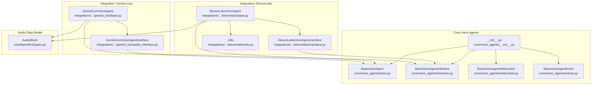
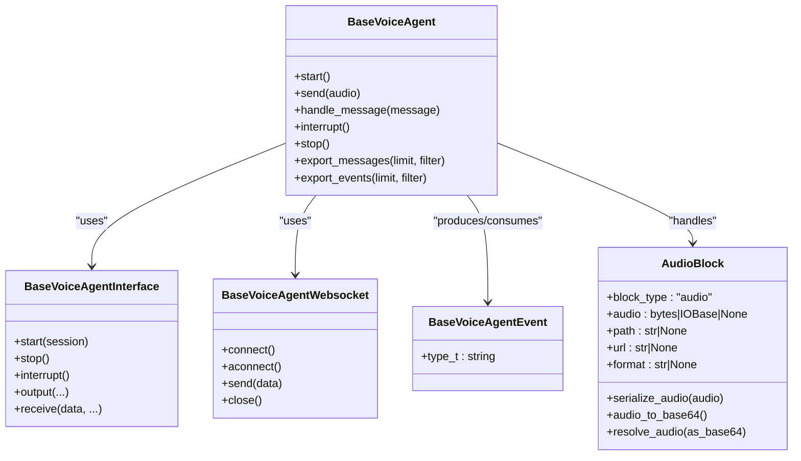
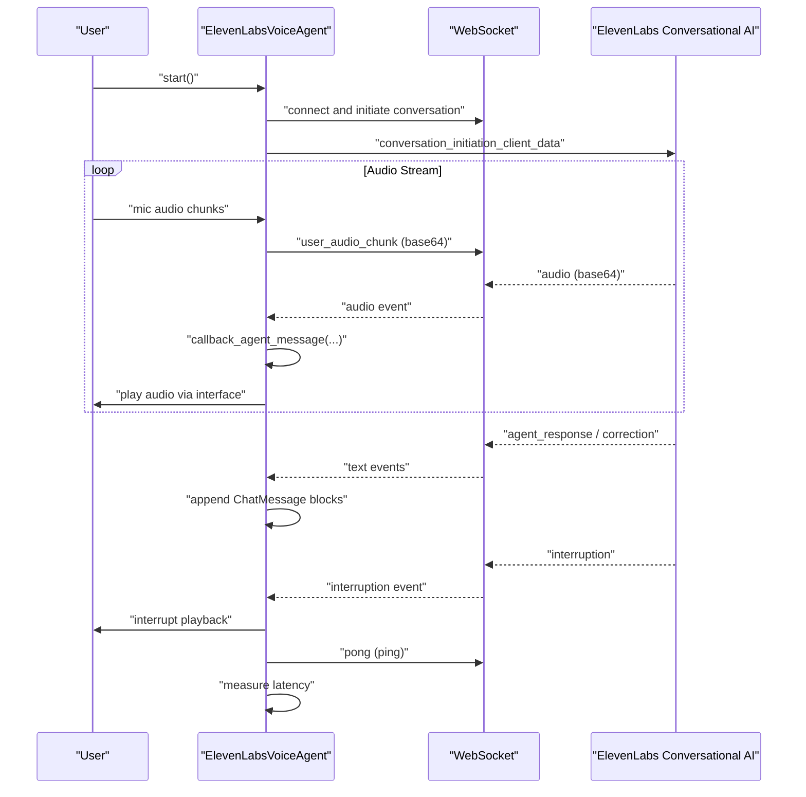
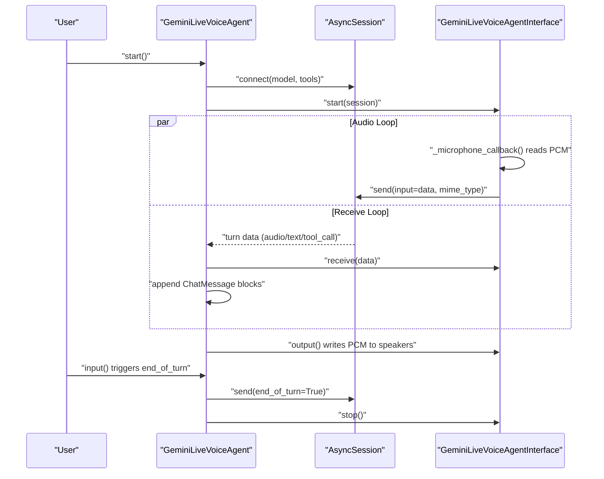
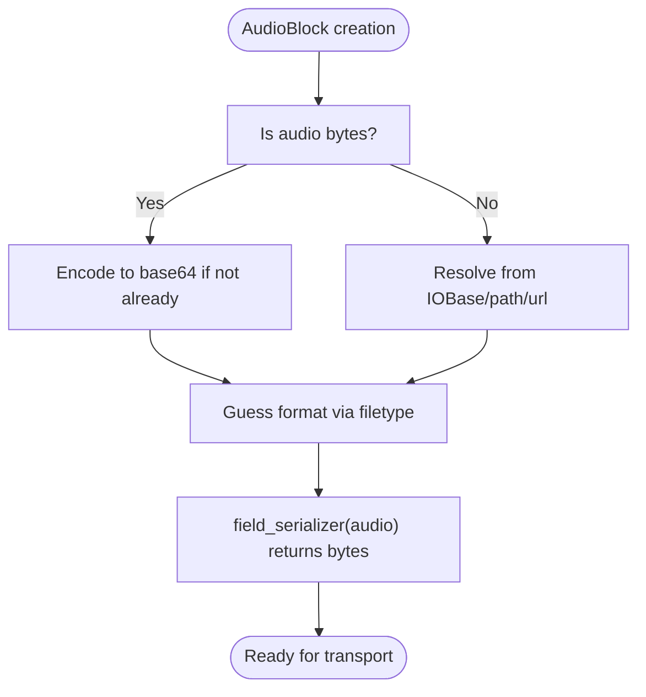
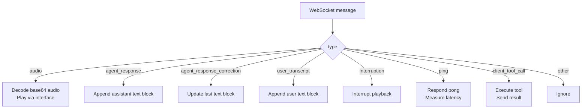
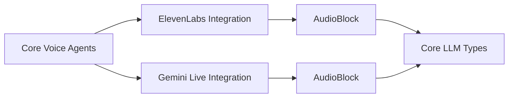

# Audio and Speech Processing

<cite>
**Referenced Files in This Document**
- [voice_agents/__init__.py](file://llama-index-core/llama_index/core/voice_agents/__init__.py)
- [voice_agents/base.py](file://llama-index-core/llama_index/core/voice_agents/base.py)
- [voice_agents/events.py](file://llama-index-core/llama_index/core/voice_agents/events.py)
- [voice_agents/interface.py](file://llama-index-core/llama_index/core/voice_agents/interface.py)
- [voice_agents/websocket.py](file://llama-index-core/llama_index/core/voice_agents/websocket.py)
- [base.py (ElevenLabs)](file://llama-index-integrations/voice_agents/llama-index-voice-agents-elevenlabs/llama_index/voice_agents/elevenlabs/base.py)
- [interface.py (ElevenLabs)](file://llama-index-integrations/voice_agents/llama-index-voice-agents-elevenlabs/llama_index/voice_agents/elevenlabs/interface.py)
- [utils.py (ElevenLabs)](file://llama-index-integrations/voice_agents/llama-index-voice-agents-elevenlabs/llama_index/voice_agents/elevenlabs/utils.py)
- [base.py (Gemini Live)](file://llama-index-integrations/voice_agents/llama-index-voice-agents-gemini-live/llama_index/voice_agents/gemini_live/base.py)
- [audio_interface.py (Gemini Live)](file://llama-index-integrations/voice_agents/llama-index-voice-agents-gemini-live/llama_index/voice_agents/gemini_live/audio_interface.py)
- [types.py (Core LLM Types)](file://llama-index-core/llama_index/core/base/llms/types.py)
</cite>

## Table of Contents
1. [Introduction](#introduction)
2. [Project Structure](#project-structure)
3. [Core Components](#core-components)
4. [Architecture Overview](#architecture-overview)
5. [Detailed Component Analysis](#detailed-component-analysis)
6. [Dependency Analysis](#dependency-analysis)
7. [Performance Considerations](#performance-considerations)
8. [Troubleshooting Guide](#troubleshooting-guide)
9. [Conclusion](#conclusion)
10. [Appendices](#appendices)

## Introduction
This document explains audio and speech processing capabilities in LlamaIndex with a focus on voice agents. It covers speech-to-text and text-to-speech workflows, real-time audio streaming, event-driven architectures, and integrations with external voice services. Practical examples include building voice-enabled Retrieval-Augmented Generation (RAG) applications, audio transcription agents, and interactive voice assistants. The guide also details audio preprocessing, audio format handling, and performance optimization for real-time audio processing.

## Project Structure
The voice agent subsystem is split into:
- Core abstractions under llama-index-core for voice agents, events, interfaces, and websockets
- Integrations under llama-index-integrations for specific providers (e.g., ElevenLabs, Google Gemini Live)
- Audio data modeling in core LLM types for blocks representing audio, images, and other media

**Diagram sources**
- [voice_agents/__init__.py](file://llama-index-core/llama_index/core/voice_agents/__init__.py#L1-L12)
- [voice_agents/base.py](file://llama-index-core/llama_index/core/voice_agents/base.py#L11-L163)
- [voice_agents/interface.py](file://llama-index-core/llama_index/core/voice_agents/interface.py#L5-L116)
- [voice_agents/websocket.py](file://llama-index-core/llama_index/core/voice_agents/websocket.py#L8-L79)
- [voice_agents/events.py](file://llama-index-core/llama_index/core/voice_agents/events.py#L4-L14)
- [base.py (ElevenLabs)](file://llama-index-integrations/voice_agents/llama-index-voice-agents-elevenlabs/llama_index/voice_agents/elevenlabs/base.py#L44-L299)
- [interface.py (ElevenLabs)](file://llama-index-integrations/voice_agents/llama-index-voice-agents-elevenlabs/llama_index/voice_agents/elevenlabs/interface.py#L5-L18)
- [utils.py (ElevenLabs)](file://llama-index-integrations/voice_agents/llama-index-voice-agents-elevenlabs/llama_index/voice_agents/elevenlabs/utils.py#L9-L132)
- [base.py (Gemini Live)](file://llama-index-integrations/voice_agents/llama-index-voice-agents-gemini-live/llama_index/voice_agents/gemini_live/base.py#L28-L223)
- [audio_interface.py (Gemini Live)](file://llama-index-integrations/voice_agents/llama-index-voice-agents-gemini-live/llama_index/voice_agents/gemini_live/audio_interface.py#L19-L150)
- [types.py (Core LLM Types)](file://llama-index-core/llama_index/core/base/llms/types.py#L158-L241)

**Section sources**
- [voice_agents/__init__.py](file://llama-index-core/llama_index/core/voice_agents/__init__.py#L1-L12)
- [types.py (Core LLM Types)](file://llama-index-core/llama_index/core/base/llms/types.py#L158-L241)

## Core Components
- BaseVoiceAgent: Abstract base for voice agents, defining lifecycle methods (start, send, handle_message, interrupt, stop) and utilities to export messages and events.
- BaseVoiceAgentInterface: Abstract audio input/output interface with callbacks for microphone and speaker, plus lifecycle and I/O methods.
- BaseVoiceAgentWebsocket: Abstract websocket transport abstraction for real-time audio streaming.
- BaseVoiceAgentEvent: Pydantic event base for typed events in voice conversations.
- AudioBlock: Core data model for audio payloads, supporting bytes, file-like objects, URLs, and automatic MIME/format inference.

Key responsibilities:
- Audio preprocessing and serialization via AudioBlock
- Real-time audio streaming via websocket and audio interface
- Event-driven orchestration of speech-to-text, text-to-speech, and tool execution
- Provider-specific integrations (ElevenLabs, Gemini Live)

**Section sources**
- [voice_agents/base.py](file://llama-index-core/llama_index/core/voice_agents/base.py#L11-L163)
- [voice_agents/interface.py](file://llama-index-core/llama_index/core/voice_agents/interface.py#L5-L116)
- [voice_agents/websocket.py](file://llama-index-core/llama_index/core/voice_agents/websocket.py#L8-L79)
- [voice_agents/events.py](file://llama-index-core/llama_index/core/voice_agents/events.py#L4-L14)
- [types.py (Core LLM Types)](file://llama-index-core/llama_index/core/base/llms/types.py#L158-L241)

## Architecture Overview
The voice agent architecture separates concerns into:
- Agent: orchestrates lifecycle, message handling, and tool execution
- Interface: handles audio capture/playback and queueing
- Websocket: transports audio chunks and control events
- Events: typed notifications for audio, interruptions, tool calls, and metadata
- Audio data model: standardized audio representation for LLMs

**Diagram sources**
- [voice_agents/base.py](file://llama-index-core/llama_index/core/voice_agents/base.py#L11-L163)
- [voice_agents/interface.py](file://llama-index-core/llama_index/core/voice_agents/interface.py#L5-L116)
- [voice_agents/websocket.py](file://llama-index-core/llama_index/core/voice_agents/websocket.py#L8-L79)
- [voice_agents/events.py](file://llama-index-core/llama_index/core/voice_agents/events.py#L4-L14)
- [types.py (Core LLM Types)](file://llama-index-core/llama_index/core/base/llms/types.py#L158-L241)

## Detailed Component Analysis

### ElevenLabs Voice Agent Integration
The ElevenLabs integration demonstrates a full real-time voice assistant with:
- WebSocket-based audio streaming and control events
- Audio interface wrapping ElevenLabs’ default audio interface
- Tool registration via function schemas
- Event handling for audio, interruptions, user transcripts, agent responses, and pings

**Diagram sources**
- [base.py (ElevenLabs)](file://llama-index-integrations/voice_agents/llama-index-voice-agents-elevenlabs/llama_index/voice_agents/elevenlabs/base.py#L130-L286)
- [interface.py (ElevenLabs)](file://llama-index-integrations/voice_agents/llama-index-voice-agents-elevenlabs/llama_index/voice_agents/elevenlabs/interface.py#L5-L18)
- [utils.py (ElevenLabs)](file://llama-index-integrations/voice_agents/llama-index-voice-agents-elevenlabs/llama_index/voice_agents/elevenlabs/utils.py#L28-L132)

Implementation highlights:
- WebSocket message routing and event dispatch
- Audio chunk encoding and decoding
- ChatMessage construction from audio/text blocks
- Latency measurement via ping/pong exchange
- Tool execution via client tools registry

**Section sources**
- [base.py (ElevenLabs)](file://llama-index-integrations/voice_agents/llama-index-voice-agents-elevenlabs/llama_index/voice_agents/elevenlabs/base.py#L44-L299)
- [interface.py (ElevenLabs)](file://llama-index-integrations/voice_agents/llama-index-voice-agents-elevenlabs/llama_index/voice_agents/elevenlabs/interface.py#L5-L18)
- [utils.py (ElevenLabs)](file://llama-index-integrations/voice_agents/llama-index-voice-agents-elevenlabs/llama_index/voice_agents/elevenlabs/utils.py#L9-L132)

### Google Gemini Live Voice Agent Integration
The Gemini Live integration focuses on:
- Async session-based audio streaming
- Audio input/output queues and PyAudio-backed streams
- Tool registration and function dispatch
- Real-time audio and text event handling

**Diagram sources**
- [base.py (Gemini Live)](file://llama-index-integrations/voice_agents/llama-index-voice-agents-gemini-live/llama_index/voice_agents/gemini_live/base.py#L78-L223)
- [audio_interface.py (Gemini Live)](file://llama-index-integrations/voice_agents/llama-index-voice-agents-gemini-live/llama_index/voice_agents/gemini_live/audio_interface.py#L40-L150)

Key aspects:
- Separate tasks for input, output, receive, and send
- Queue-based buffering for audio in/out
- Function call resolution and tool response forwarding
- Interrupt handling via queue signaling

**Section sources**
- [base.py (Gemini Live)](file://llama-index-integrations/voice_agents/llama-index-voice-agents-gemini-live/llama_index/voice_agents/gemini_live/base.py#L28-L223)
- [audio_interface.py (Gemini Live)](file://llama-index-integrations/voice_agents/llama-index-voice-agents-gemini-live/llama_index/voice_agents/gemini_live/audio_interface.py#L19-L150)

### Audio Data Model and Preprocessing
AudioBlock encapsulates audio payloads and provides:
- Unified representation for bytes, file-like objects, URLs
- Automatic base64 encoding and MIME/format inference
- Serialization and resolution helpers for downstream consumers

**Diagram sources**
- [types.py (Core LLM Types)](file://llama-index-core/llama_index/core/base/llms/types.py#L177-L241)

Practical implications:
- Seamless handling of local files, remote URLs, and raw bytes
- Consistent base64 payload for websocket transport
- MIME/format hints for downstream services

**Section sources**
- [types.py (Core LLM Types)](file://llama-index-core/llama_index/core/base/llms/types.py#L158-L241)

### Event Handling and Conversation Orchestration
Both integrations rely on typed events to drive conversation state:
- Audio events carry base64-encoded PCM for playback
- Interruption events signal agent speech cancellation
- User transcription and agent response events update chat history
- Tool call events trigger function execution and responses

**Diagram sources**
- [base.py (ElevenLabs)](file://llama-index-integrations/voice_agents/llama-index-voice-agents-elevenlabs/llama_index/voice_agents/elevenlabs/base.py#L187-L286)
- [utils.py (ElevenLabs)](file://llama-index-integrations/voice_agents/llama-index-voice-agents-elevenlabs/llama_index/voice_agents/elevenlabs/utils.py#L28-L132)

**Section sources**
- [base.py (ElevenLabs)](file://llama-index-integrations/voice_agents/llama-index-voice-agents-elevenlabs/llama_index/voice_agents/elevenlabs/base.py#L187-L286)
- [utils.py (ElevenLabs)](file://llama-index-integrations/voice_agents/llama-index-voice-agents-elevenlabs/llama_index/voice_agents/elevenlabs/utils.py#L28-L132)

## Dependency Analysis
- Core abstractions define the contract for voice agents, interfaces, and websockets
- Integrations depend on provider SDKs (ElevenLabs, Google GenAI Live) while adhering to the core contracts
- AudioBlock is consumed by both integrations for consistent audio handling

**Diagram sources**
- [voice_agents/base.py](file://llama-index-core/llama_index/core/voice_agents/base.py#L11-L163)
- [base.py (ElevenLabs)](file://llama-index-integrations/voice_agents/llama-index-voice-agents-elevenlabs/llama_index/voice_agents/elevenlabs/base.py#L44-L299)
- [base.py (Gemini Live)](file://llama-index-integrations/voice_agents/llama-index-voice-agents-gemini-live/llama_index/voice_agents/gemini_live/base.py#L28-L223)
- [types.py (Core LLM Types)](file://llama-index-core/llama_index/core/base/llms/types.py#L158-L241)

**Section sources**
- [voice_agents/base.py](file://llama-index-core/llama_index/core/voice_agents/base.py#L11-L163)
- [base.py (ElevenLabs)](file://llama-index-integrations/voice_agents/llama-index-voice-agents-elevenlabs/llama_index/voice_agents/elevenlabs/base.py#L44-L299)
- [base.py (Gemini Live)](file://llama-index-integrations/voice_agents/llama-index-voice-agents-gemini-live/llama_index/voice_agents/gemini_live/base.py#L28-L223)
- [types.py (Core LLM Types)](file://llama-index-core/llama_index/core/base/llms/types.py#L158-L241)

## Performance Considerations
- Audio sampling rates and chunk sizes: Gemini Live uses 16 kHz send and 24 kHz receive; adjust to balance quality and bandwidth.
- Queue sizing: Buffer audio queues to prevent underruns; tune maxsize to match latency targets.
- Base64 overhead: WebSocket transport encodes PCM; consider compression or codec selection upstream.
- Threading vs. async: ElevenLabs uses sync socket with threading; Gemini Live uses asyncio tasks; choose based on runtime model.
- Latency measurement: Track ping/pong intervals and tool execution times to optimize responsiveness.
- Format inference: Avoid expensive I/O by passing bytes directly when possible; rely on explicit format hints.

[No sources needed since this section provides general guidance]

## Troubleshooting Guide
Common issues and remedies:
- No audio output: Verify speaker callback wiring and output queue consumption in the interface.
- Intermittent audio drops: Increase queue maxsize and reduce blocking I/O in callbacks.
- Incorrect MIME type: Ensure proper format hints when constructing AudioBlock; rely on automatic inference when bytes are provided.
- Tool execution failures: Confirm function schema availability and parameter binding; check tool registration in the integration.
- WebSocket closure: Handle ConnectionClosedOK gracefully and reinitialize sessions when needed.
- Latency spikes: Monitor ping/pong metrics and reduce CPU-bound operations in message handlers.

**Section sources**
- [base.py (ElevenLabs)](file://llama-index-integrations/voice_agents/llama-index-voice-agents-elevenlabs/llama_index/voice_agents/elevenlabs/base.py#L140-L184)
- [audio_interface.py (Gemini Live)](file://llama-index-integrations/voice_agents/llama-index-voice-agents-gemini-live/llama_index/voice_agents/gemini_live/audio_interface.py#L109-L150)
- [utils.py (ElevenLabs)](file://llama-index-integrations/voice_agents/llama-index-voice-agents-elevenlabs/llama_index/voice_agents/elevenlabs/utils.py#L122-L132)

## Conclusion
LlamaIndex provides a robust, extensible framework for voice agents with strong separation of concerns:
- Core abstractions enable pluggable audio interfaces and websocket transports
- Provider integrations showcase real-time audio streaming, transcription, synthesis, and tool execution
- AudioBlock ensures consistent handling of diverse audio sources and formats
Adopting these patterns enables building voice-enabled RAG apps, transcription agents, and interactive voice assistants tailored to your infrastructure and latency requirements.

[No sources needed since this section summarizes without analyzing specific files]

## Appendices

### Practical Examples Index
- Voice-enabled RAG: Use BaseVoiceAgent with an LLM that supports AudioBlock to incorporate spoken queries and synthesized answers.
- Audio transcription agent: Route user audio chunks to a transcription service via the interface and append resulting text blocks to ChatMessage history.
- Interactive voice assistant: Combine tool registration with real-time audio streaming to enable dynamic actions triggered by user speech.

[No sources needed since this section provides general guidance]