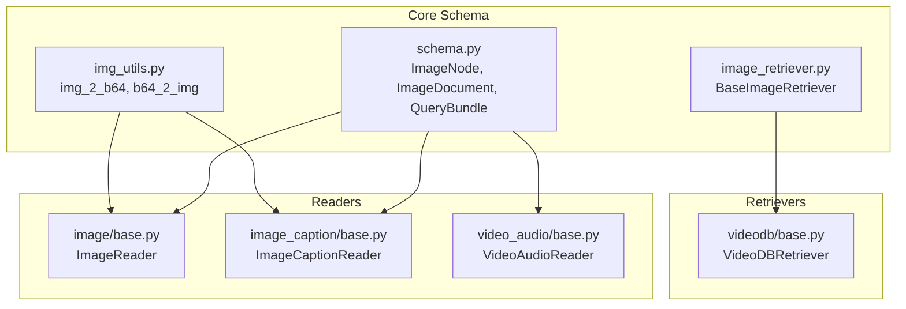
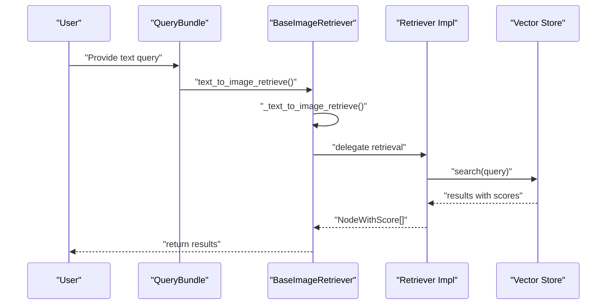
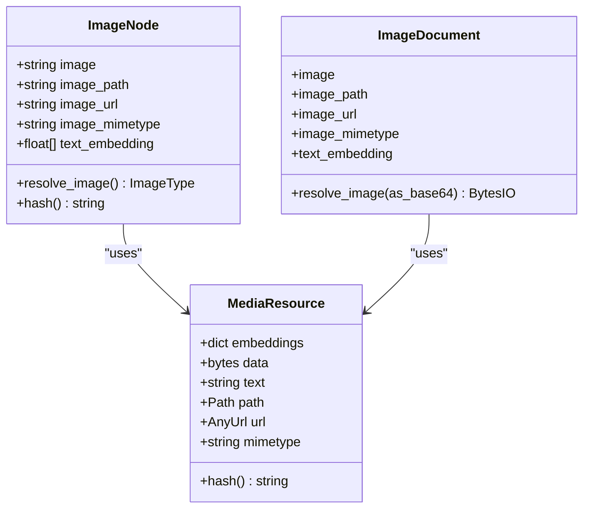
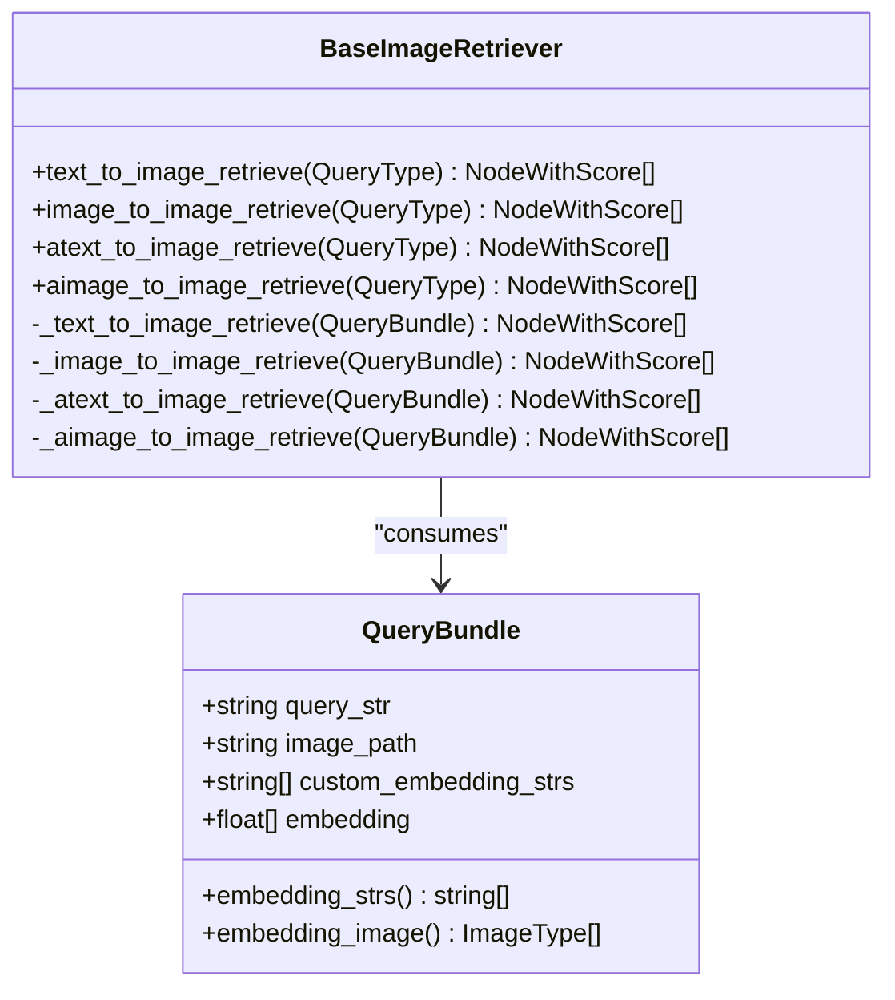
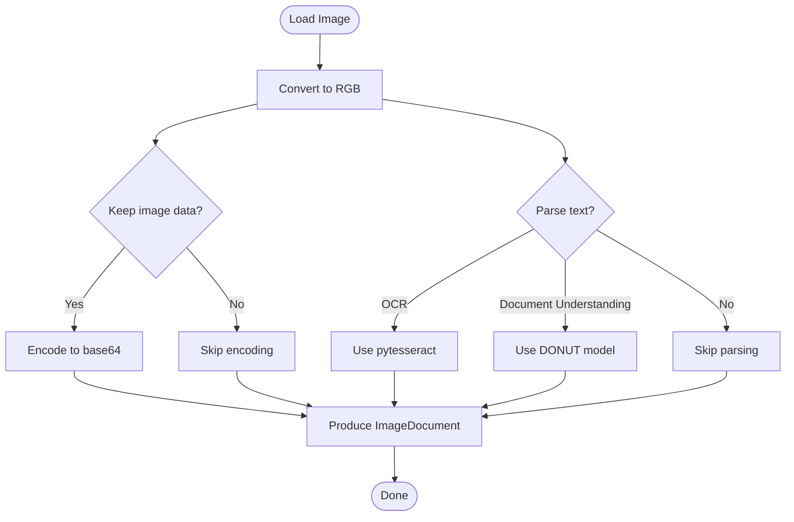
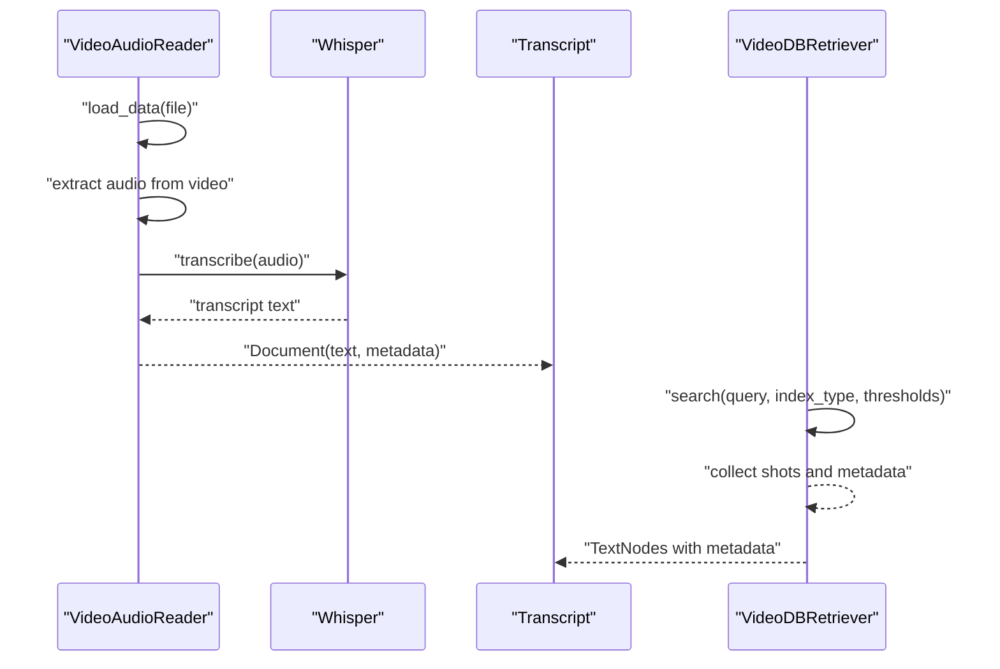
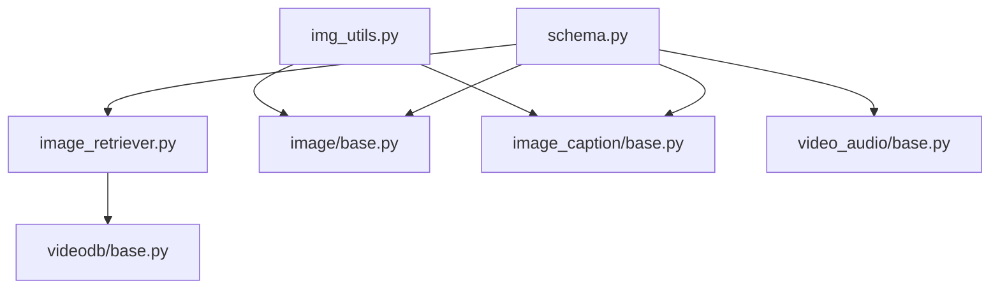

# Image and Visual Content Processing

<cite>
**Referenced Files in This Document**
- [image_retriever.py](file://llama-index-core/llama_index/core/image_retriever.py)
- [img_utils.py](file://llama-index-core/llama_index/core/img_utils.py)
- [schema.py](file://llama-index-core/llama_index/core/schema.py)
- [base.py (ImageReader)](file://llama-index-integrations/readers/llama-index-readers-file/llama_index/readers/file/image/base.py)
- [base.py (ImageCaptionReader)](file://llama-index-integrations/readers/llama-index-readers-file/llama_index/readers/file/image_caption/base.py)
- [base.py (VideoAudioReader)](file://llama-index-integrations/readers/llama-index-readers-file/llama_index/readers/file/video_audio/base.py)
- [base.py (VideoDBRetriever)](file://llama-index-integrations/retrievers/llama-index-retrievers-videodb/llama_index/retrievers/videodb/base.py)
- [multi_modal_video_RAG.ipynb](file://docs/examples/multi_modal/multi_modal_video_RAG.ipynb)
</cite>

## Table of Contents
1. [Introduction](#introduction)
2. [Project Structure](#project-structure)
3. [Core Components](#core-components)
4. [Architecture Overview](#architecture-overview)
5. [Detailed Component Analysis](#detailed-component-analysis)
6. [Dependency Analysis](#dependency-analysis)
7. [Performance Considerations](#performance-considerations)
8. [Troubleshooting Guide](#troubleshooting-guide)
9. [Conclusion](#conclusion)
10. [Appendices](#appendices)

## Introduction
This document explains how LlamaIndex handles image and visual content processing, including ingestion, indexing, retrieval, and integration with vector stores. It covers:
- Image ingestion and schema (ImageNode, ImageDocument)
- Cross-modal retrieval interfaces (text-to-image, image-to-image)
- Visual embedding strategies and multimodal embedding integration
- Preprocessing pipelines (OCR/captioning) and feature extraction
- Vector store integration for visual retrieval
- Practical examples for visual search and visual RAG
- Video processing capabilities (frame extraction, temporal analysis, summarization)
- Performance optimization and memory management strategies

## Project Structure
The visual content pipeline spans core schema and retrieval abstractions, reader integrations for OCR and captioning, and retriever integrations for video databases. The following diagram maps the primary modules involved in image and video processing.

**Diagram sources**
- [schema.py](file://llama-index-core/llama_index/core/schema.py#L799-L870)
- [img_utils.py](file://llama-index-core/llama_index/core/img_utils.py#L11-L41)
- [image_retriever.py](file://llama-index-core/llama_index/core/image_retriever.py#L10-L113)
- [base.py (ImageReader)](file://llama-index-integrations/readers/llama-index-readers-file/llama_index/readers/file/image/base.py#L19-L154)
- [base.py (ImageCaptionReader)](file://llama-index-integrations/readers/llama-index-readers-file/llama_index/readers/file/image_caption/base.py#L9-L99)
- [base.py (VideoAudioReader)](file://llama-index-integrations/readers/llama-index-readers-file/llama_index/readers/file/video_audio/base.py#L19-L79)
- [base.py (VideoDBRetriever)](file://llama-index-integrations/retrievers/llama-index-retrievers-videodb/llama_index/retrievers/videodb/base.py#L16-L95)

**Section sources**
- [schema.py](file://llama-index-core/llama_index/core/schema.py#L799-L870)
- [image_retriever.py](file://llama-index-core/llama_index/core/image_retriever.py#L10-L113)
- [base.py (ImageReader)](file://llama-index-integrations/readers/llama-index-readers-file/llama_index/readers/file/image/base.py#L19-L154)
- [base.py (ImageCaptionReader)](file://llama-index-integrations/readers/llama-index-readers-file/llama_index/readers/file/image_caption/base.py#L9-L99)
- [base.py (VideoAudioReader)](file://llama-index-integrations/readers/llama-index-readers-file/llama_index/readers/file/video_audio/base.py#L19-L79)
- [base.py (VideoDBRetriever)](file://llama-index-integrations/retrievers/llama-index-retrievers-videodb/llama_index/retrievers/videodb/base.py#L16-L95)

## Core Components
- ImageNode and ImageDocument: Represent image content with optional embedded image data, metadata, and text embeddings. They support resolving images from base64, file path, or URL.
- QueryBundle: Carries the textual query and optional image_path for cross-modal retrieval.
- BaseImageRetriever: Defines retrieval interfaces for text-to-image and image-to-image retrieval, with synchronous and asynchronous variants.
- ImageReader and ImageCaptionReader: Ingest images, optionally extract OCR text or generate captions, and produce ImageDocument.
- VideoAudioReader: Transcribes audio/video into text for downstream multimodal processing.
- VideoDBRetriever: Integrates with VideoDB for semantic and scene-based video retrieval.

**Section sources**
- [schema.py](file://llama-index-core/llama_index/core/schema.py#L799-L870)
- [schema.py](file://llama-index-core/llama_index/core/schema.py#L1364-L1408)
- [image_retriever.py](file://llama-index-core/llama_index/core/image_retriever.py#L10-L113)
- [base.py (ImageReader)](file://llama-index-integrations/readers/llama-index-readers-file/llama_index/readers/file/image/base.py#L19-L154)
- [base.py (ImageCaptionReader)](file://llama-index-integrations/readers/llama-index-readers-file/llama_index/readers/file/image_caption/base.py#L9-L99)
- [base.py (VideoAudioReader)](file://llama-index-integrations/readers/llama-index-readers-file/llama_index/readers/file/video_audio/base.py#L19-L79)
- [base.py (VideoDBRetriever)](file://llama-index-integrations/retrievers/llama-index-retrievers-videodb/llama_index/retrievers/videodb/base.py#L16-L95)

## Architecture Overview
The visual processing architecture integrates ingestion, preprocessing, embedding generation, and retrieval across text and images. The following sequence diagram illustrates the end-to-end flow for text-to-image retrieval.

**Diagram sources**
- [image_retriever.py](file://llama-index-core/llama_index/core/image_retriever.py#L13-L38)
- [schema.py](file://llama-index-core/llama_index/core/schema.py#L1364-L1408)

## Detailed Component Analysis

### ImageNode and ImageDocument Schema
- ImageNode extends TextNode and adds fields for embedded image data, file path, URL, MIME type, and optional text embedding.
- ImageDocument wraps a MediaResource for image content and exposes properties for image data, path, URL, and text embedding.
- Utilities in img_utils convert between PIL Images and base64 strings for transport and storage.

**Diagram sources**
- [schema.py](file://llama-index-core/llama_index/core/schema.py#L799-L870)
- [schema.py](file://llama-index-core/llama_index/core/schema.py#L487-L610)
- [img_utils.py](file://llama-index-core/llama_index/core/img_utils.py#L11-L41)

**Section sources**
- [schema.py](file://llama-index-core/llama_index/core/schema.py#L799-L870)
- [schema.py](file://llama-index-core/llama_index/core/schema.py#L487-L610)
- [img_utils.py](file://llama-index-core/llama_index/core/img_utils.py#L11-L41)

### Cross-Modal Retrieval Interfaces
- BaseImageRetriever defines:
  - text_to_image_retrieve and image_to_image_retrieve (sync and async)
  - Internal abstract methods for implementation-specific retrieval logic
- QueryBundle supports both textual queries and optional image_path for image-to-image retrieval.

**Diagram sources**
- [image_retriever.py](file://llama-index-core/llama_index/core/image_retriever.py#L10-L113)
- [schema.py](file://llama-index-core/llama_index/core/schema.py#L1364-L1408)

**Section sources**
- [image_retriever.py](file://llama-index-core/llama_index/core/image_retriever.py#L10-L113)
- [schema.py](file://llama-index-core/llama_index/core/schema.py#L1364-L1408)

### Image Ingestion and Preprocessing Pipelines
- ImageReader:
  - Loads images, converts to RGB, optionally keeps base64 image data
  - Supports OCR (pytesseract) and document understanding (DONUT) for extracting text
  - Produces ImageDocument with extracted text and optional embedded image
- ImageCaptionReader:
  - Uses BLIP to generate captions from images
  - Produces ImageDocument with caption text and optional embedded image

**Diagram sources**
- [base.py (ImageReader)](file://llama-index-integrations/readers/llama-index-readers-file/llama_index/readers/file/image/base.py#L19-L154)
- [base.py (ImageCaptionReader)](file://llama-index-integrations/readers/llama-index-readers-file/llama_index/readers/file/image_caption/base.py#L9-L99)

**Section sources**
- [base.py (ImageReader)](file://llama-index-integrations/readers/llama-index-readers-file/llama_index/readers/file/image/base.py#L19-L154)
- [base.py (ImageCaptionReader)](file://llama-index-integrations/readers/llama-index-readers-file/llama_index/readers/file/image_caption/base.py#L9-L99)

### Video Processing and Temporal Analysis
- VideoAudioReader:
  - Loads MP4, extracts audio, transcribes with Whisper, produces Document with transcript
- VideoDBRetriever:
  - Integrates with VideoDB for semantic and scene-based video search
  - Supports configurable thresholds and index types (spoken word, scene)
  - Returns TextNode results enriched with metadata (video_id, timestamps, etc.)

**Diagram sources**
- [base.py (VideoAudioReader)](file://llama-index-integrations/readers/llama-index-readers-file/llama_index/readers/file/video_audio/base.py#L19-L79)
- [base.py (VideoDBRetriever)](file://llama-index-integrations/retrievers/llama-index-retrievers-videodb/llama_index/retrievers/videodb/base.py#L16-L95)

**Section sources**
- [base.py (VideoAudioReader)](file://llama-index-integrations/readers/llama-index-readers-file/llama_index/readers/file/video_audio/base.py#L19-L79)
- [base.py (VideoDBRetriever)](file://llama-index-integrations/retrievers/llama-index-retrievers-videodb/llama_index/retrievers/videodb/base.py#L16-L95)

### Practical Examples and Visual RAG
- The multimodal video RAG notebook demonstrates:
  - Frame extraction from video
  - Audio transcription
  - Building a multimodal index with both text and image collections
  - Retrieving relevant images and context to augment prompts for reasoning

Key steps include:
- Downloading and processing video into frames and audio
- Converting audio to text
- Creating multimodal indices with separate vector stores for text and images
- Using retriever to fetch top-k results and augment prompts

**Section sources**
- [multi_modal_video_RAG.ipynb](file://docs/examples/multi_modal/multi_modal_video_RAG.ipynb#L1-L433)

## Dependency Analysis
The following diagram shows module-level dependencies among core schema, readers, and retrievers.

**Diagram sources**
- [schema.py](file://llama-index-core/llama_index/core/schema.py#L799-L870)
- [img_utils.py](file://llama-index-core/llama_index/core/img_utils.py#L11-L41)
- [image_retriever.py](file://llama-index-core/llama_index/core/image_retriever.py#L10-L113)
- [base.py (ImageReader)](file://llama-index-integrations/readers/llama-index-readers-file/llama_index/readers/file/image/base.py#L19-L154)
- [base.py (ImageCaptionReader)](file://llama-index-integrations/readers/llama-index-readers-file/llama_index/readers/file/image_caption/base.py#L9-L99)
- [base.py (VideoAudioReader)](file://llama-index-integrations/readers/llama-index-readers-file/llama_index/readers/file/video_audio/base.py#L19-L79)
- [base.py (VideoDBRetriever)](file://llama-index-integrations/retrievers/llama-index-retrievers-videodb/llama_index/retrievers/videodb/base.py#L16-L95)

**Section sources**
- [schema.py](file://llama-index-core/llama_index/core/schema.py#L799-L870)
- [image_retriever.py](file://llama-index-core/llama_index/core/image_retriever.py#L10-L113)
- [base.py (ImageReader)](file://llama-index-integrations/readers/llama-index-readers-file/llama_index/readers/file/image/base.py#L19-L154)
- [base.py (ImageCaptionReader)](file://llama-index-integrations/readers/llama-index-readers-file/llama_index/readers/file/image_caption/base.py#L9-L99)
- [base.py (VideoAudioReader)](file://llama-index-integrations/readers/llama-index-readers-file/llama_index/readers/file/video_audio/base.py#L19-L79)
- [base.py (VideoDBRetriever)](file://llama-index-integrations/retrievers/llama-index-retrievers-videodb/llama_index/retrievers/videodb/base.py#L16-L95)

## Performance Considerations
- Memory management for visual embeddings:
  - Prefer streaming or chunked processing for large images and videos
  - Use base64 encoding only when necessary; store raw paths/URLs when feasible
  - Release large PIL Image objects promptly after conversion
- Compute optimization:
  - Offload heavy OCR/captioning to GPU-enabled environments when available
  - Batch preprocessing for multiple images to reduce overhead
  - Tune similarity thresholds and top-k to balance recall and latency
- Vector store scaling:
  - Separate vector stores for text and images to optimize indexing and retrieval
  - Use dimension-aware embedding models and appropriate distance metrics
- I/O efficiency:
  - Cache frequently accessed images and transcripts
  - Use efficient codecs and compression for embeddings and metadata

[No sources needed since this section provides general guidance]

## Troubleshooting Guide
Common issues and resolutions:
- Missing OCR/captioning dependencies:
  - Install required extras for OCR (pytesseract) and document understanding (transformers, sentencepiece)
  - Install BLIP dependencies for captioning
- Video processing failures:
  - Ensure Whisper and pydub are installed for audio extraction and transcription
  - Validate file formats and paths for video inputs
- Retrieval accuracy:
  - Adjust similarity thresholds and index types for VideoDB
  - Verify embedding models and query transformations align with ingestion pipeline
- Image resolution and format:
  - Convert images to RGB before ingestion to avoid color channel mismatches
  - Validate image URLs and paths to prevent loading errors

**Section sources**
- [base.py (ImageReader)](file://llama-index-integrations/readers/llama-index-readers-file/llama_index/readers/file/image/base.py#L36-L68)
- [base.py (ImageCaptionReader)](file://llama-index-integrations/readers/llama-index-readers-file/llama_index/readers/file/image_caption/base.py#L24-L53)
- [base.py (VideoAudioReader)](file://llama-index-integrations/readers/llama-index-readers-file/llama_index/readers/file/video_audio/base.py#L32-L43)
- [base.py (VideoDBRetriever)](file://llama-index-integrations/retrievers/llama-index-retrievers-videodb/llama_index/retrievers/videodb/base.py#L31-L36)

## Conclusion
LlamaIndex provides a cohesive framework for image and video processing:
- Robust schema for image representation and multimodal documents
- Flexible retrieval interfaces for cross-modal search
- Reader integrations for OCR and captioning
- Video processing utilities and VideoDB retriever for temporal analysis
- Practical examples for building visual search and visual RAG systems

By combining these components, developers can implement scalable, high-performance visual retrieval and reasoning pipelines tailored to real-world applications.

[No sources needed since this section summarizes without analyzing specific files]

## Appendices
- Example notebooks and integrations demonstrate end-to-end workflows for multimodal video RAG and image ingestion pipelines.

**Section sources**
- [multi_modal_video_RAG.ipynb](file://docs/examples/multi_modal/multi_modal_video_RAG.ipynb#L1-L433)