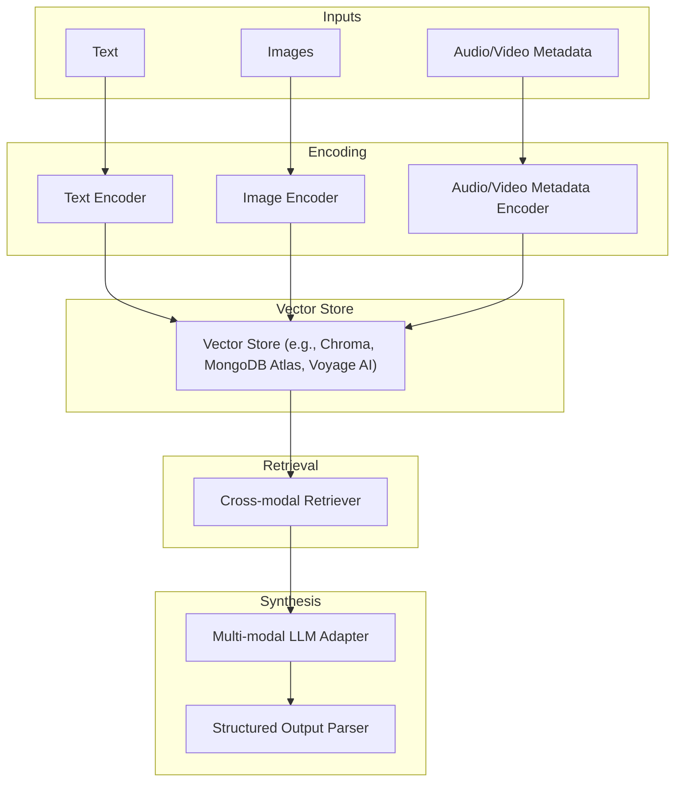
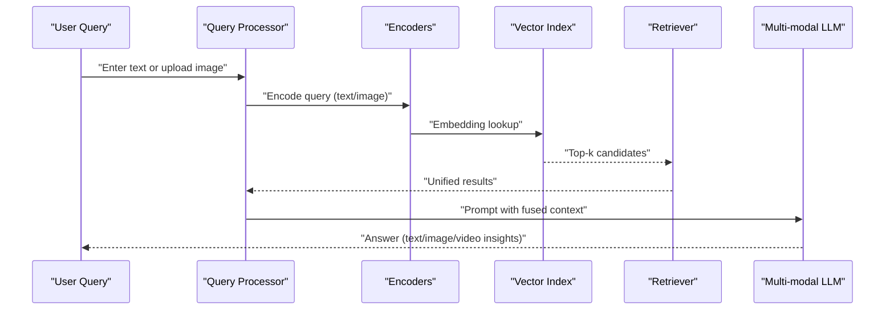
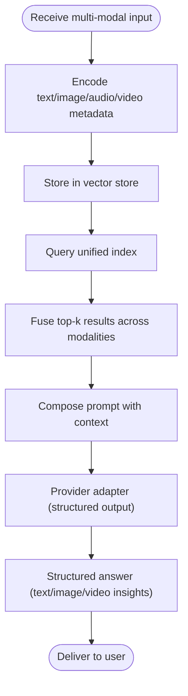

# Mixed-media Applications

<cite>
**Referenced Files in This Document**
- [gpt4v_multi_modal_retrieval.ipynb](file://docs/examples/multi_modal/gpt4v_multi_modal_retrieval.ipynb)
- [ChromaMultiModalDemo.ipynb](file://docs/examples/multi_modal/ChromaMultiModalDemo.ipynb)
- [anthropic_multi_modal.ipynb](file://docs/examples/multi_modal/anthropic_multi_modal.ipynb)
- [azure_openai_multi_modal.ipynb](file://docs/examples/multi_modal/azure_openai_multi_modal.ipynb)
- [cohere_multi_modal.ipynb](file://docs/examples/multi_modal/cohere_multi_modal.ipynb)
- [dashscope_multi_modal.ipynb](file://docs/examples/multi_modal/dashscope_multi_modal.ipynb)
- [gemini.ipynb](file://docs/examples/multi_modal/gemini.ipynb)
- [gpt4o_mm_structured_outputs.ipynb](file://docs/examples/multi_modal/gpt4o_mm_structured_outputs.ipynb)
- [gpt4v_multi_modal_retrieval.ipynb](file://docs/examples/multi_modal/gpt4v_multi_modal_retrieval.ipynb)
- [image_to_image_retrieval.ipynb](file://docs/examples/multi_modal/image_to_image_retrieval.ipynb)
- [llamaindex_mongodb_voyageai_multimodal.ipynb](file://docs/examples/multi_modal/llamaindex_mongodb_voyageai_multimodal.ipynb)
- [llava_demo.ipynb](file://docs/examples/multi_modal/llava_demo.ipynb)
- [llava_multi_modal_tesla_10q.ipynb](file://docs/examples/multi_modal/llava_multi_modal_tesla_10q.ipynb)
- [mistral_multi_modal.ipynb](file://docs/examples/multi_modal/mistral_multi_modal.ipynb)
- [multi_modal_pydantic.ipynb](file://docs/examples/multi_modal/multi_modal_pydantic.ipynb)
- [multi_modal_rag_nomic.ipynb](file://docs/examples/multi_modal/multi_modal_rag_nomic.ipynb)
- [multi_modal.md](file://docs/api_reference/api_reference/query_engine/simple_multi_modal.md)
- [multi_modal.md](file://docs/api_reference/api_reference/program/multi_modal.md)
- [multi_modal.md](file://docs/api_reference/api_reference/evaluation/multi_modal.md)
- [multi_modal_rag_evaluation.ipynb](file://docs/examples/evaluation/multi_modal/multi_modal_rag_evaluation.ipynb)
</cite>

## Table of Contents
1. [Introduction](#introduction)
2. [Project Structure](#project-structure)
3. [Core Components](#core-components)
4. [Architecture Overview](#architecture-overview)
5. [Detailed Component Analysis](#detailed-component-analysis)
6. [Dependency Analysis](#dependency-analysis)
7. [Performance Considerations](#performance-considerations)
8. [Troubleshooting Guide](#troubleshooting-guide)
9. [Conclusion](#conclusion)
10. [Appendices](#appendices)

## Introduction
This document explains how to build mixed-media applications with LlamaIndex that combine text, images, audio, and video into a single retrieval and generation pipeline. It synthesizes end-to-end patterns from the repository’s multi-modal examples and API references to deliver:
- Unified query processing across modalities
- Cross-modal retrieval strategies
- Integrated response synthesis
- Practical implementations for visual question answering, audio-visual search, and multi-modal document analysis
- Workflow orchestration, data flow management, and performance optimization

## Project Structure
The repository organizes multi-modal capabilities across:
- Examples: Jupyter notebooks demonstrating multi-modal retrieval, structured outputs, and integrations with providers (OpenAI GPT-4V, Gemini, Mistral, Anthropic, Azure OpenAI, DashScope, LLaVA)
- API Reference: Multi-modal query engine and program APIs
- Evaluation: Multi-modal RAG evaluation notebooks

```mermaid
graph TB
subgraph "Examples"
A["gpt4v_multi_modal_retrieval.ipynb"]
B["ChromaMultiModalDemo.ipynb"]
C["anthropic_multi_modal.ipynb"]
D["azure_openai_multi_modal.ipynb"]
E["cohere_multi_modal.ipynb"]
F["dashscope_multi_modal.ipynb"]
G["gemini.ipynb"]
H["gpt4o_mm_structured_outputs.ipynb"]
I["image_to_image_retrieval.ipynb"]
J["llamaindex_mongodb_voyageai_multimodal.ipynb"]
K["llava_demo.ipynb"]
L["llava_multi_modal_tesla_10q.ipynb"]
M["mistral_multi_modal.ipynb"]
N["multi_modal_pydantic.ipynb"]
O["multi_modal_rag_nomic.ipynb"]
P["multi_modal_rag_evaluation.ipynb"]
end
subgraph "API Reference"
Q["simple_multi_modal.md"]
R["multi_modal.md (program)"]
S["multi_modal.md (evaluation)"]
end
A --> Q
B --> Q
C --> Q
D --> Q
E --> Q
F --> Q
G --> Q
H --> Q
I --> Q
J --> Q
K --> Q
L --> Q
M --> Q
N --> Q
O --> Q
P --> S
```

**Diagram sources**
- [gpt4v_multi_modal_retrieval.ipynb](file://docs/examples/multi_modal/gpt4v_multi_modal_retrieval.ipynb#L1-L131)
- [ChromaMultiModalDemo.ipynb](file://docs/examples/multi_modal/ChromaMultiModalDemo.ipynb)
- [anthropic_multi_modal.ipynb](file://docs/examples/multi_modal/anthropic_multi_modal.ipynb)
- [azure_openai_multi_modal.ipynb](file://docs/examples/multi_modal/azure_openai_multi_modal.ipynb)
- [cohere_multi_modal.ipynb](file://docs/examples/multi_modal/cohere_multi_modal.ipynb)
- [dashscope_multi_modal.ipynb](file://docs/examples/multi_modal/dashscope_multi_modal.ipynb)
- [gemini.ipynb](file://docs/examples/multi_modal/gemini.ipynb)
- [gpt4o_mm_structured_outputs.ipynb](file://docs/examples/multi_modal/gpt4o_mm_structured_outputs.ipynb)
- [image_to_image_retrieval.ipynb](file://docs/examples/multi_modal/image_to_image_retrieval.ipynb)
- [llamaindex_mongodb_voyageai_multimodal.ipynb](file://docs/examples/multi_modal/llamaindex_mongodb_voyageai_multimodal.ipynb)
- [llava_demo.ipynb](file://docs/examples/multi_modal/llava_demo.ipynb)
- [llava_multi_modal_tesla_10q.ipynb](file://docs/examples/multi_modal/llava_multi_modal_tesla_10q.ipynb)
- [mistral_multi_modal.ipynb](file://docs/examples/multi_modal/mistral_multi_modal.ipynb)
- [multi_modal_pydantic.ipynb](file://docs/examples/multi_modal/multi_modal_pydantic.ipynb)
- [multi_modal_rag_nomic.ipynb](file://docs/examples/multi_modal/multi_modal_rag_nomic.ipynb)
- [multi_modal_rag_evaluation.ipynb](file://docs/examples/evaluation/multi_modal/multi_modal_rag_evaluation.ipynb)
- [simple_multi_modal.md](file://docs/api_reference/api_reference/query_engine/simple_multi_modal.md)
- [multi_modal.md](file://docs/api_reference/api_reference/program/multi_modal.md)
- [multi_modal.md](file://docs/api_reference/api_reference/evaluation/multi_modal.md)

**Section sources**
- [gpt4v_multi_modal_retrieval.ipynb](file://docs/examples/multi_modal/gpt4v_multi_modal_retrieval.ipynb#L1-L131)
- [simple_multi_modal.md](file://docs/api_reference/api_reference/query_engine/simple_multi_modal.md)
- [multi_modal.md](file://docs/api_reference/api_reference/program/multi_modal.md)
- [multi_modal.md](file://docs/api_reference/api_reference/evaluation/multi_modal.md)

## Core Components
- Multi-modal query engine: Unified interface to encode and retrieve across text and images, with provider-specific adapters (e.g., GPT-4V, Gemini, Mistral, LLaVA).
- Embedding backends: Text and image embeddings via providers and vector stores (e.g., Chroma, MongoDB Atlas, Voyage AI).
- Structured outputs: Provider-specific structured output parsing for multi-modal tasks.
- Retrieval fusion: Cross-modal retrieval combining text and image indices.
- Evaluation harness: Metrics and workflows for multi-modal RAG quality assessment.

Key implementation patterns:
- Image reasoning and retrieval: Use a multi-modal LLM to interpret images, then embed both text and images into a unified index.
- Provider integrations: Examples integrate OpenAI GPT-4V, Gemini, Mistral, Anthropic, Azure OpenAI, DashScope, and LLaVA.
- Structured outputs: Parse structured answers from multi-modal LLMs for downstream tasks.

**Section sources**
- [gpt4v_multi_modal_retrieval.ipynb](file://docs/examples/multi_modal/gpt4v_multi_modal_retrieval.ipynb#L1-L131)
- [gemini.ipynb](file://docs/examples/multi_modal/gemini.ipynb)
- [mistral_multi_modal.ipynb](file://docs/examples/multi_modal/mistral_multi_modal.ipynb)
- [anthropic_multi_modal.ipynb](file://docs/examples/multi_modal/anthropic_multi_modal.ipynb)
- [azure_openai_multi_modal.ipynb](file://docs/examples/multi_modal/azure_openai_multi_modal.ipynb)
- [dashscope_multi_modal.ipynb](file://docs/examples/multi_modal/dashscope_multi_modal.ipynb)
- [llava_demo.ipynb](file://docs/examples/multi_modal/llava_demo.ipynb)
- [llava_multi_modal_tesla_10q.ipynb](file://docs/examples/multi_modal/llava_multi_modal_tesla_10q.ipynb)
- [gpt4o_mm_structured_outputs.ipynb](file://docs/examples/multi_modal/gpt4o_mm_structured_outputs.ipynb)
- [ChromaMultiModalDemo.ipynb](file://docs/examples/multi_modal/ChromaMultiModalDemo.ipynb)
- [llamaindex_mongodb_voyageai_multimodal.ipynb](file://docs/examples/multi_modal/llamaindex_mongodb_voyageai_multimodal.ipynb)
- [multi_modal_rag_evaluation.ipynb](file://docs/examples/evaluation/multi_modal/multi_modal_rag_evaluation.ipynb)

## Architecture Overview
The multi-modal pipeline integrates heterogeneous inputs (text, images, audio/video metadata) through a unified embedding and retrieval layer, then synthesizes provider-driven responses.

**Diagram sources**
- [gpt4v_multi_modal_retrieval.ipynb](file://docs/examples/multi_modal/gpt4v_multi_modal_retrieval.ipynb#L1-L131)
- [ChromaMultiModalDemo.ipynb](file://docs/examples/multi_modal/ChromaMultiModalDemo.ipynb)
- [llamaindex_mongodb_voyageai_multimodal.ipynb](file://docs/examples/multi_modal/llamaindex_mongodb_voyageai_multimodal.ipynb)
- [gpt4o_mm_structured_outputs.ipynb](file://docs/examples/multi_modal/gpt4o_mm_structured_outputs.ipynb)

## Detailed Component Analysis

### Unified Query Processing Across Modalities
- Text and image queries are encoded into a shared embedding space using provider-specific encoders (e.g., GPT-4V text encoder and CLIP-style image encoder).
- The unified embedding space enables cross-modal similarity search: text queries retrieve images and vice versa.

Implementation highlights:
- Multi-modal LLM image reasoning to derive textual understanding from images.
- Dual index construction: text index and image index built from the same corpus.

**Section sources**
- [gpt4v_multi_modal_retrieval.ipynb](file://docs/examples/multi_modal/gpt4v_multi_modal_retrieval.ipynb#L1-L131)

### Cross-modal Retrieval Strategies
- Fusion retrieval: Combine BM25-style text retrieval with dense image embeddings to improve recall across modalities.
- Provider-backed retrieval: Use provider-specific retrievers (e.g., Chroma, MongoDB Atlas, Voyage AI) to manage heterogeneous embeddings.

**Diagram sources**
- [gpt4v_multi_modal_retrieval.ipynb](file://docs/examples/multi_modal/gpt4v_multi_modal_retrieval.ipynb#L1-L131)
- [ChromaMultiModalDemo.ipynb](file://docs/examples/multi_modal/ChromaMultiModalDemo.ipynb)
- [llamaindex_mongodb_voyageai_multimodal.ipynb](file://docs/examples/multi_modal/llamaindex_mongodb_voyageai_multimodal.ipynb)

**Section sources**
- [gpt4v_multi_modal_retrieval.ipynb](file://docs/examples/multi_modal/gpt4v_multi_modal_retrieval.ipynb#L1-L131)
- [ChromaMultiModalDemo.ipynb](file://docs/examples/multi_modal/ChromaMultiModalDemo.ipynb)
- [llamaindex_mongodb_voyageai_multimodal.ipynb](file://docs/examples/multi_modal/llamaindex_mongodb_voyageai_multimodal.ipynb)

### Integrated Response Synthesis
- Structured outputs: Parse structured answers from multi-modal LLMs for standardized downstream consumption.
- Provider adapters: Use provider-specific SDKs (OpenAI, Gemini, Mistral, Anthropic, Azure OpenAI, DashScope) to leverage advanced multi-modal capabilities.

**Diagram sources**
- [gpt4o_mm_structured_outputs.ipynb](file://docs/examples/multi_modal/gpt4o_mm_structured_outputs.ipynb)
- [gemini.ipynb](file://docs/examples/multi_modal/gemini.ipynb)
- [mistral_multi_modal.ipynb](file://docs/examples/multi_modal/mistral_multi_modal.ipynb)
- [anthropic_multi_modal.ipynb](file://docs/examples/multi_modal/anthropic_multi_modal.ipynb)
- [azure_openai_multi_modal.ipynb](file://docs/examples/multi_modal/azure_openai_multi_modal.ipynb)
- [dashscope_multi_modal.ipynb](file://docs/examples/multi_modal/dashscope_multi_modal.ipynb)

**Section sources**
- [gpt4o_mm_structured_outputs.ipynb](file://docs/examples/multi_modal/gpt4o_mm_structured_outputs.ipynb)
- [gemini.ipynb](file://docs/examples/multi_modal/gemini.ipynb)
- [mistral_multi_modal.ipynb](file://docs/examples/multi_modal/mistral_multi_modal.ipynb)
- [anthropic_multi_modal.ipynb](file://docs/examples/multi_modal/anthropic_multi_modal.ipynb)
- [azure_openai_multi_modal.ipynb](file://docs/examples/multi_modal/azure_openai_multi_modal.ipynb)
- [dashscope_multi_modal.ipynb](file://docs/examples/multi_modal/dashscope_multi_modal.ipynb)

### Practical Implementations

#### Visual Question Answering (VQA)
- Use a multi-modal LLM to reason over images and answer questions grounded in visual evidence.
- Example notebooks demonstrate VQA workflows with GPT-4V and LLaVA.

**Section sources**
- [gpt4v_multi_modal_retrieval.ipynb](file://docs/examples/multi_modal/gpt4v_multi_modal_retrieval.ipynb#L1-L131)
- [llava_demo.ipynb](file://docs/examples/multi_modal/llava_demo.ipynb)
- [llava_multi_modal_tesla_10q.ipynb](file://docs/examples/multi_modal/llava_multi_modal_tesla_10q.ipynb)

#### Audio-Visual Search Engines
- Encode audio/video metadata alongside text and images to enable hybrid search.
- Use provider-backed vector stores to scale heterogeneous embeddings.

**Section sources**
- [llamaindex_mongodb_voyageai_multimodal.ipynb](file://docs/examples/multi_modal/llamaindex_mongodb_voyageai_multimodal.ipynb)
- [multi_modal_rag_nomic.ipynb](file://docs/examples/multi_modal/multi_modal_rag_nomic.ipynb)

#### Multi-modal Document Analysis Tools
- Combine document OCR, image understanding, and structured extraction to analyze complex documents.
- Use structured outputs to normalize multi-modal insights into tabular or schema-aligned formats.

**Section sources**
- [multi_modal_pydantic.ipynb](file://docs/examples/multi_modal/multi_modal_pydantic.ipynb)
- [gpt4o_mm_structured_outputs.ipynb](file://docs/examples/multi_modal/gpt4o_mm_structured_outputs.ipynb)

## Dependency Analysis
Multi-modal pipelines depend on:
- Provider SDKs (OpenAI, Gemini, Mistral, Anthropic, Azure OpenAI, DashScope)
- Vector stores (Chroma, MongoDB Atlas, Voyage AI)
- Embedding backends (text and image encoders)
- Structured output parsers

**Diagram sources**
- [gpt4v_multi_modal_retrieval.ipynb](file://docs/examples/multi_modal/gpt4v_multi_modal_retrieval.ipynb#L1-L131)
- [ChromaMultiModalDemo.ipynb](file://docs/examples/multi_modal/ChromaMultiModalDemo.ipynb)
- [llamaindex_mongodb_voyageai_multimodal.ipynb](file://docs/examples/multi_modal/llamaindex_mongodb_voyageai_multimodal.ipynb)
- [gpt4o_mm_structured_outputs.ipynb](file://docs/examples/multi_modal/gpt4o_mm_structured_outputs.ipynb)

**Section sources**
- [gpt4v_multi_modal_retrieval.ipynb](file://docs/examples/multi_modal/gpt4v_multi_modal_retrieval.ipynb#L1-L131)
- [ChromaMultiModalDemo.ipynb](file://docs/examples/multi_modal/ChromaMultiModalDemo.ipynb)
- [llamaindex_mongodb_voyageai_multimodal.ipynb](file://docs/examples/multi_modal/llamaindex_mongodb_voyageai_multimodal.ipynb)
- [gpt4o_mm_structured_outputs.ipynb](file://docs/examples/multi_modal/gpt4o_mm_structured_outputs.ipynb)

## Performance Considerations
- Separate encoders per modality: Use GPU-accelerated encoders for images and efficient text encoders to reduce latency.
- Indexing strategies:
  - Pre-index large corpora; batch updates to minimize re-encoding overhead.
  - Use provider-backed vector stores optimized for multi-modal embeddings.
- Retrieval fusion:
  - Combine BM25 and dense retrieval to balance precision and recall.
  - Cache frequent queries and their top-k results.
- Structured outputs:
  - Validate schema early to avoid retries and re-prompts.
- Scaling:
  - Horizontal scaling of vector stores and LLM adapters.
  - Asynchronous processing for long-running multi-modal prompts.

[No sources needed since this section provides general guidance]

## Troubleshooting Guide
Common issues and remedies:
- Encoding mismatches: Ensure consistent embedding dimensions across modalities; validate provider encoder outputs.
- Retrieval drift: Periodically re-index with updated encoders; monitor recall metrics across modalities.
- Provider rate limits: Implement retry/backoff and queueing; shard workloads across providers.
- Structured output parsing failures: Add robust fallbacks and schema validation; log raw provider responses for debugging.
- Evaluation gaps: Use the evaluation notebook to measure accuracy, hallucination rates, and cross-modal relevance.

**Section sources**
- [multi_modal_rag_evaluation.ipynb](file://docs/examples/evaluation/multi_modal/multi_modal_rag_evaluation.ipynb)

## Conclusion
LlamaIndex enables robust mixed-media applications by unifying heterogeneous inputs into a cohesive retrieval and synthesis pipeline. By leveraging provider adapters, structured outputs, and cross-modal retrieval strategies, teams can build scalable systems for visual question answering, audio-visual search, and multi-modal document analysis. Adopt the patterns and best practices outlined here to maintain consistency, optimize performance, and evolve toward production-grade multi-modal AI applications.

[No sources needed since this section summarizes without analyzing specific files]

## Appendices

### Best Practices Checklist
- Normalize encoders and embeddings across modalities.
- Use retrieval fusion to improve cross-modal recall.
- Employ structured outputs for predictable downstream consumption.
- Monitor and evaluate multi-modal RAG quality continuously.
- Plan for provider quotas, latency, and cost controls.

[No sources needed since this section provides general guidance]