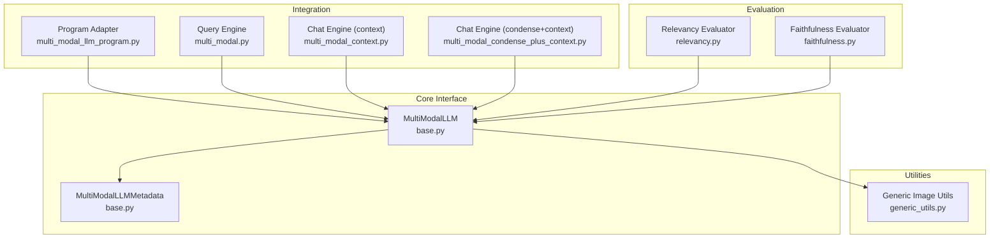
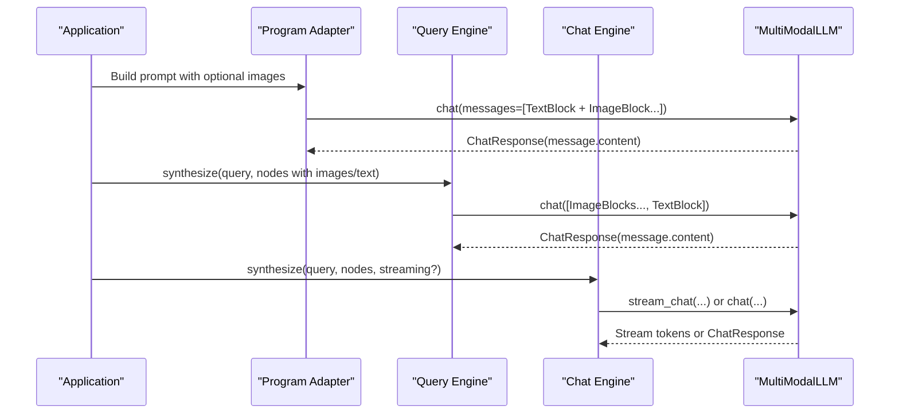
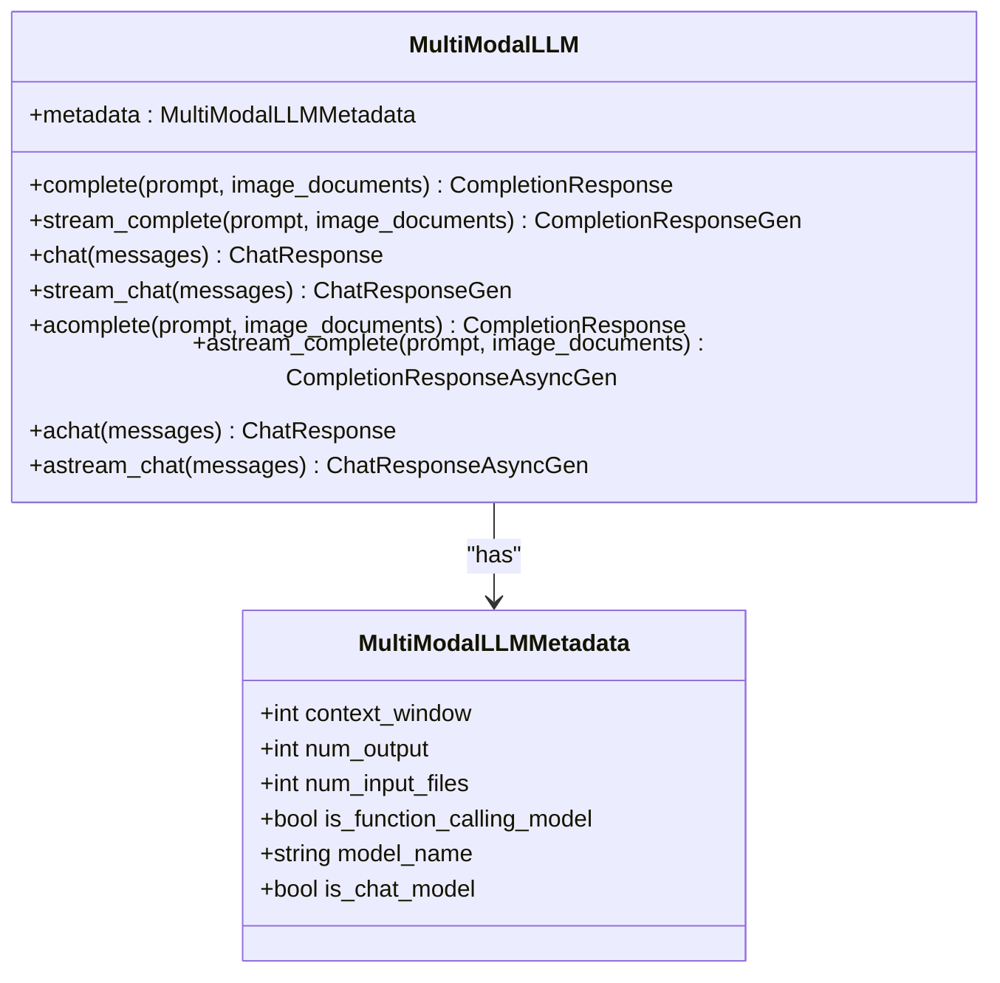
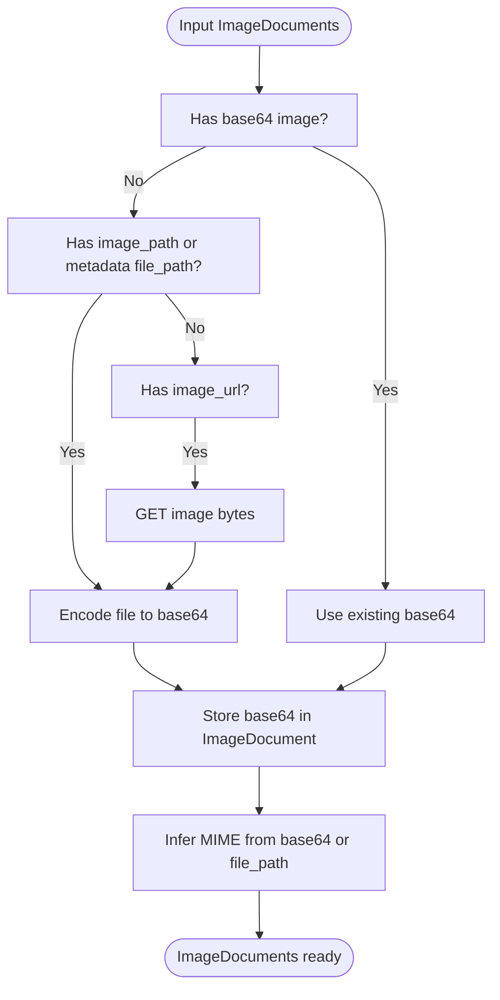
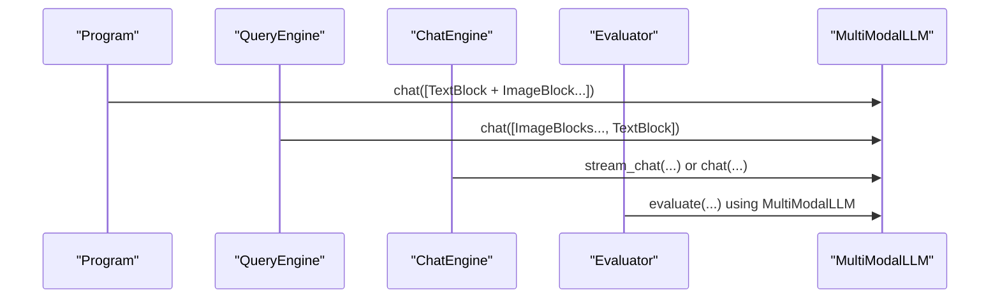
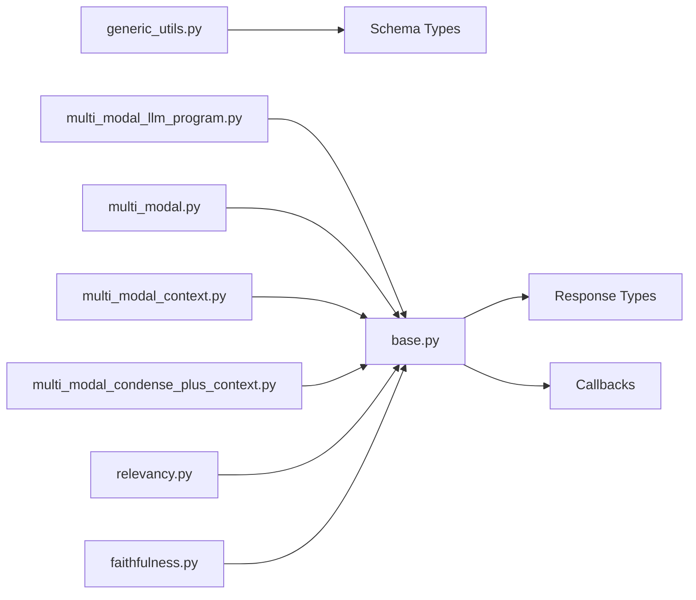

# Multi-modal LLM Integration

<cite>
**Referenced Files in This Document**
- [base.py](file://llama-index-core/llama_index/core/multi_modal_llms/base.py)
- [generic_utils.py](file://llama-index-core/llama_index/core/multi_modal_llms/generic_utils.py)
- [__init__.py](file://llama-index-core/llama_index/core/multi_modal_llms/__init__.py)
- [multi_modal_llm_program.py](file://llama-index-core/llama_index/core/program/multi_modal_llm_program.py)
- [multi_modal.py](file://llama-index-core/llama_index/core/query_engine/multi_modal.py)
- [multi_modal_context.py](file://llama-index-core/llama_index/core/chat_engine/multi_modal_context.py)
- [multi_modal_condense_plus_context.py](file://llama-index-core/llama_index/core/chat_engine/multi_modal_condense_plus_context.py)
- [relevancy.py](file://llama-index-core/llama_index/core/evaluation/multi_modal/relevancy.py)
- [faithfulness.py](file://llama-index-core/llama_index/core/evaluation/multi_modal/faithfulness.py)
- [test_generic_utils.py](file://llama-index-core/tests/multi_modal_llms/test_generic_utils.py)
- [llava_demo.ipynb](file://docs/examples/multi_modal/llava_demo.ipynb)
</cite>

## Table of Contents
1. [Introduction](#introduction)
2. [Project Structure](#project-structure)
3. [Core Components](#core-components)
4. [Architecture Overview](#architecture-overview)
5. [Detailed Component Analysis](#detailed-component-analysis)
6. [Dependency Analysis](#dependency-analysis)
7. [Performance Considerations](#performance-considerations)
8. [Troubleshooting Guide](#troubleshooting-guide)
9. [Conclusion](#conclusion)
10. [Appendices](#appendices)

## Introduction
This document explains how to integrate multi-modal large language models (LLMs) using the MultiModalLLM interface and related utilities in the repository. It covers the base interface, metadata configuration, completion and chat endpoints, streaming and async capabilities, callback integration, and practical patterns for building adapters across providers. It also provides guidance on handling different input formats (text, images), managing model capabilities (including function calling), and optimizing performance for multi-modal inference and memory management for large media assets.

## Project Structure
The multi-modal LLM integration centers around a core interface and supporting utilities:
- Core interface and metadata: MultiModalLLM and MultiModalLLMMetadata
- Generic utilities for image processing and MIME detection
- Integration points in higher-level components (programs, query engines, chat engines)
- Example notebooks and tests demonstrating usage

**Diagram sources**
- [base.py](file://llama-index-core/llama_index/core/multi_modal_llms/base.py#L30-L183)
- [generic_utils.py](file://llama-index-core/llama_index/core/multi_modal_llms/generic_utils.py#L1-L171)
- [multi_modal_llm_program.py](file://llama-index-core/llama_index/core/program/multi_modal_llm_program.py#L97-L169)
- [multi_modal.py](file://llama-index-core/llama_index/core/query_engine/multi_modal.py#L121-L196)
- [multi_modal_context.py](file://llama-index-core/llama_index/core/chat_engine/multi_modal_context.py#L157-L258)
- [multi_modal_condense_plus_context.py](file://llama-index-core/llama_index/core/chat_engine/multi_modal_condense_plus_context.py#L262-L299)
- [relevancy.py](file://llama-index-core/llama_index/core/evaluation/multi_modal/relevancy.py#L65-L101)
- [faithfulness.py](file://llama-index-core/llama_index/core/evaluation/multi_modal/faithfulness.py#L92-L128)

**Section sources**
- [base.py](file://llama-index-core/llama_index/core/multi_modal_llms/base.py#L1-L183)
- [generic_utils.py](file://llama-index-core/llama_index/core/multi_modal_llms/generic_utils.py#L1-L171)
- [__init__.py](file://llama-index-core/llama_index/core/multi_modal_llms/__init__.py#L1-L10)

## Core Components
- MultiModalLLM: Defines the contract for multi-modal LLMs, including synchronous and asynchronous completion and chat endpoints, plus streaming variants. It integrates with callback infrastructure for tracing and metrics.
- MultiModalLLMMetadata: Captures model capabilities such as context window, output length, number of input files, function calling support, model name, and whether the model exposes a chat interface.
- Generic Utilities: Provide helpers for loading images from URLs, encoding images to base64, inferring MIME types from file paths or base64 data, and enriching ImageDocument objects with base64 and MIME info.

Key responsibilities:
- MultiModalLLM: Exposes complete/stream_complete and chat/stream_chat for both sync and async usage, enabling integration with downstream components.
- Metadata: Enables capability checks and provider-specific behavior selection.
- Utilities: Normalize and prepare image inputs for providers that require base64 payloads and specific MIME types.

**Section sources**
- [base.py](file://llama-index-core/llama_index/core/multi_modal_llms/base.py#L30-L183)
- [generic_utils.py](file://llama-index-core/llama_index/core/multi_modal_llms/generic_utils.py#L1-L171)

## Architecture Overview
The integration pattern follows a layered approach:
- Application code constructs message blocks combining text and image inputs.
- MultiModalLLM implementations handle provider-specific serialization and API calls.
- Higher-level components (programs, query engines, chat engines) orchestrate multi-modal workflows and optionally stream responses.

**Diagram sources**
- [multi_modal_llm_program.py](file://llama-index-core/llama_index/core/program/multi_modal_llm_program.py#L97-L169)
- [multi_modal.py](file://llama-index-core/llama_index/core/query_engine/multi_modal.py#L121-L196)
- [multi_modal_context.py](file://llama-index-core/llama_index/core/chat_engine/multi_modal_context.py#L157-L258)
- [multi_modal_condense_plus_context.py](file://llama-index-core/llama_index/core/chat_engine/multi_modal_condense_plus_context.py#L262-L299)
- [base.py](file://llama-index-core/llama_index/core/multi_modal_llms/base.py#L110-L160)

## Detailed Component Analysis

### MultiModalLLM Interface and Metadata
- Interface methods:
  - Complete and stream_complete for single-prompt generation with images
  - Chat and stream_chat for multi-turn conversations
  - Async counterparts for non-blocking execution
- Metadata fields:
  - Context window and output token limits
  - Number of input files supported
  - Function calling capability flag
  - Model name and chat interface indicator

Implementation pattern:
- Subclasses decorate methods via a class initializer hook to attach callback instrumentation consistently across all endpoints.

**Diagram sources**
- [base.py](file://llama-index-core/llama_index/core/multi_modal_llms/base.py#L30-L183)

**Section sources**
- [base.py](file://llama-index-core/llama_index/core/multi_modal_llms/base.py#L30-L183)

### Generic Utility Functions for Multi-modal Processing
- Load image URLs into ImageDocument objects
- Encode local images to base64
- Convert sequences of ImageDocument to base64 strings
- Infer MIME types from file paths or base64 content
- Enrich ImageDocument with base64 payload and MIME type

Typical usage:
- Normalize heterogeneous image inputs (URLs, local paths, base64) into a uniform format expected by providers.
- Detect MIME types when providers require explicit content types.

**Diagram sources**
- [generic_utils.py](file://llama-index-core/llama_index/core/multi_modal_llms/generic_utils.py#L48-L171)

**Section sources**
- [generic_utils.py](file://llama-index-core/llama_index/core/multi_modal_llms/generic_utils.py#L1-L171)
- [test_generic_utils.py](file://llama-index-core/tests/multi_modal_llms/test_generic_utils.py#L42-L168)

### Integration Patterns Across Components
- Program adapter builds a message with mixed blocks (images + text) and invokes chat on MultiModalLLM.
- Query engine composes image blocks from nodes and augments with text prompts, then calls chat.
- Chat engines assemble system/user messages with image blocks and either stream or return full responses.
- Evaluators accept a MultiModalLLM instance (or default to a provider-specific implementation) to assess relevance and faithfulness.

**Diagram sources**
- [multi_modal_llm_program.py](file://llama-index-core/llama_index/core/program/multi_modal_llm_program.py#L97-L169)
- [multi_modal.py](file://llama-index-core/llama_index/core/query_engine/multi_modal.py#L121-L196)
- [multi_modal_context.py](file://llama-index-core/llama_index/core/chat_engine/multi_modal_context.py#L157-L258)
- [relevancy.py](file://llama-index-core/llama_index/core/evaluation/multi_modal/relevancy.py#L65-L101)
- [faithfulness.py](file://llama-index-core/llama_index/core/evaluation/multi_modal/faithfulness.py#L92-L128)

**Section sources**
- [multi_modal_llm_program.py](file://llama-index-core/llama_index/core/program/multi_modal_llm_program.py#L97-L169)
- [multi_modal.py](file://llama-index-core/llama_index/core/query_engine/multi_modal.py#L121-L196)
- [multi_modal_context.py](file://llama-index-core/llama_index/core/chat_engine/multi_modal_context.py#L157-L258)
- [multi_modal_condense_plus_context.py](file://llama-index-core/llama_index/core/chat_engine/multi_modal_condense_plus_context.py#L262-L299)
- [relevancy.py](file://llama-index-core/llama_index/core/evaluation/multi_modal/relevancy.py#L65-L101)
- [faithfulness.py](file://llama-index-core/llama_index/core/evaluation/multi_modal/faithfulness.py#L92-L128)

### Practical Examples and Provider Integration
- Notebook example demonstrates multi-modal RAG using a provider-backed MultiModalLLM adapter, including retrieval-augmented image captioning and structured outputs.
- Evaluation modules show how to supply a MultiModalLLM instance or fall back to a default provider implementation.

Practical guidance:
- Use the program adapter to compose prompts with images and text.
- Use the query engine to integrate with retrieval and multi-modal QA.
- Use chat engines for conversational flows with streaming support.
- Provide a MultiModalLLM implementation that handles provider-specific serialization and streaming.

**Section sources**
- [llava_demo.ipynb](file://docs/examples/multi_modal/llava_demo.ipynb#L1-L200)
- [relevancy.py](file://llama-index-core/llama_index/core/evaluation/multi_modal/relevancy.py#L65-L101)
- [faithfulness.py](file://llama-index-core/llama_index/core/evaluation/multi_modal/faithfulness.py#L92-L128)

## Dependency Analysis
- MultiModalLLM depends on:
  - Core response types (CompletionResponse, ChatResponse, generators)
  - Callback infrastructure for instrumentation
  - Schema types for image blocks and nodes
- Utilities depend on:
  - Standard libraries for base64 and HTTP
  - Third-party detection for MIME inference
- Integration components depend on MultiModalLLM for execution and on shared schema types for message construction.

**Diagram sources**
- [base.py](file://llama-index-core/llama_index/core/multi_modal_llms/base.py#L1-L27)
- [generic_utils.py](file://llama-index-core/llama_index/core/multi_modal_llms/generic_utils.py#L1-L12)
- [multi_modal_llm_program.py](file://llama-index-core/llama_index/core/program/multi_modal_llm_program.py#L1-L10)
- [multi_modal.py](file://llama-index-core/llama_index/core/query_engine/multi_modal.py#L1-L10)
- [multi_modal_context.py](file://llama-index-core/llama_index/core/chat_engine/multi_modal_context.py#L1-L10)
- [multi_modal_condense_plus_context.py](file://llama-index-core/llama_index/core/chat_engine/multi_modal_condense_plus_context.py#L1-L10)
- [relevancy.py](file://llama-index-core/llama_index/core/evaluation/multi_modal/relevancy.py#L1-L10)
- [faithfulness.py](file://llama-index-core/llama_index/core/evaluation/multi_modal/faithfulness.py#L1-L10)

**Section sources**
- [base.py](file://llama-index-core/llama_index/core/multi_modal_llms/base.py#L1-L27)
- [generic_utils.py](file://llama-index-core/llama_index/core/multi_modal_llms/generic_utils.py#L1-L12)
- [multi_modal_llm_program.py](file://llama-index-core/llama_index/core/program/multi_modal_llm_program.py#L1-L10)
- [multi_modal.py](file://llama-index-core/llama_index/core/query_engine/multi_modal.py#L1-L10)
- [multi_modal_context.py](file://llama-index-core/llama_index/core/chat_engine/multi_modal_context.py#L1-L10)
- [multi_modal_condense_plus_context.py](file://llama-index-core/llama_index/core/chat_engine/multi_modal_condense_plus_context.py#L1-L10)
- [relevancy.py](file://llama-index-core/llama_index/core/evaluation/multi_modal/relevancy.py#L1-L10)
- [faithfulness.py](file://llama-index-core/llama_index/core/evaluation/multi_modal/faithfulness.py#L1-L10)

## Performance Considerations
- Image preprocessing:
  - Prefer pre-processing images to base64 and detecting MIME types once per asset to avoid repeated I/O and network fetches.
  - Cache base64 and MIME type on ImageDocument to minimize recomputation.
- Streaming:
  - Use stream_chat and stream_complete to reduce latency and enable early termination when appropriate.
  - Ensure upstream components properly consume streams to avoid blocking provider backpressure.
- Memory management:
  - Avoid holding large base64 payloads longer than necessary; process and pass to the LLM adapter promptly.
  - For very large images, consider resizing or compression before encoding if the provider allows it and quality permits.
- Concurrency:
  - Leverage async endpoints (achat, astream_chat, acomplete, astream_complete) to overlap I/O with computation.
- Provider-specific constraints:
  - Respect context_window and num_input_files from metadata to avoid overloading the model.
  - Use function calling when available to offload structured output parsing to the model.

[No sources needed since this section provides general guidance]

## Troubleshooting Guide
Common issues and resolutions:
- Image encoding failures:
  - Verify file paths exist and are readable; handle missing files gracefully.
  - When loading from URLs, ensure network connectivity and handle timeouts.
- MIME type inference:
  - If base64 decoding fails, fallback to default MIME type or log warnings.
- Streaming consumption:
  - Ensure consumers drain streams to prevent deadlocks; upstream components should iterate until completion.
- Provider installation:
  - Some evaluators expect provider-specific packages; install the required integrations when defaults are unavailable.

Validation references:
- Tests demonstrate handling of empty lists, failed URL fetches, and invalid metadata paths.

**Section sources**
- [generic_utils.py](file://llama-index-core/llama_index/core/multi_modal_llms/generic_utils.py#L48-L171)
- [test_generic_utils.py](file://llama-index-core/tests/multi_modal_llms/test_generic_utils.py#L42-L168)

## Conclusion
The MultiModalLLM interface provides a consistent abstraction for multi-modal LLMs across providers, while the generic utilities streamline image normalization and MIME handling. Higher-level components integrate seamlessly with this interface to support programs, query engines, chat engines, and evaluations. By leveraging streaming, async endpoints, and proper memory management, applications can achieve responsive and scalable multi-modal inference.

[No sources needed since this section summarizes without analyzing specific files]

## Appendices

### API Surface Summary
- MultiModalLLM:
  - Synchronous: complete, stream_complete, chat, stream_chat
  - Asynchronous: acomplete, astream_complete, achat, astream_chat
- MultiModalLLMMetadata:
  - context_window, num_output, num_input_files, is_function_calling_model, model_name, is_chat_model
- Utilities:
  - load_image_urls, encode_image, image_documents_to_base64, infer_image_mimetype_from_file_path, infer_image_mimetype_from_base64, set_base64_and_mimetype_for_image_docs

**Section sources**
- [base.py](file://llama-index-core/llama_index/core/multi_modal_llms/base.py#L30-L183)
- [generic_utils.py](file://llama-index-core/llama_index/core/multi_modal_llms/generic_utils.py#L1-L171)