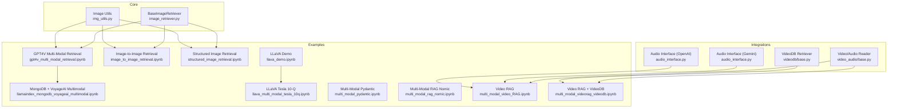
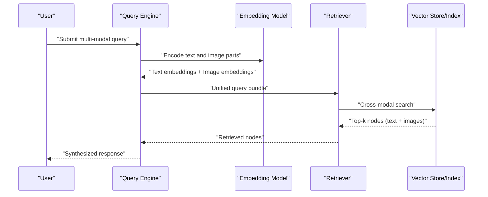
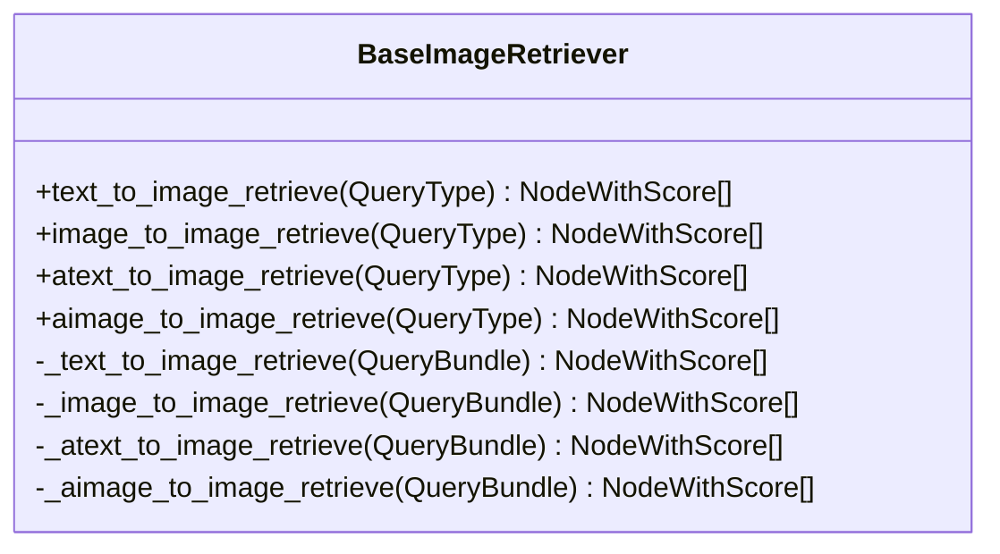
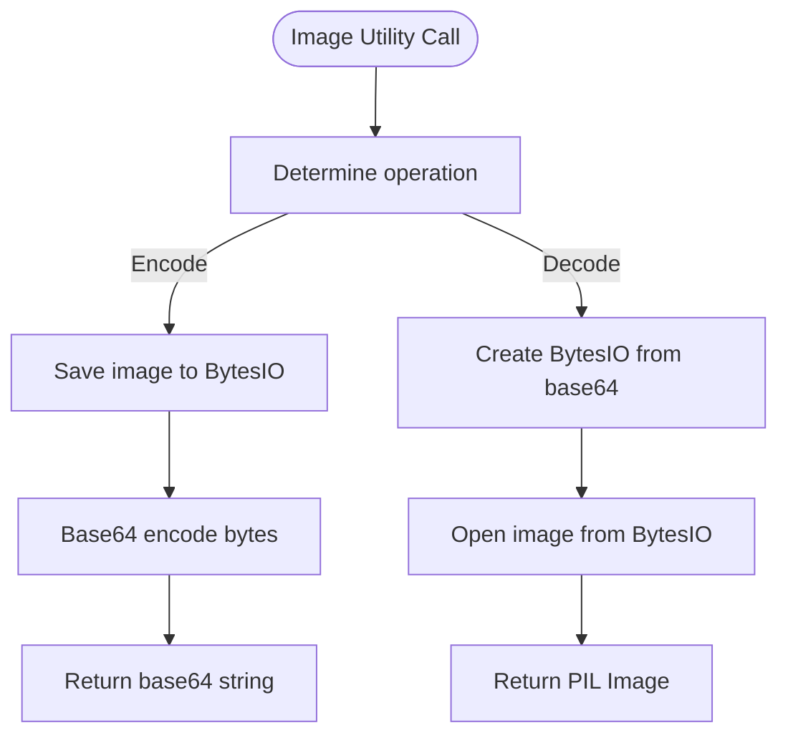
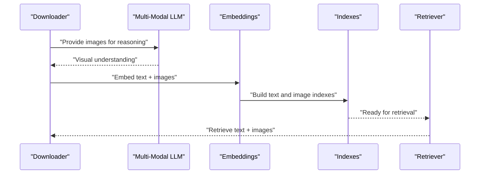
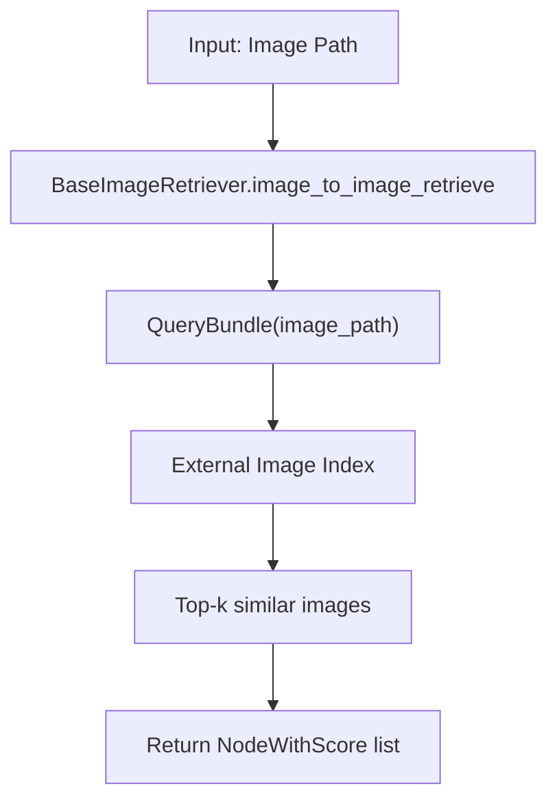
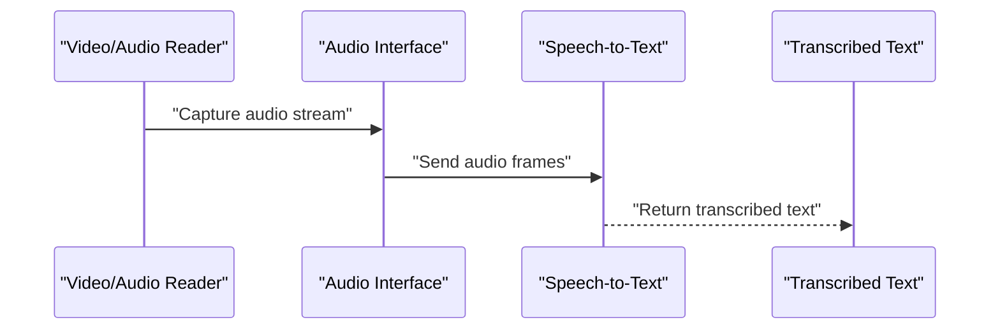
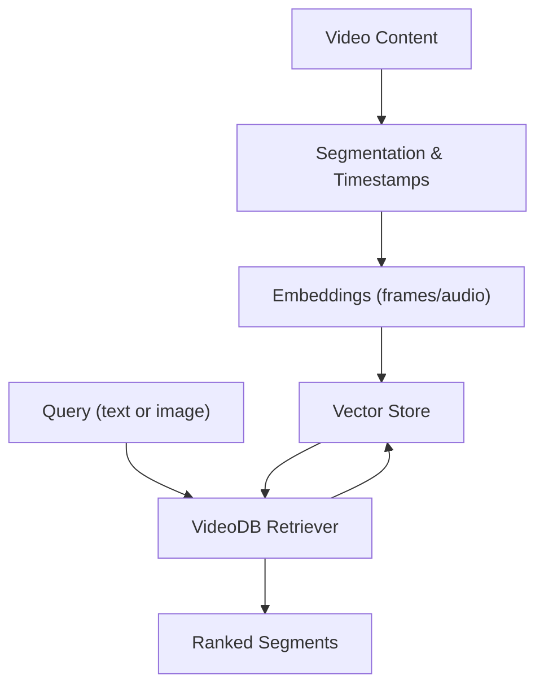
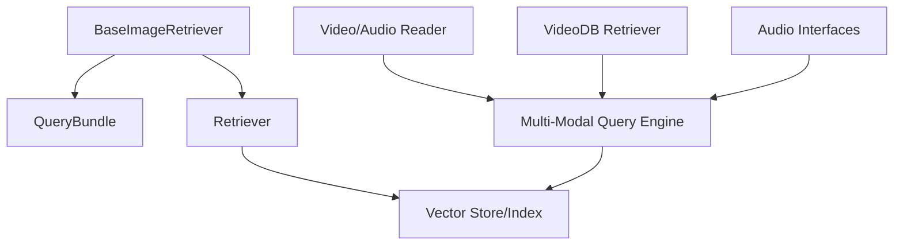

# Multi-modal Processing

<cite>
**Referenced Files in This Document**
- [image_retriever.py](file://llama-index-core/llama_index/core/image_retriever.py)
- [img_utils.py](file://llama-index-core/llama_index/core/img_utils.py)
- [gpt4v_multi_modal_retrieval.ipynb](file://docs/examples/multi_modal/gpt4v_multi_modal_retrieval.ipynb)
- [image_to_image_retrieval.ipynb](file://docs/examples/multi_modal/image_to_image_retrieval.ipynb)
- [structured_image_retrieval.ipynb](file://docs/examples/multi_modal/structured_image_retrieval.ipynb)
- [llamaindex_mongodb_voyageai_multimodal.ipynb](file://docs/examples/multi_modal/llamaindex_mongodb_voyageai_multimodal.ipynb)
- [llava_demo.ipynb](file://docs/examples/multi_modal/llava_demo.ipynb)
- [llava_multi_modal_tesla_10q.ipynb](file://docs/examples/multi_modal/llava_multi_modal_tesla_10q.ipynb)
- [multi_modal_pydantic.ipynb](file://docs/examples/multi_modal/multi_modal_pydantic.ipynb)
- [multi_modal_rag_nomic.ipynb](file://docs/examples/multi_modal/multi_modal_rag_nomic.ipynb)
- [multi_modal_video_RAG.ipynb](file://docs/examples/multi_modal/multi_modal_video_RAG.ipynb)
- [multi_modal_videorag_videodb.ipynb](file://docs/examples/multi_modal/multi_modal_videorag_videodb.ipynb)
- [videodb_retriever.ipynb](file://docs/examples/retrievers/videodb_retriever.ipynb)
- [video_audio/base.py](file://llama-index-integrations/readers/llama-index-readers-file/llama_index/readers/file/video_audio/base.py)
- [audio_interface.py](file://llama-index-integrations/voice_agents/llama-index-voice-agents-gemini-live/llama_index/voice_agents/gemini_live/audio_interface.py)
- [audio_interface.py](file://llama-index-integrations/voice_agents/llama-index-voice-agents-openai/llama_index/voice_agents/openai/audio_interface.py)
- [videodb/base.py](file://llama-index-integrations/retrievers/llama-index-retrievers-videodb/llama_index/retrievers/videodb/base.py)
- [videodb.md](file://docs/api_reference/api_reference/retrievers/videodb.md)
- [simple_multi_modal.md](file://docs/api_reference/api_reference/query_engine/simple_multi_modal.md)
- [multi_modal.md](file://docs/api_reference/api_reference/evaluation/multi_modal.md)
- [multi_modal.md](file://docs/api_reference/api_reference/program/multi_modal.md)
- [text_to_image.md](file://docs/api_reference/api_reference/tools/text_to_image.md)
- [image_figure_slides.pdf](file://docs/examples/data/figures/image_figure_slides.pdf)
- [ark_email_sample.PNG](file://docs/examples/data/images/ark_email_sample.PNG)
- [prometheus_paper_card.png](file://docs/examples/data/images/prometheus_paper_card.png)
</cite>

## Table of Contents
1. [Introduction](#introduction)
2. [Project Structure](#project-structure)
3. [Core Components](#core-components)
4. [Architecture Overview](#architecture-overview)
5. [Detailed Component Analysis](#detailed-component-analysis)
6. [Dependency Analysis](#dependency-analysis)
7. [Performance Considerations](#performance-considerations)
8. [Troubleshooting Guide](#troubleshooting-guide)
9. [Conclusion](#conclusion)
10. [Appendices](#appendices)

## Introduction
This document explains LlamaIndex multi-modal processing capabilities for handling diverse data types beyond text. It covers integration with vision-language models, audio processing, and mixed-media applications. It documents image retrieval systems, visual content analysis, and multi-modal query processing. It also addresses audio transcription, speech-to-text conversion, and voice interaction capabilities, along with video processing, temporal data handling, and multimedia content management. Practical examples demonstrate building visual search systems, audio transcription agents, video analysis tools, and mixed-media RAG applications. Finally, it outlines multi-modal embedding strategies, cross-modal retrieval, unified query processing, and performance optimization for multi-modal workloads.

## Project Structure
LlamaIndex provides:
- Core abstractions for multi-modal retrieval and image utilities
- Example notebooks demonstrating multi-modal retrieval, video RAG, and audio/voice agents
- Integrations for video/audio readers and video retrievers
- API references for multi-modal query engines, evaluation, and tools

**Diagram sources**
- [image_retriever.py](file://llama-index-core/llama_index/core/image_retriever.py#L10-L113)
- [img_utils.py](file://llama-index-core/llama_index/core/img_utils.py#L1-L41)
- [gpt4v_multi_modal_retrieval.ipynb](file://docs/examples/multi_modal/gpt4v_multi_modal_retrieval.ipynb#L1-L131)
- [image_to_image_retrieval.ipynb](file://docs/examples/multi_modal/image_to_image_retrieval.ipynb#L1-L200)
- [structured_image_retrieval.ipynb](file://docs/examples/multi_modal/structured_image_retrieval.ipynb#L1-L200)
- [llamaindex_mongodb_voyageai_multimodal.ipynb](file://docs/examples/multi_modal/llamaindex_mongodb_voyageai_multimodal.ipynb#L1-L200)
- [llava_demo.ipynb](file://docs/examples/multi_modal/llava_demo.ipynb#L1-L200)
- [llava_multi_modal_tesla_10q.ipynb](file://docs/examples/multi_modal/llava_multi_modal_tesla_10q.ipynb#L1-L200)
- [multi_modal_pydantic.ipynb](file://docs/examples/multi_modal/multi_modal_pydantic.ipynb#L1-L200)
- [multi_modal_rag_nomic.ipynb](file://docs/examples/multi_modal/multi_modal_rag_nomic.ipynb#L1-L200)
- [multi_modal_video_RAG.ipynb](file://docs/examples/multi_modal/multi_modal_video_RAG.ipynb#L1-L200)
- [multi_modal_videorag_videodb.ipynb](file://docs/examples/multi_modal/multi_modal_videorag_videodb.ipynb#L1-L200)
- [video_audio/base.py](file://llama-index-integrations/readers/llama-index-readers-file/llama_index/readers/file/video_audio/base.py#L1-L200)
- [videodb/base.py](file://llama-index-integrations/retrievers/llama-index-retrievers-videodb/llama_index/retrievers/videodb/base.py#L1-L200)
- [audio_interface.py](file://llama-index-integrations/voice_agents/llama-index-voice-agents-gemini-live/llama_index/voice_agents/gemini_live/audio_interface.py#L1-L200)
- [audio_interface.py](file://llama-index-integrations/voice_agents/llama-index-voice-agents-openai/llama_index/voice_agents/openai/audio_interface.py#L1-L200)

**Section sources**
- [image_retriever.py](file://llama-index-core/llama_index/core/image_retriever.py#L10-L113)
- [img_utils.py](file://llama-index-core/llama_index/core/img_utils.py#L1-L41)

## Core Components
- BaseImageRetriever: Defines abstract interfaces for text-to-image and image-to-image retrieval, with synchronous and asynchronous variants. It accepts either a text query or an image path via a QueryBundle abstraction.
- Image utilities: Provide helpers to convert between PIL images and base64-encoded strings, enabling embedding and transport of images in multi-modal workflows.

These components form the foundation for building multi-modal retrieval systems that handle both text and images.

**Section sources**
- [image_retriever.py](file://llama-index-core/llama_index/core/image_retriever.py#L10-L113)
- [img_utils.py](file://llama-index-core/llama_index/core/img_utils.py#L11-L41)

## Architecture Overview
The multi-modal pipeline integrates retrieval, embedding, and query processing across modalities. At a high level:
- Text and images are embedded separately (e.g., text via a text embedding model, images via a vision encoder).
- A multi-modal retriever retrieves relevant items across modalities using a unified query.
- Results are synthesized into a coherent response, optionally augmented by a multi-modal LLM.

[No sources needed since this diagram shows conceptual workflow, not actual code structure]

## Detailed Component Analysis

### Image Retrieval Abstractions
- Purpose: Provide a consistent interface for retrieving images based on text prompts and for image-to-image similarity.
- Key methods:
  - text_to_image_retrieve and image_to_image_retrieve (sync and async)
  - Accepts QueryBundle with either query_str or image_path
- Extending: Implement _text_to_image_retrieve and _image_to_image_retrieve in subclasses to integrate with external image retrieval backends.

**Diagram sources**
- [image_retriever.py](file://llama-index-core/llama_index/core/image_retriever.py#L10-L113)

**Section sources**
- [image_retriever.py](file://llama-index-core/llama_index/core/image_retriever.py#L10-L113)

### Image Utilities
- Purpose: Convert between PIL images and base64 strings for embedding and transport.
- Functions:
  - img_2_b64: Encodes a PIL image to base64
  - b64_2_img: Decodes base64 to a PIL image

**Diagram sources**
- [img_utils.py](file://llama-index-core/llama_index/core/img_utils.py#L11-L41)

**Section sources**
- [img_utils.py](file://llama-index-core/llama_index/core/img_utils.py#L11-L41)

### Vision-Language Models and Mixed-Modal Retrieval
- Examples demonstrate combining a multi-modal LLM (e.g., GPT-4V) with CLIP embeddings to retrieve both text and images in response to a visual query.
- Workflows include downloading images, generating image reasoning via a multi-modal LLM, building separate text and image indexes, and performing cross-modal retrieval.

**Diagram sources**
- [gpt4v_multi_modal_retrieval.ipynb](file://docs/examples/multi_modal/gpt4v_multi_modal_retrieval.ipynb#L1-L131)

**Section sources**
- [gpt4v_multi_modal_retrieval.ipynb](file://docs/examples/multi_modal/gpt4v_multi_modal_retrieval.ipynb#L1-L131)

### Visual Search Systems
- Image-to-image retrieval: Demonstrates retrieving semantically similar images given an input image path.
- Structured image retrieval: Uses structured outputs to extract and retrieve images aligned with structured queries.

**Diagram sources**
- [image_retriever.py](file://llama-index-core/llama_index/core/image_retriever.py#L40-L68)
- [image_to_image_retrieval.ipynb](file://docs/examples/multi_modal/image_to_image_retrieval.ipynb#L1-L200)
- [structured_image_retrieval.ipynb](file://docs/examples/multi_modal/structured_image_retrieval.ipynb#L1-L200)

**Section sources**
- [image_retriever.py](file://llama-index-core/llama_index/core/image_retriever.py#L40-L68)
- [image_to_image_retrieval.ipynb](file://docs/examples/multi_modal/image_to_image_retrieval.ipynb#L1-L200)
- [structured_image_retrieval.ipynb](file://docs/examples/multi_modal/structured_image_retrieval.ipynb#L1-L200)

### Audio Transcription and Speech-to-Text
- Video/audio reader integration: Provides a base module for reading and extracting audio/video content.
- Voice agents: Offer audio interface integrations for live audio capture and processing (e.g., Gemini and OpenAI voice agents).

**Diagram sources**
- [video_audio/base.py](file://llama-index-integrations/readers/llama-index-readers-file/llama_index/readers/file/video_audio/base.py#L1-L200)
- [audio_interface.py](file://llama-index-integrations/voice_agents/llama-index-voice-agents-gemini-live/llama_index/voice_agents/gemini_live/audio_interface.py#L1-L200)
- [audio_interface.py](file://llama-index-integrations/voice_agents/llama-index-voice-agents-openai/llama_index/voice_agents/openai/audio_interface.py#L1-L200)

**Section sources**
- [video_audio/base.py](file://llama-index-integrations/readers/llama-index-readers-file/llama_index/readers/file/video_audio/base.py#L1-L200)
- [audio_interface.py](file://llama-index-integrations/voice_agents/llama-index-voice-agents-gemini-live/llama_index/voice_agents/gemini_live/audio_interface.py#L1-L200)
- [audio_interface.py](file://llama-index-integrations/voice_agents/llama-index-voice-agents-openai/llama_index/voice_agents/openai/audio_interface.py#L1-L200)

### Video Processing and Temporal Data Handling
- Video RAG: Demonstrates building a retrieval pipeline over video content, leveraging video segments and timestamps.
- VideoDB retriever: Provides a retriever specialized for video content retrieval.

**Diagram sources**
- [multi_modal_video_RAG.ipynb](file://docs/examples/multi_modal/multi_modal_video_RAG.ipynb#L1-L200)
- [multi_modal_videorag_videodb.ipynb](file://docs/examples/multi_modal/multi_modal_videorag_videodb.ipynb#L1-L200)
- [videodb/base.py](file://llama-index-integrations/retrievers/llama-index-retrievers-videodb/llama_index/retrievers/videodb/base.py#L1-L200)

**Section sources**
- [multi_modal_video_RAG.ipynb](file://docs/examples/multi_modal/multi_modal_video_RAG.ipynb#L1-L200)
- [multi_modal_videorag_videodb.ipynb](file://docs/examples/multi_modal/multi_modal_videorag_videodb.ipynb#L1-L200)
- [videodb/base.py](file://llama-index-integrations/retrievers/llama-index-retrievers-videodb/llama_index/retrievers/videodb/base.py#L1-L200)

### Mixed-Media RAG Applications
- MongoDB + VoyageAI multimodal: Demonstrates integrating vector databases with multi-modal embeddings for hybrid retrieval.
- LLaVA demos: Show multi-modal reasoning over documents containing images (e.g., slides, financial reports).
- Multi-modal Pydantic and Nomic RAG: Explore structured outputs and advanced embedding strategies.

**Diagram sources**
- [llamaindex_mongodb_voyageai_multimodal.ipynb](file://docs/examples/multi_modal/llamaindex_mongodb_voyageai_multimodal.ipynb#L1-L200)
- [llava_demo.ipynb](file://docs/examples/multi_modal/llava_demo.ipynb#L1-L200)
- [llava_multi_modal_tesla_10q.ipynb](file://docs/examples/multi_modal/llava_multi_modal_tesla_10q.ipynb#L1-L200)
- [multi_modal_pydantic.ipynb](file://docs/examples/multi_modal/multi_modal_pydantic.ipynb#L1-L200)
- [multi_modal_rag_nomic.ipynb](file://docs/examples/multi_modal/multi_modal_rag_nomic.ipynb#L1-L200)

**Section sources**
- [llamaindex_mongodb_voyageai_multimodal.ipynb](file://docs/examples/multi_modal/llamaindex_mongodb_voyageai_multimodal.ipynb#L1-L200)
- [llava_demo.ipynb](file://docs/examples/multi_modal/llava_demo.ipynb#L1-L200)
- [llava_multi_modal_tesla_10q.ipynb](file://docs/examples/multi_modal/llava_multi_modal_tesla_10q.ipynb#L1-L200)
- [multi_modal_pydantic.ipynb](file://docs/examples/multi_modal/multi_modal_pydantic.ipynb#L1-L200)
- [multi_modal_rag_nomic.ipynb](file://docs/examples/multi_modal/multi_modal_rag_nomic.ipynb#L1-L200)

## Dependency Analysis
- Core retrieval depends on BaseImageRetriever and QueryBundle abstractions.
- Embedding and indexing backends are pluggable; examples show combinations with CLIP, MongoDB, and VoyageAI.
- Video and audio processing depend on dedicated readers and voice agent interfaces.
- Unified query processing leverages multi-modal query engine APIs.

**Diagram sources**
- [image_retriever.py](file://llama-index-core/llama_index/core/image_retriever.py#L10-L113)
- [simple_multi_modal.md](file://docs/api_reference/api_reference/query_engine/simple_multi_modal.md#L1-L200)
- [video_audio/base.py](file://llama-index-integrations/readers/llama-index-readers-file/llama_index/readers/file/video_audio/base.py#L1-L200)
- [videodb/base.py](file://llama-index-integrations/retrievers/llama-index-retrievers-videodb/llama_index/retrievers/videodb/base.py#L1-L200)
- [audio_interface.py](file://llama-index-integrations/voice_agents/llama-index-voice-agents-gemini-live/llama_index/voice_agents/gemini_live/audio_interface.py#L1-L200)

**Section sources**
- [image_retriever.py](file://llama-index-core/llama_index/core/image_retriever.py#L10-L113)
- [simple_multi_modal.md](file://docs/api_reference/api_reference/query_engine/simple_multi_modal.md#L1-L200)

## Performance Considerations
- Separate embeddings for text and images: Use efficient encoders and batch processing to reduce latency.
- Asynchronous retrieval: Prefer async methods in BaseImageRetriever to overlap I/O with computation.
- Memory management:
  - Stream video/audio content rather than loading entire files into memory.
  - Use chunked processing for long videos and large image sets.
  - Release intermediate embeddings and cached results after retrieval.
- Index tuning:
  - Choose appropriate distance metrics and index types for multi-modal vectors.
  - Periodically reindex to incorporate new content and refresh stale embeddings.
- Cost optimization:
  - Offload heavy inference to GPU-accelerated backends when available.
  - Cache frequently accessed embeddings and results.

[No sources needed since this section provides general guidance]

## Troubleshooting Guide
- Image encoding/decoding issues:
  - Ensure images are valid and supported formats; use img_2_b64 and b64_2_img consistently.
- Retrieval failures:
  - Verify QueryBundle construction for both text and image inputs.
  - Confirm embeddings backend connectivity and credentials.
- Video/audio extraction:
  - Validate media codecs and container formats; ensure readers support the input type.
- Voice agent audio:
  - Check microphone permissions and audio device availability.
  - Confirm network connectivity for cloud voice agent providers.

**Section sources**
- [img_utils.py](file://llama-index-core/llama_index/core/img_utils.py#L11-L41)
- [image_retriever.py](file://llama-index-core/llama_index/core/image_retriever.py#L10-L113)
- [video_audio/base.py](file://llama-index-integrations/readers/llama-index-readers-file/llama_index/readers/file/video_audio/base.py#L1-L200)
- [audio_interface.py](file://llama-index-integrations/voice_agents/llama-index-voice-agents-gemini-live/llama_index/voice_agents/gemini_live/audio_interface.py#L1-L200)

## Conclusion
LlamaIndex offers a robust framework for multi-modal processing, enabling seamless integration of text, images, audio, and video. Its core abstractions—BaseImageRetriever and image utilities—provide a consistent foundation for retrieval across modalities. The ecosystem of examples and integrations demonstrates practical implementations for visual search, audio transcription, video analysis, and mixed-media RAG. By combining efficient embedding strategies, cross-modal retrieval, and unified query processing, developers can build scalable, high-performance multi-modal applications.

## Appendices
- Additional resources:
  - Evaluation and program references for multi-modal tasks
  - Tools for text-to-image generation
  - Example datasets and figures for experimentation

**Section sources**
- [multi_modal.md](file://docs/api_reference/api_reference/evaluation/multi_modal.md#L1-L200)
- [multi_modal.md](file://docs/api_reference/api_reference/program/multi_modal.md#L1-L200)
- [text_to_image.md](file://docs/api_reference/api_reference/tools/text_to_image.md#L1-L200)
- [image_figure_slides.pdf](file://docs/examples/data/figures/image_figure_slides.pdf#L1-L200)
- [ark_email_sample.PNG](file://docs/examples/data/images/ark_email_sample.PNG#L1-L200)
- [prometheus_paper_card.png](file://docs/examples/data/images/prometheus_paper_card.png#L1-L200)