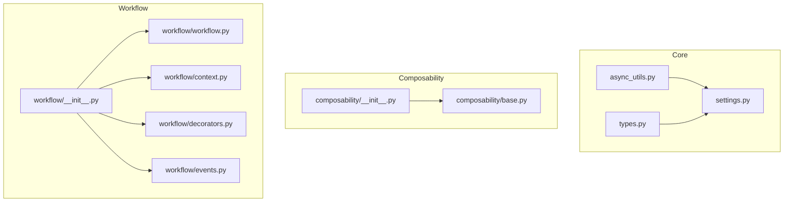
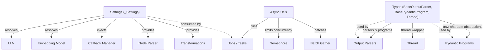
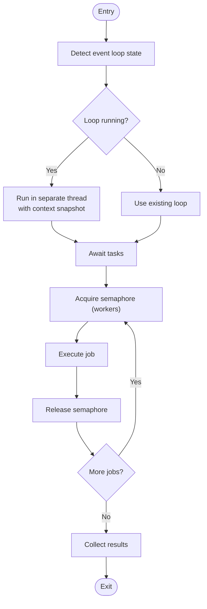
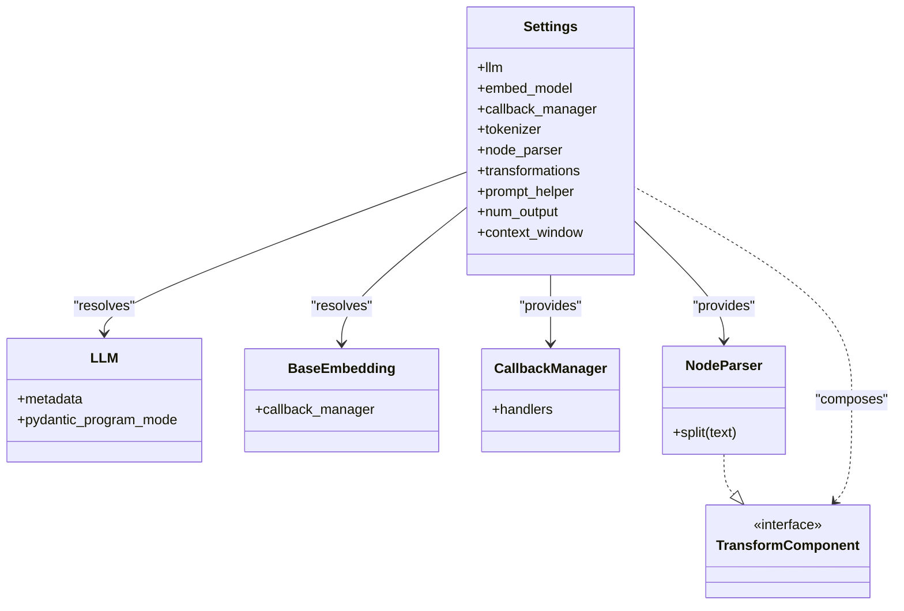
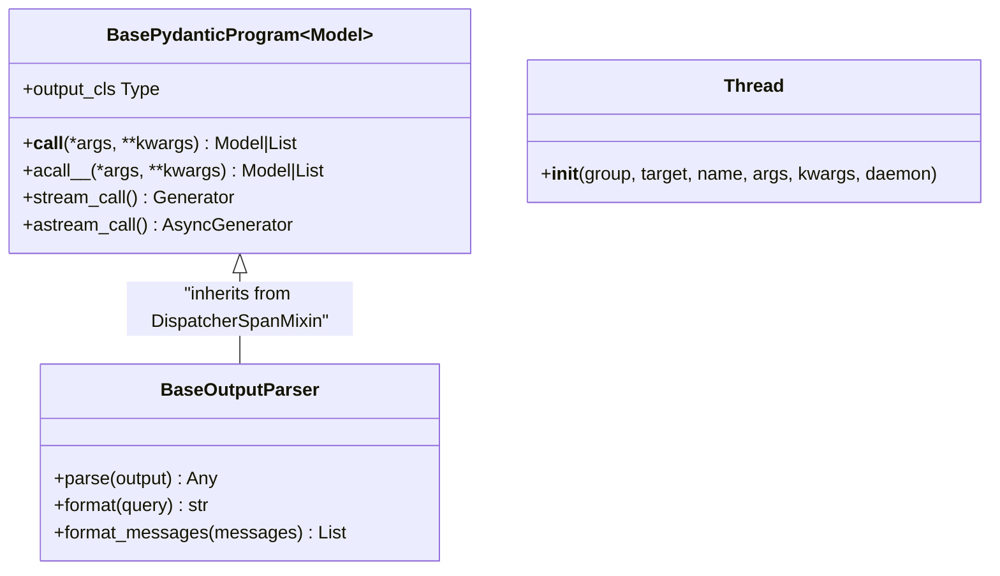
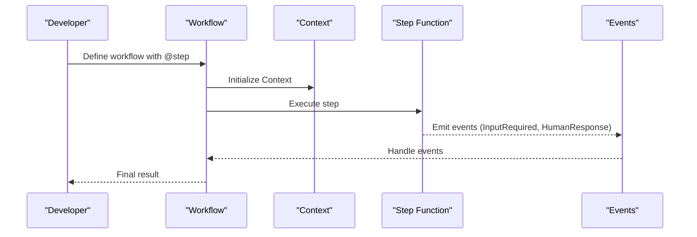
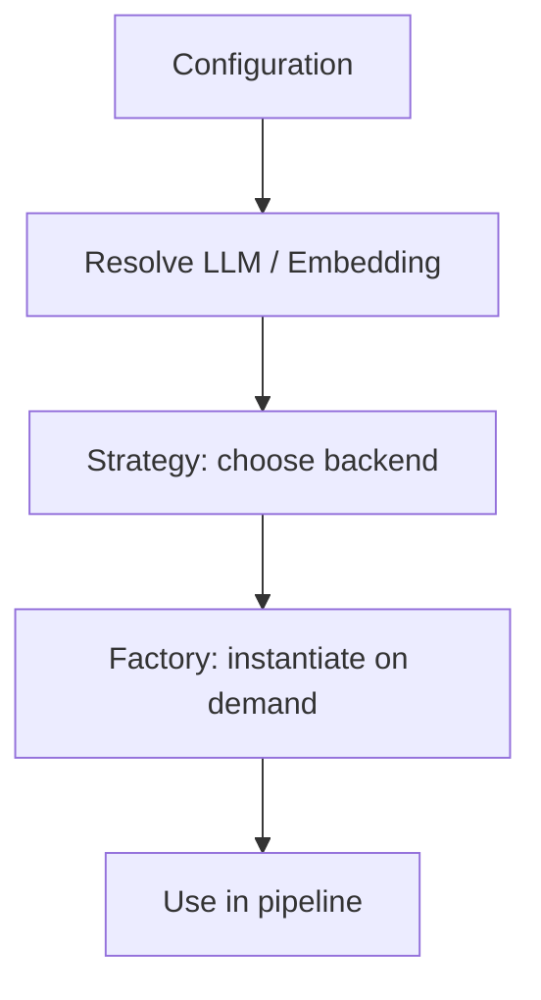
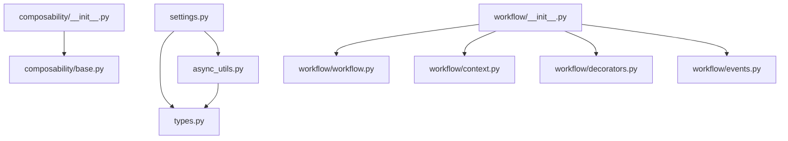

# Advanced Architectural Patterns

<cite>
**Referenced Files in This Document**
- [async_utils.py](file://llama-index-core/llama_index/core/async_utils.py)
- [settings.py](file://llama-index-core/llama_index/core/settings.py)
- [types.py](file://llama-index-core/llama_index/core/types.py)
- [__init__.py (composability)](file://llama-index-core/llama_index/core/composability/__init__.py)
- [base.py (composability)](file://llama-index-core/llama_index/core/composability/base.py)
- [__init__.py (workflow)](file://llama-index-core/llama_index/core/workflow/__init__.py)
- [workflow.py (workflow)](file://llama-index-core/llama_index/core/workflow/workflow.py)
- [context.py (workflow)](file://llama-index-core/llama_index/core/workflow/context.py)
- [decorators.py (workflow)](file://llama-index-core/llama_index/core/workflow/decorators.py)
- [events.py (workflow)](file://llama-index-core/llama_index/core/workflow/events.py)
- [service_context.py](file://llama-index-core/llama_index/core/service_context.py)
</cite>

## Table of Contents
1. [Introduction](#introduction)
2. [Project Structure](#project-structure)
3. [Core Components](#core-components)
4. [Architecture Overview](#architecture-overview)
5. [Detailed Component Analysis](#detailed-component-analysis)
6. [Dependency Analysis](#dependency-analysis)
7. [Performance Considerations](#performance-considerations)
8. [Troubleshooting Guide](#troubleshooting-guide)
9. [Conclusion](#conclusion)
10. [Appendices](#appendices)

## Introduction
This document presents advanced architectural patterns in LlamaIndex with a focus on workflow orchestration, composability, and asynchronous processing. It explains how the framework supports modular, pluggable components, event-driven workflows, and scalable execution models suitable for enterprise deployments. It also covers design patterns such as strategy and factory patterns, and demonstrates how these patterns enable complex system designs, microservice-oriented integrations, and distributed processing.

## Project Structure
At the center of advanced patterns are three pillars:
- Asynchronous utilities for concurrency and batching
- Settings and types for modular configuration and runtime behavior
- Composability and workflow subsystems for orchestrating multi-step, event-driven pipelines

**Diagram sources**
- [async_utils.py](file://llama-index-core/llama_index/core/async_utils.py#L1-L175)
- [settings.py](file://llama-index-core/llama_index/core/settings.py#L1-L249)
- [types.py](file://llama-index-core/llama_index/core/types.py#L1-L177)
- [__init__.py (composability)](file://llama-index-core/llama_index/core/composability/__init__.py#L1-L9)
- [base.py (composability)](file://llama-index-core/llama_index/core/composability/base.py#L1-L5)
- [__init__.py (workflow)](file://llama-index-core/llama_index/core/workflow/__init__.py#L1-L23)
- [workflow.py (workflow)](file://llama-index-core/llama_index/core/workflow/workflow.py#L1-L2)
- [context.py (workflow)](file://llama-index-core/llama_index/core/workflow/context.py#L1-L2)
- [decorators.py (workflow)](file://llama-index-core/llama_index/core/workflow/decorators.py#L1-L11)
- [events.py (workflow)](file://llama-index-core/llama_index/core/workflow/events.py#L1-L9)

**Section sources**
- [async_utils.py](file://llama-index-core/llama_index/core/async_utils.py#L1-L175)
- [settings.py](file://llama-index-core/llama_index/core/settings.py#L1-L249)
- [types.py](file://llama-index-core/llama_index/core/types.py#L1-L177)
- [__init__.py (composability)](file://llama-index-core/llama_index/core/composability/__init__.py#L1-L9)
- [base.py (composability)](file://llama-index-core/llama_index/core/composability/base.py#L1-L5)
- [__init__.py (workflow)](file://llama-index-core/llama_index/core/workflow/__init__.py#L1-L23)
- [workflow.py (workflow)](file://llama-index-core/llama_index/core/workflow/workflow.py#L1-L2)
- [context.py (workflow)](file://llama-index-core/llama_index/core/workflow/context.py#L1-L2)
- [decorators.py (workflow)](file://llama-index-core/llama_index/core/workflow/decorators.py#L1-L11)
- [events.py (workflow)](file://llama-index-core/llama_index/core/workflow/events.py#L1-L9)

## Core Components
- Asynchronous utilities: Provide robust async execution, progress-aware gathering, batching, and worker-limited concurrency.
- Settings: Centralized configuration with lazy resolution and property-based accessors for LLMs, embeddings, callbacks, tokenizers, parsers, and transformations.
- Types: Shared abstractions for output parsing, pydantic programs, and thread wrappers that preserve context across threads.
- Composability: Exposes composable graph APIs for building modular query engines and summarization pipelines.
- Workflow: Event-driven workflow engine with decorators, context, and event types for orchestration and human-in-the-loop flows.

**Section sources**
- [async_utils.py](file://llama-index-core/llama_index/core/async_utils.py#L1-L175)
- [settings.py](file://llama-index-core/llama_index/core/settings.py#L1-L249)
- [types.py](file://llama-index-core/llama_index/core/types.py#L1-L177)
- [__init__.py (composability)](file://llama-index-core/llama_index/core/composability/__init__.py#L1-L9)
- [base.py (composability)](file://llama-index-core/llama_index/core/composability/base.py#L1-L5)
- [__init__.py (workflow)](file://llama-index-core/llama_index/core/workflow/__init__.py#L1-L23)

## Architecture Overview
The architecture blends modular configuration (Settings) with asynchronous execution (async_utils) and orchestration (workflow). Composability layers build higher-order systems from smaller components. The design favors:
- Strategy pattern via property resolvers (e.g., LLM and embedding resolution)
- Factory pattern via Settings’ lazy initialization
- Event-driven orchestration via Workflow
- Concurrency control via semaphores and batching

**Diagram sources**
- [settings.py](file://llama-index-core/llama_index/core/settings.py#L17-L249)
- [async_utils.py](file://llama-index-core/llama_index/core/async_utils.py#L103-L175)
- [types.py](file://llama-index-core/llama_index/core/types.py#L43-L135)

## Detailed Component Analysis

### Asynchronous Utilities and Concurrency Control
Key capabilities:
- Event loop detection and safe execution in nested or non-running loops
- Progress-aware async gathering for Jupyter and CLI contexts
- Worker-limited concurrency via semaphores
- Batched execution with optional logging

**Diagram sources**
- [async_utils.py](file://llama-index-core/llama_index/core/async_utils.py#L25-L100)
- [async_utils.py](file://llama-index-core/llama_index/core/async_utils.py#L137-L175)

**Section sources**
- [async_utils.py](file://llama-index-core/llama_index/core/async_utils.py#L1-L175)

### Settings and Strategy/Factory Patterns
Settings centralizes configuration and exposes property-based factories:
- Lazy resolution of LLM and embeddings
- Callback manager injection
- Tokenizer and node parser providers
- Transformation pipeline composition

**Diagram sources**
- [settings.py](file://llama-index-core/llama_index/core/settings.py#L17-L249)

**Section sources**
- [settings.py](file://llama-index-core/llama_index/core/settings.py#L1-L249)

### Types: Output Parsing, Pydantic Programs, and Threading
- BaseOutputParser: Defines parsing/formatting hooks for structured outputs
- BasePydanticProgram: Abstraction for LLM-backed functions returning typed models
- Thread: Context-preserving thread wrapper for synchronous environments

**Diagram sources**
- [types.py](file://llama-index-core/llama_index/core/types.py#L43-L135)

**Section sources**
- [types.py](file://llama-index-core/llama_index/core/types.py#L1-L177)

### Composability Framework
The composability module exposes composable graph APIs and query engine builders, enabling modular construction of retrieval and summarization pipelines.

**Diagram sources**
- [__init__.py (composability)](file://llama-index-core/llama_index/core/composability/__init__.py#L1-L9)
- [base.py (composability)](file://llama-index-core/llama_index/core/composability/base.py#L1-L5)

**Section sources**
- [__init__.py (composability)](file://llama-index-core/llama_index/core/composability/__init__.py#L1-L9)
- [base.py (composability)](file://llama-index-core/llama_index/core/composability/base.py#L1-L5)

### Workflow Engine: Orchestration and Event-Driven Architecture
The workflow subsystem provides:
- Decorators for step definition
- Events for orchestration and human-in-the-loop flows
- Context for stateful execution
- Serialization helpers for persistence

**Diagram sources**
- [__init__.py (workflow)](file://llama-index-core/llama_index/core/workflow/__init__.py#L1-L23)
- [decorators.py (workflow)](file://llama-index-core/llama_index/core/workflow/decorators.py#L1-L11)
- [events.py (workflow)](file://llama-index-core/llama_index/core/workflow/events.py#L1-L9)
- [context.py (workflow)](file://llama-index-core/llama_index/core/workflow/context.py#L1-L2)
- [workflow.py (workflow)](file://llama-index-core/llama_index/core/workflow/workflow.py#L1-L2)

**Section sources**
- [__init__.py (workflow)](file://llama-index-core/llama_index/core/workflow/__init__.py#L1-L23)
- [decorators.py (workflow)](file://llama-index-core/llama_index/core/workflow/decorators.py#L1-L11)
- [events.py (workflow)](file://llama-index-core/llama_index/core/workflow/events.py#L1-L9)
- [context.py (workflow)](file://llama-index-core/llama_index/core/workflow/context.py#L1-L2)
- [workflow.py (workflow)](file://llama-index-core/llama_index/core/workflow/workflow.py#L1-L2)

### Pattern Matching, Strategy, and Factory Patterns
- Strategy pattern: Settings resolves LLMs and embeddings dynamically based on configuration, allowing runtime selection of backends.
- Factory pattern: Settings acts as a factory for core components, deferring instantiation until accessed.
- Pattern matching: Output parsers and pydantic programs define consistent interfaces for structured generation and parsing.

**Diagram sources**
- [settings.py](file://llama-index-core/llama_index/core/settings.py#L32-L75)
- [types.py](file://llama-index-core/llama_index/core/types.py#L103-L135)

**Section sources**
- [settings.py](file://llama-index-core/llama_index/core/settings.py#L1-L249)
- [types.py](file://llama-index-core/llama_index/core/types.py#L1-L177)

### Complex System Designs and Microservice Architectures
- Modular composition: Composable graphs enable building multi-stage retrieval and synthesis pipelines from interchangeable components.
- Distributed processing: Async utilities support batching and concurrency limits, enabling horizontal scaling across workers and nodes.
- Observability: Settings inject callback managers and instrumentation spans, supporting tracing and metrics collection across services.

[No sources needed since this section synthesizes patterns without analyzing specific files]

### Enterprise Deployment Trade-offs and Scalability
- Concurrency vs. resource contention: Use worker-limited concurrency to balance throughput and resource usage.
- Lazy initialization: Defer expensive component creation until needed to reduce startup overhead.
- Event-driven orchestration: Enable human-in-the-loop and asynchronous processing for long-running tasks.
- Backpressure and batching: Employ batch gather and progress bars to manage I/O-bound workloads.

[No sources needed since this section provides general guidance]

## Dependency Analysis
The following diagram highlights key dependencies among core modules:

**Diagram sources**
- [async_utils.py](file://llama-index-core/llama_index/core/async_utils.py#L1-L175)
- [types.py](file://llama-index-core/llama_index/core/types.py#L1-L177)
- [settings.py](file://llama-index-core/llama_index/core/settings.py#L1-L249)
- [__init__.py (composability)](file://llama-index-core/llama_index/core/composability/__init__.py#L1-L9)
- [base.py (composability)](file://llama-index-core/llama_index/core/composability/base.py#L1-L5)
- [__init__.py (workflow)](file://llama-index-core/llama_index/core/workflow/__init__.py#L1-L23)
- [workflow.py (workflow)](file://llama-index-core/llama_index/core/workflow/workflow.py#L1-L2)
- [context.py (workflow)](file://llama-index-core/llama_index/core/workflow/context.py#L1-L2)
- [decorators.py (workflow)](file://llama-index-core/llama_index/core/workflow/decorators.py#L1-L11)
- [events.py (workflow)](file://llama-index-core/llama_index/core/workflow/events.py#L1-L9)

**Section sources**
- [async_utils.py](file://llama-index-core/llama_index/core/async_utils.py#L1-L175)
- [settings.py](file://llama-index-core/llama_index/core/settings.py#L1-L249)
- [types.py](file://llama-index-core/llama_index/core/types.py#L1-L177)
- [__init__.py (composability)](file://llama-index-core/llama_index/core/composability/__init__.py#L1-L9)
- [base.py (composability)](file://llama-index-core/llama_index/core/composability/base.py#L1-L5)
- [__init__.py (workflow)](file://llama-index-core/llama_index/core/workflow/__init__.py#L1-L23)
- [workflow.py (workflow)](file://llama-index-core/llama_index/core/workflow/workflow.py#L1-L2)
- [context.py (workflow)](file://llama-index-core/llama_index/core/workflow/context.py#L1-L2)
- [decorators.py (workflow)](file://llama-index-core/llama_index/core/workflow/decorators.py#L1-L11)
- [events.py (workflow)](file://llama-index-core/llama_index/core/workflow/events.py#L1-L9)

## Performance Considerations
- Prefer worker-limited concurrency for CPU-bound tasks to avoid oversubscription.
- Use batching for I/O-heavy operations to amortize overhead.
- Leverage progress-aware gathering for interactive environments.
- Defer component creation via Settings to minimize cold-start costs.

[No sources needed since this section provides general guidance]

## Troubleshooting Guide
Common issues and mitigations:
- Nested async loops: Use provided async runners or adopt async entry points.
- Progress bars in notebooks: Apply nested async support before gathering.
- Human-in-the-loop workflows: Ensure proper event emission and handling.

**Section sources**
- [async_utils.py](file://llama-index-core/llama_index/core/async_utils.py#L25-L100)
- [decorators.py (workflow)](file://llama-index-core/llama_index/core/workflow/decorators.py#L7-L11)
- [events.py (workflow)](file://llama-index-core/llama_index/core/workflow/events.py#L1-L9)

## Conclusion
LlamaIndex’s advanced architecture combines modular configuration, asynchronous execution, and event-driven orchestration to support complex, scalable RAG systems. Strategy and factory patterns in Settings enable flexible backend selection, while composability and workflow engines facilitate multi-step, human-in-the-loop pipelines. These patterns, together with robust async utilities, provide a solid foundation for enterprise-grade deployments.

## Appendices
- ServiceContext deprecation: Legacy service context is deprecated in favor of Settings and local module passing.

**Section sources**
- [service_context.py](file://llama-index-core/llama_index/core/service_context.py#L1-L49)