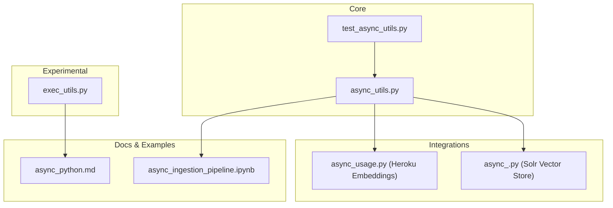
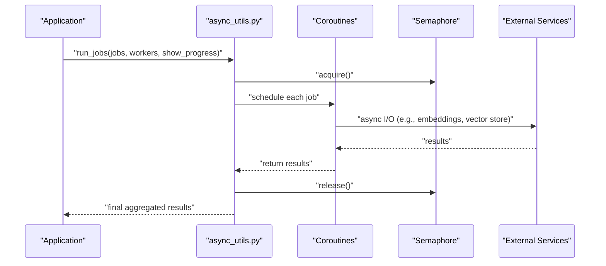
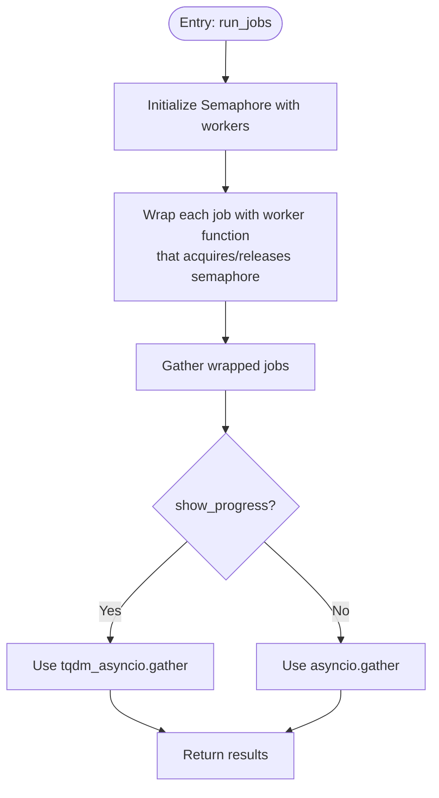
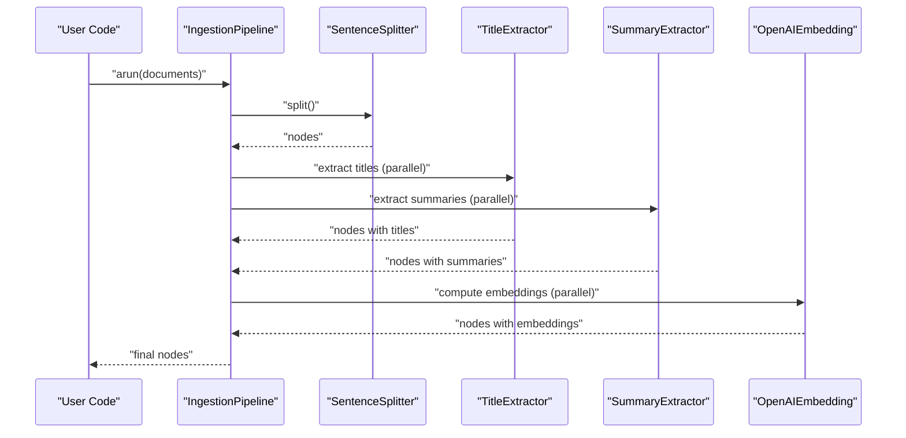
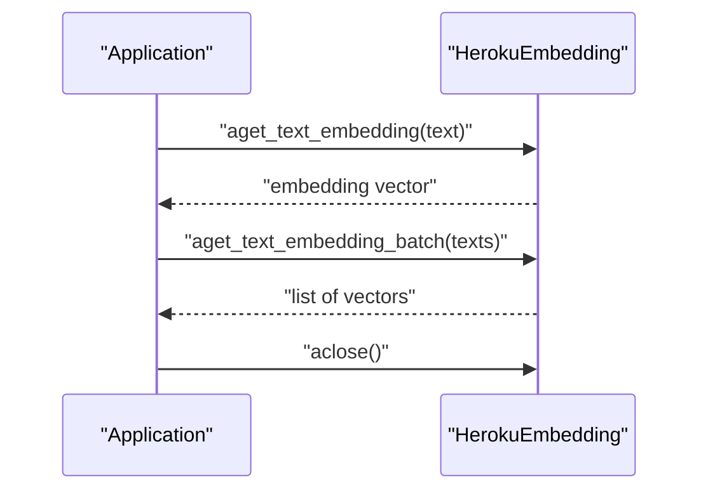
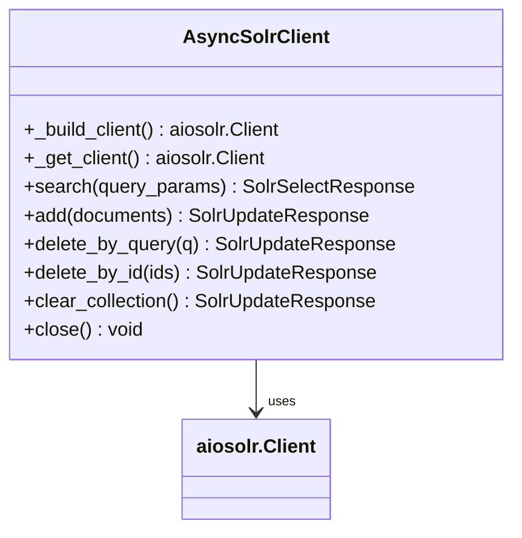
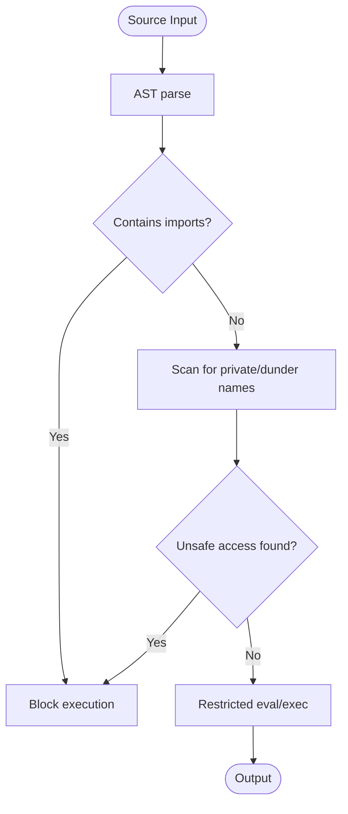
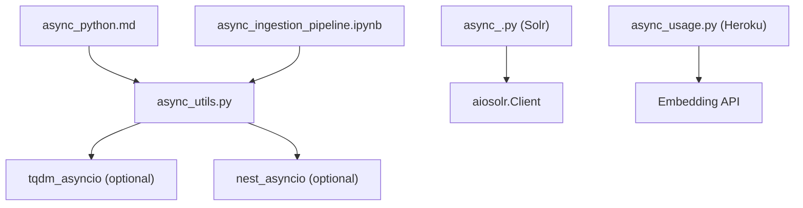

# Asynchronous Architectures

<cite>
**Referenced Files in This Document**
- [async_utils.py](file://llama-index-core/llama_index/core/async_utils.py)
- [test_async_utils.py](file://llama-index-core/tests/test_async_utils.py)
- [exec_utils.py](file://llama-index-experimental/llama_index/experimental/exec_utils.py)
- [async_ingestion_pipeline.ipynb](file://docs/examples/ingestion/async_ingestion_pipeline.ipynb)
- [async_python.md](file://docs/src/content/docs/framework/getting_started/async_python.md)
- [async_usage.py](file://llama-index-integrations/embeddings/llama-index-embeddings-heroku/examples/async_usage.py)
- [async_.py](file://llama-index-integrations/vector_stores/llama-index-vector-stores-solr/llama_index/vector_stores/solr/client/async_.py)
</cite>

## Table of Contents
1. [Introduction](#introduction)
2. [Project Structure](#project-structure)
3. [Core Components](#core-components)
4. [Architecture Overview](#architecture-overview)
5. [Detailed Component Analysis](#detailed-component-analysis)
6. [Dependency Analysis](#dependency-analysis)
7. [Performance Considerations](#performance-considerations)
8. [Troubleshooting Guide](#troubleshooting-guide)
9. [Conclusion](#conclusion)
10. [Appendices](#appendices)

## Introduction
This document explains asynchronous architectures in LlamaIndex with a focus on async processing patterns, concurrent execution models, and non-blocking I/O operations. It covers async utility functions, coroutine patterns, event loop management, and integration with vector stores, embeddings, and other async-capable components. It also provides examples of async data ingestion, parallel processing, concurrent retrieval operations, and guidance on error handling, cancellation, and resource management. Finally, it outlines performance considerations, scalability benefits, and best practices for designing robust async systems.

## Project Structure
LlamaIndex’s async capabilities are implemented across several modules:
- Core async utilities for event loop management, task orchestration, and batching
- Experimental utilities for safe evaluation/exec in restricted contexts
- Integration examples for embeddings and vector stores
- Documentation and notebooks demonstrating async ingestion and usage

**Diagram sources**
- [async_utils.py](file://llama-index-core/llama_index/core/async_utils.py#L1-L175)
- [test_async_utils.py](file://llama-index-core/tests/test_async_utils.py#L1-L40)
- [exec_utils.py](file://llama-index-experimental/llama_index/experimental/exec_utils.py#L1-L173)
- [async_usage.py](file://llama-index-integrations/embeddings/llama-index-embeddings-heroku/examples/async_usage.py#L1-L55)
- [async_.py](file://llama-index-integrations/vector_stores/llama-index-vector-stores-solr/llama_index/vector_stores/solr/client/async_.py#L1-L298)
- [async_ingestion_pipeline.ipynb](file://docs/examples/ingestion/async_ingestion_pipeline.ipynb#L1-L436)
- [async_python.md](file://docs/src/content/docs/framework/getting_started/async_python.md#L1-L82)

**Section sources**
- [async_utils.py](file://llama-index-core/llama_index/core/async_utils.py#L1-L175)
- [exec_utils.py](file://llama-index-experimental/llama_index/experimental/exec_utils.py#L1-L173)
- [async_usage.py](file://llama-index-integrations/embeddings/llama-index-embeddings-heroku/examples/async_usage.py#L1-L55)
- [async_.py](file://llama-index-integrations/vector_stores/llama-index-vector-stores-solr/llama_index/vector_stores/solr/client/async_.py#L1-L298)
- [async_ingestion_pipeline.ipynb](file://docs/examples/ingestion/async_ingestion_pipeline.ipynb#L1-L436)
- [async_python.md](file://docs/src/content/docs/framework/getting_started/async_python.md#L1-L82)

## Core Components
This section focuses on the core async utilities that power LlamaIndex’s async execution model.

- Event loop management and compatibility
  - Provides a robust entry point that detects existing loops, supports nested loops, and falls back to creating a new loop when needed
  - Handles context variable propagation when running inside a running loop
- Task orchestration and concurrency
  - Gathers multiple coroutines efficiently
  - Supports progress bars in notebooks via tqdm integration
  - Limits concurrency via semaphores
- Batching and chunking
  - Splits long task lists into batches to avoid overwhelming downstream services
- Instrumentation-aware execution
  - Wraps execution with spans for observability

Key APIs and behaviors:
- Event loop detection and execution
  - Detects whether a loop is running and either reuses it or spawns a new one
  - Propagates context variables across threads when needed
- Progress-aware gathering
  - Applies tqdm in notebooks and falls back gracefully when unsupported
- Worker-limited concurrency
  - Uses a semaphore to cap concurrent tasks
- Batched execution
  - Iteratively gathers tasks in chunks with optional verbosity

**Section sources**
- [async_utils.py](file://llama-index-core/llama_index/core/async_utils.py#L14-L175)
- [test_async_utils.py](file://llama-index-core/tests/test_async_utils.py#L1-L40)

## Architecture Overview
The async architecture centers around a few core patterns:
- Non-blocking I/O for embeddings, vector stores, and metadata extraction
- Controlled concurrency via semaphores and batching
- Event loop management that adapts to different environments (standalone scripts, notebooks, hosted services)
- Instrumentation and progress reporting integrated into async flows

**Diagram sources**
- [async_utils.py](file://llama-index-core/llama_index/core/async_utils.py#L137-L175)

## Detailed Component Analysis

### Async Utilities: Event Loop Management and Task Orchestration
This module encapsulates best practices for running async code across diverse environments.

- asyncio_run
  - Detects an existing loop; if running, executes in a dedicated thread and propagates context variables
  - Falls back to creating a new loop or raising a clear error for nested async scenarios
- run_async_tasks
  - Gathers tasks with optional progress display in notebooks
  - Applies nest_asyncio when needed to reuse a running loop
- run_jobs
  - Wraps each job with a semaphore to cap concurrency
  - Optionally displays progress using tqdm_asyncio
- batch_gather
  - Processes tasks in fixed-size batches to reduce pressure on external services
- chunks
  - Utility to split iterables into fixed-size groups

**Diagram sources**
- [async_utils.py](file://llama-index-core/llama_index/core/async_utils.py#L137-L175)

**Section sources**
- [async_utils.py](file://llama-index-core/llama_index/core/async_utils.py#L25-L175)
- [test_async_utils.py](file://llama-index-core/tests/test_async_utils.py#L21-L40)

### Async Ingestion Pipeline
This notebook demonstrates async metadata extraction and parallel processing during ingestion.

- Highlights improvements in async metadata extraction compared to earlier versions
- Shows how to configure worker counts to balance throughput and stability
- Demonstrates progress bars indicating throughput and timing comparisons

**Diagram sources**
- [async_ingestion_pipeline.ipynb](file://docs/examples/ingestion/async_ingestion_pipeline.ipynb#L78-L101)

**Section sources**
- [async_ingestion_pipeline.ipynb](file://docs/examples/ingestion/async_ingestion_pipeline.ipynb#L69-L152)

### Async Embeddings: Heroku Embeddings
This example shows async usage of embeddings, including batch operations and cleanup.

- Demonstrates awaiting single and batch embedding generation
- Includes similarity computation and proper client lifecycle management via aclose()

**Diagram sources**
- [async_usage.py](file://llama-index-integrations/embeddings/llama-index-embeddings-heroku/examples/async_usage.py#L8-L55)

**Section sources**
- [async_usage.py](file://llama-index-integrations/embeddings/llama-index-embeddings-heroku/examples/async_usage.py#L1-L55)

### Async Vector Store: Solr Client
The Solr client exposes an async interface backed by aiosolr, enabling non-blocking search, insert, and delete operations.

- Initializes and lazily builds an aiosolr client
- Provides async search, add, delete_by_query, delete_by_id, and clear_collection
- Ensures proper resource cleanup via close and destructor logic

**Diagram sources**
- [async_.py](file://llama-index-integrations/vector_stores/llama-index-vector-stores-solr/llama_index/vector_stores/solr/client/async_.py#L26-L298)

**Section sources**
- [async_.py](file://llama-index-integrations/vector_stores/llama-index-vector-stores-solr/llama_index/vector_stores/solr/client/async_.py#L1-L298)

### Safe Execution Utilities (Experimental)
While not strictly async, the experimental exec utilities provide a framework for safely evaluating/executing code in restricted contexts, which can be useful when composing async workflows that involve dynamic code execution.

- Restricted imports and built-ins
- AST-based safety checks to prevent private/dunder access and disallowed imports
- Safe eval/exec with restricted globals

**Diagram sources**
- [exec_utils.py](file://llama-index-experimental/llama_index/experimental/exec_utils.py#L90-L173)

**Section sources**
- [exec_utils.py](file://llama-index-experimental/llama_index/experimental/exec_utils.py#L1-L173)

## Dependency Analysis
The async ecosystem integrates core utilities with integrations and documentation:

- Core async utilities depend on asyncio, contextvars, and optional tqdm/nest-asyncio for progress and notebook compatibility
- Integrations rely on third-party async clients (e.g., aiosolr) while exposing consistent async APIs
- Tests validate critical behaviors like context propagation and batch handling

**Diagram sources**
- [async_utils.py](file://llama-index-core/llama_index/core/async_utils.py#L14-L22)
- [async_.py](file://llama-index-integrations/vector_stores/llama-index-vector-stores-solr/llama_index/vector_stores/solr/client/async_.py#L12-L13)
- [async_usage.py](file://llama-index-integrations/embeddings/llama-index-embeddings-heroku/examples/async_usage.py#L1-L55)
- [async_ingestion_pipeline.ipynb](file://docs/examples/ingestion/async_ingestion_pipeline.ipynb#L1-L436)
- [async_python.md](file://docs/src/content/docs/framework/getting_started/async_python.md#L1-L82)

**Section sources**
- [async_utils.py](file://llama-index-core/llama_index/core/async_utils.py#L1-L175)
- [async_.py](file://llama-index-integrations/vector_stores/llama-index-vector-stores-solr/llama_index/vector_stores/solr/client/async_.py#L1-L298)
- [async_usage.py](file://llama-index-integrations/embeddings/llama-index-embeddings-heroku/examples/async_usage.py#L1-L55)
- [async_ingestion_pipeline.ipynb](file://docs/examples/ingestion/async_ingestion_pipeline.ipynb#L1-L436)
- [async_python.md](file://docs/src/content/docs/framework/getting_started/async_python.md#L1-L82)

## Performance Considerations
- Concurrency vs. stability
  - Use worker limits to avoid overwhelming external services and triggering rate limits or timeouts
  - Adjust worker counts based on service SLAs and client stability
- Batching
  - Break large task lists into batches to smooth load and reduce tail latency
- Progress and diagnostics
  - Enable progress bars in notebooks for visibility; disable in production to reduce overhead
- Event loop hygiene
  - Reuse existing loops in notebooks; avoid nested loops unless necessary
  - Close async clients and resources deterministically to prevent leaks

[No sources needed since this section provides general guidance]

## Troubleshooting Guide
Common issues and remedies:
- Nested async errors
  - Apply nest_asyncio when working in environments with a running loop
  - Prefer async entry methods (e.g., aquery, aretrieve, achat) when available
- Timeout and rate-limit spikes
  - Reduce worker counts or introduce backoff
  - Use batching to distribute load
- Resource cleanup
  - Always close async clients and embeddings to free sessions and sockets
- Context propagation
  - When inside a running loop, ensure context variables are captured and propagated

**Section sources**
- [async_utils.py](file://llama-index-core/llama_index/core/async_utils.py#L57-L66)
- [async_usage.py](file://llama-index-integrations/embeddings/llama-index-embeddings-heroku/examples/async_usage.py#L48-L51)
- [async_.py](file://llama-index-integrations/vector_stores/llama-index-vector-stores-solr/llama_index/vector_stores/solr/client/async_.py#L268-L298)

## Conclusion
LlamaIndex’s async architecture emphasizes non-blocking I/O, controlled concurrency, and robust event loop management. Core utilities provide portable patterns for running and coordinating async tasks, while integrations expose consistent async APIs for embeddings and vector stores. By tuning worker counts, leveraging batching, and following resource management best practices, developers can achieve scalable, responsive systems suited for I/O-bound workloads.

[No sources needed since this section summarizes without analyzing specific files]

## Appendices

### Best Practices Checklist
- Prefer async entry methods when available
- Limit concurrency with semaphores
- Use batching for large task sets
- Enable progress in notebooks; disable in production
- Close async clients and resources deterministically
- Apply nest_asyncio in notebook environments
- Monitor and tune worker counts to avoid timeouts and rate limits

[No sources needed since this section provides general guidance]