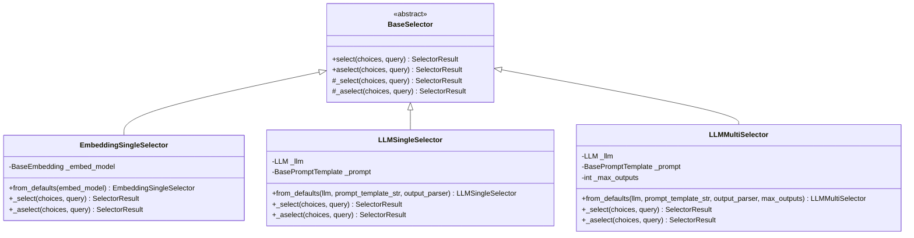

# Composability Framework

<cite>
**Referenced Files in This Document**
- [base.py](file://llama-index-core/llama_index/core/composability/base.py)
- [__init__.py](file://llama-index-core/llama_index/core/composability/__init__.py)
- [joint_qa_summary.py](file://llama-index-core/llama_index/core/composability/joint_qa_summary.py)
- [graph.py](file://llama-index-core/llama_index/core/indices/composability/graph.py)
- [graph_query_engine.py](file://llama-index-core/llama_index/core/query_engine/graph_query_engine.py)
- [base_selector.py](file://llama-index-core/llama_index/core/base/base_selector.py)
- [embedding_selectors.py](file://llama-index-core/llama_index/core/selectors/embedding_selectors.py)
- [llm_selectors.py](file://llama-index-core/llama_index/core/selectors/llm_selectors.py)
- [router_query_engine.py](file://llama-index-core/llama_index/core/query_engine/router_query_engine.py)
</cite>

## Table of Contents
1. [Introduction](#introduction)
2. [Project Structure](#project-structure)
3. [Core Components](#core-components)
4. [Architecture Overview](#architecture-overview)
5. [Detailed Component Analysis](#detailed-component-analysis)
6. [Dependency Analysis](#dependency-analysis)
7. [Performance Considerations](#performance-considerations)
8. [Troubleshooting Guide](#troubleshooting-guide)
9. [Conclusion](#conclusion)

## Introduction
This document explains the composability framework in LlamaIndex, focusing on how modular components can be combined and configured dynamically to build flexible, extensible systems. It covers:
- Base composability interfaces and graph construction
- Selector patterns for dynamic routing among components
- Auto-retriever mechanisms via tool-based routers
- Builder patterns for composite query engines
- Runtime composition and configuration management
- Extensibility and dependency injection strategies
- Best practices for maintaining stability under composition

## Project Structure
The composability features are primarily located under the core composability module and related query engines, selectors, and indices:
- Composability builders and graph utilities
- Router engines for dynamic selection
- Selector abstractions and implementations
- Graph-based composition and query execution

**Diagram sources**
- [graph.py](file://llama-index-core/llama_index/core/indices/composability/graph.py#L17-L128)
- [graph_query_engine.py](file://llama-index-core/llama_index/core/query_engine/graph_query_engine.py#L15-L132)
- [joint_qa_summary.py](file://llama-index-core/llama_index/core/composability/joint_qa_summary.py#L24-L99)
- [router_query_engine.py](file://llama-index-core/llama_index/core/query_engine/router_query_engine.py#L95-L398)
- [base_selector.py](file://llama-index-core/llama_index/core/base/base_selector.py#L72-L104)
- [embedding_selectors.py](file://llama-index-core/llama_index/core/selectors/embedding_selectors.py#L16-L94)
- [llm_selectors.py](file://llama-index-core/llama_index/core/selectors/llm_selectors.py#L49-L235)

**Section sources**
- [base.py](file://llama-index-core/llama_index/core/composability/base.py#L1-L5)
- [__init__.py](file://llama-index-core/llama_index/core/composability/__init__.py#L1-L9)

## Core Components
- ComposableGraph: Encapsulates a collection of indices with a root index and supports building higher-order indices from child indices. Provides a query engine wrapper for traversal and synthesis.
- ComposableGraphQueryEngine: Executes queries over a ComposableGraph, optionally using custom per-index query engines and supporting recursive traversal.
- QASummaryQueryEngineBuilder: Builds a unified RouterQueryEngine over both a vector index (QA) and a summary index (summarization), enabling automatic routing between them.
- BaseSelector and Implementations: Abstractions for selecting among multiple candidates (tools or indices) based on query intent and metadata. Includes embedding-based and LLM-based selectors.
- RouterQueryEngine: Orchestrates selection and execution across multiple query engines, combining results when multiple selections are made.

**Section sources**
- [graph.py](file://llama-index-core/llama_index/core/indices/composability/graph.py#L17-L128)
- [graph_query_engine.py](file://llama-index-core/llama_index/core/query_engine/graph_query_engine.py#L15-L132)
- [joint_qa_summary.py](file://llama-index-core/llama_index/core/composability/joint_qa_summary.py#L24-L99)
- [base_selector.py](file://llama-index-core/llama_index/core/base/base_selector.py#L72-L104)
- [embedding_selectors.py](file://llama-index-core/llama_index/core/selectors/embedding_selectors.py#L16-L94)
- [llm_selectors.py](file://llama-index-core/llama_index/core/selectors/llm_selectors.py#L49-L235)
- [router_query_engine.py](file://llama-index-core/llama_index/core/query_engine/router_query_engine.py#L95-L398)

## Architecture Overview
The composability architecture centers on:
- Building composite indices from child indices with a root index
- Executing queries through a graph-aware query engine
- Routing to appropriate sub-engines using selectors
- Combining results from multiple sub-engines when needed

**Diagram sources**
- [router_query_engine.py](file://llama-index-core/llama_index/core/query_engine/router_query_engine.py#L160-L248)
- [base_selector.py](file://llama-index-core/llama_index/core/base/base_selector.py#L79-L103)

## Detailed Component Analysis

### ComposableGraph and ComposableGraphQueryEngine
ComposableGraph constructs a hierarchical index from child indices and exposes a root index and all indices for traversal. ComposableGraphQueryEngine executes queries against this structure, optionally delegating to custom per-index engines and recursively resolving index nodes.

**Diagram sources**
- [graph.py](file://llama-index-core/llama_index/core/indices/composability/graph.py#L17-L128)
- [graph_query_engine.py](file://llama-index-core/llama_index/core/query_engine/graph_query_engine.py#L15-L132)

**Section sources**
- [graph.py](file://llama-index-core/llama_index/core/indices/composability/graph.py#L17-L128)
- [graph_query_engine.py](file://llama-index-core/llama_index/core/query_engine/graph_query_engine.py#L15-L132)

### QASummaryQueryEngineBuilder
This builder composes a unified RouterQueryEngine from two indices:
- VectorStoreIndex for retrieval-based QA
- SummaryIndex for summarization

It ingests documents, builds indices, wraps them as QueryEngineTool instances, and routes based on descriptions.

**Diagram sources**
- [joint_qa_summary.py](file://llama-index-core/llama_index/core/composability/joint_qa_summary.py#L61-L99)

**Section sources**
- [joint_qa_summary.py](file://llama-index-core/llama_index/core/composability/joint_qa_summary.py#L24-L99)

### Selector Patterns
Selectors choose among multiple candidates based on query intent and metadata. The base abstraction defines synchronous and asynchronous selection methods, while implementations include:
- EmbeddingSingleSelector: selects based on embedding similarity
- LLMSingleSelector / LLMMultiSelector: use LLM prompts to pick one or multiple candidates

**Diagram sources**
- [base_selector.py](file://llama-index-core/llama_index/core/base/base_selector.py#L72-L104)
- [embedding_selectors.py](file://llama-index-core/llama_index/core/selectors/embedding_selectors.py#L16-L94)
- [llm_selectors.py](file://llama-index-core/llama_index/core/selectors/llm_selectors.py#L49-L235)

**Section sources**
- [base_selector.py](file://llama-index-core/llama_index/core/base/base_selector.py#L72-L104)
- [embedding_selectors.py](file://llama-index-core/llama_index/core/selectors/embedding_selectors.py#L16-L94)
- [llm_selectors.py](file://llama-index-core/llama_index/core/selectors/llm_selectors.py#L49-L235)

### RouterQueryEngine and Auto-Retrieval
RouterQueryEngine orchestrates selection and execution across multiple query engines:
- Single selection: executes the chosen engine
- Multi-selection: executes all and combines results via TreeSummarize
- Integrates with selectors and supports verbose logging and metadata propagation

**Diagram sources**
- [router_query_engine.py](file://llama-index-core/llama_index/core/query_engine/router_query_engine.py#L160-L248)

**Section sources**
- [router_query_engine.py](file://llama-index-core/llama_index/core/query_engine/router_query_engine.py#L95-L398)

## Dependency Analysis
Key dependencies and relationships:
- ComposableGraph depends on BaseIndex and IndexStruct to represent and link indices.
- ComposableGraphQueryEngine depends on ComposableGraph and delegates to per-index query engines.
- RouterQueryEngine depends on BaseSelector and QueryEngineTool to route and combine results.
- Selector implementations depend on LLMs or embeddings and output structured results compatible with RouterQueryEngine.
- QASummaryQueryEngineBuilder depends on VectorStoreIndex, SummaryIndex, and RouterQueryEngine.

**Diagram sources**
- [graph.py](file://llama-index-core/llama_index/core/indices/composability/graph.py#L17-L128)
- [graph_query_engine.py](file://llama-index-core/llama_index/core/query_engine/graph_query_engine.py#L15-L132)
- [joint_qa_summary.py](file://llama-index-core/llama_index/core/composability/joint_qa_summary.py#L24-L99)
- [router_query_engine.py](file://llama-index-core/llama_index/core/query_engine/router_query_engine.py#L95-L398)
- [base_selector.py](file://llama-index-core/llama_index/core/base/base_selector.py#L72-L104)
- [embedding_selectors.py](file://llama-index-core/llama_index/core/selectors/embedding_selectors.py#L16-L94)
- [llm_selectors.py](file://llama-index-core/llama_index/core/selectors/llm_selectors.py#L49-L235)

**Section sources**
- [graph.py](file://llama-index-core/llama_index/core/indices/composability/graph.py#L17-L128)
- [router_query_engine.py](file://llama-index-core/llama_index/core/query_engine/router_query_engine.py#L95-L398)

## Performance Considerations
- Selector overhead: EmbeddingSingleSelector avoids LLM calls and is efficient; LLMSingleSelector/LLMMultiSelector incur LLM latency and should be used judiciously.
- Router orchestration: Multi-selection triggers multiple sub-queries and a summarization step; prefer single selection when appropriate to reduce latency.
- Graph traversal: Recursive traversal in ComposableGraphQueryEngine adds depth and cost; tune recursion and index summaries to minimize unnecessary recursion.
- Batch and async: Use async APIs where available and leverage parallel execution for multi-selection scenarios.

[No sources needed since this section provides general guidance]

## Troubleshooting Guide
Common issues and remedies:
- Missing index summaries when constructing ComposableGraph: Ensure index_summaries are provided or pre-set so the root index can link children properly.
- Selector failures: Verify selector initialization and prompt parsers; ensure ToolMetadata descriptions are present and meaningful.
- Router errors: Confirm that QueryEngineTool wrappers include valid metadata and that the number of indices matches provided summaries.
- Recursive traversal anomalies: Limit recursion depth or disable recursion for heavy graphs; validate IndexNode relationships.

**Section sources**
- [graph.py](file://llama-index-core/llama_index/core/indices/composability/graph.py#L59-L80)
- [router_query_engine.py](file://llama-index-core/llama_index/core/query_engine/router_query_engine.py#L160-L203)

## Conclusion
LlamaIndex’s composability framework enables robust, modular systems by:
- Building hierarchical indices with ComposableGraph
- Executing and synthesizing across indices with ComposableGraphQueryEngine
- Automatically routing between query modes with RouterQueryEngine and selectors
- Constructing composite engines with QASummaryQueryEngineBuilder

By leveraging these patterns—dynamic selection, modular composition, and configurable orchestration—you can assemble complex pipelines from simple components while preserving flexibility and maintainability.