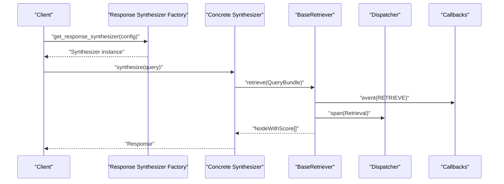

# Pattern Libraries

<cite>
**Referenced Files in This Document**
- [factory.py](file://llama-index-core/llama_index/core/response_synthesizers/factory.py)
- [base_auto_retriever.py](file://llama-index-core/llama_index/core/base/base_auto_retriever.py)
- [base_selector.py](file://llama-index-core/llama_index/core/base/base_selector.py)
- [base_retriever.py](file://llama-index-core/llama_index/core/base/base_retriever.py)
- [llm_selectors.py](file://llama-index-core/llama_index/core/selectors/llm_selectors.py)
- [auto_retriever.py](file://llama-index-core/llama_index/core/indices/vector_store/retrievers/auto_retriever/auto_retriever.py)
- [retriever.py](file://llama-index-core/llama_index/core/indices/vector_store/retrievers/retriever.py)
- [retriever_query_engine.py](file://llama-index-core/llama_index/core/query_engine/retriever_query_engine.py)
- [default_prompt_selectors.py](file://llama-index-core/llama_index/core/prompts/default_prompt_selectors.py)
- [embedding_selectors.py](file://llama-index-core/llama_index/core/selectors/embedding_selectors.py)
- [pydantic_selectors.py](file://llama-index-core/llama_index/core/selectors/pydantic_selectors.py)
- [base_multi_modal_retriever.py](file://llama-index-core/llama_index/core/base/base_multi_modal_retriever.py)
- [image_retriever.py](file://llama-index-core/llama_index/core/image_retriever.py)
- [base.py](file://llama-index-core/llama_index/core/callbacks/base.py)
- [dispatcher.py](file://llama-index-instrumentation/src/llama_index_instrumentation/dispatcher.py)
</cite>

## Table of Contents
1. [Introduction](#introduction)
2. [Project Structure](#project-structure)
3. [Core Components](#core-components)
4. [Architecture Overview](#architecture-overview)
5. [Detailed Component Analysis](#detailed-component-analysis)
6. [Dependency Analysis](#dependency-analysis)
7. [Performance Considerations](#performance-considerations)
8. [Troubleshooting Guide](#troubleshooting-guide)
9. [Conclusion](#conclusion)
10. [Appendices](#appendices)

## Introduction
This document presents a comprehensive pattern library for LlamaIndex, focusing on design patterns that enable modular, extensible, and maintainable RAG systems. It documents factory patterns for component creation, strategy patterns for pluggable implementations, observer patterns for event handling, selector patterns for dynamic choice-making, and auto-retriever strategies for adaptive retrieval. It also covers pattern matching, composition, selection criteria, trade-offs, and how these patterns collectively support scalability and flexibility.

## Project Structure
LlamaIndex organizes patterns primarily around core abstractions and composable modules:
- Abstractions define stable interfaces for pluggable behavior (selectors, retrievers, response synthesizers).
- Factory functions encapsulate construction logic and switch on configuration to instantiate appropriate implementations.
- Strategy-style classes implement interchangeable algorithms behind shared interfaces.
- Observer-style instrumentation emits structured events and spans for monitoring and tracing.
- Auto-retrievers and selectors demonstrate pattern composition for adaptive retrieval and decision-making.

**Diagram sources**
- [base_retriever.py](file://llama-index-core/llama_index/core/base/base_retriever.py#L34-L275)
- [base_selector.py](file://llama-index-core/llama_index/core/base/base_selector.py#L72-L104)
- [base_auto_retriever.py](file://llama-index-core/llama_index/core/base/base_auto_retriever.py#L9-L44)
- [factory.py](file://llama-index-core/llama_index/core/response_synthesizers/factory.py#L33-L152)
- [llm_selectors.py](file://llama-index-core/llama_index/core/selectors/llm_selectors.py#L49-L235)
- [auto_retriever.py](file://llama-index-core/llama_index/core/indices/vector_store/retrievers/auto_retriever/auto_retriever.py)
- [retriever.py](file://llama-index-core/llama_index/core/indices/vector_store/retrievers/retriever.py)
- [base.py](file://llama-index-core/llama_index/core/callbacks/base.py)
- [dispatcher.py](file://llama-index-instrumentation/src/llama_index_instrumentation/dispatcher.py)

**Section sources**
- [base_retriever.py](file://llama-index-core/llama_index/core/base/base_retriever.py#L34-L275)
- [base_selector.py](file://llama-index-core/llama_index/core/base/base_selector.py#L72-L104)
- [base_auto_retriever.py](file://llama-index-core/llama_index/core/base/base_auto_retriever.py#L9-L44)
- [factory.py](file://llama-index-core/llama_index/core/response_synthesizers/factory.py#L33-L152)
- [llm_selectors.py](file://llama-index-core/llama_index/core/selectors/llm_selectors.py#L49-L235)

## Core Components
- Factory pattern for response synthesizers: Centralized construction logic selects among multiple strategies based on configuration.
- Strategy pattern for retrievers: Base interface plus multiple implementations; runtime selection enables pluggable retrieval strategies.
- Observer pattern for instrumentation: Dispatches events and spans around retrieval operations for observability.
- Selector pattern for dynamic choice-making: Abstractions and implementations choose among options based on query context.
- Auto-retriever pattern: Generates retrieval specs dynamically and composes a retriever at runtime.

Key implementation anchors:
- Response synthesizer factory: [get_response_synthesizer](file://llama-index-core/llama_index/core/response_synthesizers/factory.py#L33-L152)
- Base retriever: [BaseRetriever](file://llama-index-core/llama_index/core/base/base_retriever.py#L34-L275)
- Base selector: [BaseSelector](file://llama-index-core/llama_index/core/base/base_selector.py#L72-L104)
- Base auto retriever: [BaseAutoRetriever](file://llama-index-core/llama_index/core/base/base_auto_retriever.py#L9-L44)
- LLM selectors: [LLMSingleSelector](file://llama-index-core/llama_index/core/selectors/llm_selectors.py#L49-L138), [LLMMultiSelector](file://llama-index-core/llama_index/core/selectors/llm_selectors.py#L140-L235)

**Section sources**
- [factory.py](file://llama-index-core/llama_index/core/response_synthesizers/factory.py#L33-L152)
- [base_retriever.py](file://llama-index-core/llama_index/core/base/base_retriever.py#L34-L275)
- [base_selector.py](file://llama-index-core/llama_index/core/base/base_selector.py#L72-L104)
- [base_auto_retriever.py](file://llama-index-core/llama_index/core/base/base_auto_retriever.py#L9-L44)
- [llm_selectors.py](file://llama-index-core/llama_index/core/selectors/llm_selectors.py#L49-L235)

## Architecture Overview
The system leverages layered patterns:
- Abstraction-first design: Base classes define contracts for selectors, retrievers, and synthesizers.
- Factory-driven instantiation: Construction logic centralizes configuration-to-implementation mapping.
- Strategy-based runtime selection: Different retriever and selector implementations can be swapped without changing client code.
- Instrumentation pipeline: Observability hooks emit events and spans around retrieval operations.

**Diagram sources**
- [factory.py](file://llama-index-core/llama_index/core/response_synthesizers/factory.py#L33-L152)
- [base_retriever.py](file://llama-index-core/llama_index/core/base/base_retriever.py#L185-L254)
- [dispatcher.py](file://llama-index-instrumentation/src/llama_index_instrumentation/dispatcher.py)
- [base.py](file://llama-index-core/llama_index/core/callbacks/base.py)

**Section sources**
- [factory.py](file://llama-index-core/llama_index/core/response_synthesizers/factory.py#L33-L152)
- [base_retriever.py](file://llama-index-core/llama_index/core/base/base_retriever.py#L185-L254)

## Detailed Component Analysis

### Factory Pattern: Response Synthesizer Creation
- Purpose: Encapsulate construction logic and switch on configuration to instantiate the appropriate synthesizer strategy.
- Implementation highlights:
  - Centralized builder: [get_response_synthesizer](file://llama-index-core/llama_index/core/response_synthesizers/factory.py#L33-L152)
  - Template resolution and defaults: Uses default prompt selectors and Settings fallbacks.
  - Mode-based branching: Selects among REFINE, COMPACT, TREE_SUMMARIZE, SIMPLE_SUMMARIZE, GENERATION, ACCUMULATE, COMPACT_ACCUMULATE, NO_TEXT, CONTEXT_ONLY.
- Extensibility: Adding a new response mode requires extending the factory’s conditional logic and implementing a new synthesizer class.

**Diagram sources**
- [factory.py](file://llama-index-core/llama_index/core/response_synthesizers/factory.py#L33-L152)

**Section sources**
- [factory.py](file://llama-index-core/llama_index/core/response_synthesizers/factory.py#L33-L152)

### Strategy Pattern: Pluggable Retrievers
- Purpose: Define a common interface for retrieval strategies; swap implementations at runtime.
- Implementation highlights:
  - Base interface: [BaseRetriever](file://llama-index-core/llama_index/core/base/base_retriever.py#L34-L275)
  - Instrumented lifecycle: Events and spans emitted around retrieval operations.
  - Recursive retrieval handling: Delegates to nested retrievers or query engines and deduplicates results.
  - Async support: Asynchronous variants mirror synchronous flows.
- Extensibility: Implementers override internal retrieval methods to plug in domain-specific logic.

**Diagram sources**
- [base_retriever.py](file://llama-index-core/llama_index/core/base/base_retriever.py#L34-L275)

**Section sources**
- [base_retriever.py](file://llama-index-core/llama_index/core/base/base_retriever.py#L34-L275)

### Observer Pattern: Event Handling and Instrumentation
- Purpose: Emit structured events and spans around retrieval operations for observability.
- Implementation highlights:
  - Dispatcher integration: [dispatcher.span](file://llama-index-core/llama_index/core/base/base_retriever.py#L185-L254) and event emission around retrieval.
  - Callback manager integration: [Callbacks Base](file://llama-index-core/llama_index/core/callbacks/base.py) provides event hooks.
  - Dispatcher module: [dispatcher.py](file://llama-index-instrumentation/src/llama_index_instrumentation/dispatcher.py) manages dispatch.
- Benefits: Enables tracing, metrics collection, and debugging without modifying core logic.

**Diagram sources**
- [base_retriever.py](file://llama-index-core/llama_index/core/base/base_retriever.py#L185-L254)
- [dispatcher.py](file://llama-index-instrumentation/src/llama_index_instrumentation/dispatcher.py)
- [base.py](file://llama-index-core/llama_index/core/callbacks/base.py)

**Section sources**
- [base_retriever.py](file://llama-index-core/llama_index/core/base/base_retriever.py#L185-L254)
- [dispatcher.py](file://llama-index-instrumentation/src/llama_index_instrumentation/dispatcher.py)
- [base.py](file://llama-index-core/llama_index/core/callbacks/base.py)

### Selector Patterns: Dynamic Choice-Making
- Purpose: Choose among options (tools, retrievers, strategies) based on query context.
- Implementation highlights:
  - Base abstraction: [BaseSelector](file://llama-index-core/llama_index/core/base/base_selector.py#L72-L104) defines sync/async selection APIs.
  - LLM-based selectors: [LLMSingleSelector](file://llama-index-core/llama_index/core/selectors/llm_selectors.py#L49-L138), [LLMMultiSelector](file://llama-index-core/llama_index/core/selectors/llm_selectors.py#L140-L235) implement LLM-driven selection with structured parsing.
  - Additional selectors: Embedding-based and Pydantic-based selectors provide alternative decision mechanisms.
  - Prompt defaults: [default_prompt_selectors.py](file://llama-index-core/llama_index/core/prompts/default_prompt_selectors.py) supplies default templates used by selectors and factories.
- Extensibility: Implement new selector strategies by subclassing BaseSelector and providing selection logic.

**Diagram sources**
- [base_selector.py](file://llama-index-core/llama_index/core/base/base_selector.py#L72-L104)
- [llm_selectors.py](file://llama-index-core/llama_index/core/selectors/llm_selectors.py#L49-L235)

**Section sources**
- [base_selector.py](file://llama-index-core/llama_index/core/base/base_selector.py#L72-L104)
- [llm_selectors.py](file://llama-index-core/llama_index/core/selectors/llm_selectors.py#L49-L235)
- [default_prompt_selectors.py](file://llama-index-core/llama_index/core/prompts/default_prompt_selectors.py)

### Auto-Retriever Strategies: Adaptive Retrieval Composition
- Purpose: Dynamically generate a retrieval specification from a query and compose a retriever at runtime.
- Implementation highlights:
  - Base abstraction: [BaseAutoRetriever](file://llama-index-core/llama_index/core/base/base_auto_retriever.py#L9-L44) defines generation and composition hooks.
  - Vector-store auto-retriever: [auto_retriever.py](file://llama-index-core/llama_index/core/indices/vector_store/retrievers/auto_retriever/auto_retriever.py) demonstrates a concrete implementation.
  - Composition: Generates spec, builds retriever, and delegates retrieval to the composed instance.
- Extensibility: Implement custom auto-retrievers by overriding generation and build methods.

**Diagram sources**
- [base_auto_retriever.py](file://llama-index-core/llama_index/core/base/base_auto_retriever.py#L9-L44)
- [auto_retriever.py](file://llama-index-core/llama_index/core/indices/vector_store/retrievers/auto_retriever/auto_retriever.py)

**Section sources**
- [base_auto_retriever.py](file://llama-index-core/llama_index/core/base/base_auto_retriever.py#L9-L44)
- [auto_retriever.py](file://llama-index-core/llama_index/core/indices/vector_store/retrievers/auto_retriever/auto_retriever.py)

### Pattern Matching and Selector Algorithms
- Pattern matching algorithms: LLM selectors convert structured outputs into selection results, enabling precise mapping from model predictions to choices.
- Selector patterns:
  - Single vs multi-selection: [LLMSingleSelector](file://llama-index-core/llama_index/core/selectors/llm_selectors.py#L49-L138) vs [LLMMultiSelector](file://llama-index-core/llama_index/core/selectors/llm_selectors.py#L140-L235).
  - Alternative selectors: [embedding_selectors.py](file://llama-index-core/llama_index/core/selectors/embedding_selectors.py) and [pydantic_selectors.py](file://llama-index-core/llama_index/core/selectors/pydantic_selectors.py) provide embedding-based and schema-driven selection respectively.
- Composition: Compose selectors with retrievers and query engines to form adaptive pipelines.

**Diagram sources**
- [llm_selectors.py](file://llama-index-core/llama_index/core/selectors/llm_selectors.py#L26-L47)
- [llm_selectors.py](file://llama-index-core/llama_index/core/selectors/llm_selectors.py#L101-L137)
- [llm_selectors.py](file://llama-index-core/llama_index/core/selectors/llm_selectors.py#L198-L234)

**Section sources**
- [llm_selectors.py](file://llama-index-core/llama_index/core/selectors/llm_selectors.py#L26-L47)
- [llm_selectors.py](file://llama-index-core/llama_index/core/selectors/llm_selectors.py#L101-L137)
- [llm_selectors.py](file://llama-index-core/llama_index/core/selectors/llm_selectors.py#L198-L234)

### Multi-Modal Retrievers and Image Retrieval
- Multi-modal retrievers: [base_multi_modal_retriever.py](file://llama-index-core/llama_index/core/base/base_multi_modal_retriever.py) extends retriever abstractions to handle heterogeneous modalities.
- Image retriever: [image_retriever.py](file://llama-index-core/llama_index/core/image_retriever.py) demonstrates specialized retrieval for images.
- Integration: These components integrate with the broader retriever strategy ecosystem.

**Section sources**
- [base_multi_modal_retriever.py](file://llama-index-core/llama_index/core/base/base_multi_modal_retriever.py)
- [image_retriever.py](file://llama-index-core/llama_index/core/image_retriever.py)

### Query Engine Integration
- Retriever query engine: [retriever_query_engine.py](file://llama-index-core/llama_index/core/query_engine/retriever_query_engine.py) integrates retrievers into a higher-level query engine, enabling composition with other components.

**Section sources**
- [retriever_query_engine.py](file://llama-index-core/llama_index/core/query_engine/retriever_query_engine.py)

## Dependency Analysis
- Coupling and cohesion:
  - Base classes provide high cohesion around a single responsibility (e.g., selection, retrieval, synthesis).
  - Factories and selectors decouple construction and decision logic from consumers.
- Direct and indirect dependencies:
  - Factories depend on Settings and default prompt selectors.
  - Selectors depend on LLMs and output parsers.
  - Retriever implementations depend on instrumentation and callbacks.
- External integration points:
  - Instrumentation dispatcher and callbacks provide external hooks for observability and tracing.

**Diagram sources**
- [factory.py](file://llama-index-core/llama_index/core/response_synthesizers/factory.py#L33-L152)
- [default_prompt_selectors.py](file://llama-index-core/llama_index/core/prompts/default_prompt_selectors.py)
- [base_retriever.py](file://llama-index-core/llama_index/core/base/base_retriever.py#L34-L275)
- [dispatcher.py](file://llama-index-instrumentation/src/llama_index_instrumentation/dispatcher.py)
- [base.py](file://llama-index-core/llama_index/core/callbacks/base.py)
- [base_selector.py](file://llama-index-core/llama_index/core/base/base_selector.py#L72-L104)
- [llm_selectors.py](file://llama-index-core/llama_index/core/selectors/llm_selectors.py#L49-L235)
- [base_auto_retriever.py](file://llama-index-core/llama_index/core/base/base_auto_retriever.py#L9-L44)

**Section sources**
- [factory.py](file://llama-index-core/llama_index/core/response_synthesizers/factory.py#L33-L152)
- [base_retriever.py](file://llama-index-core/llama_index/core/base/base_retriever.py#L34-L275)
- [base_selector.py](file://llama-index-core/llama_index/core/base/base_selector.py#L72-L104)
- [base_auto_retriever.py](file://llama-index-core/llama_index/core/base/base_auto_retriever.py#L9-L44)
- [llm_selectors.py](file://llama-index-core/llama_index/core/selectors/llm_selectors.py#L49-L235)

## Performance Considerations
- Factory and selector overhead: Minimize repeated construction and parsing by reusing instances where feasible.
- Instrumentation cost: Enable/disable spans and events based on profiling needs.
- Recursive retrieval deduplication: Leverage built-in deduplication to avoid redundant work during traversal.
- Async patterns: Prefer asynchronous retrieval for I/O-bound operations to improve throughput.

## Troubleshooting Guide
- Unknown response mode: Factory raises a value error when encountering an unsupported mode; ensure configuration aligns with supported modes.
- Selector output parsing: Ensure prompts include output parsers; otherwise, selector initialization will fail.
- Instrumentation hooks: Verify dispatcher and callback manager are configured to capture events and spans.
- Auto-retriever spec generation: Confirm that generation and build methods return compatible retrievers and query bundles.

**Section sources**
- [factory.py](file://llama-index-core/llama_index/core/response_synthesizers/factory.py#L150-L152)
- [llm_selectors.py](file://llama-index-core/llama_index/core/selectors/llm_selectors.py#L69-L70)
- [base_retriever.py](file://llama-index-core/llama_index/core/base/base_retriever.py#L185-L254)

## Conclusion
LlamaIndex’s pattern libraries center on strong abstractions, factory-driven construction, strategy-based pluggability, observer-style instrumentation, and adaptive selection/composition. Together, these patterns deliver maintainability, scalability, and flexibility—allowing teams to swap implementations, instrument workflows, and compose solutions tailored to diverse retrieval and synthesis scenarios.

## Appendices
- Additional selector implementations: [embedding_selectors.py](file://llama-index-core/llama_index/core/selectors/embedding_selectors.py), [pydantic_selectors.py](file://llama-index-core/llama_index/core/selectors/pydantic_selectors.py)
- Default prompt selectors: [default_prompt_selectors.py](file://llama-index-core/llama_index/core/prompts/default_prompt_selectors.py)