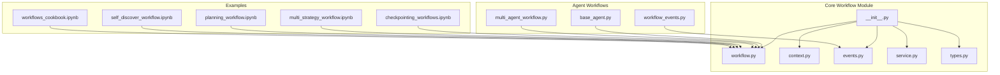
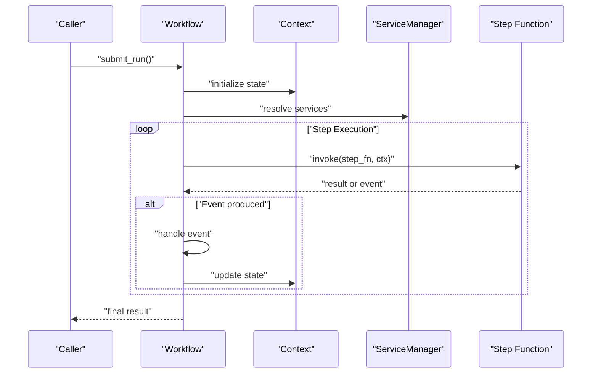
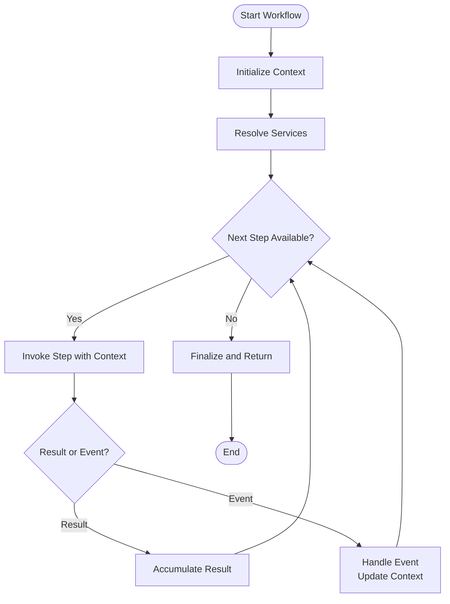
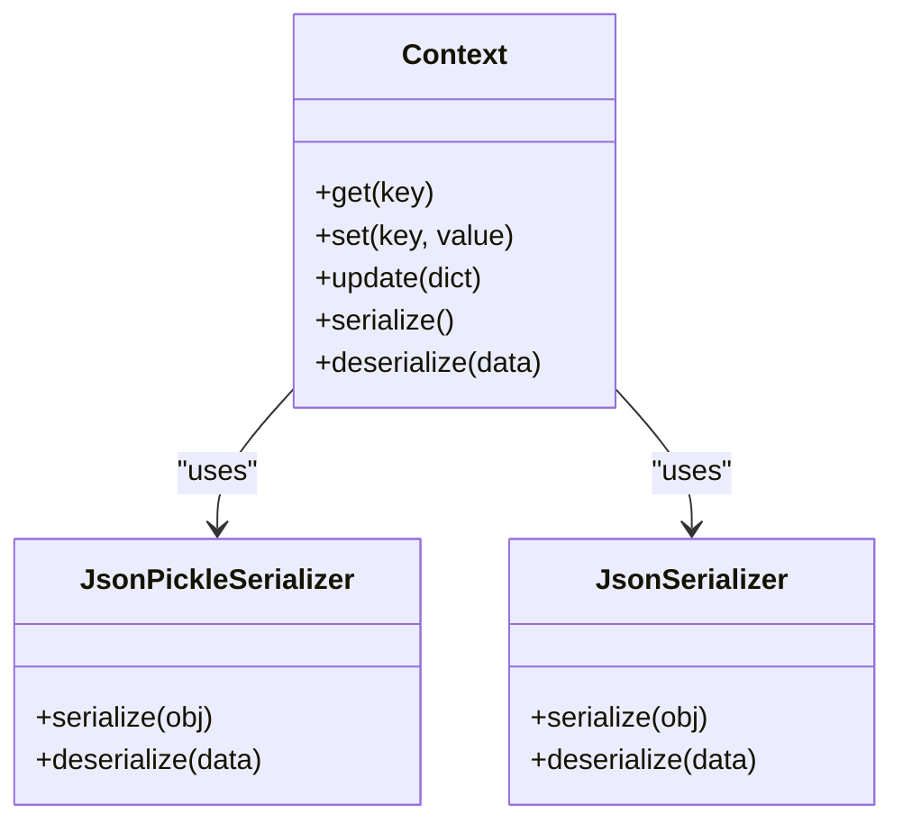
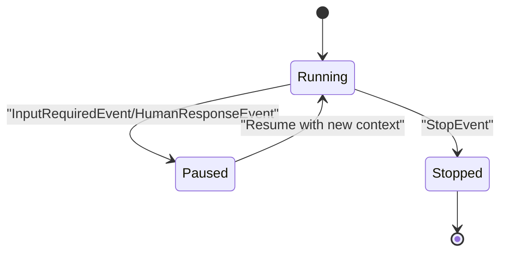
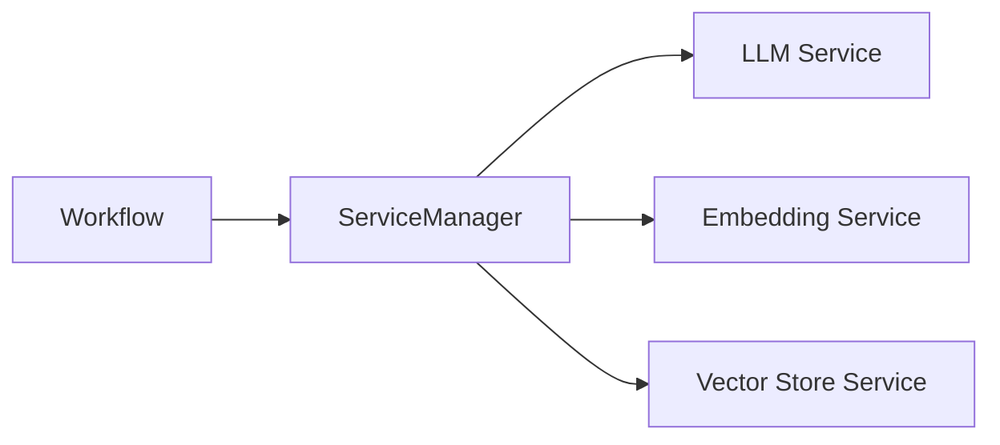
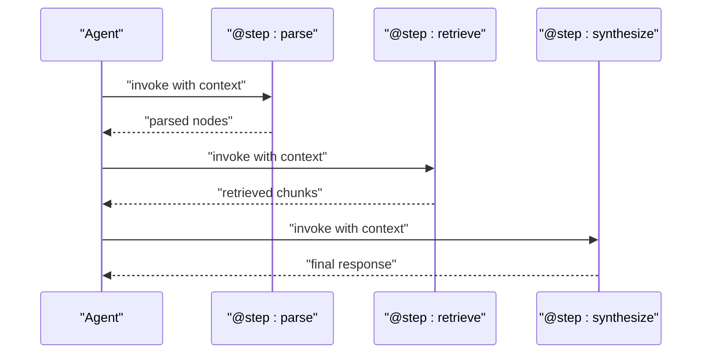
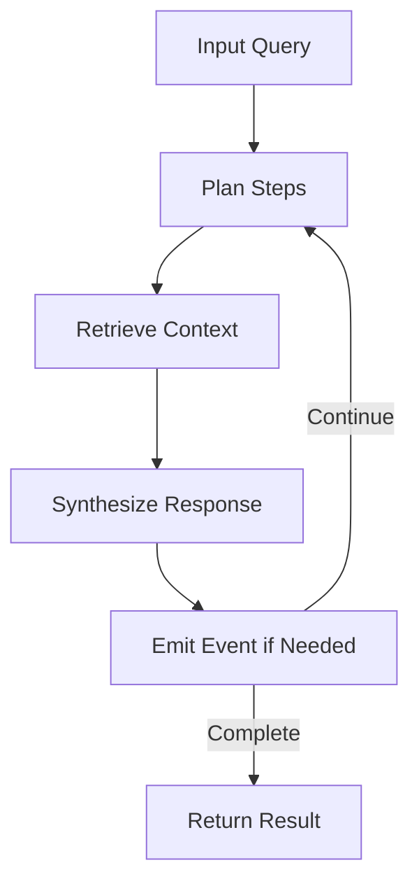

# Workflow Orchestration

<cite>
**Referenced Files in This Document**
- [workflow.py](file://llama-index-core/llama_index/core/workflow/workflow.py)
- [context.py](file://llama-index-core/llama_index/core/workflow/context.py)
- [events.py](file://llama-index-core/llama_index/core/workflow/events.py)
- [service.py](file://llama-index-core/llama_index/core/workflow/service.py)
- [types.py](file://llama-index-core/llama_index/core/workflow/types.py)
- [__init__.py](file://llama-index-core/llama_index/core/workflow/__init__.py)
- [base_agent.py](file://llama-index-core/llama_index/core/agent/workflow/base_agent.py)
- [multi_agent_workflow.py](file://llama-index-core/llama_index/core/agent/workflow/multi_agent_workflow.py)
- [workflow_events.py](file://llama-index-core/llama_index/core/agent/workflow/workflow_events.py)
- [checkpointing_workflows.ipynb](file://docs/examples/workflow/checkpointing_workflows.ipynb)
- [multi_strategy_workflow.ipynb](file://docs/examples/workflow/multi_strategy_workflow.ipynb)
- [planning_workflow.ipynb](file://docs/examples/workflow/planning_workflow.ipynb)
- [self_discover_workflow.ipynb](file://docs/examples/workflow/self_discover_workflow.ipynb)
- [workflows_cookbook.ipynb](file://docs/examples/workflow/workflows_cookbook.ipynb)
</cite>

## Table of Contents
1. [Introduction](#introduction)
2. [Project Structure](#project-structure)
3. [Core Components](#core-components)
4. [Architecture Overview](#architecture-overview)
5. [Detailed Component Analysis](#detailed-component-analysis)
6. [Dependency Analysis](#dependency-analysis)
7. [Performance Considerations](#performance-considerations)
8. [Troubleshooting Guide](#troubleshooting-guide)
9. [Conclusion](#conclusion)
10. [Appendices](#appendices)

## Introduction
This document explains workflow orchestration in LlamaIndex, focusing on the workflow engine architecture, state management, and event-driven processing patterns. It covers workflow definition via step decorators, execution contexts, resource allocation, composition, parallelism, error handling, persistence, monitoring, debugging, and integration with other LlamaIndex components and external systems. Practical examples are drawn from the repository’s workflow notebooks and agent workflow implementations.

## Project Structure
The workflow subsystem is primarily located under the core workflow module and agent workflow implementations. The public API is exposed via the workflow module’s init file. Agent workflows demonstrate advanced composition and multi-step orchestration.

**Diagram sources**
- [workflow.py](file://llama-index-core/llama_index/core/workflow/workflow.py#L1-L2)
- [context.py](file://llama-index-core/llama_index/core/workflow/context.py#L1-L2)
- [events.py](file://llama-index-core/llama_index/core/workflow/events.py#L1-L9)
- [service.py](file://llama-index-core/llama_index/core/workflow/service.py#L1-L2)
- [types.py](file://llama-index-core/llama_index/core/workflow/types.py#L1-L2)
- [__init__.py](file://llama-index-core/llama_index/core/workflow/__init__.py#L1-L23)
- [base_agent.py](file://llama-index-core/llama_index/core/agent/workflow/base_agent.py#L369-L645)
- [multi_agent_workflow.py](file://llama-index-core/llama_index/core/agent/workflow/multi_agent_workflow.py#L377-L664)
- [workflow_events.py](file://llama-index-core/llama_index/core/agent/workflow/workflow_events.py#L1-L200)
- [checkpointing_workflows.ipynb](file://docs/examples/workflow/checkpointing_workflows.ipynb)
- [multi_strategy_workflow.ipynb](file://docs/examples/workflow/multi_strategy_workflow.ipynb)
- [planning_workflow.ipynb](file://docs/examples/workflow/planning_workflow.ipynb)
- [self_discover_workflow.ipynb](file://docs/examples/workflow/self_discover_workflow.ipynb)
- [workflows_cookbook.ipynb](file://docs/examples/workflow/workflows_cookbook.ipynb)

**Section sources**
- [__init__.py](file://llama-index-core/llama_index/core/workflow/__init__.py#L1-L23)
- [workflow.py](file://llama-index-core/llama_index/core/workflow/workflow.py#L1-L2)
- [context.py](file://llama-index-core/llama_index/core/workflow/context.py#L1-L2)
- [events.py](file://llama-index-core/llama_index/core/workflow/events.py#L1-L9)
- [service.py](file://llama-index-core/llama_index/core/workflow/service.py#L1-L2)
- [types.py](file://llama-index-core/llama_index/core/workflow/types.py#L1-L2)

## Core Components
- Workflow engine: Central orchestrator exposing a step decorator and runtime execution model.
- Context: Encapsulates state and shared resources during workflow execution.
- Events: Typed event model supporting lifecycle and interactive events (start, stop, input required, human response).
- Service manager: Manages services and resources used by workflows.
- Types: Runtime type aliases for stop events and run results.
- Agent workflows: Multi-step, multi-agent compositions built on top of the workflow engine.

Key exports and capabilities are declared in the workflow module’s init file.

**Section sources**
- [__init__.py](file://llama-index-core/llama_index/core/workflow/__init__.py#L1-L23)
- [events.py](file://llama-index-core/llama_index/core/workflow/events.py#L1-L9)
- [service.py](file://llama-index-core/llama_index/core/workflow/service.py#L1-L2)
- [types.py](file://llama-index-core/llama_index/core/workflow/types.py#L1-L2)

## Architecture Overview
The workflow engine is designed around:
- Step-based composition: Steps are Python methods decorated with a step decorator.
- Event-driven execution: Workflows react to typed events and can pause/resume.
- Context propagation: Steps receive a shared Context object containing state and resources.
- Service integration: ServiceManager resolves and manages services used by steps.
- Persistence hooks: Examples demonstrate checkpointing and recovery patterns.

**Diagram sources**
- [workflow.py](file://llama-index-core/llama_index/core/workflow/workflow.py#L1-L2)
- [context.py](file://llama-index-core/llama_index/core/workflow/context.py#L1-L2)
- [service.py](file://llama-index-core/llama_index/core/workflow/service.py#L1-L2)
- [events.py](file://llama-index-core/llama_index/core/workflow/events.py#L1-L9)

## Detailed Component Analysis

### Workflow Engine and Step Decorator
- The workflow engine exposes a step decorator for annotating methods as workflow steps.
- Execution proceeds by invoking steps in order, passing a shared Context object.
- Steps can produce results or emit events to drive control flow.

**Diagram sources**
- [workflow.py](file://llama-index-core/llama_index/core/workflow/workflow.py#L1-L2)
- [context.py](file://llama-index-core/llama_index/core/workflow/context.py#L1-L2)
- [events.py](file://llama-index-core/llama_index/core/workflow/events.py#L1-L9)

**Section sources**
- [workflow.py](file://llama-index-core/llama_index/core/workflow/workflow.py#L1-L2)
- [context.py](file://llama-index-core/llama_index/core/workflow/context.py#L1-L2)
- [events.py](file://llama-index-core/llama_index/core/workflow/events.py#L1-L9)

### State Management and Context
- Context encapsulates mutable state and shared resources across steps.
- Serializers enable persistence and restoration of context for checkpointing and recovery.
- Context is passed into each step and can be updated to carry forward intermediate results.

**Diagram sources**
- [context.py](file://llama-index-core/llama_index/core/workflow/context.py#L1-L2)
- [__init__.py](file://llama-index-core/llama_index/core/workflow/__init__.py#L1-L23)

**Section sources**
- [context.py](file://llama-index-core/llama_index/core/workflow/context.py#L1-L2)
- [__init__.py](file://llama-index-core/llama_index/core/workflow/__init__.py#L1-L23)

### Event-Driven Processing Patterns
- Typed events model lifecycle and interactive signals (start, stop, input required, human response).
- Workflows can pause execution upon emitting events and resume later with updated context.
- Event handling enables branching and conditional logic based on runtime conditions.

**Diagram sources**
- [events.py](file://llama-index-core/llama_index/core/workflow/events.py#L1-L9)
- [workflow_events.py](file://llama-index-core/llama_index/core/agent/workflow/workflow_events.py#L1-L200)

**Section sources**
- [events.py](file://llama-index-core/llama_index/core/workflow/events.py#L1-L9)
- [workflow_events.py](file://llama-index-core/llama_index/core/agent/workflow/workflow_events.py#L1-L200)

### Resource Allocation and Service Management
- ServiceManager resolves and manages services used by steps.
- Services can be injected into steps via the workflow runtime, enabling decoupled resource access.

**Diagram sources**
- [service.py](file://llama-index-core/llama_index/core/workflow/service.py#L1-L2)

**Section sources**
- [service.py](file://llama-index-core/llama_index/core/workflow/service.py#L1-L2)

### Workflow Definition and Execution Contexts
- Steps are defined using the step decorator and executed within a shared Context.
- Agent workflows demonstrate multi-step, multi-agent orchestration patterns with explicit step boundaries.

**Diagram sources**
- [base_agent.py](file://llama-index-core/llama_index/core/agent/workflow/base_agent.py#L369-L645)
- [multi_agent_workflow.py](file://llama-index-core/llama_index/core/agent/workflow/multi_agent_workflow.py#L377-L664)

**Section sources**
- [base_agent.py](file://llama-index-core/llama_index/core/agent/workflow/base_agent.py#L369-L645)
- [multi_agent_workflow.py](file://llama-index-core/llama_index/core/agent/workflow/multi_agent_workflow.py#L377-L664)

### Composition, Parallel Execution, and Conditional Branching
- Composition is achieved by chaining steps; each step can depend on prior results stored in Context.
- Parallel execution can be modeled by invoking multiple steps concurrently within a single workflow tick or by composing multiple workflows.
- Conditional branching is supported via event handling and context updates to alter subsequent step selection.

[No sources needed since this section synthesizes patterns without analyzing specific files]

### Error Handling Strategies
- Validation errors occur during workflow definition or preconditions.
- Runtime errors occur during step execution; timeouts are supported as a distinct error type.
- Error handling should capture exceptions, update context with error state, and optionally emit events to trigger recovery steps.

**Section sources**
- [__init__.py](file://llama-index-core/llama_index/core/workflow/__init__.py#L1-L23)

### Practical Examples: Complex Multi-Step Processes
- Planning workflows: Multi-step planning with iterative refinement and synthesis.
- Self-discovery workflows: Adaptive planning and retrieval driven by contextual feedback.
- Multi-strategy workflows: Combining retrieval and generation strategies dynamically.
- Checkpointing workflows: Persistent state to resume interrupted executions.

**Diagram sources**
- [planning_workflow.ipynb](file://docs/examples/workflow/planning_workflow.ipynb)
- [self_discover_workflow.ipynb](file://docs/examples/workflow/self_discover_workflow.ipynb)
- [multi_strategy_workflow.ipynb](file://docs/examples/workflow/multi_strategy_workflow.ipynb)
- [checkpointing_workflows.ipynb](file://docs/examples/workflow/checkpointing_workflows.ipynb)

**Section sources**
- [planning_workflow.ipynb](file://docs/examples/workflow/planning_workflow.ipynb)
- [self_discover_workflow.ipynb](file://docs/examples/workflow/self_discover_workflow.ipynb)
- [multi_strategy_workflow.ipynb](file://docs/examples/workflow/multi_strategy_workflow.ipynb)
- [checkpointing_workflows.ipynb](file://docs/examples/workflow/checkpointing_workflows.ipynb)

### Workflow Monitoring and Debugging
- Monitor execution by observing emitted events and context state transitions.
- Use serializers to log and persist intermediate states for debugging.
- Instrumentation can be integrated via callback handlers and tracing mechanisms.

[No sources needed since this section provides general guidance]

### Integration Patterns with Other LlamaIndex Components
- Agents: Multi-agent workflows coordinate specialized agents using the workflow engine.
- Retrievers and LLMs: Services resolved by ServiceManager integrate with retrieval and generation steps.
- Storage: Context serialization integrates with storage backends for persistence.

**Section sources**
- [base_agent.py](file://llama-index-core/llama_index/core/agent/workflow/base_agent.py#L369-L645)
- [multi_agent_workflow.py](file://llama-index-core/llama_index/core/agent/workflow/multi_agent_workflow.py#L377-L664)
- [service.py](file://llama-index-core/llama_index/core/workflow/service.py#L1-L2)

## Dependency Analysis
The workflow module exposes a focused API surface, while agent workflows depend on the core workflow engine and event model.

```mermaid
graph TB
INIT["workflow/__init__.py"] --> WF["workflow.py"]
INIT --> CTX["context.py"]
INIT --> EVT["events.py"]
INIT --> SVC["service.py"]
INIT --> TYP["types.py"]
BASE["agent/workflow/base_agent.py"] --> WF
MULTI["agent/workflow/multi_agent_workflow.py"] --> WF
WEVT["agent/workflow/workflow_events.py"] --> EVT
CKPT["examples/workflow/checkpointing_workflows.ipynb"] --> WF
STRAT["examples/workflow/multi_strategy_workflow.ipynb"] --> WF
PLAN["examples/workflow/planning_workflow.ipynb"] --> WF
SELF["examples/workflow/self_discover_workflow.ipynb"] --> WF
COOK["examples/workflow/workflows_cookbook.ipynb"] --> WF
```

**Diagram sources**
- [__init__.py](file://llama-index-core/llama_index/core/workflow/__init__.py#L1-L23)
- [workflow.py](file://llama-index-core/llama_index/core/workflow/workflow.py#L1-L2)
- [context.py](file://llama-index-core/llama_index/core/workflow/context.py#L1-L2)
- [events.py](file://llama-index-core/llama_index/core/workflow/events.py#L1-L9)
- [service.py](file://llama-index-core/llama_index/core/workflow/service.py#L1-L2)
- [types.py](file://llama-index-core/llama_index/core/workflow/types.py#L1-L2)
- [base_agent.py](file://llama-index-core/llama_index/core/agent/workflow/base_agent.py#L369-L645)
- [multi_agent_workflow.py](file://llama-index-core/llama_index/core/agent/workflow/multi_agent_workflow.py#L377-L664)
- [workflow_events.py](file://llama-index-core/llama_index/core/agent/workflow/workflow_events.py#L1-L200)
- [checkpointing_workflows.ipynb](file://docs/examples/workflow/checkpointing_workflows.ipynb)
- [multi_strategy_workflow.ipynb](file://docs/examples/workflow/multi_strategy_workflow.ipynb)
- [planning_workflow.ipynb](file://docs/examples/workflow/planning_workflow.ipynb)
- [self_discover_workflow.ipynb](file://docs/examples/workflow/self_discover_workflow.ipynb)
- [workflows_cookbook.ipynb](file://docs/examples/workflow/workflows_cookbook.ipynb)

**Section sources**
- [__init__.py](file://llama-index-core/llama_index/core/workflow/__init__.py#L1-L23)

## Performance Considerations
- Minimize heavy computations inside steps; delegate to services where possible.
- Use context serialization judiciously; avoid storing large objects unless necessary.
- Prefer batching for retrievals and embeddings to reduce overhead.
- Tune retry policies and timeouts for robustness without sacrificing responsiveness.

[No sources needed since this section provides general guidance]

## Troubleshooting Guide
- Validation errors indicate invalid workflow definitions or missing preconditions.
- Runtime errors signal failures during step execution; inspect the last successful step and context state.
- Timeouts suggest long-running steps or blocking operations; consider asynchronous execution or service-side improvements.
- Use event logs and context snapshots to diagnose branching and conditional logic issues.

**Section sources**
- [__init__.py](file://llama-index-core/llama_index/core/workflow/__init__.py#L1-L23)

## Conclusion
LlamaIndex’s workflow orchestration centers on a step-based engine with strong event support, shared context, and service integration. Agent workflows showcase advanced composition and multi-step orchestration. The ecosystem includes practical examples for planning, self-discovery, multi-strategy execution, and checkpointing. By leveraging events, context serialization, and service management, developers can build resilient, observable, and scalable workflows integrated with LlamaIndex components and external systems.

## Appendices
- Example notebooks provide concrete patterns for planning, self-discovery, multi-strategy workflows, and checkpointing.
- Agent workflow implementations demonstrate multi-step, multi-agent orchestration using the step decorator.

**Section sources**
- [checkpointing_workflows.ipynb](file://docs/examples/workflow/checkpointing_workflows.ipynb)
- [multi_strategy_workflow.ipynb](file://docs/examples/workflow/multi_strategy_workflow.ipynb)
- [planning_workflow.ipynb](file://docs/examples/workflow/planning_workflow.ipynb)
- [self_discover_workflow.ipynb](file://docs/examples/workflow/self_discover_workflow.ipynb)
- [workflows_cookbook.ipynb](file://docs/examples/workflow/workflows_cookbook.ipynb)
- [base_agent.py](file://llama-index-core/llama_index/core/agent/workflow/base_agent.py#L369-L645)
- [multi_agent_workflow.py](file://llama-index-core/llama_index/core/agent/workflow/multi_agent_workflow.py#L377-L664)