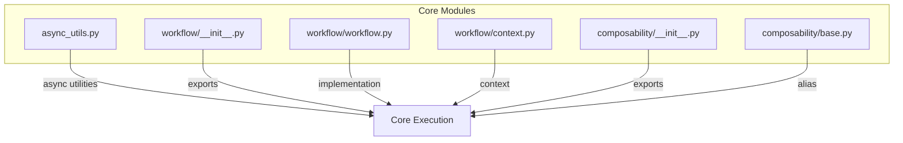
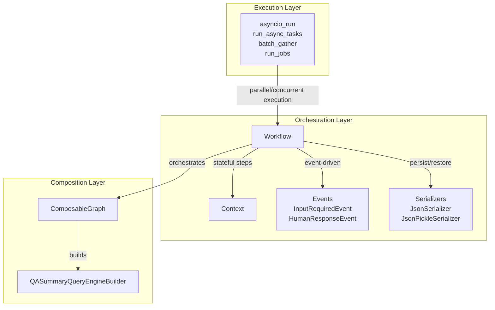
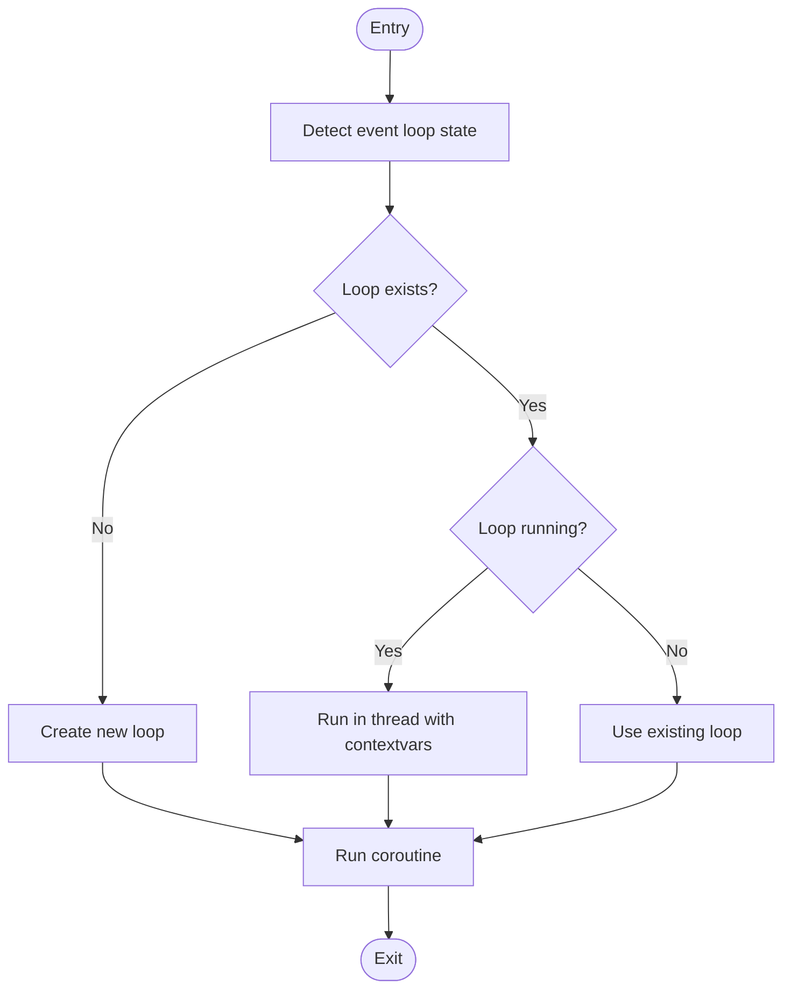
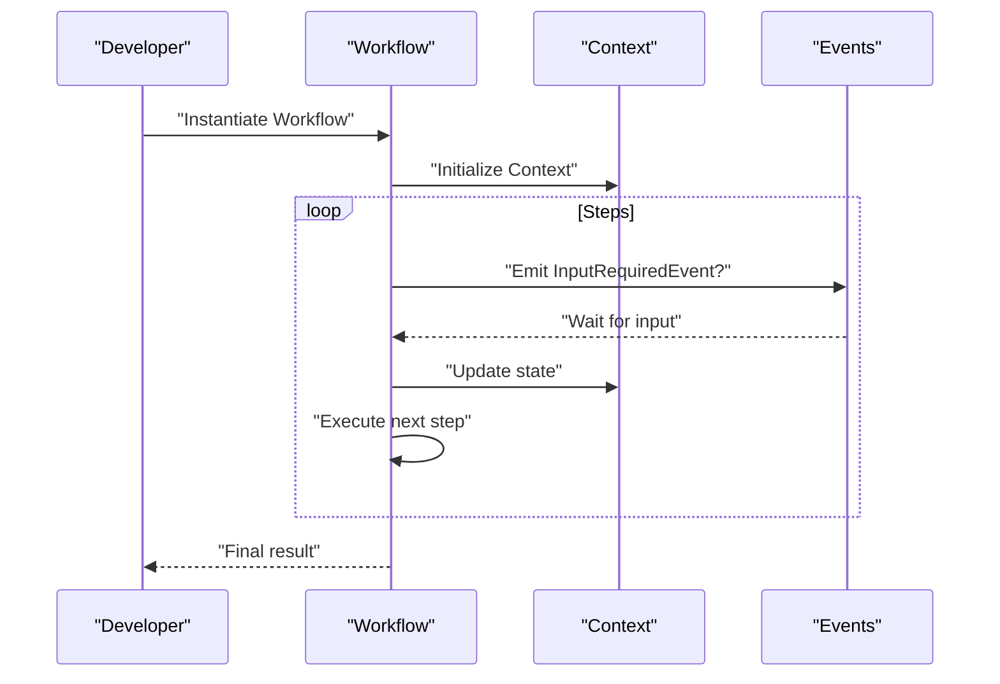
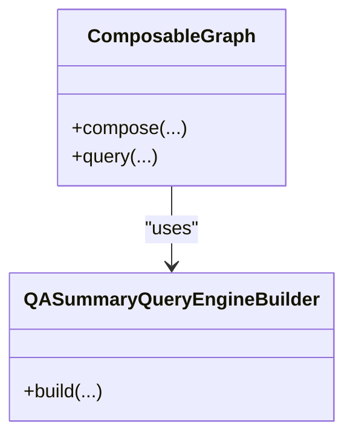
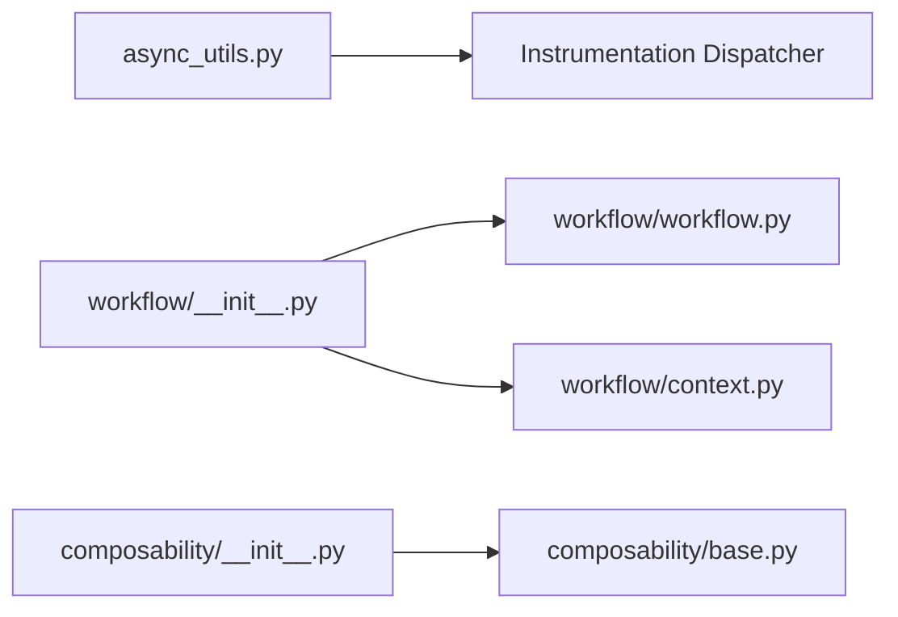

# Advanced Topics

<cite>
**Referenced Files in This Document**
- [async_utils.py](file://llama-index-core/llama_index/core/async_utils.py)
- [__init__.py (composability)](file://llama-index-core/llama_index/core/composability/__init__.py)
- [base.py (composability)](file://llama-index-core/llama_index/core/composability/base.py)
- [__init__.py (workflow)](file://llama-index-core/llama_index/core/workflow/__init__.py)
- [workflow.py (workflow)](file://llama-index-core/llama_index/core/workflow/workflow.py)
- [context.py (workflow)](file://llama-index-core/llama_index/core/workflow/context.py)
- [service_context.py](file://llama-index-core/llama_index/core/service_context.py)
- [test_async_utils.py](file://llama-index-core/tests/test_async_utils.py)
</cite>

## Table of Contents
1. [Introduction](#introduction)
2. [Project Structure](#project-structure)
3. [Core Components](#core-components)
4. [Architecture Overview](#architecture-overview)
5. [Detailed Component Analysis](#detailed-component-analysis)
6. [Dependency Analysis](#dependency-analysis)
7. [Performance Considerations](#performance-considerations)
8. [Troubleshooting Guide](#troubleshooting-guide)
9. [Conclusion](#conclusion)
10. [Appendices](#appendices)

## Introduction
This document presents advanced topics for LlamaIndex, focusing on sophisticated implementation patterns, performance optimization techniques, production deployment considerations, and custom component development. It synthesizes the repository’s core modules for asynchronous processing, workflow orchestration, composability, and instrumentation to guide experienced developers building scalable, maintainable RAG systems. The content emphasizes:
- Asynchronous processing patterns via async_utils
- Workflow orchestration using the workflow module
- Composability for modular, reusable graph/query engines
- Performance optimization strategies and scaling considerations
- Production hardening through observability and error handling

## Project Structure
At a high level, the advanced topics revolve around three pillars:
- Asynchronous execution and batching utilities
- Workflow orchestration primitives
- Composable graph/query engine builders

**Diagram sources**
- [async_utils.py](file://llama-index-core/llama_index/core/async_utils.py#L1-L175)
- [__init__.py (workflow)](file://llama-index-core/llama_index/core/workflow/__init__.py#L1-L23)
- [workflow.py (workflow)](file://llama-index-core/llama_index/core/workflow/workflow.py#L1-L2)
- [context.py (workflow)](file://llama-index-core/llama_index/core/workflow/context.py#L1-L2)
- [__init__.py (composability)](file://llama-index-core/llama_index/core/composability/__init__.py#L1-L9)
- [base.py (composability)](file://llama-index-core/llama_index/core/composability/base.py#L1-L5)

**Section sources**
- [async_utils.py](file://llama-index-core/llama_index/core/async_utils.py#L1-L175)
- [__init__.py (workflow)](file://llama-index-core/llama_index/core/workflow/__init__.py#L1-L23)
- [workflow.py (workflow)](file://llama-index-core/llama_index/core/workflow/workflow.py#L1-L2)
- [context.py (workflow)](file://llama-index-core/llama_index/core/workflow/context.py#L1-L2)
- [__init__.py (composability)](file://llama-index-core/llama_index/core/composability/__init__.py#L1-L9)
- [base.py (composability)](file://llama-index-core/llama_index/core/composability/base.py#L1-L5)

## Core Components
- async_utils: Provides robust async execution helpers, including event-loop-aware runners, progress-enabled gather, chunked batching, and worker-limited concurrency via semaphores.
- workflow: Exposes orchestration primitives (Workflow, Context, decorators, events, serializers) for building stepwise, stateful pipelines.
- composability: Offers composable graph/query engine builders enabling modular, reusable RAG architectures.

Key responsibilities:
- async_utils: Centralizes async execution patterns to avoid nested loop errors, support Jupyter environments, and scale concurrency safely.
- workflow: Encapsulates state transitions, human-in-the-loop events, serialization, and runtime validation.
- composability: Enables building modular query engines from smaller components and composing them into larger graphs.

**Section sources**
- [async_utils.py](file://llama-index-core/llama_index/core/async_utils.py#L1-L175)
- [__init__.py (workflow)](file://llama-index-core/llama_index/core/workflow/__init__.py#L1-L23)
- [__init__.py (composability)](file://llama-index-core/llama_index/core/composability/__init__.py#L1-L9)

## Architecture Overview
The advanced architecture integrates asynchronous execution, workflow orchestration, and composability to deliver scalable RAG pipelines.

**Diagram sources**
- [async_utils.py](file://llama-index-core/llama_index/core/async_utils.py#L25-L175)
- [__init__.py (workflow)](file://llama-index-core/llama_index/core/workflow/__init__.py#L1-L23)
- [__init__.py (composability)](file://llama-index-core/llama_index/core/composability/__init__.py#L1-L9)

## Detailed Component Analysis

### Asynchronous Processing Patterns (async_utils)
This module centralizes advanced async execution patterns:
- Event-loop-aware runner: Handles nested loops, running loops, and thread contexts gracefully.
- Progress-enabled gather: Integrates with tqdm for Jupyter-friendly progress bars.
- Chunked batching: Executes tasks in batches to limit concurrency and reduce resource spikes.
- Worker-limited concurrency: Uses semaphores to cap parallelism and prevent overload.

**Diagram sources**
- [async_utils.py](file://llama-index-core/llama_index/core/async_utils.py#L25-L66)

Implementation highlights:
- Nested loop safety and thread-based fallback ensure compatibility across environments.
- Progress-enabled gather supports notebook environments with minimal disruption.
- Batched execution and worker-limited concurrency enable controlled scaling.

Practical guidance:
- Prefer run_jobs for bounded concurrency across heterogeneous workloads.
- Use run_async_tasks for straightforward gather semantics with optional progress.
- Apply batch_gather for memory-bound or rate-limited scenarios.

**Section sources**
- [async_utils.py](file://llama-index-core/llama_index/core/async_utils.py#L1-L175)
- [test_async_utils.py](file://llama-index-core/tests/test_async_utils.py#L1-L200)

### Workflow Orchestration
The workflow module exposes primitives for building stepwise, stateful pipelines:
- Workflow: Orchestrates steps with explicit state transitions and error handling.
- Context: Holds shared state across steps and serializes/deserializes it.
- Events: Supports input requests and human-in-the-loop responses.
- Serializers: Provide JSON and JSON+pickle serialization strategies.

**Diagram sources**
- [__init__.py (workflow)](file://llama-index-core/llama_index/core/workflow/__init__.py#L1-L23)
- [workflow.py (workflow)](file://llama-index-core/llama_index/core/workflow/workflow.py#L1-L2)
- [context.py (workflow)](file://llama-index-core/llama_index/core/workflow/context.py#L1-L2)

Operational notes:
- Use decorators to define steps and manage state transitions.
- Employ serializers to persist intermediate results and recover from failures.
- Leverage event types to integrate human feedback or external triggers.

**Section sources**
- [__init__.py (workflow)](file://llama-index-core/llama_index/core/workflow/__init__.py#L1-L23)
- [workflow.py (workflow)](file://llama-index-core/llama_index/core/workflow/workflow.py#L1-L2)
- [context.py (workflow)](file://llama-index-core/llama_index/core/workflow/context.py#L1-L2)

### Composability
Composability enables building modular query engines from smaller components:
- ComposableGraph: Provides a unified interface for composing indices and query engines.
- QASummaryQueryEngineBuilder: Constructs QA and summary engines from component parts.

**Diagram sources**
- [__init__.py (composability)](file://llama-index-core/llama_index/core/composability/__init__.py#L1-L9)
- [base.py (composability)](file://llama-index-core/llama_index/core/composability/base.py#L1-L5)

Production tips:
- Favor small, focused components and compose them into larger graphs.
- Keep interfaces stable to maximize long-term composability.
- Use builder patterns to encapsulate complex initialization logic.

**Section sources**
- [__init__.py (composability)](file://llama-index-core/llama_index/core/composability/__init__.py#L1-L9)
- [base.py (composability)](file://llama-index-core/llama_index/core/composability/base.py#L1-L5)

## Dependency Analysis
The advanced modules exhibit clean separation of concerns with minimal coupling:
- async_utils depends on instrumentation dispatchers for tracing spans.
- workflow exports a cohesive API surface while delegating implementation elsewhere.
- composability re-exports core building blocks for easy consumption.

**Diagram sources**
- [async_utils.py](file://llama-index-core/llama_index/core/async_utils.py#L1-L12)
- [__init__.py (workflow)](file://llama-index-core/llama_index/core/workflow/__init__.py#L1-L23)
- [workflow.py (workflow)](file://llama-index-core/llama_index/core/workflow/workflow.py#L1-L2)
- [context.py (workflow)](file://llama-index-core/llama_index/core/workflow/context.py#L1-L2)
- [__init__.py (composability)](file://llama-index-core/llama_index/core/composability/__init__.py#L1-L9)
- [base.py (composability)](file://llama-index-core/llama_index/core/composability/base.py#L1-L5)

**Section sources**
- [async_utils.py](file://llama-index-core/llama_index/core/async_utils.py#L1-L12)
- [__init__.py (workflow)](file://llama-index-core/llama_index/core/workflow/__init__.py#L1-L23)
- [workflow.py (workflow)](file://llama-index-core/llama_index/core/workflow/workflow.py#L1-L2)
- [context.py (workflow)](file://llama-index-core/llama_index/core/workflow/context.py#L1-L2)
- [__init__.py (composability)](file://llama-index-core/llama_index/core/composability/__init__.py#L1-L9)
- [base.py (composability)](file://llama-index-core/llama_index/core/composability/base.py#L1-L5)

## Performance Considerations
- Concurrency control: Use worker-limited concurrency to avoid saturating downstream resources.
- Batching: Apply chunked execution to smooth resource utilization and reduce overhead.
- Progress monitoring: Enable progress bars in interactive environments to track throughput.
- Event loop hygiene: Avoid nested loops; prefer async entry points and thread-based fallbacks when necessary.
- Serialization overhead: Choose appropriate serializers for large state payloads; JSON is lightweight, JSON+pickle adds flexibility at cost.

[No sources needed since this section provides general guidance]

## Troubleshooting Guide
Common issues and remedies:
- Nested async detected: Apply nested loop support or switch to async entry methods.
- Jupyter progress not rendering: Fallback to non-progress gather when tqdm integration fails.
- Resource exhaustion: Reduce worker count or introduce backpressure via batching.
- Workflow timeouts/validation errors: Tune timeouts and validate inputs before execution.

**Section sources**
- [async_utils.py](file://llama-index-core/llama_index/core/async_utils.py#L57-L66)
- [async_utils.py](file://llama-index-core/llama_index/core/async_utils.py#L88-L94)
- [__init__.py (workflow)](file://llama-index-core/llama_index/core/workflow/__init__.py#L4-L6)

## Conclusion
By combining robust asynchronous execution, workflow orchestration, and composability, LlamaIndex enables advanced, production-grade RAG systems. The patterns documented here—bounded concurrency, chunked execution, event-driven workflows, and modular composition—provide a blueprint for scalable deployments. Instrumentation and error handling further harden these systems for real-world use.

[No sources needed since this section summarizes without analyzing specific files]

## Appendices
- Migration note: ServiceContext is deprecated; migrate to Settings or local module injection.
- Testing: Validate async patterns under various loop conditions and monitor throughput with progress-enabled gather.

**Section sources**
- [service_context.py](file://llama-index-core/llama_index/core/service_context.py#L1-L49)