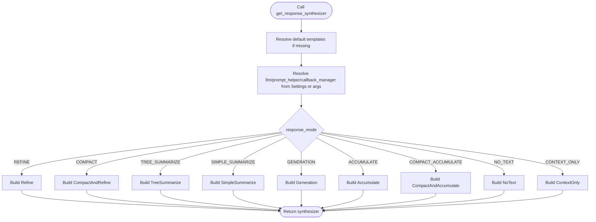

# Component Integration

<cite>
**Referenced Files in This Document**
- [settings.py](file://llama-index-core/llama_index/core/settings.py)
- [service_context.py](file://llama-index-core/llama_index/core/service_context.py)
- [__init__.py](file://llama-index-core/llama_index/core/__init__.py)
- [factory.py](file://llama-index-core/llama_index/core/response_synthesizers/factory.py)
- [__init__.py](file://llama-index-core/llama_index/core/selectors/__init__.py)
- [base_selector.py](file://llama-index-core/llama_index/core/base/base_selector.py)
- [__init__.py](file://llama-index-core/llama_index/core/retrievers/__init__.py)
- [composability/__init__.py](file://llama-index-core/llama_index/core/composability/__init__.py)
</cite>

## Table of Contents
1. [Introduction](#introduction)
2. [Project Structure](#project-structure)
3. [Core Components](#core-components)
4. [Architecture Overview](#architecture-overview)
5. [Detailed Component Analysis](#detailed-component-analysis)
6. [Dependency Analysis](#dependency-analysis)
7. [Performance Considerations](#performance-considerations)
8. [Troubleshooting Guide](#troubleshooting-guide)
9. [Conclusion](#conclusion)
10. [Appendices](#appendices)

## Introduction
This document explains how to integrate custom components into LlamaIndex systems. It focuses on the plugin architecture, factory patterns, and dependency injection mechanisms centered around the global Settings registry. It covers component registration, configuration management, service context integration, selector patterns, auto-retriever functionality, and dynamic component loading. It also provides guidance on component composition, lifecycle management, testing integration patterns, version compatibility, backward compatibility, and migration strategies.

## Project Structure
LlamaIndex organizes component integration around a small set of core modules:
- Global configuration via Settings singleton
- Factory functions for constructing runtime components
- Selector abstractions for dynamic choice-making
- Retriever exports for routing and retrieval strategies
- Composability primitives for building higher-level engines

**Diagram sources**
- [settings.py](file://llama-index-core/llama_index/core/settings.py#L17-L249)
- [factory.py](file://llama-index-core/llama_index/core/response_synthesizers/factory.py#L33-L152)
- [__init__.py](file://llama-index-core/llama_index/core/selectors/__init__.py#L1-L30)
- [__init__.py](file://llama-index-core/llama_index/core/retrievers/__init__.py#L1-L89)
- [composability/__init__.py](file://llama-index-core/llama_index/core/composability/__init__.py#L1-L9)

**Section sources**
- [__init__.py](file://llama-index-core/llama_index/core/__init__.py#L1-L162)

## Core Components
- Settings: A lazy-initialized global registry that resolves and injects LLMs, embeddings, tokenizers, node parsers, prompt helpers, and callback managers. It centralizes configuration and enables dependency injection across modules.
- Response Synthesizer Factory: A factory that constructs synthesizers based on configuration and response modes, honoring Settings defaults when not overridden.
- Selectors: A selector abstraction with typed selection results, enabling dynamic selection of choices based on queries.
- Retrievers: A comprehensive API surface exposing built-in retrievers and auto-retrievers, supporting router and fusion patterns.
- Composable Graph: A composable engine builder that orchestrates retrievers and synthesizers into end-to-end query pipelines.

Key integration points:
- Register custom components by setting properties on Settings (e.g., llm, embed_model, node_parser).
- Override defaults in factories and engines by passing explicit arguments.
- Use selector classes to dynamically choose among alternatives.
- Compose retrievers and synthesizers into a pipeline via ComposableGraph.

**Section sources**
- [settings.py](file://llama-index-core/llama_index/core/settings.py#L17-L249)
- [factory.py](file://llama-index-core/llama_index/core/response_synthesizers/factory.py#L33-L152)
- [__init__.py](file://llama-index-core/llama_index/core/selectors/__init__.py#L1-L30)
- [base_selector.py](file://llama-index-core/llama_index/core/base/base_selector.py#L72-L104)
- [__init__.py](file://llama-index-core/llama_index/core/retrievers/__init__.py#L1-L89)
- [composability/__init__.py](file://llama-index-core/llama_index/core/composability/__init__.py#L1-L9)

## Architecture Overview
The integration architecture relies on a layered approach:
- Global Settings provides defaults and lazy resolution for core services.
- Factories and engines consume Settings or explicit overrides to construct runtime components.
- Selectors encapsulate decision logic for choosing among alternatives.
- Retrievers expose both manual and automatic retrieval strategies.
- Composable Graph wires retrievers and synthesizers into cohesive pipelines.

**Diagram sources**
- [settings.py](file://llama-index-core/llama_index/core/settings.py#L32-L47)
- [factory.py](file://llama-index-core/llama_index/core/response_synthesizers/factory.py#L33-L65)

## Detailed Component Analysis

### Settings Registry and Dependency Injection
Settings acts as the central dependency injection container:
- Lazy resolution: Properties like llm, embed_model, node_parser defer creation until accessed.
- Callback propagation: When a callback manager is set, it is propagated to LLM and embedding instances.
- Convenience aliases: text_splitter maps to node_parser; chunk_size/chunk_overlap propagate to node parser attributes when available.
- Transformations: Defaults to a list containing node_parser.

Integration pattern:
- Set global defaults once during application startup.
- Override per-call by passing explicit arguments to factories and engines.
- Use Settings for consistent behavior across modules.

**Diagram sources**
- [settings.py](file://llama-index-core/llama_index/core/settings.py#L17-L249)

**Section sources**
- [settings.py](file://llama-index-core/llama_index/core/settings.py#L17-L249)

### Response Synthesizer Factory and Dynamic Component Loading
The factory constructs synthesizers based on response_mode and templates, with fallbacks to Settings defaults:
- Templates: Uses default selectors/prompts when not provided.
- Dependencies: Resolves llm, callback_manager, and prompt_helper from Settings if not supplied.
- Modes: Supports REFINE, COMPACT, TREE_SUMMARIZE, SIMPLE_SUMMARIZE, GENERATION, ACCUMULATE, COMPACT_ACCUMULATE, NO_TEXT, CONTEXT_ONLY.

Integration pattern:
- Pass response_mode and optional templates to the factory.
- Override Settings defaults per call by passing explicit parameters.
- Stream and async toggles enable performance tuning.

**Diagram sources**
- [factory.py](file://llama-index-core/llama_index/core/response_synthesizers/factory.py#L33-L152)

**Section sources**
- [factory.py](file://llama-index-core/llama_index/core/response_synthesizers/factory.py#L33-L152)

### Selector Patterns and Dynamic Choice-Making
Selectors define a uniform interface for dynamic selection:
- BaseSelector exposes select and aselect methods, wrapping inputs into QueryBundle and ToolMetadata.
- Results are typed: SingleSelection and MultiSelection capture indices and reasons.
- Concrete selectors include LLM-based, embedding-based, and Pydantic-based variants.

Integration pattern:
- Provide a list of choices with metadata and a query.
- Use LLMSingleSelector/LLMMultiSelector for LLM-driven decisions.
- Use EmbeddingSingleSelector for embedding similarity.
- Use PydanticSingleSelector/PydanticMultiSelector for structured selection.

**Diagram sources**
- [base_selector.py](file://llama-index-core/llama_index/core/base/base_selector.py#L13-L104)
- [__init__.py](file://llama-index-core/llama_index/core/selectors/__init__.py#L1-L30)

**Section sources**
- [base_selector.py](file://llama-index-core/llama_index/core/base/base_selector.py#L72-L104)
- [__init__.py](file://llama-index-core/llama_index/core/selectors/__init__.py#L1-L30)

### Auto-Retriever Functionality and Dynamic Loading
Retrievers export a broad API surface, including:
- VectorIndexAutoRetriever for automatic routing strategies.
- RouterRetriever for multi-retriever orchestration.
- QueryFusionRetriever for fusion-based retrieval.
- RecursiveRetriever for hierarchical retrieval.
- Property graph and SQL retrievers for specialized domains.

Integration pattern:
- Use VectorIndexAutoRetriever to automatically select the best retrieval strategy.
- Compose multiple retrievers with RouterRetriever or QueryFusionRetriever.
- Provide custom retrievers by implementing BaseRetriever and registering them in your application.

**Diagram sources**
- [__init__.py](file://llama-index-core/llama_index/core/retrievers/__init__.py#L1-L89)

**Section sources**
- [__init__.py](file://llama-index-core/llama_index/core/retrievers/__init__.py#L1-L89)

### Component Composition and Lifecycle Management
Composable Graph enables building higher-level engines:
- ComposableGraph and QASummaryQueryEngineBuilder demonstrate composition of retrievers and synthesizers.
- Lifecycle: configure Settings, build retrievers and synthesizers, then assemble into a pipeline.

Integration pattern:
- Build individual components with Settings defaults or overrides.
- Compose via ComposableGraph to create a unified query engine.
- Manage lifecycle by configuring Settings early and reusing components across requests.

**Diagram sources**
- [composability/__init__.py](file://llama-index-core/llama_index/core/composability/__init__.py#L1-L9)
- [settings.py](file://llama-index-core/llama_index/core/settings.py#L17-L249)

**Section sources**
- [composability/__init__.py](file://llama-index-core/llama_index/core/composability/__init__.py#L1-L9)

## Dependency Analysis
- Settings depends on LLM, BaseEmbedding, NodeParser, CallbackManager, and PromptHelper. It lazily resolves and propagates dependencies.
- Response Synthesizer Factory depends on Settings for defaults and on explicit arguments for overrides.
- Selectors depend on prompt mixins and instrumentation mixins but are decoupled from concrete LLMs; they rely on provided templates and logic.
- Retrievers depend on index-specific stores and embeddings; auto-retrievers add a layer of dynamic routing.
- Composable Graph depends on retrievers and synthesizers to form pipelines.

**Diagram sources**
- [settings.py](file://llama-index-core/llama_index/core/settings.py#L17-L249)
- [factory.py](file://llama-index-core/llama_index/core/response_synthesizers/factory.py#L33-L152)
- [base_selector.py](file://llama-index-core/llama_index/core/base/base_selector.py#L72-L104)
- [__init__.py](file://llama-index-core/llama_index/core/retrievers/__init__.py#L1-L89)
- [composability/__init__.py](file://llama-index-core/llama_index/core/composability/__init__.py#L1-L9)

**Section sources**
- [settings.py](file://llama-index-core/llama_index/core/settings.py#L17-L249)
- [factory.py](file://llama-index-core/llama_index/core/response_synthesizers/factory.py#L33-L152)
- [base_selector.py](file://llama-index-core/llama_index/core/base/base_selector.py#L72-L104)
- [__init__.py](file://llama-index-core/llama_index/core/retrievers/__init__.py#L1-L89)
- [composability/__init__.py](file://llama-index-core/llama_index/core/composability/__init__.py#L1-L9)

## Performance Considerations
- Prefer lazy initialization via Settings to avoid unnecessary allocations.
- Reuse callback managers and tokenizers across components to minimize overhead.
- Tune chunk_size and chunk_overlap via Settings.node_parser to balance recall and performance.
- Use streaming and async modes in factories to improve latency under load.
- Choose appropriate response modes; compact modes reduce context size, while tree summarize modes scale to long documents.

## Troubleshooting Guide
- ServiceContext deprecation: The legacy ServiceContext is deprecated. Migrate to Settings and pass modules directly to functions or use Settings for global defaults.
- Migration path: Replace ServiceContext usage with Settings and explicit module arguments. See the deprecation messages for guidance.
- Selector errors: Ensure choices are provided as strings or ToolMetadata and queries as strings or QueryBundle; the base selector wraps inputs accordingly.
- Retrieval failures: Verify retriever configuration matches index type and embedding model; auto-retrievers require proper index setup.

**Section sources**
- [service_context.py](file://llama-index-core/llama_index/core/service_context.py#L1-L49)
- [base_selector.py](file://llama-index-core/llama_index/core/base/base_selector.py#L54-L70)

## Conclusion
LlamaIndex’s component integration hinges on a clean separation of concerns:
- Settings provides a centralized, lazy registry for core services.
- Factories and engines consume Settings defaults while allowing per-call overrides.
- Selectors encapsulate dynamic decision-making with typed results.
- Retrievers expose flexible routing and fusion strategies, including auto-retrievers.
- Composable Graph unifies components into coherent pipelines.

Adopting these patterns ensures maintainable, testable, and extensible integrations.

## Appendices

### Version Compatibility and Backward Compatibility
- ServiceContext is deprecated; migrate to Settings and explicit module arguments.
- Legacy names and APIs are maintained via __all__ exports and compatibility shims in top-level init.
- Keep Settings defaults minimal and override per-call to preserve backward compatibility.

**Section sources**
- [service_context.py](file://llama-index-core/llama_index/core/service_context.py#L1-L49)
- [__init__.py](file://llama-index-core/llama_index/core/__init__.py#L72-L78)

### Migration Strategies for Custom Components
- Replace ServiceContext usage with Settings and pass modules directly to functions.
- Register custom components by setting properties on Settings (e.g., llm, embed_model, node_parser).
- Override Settings defaults per call by passing explicit arguments to factories and engines.
- Use selector classes to encapsulate custom decision logic and reuse across pipelines.
- Compose retrievers and synthesizers via ComposableGraph to integrate custom components into end-to-end engines.

**Section sources**
- [settings.py](file://llama-index-core/llama_index/core/settings.py#L17-L249)
- [factory.py](file://llama-index-core/llama_index/core/response_synthesizers/factory.py#L33-L152)
- [base_selector.py](file://llama-index-core/llama_index/core/base/base_selector.py#L72-L104)
- [composability/__init__.py](file://llama-index-core/llama_index/core/composability/__init__.py#L1-L9)