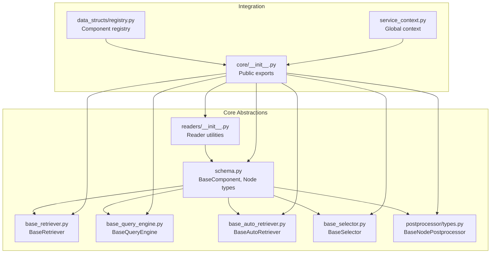
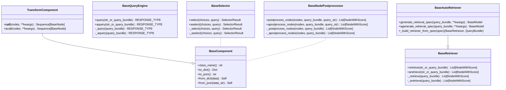
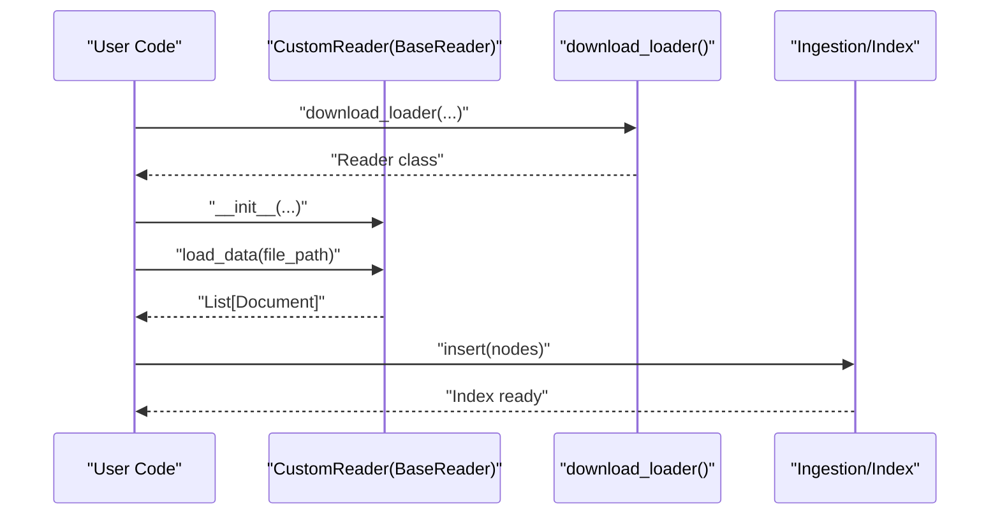
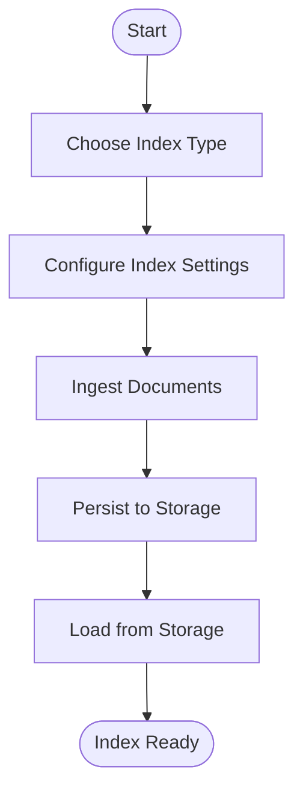
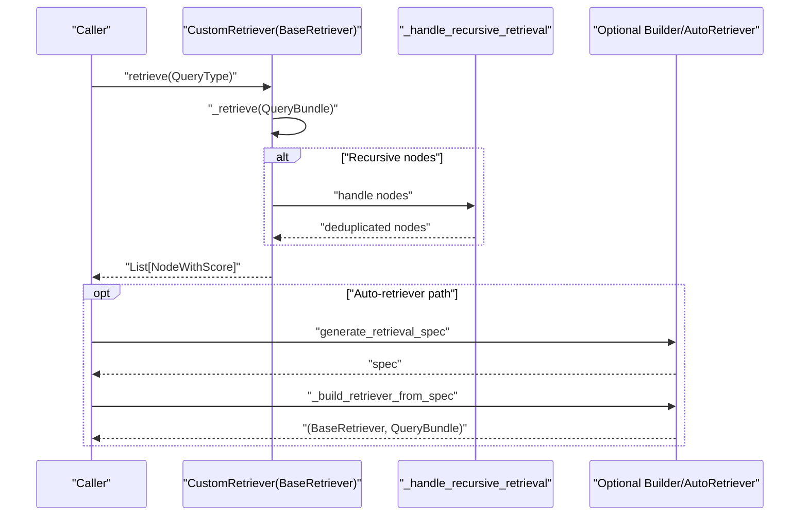
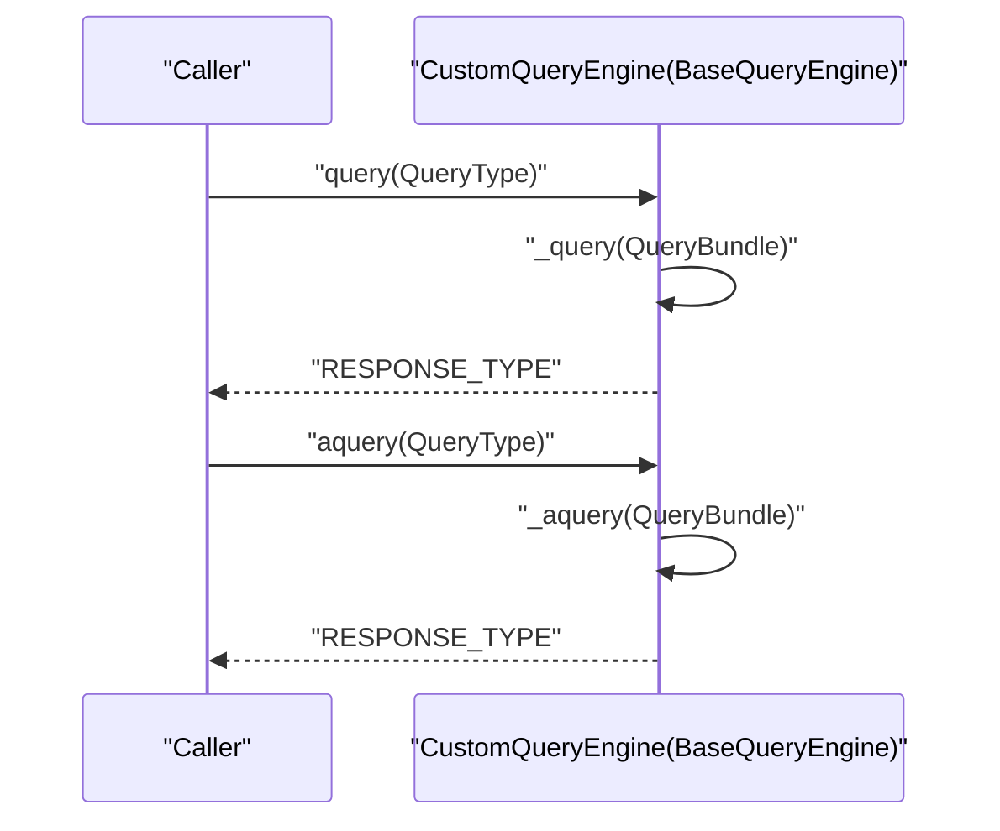
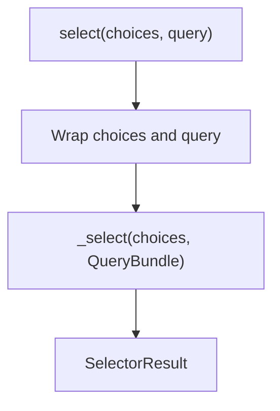
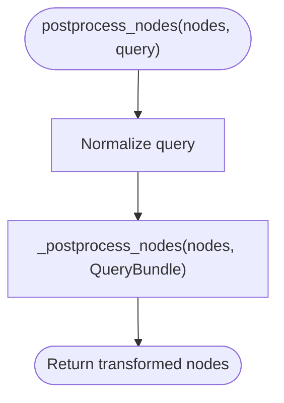
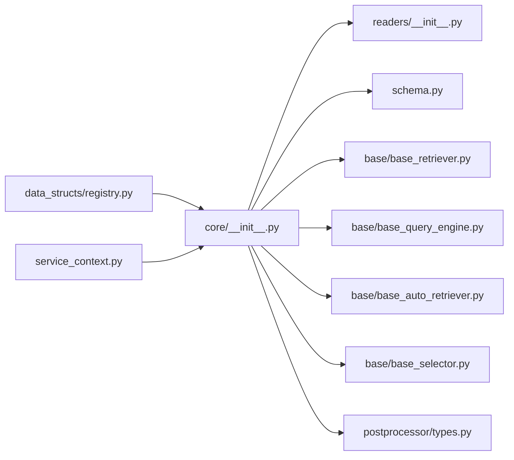

# Custom Component Development

<cite>
**Referenced Files in This Document**
- [llama_index/core/__init__.py](file://llama-index-core/llama_index/core/__init__.py)
- [llama_index/core/base/base_retriever.py](file://llama-index-core/llama_index/core/base/base_retriever.py)
- [llama_index/core/base/base_query_engine.py](file://llama-index-core/llama_index/core/base/base_query_engine.py)
- [llama_index/core/base/base_auto_retriever.py](file://llama-index-core/llama_index/core/base/base_auto_retriever.py)
- [llama_index/core/base/base_selector.py](file://llama-index-core/llama_index/core/base/base_selector.py)
- [llama_index/core/schema.py](file://llama-index-core/llama_index/core/schema.py)
- [llama_index/core/readers/__init__.py](file://llama-index-core/llama_index/core/readers/__init__.py)
- [llama_index/core/postprocessor/types.py](file://llama-index-core/llama_index/core/postprocessor/types.py)
- [llama_index/core/data_structs/registry.py](file://llama-index-core/llama_index/core/data_structs/registry.py)
- [llama_index/core/service_context.py](file://llama-index-core/llama_index/core/service_context.py)
- [llama-index-core/llama_index/core/__init__.py](file://llama-index-core/llama_index/core/__init__.py)
</cite>

## Table of Contents
1. [Introduction](#introduction)
2. [Project Structure](#project-structure)
3. [Core Components](#core-components)
4. [Architecture Overview](#architecture-overview)
5. [Detailed Component Analysis](#detailed-component-analysis)
6. [Dependency Analysis](#dependency-analysis)
7. [Performance Considerations](#performance-considerations)
8. [Troubleshooting Guide](#troubleshooting-guide)
9. [Conclusion](#conclusion)
10. [Appendices](#appendices)

## Introduction
This document explains how to develop custom components in LlamaIndex. It focuses on the base classes and interfaces that enable extension across readers, indices, retrievers, query engines, selectors, and post-processors. It also covers component registration, configuration patterns, integration with existing systems, plugin architecture, factory patterns, dependency injection, testing strategies, and best practices for maintainable extensions.

## Project Structure
LlamaIndex organizes core abstractions under a central namespace. Key areas for extensibility include:
- Readers: Data ingestion via BaseReader and related utilities
- Indices: Index types and loading utilities
- Retrievers and Query Engines: Retrieval and querying abstractions
- Post-processors: Node ranking and filtering
- Selectors: Choice selection for agents and workflows
- Schema and Registry: Shared data models and component registration

**Diagram sources**
- [llama_index/core/schema.py](file://llama-index-core/llama_index/core/schema.py#L80-L188)
- [llama_index/core/base/base_retriever.py](file://llama-index-core/llama_index/core/base/base_retriever.py#L34-L275)
- [llama_index/core/base/base_query_engine.py](file://llama-index-core/llama_index/core/base/base_query_engine.py#L22-L94)
- [llama_index/core/base/base_auto_retriever.py](file://llama-index-core/llama_index/core/base/base_auto_retriever.py#L9-L44)
- [llama_index/core/base/base_selector.py](file://llama-index-core/llama_index/core/base/base_selector.py#L72-L104)
- [llama_index/core/readers/__init__.py](file://llama-index-core/llama_index/core/readers/__init__.py#L1-L33)
- [llama_index/core/postprocessor/types.py](file://llama-index-core/llama_index/core/postprocessor/types.py#L12-L80)
- [llama-index-core/llama_index/core/__init__.py](file://llama-index-core/llama_index/core/__init__.py#L1-L162)
- [llama-index-core/llama_index/core/data_structs/registry.py](file://llama-index-core/llama_index/core/data_structs/registry.py)
- [llama-index-core/llama_index/core/service_context.py](file://llama-index-core/llama_index/core/service_context.py)

**Section sources**
- [llama_index/core/__init__.py](file://llama-index-core/llama_index/core/__init__.py#L1-L162)

## Core Components
This section outlines the foundational base classes and shared patterns for building custom components.

- BaseComponent and Node Types
  - BaseComponent provides serialization hooks and a class_name mechanism used by the registry and persistence.
  - TransformComponent defines the callable interface for node transformations.
  - Node types (BaseNode, TextNode, Node) define the canonical data model for documents and nodes.

- Retrieval and Query Engines
  - BaseRetriever defines synchronous and asynchronous retrieval APIs, recursive retrieval handling, and instrumentation hooks.
  - BaseQueryEngine defines query and async query entry points, with optional retrieve and synthesize capabilities.
  - BaseAutoRetriever extends BaseRetriever to generate retrieval specs and build dynamic retrievers per query.

- Selectors
  - BaseSelector defines selection APIs for choosing among choices, wrapping inputs and dispatching to abstract selection methods.

- Readers and Post-processors
  - Readers expose public entry points via readers/__init__.py.
  - Post-processors extend BaseNodePostprocessor with synchronous and asynchronous node postprocessing.

**Section sources**
- [llama_index/core/schema.py](file://llama-index-core/llama_index/core/schema.py#L80-L188)
- [llama_index/core/base/base_retriever.py](file://llama-index-core/llama_index/core/base/base_retriever.py#L34-L275)
- [llama_index/core/base/base_query_engine.py](file://llama-index-core/llama_index/core/base/base_query_engine.py#L22-L94)
- [llama_index/core/base/base_auto_retriever.py](file://llama-index-core/llama_index/core/base/base_auto_retriever.py#L9-L44)
- [llama_index/core/base/base_selector.py](file://llama-index-core/llama_index/core/base/base_selector.py#L72-L104)
- [llama_index/core/readers/__init__.py](file://llama-index-core/llama_index/core/readers/__init__.py#L1-L33)
- [llama_index/core/postprocessor/types.py](file://llama-index-core/llama_index/core/postprocessor/types.py#L12-L80)

## Architecture Overview
The architecture centers around a small set of base classes and mixins that standardize:
- Instrumentation and tracing via DispatcherSpanMixin
- Callback management via CallbackManager
- Prompt mixin integration for configurable prompts
- Serialization and deserialization through BaseComponent

**Diagram sources**
- [llama_index/core/schema.py](file://llama-index-core/llama_index/core/schema.py#L80-L204)
- [llama_index/core/base/base_retriever.py](file://llama-index-core/llama_index/core/base/base_retriever.py#L34-L275)
- [llama_index/core/base/base_query_engine.py](file://llama-index-core/llama_index/core/base/base_query_engine.py#L22-L94)
- [llama_index/core/base/base_auto_retriever.py](file://llama-index-core/llama_index/core/base/base_auto_retriever.py#L9-L44)
- [llama_index/core/base/base_selector.py](file://llama-index-core/llama_index/core/base/base_selector.py#L72-L104)
- [llama_index/core/postprocessor/types.py](file://llama-index-core/llama_index/core/postprocessor/types.py#L12-L80)

## Detailed Component Analysis

### Custom Reader Development
- Purpose: Load Documents from external sources.
- Base pattern: Extend the reader base and implement the required loading interface. Reader utilities are exposed via readers/__init__.py.
- Registration and discovery: Use the loader download utility to fetch readers dynamically.
- Integration: Documents produced by readers feed into ingestion pipelines and indices.

**Diagram sources**
- [llama_index/core/readers/__init__.py](file://llama-index-core/llama_index/core/readers/__init__.py#L1-L33)

**Section sources**
- [llama_index/core/readers/__init__.py](file://llama-index-core/llama_index/core/readers/__init__.py#L1-L33)

### Custom Index Creation
- Purpose: Build and persist index structures.
- Base pattern: Use index constructors and loading utilities exported from core/__init__.py. Indices are registered and discoverable via the top-level exports.
- Integration: Indices integrate with retrievers and query engines through shared schemas and node types.

**Diagram sources**
- [llama-index-core/llama_index/core/__init__.py](file://llama-index-core/llama_index/core/__init__.py#L24-L48)

**Section sources**
- [llama-index-core/llama_index/core/__init__.py](file://llama-index-core/llama_index/core/__init__.py#L24-L48)

### Custom Retriever Implementation
- Purpose: Retrieve relevant nodes for a query.
- Base pattern: Subclass BaseRetriever and implement _retrieve. Optionally implement _aretrieve for async support. Leverage recursive retrieval helpers and instrumentation.
- Auto-retrievers: For dynamic retrieval strategies, subclass BaseAutoRetriever and implement spec generation and builder methods.

**Diagram sources**
- [llama_index/core/base/base_retriever.py](file://llama-index-core/llama_index/core/base/base_retriever.py#L185-L254)
- [llama_index/core/base/base_auto_retriever.py](file://llama-index-core/llama_index/core/base/base_auto_retriever.py#L33-L43)

**Section sources**
- [llama_index/core/base/base_retriever.py](file://llama-index-core/llama_index/core/base/base_retriever.py#L34-L275)
- [llama_index/core/base/base_auto_retriever.py](file://llama-index-core/llama_index/core/base/base_auto_retriever.py#L9-L44)

### Custom Query Engine Implementation
- Purpose: Execute queries and optionally synthesize responses from retrieved nodes.
- Base pattern: Subclass BaseQueryEngine and implement _query and _aquery. Use the provided query wrappers and instrumentation.

**Diagram sources**
- [llama_index/core/base/base_query_engine.py](file://llama-index-core/llama_index/core/base/base_query_engine.py#L38-L60)

**Section sources**
- [llama_index/core/base/base_query_engine.py](file://llama-index-core/llama_index/core/base/base_query_engine.py#L22-L94)

### Custom Selector Implementation
- Purpose: Select among choices given a query.
- Base pattern: Subclass BaseSelector and implement _select and _aselect. Inputs are normalized to QueryBundle and ToolMetadata.

**Diagram sources**
- [llama_index/core/base/base_selector.py](file://llama-index-core/llama_index/core/base/base_selector.py#L79-L97)

**Section sources**
- [llama_index/core/base/base_selector.py](file://llama-index-core/llama_index/core/base/base_selector.py#L72-L104)

### Custom Post-processor Development
- Purpose: Filter, reorder, or otherwise transform ranked nodes.
- Base pattern: Subclass BaseNodePostprocessor and implement _postprocess_nodes. Async variant provided via apostprocess_nodes.

**Diagram sources**
- [llama_index/core/postprocessor/types.py](file://llama-index-core/llama_index/core/postprocessor/types.py#L35-L56)

**Section sources**
- [llama_index/core/postprocessor/types.py](file://llama-index-core/llama_index/core/postprocessor/types.py#L12-L80)

## Dependency Analysis
LlamaIndex exposes a curated set of public APIs through core/__init__.py, including indices, readers, prompts, and utilities. Component registration and persistence leverage BaseComponent’s class_name and serialization hooks. ServiceContext provides a global configuration surface for components.

**Diagram sources**
- [llama-index-core/llama_index/core/__init__.py](file://llama-index-core/llama_index/core/__init__.py#L24-L150)
- [llama_index/core/readers/__init__.py](file://llama-index-core/llama_index/core/readers/__init__.py#L1-L33)
- [llama-index-core/llama_index/core/data_structs/registry.py](file://llama-index-core/llama_index/core/data_structs/registry.py)
- [llama-index-core/llama_index/core/service_context.py](file://llama-index-core/llama_index/core/service_context.py)

**Section sources**
- [llama-index-core/llama_index/core/__init__.py](file://llama-index-core/llama_index/core/__init__.py#L24-L150)

## Performance Considerations
- Prefer async variants (_aretrieve, _aquery, apostprocess_nodes) when underlying operations are I/O bound.
- Deduplicate nodes early to reduce downstream processing cost.
- Use instrumentation and callback managers to profile bottlenecks without modifying core logic.
- Keep prompt templates minimal and cache heavy computations where appropriate.

## Troubleshooting Guide
- Retrieval failures: Verify that _retrieve returns NodeWithScore objects and that recursive retrieval is not causing duplicates. Inspect callback events and spans for visibility.
- Serialization issues: Ensure custom components implement class_name consistently and avoid unpickleable attributes. Use BaseComponent’s serialization helpers.
- Query engine errors: Confirm that _query and _aquery handle QueryBundle properly and that unsupported operations (synthesize, retrieve) are not invoked when not implemented.
- Selector mismatches: Validate that choices are either ToolMetadata or strings and that queries are normalized to QueryBundle.

**Section sources**
- [llama_index/core/base/base_retriever.py](file://llama-index-core/llama_index/core/base/base_retriever.py#L185-L254)
- [llama-index/core/schema.py](file://llama-index-core/llama_index/core/schema.py#L80-L188)
- [llama_index/core/base/base_query_engine.py](file://llama-index-core/llama_index/core/base/base_query_engine.py#L62-L85)
- [llama_index/core/base/base_selector.py](file://llama-index-core/llama_index/core/base/base_selector.py#L79-L97)

## Conclusion
By extending the provided base classes and adhering to the shared schema and registry patterns, developers can build robust, interoperable custom components for readers, indices, retrievers, query engines, selectors, and post-processors. The plugin architecture, combined with instrumentation, callback management, and serialization hooks, enables scalable integration and maintainability.

## Appendices

### Plugin Architecture and Factory Patterns
- Component registration: Use BaseComponent’s class_name and serialization to register components in the registry.
- Factories: Construct components via from_dict/from_json or factory-style constructors exported by modules.

**Section sources**
- [llama_index/core/schema.py](file://llama-index-core/llama_index/core/schema.py#L80-L188)
- [llama-index-core/llama_index/core/data_structs/registry.py](file://llama-index-core/llama_index/core/data_structs/registry.py)

### Dependency Injection Mechanisms
- Global ServiceContext: Configure shared dependencies (LLMs, embedders, tokenizers) globally and reference them in components.
- Constructor injection: Pass dependencies explicitly to component constructors for testability.

**Section sources**
- [llama-index-core/llama_index/core/service_context.py](file://llama-index-core/llama_index/core/service_context.py)

### Testing Strategies for Custom Components
- Unit tests: Mock callback managers and instrumentation; assert that _retrieve/_query/_postprocess_nodes return expected outputs.
- Integration tests: Wire components into retrieval/query pipelines; validate end-to-end flows with real data loaders and indices.
- Async tests: Ensure async methods behave consistently with sync counterparts.

[No sources needed since this section provides general guidance]