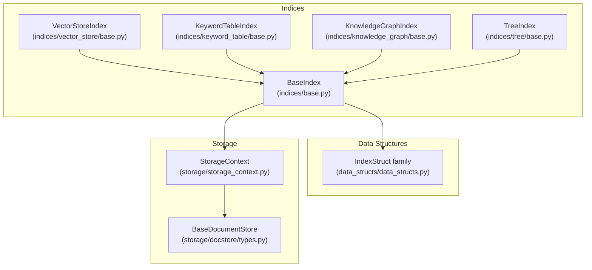
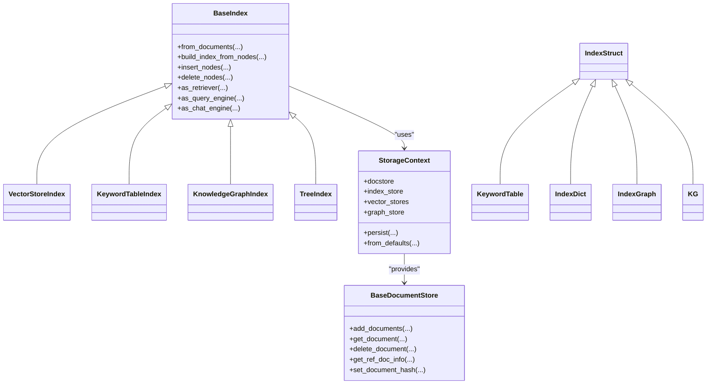
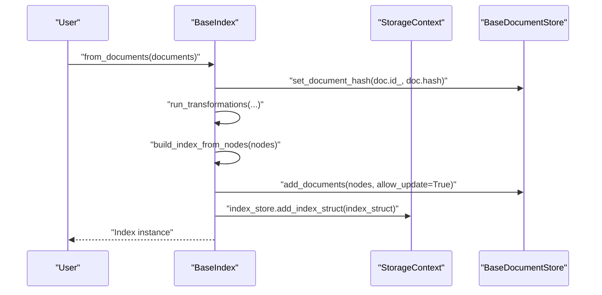
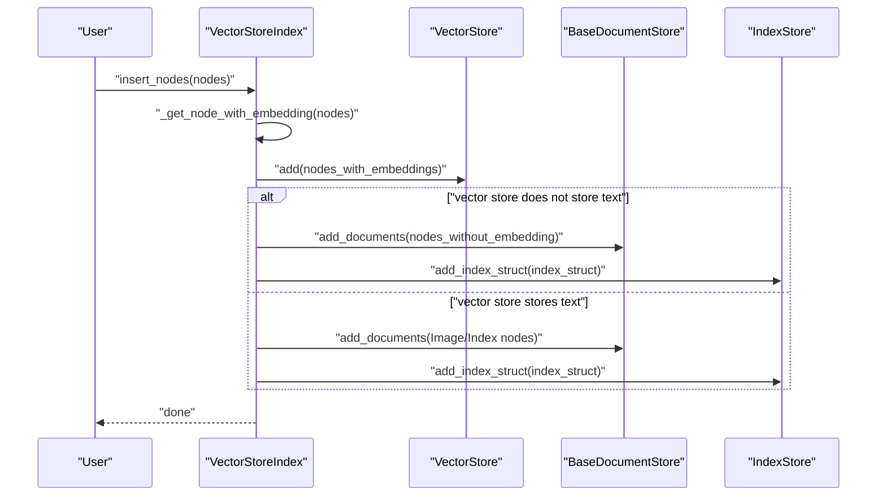
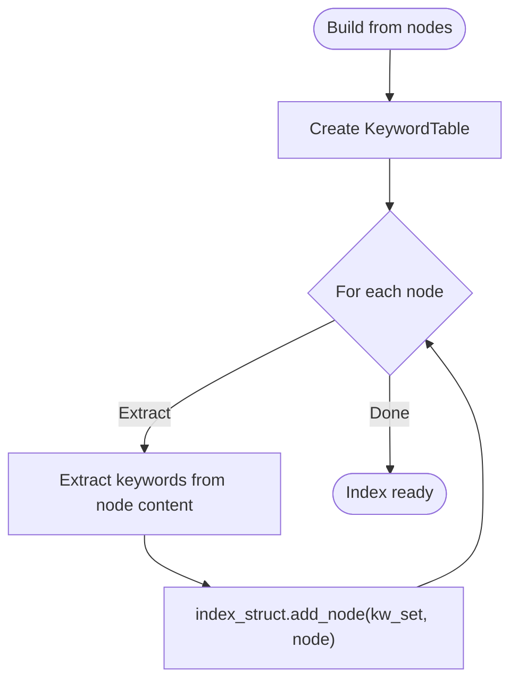
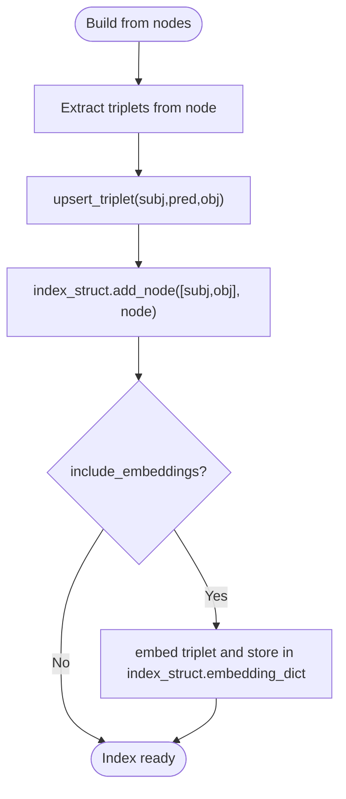
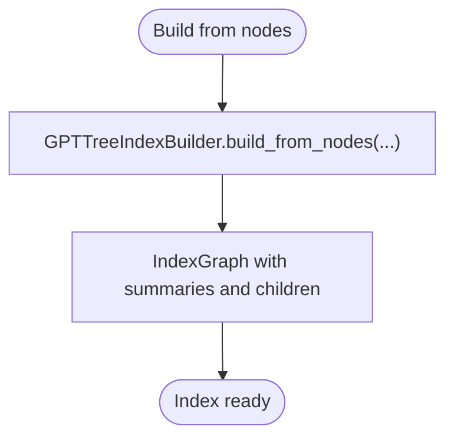
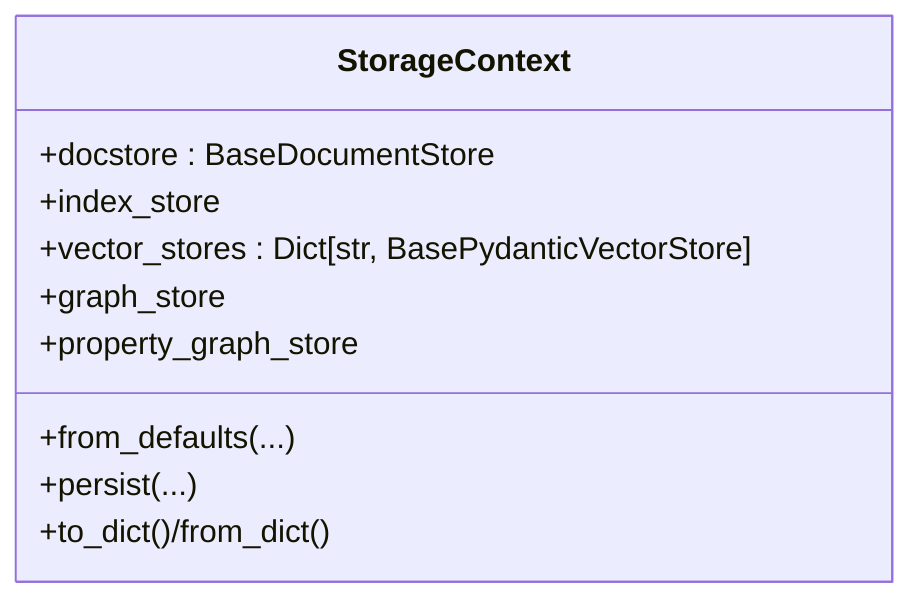
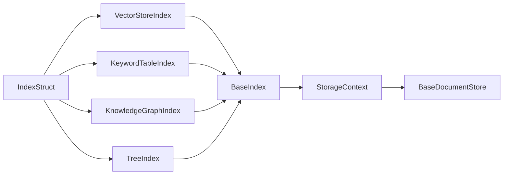

# Custom Indexes

<cite>
**Referenced Files in This Document**
- [base.py](file://llama-index-core/llama_index/core/indices/base.py)
- [data_structs.py](file://llama-index-core/llama_index/core/data_structs/data_structs.py)
- [storage_context.py](file://llama-index-core/llama_index/core/storage/storage_context.py)
- [types.py](file://llama-index-core/llama_index/core/storage/docstore/types.py)
- [vector_store/base.py](file://llama-index-core/llama_index/core/indices/vector_store/base.py)
- [keyword_table/base.py](file://llama-index-core/llama_index/core/indices/keyword_table/base.py)
- [knowledge_graph/base.py](file://llama-index-core/llama_index/core/indices/knowledge_graph/base.py)
- [tree/base.py](file://llama-index-core/llama_index/core/indices/tree/base.py)
- [__init__.py](file://llama-index-core/llama_index/core/__init__.py)
</cite>

## Table of Contents
1. [Introduction](#introduction)
2. [Project Structure](#project-structure)
3. [Core Components](#core-components)
4. [Architecture Overview](#architecture-overview)
5. [Detailed Component Analysis](#detailed-component-analysis)
6. [Dependency Analysis](#dependency-analysis)
7. [Performance Considerations](#performance-considerations)
8. [Troubleshooting Guide](#troubleshooting-guide)
9. [Conclusion](#conclusion)
10. [Appendices](#appendices)

## Introduction
This document explains how to build custom indexes in LlamaIndex. It focuses on the Index base class, data structure interfaces, and storage backend integration. It covers index creation patterns, node insertion strategies, and query processing workflows. It also includes vector store integration, keyword table implementation, knowledge graph indexing, examples of custom storage backends, hybrid indexing strategies, performance optimization techniques, serialization, migration patterns, and maintenance procedures.

## Project Structure
LlamaIndex organizes index logic around a shared BaseIndex abstraction, typed index structures, and a storage context that wires together document, index, vector, and graph stores. The key areas for custom index development are:
- Index base and concrete index implementations
- Data structures that define index internals
- Storage context and storage backends
- Retrievers and query engines

**Diagram sources**
- [base.py](file://llama-index-core/llama_index/core/indices/base.py#L25-L596)
- [data_structs.py](file://llama-index-core/llama_index/core/data_structs/data_structs.py#L21-L280)
- [storage_context.py](file://llama-index-core/llama_index/core/storage/storage_context.py#L52-L278)
- [types.py](file://llama-index-core/llama_index/core/storage/docstore/types.py#L24-L273)
- [vector_store/base.py](file://llama-index-core/llama_index/core/indices/vector_store/base.py#L36-L490)
- [keyword_table/base.py](file://llama-index-core/llama_index/core/indices/keyword_table/base.py#L43-L256)
- [knowledge_graph/base.py](file://llama-index-core/llama_index/core/indices/knowledge_graph/base.py#L42-L389)
- [tree/base.py](file://llama-index-core/llama_index/core/indices/tree/base.py#L39-L191)

**Section sources**
- [base.py](file://llama-index-core/llama_index/core/indices/base.py#L25-L596)
- [data_structs.py](file://llama-index-core/llama_index/core/data_structs/data_structs.py#L21-L280)
- [storage_context.py](file://llama-index-core/llama_index/core/storage/storage_context.py#L52-L278)
- [types.py](file://llama-index-core/llama_index/core/storage/docstore/types.py#L24-L273)
- [vector_store/base.py](file://llama-index-core/llama_index/core/indices/vector_store/base.py#L36-L490)
- [keyword_table/base.py](file://llama-index-core/llama_index/core/indices/keyword_table/base.py#L43-L256)
- [knowledge_graph/base.py](file://llama-index-core/llama_index/core/indices/knowledge_graph/base.py#L42-L389)
- [tree/base.py](file://llama-index-core/llama_index/core/indices/tree/base.py#L39-L191)

## Core Components
- BaseIndex: Defines the lifecycle of index construction, node insertion, deletion, updates, and conversion to retriever/query engine/chat engine. It orchestrates docstore, index store, vector store, and graph store via StorageContext.
- IndexStruct: Typed data structures that capture index internals (e.g., keyword table, vector store mapping, tree graph, knowledge graph).
- StorageContext: Aggregates and configures storage backends (docstore, index store, vector stores, graph stores) and provides persistence and serialization helpers.
- BaseDocumentStore: Abstraction for document/node storage with ref-doc tracking, hashing, and batch operations.

Key responsibilities:
- Construction: build_index_from_nodes adds nodes to docstore and delegates to _build_index_from_nodes.
- Insertion: insert_nodes validates IndexNode objects, updates docstore, performs index-specific insert, and persists index struct.
- Deletion: delete_nodes and delete_ref_doc coordinate index struct and docstore cleanup.
- Query pipeline: as_retriever and as_query_engine integrate with retrieval and synthesis.

**Section sources**
- [base.py](file://llama-index-core/llama_index/core/indices/base.py#L25-L596)
- [data_structs.py](file://llama-index-core/llama_index/core/data_structs/data_structs.py#L21-L280)
- [storage_context.py](file://llama-index-core/llama_index/core/storage/storage_context.py#L52-L278)
- [types.py](file://llama-index-core/llama_index/core/storage/docstore/types.py#L24-L273)

## Architecture Overview
The index architecture separates concerns:
- Index classes encapsulate domain-specific logic (e.g., keyword extraction, triplet extraction, tree summarization).
- Data structures encode index internals and enable persistence.
- StorageContext mediates between indices and storage backends.
- Retrievers and query engines consume indices to answer queries.

**Diagram sources**
- [base.py](file://llama-index-core/llama_index/core/indices/base.py#L25-L596)
- [data_structs.py](file://llama-index-core/llama_index/core/data_structs/data_structs.py#L21-L280)
- [storage_context.py](file://llama-index-core/llama_index/core/storage/storage_context.py#L52-L278)
- [types.py](file://llama-index-core/llama_index/core/storage/docstore/types.py#L24-L273)
- [vector_store/base.py](file://llama-index-core/llama_index/core/indices/vector_store/base.py#L36-L490)
- [keyword_table/base.py](file://llama-index-core/llama_index/core/indices/keyword_table/base.py#L43-L256)
- [knowledge_graph/base.py](file://llama-index-core/llama_index/core/indices/knowledge_graph/base.py#L42-L389)
- [tree/base.py](file://llama-index-core/llama_index/core/indices/tree/base.py#L39-L191)

## Detailed Component Analysis

### BaseIndex: Lifecycle and Integration
- Construction: from_documents runs transformations, sets document hashes, and builds the index via build_index_from_nodes.
- Insertion: insert_nodes validates IndexNode objects, updates docstore, performs index-specific insert, and persists index struct.
- Deletion: delete_nodes and delete_ref_doc coordinate index struct and docstore cleanup.
- Query pipeline: as_retriever and as_query_engine wrap retrievers and query engines; as_chat_engine supports multiple chat modes.

**Diagram sources**
- [base.py](file://llama-index-core/llama_index/core/indices/base.py#L88-L129)

**Section sources**
- [base.py](file://llama-index-core/llama_index/core/indices/base.py#L25-L596)

### Vector Store Index: Embedding and Retrieval
VectorStoreIndex integrates with a vector store, computes embeddings, and manages storage of nodes and vectors. It supports:
- Batch embedding computation
- Conditional storage: when vector store does not store text, nodes are stored in docstore and index struct
- Async and sync insertion paths
- Deletion and ref-doc deletion coordination with vector store and docstore

**Diagram sources**
- [vector_store/base.py](file://llama-index-core/llama_index/core/indices/vector_store/base.py#L126-L356)

**Section sources**
- [vector_store/base.py](file://llama-index-core/llama_index/core/indices/vector_store/base.py#L36-L490)
- [data_structs.py](file://llama-index-core/llama_index/core/data_structs/data_structs.py#L178-L225)

### Keyword Table Index: Keyword Extraction and Retrieval
KeywordTableIndex builds a keyword-to-node mapping using either an LLM or external keyword extraction (e.g., RAKE). It supports:
- Keyword extraction templates
- Multiple retriever modes (default, simple, RAKE)
- Index struct updates on insert/delete
- Ref doc info aggregation from ingested nodes

**Diagram sources**
- [keyword_table/base.py](file://llama-index-core/llama_index/core/indices/keyword_table/base.py#L138-L184)

**Section sources**
- [keyword_table/base.py](file://llama-index-core/llama_index/core/indices/keyword_table/base.py#L43-L256)
- [data_structs.py](file://llama-index-core/llama_index/core/data_structs/data_structs.py#L115-L147)

### Knowledge Graph Index: Triplets and Hybrid Retrieval
KnowledgeGraphIndex extracts subject-predicate-object triplets and maintains a keyword-to-node mapping plus optional triplet embeddings. It supports:
- Triple extraction via LLM or custom function
- Upsert of triplets into graph store
- Hybrid retriever mode selection based on presence of embeddings
- Legacy deprecation note and migration guidance to PropertyGraphIndex

**Diagram sources**
- [knowledge_graph/base.py](file://llama-index-core/llama_index/core/indices/knowledge_graph/base.py#L152-L232)

**Section sources**
- [knowledge_graph/base.py](file://llama-index-core/llama_index/core/indices/knowledge_graph/base.py#L42-L389)
- [data_structs.py](file://llama-index-core/llama_index/core/data_structs/data_structs.py#L227-L270)

### Tree Index: Hierarchical Summaries and Retrievers
TreeIndex constructs a hierarchical summary tree bottom-up. It supports:
- Multiple retriever modes (select leaf, select leaf with embedding, all leaves, root)
- Validation that tree-building is enabled for modes requiring the tree
- Index struct updates on insert

**Diagram sources**
- [tree/base.py](file://llama-index-core/llama_index/core/indices/tree/base.py#L138-L150)

**Section sources**
- [tree/base.py](file://llama-index-core/llama_index/core/indices/tree/base.py#L39-L191)
- [data_structs.py](file://llama-index-core/llama_index/core/data_structs/data_structs.py#L40-L113)

### Storage Backend Integration
StorageContext aggregates:
- Docstore: BaseDocumentStore for nodes and ref-doc metadata
- Index store: Persists index structs
- Vector stores: One or more named vector stores
- Graph stores: Knowledge graph storage

It supports:
- from_defaults with in-memory or persistent backends
- persist to serialize stores to disk or filesystem
- to_dict/from_dict for compact serialization when using simple stores

**Diagram sources**
- [storage_context.py](file://llama-index-core/llama_index/core/storage/storage_context.py#L52-L278)

**Section sources**
- [storage_context.py](file://llama-index-core/llama_index/core/storage/storage_context.py#L52-L278)
- [types.py](file://llama-index-core/llama_index/core/storage/docstore/types.py#L24-L273)

## Dependency Analysis
- BaseIndex depends on StorageContext for docstore, index store, vector store, and graph store access.
- Concrete indices depend on BaseIndex and their specific IndexStruct types.
- Retrievers are created by as_retriever on each index and are coupled to index internals (e.g., IndexDict, KeywordTable, IndexGraph, KG).
- StorageContext composes BaseDocumentStore and other stores and exposes a unified persistence interface.

**Diagram sources**
- [base.py](file://llama-index-core/llama_index/core/indices/base.py#L25-L596)
- [data_structs.py](file://llama-index-core/llama_index/core/data_structs/data_structs.py#L21-L280)
- [storage_context.py](file://llama-index-core/llama_index/core/storage/storage_context.py#L52-L278)
- [types.py](file://llama-index-core/llama_index/core/storage/docstore/types.py#L24-L273)
- [vector_store/base.py](file://llama-index-core/llama_index/core/indices/vector_store/base.py#L36-L490)
- [keyword_table/base.py](file://llama-index-core/llama_index/core/indices/keyword_table/base.py#L43-L256)
- [knowledge_graph/base.py](file://llama-index-core/llama_index/core/indices/knowledge_graph/base.py#L42-L389)
- [tree/base.py](file://llama-index-core/llama_index/core/indices/tree/base.py#L39-L191)

**Section sources**
- [base.py](file://llama-index-core/llama_index/core/indices/base.py#L25-L596)
- [storage_context.py](file://llama-index-core/llama_index/core/storage/storage_context.py#L52-L278)

## Performance Considerations
- Vector store insertion batching: VectorStoreIndex uses configurable batch sizes to reduce overhead.
- Conditional node storage: When vector stores do not store text, nodes are stored in docstore and index struct to avoid duplication.
- Async operations: VectorStoreIndex supports async embedding and insertion to improve throughput.
- Progress reporting: Options to show progress bars during transformations and index operations.
- Retrieval modes: Choose appropriate retriever modes to balance recall and latency (e.g., root vs. leaf traversal in TreeIndex).

[No sources needed since this section provides general guidance]

## Troubleshooting Guide
Common issues and resolutions:
- Index construction errors: Ensure nodes are Node objects, not Documents; use from_documents for Document inputs.
- Missing content nodes: VectorStoreIndex filters out nodes without content; verify node metadata modes.
- Serialization constraints: Some stores require simple implementations for to_dict/from_dict; otherwise, use persist.
- Deprecations: KnowledgeGraphIndex is deprecated; migrate to PropertyGraphIndex.

**Section sources**
- [base.py](file://llama-index-core/llama_index/core/indices/base.py#L49-L62)
- [vector_store/base.py](file://llama-index-core/llama_index/core/indices/vector_store/base.py#L298-L309)
- [storage_context.py](file://llama-index-core/llama_index/core/storage/storage_context.py#L204-L266)
- [knowledge_graph/base.py](file://llama-index-core/llama_index/core/indices/knowledge_graph/base.py#L33-L41)

## Conclusion
Custom indexes in LlamaIndex are built by extending BaseIndex and selecting an appropriate IndexStruct. StorageContext provides a flexible integration point for docstore, index store, vector stores, and graph stores. By leveraging the provided patterns—construction, insertion, deletion, and retriever/query engine integration—you can implement specialized indexes such as keyword tables, knowledge graphs, and tree-based structures. For production workloads, consider batching, async operations, and careful selection of storage backends to optimize performance and maintainability.

[No sources needed since this section summarizes without analyzing specific files]

## Appendices

### Creating a Custom Index
Steps to implement a custom index:
1. Define a new IndexStruct subclass in the data structures module to represent your index’s internal state.
2. Subclass BaseIndex and implement:
   - index_struct_cls pointing to your IndexStruct
   - _build_index_from_nodes to construct the index struct from nodes
   - _insert to handle incremental node insertion
   - _delete_node to handle node removal
   - as_retriever to expose retrieval capabilities
3. Integrate with StorageContext for docstore, index store, and vector/graph stores.
4. Optionally override build_index_from_nodes or insert_nodes to customize behavior (e.g., filtering, transformations).
5. Provide a retriever or query engine adapter via as_retriever/as_query_engine.

**Section sources**
- [base.py](file://llama-index-core/llama_index/core/indices/base.py#L178-L209)
- [data_structs.py](file://llama-index-core/llama_index/core/data_structs/data_structs.py#L21-L38)
- [storage_context.py](file://llama-index-core/llama_index/core/storage/storage_context.py#L52-L149)

### Custom Storage Backends
To plug in custom storage backends:
- Implement BaseDocumentStore for documents/nodes
- Implement BaseIndexStore for index structs
- Implement BasePydanticVectorStore for vector storage
- Implement GraphStore for knowledge graphs
- Provide PropertyGraphStore for property graphs
- Wire them into StorageContext.from_defaults or persist them via StorageContext.persist

**Section sources**
- [types.py](file://llama-index-core/llama_index/core/storage/docstore/types.py#L24-L273)
- [storage_context.py](file://llama-index-core/llama_index/core/storage/storage_context.py#L52-L203)

### Hybrid Indexing Strategies
- Vector + Keyword: Use VectorStoreIndex for dense retrieval and KeywordTableIndex for lexical matching; combine results in a fusion retriever.
- Vector + Knowledge Graph: Use VectorStoreIndex for retrieval and KnowledgeGraphIndex for relational reasoning; leverage hybrid retriever modes.
- Tree + Keyword: Combine hierarchical summarization with keyword matching for robust coverage.

[No sources needed since this section provides general guidance]

### Serialization and Migration
- Use StorageContext.persist to serialize docstore, index store, graph store, property graph store, and named vector stores.
- Use to_dict/from_dict for compact serialization when using simple stores.
- Migrate deprecated indices: KnowledgeGraphIndex is deprecated; use PropertyGraphIndex and compatible graph stores.

**Section sources**
- [storage_context.py](file://llama-index-core/llama_index/core/storage/storage_context.py#L151-L266)
- [knowledge_graph/base.py](file://llama-index-core/llama_index/core/indices/knowledge_graph/base.py#L33-L41)

### Maintenance Procedures
- Regularly refresh indices with updated documents using refresh_ref_docs to minimize redundant computations.
- Monitor index sizes and prune unused nodes periodically.
- Keep vector stores aligned with index structs; ensure vector store namespaces are consistent when using multiple stores.

**Section sources**
- [base.py](file://llama-index-core/llama_index/core/indices/base.py#L429-L480)