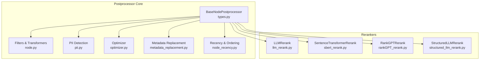
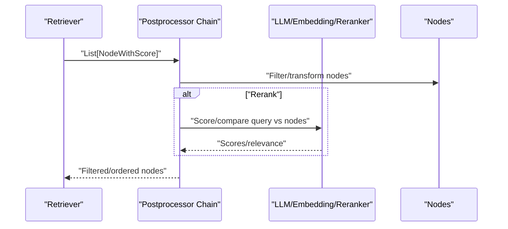
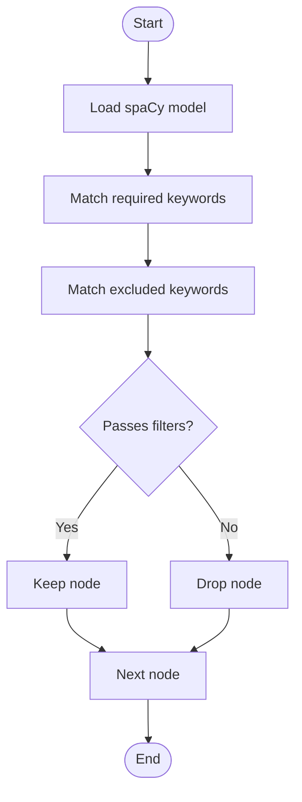
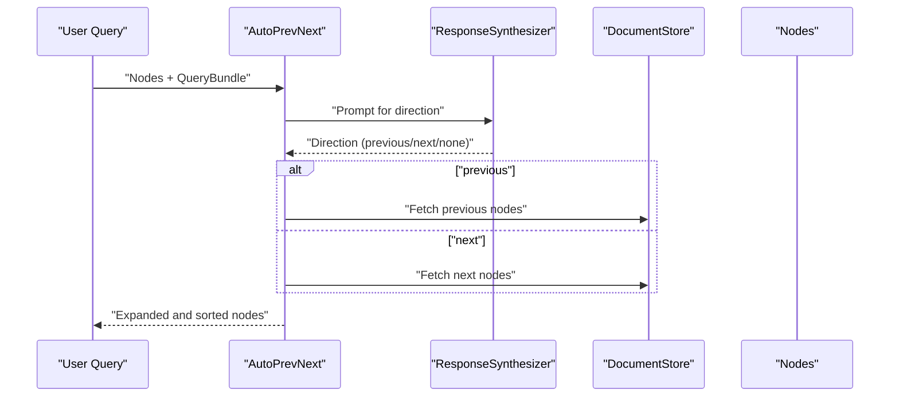
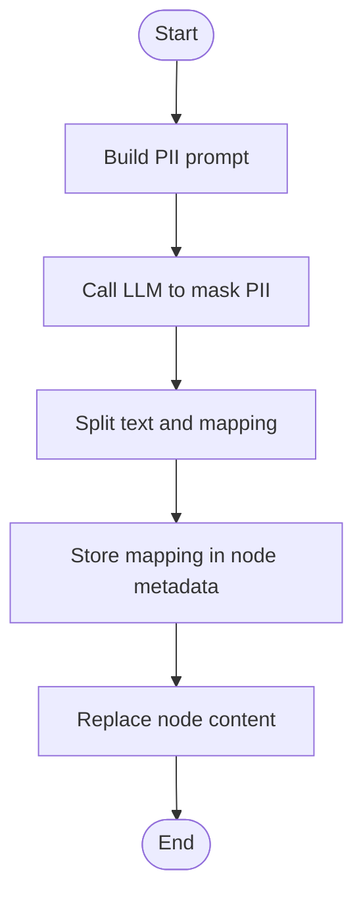
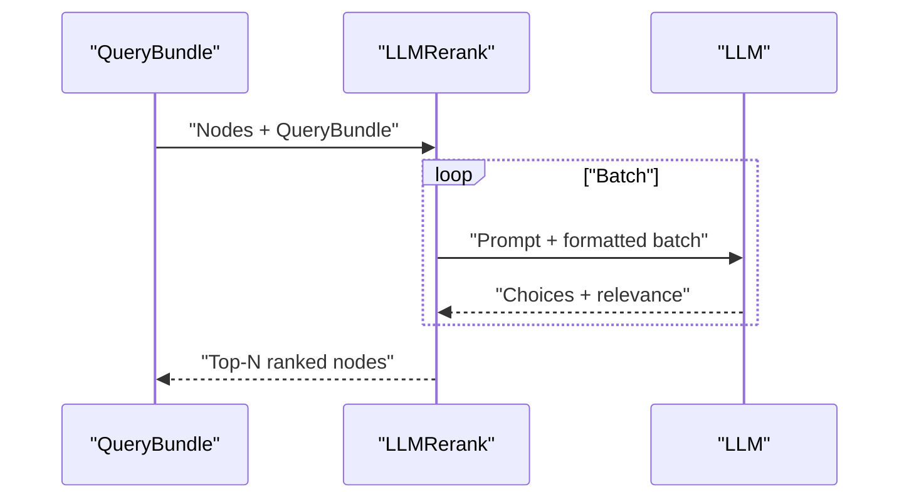
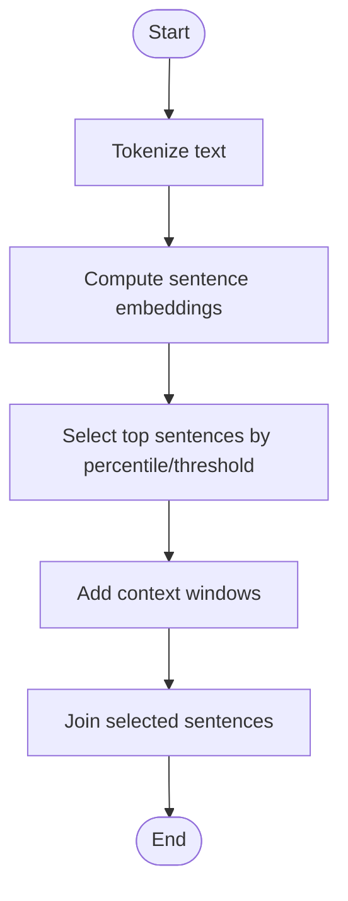
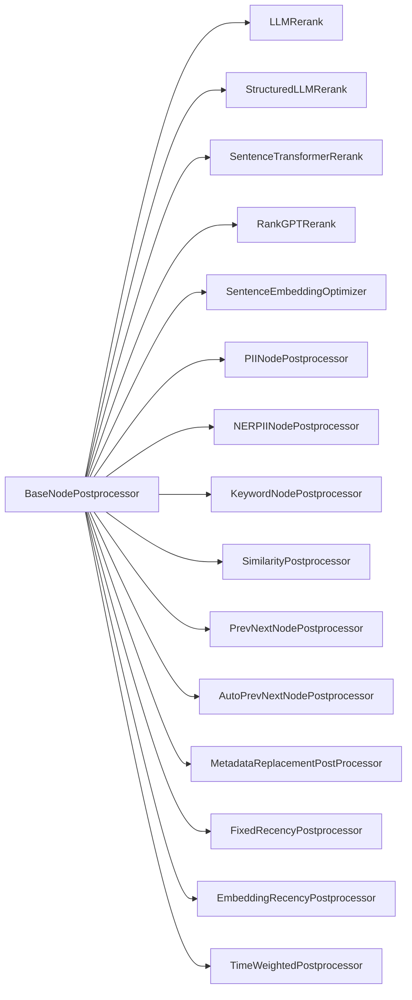

# Custom Post-processors

<cite>
**Referenced Files in This Document**
- [types.py](file://llama-index-core/llama_index/core/postprocessor/types.py)
- [node.py](file://llama-index-core/llama_index/core/postprocessor/node.py)
- [pii.py](file://llama-index-core/llama_index/core/postprocessor/pii.py)
- [optimizer.py](file://llama-index-core/llama_index/core/postprocessor/optimizer.py)
- [llm_rerank.py](file://llama-index-core/llama_index/core/postprocessor/llm_rerank.py)
- [sbert_rerank.py](file://llama-index-core/llama_index/core/postprocessor/sbert_rerank.py)
- [rankGPT_rerank.py](file://llama-index-core/llama_index/core/postprocessor/rankGPT_rerank.py)
- [structured_llm_rerank.py](file://llama-index-core/llama_index/core/postprocessor/structured_llm_rerank.py)
- [metadata_replacement.py](file://llama-index-core/llama_index/core/postprocessor/metadata_replacement.py)
- [node_recency.py](file://llama-index-core/llama_index/core/postprocessor/node_recency.py)
- [__init__.py](file://llama-index-core/llama_index/core/postprocessor/__init__.py)
- [node_postprocessor_examples](file://docs/examples/node_postprocessor/)
- [cookbook_rerank_llamaparsed_pdfs.ipynb](file://docs/examples/cookbooks/rerank_llamaparsed_pdfs.ipynb)
- [mixedbread_reranker.ipynb](file://docs/examples/cookbooks/mixedbread_reranker.ipynb)
</cite>

## Table of Contents
1. [Introduction](#introduction)
2. [Project Structure](#project-structure)
3. [Core Components](#core-components)
4. [Architecture Overview](#architecture-overview)
5. [Detailed Component Analysis](#detailed-component-analysis)
6. [Dependency Analysis](#dependency-analysis)
7. [Performance Considerations](#performance-considerations)
8. [Troubleshooting Guide](#troubleshooting-guide)
9. [Conclusion](#conclusion)
10. [Appendices](#appendices)

## Introduction
This document explains how to build custom post-processors in LlamaIndex. It covers the Postprocessor interface, result filtering and transformation strategies, metadata filtering, PII detection, relevance ranking, custom reranking algorithms, LLM-based reranking, optimizer patterns, and performance optimization. It also provides examples of implementing custom filters, transformers, and evaluators, along with result validation, testing strategies, and integration with retrieval pipelines.

## Project Structure
LlamaIndex provides a unified Postprocessor interface and several built-in processors for filtering, recency-aware ranking, PII masking, and reranking. The core interface and implementations live under the postprocessor module.

**Diagram sources**
- [types.py](file://llama-index-core/llama_index/core/postprocessor/types.py#L12-L80)
- [node.py](file://llama-index-core/llama_index/core/postprocessor/node.py#L26-L397)
- [pii.py](file://llama-index-core/llama_index/core/postprocessor/pii.py#L40-L148)
- [optimizer.py](file://llama-index-core/llama_index/core/postprocessor/optimizer.py#L17-L168)
- [metadata_replacement.py](file://llama-index-core/llama_index/core/postprocessor/metadata_replacement.py#L8-L34)
- [node_recency.py](file://llama-index-core/llama_index/core/postprocessor/node_recency.py#L40-L225)
- [llm_rerank.py](file://llama-index-core/llama_index/core/postprocessor/llm_rerank.py#L19-L112)
- [sbert_rerank.py](file://llama-index-core/llama_index/core/postprocessor/sbert_rerank.py#L12-L105)
- [rankGPT_rerank.py](file://llama-index-core/llama_index/core/postprocessor/rankGPT_rerank.py#L23-L205)
- [structured_llm_rerank.py](file://llama-index-core/llama_index/core/postprocessor/structured_llm_rerank.py#L76-L221)

**Section sources**
- [__init__.py](file://llama-index-core/llama_index/core/postprocessor/__init__.py#L1-L48)

## Core Components
- BaseNodePostprocessor defines the contract for all postprocessors: synchronous and asynchronous entry points, optional query_bundle or query_str, and instrumentation hooks.
- Built-in processors include keyword/similarity filters, neighbor expansion, auto-direction neighbor expansion, long-context reordering, PII masking via LLM or NER, sentence embedding optimization, metadata replacement, recency-aware ordering, and multiple rerankers.

Key capabilities:
- Filtering: keyword presence/exclusion, similarity cutoff
- Transformation: neighbor expansion, long-context reorder, metadata replacement
- Recency: fixed-date sorting, embedding-based recency, time-weighted scoring
- Privacy: PII masking with LLM or NER
- Reranking: LLM-based, cross-encoder, RankGPT-style permutations, structured LLM outputs
- Optimization: sentence embedding-based pruning

**Section sources**
- [types.py](file://llama-index-core/llama_index/core/postprocessor/types.py#L12-L80)
- [node.py](file://llama-index-core/llama_index/core/postprocessor/node.py#L26-L397)
- [pii.py](file://llama-index-core/llama_index/core/postprocessor/pii.py#L40-L148)
- [optimizer.py](file://llama-index-core/llama_index/core/postprocessor/optimizer.py#L17-L168)
- [metadata_replacement.py](file://llama-index-core/llama_index/core/postprocessor/metadata_replacement.py#L8-L34)
- [node_recency.py](file://llama-index-core/llama_index/core/postprocessor/node_recency.py#L40-L225)
- [llm_rerank.py](file://llama-index-core/llama_index/core/postprocessor/llm_rerank.py#L19-L112)
- [sbert_rerank.py](file://llama-index-core/llama_index/core/postprocessor/sbert_rerank.py#L12-L105)
- [rankGPT_rerank.py](file://llama-index-core/llama_index/core/postprocessor/rankGPT_rerank.py#L23-L205)
- [structured_llm_rerank.py](file://llama-index-core/llama_index/core/postprocessor/structured_llm_rerank.py#L76-L221)

## Architecture Overview
Postprocessors operate on lists of NodeWithScore and can depend on LLMs, embeddings, or external libraries. They integrate into retrieval pipelines by chaining after retrieval and before response synthesis.

[No sources needed since this diagram shows conceptual workflow, not actual code structure]

## Detailed Component Analysis

### Postprocessor Interface and Lifecycle
- Provides postprocess_nodes and apostprocess_nodes with optional query_bundle or query_str.
- Validates conflicting inputs and normalizes to QueryBundle internally.
- Supports instrumentation via callback manager and dispatcher spans.

Implementation pattern:
- Extend BaseNodePostprocessor
- Implement _postprocess_nodes and optionally _apostprocess_nodes
- Optionally override prompt hooks for dynamic prompt updates

**Section sources**
- [types.py](file://llama-index-core/llama_index/core/postprocessor/types.py#L35-L80)

### Filters and Transformers

#### KeywordNodePostprocessor
- Filters nodes by required and excluded keywords using spaCy phrase matching.
- Requires language specification and supports installation of spaCy models.

**Diagram sources**
- [node.py](file://llama-index-core/llama_index/core/postprocessor/node.py#L26-L68)

**Section sources**
- [node.py](file://llama-index-core/llama_index/core/postprocessor/node.py#L26-L68)

#### SimilarityPostprocessor
- Removes nodes whose similarity score is below a cutoff.

**Section sources**
- [node.py](file://llama-index-core/llama_index/core/postprocessor/node.py#L70-L101)

#### PrevNextNodePostprocessor and AutoPrevNextNodePostprocessor
- Expand context by fetching neighboring nodes from the document store.
- AutoPrevNext infers direction via LLM prompting and response synthesis.

**Diagram sources**
- [node.py](file://llama-index-core/llama_index/core/postprocessor/node.py#L149-L364)

**Section sources**
- [node.py](file://llama-index-core/llama_index/core/postprocessor/node.py#L149-L364)

#### LongContextReorder
- Reorders nodes to move high-score items toward the front and back alternately, mitigating long-context decay.

**Section sources**
- [node.py](file://llama-index-core/llama_index/core/postprocessor/node.py#L366-L397)

#### MetadataReplacementPostProcessor
- Replaces node content with a target metadata field, falling back to original content if missing.

**Section sources**
- [metadata_replacement.py](file://llama-index-core/llama_index/core/postprocessor/metadata_replacement.py#L8-L34)

### Recency and Ordering Strategies

#### FixedRecencyPostprocessor
- Sorts nodes by a specified date key and returns top_k.

**Section sources**
- [node_recency.py](file://llama-index-core/llama_index/core/postprocessor/node_recency.py#L40-L80)

#### EmbeddingRecencyPostprocessor
- Sorts by date, then prunes semantically similar later documents using embedding similarity.

**Section sources**
- [node_recency.py](file://llama-index-core/llama_index/core/postprocessor/node_recency.py#L94-L161)

#### TimeWeightedPostprocessor
- Combines embedding similarity with time decay to compute a composite score, optionally refreshing last-access timestamps.

**Section sources**
- [node_recency.py](file://llama-index-core/llama_index/core/postprocessor/node_recency.py#L163-L225)

### Privacy and PII Detection

#### PIINodePostprocessor
- Masks PII in node content using an LLM with a structured prompt and stores the mapping in node metadata.

**Diagram sources**
- [pii.py](file://llama-index-core/llama_index/core/postprocessor/pii.py#L75-L96)

**Section sources**
- [pii.py](file://llama-index-core/llama_index/core/postprocessor/pii.py#L40-L96)

#### NERPIINodePostprocessor
- Uses a Hugging Face NER pipeline to detect and mask PII entities.

**Section sources**
- [pii.py](file://llama-index-core/llama_index/core/postprocessor/pii.py#L98-L148)

### Reranking Strategies

#### LLMRerank
- Batches nodes and asks an LLM to choose the most relevant ones and optionally assign numeric relevance scores.

**Diagram sources**
- [llm_rerank.py](file://llama-index-core/llama_index/core/postprocessor/llm_rerank.py#L71-L112)

**Section sources**
- [llm_rerank.py](file://llama-index-core/llama_index/core/postprocessor/llm_rerank.py#L19-L112)

#### StructuredLLMRerank
- Uses a function-calling LLM to produce a structured list of relevance scores per node, with configurable parsing and batching.

**Section sources**
- [structured_llm_rerank.py](file://llama-index-core/llama_index/core/postprocessor/structured_llm_rerank.py#L76-L221)

#### SentenceTransformerRerank
- Uses a cross-encoder to score query-node pairs, optionally preserving retrieval scores.

**Section sources**
- [sbert_rerank.py](file://llama-index-core/llama_index/core/postprocessor/sbert_rerank.py#L12-L105)

#### RankGPTRerank
- Asks an LLM to permute a list of hits according to relevance, returning a new order.

**Section sources**
- [rankGPT_rerank.py](file://llama-index-core/llama_index/core/postprocessor/rankGPT_rerank.py#L23-L205)

### Optimization Patterns

#### SentenceEmbeddingOptimizer
- Tokenizes node content, computes sentence embeddings, selects top sentences by similarity to the query, and optionally adds context windows around selected sentences.

**Diagram sources**
- [optimizer.py](file://llama-index-core/llama_index/core/postprocessor/optimizer.py#L98-L168)

**Section sources**
- [optimizer.py](file://llama-index-core/llama_index/core/postprocessor/optimizer.py#L17-L168)

### Implementing Custom Post-processors
To implement a custom post-processor:
- Subclass BaseNodePostprocessor
- Implement _postprocess_nodes and optionally _apostprocess_nodes
- Use QueryBundle and NodeWithScore consistently
- Integrate with LLMs, embeddings, or external libraries as needed
- Add instrumentation via callback manager and/or dispatcher spans

Validation tips:
- Ensure either query_bundle or query_str is provided, not both
- Preserve node metadata and scores appropriately
- Normalize content and metadata modes when reading/writing node content

Testing strategies:
- Unit tests for deterministic filters (keyword/similarity)
- Mock LLM/embedding calls for rerankers
- Integration tests with small corpora and known relevance patterns
- Benchmark rerankers with metrics like precision@k, mean reciprocal rank

**Section sources**
- [types.py](file://llama-index-core/llama_index/core/postprocessor/types.py#L35-L80)

## Dependency Analysis
Postprocessors depend on core abstractions and optional external libraries:
- LLM-based rerankers depend on LLM providers
- Cross-encoder rerankers depend on sentence-transformers/torch
- PII detectors depend on transformers or spaCy
- Optimizers depend on embedding models and tokenizers
- Recency processors depend on pandas and embedding models

**Diagram sources**
- [types.py](file://llama-index-core/llama_index/core/postprocessor/types.py#L12-L80)
- [llm_rerank.py](file://llama-index-core/llama_index/core/postprocessor/llm_rerank.py#L19-L112)
- [structured_llm_rerank.py](file://llama-index-core/llama_index/core/postprocessor/structured_llm_rerank.py#L76-L221)
- [sbert_rerank.py](file://llama-index-core/llama_index/core/postprocessor/sbert_rerank.py#L12-L105)
- [rankGPT_rerank.py](file://llama-index-core/llama_index/core/postprocessor/rankGPT_rerank.py#L23-L205)
- [optimizer.py](file://llama-index-core/llama_index/core/postprocessor/optimizer.py#L17-L168)
- [pii.py](file://llama-index-core/llama_index/core/postprocessor/pii.py#L40-L148)
- [node.py](file://llama-index-core/llama_index/core/postprocessor/node.py#L26-L397)
- [metadata_replacement.py](file://llama-index-core/llama_index/core/postprocessor/metadata_replacement.py#L8-L34)
- [node_recency.py](file://llama-index-core/llama_index/core/postprocessor/node_recency.py#L40-L225)

**Section sources**
- [__init__.py](file://llama-index-core/llama_index/core/postprocessor/__init__.py#L1-L48)

## Performance Considerations
- Prefer batched reranking for LLM-based rerankers to reduce overhead
- Use cross-encoders for static reranking when latency is critical
- Apply SentenceEmbeddingOptimizer to reduce context size before generation
- Cache embeddings and reranker predictions when appropriate
- Use device selection (CPU/GPU) for cross-encoders and NER pipelines
- Instrument reranking events to profile cost and latency

[No sources needed since this section provides general guidance]

## Troubleshooting Guide
Common issues and resolutions:
- Missing query bundle: Ensure a QueryBundle is provided to rerankers and structured rerankers
- Zero-length node lists: Handle empty inputs gracefully in custom processors
- Missing optional dependencies: Install required packages (spaCy, transformers, sentence-transformers)
- Prompt mismatches: Verify prompt templates and field names for LLM-based processors
- Metadata conflicts: Respect excluded metadata keys when modifying node content

**Section sources**
- [llm_rerank.py](file://llama-index-core/llama_index/core/postprocessor/llm_rerank.py#L71-L78)
- [structured_llm_rerank.py](file://llama-index-core/llama_index/core/postprocessor/structured_llm_rerank.py#L143-L159)
- [sbert_rerank.py](file://llama-index-core/llama_index/core/postprocessor/sbert_rerank.py#L62-L69)
- [pii.py](file://llama-index-core/llama_index/core/postprocessor/pii.py#L75-L80)

## Conclusion
LlamaIndex provides a flexible Postprocessor framework to filter, transform, rerank, and optimize retrieval results. By extending the BaseNodePostprocessor interface and leveraging built-in processors, developers can implement domain-specific strategies for privacy, relevance, recency, and performance. Integrating instrumentation and benchmarking ensures reliable deployment in production pipelines.

[No sources needed since this section summarizes without analyzing specific files]

## Appendices

### Example Workflows and References
- Node postprocessor examples: See the examples directory for practical usage patterns.
- Reranking with cross-encoders and mixedbread: Refer to the cookbook notebooks for end-to-end workflows.

**Section sources**
- [node_postprocessor_examples](file://docs/examples/node_postprocessor/)
- [cookbook_rerank_llamaparsed_pdfs.ipynb](file://docs/examples/cookbooks/rerank_llamaparsed_pdfs.ipynb)
- [mixedbread_reranker.ipynb](file://docs/examples/cookbooks/mixedbread_reranker.ipynb)