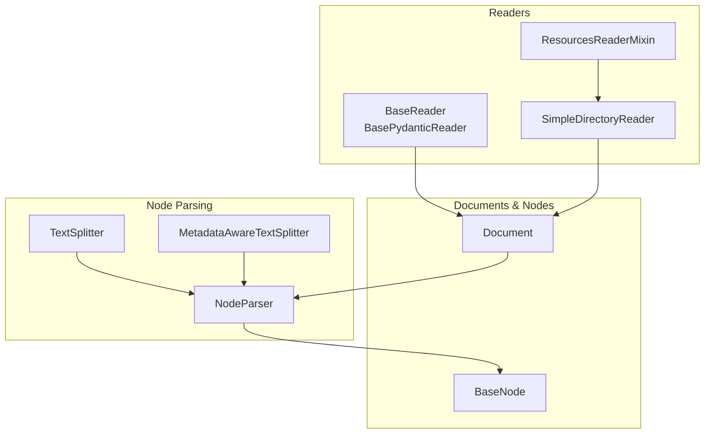
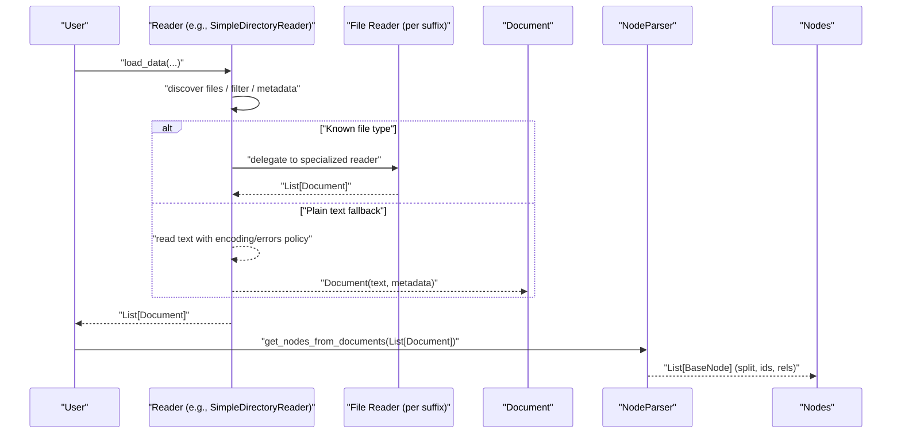
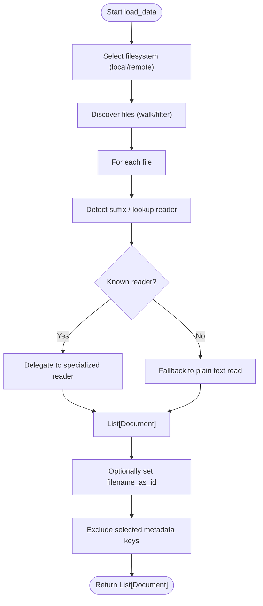
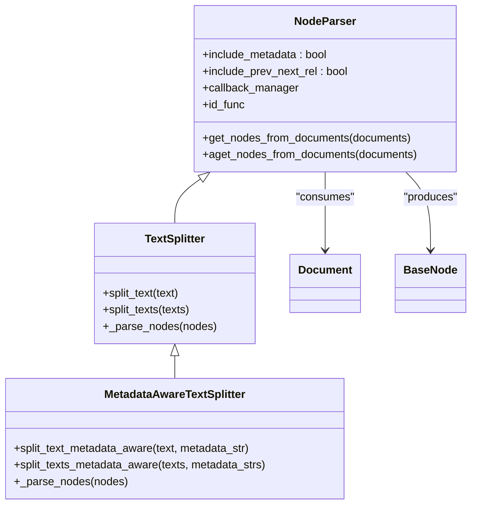
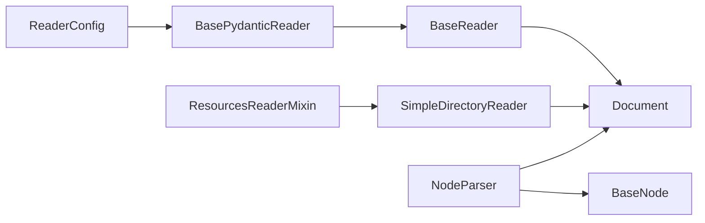

# Custom Readers

<cite>
**Referenced Files in This Document**
- [base.py](file://llama-index-core/llama_index/core/readers/base.py)
- [file/base.py](file://llama-index-core/llama_index/core/readers/file/base.py)
- [loading.py](file://llama-index-core/llama_index/core/readers/loading.py)
- [schema.py](file://llama-index-core/llama_index/core/schema.py)
- [interface.py](file://llama-index-core/llama_index/core/node_parser/interface.py)
- [__init__.py](file://llama-index-core/llama_index/core/node_parser/__init__.py)
- [__init__.py](file://llama-index-core/llama_index/core/readers/__init__.py)
</cite>

## Table of Contents
1. [Introduction](#introduction)
2. [Project Structure](#project-structure)
3. [Core Components](#core-components)
4. [Architecture Overview](#architecture-overview)
5. [Detailed Component Analysis](#detailed-component-analysis)
6. [Dependency Analysis](#dependency-analysis)
7. [Performance Considerations](#performance-considerations)
8. [Troubleshooting Guide](#troubleshooting-guide)
9. [Conclusion](#conclusion)
10. [Appendices](#appendices)

## Introduction
This document explains how to create custom readers in LlamaIndex. It covers the Reader interface and base classes, the data ingestion pipeline from raw documents to nodes, file format handling, metadata extraction, content parsing strategies, and integration with node parsers. It also provides guidance on implementing custom file readers, API connectors, and database readers, along with performance optimization, error handling, and testing approaches.

## Project Structure
The reader ecosystem centers around a small set of core abstractions and utilities:
- Reader base classes define the contract for loading data into Document objects.
- A directory reader demonstrates how to discover files, infer formats, and dispatch to specialized readers.
- Node parser interfaces define how to split parsed Documents into nodes and attach relationships.
- Schema defines the Document and BaseNode types used throughout.

**Diagram sources**
- [base.py](file://llama-index-core/llama_index/core/readers/base.py#L19-L250)
- [file/base.py](file://llama-index-core/llama_index/core/readers/file/base.py#L208-L800)
- [schema.py](file://llama-index-core/llama_index/core/schema.py#L263-L482)
- [interface.py](file://llama-index-core/llama_index/core/node_parser/interface.py#L50-L278)

**Section sources**
- [__init__.py](file://llama-index-core/llama_index/core/readers/__init__.py#L1-L33)
- [__init__.py](file://llama-index-core/llama_index/core/node_parser/__init__.py#L1-L73)

## Core Components
- BaseReader: Defines synchronous and asynchronous loading APIs and conversion to LangChain-compatible documents.
- BasePydanticReader: Extends BaseReader with serializable configuration and a flag for remote data sources.
- ResourcesReaderMixin: Adds resource discovery and access patterns for readers that operate over collections of resources (e.g., files, channels, pages).
- SimpleDirectoryReader: A concrete reader that walks directories, filters files, infers formats, and delegates to appropriate file-specific readers or falls back to plain text.
- ReaderConfig: Encapsulates a reader instance and its arguments for serialization and execution.
- NodeParser and TextSplitter: Define how to convert Documents into nodes and split content, including metadata-aware strategies.

Key responsibilities:
- Reader interfaces: accept inputs (paths, credentials, filters) and produce Document objects.
- Node parsing: convert Documents into TextNode or other node types, optionally attaching prev/next relationships and metadata.

**Section sources**
- [base.py](file://llama-index-core/llama_index/core/readers/base.py#L19-L250)
- [file/base.py](file://llama-index-core/llama_index/core/readers/file/base.py#L208-L800)
- [loading.py](file://llama-index-core/llama_index/core/readers/loading.py#L1-L27)
- [schema.py](file://llama-index-core/llama_index/core/schema.py#L263-L482)
- [interface.py](file://llama-index-core/llama_index/core/node_parser/interface.py#L50-L278)

## Architecture Overview
The ingestion pipeline proceeds from raw sources to Documents and then to nodes. Readers load data and produce Documents. Node parsers split Documents into nodes and enrich them with metadata and relationships.

**Diagram sources**
- [file/base.py](file://llama-index-core/llama_index/core/readers/file/base.py#L555-L716)
- [interface.py](file://llama-index-core/llama_index/core/node_parser/interface.py#L157-L207)

## Detailed Component Analysis

### Reader Interfaces and Base Classes
- BaseReader: Provides load_data, aload_data, lazy_load_data, alazy_load_data, and optional LangChain conversion.
- BasePydanticReader: Adds serialization support and a flag indicating remote data sources.
- ResourcesReaderMixin: Adds list_resources, get_resource_info, and related async helpers; useful for API/database readers that enumerate resources.

Implementation notes:
- Readers should implement lazy_load_data or load_data; the async variants are provided for convenience and can be overridden for true async behavior.
- Resource-aware readers should implement resource enumeration and retrieval methods.

**Section sources**
- [base.py](file://llama-index-core/llama_index/core/readers/base.py#L19-L250)

### SimpleDirectoryReader: File Discovery, Format Handling, and Metadata
Key capabilities:
- Directory traversal with filtering (hidden, empty, required extensions, glob exclusions, recursion).
- Filesystem abstraction via fsspec for local and remote storage.
- Automatic file type inference and delegation to specialized readers.
- Fallback to plain text reading with configurable encoding and error handling.
- Metadata extraction via a pluggable function; default collects filesystem stats and timestamps.
- Parallel loading with worker pools and progress reporting.

Important behaviors:
- Supported suffixes are resolved dynamically; unknown suffixes fall back to text reading.
- filename_as_id can set document IDs to filenames or append part indices for multi-part outputs.
- Metadata keys can be excluded from embedding and LLM prompts to reduce noise.

**Diagram sources**
- [file/base.py](file://llama-index-core/llama_index/core/readers/file/base.py#L208-L800)

**Section sources**
- [file/base.py](file://llama-index-core/llama_index/core/readers/file/base.py#L208-L800)

### Node Parser Integration and Chunking Strategies
NodeParser converts Documents into nodes and attaches relationships:
- NodeParser: Base interface for parsing nodes from documents, with callbacks and progress.
- TextSplitter: Splits text content into chunks and builds nodes with optional custom ID functions.
- MetadataAwareTextSplitter: Splits text while considering metadata strings for embedding vs. LLM modes.

Post-processing:
- Establishes prev/next relationships when nodes share the same source.
- Merges parent metadata into child nodes and records character offsets for accurate provenance.

**Diagram sources**
- [interface.py](file://llama-index-core/llama_index/core/node_parser/interface.py#L50-L278)
- [schema.py](file://llama-index-core/llama_index/core/schema.py#L263-L482)

**Section sources**
- [interface.py](file://llama-index-core/llama_index/core/node_parser/interface.py#L50-L278)
- [schema.py](file://llama-index-core/llama_index/core/schema.py#L263-L482)

### Implementing Custom File Readers
Guidelines:
- Implement BaseReader or BasePydanticReader.
- Provide load_data/lazy_load_data; implement alazy_load_data/aload_data for async support.
- Accept a path-like input and return List[Document].
- Optionally accept extra_info/metadata and propagate it into Document.metadata.
- For remote sources, set is_remote appropriately.

Integration with SimpleDirectoryReader:
- Register a custom reader for a file suffix in file_extractor.
- Ensure the reader handles encoding and error policies consistently.

Testing tips:
- Mock filesystem or network calls.
- Verify Document metadata and content.
- Validate node parsing outcomes (IDs, relationships, offsets).

**Section sources**
- [base.py](file://llama-index-core/llama_index/core/readers/base.py#L19-L250)
- [file/base.py](file://llama-index-core/llama_index/core/readers/file/base.py#L555-L716)

### Implementing API Connectors and Database Readers
Guidelines:
- Implement ResourcesReaderMixin to expose list_resources and load_resource.
- Implement BaseReader for unified loading APIs.
- Use BasePydanticReader for serialization and is_remote flag.
- Normalize API/database responses into Document objects with rich metadata.

Example patterns:
- Enumerate resource IDs (e.g., channel IDs, page IDs, record IDs).
- Fetch content and metadata per resource.
- Apply rate limiting and retries.
- Handle pagination and incremental updates.

**Section sources**
- [base.py](file://llama-index-core/llama_index/core/readers/base.py#L59-L221)

### Implementing Custom Node Parsers
Guidelines:
- Extend TextSplitter or MetadataAwareTextSplitter depending on whether you need metadata-aware splitting.
- Implement split_text or split_text_metadata_aware.
- Use id_func to customize node IDs.
- Leverage include_prev_next_rel and include_metadata to enrich nodes.

Validation:
- Ensure node character offsets align with parent document text.
- Confirm metadata merging precedence and exclusion lists.

**Section sources**
- [interface.py](file://llama-index-core/llama_index/core/node_parser/interface.py#L210-L278)

## Dependency Analysis
- Readers depend on Document and optional LangChain conversion.
- SimpleDirectoryReader depends on specialized file readers for known suffixes and on fsspec for filesystem abstraction.
- NodeParser depends on BaseNode and Document types and uses metadata modes to control inclusion of metadata in content.
- ReaderConfig enables serialization/deserialization of readers for persistence and transport.

**Diagram sources**
- [base.py](file://llama-index-core/llama_index/core/readers/base.py#L19-L250)
- [file/base.py](file://llama-index-core/llama_index/core/readers/file/base.py#L208-L800)
- [schema.py](file://llama-index-core/llama_index/core/schema.py#L263-L482)
- [interface.py](file://llama-index-core/llama_index/core/node_parser/interface.py#L50-L278)
- [loading.py](file://llama-index-core/llama_index/core/readers/loading.py#L1-L27)

**Section sources**
- [loading.py](file://llama-index-core/llama_index/core/readers/loading.py#L1-L27)

## Performance Considerations
- Parallel loading: SimpleDirectoryReader supports multiprocessing-based parallelism for file loading; cap workers to CPU count and monitor memory usage.
- Asynchronous readers: Override async methods for true async I/O to improve throughput with network-bound readers.
- Metadata computation: Prefer lightweight metadata functions; cache expensive filesystem stats when feasible.
- Node parsing: Choose chunk sizes and overlap to balance recall and retrieval cost; use efficient TextSplitter implementations.
- Streaming: For very large files or datasets, prefer lazy loading and streaming node parsing to reduce memory pressure.

[No sources needed since this section provides general guidance]

## Troubleshooting Guide
Common issues and resolutions:
- Missing file reader dependencies: If a specialized reader is not installed, ImportError is raised. Install the corresponding package or provide a file_extractor mapping.
- Empty or hidden files: Configure exclusion flags to skip empty or hidden files.
- Encoding errors: Adjust encoding and errors policy; use error handling strategies that match your data.
- Remote filesystems: Ensure fsspec-compatible filesystem is configured; verify credentials and permissions.
- Node alignment: If node offsets are incorrect, verify that metadata is excluded from content during offset calculation and that splitting preserves content identity.

**Section sources**
- [file/base.py](file://llama-index-core/llama_index/core/readers/file/base.py#L614-L626)
- [file/base.py](file://llama-index-core/llama_index/core/readers/file/base.py#L688-L696)

## Conclusion
Custom readers in LlamaIndex are built on a small set of composable abstractions. By implementing BaseReader or BasePydanticReader and integrating with SimpleDirectoryReader or node parsers, you can ingest diverse data sources, extract meaningful metadata, and produce well-structured nodes for downstream retrieval and generation tasks. Follow the patterns outlined here to implement robust, testable, and performant readers tailored to your data formats and environments.

## Appendices

### Appendix A: Reader Configuration and Loading
- ReaderConfig encapsulates a reader instance and its arguments for serialization and execution.
- load_reader deserializes a reader from a dictionary using registered reader classes.

**Section sources**
- [loading.py](file://llama-index-core/llama_index/core/readers/loading.py#L1-L27)
- [base.py](file://llama-index-core/llama_index/core/readers/base.py#L223-L250)