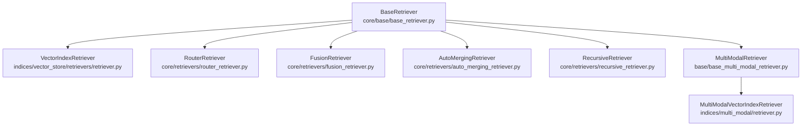
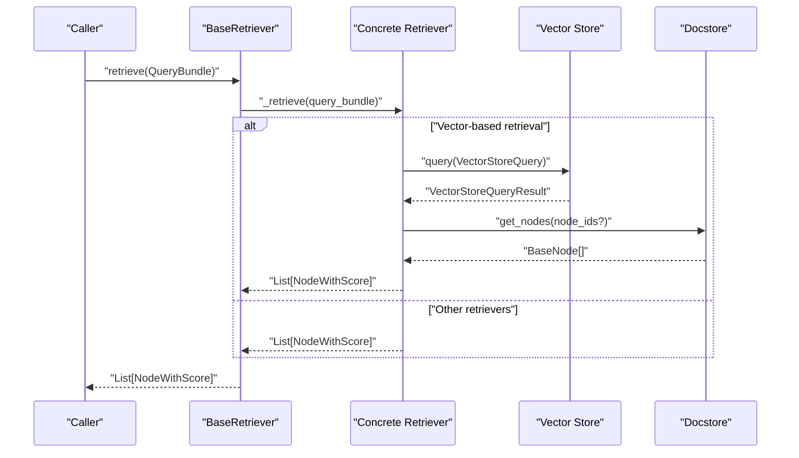
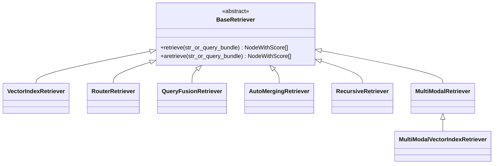
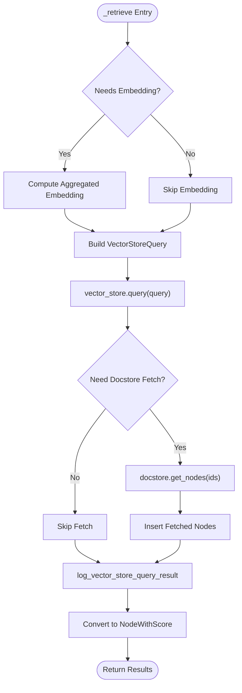
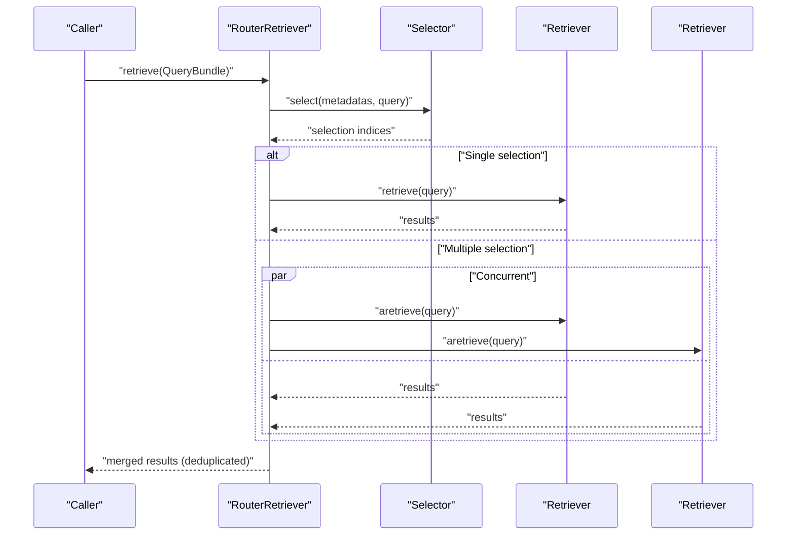
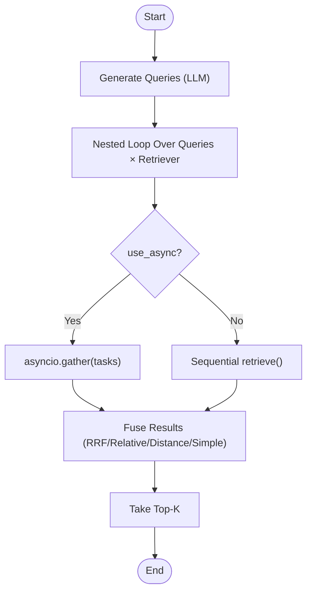
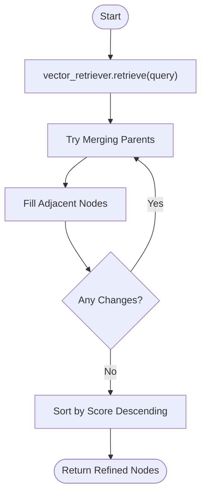
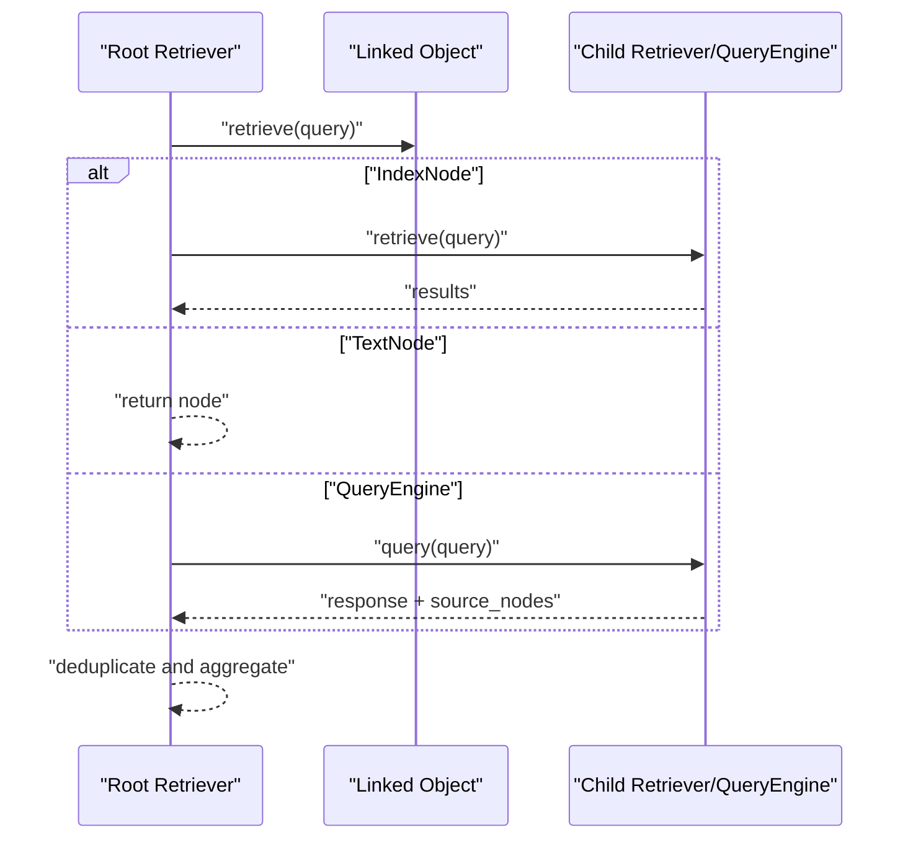
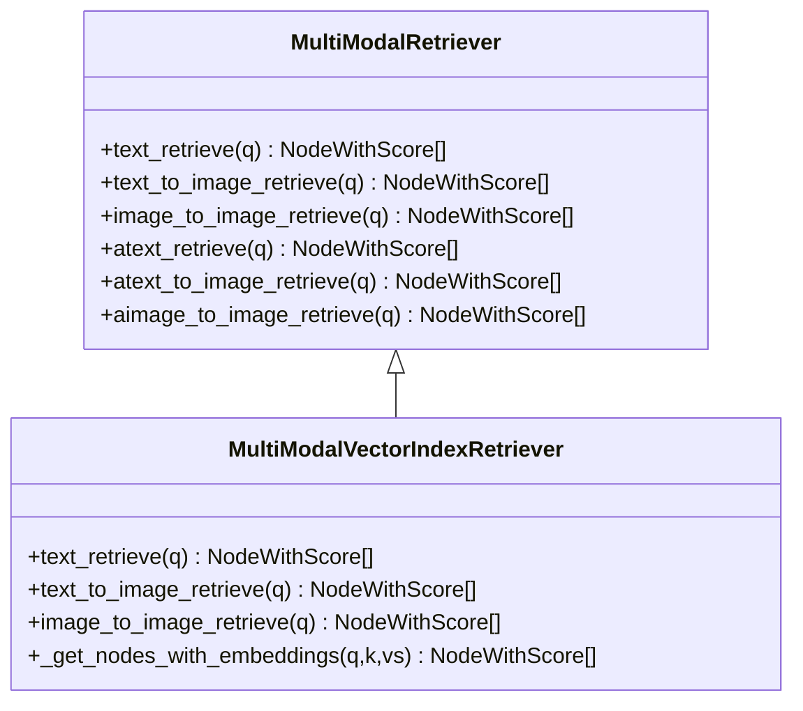
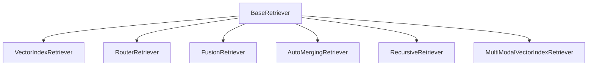

# Custom Retrievers

<cite>
**Referenced Files in This Document**
- [base_retriever.py](file://llama-index-core/llama_index/core/base/base_retriever.py)
- [retriever.py](file://llama-index-core/llama_index/core/indices/vector_store/retrievers/retriever.py)
- [router_retriever.py](file://llama-index-core/llama_index/core/retrievers/router_retriever.py)
- [fusion_retriever.py](file://llama-index-core/llama_index/core/retrievers/fusion_retriever.py)
- [auto_merging_retriever.py](file://llama-index-core/llama_index/core/retrievers/auto_merging_retriever.py)
- [recursive_retriever.py](file://llama-index-core/llama_index/core/retrievers/recursive_retriever.py)
- [base_multi_modal_retriever.py](file://llama-index-core/llama_index/core/base/base_multi_modal_retriever.py)
- [multi_modal_retriever.py](file://llama-index-core/llama_index/core/indices/multi_modal/retriever.py)
</cite>

## Table of Contents
1. [Introduction](#introduction)
2. [Project Structure](#project-structure)
3. [Core Components](#core-components)
4. [Architecture Overview](#architecture-overview)
5. [Detailed Component Analysis](#detailed-component-analysis)
6. [Dependency Analysis](#dependency-analysis)
7. [Performance Considerations](#performance-considerations)
8. [Troubleshooting Guide](#troubleshooting-guide)
9. [Conclusion](#conclusion)
10. [Appendices](#appendices)

## Introduction
This document explains how to build custom retrievers in LlamaIndex. It covers the Retriever interface, query processing patterns, and result ranking strategies. It also details semantic search, hybrid retrieval, router retriever patterns, ensemble strategies, and performance optimization. Practical examples outline implementing BM25, dense retrieval, and multi-modal retrievers. Finally, it addresses retrieval evaluation, caching strategies, and scalability considerations.

## Project Structure
LlamaIndex provides a unified BaseRetriever interface and several built-in retrievers that demonstrate different retrieval paradigms:
- BaseRetriever defines the contract for retrieving nodes given a query.
- VectorIndexRetriever implements semantic/dense retrieval against vector stores.
- RouterRetriever selects among multiple candidate retrievers.
- FusionRetriever aggregates results from multiple retrievers using various fusion strategies.
- AutoMergingRetriever improves context quality by merging and filling nodes.
- RecursiveRetriever traverses linked retrievers and query engines.
- MultiModalRetriever and MultiModalVectorIndexRetriever support text-image retrieval.

**Diagram sources**
- [base_retriever.py](file://llama-index-core/llama_index/core/base/base_retriever.py#L34-L275)
- [retriever.py](file://llama-index-core/llama_index/core/indices/vector_store/retrievers/retriever.py#L24-L268)
- [router_retriever.py](file://llama-index-core/llama_index/core/retrievers/router_retriever.py#L20-L143)
- [fusion_retriever.py](file://llama-index-core/llama_index/core/retrievers/fusion_retriever.py#L33-L305)
- [auto_merging_retriever.py](file://llama-index-core/llama_index/core/retrievers/auto_merging_retriever.py#L26-L195)
- [recursive_retriever.py](file://llama-index-core/llama_index/core/retrievers/recursive_retriever.py#L22-L222)
- [base_multi_modal_retriever.py](file://llama-index-core/llama_index/core/base/base_multi_modal_retriever.py#L12-L78)
- [multi_modal_retriever.py](file://llama-index-core/llama_index/core/indices/multi_modal/retriever.py#L34-L378)

**Section sources**
- [base_retriever.py](file://llama-index-core/llama_index/core/base/base_retriever.py#L34-L275)
- [retriever.py](file://llama-index-core/llama_index/core/indices/vector_store/retrievers/retriever.py#L24-L268)
- [router_retriever.py](file://llama-index-core/llama_index/core/retrievers/router_retriever.py#L20-L143)
- [fusion_retriever.py](file://llama-index-core/llama_index/core/retrievers/fusion_retriever.py#L33-L305)
- [auto_merging_retriever.py](file://llama-index-core/llama_index/core/retrievers/auto_merging_retriever.py#L26-L195)
- [recursive_retriever.py](file://llama-index-core/llama_index/core/retrievers/recursive_retriever.py#L22-L222)
- [base_multi_modal_retriever.py](file://llama-index-core/llama_index/core/base/base_multi_modal_retriever.py#L12-L78)
- [multi_modal_retriever.py](file://llama-index-core/llama_index/core/indices/multi_modal/retriever.py#L34-L378)

## Core Components
- BaseRetriever: Defines synchronous and asynchronous retrieval entry points, manages callbacks, and handles recursive retrieval across linked objects. It also deduplicates results and supports verbose logging.
- VectorIndexRetriever: Implements semantic retrieval against a vector store. It builds a VectorStoreQuery, optionally computes embeddings, fetches missing nodes from the docstore, and converts results to NodeWithScore.
- RouterRetriever: Selects one or multiple candidate retrievers based on a selector and query metadata, then merges results.
- FusionRetriever: Generates multiple queries and runs multiple retrievers concurrently or in nested loops, then fuses results using reciprocal rank fusion, relative score fusion, distance-based score fusion, or simple fusion.
- AutoMergingRetriever: Merges overlapping child nodes into parent nodes and fills gaps between adjacent nodes to improve context quality.
- RecursiveRetriever: Recursively follows IndexNode links to other retrievers or query engines, aggregating results and optional additional sources.
- MultiModalRetriever and MultiModalVectorIndexRetriever: Support text-to-text, text-to-image, and image-to-image retrieval using separate or shared vector stores and embeddings.

Key responsibilities:
- Query processing: Accepts strings or QueryBundle, normalizes to QueryBundle, and optionally computes embeddings.
- Result ranking: Uses vector similarities or custom scoring; supports deduplication and fusion.
- Hybrid retrieval: Supports sparse/dense and alpha-weighted hybrid modes via vector store query parameters.
- Multi-modal retrieval: Supports text and image embeddings and heterogeneous vector stores.

**Section sources**
- [base_retriever.py](file://llama-index-core/llama_index/core/base/base_retriever.py#L185-L275)
- [retriever.py](file://llama-index-core/llama_index/core/indices/vector_store/retrievers/retriever.py#L103-L268)
- [router_retriever.py](file://llama-index-core/llama_index/core/retrievers/router_retriever.py#L78-L143)
- [fusion_retriever.py](file://llama-index-core/llama_index/core/retrievers/fusion_retriever.py#L33-L305)
- [auto_merging_retriever.py](file://llama-index-core/llama_index/core/retrievers/auto_merging_retriever.py#L26-L195)
- [recursive_retriever.py](file://llama-index-core/llama_index/core/retrievers/recursive_retriever.py#L22-L222)
- [base_multi_modal_retriever.py](file://llama-index-core/llama_index/core/base/base_multi_modal_retriever.py#L12-L78)
- [multi_modal_retriever.py](file://llama-index-core/llama_index/core/indices/multi_modal/retriever.py#L34-L378)

## Architecture Overview
The retrieval pipeline centers around BaseRetriever and specialized implementations. VectorIndexRetriever integrates with vector stores and docstores to return scored nodes. RouterRetriever and FusionRetriever orchestrate multiple retrievers. AutoMergingRetriever and RecursiveRetriever refine and traverse results.

**Diagram sources**
- [base_retriever.py](file://llama-index-core/llama_index/core/base/base_retriever.py#L185-L275)
- [retriever.py](file://llama-index-core/llama_index/core/indices/vector_store/retrievers/retriever.py#L130-L247)

## Detailed Component Analysis

### BaseRetriever Interface
- Responsibilities:
  - Accepts string or QueryBundle inputs and normalizes them.
  - Emits instrumentation events and callback traces.
  - Handles recursive retrieval across IndexNode-linked objects.
  - Deduplicates results by node hash/ref_doc_id.
  - Provides synchronous and asynchronous entry points.
- Implementation highlights:
  - _retrieve and _aretrieve are abstract hooks for subclasses.
  - _retrieve_from_object supports BaseNode, NodeWithScore, BaseRetriever, and BaseQueryEngine.
  - _handle_recursive_retrieval and _ahandle_recursive_retrieval manage traversal and deduplication.

**Diagram sources**
- [base_retriever.py](file://llama-index-core/llama_index/core/base/base_retriever.py#L34-L275)
- [retriever.py](file://llama-index-core/llama_index/core/indices/vector_store/retrievers/retriever.py#L24-L268)
- [router_retriever.py](file://llama-index-core/llama_index/core/retrievers/router_retriever.py#L20-L143)
- [fusion_retriever.py](file://llama-index-core/llama_index/core/retrievers/fusion_retriever.py#L33-L305)
- [auto_merging_retriever.py](file://llama-index-core/llama_index/core/retrievers/auto_merging_retriever.py#L26-L195)
- [recursive_retriever.py](file://llama-index-core/llama_index/core/retrievers/recursive_retriever.py#L22-L222)
- [base_multi_modal_retriever.py](file://llama-index-core/llama_index/core/base/base_multi_modal_retriever.py#L12-L78)
- [multi_modal_retriever.py](file://llama-index-core/llama_index/core/indices/multi_modal/retriever.py#L34-L378)

**Section sources**
- [base_retriever.py](file://llama-index-core/llama_index/core/base/base_retriever.py#L34-L275)

### VectorIndexRetriever (Semantic/Dense Retrieval)
- Key capabilities:
  - Builds VectorStoreQuery with similarity_top_k, filters, alpha, node_ids, doc_ids, and mode.
  - Determines whether embeddings are needed based on vector store capabilities.
  - Fetches missing nodes from the docstore and logs query results.
  - Converts raw results to NodeWithScore with similarity scores.
- Hybrid retrieval:
  - Supports sparse/dense hybrid via alpha and mode flags.
  - Honors sparse_top_k and hybrid_top_k for hybrid strategies.

**Diagram sources**
- [retriever.py](file://llama-index-core/llama_index/core/indices/vector_store/retrievers/retriever.py#L103-L247)

**Section sources**
- [retriever.py](file://llama-index-core/llama_index/core/indices/vector_store/retrievers/retriever.py#L24-L268)

### RouterRetriever (Router Patterns)
- Functionality:
  - Wraps candidate retrievers as tools and exposes metadata to a selector.
  - Selects a single or multiple retrievers based on query and metadata.
  - Executes retrievers synchronously or concurrently and merges results.
- Use cases:
  - Route by domain, index type, or metadata profiles.
  - Combine multiple retrieval strategies behind a single interface.

**Diagram sources**
- [router_retriever.py](file://llama-index-core/llama_index/core/retrievers/router_retriever.py#L78-L143)

**Section sources**
- [router_retriever.py](file://llama-index-core/llama_index/core/retrievers/router_retriever.py#L20-L143)

### FusionRetriever (Ensemble Strategies)
- Capabilities:
  - Generates multiple queries from the original query using an LLM.
  - Runs retrievers across generated queries (nested loop or async).
  - Fuses results using:
    - Reciprocal Rank Fusion (RRF)
    - Relative Score Fusion (MinMax scaled and weighted)
    - Distance-Based Score Fusion (using mean/std dev)
    - Simple Fusion (max score per node)
- Controls:
  - num_queries, mode, similarity_top_k, retriever_weights, and async execution.

**Diagram sources**
- [fusion_retriever.py](file://llama-index-core/llama_index/core/retrievers/fusion_retriever.py#L83-L305)

**Section sources**
- [fusion_retriever.py](file://llama-index-core/llama_index/core/retrievers/fusion_retriever.py#L33-L305)

### AutoMergingRetriever (Context Merging)
- Purpose:
  - Improve context quality by merging overlapping child nodes into parent nodes.
  - Fill gaps between adjacent nodes to create contiguous context windows.
- Behavior:
  - Computes ratios of current children vs total children per parent.
  - Merges when ratio exceeds threshold and averages scores.
  - Iteratively applies merging and filling until no changes occur.

**Diagram sources**
- [auto_merging_retriever.py](file://llama-index-core/llama_index/core/retrievers/auto_merging_retriever.py#L176-L195)

**Section sources**
- [auto_merging_retriever.py](file://llama-index-core/llama_index/core/retrievers/auto_merging_retriever.py#L26-L195)

### RecursiveRetriever (Traversal and Composition)
- Purpose:
  - Recursively traverse IndexNode-linked retrievers or query engines.
  - Aggregate primary results and optional additional sources.
- Behavior:
  - Deduplicates IndexNode references.
  - Recursively queries linked retrievers or wraps query engine responses into nodes.
  - Supports verbose logging and custom query-response templates.

**Diagram sources**
- [recursive_retriever.py](file://llama-index-core/llama_index/core/retrievers/recursive_retriever.py#L158-L207)

**Section sources**
- [recursive_retriever.py](file://llama-index-core/llama_index/core/retrievers/recursive_retriever.py#L22-L222)

### MultiModalRetriever and MultiModalVectorIndexRetriever
- MultiModalRetriever extends BaseRetriever and BaseImageRetriever to define four retrieval modes:
  - text_retrieve
  - text_to_image_retrieve
  - image_to_image_retrieve
  - Async variants
- MultiModalVectorIndexRetriever:
  - Supports separate text and image vector stores and embeddings.
  - Builds VectorStoreQuery for each modality and merges results.
  - Handles docstore fallback for missing text or multimodal nodes.

**Diagram sources**
- [base_multi_modal_retriever.py](file://llama-index-core/llama_index/core/base/base_multi_modal_retriever.py#L12-L78)
- [multi_modal_retriever.py](file://llama-index-core/llama_index/core/indices/multi_modal/retriever.py#L34-L378)

**Section sources**
- [base_multi_modal_retriever.py](file://llama-index-core/llama_index/core/base/base_multi_modal_retriever.py#L12-L78)
- [multi_modal_retriever.py](file://llama-index-core/llama_index/core/indices/multi_modal/retriever.py#L34-L378)

## Dependency Analysis
- Coupling:
  - VectorIndexRetriever depends on VectorStoreIndex, VectorStore, and Docstore.
  - RouterRetriever depends on BaseSelector and RetrieverTool wrappers.
  - FusionRetriever depends on LLM for query generation and multiple retrievers.
  - AutoMergingRetriever depends on StorageContext and docstore for parent/adjacent node resolution.
  - RecursiveRetriever depends on retriever_dict and query_engine_dict for traversal.
  - MultiModalVectorIndexRetriever depends on separate text and image vector stores and embeddings.
- Cohesion:
  - Each retriever encapsulates a single retrieval paradigm, improving maintainability.
- External dependencies:
  - Vector stores and docstores are pluggable backends.
  - Selector and LLM are configurable for router and fusion strategies.

**Diagram sources**
- [base_retriever.py](file://llama-index-core/llama_index/core/base/base_retriever.py#L34-L275)
- [retriever.py](file://llama-index-core/llama_index/core/indices/vector_store/retrievers/retriever.py#L24-L268)
- [router_retriever.py](file://llama-index-core/llama_index/core/retrievers/router_retriever.py#L20-L143)
- [fusion_retriever.py](file://llama-index-core/llama_index/core/retrievers/fusion_retriever.py#L33-L305)
- [auto_merging_retriever.py](file://llama-index-core/llama_index/core/retrievers/auto_merging_retriever.py#L26-L195)
- [recursive_retriever.py](file://llama-index-core/llama_index/core/retrievers/recursive_retriever.py#L22-L222)
- [multi_modal_retriever.py](file://llama-index-core/llama_index/core/indices/multi_modal/retriever.py#L34-L378)

**Section sources**
- [base_retriever.py](file://llama-index-core/llama_index/core/base/base_retriever.py#L34-L275)
- [retriever.py](file://llama-index-core/llama_index/core/indices/vector_store/retrievers/retriever.py#L24-L268)
- [router_retriever.py](file://llama-index-core/llama_index/core/retrievers/router_retriever.py#L20-L143)
- [fusion_retriever.py](file://llama-index-core/llama_index/core/retrievers/fusion_retriever.py#L33-L305)
- [auto_merging_retriever.py](file://llama-index-core/llama_index/core/retrievers/auto_merging_retriever.py#L26-L195)
- [recursive_retriever.py](file://llama-index-core/llama_index/core/retrievers/recursive_retriever.py#L22-L222)
- [multi_modal_retriever.py](file://llama-index-core/llama_index/core/indices/multi_modal/retriever.py#L34-L378)

## Performance Considerations
- Asynchronous retrieval:
  - Prefer aretrieve and async vector store APIs to overlap I/O-bound retrievals.
- Embedding computation:
  - Reuse computed embeddings across retrievers when possible.
  - Use aggregated embeddings for multi-string queries to reduce repeated computations.
- Deduplication and merging:
  - AutoMergingRetriever reduces redundant nodes and improves context quality.
  - RouterRetriever and FusionRetriever merge results; ensure deduplication by node hash.
- Hybrid retrieval:
  - Tune alpha and top_k parameters to balance sparse and dense signals.
- Concurrency:
  - RouterRetriever supports concurrent execution for multiple retrievers.
  - FusionRetriever supports nested async tasks and asyncio.gather for efficient batching.
- Caching:
  - Cache embeddings and vector store query results at the application level.
  - Use docstore caching for frequently accessed nodes.
- Scalability:
  - Horizontal scaling of vector stores and docstores.
  - Partition indices by domain or metadata to reduce search space.

[No sources needed since this section provides general guidance]

## Troubleshooting Guide
- Query normalization:
  - Ensure inputs are either strings or properly constructed QueryBundle.
- Embedding availability:
  - Verify embeddings are computed when the vector store requires them.
- Missing node IDs:
  - When vector stores do not store text, ensure docstore contains nodes and IDs map correctly.
- Selector failures:
  - RouterRetriever raises explicit errors if selection fails; validate selector configuration and metadata.
- Duplicate results:
  - BaseRetriever deduplicates by hash/ref_doc_id; confirm uniqueness criteria meet expectations.
- Async execution:
  - Use aretrieve consistently when integrating with async environments to avoid blocking.

**Section sources**
- [base_retriever.py](file://llama-index-core/llama_index/core/base/base_retriever.py#L185-L275)
- [retriever.py](file://llama-index-core/llama_index/core/indices/vector_store/retrievers/retriever.py#L146-L210)
- [router_retriever.py](file://llama-index-core/llama_index/core/retrievers/router_retriever.py#L78-L107)

## Conclusion
LlamaIndex provides a robust, extensible framework for building custom retrievers. By leveraging BaseRetriever and specialized implementations—VectorIndexRetriever for semantic search, RouterRetriever for routing, FusionRetriever for ensembles, AutoMergingRetriever for context quality, RecursiveRetriever for composition, and MultiModalVectorIndexRetriever for multi-modal retrieval—you can implement sophisticated retrieval systems. Combine these patterns with careful performance tuning, caching, and evaluation to achieve scalable and accurate retrieval.

[No sources needed since this section summarizes without analyzing specific files]

## Appendices

### Implementing BM25 Retrieval
- Use a vector store backend that supports sparse/dense or pure sparse retrieval.
- Configure VectorIndexRetriever with mode set to sparse or hybrid and appropriate filters.
- Adjust similarity_top_k and sparse_top_k to control recall and precision.

**Section sources**
- [retriever.py](file://llama-index-core/llama_index/core/indices/vector_store/retrievers/retriever.py#L130-L144)

### Implementing Dense Retrieval
- Ensure embed_model is configured and embeddings are computed when needed.
- Use VectorIndexRetriever with DEFAULT or dense-specific modes.
- Tune similarity_top_k and alpha for hybrid scenarios.

**Section sources**
- [retriever.py](file://llama-index-core/llama_index/core/indices/vector_store/retrievers/retriever.py#L103-L129)

### Implementing Multi-Modal Retrieval
- Use MultiModalVectorIndexRetriever with separate text and image vector stores.
- Compute text and image embeddings appropriately for each modality.
- Leverage text_to_image_retrieve and image_to_image_retrieve for cross-modal queries.

**Section sources**
- [multi_modal_retriever.py](file://llama-index-core/llama_index/core/indices/multi_modal/retriever.py#L161-L216)

### Router Retriever Patterns
- Wrap candidate retrievers as RetrieverTool and supply metadata for the selector.
- Choose single or multi-selection based on query intent and cost/performance trade-offs.

**Section sources**
- [router_retriever.py](file://llama-index-core/llama_index/core/retrievers/router_retriever.py#L35-L77)

### Ensemble Strategies
- Use FusionRetriever with different fusion modes:
  - Reciprocal Rank Fusion for robust ranking across diverse retrievers.
  - Relative Score Fusion for weighted combination with normalization.
  - Distance-Based Score Fusion for distribution-aware normalization.
  - Simple Fusion for quick baseline comparisons.

**Section sources**
- [fusion_retriever.py](file://llama-index-core/llama_index/core/retrievers/fusion_retriever.py#L24-L31)
- [fusion_retriever.py](file://llama-index-core/llama_index/core/retrievers/fusion_retriever.py#L100-L199)

### Evaluation and Monitoring
- Track retrieval latency, recall, and precision using callback events and instrumentation.
- Monitor vector store query counts and docstore hits to optimize caching and indexing.
- Evaluate fusion strategies with held-out queries and human assessment.

[No sources needed since this section provides general guidance]