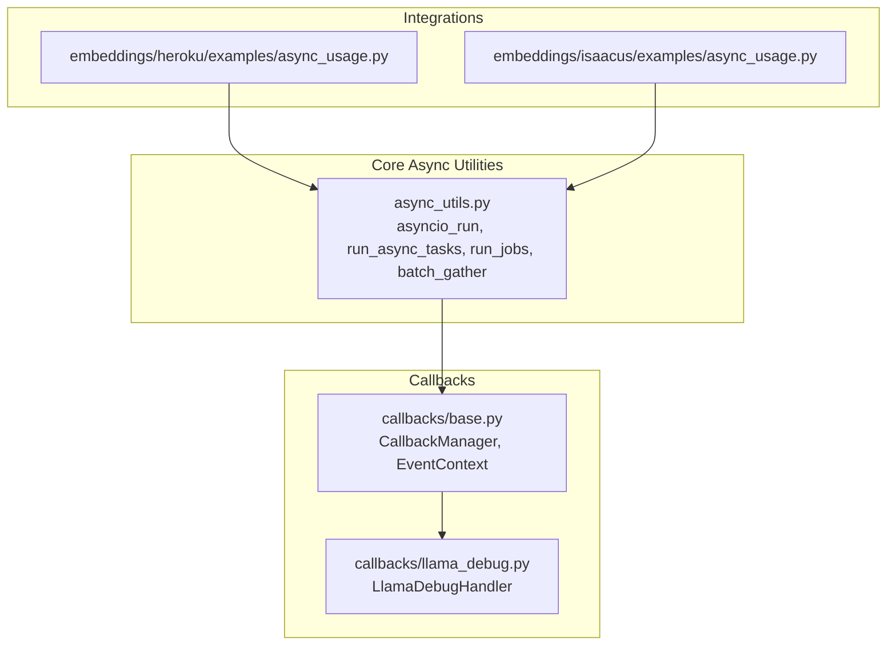
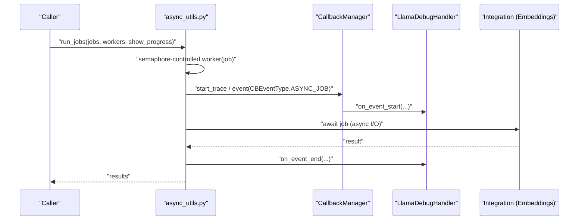
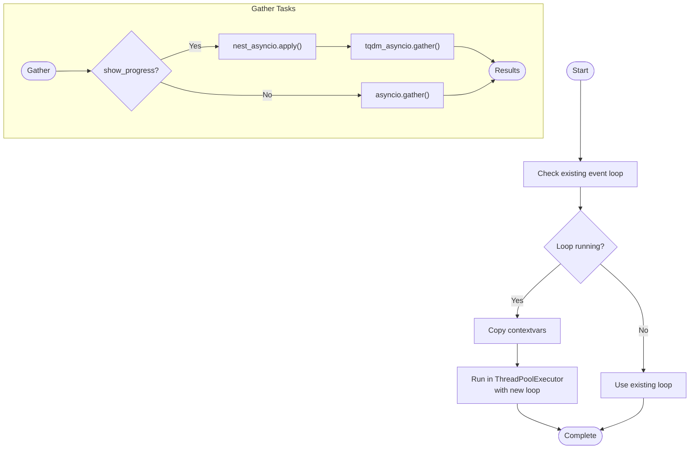
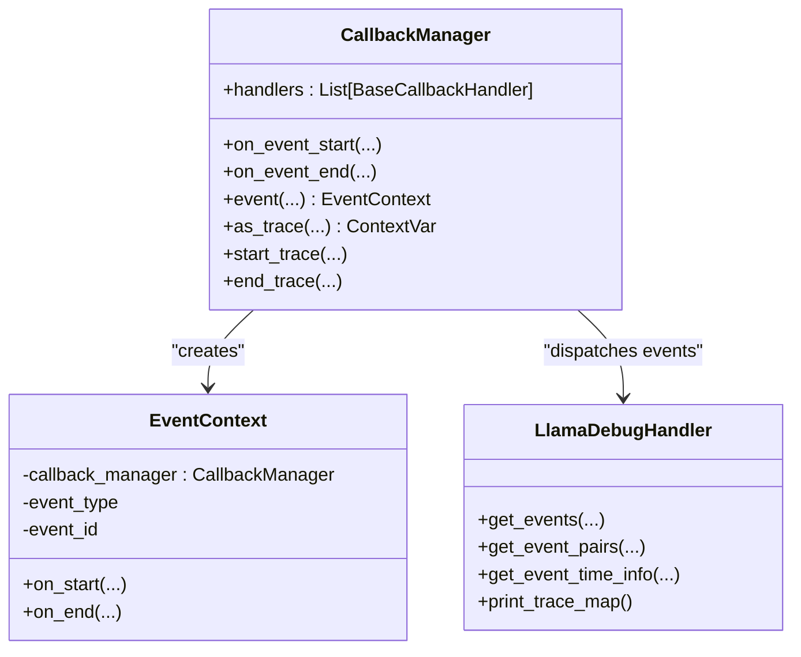
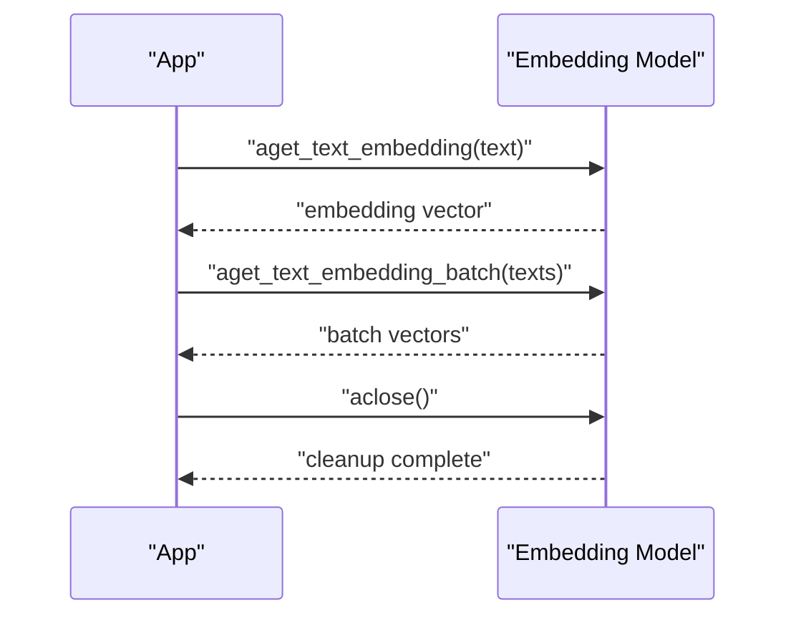
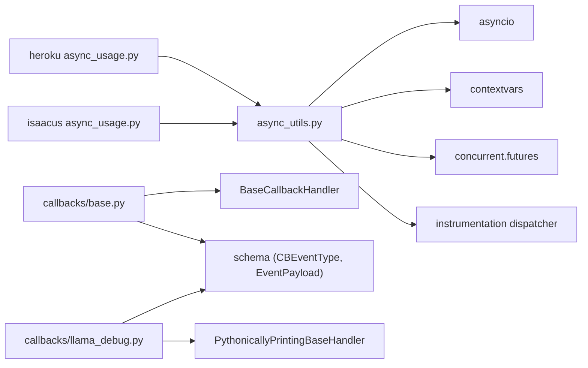

# Async Processing

<cite>
**Referenced Files in This Document**
- [async_utils.py](file://llama-index-core/llama_index/core/async_utils.py)
- [base.py](file://llama-index-core/llama_index/core/callbacks/base.py)
- [llama_debug.py](file://llama-index-core/llama_index/core/callbacks/llama_debug.py)
- [async_usage.py](file://llama-index-integrations/embeddings/llama-index-embeddings-heroku/examples/async_usage.py)
- [async_usage.py](file://llama-index-integrations/embeddings/llama-index-embeddings-isaacus/examples/async_usage.py)
- [test_async_utils.py](file://llama-index-core/tests/test_async_utils.py)
</cite>

## Table of Contents
1. [Introduction](#introduction)
2. [Project Structure](#project-structure)
3. [Core Components](#core-components)
4. [Architecture Overview](#architecture-overview)
5. [Detailed Component Analysis](#detailed-component-analysis)
6. [Dependency Analysis](#dependency-analysis)
7. [Performance Considerations](#performance-considerations)
8. [Troubleshooting Guide](#troubleshooting-guide)
9. [Conclusion](#conclusion)
10. [Appendices](#appendices)

## Introduction
This document focuses on asynchronous processing optimization in LlamaIndex. It covers async utility functions, concurrent execution patterns, and async callback handling. It explains async LLM operations, parallel retrieval strategies, and non-blocking I/O patterns. It also addresses async context management, exception handling in async operations, and async resource cleanup. Practical examples demonstrate async ingestion pipelines, concurrent query processing, and async callback handlers. Finally, it provides guidance on performance monitoring, deadlock prevention, async debugging techniques, and scaling async operations with resource pools.

## Project Structure
LlamaIndex’s async capabilities are centered around:
- Core async utilities for running and batching coroutines, controlling concurrency, and integrating progress bars
- A robust callback system for tracing and observing async workloads
- Integration examples showing async I/O and resource lifecycle management

**Diagram sources**
- [async_utils.py](file://llama-index-core/llama_index/core/async_utils.py#L1-L175)
- [base.py](file://llama-index-core/llama_index/core/callbacks/base.py#L1-L303)
- [llama_debug.py](file://llama-index-core/llama_index/core/callbacks/llama_debug.py#L1-L211)
- [async_usage.py](file://llama-index-integrations/embeddings/llama-index-embeddings-heroku/examples/async_usage.py#L1-L55)
- [async_usage.py](file://llama-index-integrations/embeddings/llama-index-embeddings-isaacus/examples/async_usage.py#L1-L68)

**Section sources**
- [async_utils.py](file://llama-index-core/llama_index/core/async_utils.py#L1-L175)
- [base.py](file://llama-index-core/llama_index/core/callbacks/base.py#L1-L303)
- [llama_debug.py](file://llama-index-core/llama_index/core/callbacks/llama_debug.py#L1-L211)
- [async_usage.py](file://llama-index-integrations/embeddings/llama-index-embeddings-heroku/examples/async_usage.py#L1-L55)
- [async_usage.py](file://llama-index-integrations/embeddings/llama-index-embeddings-isaacus/examples/async_usage.py#L1-L68)

## Core Components
- Async utilities
  - Non-blocking entry: runs a coroutine in an existing or new event loop, with context propagation and nested-loop support
  - Task orchestration: gather tasks with optional progress bars and fallbacks
  - Concurrency control: worker pools via semaphores with configurable limits
  - Batch execution: chunked gathering to avoid unbounded concurrency
- Callback system
  - Centralized callback manager for event start/end and trace lifecycle
  - Event context wrapper for safe start/end semantics and exception-aware closing
  - Debug handler for time-based stats, event pairing, and trace visualization

Key APIs and responsibilities:
- asyncio_run: robust coroutine runner handling nested loops and contextvars
- run_async_tasks: gather with optional tqdm integration and fallback
- run_jobs: worker-limited async execution with optional progress
- batch_gather: chunked gathering for large task lists
- CallbackManager: event dispatching, trace stack, and context managers
- LlamaDebugHandler: event timing, pairing, and trace printing

**Section sources**
- [async_utils.py](file://llama-index-core/llama_index/core/async_utils.py#L25-L175)
- [base.py](file://llama-index-core/llama_index/core/callbacks/base.py#L28-L303)
- [llama_debug.py](file://llama-index-core/llama_index/core/callbacks/llama_debug.py#L17-L211)

## Architecture Overview
The async runtime integrates with the callback system to trace and monitor long-running operations. Integrations expose async I/O methods and require explicit resource cleanup.

**Diagram sources**
- [async_utils.py](file://llama-index-core/llama_index/core/async_utils.py#L137-L175)
- [base.py](file://llama-index-core/llama_index/core/callbacks/base.py#L88-L143)
- [llama_debug.py](file://llama-index-core/llama_index/core/callbacks/llama_debug.py#L59-L104)

## Detailed Component Analysis

### Async Utilities: Orchestration and Concurrency
- asyncio_run
  - Detects existing loops, supports nested loops via thread execution with contextvar snapshot, and falls back to asyncio.run when needed
  - Raises actionable errors for nested async scenarios
- run_async_tasks
  - Gathers tasks with optional tqdm integration in notebook contexts; falls back gracefully if tqdm is unavailable
- run_jobs
  - Worker-limited execution via asyncio.Semaphore
  - Optional progress bar integration; spans decorated for instrumentation
- batch_gather
  - Processes tasks in fixed-size batches to avoid overwhelming resources
- chunks
  - Pads partial batches for uniform processing

**Diagram sources**
- [async_utils.py](file://llama-index-core/llama_index/core/async_utils.py#L25-L100)

**Section sources**
- [async_utils.py](file://llama-index-core/llama_index/core/async_utils.py#L25-L175)
- [test_async_utils.py](file://llama-index-core/tests/test_async_utils.py#L1-L40)

### Callback System: Tracing and Observability
- CallbackManager
  - Manages handlers and maintains trace stacks per task/thread via context variables
  - Provides event context manager ensuring on_start/on_end semantics and exception-aware closing
  - Supports nested traces with trace IDs and hierarchical trace maps
- LlamaDebugHandler
  - Collects event pairs by type and ID, computes time statistics, and prints trace maps
  - Useful for performance monitoring and debugging async workflows

**Diagram sources**
- [base.py](file://llama-index-core/llama_index/core/callbacks/base.py#L28-L303)
- [llama_debug.py](file://llama-index-core/llama_index/core/callbacks/llama_debug.py#L17-L211)

**Section sources**
- [base.py](file://llama-index-core/llama_index/core/callbacks/base.py#L28-L303)
- [llama_debug.py](file://llama-index-core/llama_index/core/callbacks/llama_debug.py#L17-L211)

### Async Resource Lifecycle and Non-blocking I/O
- Embedding integrations expose aget_text_embedding and aget_text_embedding_batch for non-blocking I/O
- aclose ensures proper cleanup of async clients
- Examples demonstrate per-item and batch embedding generation, followed by similarity computations

**Diagram sources**
- [async_usage.py](file://llama-index-integrations/embeddings/llama-index-embeddings-heroku/examples/async_usage.py#L8-L55)
- [async_usage.py](file://llama-index-integrations/embeddings/llama-index-embeddings-isaacus/examples/async_usage.py#L9-L68)

**Section sources**
- [async_usage.py](file://llama-index-integrations/embeddings/llama-index-embeddings-heroku/examples/async_usage.py#L1-L55)
- [async_usage.py](file://llama-index-integrations/embeddings/llama-index-embeddings-isaacus/examples/async_usage.py#L1-L68)

### Practical Patterns and Examples
- Concurrent ingestion pipeline
  - Use run_jobs to process nodes or chunks with bounded concurrency
  - Wrap each ingestion step with callback events for visibility
- Concurrent query processing
  - Use run_async_tasks or run_jobs to parallelize queries against retrievers or LLMs
  - Apply batch_gather for large query sets to avoid overload
- Async callback handlers
  - Add LlamaDebugHandler to collect timing and trace information
  - Use CallbackManager event context for scoped tracing around expensive steps

[No sources needed since this section synthesizes patterns without analyzing specific files]

## Dependency Analysis
- async_utils depends on asyncio, contextvars, concurrent.futures, and instrumentation dispatcher
- CallbackManager composes BaseCallbackHandler implementations and uses contextvars for trace isolation
- LlamaDebugHandler extends a printing base handler and relies on callback schema types
- Integration examples depend on embedding models’ async APIs and call aclose for cleanup

**Diagram sources**
- [async_utils.py](file://llama-index-core/llama_index/core/async_utils.py#L1-L175)
- [base.py](file://llama-index-core/llama_index/core/callbacks/base.py#L1-L303)
- [llama_debug.py](file://llama-index-core/llama_index/core/callbacks/llama_debug.py#L1-L211)
- [async_usage.py](file://llama-index-integrations/embeddings/llama-index-embeddings-heroku/examples/async_usage.py#L1-L55)
- [async_usage.py](file://llama-index-integrations/embeddings/llama-index-embeddings-isaacus/examples/async_usage.py#L1-L68)

**Section sources**
- [async_utils.py](file://llama-index-core/llama_index/core/async_utils.py#L1-L175)
- [base.py](file://llama-index-core/llama_index/core/callbacks/base.py#L1-L303)
- [llama_debug.py](file://llama-index-core/llama_index/core/callbacks/llama_debug.py#L1-L211)
- [async_usage.py](file://llama-index-integrations/embeddings/llama-index-embeddings-heroku/examples/async_usage.py#L1-L55)
- [async_usage.py](file://llama-index-integrations/embeddings/llama-index-embeddings-isaacus/examples/async_usage.py#L1-L68)

## Performance Considerations
- Concurrency limits
  - Use run_jobs with a tuned workers parameter to balance throughput and resource contention
- Progress monitoring
  - Enable show_progress to visualize completion; fallback gracefully when tqdm is unavailable
- Batch sizing
  - Use batch_gather to process large task lists without overwhelming downstream systems
- Trace overhead
  - Keep trace depth reasonable; use CallbackManager event context to scope expensive traces

[No sources needed since this section provides general guidance]

## Troubleshooting Guide
- Nested async loops
  - asyncio_run raises a clear message suggesting nest_asyncio or async entry methods
- Context propagation
  - asyncio_run copies contextvars when a loop is already running; tests validate this behavior
- Callback exceptions
  - EventContext ensures on_end is called even on exceptions; exceptions are recorded via EventPayload
- Resource cleanup
  - Integrations require aclose to finalize async clients; examples demonstrate this pattern

**Section sources**
- [async_utils.py](file://llama-index-core/llama_index/core/async_utils.py#L57-L66)
- [test_async_utils.py](file://llama-index-core/tests/test_async_utils.py#L21-L40)
- [base.py](file://llama-index-core/llama_index/core/callbacks/base.py#L174-L192)
- [async_usage.py](file://llama-index-integrations/embeddings/llama-index-embeddings-heroku/examples/async_usage.py#L48-L51)

## Conclusion
LlamaIndex provides a cohesive async toolkit: robust coroutine runners, controlled concurrency, and powerful callback-driven observability. By combining run_jobs, run_async_tasks, and batch_gather with CallbackManager and LlamaDebugHandler, developers can implement efficient, observable, and resilient async pipelines. Integrations consistently expose async I/O and require explicit cleanup, reinforcing predictable resource management.

[No sources needed since this section summarizes without analyzing specific files]

## Appendices
- Practical recipes
  - Async ingestion: chunk tasks, run with run_jobs, wrap steps with callback events
  - Concurrent queries: batch with run_async_tasks or run_jobs, apply LlamaDebugHandler for timing
  - Resource cleanup: always call aclose after async operations complete

[No sources needed since this section provides general guidance]