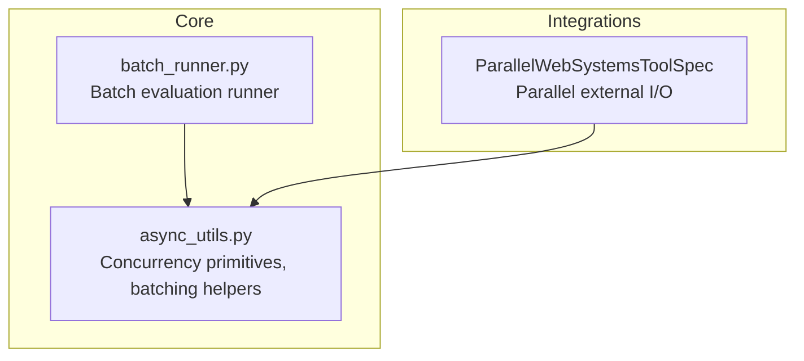
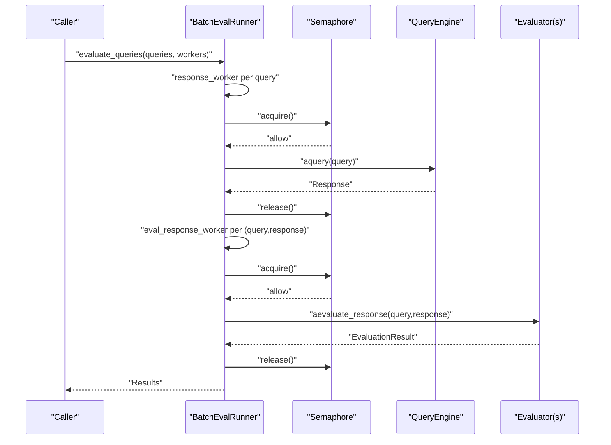
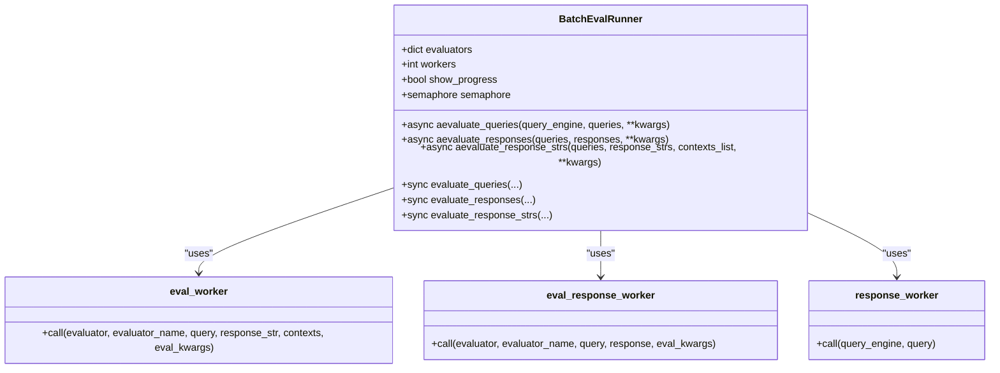
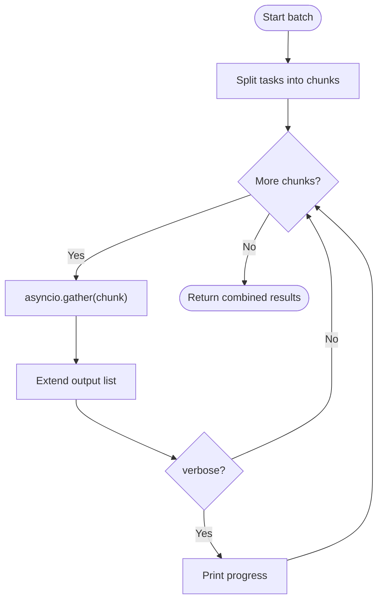
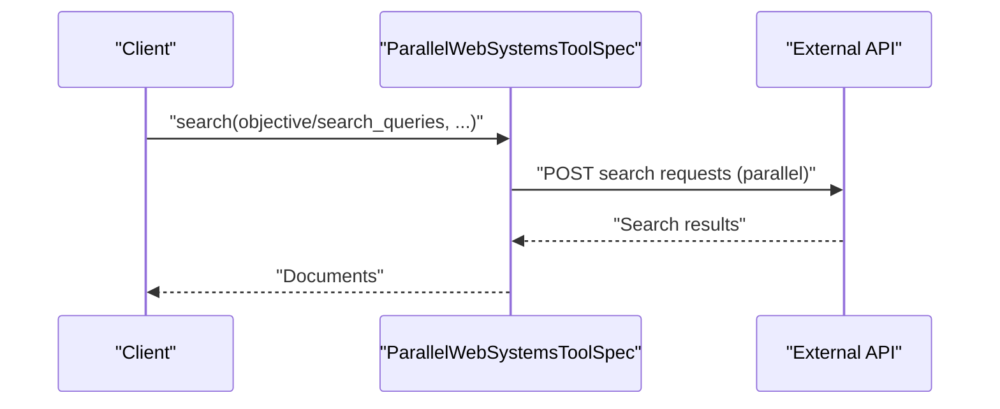
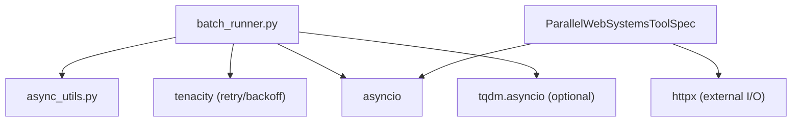

# Batch Processing

<cite>
**Referenced Files in This Document**
- [batch_runner.py](file://llama-index-core/llama_index/core/evaluation/batch_runner.py)
- [async_utils.py](file://llama-index-core/llama_index/core/async_utils.py)
- [test_tools_parallel_web_systems.py](file://llama-index-integrations/tools/llama-index-tools-parallel-web-systems/tests/test_tools_parallel_web_systems.py)
</cite>

## Table of Contents
1. [Introduction](#introduction)
2. [Project Structure](#project-structure)
3. [Core Components](#core-components)
4. [Architecture Overview](#architecture-overview)
5. [Detailed Component Analysis](#detailed-component-analysis)
6. [Dependency Analysis](#dependency-analysis)
7. [Performance Considerations](#performance-considerations)
8. [Troubleshooting Guide](#troubleshooting-guide)
9. [Conclusion](#conclusion)
10. [Appendices](#appendices)

## Introduction
This document provides a comprehensive guide to batch processing optimization in LlamaIndex. It focuses on techniques for optimizing batch sizes, tuning throughput, and enabling concurrent processing across ingestion pipelines, retrieval operations, and response synthesis. It also covers memory-efficient batch processing, pipeline parallelization, resource allocation strategies, practical configuration examples, monitoring throughput metrics, and I/O optimization. Finally, it outlines approaches for large dataset processing, streaming batch patterns, adaptive batching algorithms, and performance benchmarking/scaling guidelines.

## Project Structure
The repository organizes batch-related capabilities primarily in the core asynchronous utilities and evaluation modules, with integrations demonstrating parallel external I/O operations. The following diagram highlights the relevant modules and their roles in batch processing.

**Diagram sources**
- [async_utils.py](file://llama-index-core/llama_index/core/async_utils.py#L103-L175)
- [batch_runner.py](file://llama-index-core/llama_index/core/evaluation/batch_runner.py#L75-L444)
- [test_tools_parallel_web_systems.py](file://llama-index-integrations/tools/llama-index-tools-parallel-web-systems/tests/test_tools_parallel_web_systems.py#L1-L231)

**Section sources**
- [async_utils.py](file://llama-index-core/llama_index/core/async_utils.py#L1-L175)
- [batch_runner.py](file://llama-index-core/llama_index/core/evaluation/batch_runner.py#L1-L444)
- [test_tools_parallel_web_systems.py](file://llama-index-integrations/tools/llama-index-tools-parallel-web-systems/tests/test_tools_parallel_web_systems.py#L1-L231)

## Core Components
- Concurrency primitives and batching helpers:
  - Semaphore-based worker pools for controlled concurrency.
  - Chunking utilities for batching iterable workloads.
  - Asynchronous task runners with optional progress bars.
- Batch evaluation runner:
  - Orchestrates parallel evaluation of queries, responses, and contexts.
  - Supports configurable worker counts and retry/backoff policies.
  - Provides synchronous and asynchronous entry points.

Key capabilities:
- Worker-controlled concurrency via semaphores.
- Batched gathering of coroutines with chunking.
- Progress reporting for long-running batches.
- Validation and alignment of input sequences for consistent batching.

**Section sources**
- [async_utils.py](file://llama-index-core/llama_index/core/async_utils.py#L103-L175)
- [batch_runner.py](file://llama-index-core/llama_index/core/evaluation/batch_runner.py#L75-L444)

## Architecture Overview
The batch processing architecture centers around two primary mechanisms:
- Worker pools with semaphores to cap concurrency and prevent resource exhaustion.
- Chunked gathering of coroutines to process large sets of tasks in batches, reducing memory pressure and improving throughput.

**Diagram sources**
- [batch_runner.py](file://llama-index-core/llama_index/core/evaluation/batch_runner.py#L65-L73)
- [batch_runner.py](file://llama-index-core/llama_index/core/evaluation/batch_runner.py#L319-L348)
- [batch_runner.py](file://llama-index-core/llama_index/core/evaluation/batch_runner.py#L261-L317)

## Detailed Component Analysis

### BatchEvalRunner
The BatchEvalRunner coordinates batched evaluation across multiple evaluators and query engines. It supports:
- Evaluating precomputed responses or fetching responses via a query engine.
- Configurable worker count via a semaphore to control concurrency.
- Retry/backoff for robustness during evaluation.
- Input validation to ensure consistent lengths across inputs.

**Diagram sources**
- [batch_runner.py](file://llama-index-core/llama_index/core/evaluation/batch_runner.py#L75-L444)

Practical configuration tips:
- Set workers to match CPU-bound or I/O-bound characteristics of downstream systems (e.g., embedding or LLM APIs).
- Use retry/backoff to mitigate transient failures in evaluation.
- Align input sequences (queries, responses, contexts) to avoid misalignment.

**Section sources**
- [batch_runner.py](file://llama-index-core/llama_index/core/evaluation/batch_runner.py#L75-L444)

### Async Utilities: Concurrency and Batching
The async utilities module provides:
- Semaphore-based worker pools for controlled concurrency.
- Chunked iteration over iterables to form batches.
- Batched gathering of coroutines with optional verbose progress.
- Unified async execution with fallbacks for nested event loops and Jupyter environments.

**Diagram sources**
- [async_utils.py](file://llama-index-core/llama_index/core/async_utils.py#L103-L118)

Guidelines:
- Tune batch_size to balance memory footprint and throughput.
- Use run_jobs for uniform worker pools across heterogeneous tasks.
- Enable progress bars in interactive environments for visibility.

**Section sources**
- [async_utils.py](file://llama-index-core/llama_index/core/async_utils.py#L103-L175)

### Parallel External I/O Example
The ParallelWebSystems integration demonstrates parallel external I/O operations. While not a native LlamaIndex batcher, it illustrates how to parallelize network requests and handle errors gracefully, which is essential for building robust batch pipelines.

**Diagram sources**
- [test_tools_parallel_web_systems.py](file://llama-index-integrations/tools/llama-index-tools-parallel-web-systems/tests/test_tools_parallel_web_systems.py#L30-L114)

**Section sources**
- [test_tools_parallel_web_systems.py](file://llama-index-integrations/tools/llama-index-tools-parallel-web-systems/tests/test_tools_parallel_web_systems.py#L1-L231)

## Dependency Analysis
The batch processing stack relies on:
- asyncio for concurrency and task orchestration.
- tenacity for retry/backoff in evaluation workers.
- tqdm.asyncio for optional progress reporting.
- httpx for external I/O in integrations.

**Diagram sources**
- [batch_runner.py](file://llama-index-core/llama_index/core/evaluation/batch_runner.py#L1-L10)
- [async_utils.py](file://llama-index-core/llama_index/core/async_utils.py#L1-L22)
- [test_tools_parallel_web_systems.py](file://llama-index-integrations/tools/llama-index-tools-parallel-web-systems/tests/test_tools_parallel_web_systems.py#L43-L114)

**Section sources**
- [batch_runner.py](file://llama-index-core/llama_index/core/evaluation/batch_runner.py#L1-L10)
- [async_utils.py](file://llama-index-core/llama_index/core/async_utils.py#L1-L22)
- [test_tools_parallel_web_systems.py](file://llama-index-integrations/tools/llama-index-tools-parallel-web-systems/tests/test_tools_parallel_web_systems.py#L43-L114)

## Performance Considerations
- Throughput tuning
  - Control concurrency via workers to match downstream capacity (e.g., embedding or LLM rate limits).
  - Use batch_gather with tuned batch_size to reduce overhead and manage memory spikes.
  - Prefer run_jobs for uniform worker pools across diverse tasks.
- Memory efficiency
  - Chunk large task lists to avoid loading all items into memory simultaneously.
  - Release resources promptly after gathering each chunk.
- I/O optimization
  - Parallelize external I/O where safe and permitted.
  - Apply retry/backoff for transient failures.
- Monitoring
  - Enable progress bars in interactive environments to track throughput.
  - Log completion rates and error distributions for diagnostics.

[No sources needed since this section provides general guidance]

## Troubleshooting Guide
Common issues and remedies:
- Nested async event loops
  - Use the unified async runner to handle nested loops safely.
- Progress reporting failures
  - Fallback to standard gather when tqdm is unavailable.
- Misaligned inputs
  - Validate and align input sequences before batching.
- External API errors
  - Handle exceptions gracefully and continue processing remaining tasks.

**Section sources**
- [async_utils.py](file://llama-index-core/llama_index/core/async_utils.py#L25-L66)
- [batch_runner.py](file://llama-index-core/llama_index/core/evaluation/batch_runner.py#L112-L142)
- [test_tools_parallel_web_systems.py](file://llama-index-integrations/tools/llama-index-tools-parallel-web-systems/tests/test_tools_parallel_web_systems.py#L102-L114)

## Conclusion
LlamaIndex provides robust primitives for batch processing through semaphore-based worker pools, chunked gathering, and evaluation orchestration. By tuning workers, batch sizes, and leveraging progress reporting, teams can achieve significant throughput gains while maintaining stability. Integrations demonstrate how to parallelize external I/O safely. Adopt the guidelines in this document to optimize ingestion, retrieval, and synthesis pipelines for production-scale workloads.

[No sources needed since this section summarizes without analyzing specific files]

## Appendices

### Practical Configuration Recipes
- Configure workers for evaluation:
  - Set workers equal to the number of parallel evaluators or downstream API capacity.
  - Use retry/backoff to improve resilience.
- Tune batch size:
  - Start with moderate batch_size and increase until memory or latency targets are met.
  - Monitor throughput and adjust dynamically.
- Enable progress:
  - Turn on progress bars in interactive environments for visibility.
- Large datasets:
  - Use chunked iteration to process data in batches.
  - Stream results to disk or cloud storage incrementally.
- Adaptive batching:
  - Measure latency per batch and adjust batch_size accordingly.
  - Reduce batch_size under memory pressure or increased latency.
- Benchmarking and scaling:
  - Measure end-to-end latency and throughput across varying workers and batch sizes.
  - Scale horizontally by adding more workers up to the point where downstream APIs throttle.

[No sources needed since this section provides general guidance]