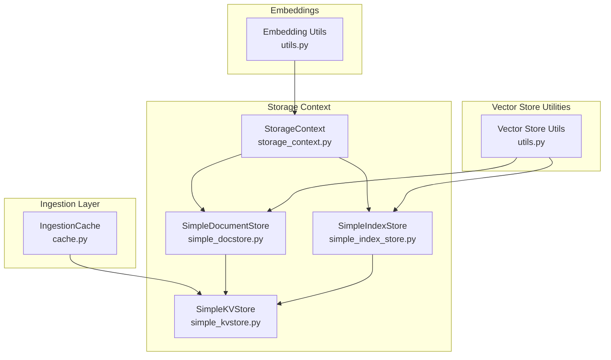
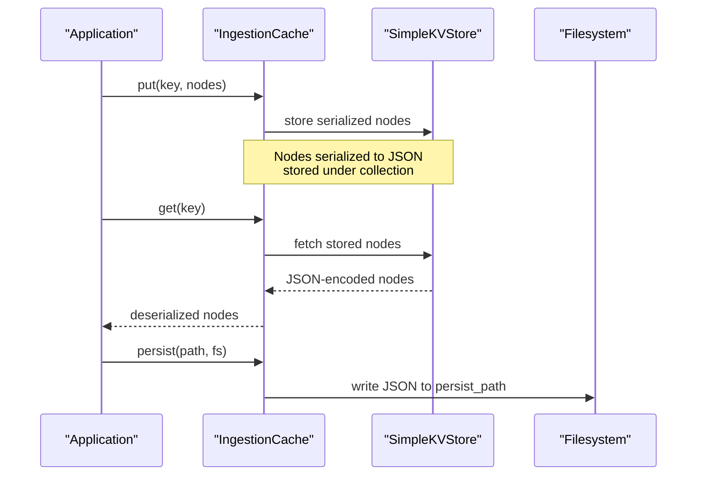
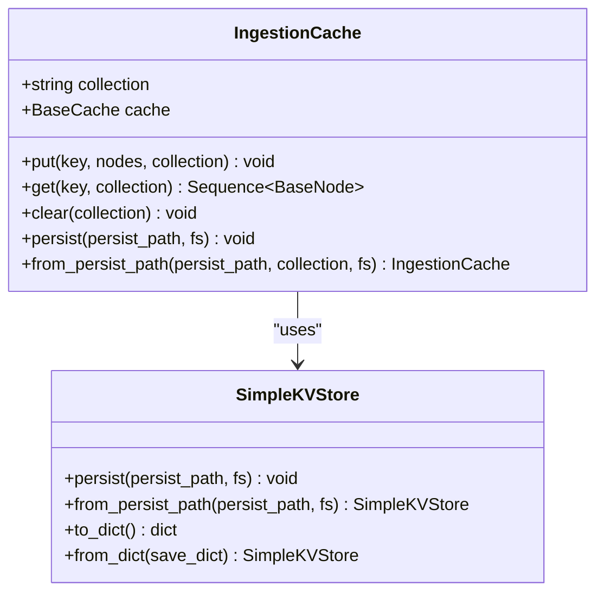
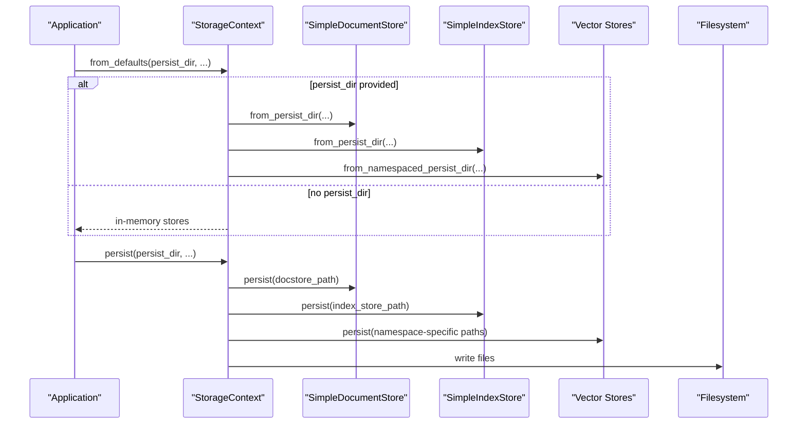
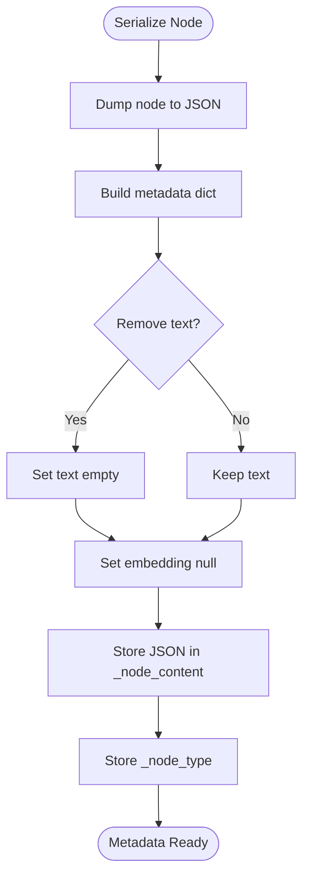
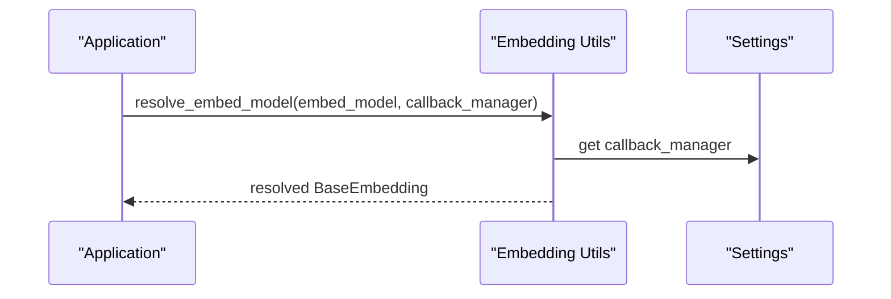
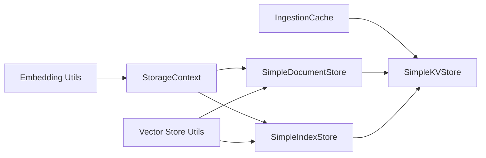

# Caching Strategies

<cite>
**Referenced Files in This Document**
- [cache.py](file://llama-index-core/llama_index/core/ingestion/cache.py)
- [storage_context.py](file://llama-index-core/llama_index/core/storage/storage_context.py)
- [simple_docstore.py](file://llama-index-core/llama_index/core/storage/docstore/simple_docstore.py)
- [simple_index_store.py](file://llama-index-core/llama_index/core/storage/index_store/simple_index_store.py)
- [simple_kvstore.py](file://llama-index-core/llama_index/core/storage/kvstore/simple_kvstore.py)
- [utils.py](file://llama-index-core/llama_index/core/vector_stores/utils.py)
- [utils.py](file://llama-index-core/llama_index/core/embeddings/utils.py)
- [test_with_cache.py](file://llama-index-core/tests/embeddings/test_with_cache.py)
- [test_cache.py](file://llama-index-core/tests/ingestion/test_cache.py)
</cite>

## Table of Contents
1. [Introduction](#introduction)
2. [Project Structure](#project-structure)
3. [Core Components](#core-components)
4. [Architecture Overview](#architecture-overview)
5. [Detailed Component Analysis](#detailed-component-analysis)
6. [Dependency Analysis](#dependency-analysis)
7. [Performance Considerations](#performance-considerations)
8. [Troubleshooting Guide](#troubleshooting-guide)
9. [Conclusion](#conclusion)
10. [Appendices](#appendices)

## Introduction
This document provides a comprehensive guide to caching optimization strategies in LlamaIndex. It focuses on three primary areas:
- Embedding cache management
- Retrieval result caching
- Pipeline intermediate result caching

It also covers cache invalidation strategies, TTL management, cache warming techniques, persistent caching solutions, distributed caching patterns, cache consistency models, serialization and compression considerations, monitoring cache hit rates, debugging, performance tuning, and capacity planning.

## Project Structure
LlamaIndex organizes caching and persistence across several subsystems:
- Ingestion cache for intermediate pipeline results (nodes)
- Storage context for persistent stores (docstore, index store, vector stores)
- KV store abstraction enabling simple in-memory and persisted storage
- Vector store utilities for metadata and node serialization
- Embedding utilities for model resolution and local caching

**Diagram sources**
- [cache.py](file://llama-index-core/llama_index/core/ingestion/cache.py#L17-L79)
- [storage_context.py](file://llama-index-core/llama_index/core/storage/storage_context.py#L52-L149)
- [simple_docstore.py](file://llama-index-core/llama_index/core/storage/docstore/simple_docstore.py#L20-L107)
- [simple_index_store.py](file://llama-index-core/llama_index/core/storage/index_store/simple_index_store.py#L19-L77)
- [simple_kvstore.py](file://llama-index-core/llama_index/core/storage/kvstore/simple_kvstore.py#L16-L66)
- [utils.py](file://llama-index-core/llama_index/core/vector_stores/utils.py#L40-L98)
- [utils.py](file://llama-index-core/llama_index/core/embeddings/utils.py#L31-L141)

**Section sources**
- [cache.py](file://llama-index-core/llama_index/core/ingestion/cache.py#L1-L79)
- [storage_context.py](file://llama-index-core/llama_index/core/storage/storage_context.py#L1-L278)
- [simple_docstore.py](file://llama-index-core/llama_index/core/storage/docstore/simple_docstore.py#L1-L107)
- [simple_index_store.py](file://llama-index-core/llama_index/core/storage/index_store/simple_index_store.py#L1-L77)
- [simple_kvstore.py](file://llama-index-core/llama_index/core/storage/kvstore/simple_kvstore.py#L1-L66)
- [utils.py](file://llama-index-core/llama_index/core/vector_stores/utils.py#L1-L235)
- [utils.py](file://llama-index-core/llama_index/core/embeddings/utils.py#L1-L141)

## Core Components
- IngestionCache: Manages caching of parsed nodes during ingestion. Supports put/get/clear/persist and loads from persisted path. Nodes are serialized via JSON before storage.
- SimpleKVStore: In-memory key-value store with optional persistence to a file-backed JSON. Used by docstore and index store abstractions.
- SimpleDocumentStore and SimpleIndexStore: Persistent stores backed by SimpleKVStore, enabling per-collection persistence and loading.
- StorageContext: Centralized container for docstore, index store, vector stores, and graph stores, with persistence and restoration routines.
- Vector Store Utils: Serialization helpers for nodes and metadata, including embedding field handling and metadata flattening.
- Embedding Utils: Model resolution and local model caching via a dedicated cache folder.

Key capabilities:
- Node caching during ingestion
- Persistent storage of documents and indices
- JSON-based serialization for nodes and metadata
- Optional filesystem-aware persistence

**Section sources**
- [cache.py](file://llama-index-core/llama_index/core/ingestion/cache.py#L17-L79)
- [simple_kvstore.py](file://llama-index-core/llama_index/core/storage/kvstore/simple_kvstore.py#L16-L66)
- [simple_docstore.py](file://llama-index-core/llama_index/core/storage/docstore/simple_docstore.py#L20-L107)
- [simple_index_store.py](file://llama-index-core/llama_index/core/storage/index_store/simple_index_store.py#L19-L77)
- [storage_context.py](file://llama-index-core/llama_index/core/storage/storage_context.py#L52-L149)
- [utils.py](file://llama-index-core/llama_index/core/vector_stores/utils.py#L40-L98)
- [utils.py](file://llama-index-core/llama_index/core/embeddings/utils.py#L31-L141)

## Architecture Overview
The caching architecture integrates ingestion-time node caching with persistent storage and vector store utilities.

**Diagram sources**
- [cache.py](file://llama-index-core/llama_index/core/ingestion/cache.py#L27-L62)
- [simple_kvstore.py](file://llama-index-core/llama_index/core/storage/kvstore/simple_kvstore.py#L35-L56)

## Detailed Component Analysis

### Ingestion Cache
Purpose:
- Cache parsed nodes during ingestion to avoid recomputation across runs.
- Provide simple CRUD operations and persistence.

Implementation highlights:
- Stores sequences of nodes under a collection key.
- Uses JSON serialization/deserialization for node interchange.
- Supports clearing and loading from persisted path.
- Persists only when underlying cache is the simple in-memory store.

**Diagram sources**
- [cache.py](file://llama-index-core/llama_index/core/ingestion/cache.py#L17-L79)
- [simple_kvstore.py](file://llama-index-core/llama_index/core/storage/kvstore/simple_kvstore.py#L16-L66)

**Section sources**
- [cache.py](file://llama-index-core/llama_index/core/ingestion/cache.py#L17-L79)

### Persistent Storage Context
Purpose:
- Encapsulates and persists the runtime state of docstore, index store, vector stores, and graph stores.
- Provides filesystem-aware persistence and restoration.

Key behaviors:
- Creates default in-memory stores or loads from persisted directories.
- Persists each component under a namespace-aware path.
- Supports dictionary-based serialization for simple stores.

**Diagram sources**
- [storage_context.py](file://llama-index-core/llama_index/core/storage/storage_context.py#L74-L149)
- [simple_docstore.py](file://llama-index-core/llama_index/core/storage/docstore/simple_docstore.py#L42-L82)
- [simple_index_store.py](file://llama-index-core/llama_index/core/storage/index_store/simple_index_store.py#L36-L58)

**Section sources**
- [storage_context.py](file://llama-index-core/llama_index/core/storage/storage_context.py#L52-L278)
- [simple_docstore.py](file://llama-index-core/llama_index/core/storage/docstore/simple_docstore.py#L20-L107)
- [simple_index_store.py](file://llama-index-core/llama_index/core/storage/index_store/simple_index_store.py#L19-L77)

### Vector Store Utilities and Node Serialization
Purpose:
- Provide robust serialization of nodes and metadata for vector stores.
- Support metadata filtering and backward-compatible conversions.

Highlights:
- Converts nodes to metadata dictionaries, storing node content as JSON strings.
- Removes embedding fields from metadata to avoid duplication.
- Supports text removal and flattening of metadata for indexing.

**Diagram sources**
- [utils.py](file://llama-index-core/llama_index/core/vector_stores/utils.py#L40-L75)

**Section sources**
- [utils.py](file://llama-index-core/llama_index/core/vector_stores/utils.py#L40-L98)

### Embedding Cache Management
Purpose:
- Resolve embedding models and cache local model artifacts to a cache directory.
- Reduce repeated downloads and initialization overhead.

Key points:
- Resolves default or local embedding models.
- Creates a cache folder under a global cache directory for model artifacts.
- Integrates with callback manager and settings.

**Diagram sources**
- [utils.py](file://llama-index-core/llama_index/core/embeddings/utils.py#L31-L141)

**Section sources**
- [utils.py](file://llama-index-core/llama_index/core/embeddings/utils.py#L31-L141)

## Dependency Analysis
- IngestionCache depends on SimpleKVStore for storage and JSON serialization/deserialization of nodes.
- SimpleDocumentStore and SimpleIndexStore depend on SimpleKVStore for persistence and loading.
- StorageContext orchestrates persistence and restoration of multiple stores and vector stores.
- Vector Store Utils depend on node schemas and metadata structures.
- Embedding Utils depend on settings and callback managers.

**Diagram sources**
- [cache.py](file://llama-index-core/llama_index/core/ingestion/cache.py#L17-L79)
- [simple_docstore.py](file://llama-index-core/llama_index/core/storage/docstore/simple_docstore.py#L20-L107)
- [simple_index_store.py](file://llama-index-core/llama_index/core/storage/index_store/simple_index_store.py#L19-L77)
- [storage_context.py](file://llama-index-core/llama_index/core/storage/storage_context.py#L52-L149)
- [utils.py](file://llama-index-core/llama_index/core/vector_stores/utils.py#L40-L98)
- [utils.py](file://llama-index-core/llama_index/core/embeddings/utils.py#L31-L141)

**Section sources**
- [cache.py](file://llama-index-core/llama_index/core/ingestion/cache.py#L17-L79)
- [simple_docstore.py](file://llama-index-core/llama_index/core/storage/docstore/simple_docstore.py#L20-L107)
- [simple_index_store.py](file://llama-index-core/llama_index/core/storage/index_store/simple_index_store.py#L19-L77)
- [storage_context.py](file://llama-index-core/llama_index/core/storage/storage_context.py#L52-L149)
- [utils.py](file://llama-index-core/llama_index/core/vector_stores/utils.py#L40-L98)
- [utils.py](file://llama-index-core/llama_index/core/embeddings/utils.py#L31-L141)

## Performance Considerations
- Node serialization cost: Storing entire node JSON strings increases storage but simplifies retrieval. Consider removing redundant text fields and avoiding embedding duplication in metadata.
- KV store persistence: JSON persistence is straightforward but may benefit from compression or binary formats for large datasets.
- Batch operations: Use batch sizes appropriate for your workload to reduce I/O overhead.
- Embedding model caching: Local model caching reduces network and disk churn for repeated runs.
- Vector store metadata: Flatten and minimize metadata to improve filter performance and reduce payload sizes.

[No sources needed since this section provides general guidance]

## Troubleshooting Guide
- Ingestion cache persistence warning: Only SimpleKVStore supports persistence; other caches skip persist calls. Verify cache type before persisting.
- JSON serialization errors: Ensure node fields are serializable; vector store utilities already handle JSON mode for node dumps.
- Storage context limitations: Dictionary-based serialization is only supported for simple stores. Avoid custom store types if you need to_dict/from_dict.
- Embedding model resolution failures: Confirm environment variables and installed packages for the chosen embedding backend.

**Section sources**
- [cache.py](file://llama-index-core/llama_index/core/ingestion/cache.py#L55-L62)
- [utils.py](file://llama-index-core/llama_index/core/vector_stores/utils.py#L48-L50)
- [storage_context.py](file://llama-index-core/llama_index/core/storage/storage_context.py#L204-L242)
- [utils.py](file://llama-index-core/llama_index/core/embeddings/utils.py#L43-L77)

## Conclusion
LlamaIndex provides a layered caching and persistence strategy:
- Ingestion-level caching for nodes using a simple KV store with JSON serialization.
- Persistent storage context for documents, indices, and vector stores with filesystem-aware persistence.
- Vector store utilities for robust node and metadata serialization.
- Embedding utilities for model resolution and local artifact caching.

By combining these components, you can implement effective cache warming, invalidation, and persistence strategies tailored to your workload while maintaining performance and consistency.

[No sources needed since this section summarizes without analyzing specific files]

## Appendices

### Practical Configuration Examples
- Configure ingestion cache:
  - Initialize IngestionCache with a collection name and optional cache backend.
  - Use put/get to cache and retrieve nodes; persist to a path for reuse.
  - Reference: [cache.py](file://llama-index-core/llama_index/core/ingestion/cache.py#L17-L79)

- Configure persistent storage context:
  - Use StorageContext.from_defaults with a persist_dir to enable persistence.
  - Call persist to serialize stores; restore via from_persist_dir.
  - Reference: [storage_context.py](file://llama-index-core/llama_index/core/storage/storage_context.py#L74-L149)

- Vector store serialization:
  - Use node_to_metadata_dict to prepare nodes for vector stores.
  - Reference: [utils.py](file://llama-index-core/llama_index/core/vector_stores/utils.py#L40-L75)

- Embedding model caching:
  - Resolve embedding models; local models are cached under a cache directory.
  - Reference: [utils.py](file://llama-index-core/llama_index/core/embeddings/utils.py#L107-L112)

### Monitoring Cache Hit Rates
- Instrument retrieval and embedding calls to track cache hits and misses.
- Use callback managers and metrics to measure effectiveness of caching layers.
- Reference: [utils.py](file://llama-index-core/llama_index/core/embeddings/utils.py#L138-L140)

### Cache Invalidation and TTL
- Manual invalidation: Clear collections or delete keys as needed.
- TTL: Implement TTL wrappers around cache entries if extending SimpleKVStore.
- Reference: [cache.py](file://llama-index-core/llama_index/core/ingestion/cache.py#L48-L53)

### Cache Warming
- Pre-populate IngestionCache with frequently accessed nodes.
- Warm vector store indices by ingesting representative data.
- Reference: [cache.py](file://llama-index-core/llama_index/core/ingestion/cache.py#L27-L34)

### Persistent and Distributed Patterns
- Persistent caching: Use StorageContext persistence for long-term reuse.
- Distributed caching: Extend SimpleKVStore with distributed backends (e.g., Redis, DynamoDB) and implement TTL and consistency policies.
- Reference: [simple_kvstore.py](file://llama-index-core/llama_index/core/storage/kvstore/simple_kvstore.py#L35-L56)

### Serialization, Compression, and Storage Optimization
- Prefer flattened metadata and minimal payloads.
- Compress JSON or adopt binary formats for large caches.
- Reference: [utils.py](file://llama-index-core/llama_index/core/vector_stores/utils.py#L26-L37)

### Testing Guidance
- Validate cache behavior with unit tests for ingestion and embeddings.
- Reference: [test_cache.py](file://llama-index-core/tests/ingestion/test_cache.py), [test_with_cache.py](file://llama-index-core/tests/embeddings/test_with_cache.py)