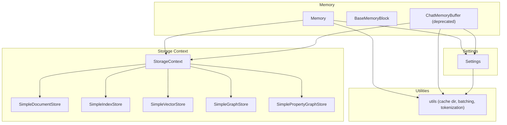
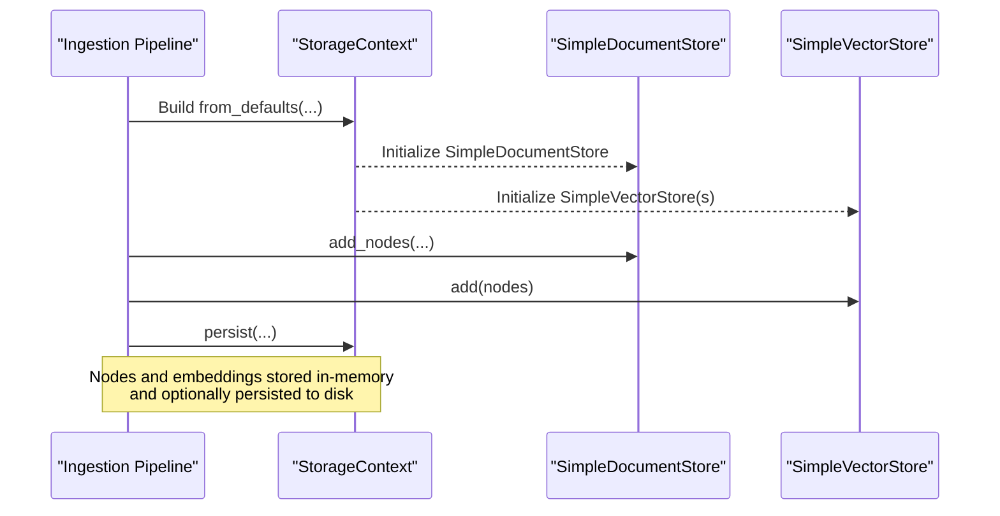
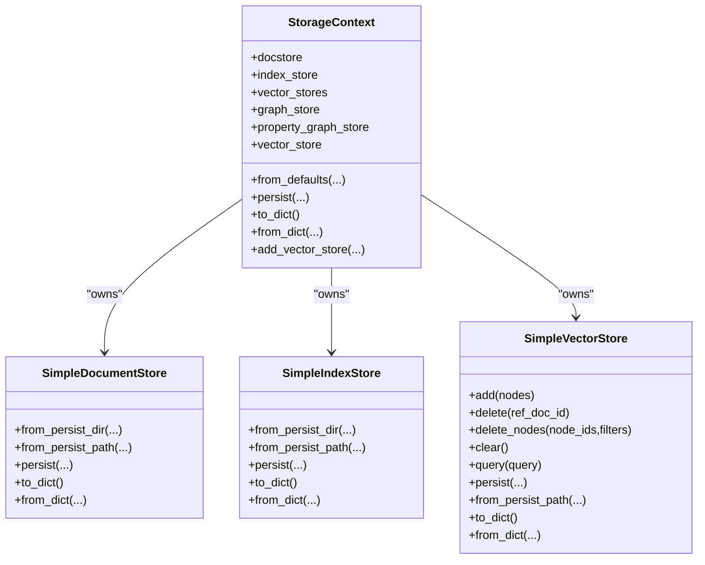
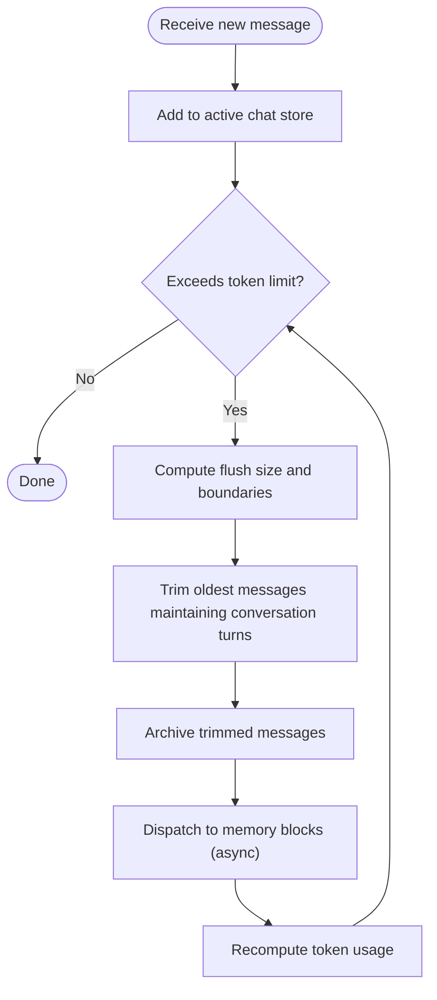
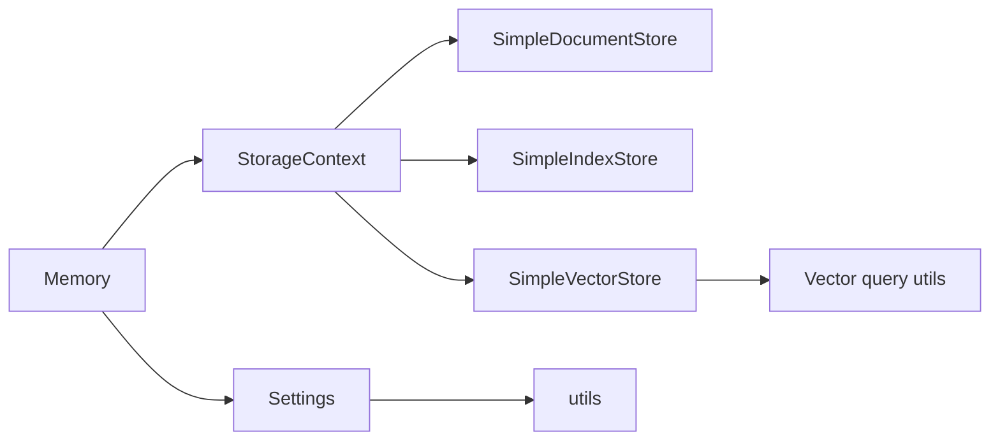

# Memory Management

<cite>
**Referenced Files in This Document**
- [storage_context.py](file://llama-index-core/llama_index/core/storage/storage_context.py)
- [simple_docstore.py](file://llama-index-core/llama_index/core/storage/docstore/simple_docstore.py)
- [simple_index_store.py](file://llama-index-core/llama_index/core/storage/index_store/simple_index_store.py)
- [simple.py](file://llama-index-core/llama_index/core/vector_stores/simple.py)
- [memory.py](file://llama-index-core/llama_index/core/memory/memory.py)
- [chat_memory_buffer.py](file://llama-index-core/llama_index/core/memory/chat_memory_buffer.py)
- [settings.py](file://llama-index-core/llama_index/core/settings.py)
- [utils.py](file://llama-index-core/llama_index/core/utils.py)
- [service_context.py](file://llama-index-core/llama_index/core/service_context.py)
</cite>

## Table of Contents
1. [Introduction](#introduction)
2. [Project Structure](#project-structure)
3. [Core Components](#core-components)
4. [Architecture Overview](#architecture-overview)
5. [Detailed Component Analysis](#detailed-component-analysis)
6. [Dependency Analysis](#dependency-analysis)
7. [Performance Considerations](#performance-considerations)
8. [Troubleshooting Guide](#troubleshooting-guide)
9. [Conclusion](#conclusion)
10. [Appendices](#appendices)

## Introduction
This document focuses on memory management optimization in LlamaIndex. It explains how the framework structures memory-sensitive subsystems—storage context, vector stores, document/index stores, and memory modules—and how to tune them for efficient ingestion and runtime behavior. Topics include garbage collection strategies, resource cleanup patterns, memory leak prevention, efficient data structures, object lifecycle management, and practical monitoring approaches.

## Project Structure
LlamaIndex organizes memory-related concerns into cohesive modules:
- Storage context aggregates stores for documents, indices, vector spaces, and graphs.
- Simple stores provide in-memory containers for nodes, indices, and embeddings.
- Memory modules manage chat histories and long-term memory blocks with token-aware eviction.
- Settings centralizes shared components (LLM, embeddings, tokenizer) to avoid redundant allocations.
- Utilities provide caching and persistence helpers.

**Diagram sources**
- [storage_context.py](file://llama-index-core/llama_index/core/storage/storage_context.py#L52-L149)
- [simple_docstore.py](file://llama-index-core/llama_index/core/storage/docstore/simple_docstore.py#L20-L102)
- [simple_index_store.py](file://llama-index-core/llama_index/core/storage/index_store/simple_index_store.py#L19-L76)
- [simple.py](file://llama-index-core/llama_index/core/vector_stores/simple.py#L64-L354)
- [memory.py](file://llama-index-core/llama_index/core/memory/memory.py#L179-L800)
- [chat_memory_buffer.py](file://llama-index-core/llama_index/core/memory/chat_memory_buffer.py#L19-L167)
- [settings.py](file://llama-index-core/llama_index/core/settings.py#L17-L248)
- [utils.py](file://llama-index-core/llama_index/core/utils.py#L424-L438)

**Section sources**
- [storage_context.py](file://llama-index-core/llama_index/core/storage/storage_context.py#L52-L149)
- [settings.py](file://llama-index-core/llama_index/core/settings.py#L17-L248)

## Core Components
- StorageContext: Aggregates and initializes document, index, vector, graph, and property graph stores. Supports persistence and namespace-aware vector store management.
- SimpleDocumentStore/SimpleIndexStore: Lightweight in-memory stores backed by a simple key-value store; supports persistence to disk via a filesystem abstraction.
- SimpleVectorStore: In-memory embedding store keyed by node IDs; supports deletion by reference document ID and metadata filters; provides query modes (top-K, MMR, learner-based).
- Memory: Orchestrates token-aware chat history management, FIFO queue trimming, and memory block waterfall to persistent stores. Integrates with a SQL-backed chat store.
- Settings: Centralizes LLM, embedding model, tokenizer, node parser, and prompt helper to minimize repeated initialization overhead.
- Utilities: Provides cache directory resolution, batching iterators, and tokenization helpers.

**Section sources**
- [storage_context.py](file://llama-index-core/llama_index/core/storage/storage_context.py#L52-L149)
- [simple_docstore.py](file://llama-index-core/llama_index/core/storage/docstore/simple_docstore.py#L20-L102)
- [simple_index_store.py](file://llama-index-core/llama_index/core/storage/index_store/simple_index_store.py#L19-L76)
- [simple.py](file://llama-index-core/llama_index/core/vector_stores/simple.py#L64-L354)
- [memory.py](file://llama-index-core/llama_index/core/memory/memory.py#L179-L800)
- [settings.py](file://llama-index-core/llama_index/core/settings.py#L17-L248)
- [utils.py](file://llama-index-core/llama_index/core/utils.py#L424-L438)

## Architecture Overview
The memory architecture couples storage context with runtime memory management:
- Ingestion writes nodes and embeddings into SimpleDocumentStore and SimpleVectorStore.
- Runtime queries pull from vector stores and augment prompts with memory blocks and chat history.
- Persistence ensures long-lived artifacts are serialized to disk or remote filesystems.

**Diagram sources**
- [storage_context.py](file://llama-index-core/llama_index/core/storage/storage_context.py#L74-L149)
- [simple_docstore.py](file://llama-index-core/llama_index/core/storage/docstore/simple_docstore.py#L32-L40)
- [simple.py](file://llama-index-core/llama_index/core/vector_stores/simple.py#L174-L189)

## Detailed Component Analysis

### Storage Context and Stores
- Purpose: Encapsulate all persistent stores and provide factory methods for default and persisted configurations.
- Key behaviors:
  - from_defaults constructs in-memory stores or loads from a persisted directory.
  - persist serializes each store to dedicated filenames under a directory or filesystem.
  - Namespaced vector stores enable multiple namespaces (e.g., default, image) under a single directory.
- Memory implications:
  - In-memory stores grow with dataset size; consider clearing or switching to external stores for large corpora.
  - Persistence is selective; only in-memory KV stores are persisted by default.

**Diagram sources**
- [storage_context.py](file://llama-index-core/llama_index/core/storage/storage_context.py#L52-L149)
- [simple_docstore.py](file://llama-index-core/llama_index/core/storage/docstore/simple_docstore.py#L20-L102)
- [simple_index_store.py](file://llama-index-core/llama_index/core/storage/index_store/simple_index_store.py#L19-L76)
- [simple.py](file://llama-index-core/llama_index/core/vector_stores/simple.py#L64-L354)

**Section sources**
- [storage_context.py](file://llama-index-core/llama_index/core/storage/storage_context.py#L74-L203)
- [simple_docstore.py](file://llama-index-core/llama_index/core/storage/docstore/simple_docstore.py#L42-L102)
- [simple_index_store.py](file://llama-index-core/llama_index/core/storage/index_store/simple_index_store.py#L36-L76)
- [simple.py](file://llama-index-core/llama_index/core/vector_stores/simple.py#L174-L242)

### Memory Module and Chat History Management
- Purpose: Manage token-aware chat history, enforce limits, and waterfall overflow to memory blocks.
- Key behaviors:
  - Estimates token counts per message/content block.
  - Maintains a FIFO queue with configurable flush size and chat-history token ratio.
  - Archives trimmed messages and dispatches them to memory blocks asynchronously.
  - Inserts memory content into either a system message or the latest user message based on insert method.
- Memory implications:
  - Prevents unbounded growth by trimming older turns and invoking memory blocks.
  - Uses a SQL-backed chat store to persist active and archived messages.

**Diagram sources**
- [memory.py](file://llama-index-core/llama_index/core/memory/memory.py#L655-L793)

**Section sources**
- [memory.py](file://llama-index-core/llama_index/core/memory/memory.py#L179-L800)

### Deprecated ChatMemoryBuffer
- Purpose: Legacy buffer for chat history with token limit enforcement.
- Behavior:
  - Enforces a token budget by dropping oldest messages while preserving conversation integrity.
  - Uses a tokenizer to estimate token counts.
- Memory implications:
  - Deprecated in favor of Memory; still useful for understanding historical patterns.

**Section sources**
- [chat_memory_buffer.py](file://llama-index-core/llama_index/core/memory/chat_memory_buffer.py#L19-L167)

### Settings and Shared Resources
- Purpose: Centralize LLM, embedding model, tokenizer, node parser, and prompt helper.
- Memory implications:
  - Lazy initialization prevents unnecessary allocations.
  - Reusing the same Settings instance avoids reloading tokenizers and models across components.

**Section sources**
- [settings.py](file://llama-index-core/llama_index/core/settings.py#L17-L248)

### Utilities and Caching
- Cache directory resolution: Ensures a platform-appropriate cache location and creates it if missing.
- Batching: Iterates over iterables in fixed-size batches to reduce memory spikes during processing.
- Tokenization: Provides a global tokenizer with caching and fallbacks.

**Section sources**
- [utils.py](file://llama-index-core/llama_index/core/utils.py#L424-L438)
- [utils.py](file://llama-index-core/llama_index/core/utils.py#L358-L371)
- [utils.py](file://llama-index-core/llama_index/core/utils.py#L401-L404)

### Deprecation Note: ServiceContext
- ServiceContext is deprecated in favor of Settings; using it raises explicit errors.
- Migration guidance is provided in the deprecation message.

**Section sources**
- [service_context.py](file://llama-index-core/llama_index/core/service_context.py#L13-L48)

## Dependency Analysis
- StorageContext depends on concrete store implementations and utilities for persistence.
- Memory depends on the chat store (SQL-backed), tokenizer, and Settings for LLM metadata.
- SimpleVectorStore depends on vector query utilities and metadata filtering helpers.
- Settings coordinates components and reduces duplication.

**Diagram sources**
- [storage_context.py](file://llama-index-core/llama_index/core/storage/storage_context.py#L52-L149)
- [memory.py](file://llama-index-core/llama_index/core/memory/memory.py#L179-L326)
- [simple.py](file://llama-index-core/llama_index/core/vector_stores/simple.py#L14-L31)
- [settings.py](file://llama-index-core/llama_index/core/settings.py#L17-L248)

**Section sources**
- [storage_context.py](file://llama-index-core/llama_index/core/storage/storage_context.py#L52-L149)
- [memory.py](file://llama-index-core/llama_index/core/memory/memory.py#L179-L326)
- [simple.py](file://llama-index-core/llama_index/core/vector_stores/simple.py#L14-L31)
- [settings.py](file://llama-index-core/llama_index/core/settings.py#L17-L248)

## Performance Considerations
- Prefer namespaced vector stores for multi-modal or multi-domain embeddings to isolate and scale memory usage.
- Use batched ingestion to reduce peak memory during add operations.
- Persist stores periodically to offload memory pressure; leverage from_persist_dir for incremental reuse.
- Tune Memory’s token_limit, token_flush_size, and chat_history_token_ratio to balance context retention and memory footprint.
- Reuse Settings to avoid reloading tokenizers and models; this reduces CPU and memory overhead.
- For large datasets, consider external stores (not covered here) to cap in-memory growth.

[No sources needed since this section provides general guidance]

## Troubleshooting Guide
Common memory issues and remedies:
- Unbounded growth in chat history:
  - Use Memory’s token-aware trimming and waterfall to memory blocks.
  - Adjust token_limit and token_flush_size to match model context windows.
- Excessive in-memory embeddings:
  - Clear SimpleVectorStore after indexing or switch to external vector stores.
  - Use delete_nodes or delete with filters to prune stale entries.
- High memory during ingestion:
  - Batch node processing and persist intermediate results.
  - Monitor tokenization overhead; ensure a cached tokenizer is used.
- Persistence failures:
  - Verify cache directory availability and permissions via utils.get_cache_dir.
  - Confirm persist paths and filesystem support for remote stores.

**Section sources**
- [memory.py](file://llama-index-core/llama_index/core/memory/memory.py#L655-L793)
- [simple.py](file://llama-index-core/llama_index/core/vector_stores/simple.py#L240-L242)
- [utils.py](file://llama-index-core/llama_index/core/utils.py#L424-L438)

## Conclusion
LlamaIndex provides a layered memory management strategy: in-memory stores for speed, token-aware trimming for chat history, and persistence for durability. By leveraging StorageContext, Memory, Settings, and utilities, developers can optimize ingestion throughput and runtime memory usage while preventing leaks and bottlenecks.

[No sources needed since this section summarizes without analyzing specific files]

## Appendices

### Practical Monitoring and Profiling Checklist
- Track active and archived message counts in the SQL-backed chat store.
- Measure token usage per query and per memory block to identify hotspots.
- Profile ingestion batch sizes and adjust to avoid memory spikes.
- Monitor vector store size and clear/delete stale entries periodically.
- Use cache directory utilities to locate and inspect persisted artifacts.

**Section sources**
- [memory.py](file://llama-index-core/llama_index/core/memory/memory.py#L607-L653)
- [simple.py](file://llama-index-core/llama_index/core/vector_stores/simple.py#L317-L354)
- [utils.py](file://llama-index-core/llama_index/core/utils.py#L424-L438)