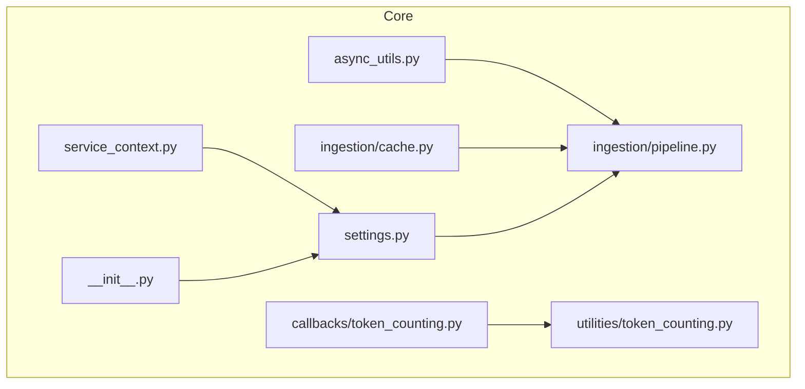
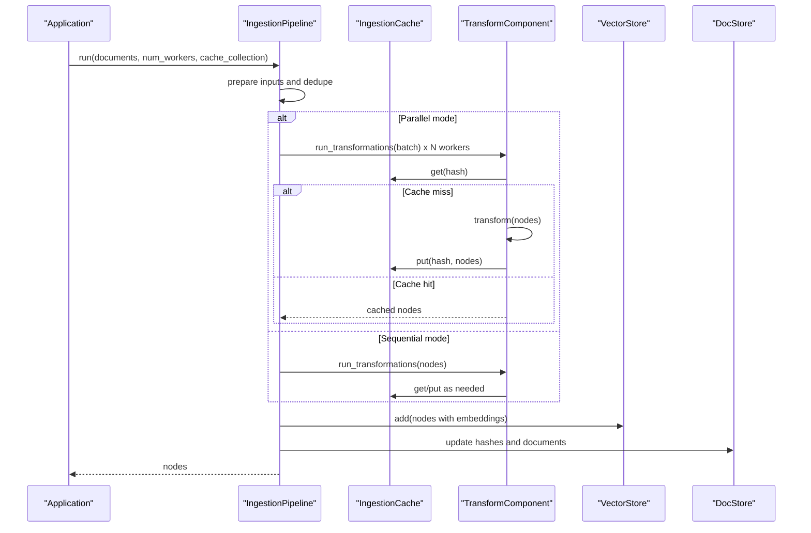
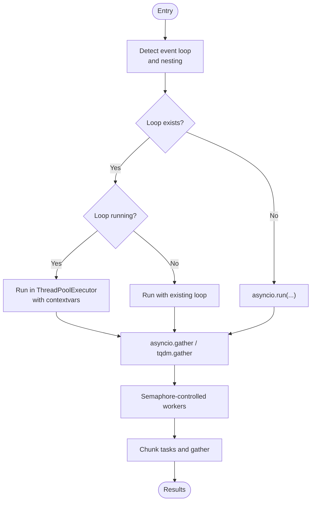
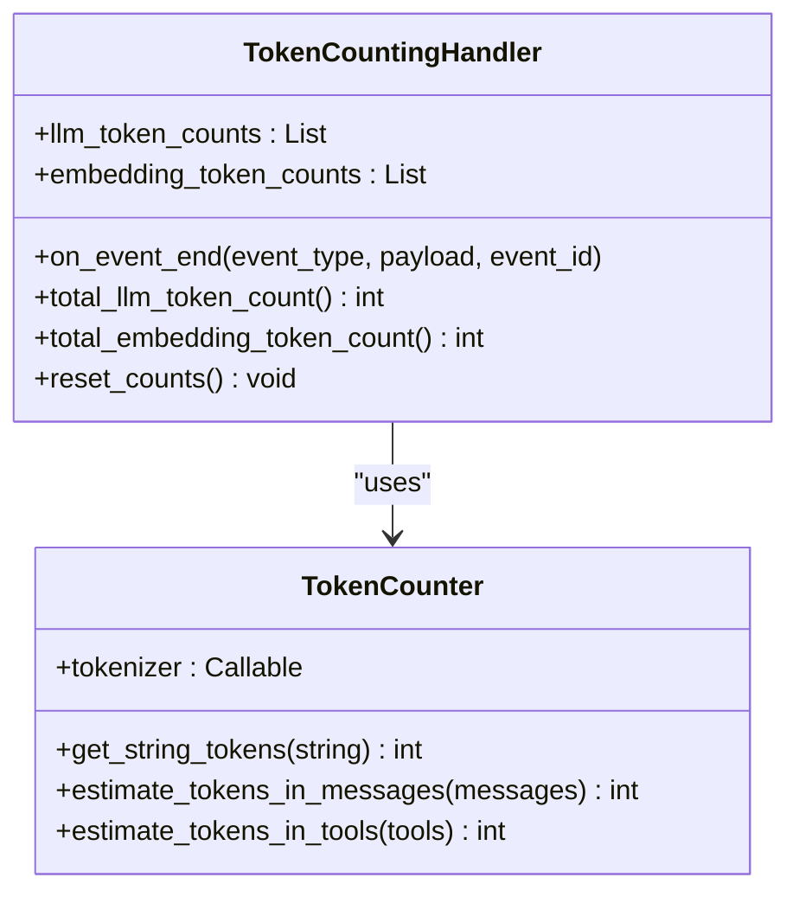
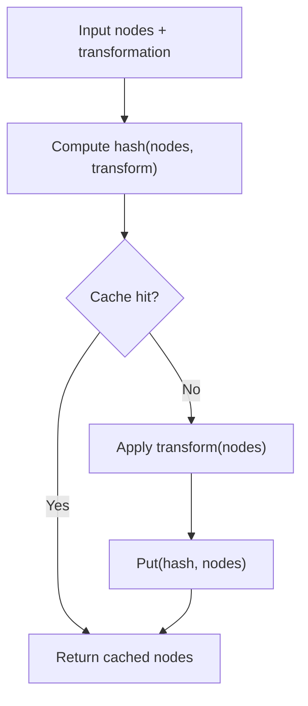
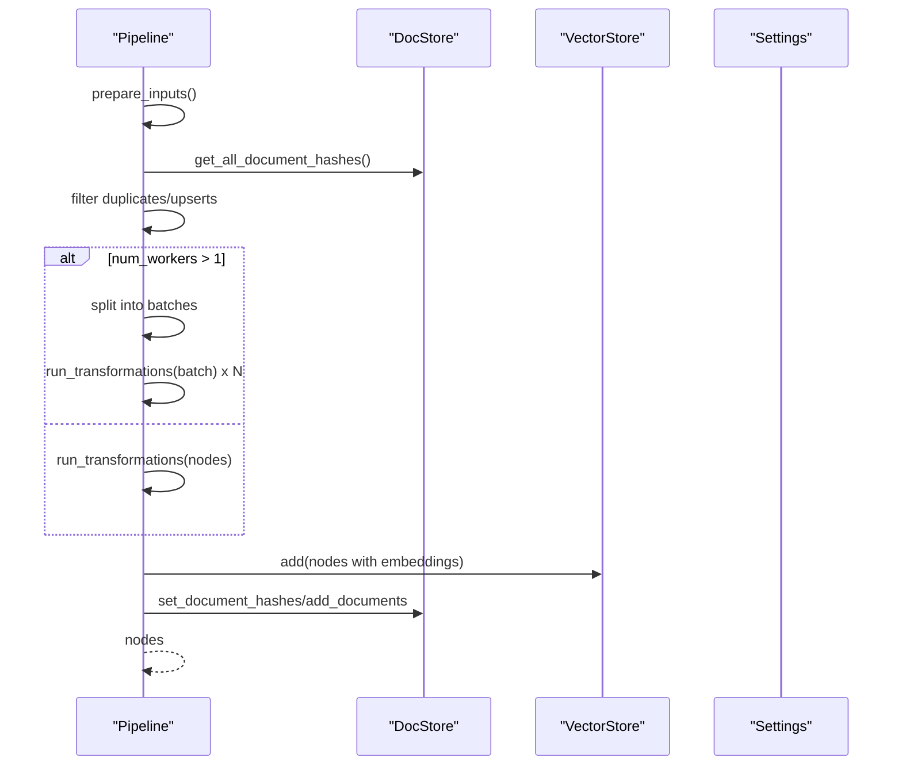
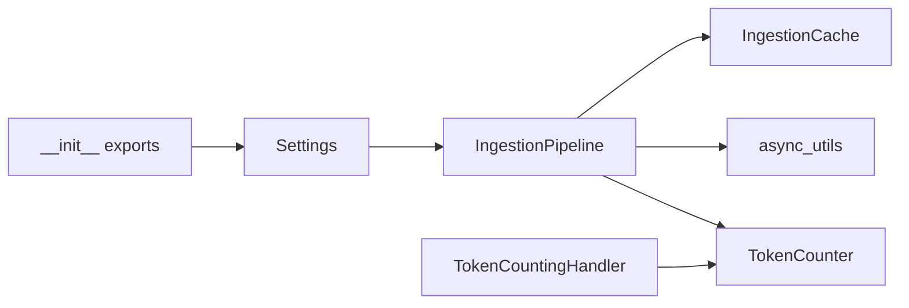

# Performance Optimization

<cite>
**Referenced Files in This Document**
- [async_utils.py](file://llama-index-core/llama_index/core/async_utils.py)
- [token_counting.py](file://llama-index-core/llama_index/core/callbacks/token_counting.py)
- [token_counting_util.py](file://llama-index-core/llama_index/core/utilities/token_counting.py)
- [cache.py](file://llama-index-core/llama_index/core/ingestion/cache.py)
- [pipeline.py](file://llama-index-core/llama_index/core/ingestion/pipeline.py)
- [settings.py](file://llama-index-core/llama_index/core/settings.py)
- [service_context.py](file://llama-index-core/llama_index/core/service_context.py)
- [__init__.py](file://llama-index-core/llama_index/core/__init__.py)
- [test_async_utils.py](file://llama-index-core/tests/test_async_utils.py)
- [test_simple_async.py](file://llama-index-core/tests/indices/vector_store/test_simple_async.py)
</cite>

## Table of Contents
1. [Introduction](#introduction)
2. [Project Structure](#project-structure)
3. [Core Components](#core-components)
4. [Architecture Overview](#architecture-overview)
5. [Detailed Component Analysis](#detailed-component-analysis)
6. [Dependency Analysis](#dependency-analysis)
7. [Performance Considerations](#performance-considerations)
8. [Troubleshooting Guide](#troubleshooting-guide)
9. [Conclusion](#conclusion)
10. [Appendices](#appendices)

## Introduction
This document provides a comprehensive guide to performance optimization in LlamaIndex. It focuses on memory management, caching mechanisms, batch and parallel processing, asynchronous patterns, token counting, resource utilization monitoring, and profiling. Practical examples demonstrate optimizing ingestion pipelines, retrieval operations, and query processing. Scaling considerations, resource limits, and common performance bottlenecks are addressed, alongside CPU and memory optimization techniques and benchmarking methodologies.

## Project Structure
The performance-critical parts of LlamaIndex relevant to this guide reside primarily under the core module:
- Asynchronous utilities and batching helpers
- Token counting and instrumentation
- Ingestion pipeline with caching and parallel execution
- Global settings and deprecation notices for service context

**Diagram sources**
- [async_utils.py](file://llama-index-core/llama_index/core/async_utils.py#L1-L175)
- [token_counting.py](file://llama-index-core/llama_index/core/callbacks/token_counting.py#L1-L270)
- [token_counting_util.py](file://llama-index-core/llama_index/core/utilities/token_counting.py#L1-L104)
- [cache.py](file://llama-index-core/llama_index/core/ingestion/cache.py#L1-L79)
- [pipeline.py](file://llama-index-core/llama_index/core/ingestion/pipeline.py#L1-L779)
- [settings.py](file://llama-index-core/llama_index/core/settings.py#L1-L249)
- [service_context.py](file://llama-index-core/llama_index/core/service_context.py#L1-L49)
- [__init__.py](file://llama-index-core/llama_index/core/__init__.py#L1-L162)

**Section sources**
- [__init__.py](file://llama-index-core/llama_index/core/__init__.py#L1-L162)

## Core Components
- Asynchronous utilities: event loop handling, task batching, concurrency limiting, and progress-aware gathering.
- Token counting: callback-based LLM and embedding token accounting and a reusable token counter utility.
- Ingestion cache: persistent and in-memory caching for transformation results keyed by content plus transformation signature.
- Ingestion pipeline: multi-stage transformation pipeline with optional parallelism, de-duplication, and vector/docstore persistence.
- Settings: centralized configuration for LLM, embeddings, tokenizer, node parser, prompt helper, and transformations.

**Section sources**
- [async_utils.py](file://llama-index-core/llama_index/core/async_utils.py#L1-L175)
- [token_counting.py](file://llama-index-core/llama_index/core/callbacks/token_counting.py#L1-L270)
- [token_counting_util.py](file://llama-index-core/llama_index/core/utilities/token_counting.py#L1-L104)
- [cache.py](file://llama-index-core/llama_index/core/ingestion/cache.py#L1-L79)
- [pipeline.py](file://llama-index-core/llama_index/core/ingestion/pipeline.py#L1-L779)
- [settings.py](file://llama-index-core/llama_index/core/settings.py#L1-L249)

## Architecture Overview
The performance architecture centers around:
- Ingestion pipeline orchestration with optional parallel workers and caching
- Async-friendly APIs for transformations and vector/docstore updates
- Token counting via callback handlers and a dedicated token counter utility
- Centralized settings controlling chunk sizes, context windows, and component resolution

**Diagram sources**
- [pipeline.py](file://llama-index-core/llama_index/core/ingestion/pipeline.py#L467-L575)
- [pipeline.py](file://llama-index-core/llama_index/core/ingestion/pipeline.py#L577-L779)
- [cache.py](file://llama-index-core/llama_index/core/ingestion/cache.py#L17-L79)

## Detailed Component Analysis

### Asynchronous Utilities and Batch Processing
Key capabilities:
- Robust event loop handling with fallbacks for nested or missing loops
- Progress-aware async gathering and batching
- Worker-limited concurrency via semaphores
- Chunked execution for large task lists

**Diagram sources**
- [async_utils.py](file://llama-index-core/llama_index/core/async_utils.py#L14-L175)

Practical tips:
- Prefer run_jobs for bounded concurrency and progress bars.
- Use batch_gather for large lists to avoid overwhelming the event loop.
- Wrap external async calls with asyncio_run when integrating with sync code.

**Section sources**
- [async_utils.py](file://llama-index-core/llama_index/core/async_utils.py#L1-L175)
- [test_async_utils.py](file://llama-index-core/tests/test_async_utils.py#L1-L200)
- [test_simple_async.py](file://llama-index-core/tests/indices/vector_store/test_simple_async.py#L1-L200)

### Token Counting and Monitoring
Two complementary approaches:
- Callback-based token accounting: captures LLM and embedding token usage during runtime and aggregates totals.
- TokenCounter utility: estimates tokens for strings and chat messages, including tool/function calls.

**Diagram sources**
- [token_counting.py](file://llama-index-core/llama_index/core/callbacks/token_counting.py#L143-L270)
- [token_counting_util.py](file://llama-index-core/llama_index/core/utilities/token_counting.py#L10-L104)

Guidelines:
- Attach TokenCountingHandler to the global callback manager to monitor real usage.
- Use TokenCounter for pre-execution estimates and budgeting.
- Track prompt vs completion token counts separately for cost control.

**Section sources**
- [token_counting.py](file://llama-index-core/llama_index/core/callbacks/token_counting.py#L1-L270)
- [token_counting_util.py](file://llama-index-core/llama_index/core/utilities/token_counting.py#L1-L104)

### Ingestion Caching
Purpose:
- Cache transformation outputs keyed by input nodes and transformation signature to avoid recomputation.

Behavior:
- Keys derived from node content and transformation config (excluding unstable values).
- Supports persistence for simple caches.

**Diagram sources**
- [pipeline.py](file://llama-index-core/llama_index/core/ingestion/pipeline.py#L57-L105)
- [cache.py](file://llama-index-core/llama_index/core/ingestion/cache.py#L17-L79)

Best practices:
- Enable cache for expensive transformations (e.g., embeddings).
- Use cache collections to segment datasets or runs.
- Persist cache for long-running pipelines to accelerate subsequent runs.

**Section sources**
- [cache.py](file://llama-index-core/llama_index/core/ingestion/cache.py#L1-L79)
- [pipeline.py](file://llama-index-core/llama_index/core/ingestion/pipeline.py#L71-L144)

### Ingestion Pipeline: Memory, Parallelism, and Persistence
Highlights:
- De-duplication strategies against a docstore to minimize redundant work.
- Optional parallel processing via process pools with batch splitting.
- Vector store and docstore persistence for reuse across runs.
- Settings-driven chunk size and prompt helper context window tuning.

**Diagram sources**
- [pipeline.py](file://llama-index-core/llama_index/core/ingestion/pipeline.py#L467-L575)
- [settings.py](file://llama-index-core/llama_index/core/settings.py#L137-L184)

Optimization levers:
- Tune chunk_size and chunk_overlap via Settings to balance memory and recall.
- Control context_window via Settings to prevent prompt overflow.
- Use parallel workers conservatively (CPU-bound; avoid oversubscription).
- Persist cache, docstore, and vector store to reduce repeated computation.

**Section sources**
- [pipeline.py](file://llama-index-core/llama_index/core/ingestion/pipeline.py#L1-L779)
- [settings.py](file://llama-index-core/llama_index/core/settings.py#L1-L249)

### Deprecation Notice: ServiceContext
ServiceContext is deprecated in favor of Settings and local module injection. Continue to use Settings for configuration.

**Section sources**
- [service_context.py](file://llama-index-core/llama_index/core/service_context.py#L1-L49)
- [__init__.py](file://llama-index-core/llama_index/core/__init__.py#L72-L78)

## Dependency Analysis
High-level dependencies among performance-critical components:

**Diagram sources**
- [settings.py](file://llama-index-core/llama_index/core/settings.py#L1-L249)
- [pipeline.py](file://llama-index-core/llama_index/core/ingestion/pipeline.py#L1-L779)
- [cache.py](file://llama-index-core/llama_index/core/ingestion/cache.py#L1-L79)
- [async_utils.py](file://llama-index-core/llama_index/core/async_utils.py#L1-L175)
- [token_counting_util.py](file://llama-index-core/llama_index/core/utilities/token_counting.py#L1-L104)
- [token_counting.py](file://llama-index-core/llama_index/core/callbacks/token_counting.py#L1-L270)
- [__init__.py](file://llama-index-core/llama_index/core/__init__.py#L70-L87)

**Section sources**
- [settings.py](file://llama-index-core/llama_index/core/settings.py#L1-L249)
- [pipeline.py](file://llama-index-core/llama_index/core/ingestion/pipeline.py#L1-L779)
- [cache.py](file://llama-index-core/llama_index/core/ingestion/cache.py#L1-L79)
- [async_utils.py](file://llama-index-core/llama_index/core/async_utils.py#L1-L175)
- [token_counting.py](file://llama-index-core/llama_index/core/callbacks/token_counting.py#L1-L270)
- [token_counting_util.py](file://llama-index-core/llama_index/core/utilities/token_counting.py#L1-L104)
- [__init__.py](file://llama-index-core/llama_index/core/__init__.py#L70-L87)

## Performance Considerations
CPU and memory optimization:
- Prefer process-based parallelism for CPU-bound transformations; limit workers to CPU count.
- Use chunked batching to cap memory spikes during embeddings and transformations.
- Enable caching for expensive steps; persist cache to disk for iterative runs.
- Tune chunk_size and chunk_overlap to balance recall and memory footprint.
- Monitor token usage to avoid context window limits and excessive costs.

Resource limits and scaling:
- Cap concurrency with semaphores; avoid oversubscribing CPU cores.
- Use async vector store and docstore operations where available to improve throughput.
- Persist intermediate artifacts (cache, docstore, vector store) to reduce cold-start costs.

Bottlenecks:
- Large context windows and deep prompt chains increase latency and memory pressure.
- Unbounded concurrency can cause contention and thrashing.
- Repeated embeddings without caching lead to high latency and cost.

[No sources needed since this section provides general guidance]

## Troubleshooting Guide
Common issues and remedies:
- Nested async loops: Apply nest_asyncio or switch to async entry points.
- Excessive memory usage: Reduce batch size, enable caching, and tune chunk_size.
- Slow ingestion: Enable parallel workers judiciously; cache heavy transformations.
- Token accounting gaps: Ensure TokenCountingHandler is attached to the callback manager.

**Section sources**
- [async_utils.py](file://llama-index-core/llama_index/core/async_utils.py#L25-L66)
- [token_counting.py](file://llama-index-core/llama_index/core/callbacks/token_counting.py#L177-L245)
- [pipeline.py](file://llama-index-core/llama_index/core/ingestion/pipeline.py#L530-L538)

## Conclusion
By combining asynchronous utilities, targeted caching, controlled parallelism, and precise token accounting, LlamaIndex pipelines can achieve significant improvements in throughput and resource efficiency. Centralize configuration via Settings, persist intermediate artifacts, and continuously monitor token usage to maintain predictable performance and cost.

[No sources needed since this section summarizes without analyzing specific files]

## Appendices

### Practical Examples and Recipes
- Optimize ingestion pipeline:
  - Enable IngestionCache and persist it to disk.
  - Use IngestionPipeline with num_workers equal to CPU count.
  - Set chunk_size and chunk_overlap via Settings to fit memory budgets.
  - Persist vector store and docstore for subsequent runs.
- Optimize retrieval and query processing:
  - Use async vector store APIs where available.
  - Limit concurrency with run_jobs and monitor progress.
  - Precompute and cache embeddings for static corpora.
- Monitor and profile:
  - Attach TokenCountingHandler to capture LLM and embedding usage.
  - Use TokenCounter for pre-execution estimates.
  - Profile with async event loops and progress bars for visibility.

[No sources needed since this section provides general guidance]