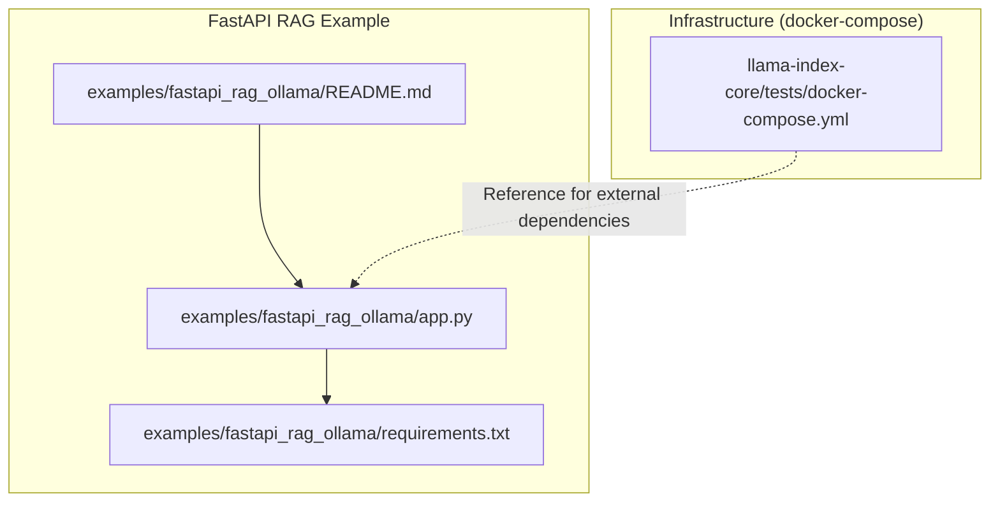
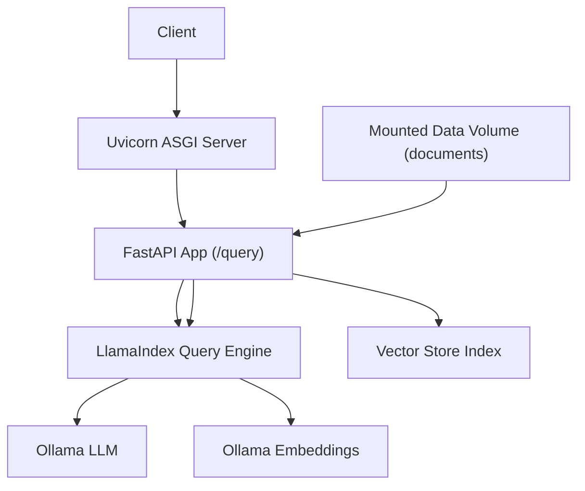
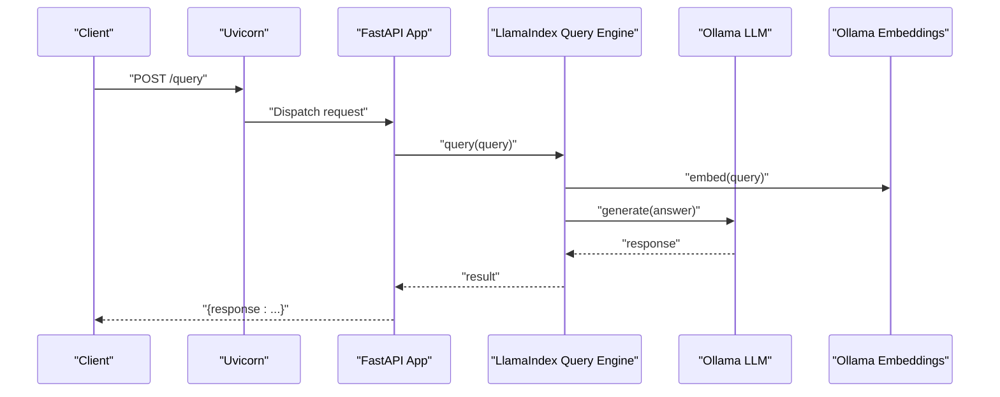
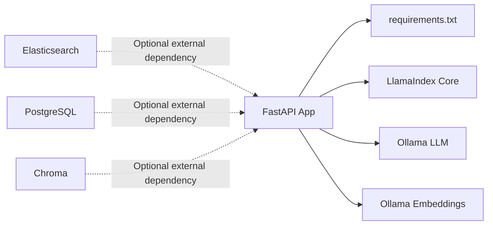

# Containerization and Orchestration

<cite>
**Referenced Files in This Document**
- [examples/fastapi_rag_ollama/README.md](file://examples/fastapi_rag_ollama/README.md)
- [examples/fastapi_rag_ollama/app.py](file://examples/fastapi_rag_ollama/app.py)
- [examples/fastapi_rag_ollama/requirements.txt](file://examples/fastapi_rag_ollama/requirements.txt)
- [llama-index-core/tests/docker-compose.yml](file://llama-index-core/tests/docker-compose.yml)
- [docs/src/content/docs/framework/understanding/deployment/deployment.md](file://docs/src/content/docs/framework/understanding/deployment/deployment.md)
</cite>

## Table of Contents
1. [Introduction](#introduction)
2. [Project Structure](#project-structure)
3. [Core Components](#core-components)
4. [Architecture Overview](#architecture-overview)
5. [Detailed Component Analysis](#detailed-component-analysis)
6. [Dependency Analysis](#dependency-analysis)
7. [Performance Considerations](#performance-considerations)
8. [Troubleshooting Guide](#troubleshooting-guide)
9. [Conclusion](#conclusion)
10. [Appendices](#appendices)

## Introduction
This document provides a comprehensive guide to containerizing LlamaIndex applications, focusing on building secure, scalable containers and orchestrating them with Kubernetes. It covers Docker best practices, multi-stage builds, container security, and Kubernetes deployment patterns including pods, services, ingress, Helm charts, resource limits, autoscaling, networking, persistent volumes, and secrets management. Practical examples demonstrate FastAPI-based Retrieval-Augmented Generation (RAG) deployments and container orchestration patterns derived from the repository’s FastAPI + Ollama example.

## Project Structure
The repository includes a ready-to-run FastAPI + LlamaIndex RAG example that uses a local LLM via Ollama. This example serves as the foundation for containerization and orchestration patterns described below. Supporting infrastructure is demonstrated via a docker-compose file that provisions Elasticsearch, PostgreSQL, and Chroma.

**Diagram sources**
- [examples/fastapi_rag_ollama/app.py](file://examples/fastapi_rag_ollama/app.py#L1-L30)
- [examples/fastapi_rag_ollama/requirements.txt](file://examples/fastapi_rag_ollama/requirements.txt#L1-L7)
- [examples/fastapi_rag_ollama/README.md](file://examples/fastapi_rag_ollama/README.md#L1-L58)
- [llama-index-core/tests/docker-compose.yml](file://llama-index-core/tests/docker-compose.yml#L1-L40)

**Section sources**
- [examples/fastapi_rag_ollama/README.md](file://examples/fastapi_rag_ollama/README.md#L1-L58)
- [examples/fastapi_rag_ollama/app.py](file://examples/fastapi_rag_ollama/app.py#L1-L30)
- [examples/fastapi_rag_ollama/requirements.txt](file://examples/fastapi_rag_ollama/requirements.txt#L1-L7)
- [llama-index-core/tests/docker-compose.yml](file://llama-index-core/tests/docker-compose.yml#L1-L40)

## Core Components
- FastAPI application exposing a /query endpoint backed by LlamaIndex and Ollama for local LLM inference and embeddings.
- Vector index built from local documents at startup.
- Dependencies pinned in requirements.txt for reproducible builds.
- docker-compose demonstrates external services (Elasticsearch, PostgreSQL, Chroma) commonly used in RAG stacks.

Key implementation references:
- Application entrypoint and route definition: [examples/fastapi_rag_ollama/app.py](file://examples/fastapi_rag_ollama/app.py#L1-L30)
- Dependencies and runtime libraries: [examples/fastapi_rag_ollama/requirements.txt](file://examples/fastapi_rag_ollama/requirements.txt#L1-L7)
- Example usage and prerequisites: [examples/fastapi_rag_ollama/README.md](file://examples/fastapi_rag_ollama/README.md#L1-L58)
- Infrastructure dependencies for RAG stack: [llama-index-core/tests/docker-compose.yml](file://llama-index-core/tests/docker-compose.yml#L1-L40)

**Section sources**
- [examples/fastapi_rag_ollama/app.py](file://examples/fastapi_rag_ollama/app.py#L1-L30)
- [examples/fastapi_rag_ollama/requirements.txt](file://examples/fastapi_rag_ollama/requirements.txt#L1-L7)
- [examples/fastapi_rag_ollama/README.md](file://examples/fastapi_rag_ollama/README.md#L1-L58)
- [llama-index-core/tests/docker-compose.yml](file://llama-index-core/tests/docker-compose.yml#L1-L40)

## Architecture Overview
The FastAPI RAG application runs as a single containerized service. At startup, it loads documents from a mounted data volume, builds a vector index, and exposes a /query endpoint. Optional external services (Elasticsearch, PostgreSQL, Chroma) can be orchestrated alongside the application using docker-compose or Kubernetes.

**Diagram sources**
- [examples/fastapi_rag_ollama/app.py](file://examples/fastapi_rag_ollama/app.py#L1-L30)
- [examples/fastapi_rag_ollama/requirements.txt](file://examples/fastapi_rag_ollama/requirements.txt#L1-L7)

## Detailed Component Analysis

### FastAPI RAG Application Containerization
- Purpose: Serve a /query endpoint that leverages LlamaIndex with Ollama for retrieval-augmented generation.
- Startup behavior: Loads documents from a data directory and constructs a vector index.
- Endpoint: POST /query accepts a JSON payload with a query field and returns a generated response.

**Diagram sources**
- [examples/fastapi_rag_ollama/app.py](file://examples/fastapi_rag_ollama/app.py#L25-L29)

**Section sources**
- [examples/fastapi_rag_ollama/app.py](file://examples/fastapi_rag_ollama/app.py#L1-L30)

### Docker Best Practices and Multi-Stage Builds
- Base image selection: Prefer a minimal official Python base image for the builder stage and a distroless or slim runtime image for the final stage.
- Layer optimization: Install build dependencies in the builder stage and remove them before copying artifacts to the runtime image.
- Non-root user: Run the application as a non-root user with least privileges.
- Health checks: Add a lightweight health check endpoint to monitor readiness and liveness.
- Security scanning: Integrate container vulnerability scanning into CI pipelines.
- Secrets management: Mount secrets via environment variables or Kubernetes Secrets; avoid hardcoding credentials in images.
- Resource limits: Set CPU/memory requests/limits in Kubernetes to ensure fair scheduling and prevent noisy-neighbor issues.

[No sources needed since this section provides general guidance]

### Container Security
- Principle of least privilege: Run containers with non-root users and drop unnecessary Linux capabilities.
- Image hardening: Pin base image digests, keep packages updated, and remove unused packages.
- Network policies: Restrict egress traffic and only expose necessary ports.
- Secrets injection: Use Kubernetes Secrets or external secret managers; mount as files or environment variables as appropriate.
- Vulnerability scanning: Automate image scanning during CI/CD and fail builds on critical vulnerabilities.

[No sources needed since this section provides general guidance]

### Kubernetes Deployment Patterns
- Pod configuration: Define init containers to pre-load or warm up indexes, set resource requests/limits, and configure probes.
- Services: Expose the FastAPI service internally or externally using ClusterIP/LoadBalancer/Ingress depending on access needs.
- Ingress controllers: Route traffic via NGINX, Traefik, or cloud load balancers; enable TLS termination and rate limiting.
- Helm charts: Package deployments with values for replicas, autoscaling thresholds, and environment-specific overrides.
- Persistent volumes: Mount persistent volumes for document ingestion and model caches when needed; use ReadWriteOnce or ReadWriteMany depending on workload.
- Secrets management: Store API keys, connection strings, and model credentials in Kubernetes Secrets and mount them securely.

[No sources needed since this section provides general guidance]

### Resource Limits and Autoscaling Strategies
- Horizontal Pod Autoscaler (HPA): Scale on CPU utilization or custom metrics (requests per second, latency).
- Vertical Pod Autoscaler (VPA): Adjust resource requests/limits automatically based on observed usage.
- PodDisruptionBudgets: Ensure minimum availability during voluntary maintenance.
- Resource quotas: Enforce cluster-wide resource governance.

[No sources needed since this section provides general guidance]

### Networking, Persistent Volumes, and Secrets Management
- Networking: Use NetworkPolicies to restrict traffic; configure DNS and service mesh for mTLS if applicable.
- Persistent volumes: Use PVCs for data ingestion directories and model caches; choose storage classes aligned with performance and durability requirements.
- Secrets: Manage sensitive data via Kubernetes Secrets or external secret managers; mount as environment variables or files.

[No sources needed since this section provides general guidance]

## Dependency Analysis
The FastAPI RAG example depends on LlamaIndex core and Ollama integrations. The docker-compose file illustrates optional external dependencies commonly used in RAG environments.

**Diagram sources**
- [examples/fastapi_rag_ollama/requirements.txt](file://examples/fastapi_rag_ollama/requirements.txt#L1-L7)
- [llama-index-core/tests/docker-compose.yml](file://llama-index-core/tests/docker-compose.yml#L1-L40)

**Section sources**
- [examples/fastapi_rag_ollama/requirements.txt](file://examples/fastapi_rag_ollama/requirements.txt#L1-L7)
- [llama-index-core/tests/docker-compose.yml](file://llama-index-core/tests/docker-compose.yml#L1-L40)

## Performance Considerations
- Warm-up strategies: Pre-load indexes and embeddings at startup to reduce cold-start latency.
- Model caching: Persist model artifacts on persistent volumes or shared caches to avoid repeated downloads.
- Concurrency: Tune Uvicorn workers and threads based on CPU and memory capacity.
- Monitoring: Instrument queries, latency, and throughput; export metrics to Prometheus and dashboards.
- Resource sizing: Start with conservative limits and scale based on observed usage.

[No sources needed since this section provides general guidance]

## Troubleshooting Guide
- Health checks: Ensure the application responds to readiness/liveness probes; verify port exposure and endpoint reachability.
- Logs: Enable structured logging and centralize logs for debugging.
- Metrics: Track error rates, latency percentiles, and resource utilization.
- Secrets: Verify Secret mounts and environment variable propagation.
- Storage: Confirm persistent volume mounts and permissions for data ingestion.

[No sources needed since this section provides general guidance]

## Conclusion
By containerizing the FastAPI + LlamaIndex RAG example and orchestrating it with Kubernetes, teams can achieve scalable, secure, and maintainable deployments. Applying Docker best practices, multi-stage builds, and robust security controls ensures reliable operations. Complementing with proper networking, persistent storage, secrets management, and autoscaling yields a production-ready platform for Retrieval-Augmented Generation workloads.

[No sources needed since this section summarizes without analyzing specific files]

## Appendices

### Appendix A: FastAPI RAG Example References
- Application entrypoint and route: [examples/fastapi_rag_ollama/app.py](file://examples/fastapi_rag_ollama/app.py#L1-L30)
- Dependencies and runtime libraries: [examples/fastapi_rag_ollama/requirements.txt](file://examples/fastapi_rag_ollama/requirements.txt#L1-L7)
- Example usage and prerequisites: [examples/fastapi_rag_ollama/README.md](file://examples/fastapi_rag_ollama/README.md#L1-L58)

**Section sources**
- [examples/fastapi_rag_ollama/app.py](file://examples/fastapi_rag_ollama/app.py#L1-L30)
- [examples/fastapi_rag_ollama/requirements.txt](file://examples/fastapi_rag_ollama/requirements.txt#L1-L7)
- [examples/fastapi_rag_ollama/README.md](file://examples/fastapi_rag_ollama/README.md#L1-L58)

### Appendix B: Infrastructure Dependencies Reference
- External services for RAG stack: [llama-index-core/tests/docker-compose.yml](file://llama-index-core/tests/docker-compose.yml#L1-L40)

**Section sources**
- [llama-index-core/tests/docker-compose.yml](file://llama-index-core/tests/docker-compose.yml#L1-L40)

### Appendix C: Deployment Documentation Status
- Current deployment documentation placeholder: [docs/src/content/docs/framework/understanding/deployment/deployment.md](file://docs/src/content/docs/framework/understanding/deployment/deployment.md#L1-L6)

**Section sources**
- [docs/src/content/docs/framework/understanding/deployment/deployment.md](file://docs/src/content/docs/framework/understanding/deployment/deployment.md#L1-L6)