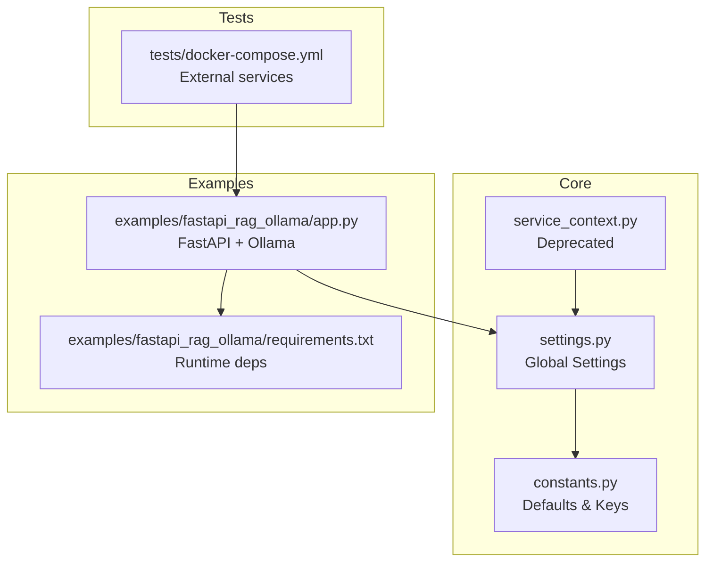
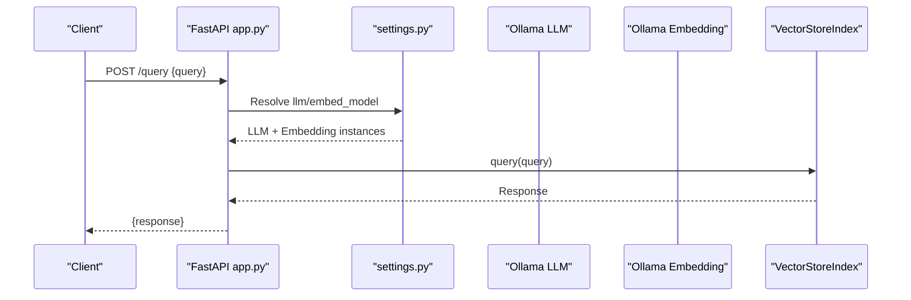
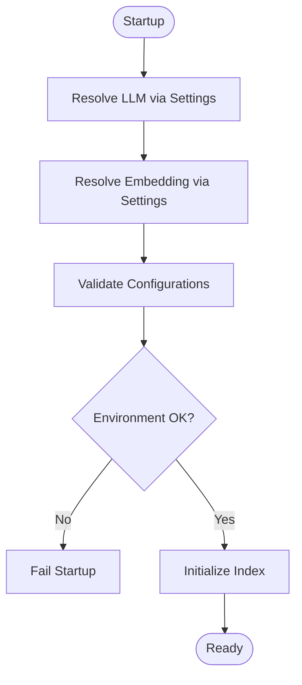
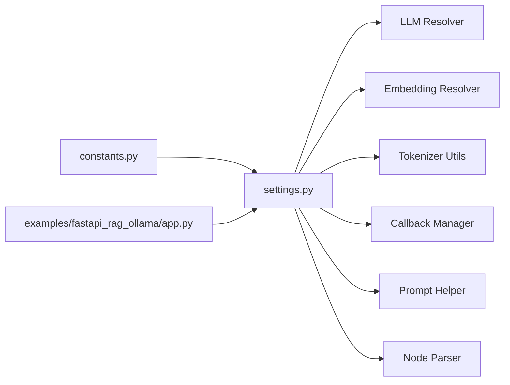

# Infrastructure and Resource Management

<cite>
**Referenced Files in This Document**
- [service_context.py](file://llama-index-core/llama_index/core/service_context.py)
- [settings.py](file://llama-index-core/llama_index/core/settings.py)
- [constants.py](file://llama-index-core/llama_index/core/constants.py)
- [docker-compose.yml](file://llama-index-core/tests/docker-compose.yml)
- [app.py](file://examples/fastapi_rag_ollama/app.py)
- [requirements.txt](file://examples/fastapi_rag_ollama/requirements.txt)
</cite>

## Table of Contents
1. [Introduction](#introduction)
2. [Project Structure](#project-structure)
3. [Core Components](#core-components)
4. [Architecture Overview](#architecture-overview)
5. [Detailed Component Analysis](#detailed-component-analysis)
6. [Dependency Analysis](#dependency-analysis)
7. [Performance Considerations](#performance-considerations)
8. [Troubleshooting Guide](#troubleshooting-guide)
9. [Conclusion](#conclusion)
10. [Appendices](#appendices)

## Introduction
This document provides production-grade infrastructure and resource management guidance for deploying LlamaIndex applications. It focuses on service context configuration, environment variable management, configuration validation, resource allocation for LLMs, embeddings, and vector stores, networking and firewall requirements, inter-service communication, database and caching strategies, storage optimization, and capacity planning.

## Project Structure
The repository organizes infrastructure and configuration concerns primarily around:
- Global settings and service configuration in the core module
- Example deployments demonstrating runtime configuration
- Test-time orchestration for external dependencies (vector stores, databases)

**Diagram sources**
- [settings.py](file://llama-index-core/llama_index/core/settings.py#L1-L249)
- [constants.py](file://llama-index-core/llama_index/core/constants.py#L1-L37)
- [service_context.py](file://llama-index-core/llama_index/core/service_context.py#L1-L49)
- [app.py](file://examples/fastapi_rag_ollama/app.py#L1-L30)
- [requirements.txt](file://examples/fastapi_rag_ollama/requirements.txt#L1-L7)
- [docker-compose.yml](file://llama-index-core/tests/docker-compose.yml#L1-L40)

**Section sources**
- [settings.py](file://llama-index-core/llama_index/core/settings.py#L1-L249)
- [constants.py](file://llama-index-core/llama_index/core/constants.py#L1-L37)
- [service_context.py](file://llama-index-core/llama_index/core/service_context.py#L1-L49)
- [app.py](file://examples/fastapi_rag_ollama/app.py#L1-L30)
- [requirements.txt](file://examples/fastapi_rag_ollama/requirements.txt#L1-L7)
- [docker-compose.yml](file://llama-index-core/tests/docker-compose.yml#L1-L40)

## Core Components
- Global Settings: Provides centralized configuration for LLMs, embeddings, tokenizers, node parsers, prompt helpers, and transformations. It supports lazy initialization and integrates callback managers.
- Constants: Defines default values for chunk sizes, overlaps, similarity top-k, embedding dimensions, and context windows.
- Deprecated ServiceContext: Legacy container now superseded by Settings; raises migration guidance.

Key responsibilities:
- Centralized configuration for LLM and embedding selection
- Chunking and splitting defaults for ingestion
- Prompt helper sizing aligned with selected LLM
- Lazy resolution of components to defer expensive initialization

Production implications:
- Use Settings for all runtime configuration
- Set environment variables for provider credentials and endpoints
- Validate configuration at startup to prevent runtime failures

**Section sources**
- [settings.py](file://llama-index-core/llama_index/core/settings.py#L17-L249)
- [constants.py](file://llama-index-core/llama_index/core/constants.py#L1-L37)
- [service_context.py](file://llama-index-core/llama_index/core/service_context.py#L1-L49)

## Architecture Overview
The example FastAPI application demonstrates a minimal production-ready pattern:
- Application initializes with configured LLM and embeddings
- Documents are loaded and indexed at startup
- Queries route uses the prebuilt index and query engine

**Diagram sources**
- [app.py](file://examples/fastapi_rag_ollama/app.py#L1-L30)
- [settings.py](file://llama-index-core/llama_index/core/settings.py#L32-L74)

## Detailed Component Analysis

### Global Settings and Environment Management
- LLM and Embedding resolution: Settings lazily resolves default providers and attaches callback managers when present.
- Tokenizer and node parsing: Defaults to sentence splitting; chunk size and overlap are configurable via properties.
- Prompt helper: Derived from LLM metadata or falls back to defaults.
- Transformations: Defaults to include the node parser.

Environment variables:
- Configure provider-specific environment variables for credentials and endpoints (e.g., provider keys, base URLs).
- Use separate environment files per environment (development, staging, production) and avoid committing secrets.

Validation strategy:
- On startup, resolve and instantiate LLM and embeddings; catch provider errors early.
- Verify context window and chunk size compatibility with chosen LLM.
- Confirm connectivity to external services (vector stores, databases) via health checks.

**Diagram sources**
- [settings.py](file://llama-index-core/llama_index/core/settings.py#L32-L74)
- [constants.py](file://llama-index-core/llama_index/core/constants.py#L10-L16)

**Section sources**
- [settings.py](file://llama-index-core/llama_index/core/settings.py#L32-L74)
- [constants.py](file://llama-index-core/llama_index/core/constants.py#L10-L16)

### Example Deployment: FastAPI + Ollama
- Runtime configuration sets LLM and embeddings to local Ollama instances.
- Dependencies pinned in requirements for reproducible deployments.
- Index built at startup for predictable latency during queries.

Operational notes:
- Containerize the FastAPI app with gunicorn/uwsgi for concurrency.
- Expose only necessary ports (e.g., 8000) and restrict inbound traffic.
- Use process health checks and readiness probes.

**Section sources**
- [app.py](file://examples/fastapi_rag_ollama/app.py#L1-L30)
- [requirements.txt](file://examples/fastapi_rag_ollama/requirements.txt#L1-L7)

### External Services Orchestration (Test Compose)
- Elasticsearch, Postgres, and Chroma orchestrated for testing and development.
- Health checks ensure services are ready before application startup.

Production adaptation:
- Replace with managed cloud offerings (e.g., Elastic Cloud, Aiven, AWS RDS).
- Enforce network policies and private subnets.
- Use connection pooling and circuit breakers.

**Section sources**
- [docker-compose.yml](file://llama-index-core/tests/docker-compose.yml#L1-L40)

## Dependency Analysis
- Settings depends on LLM and embedding resolvers, tokenizer utilities, and callback manager.
- Constants provide shared defaults for chunking and similarity parameters.
- Example app depends on Settings and external integrations (Ollama).

**Diagram sources**
- [settings.py](file://llama-index-core/llama_index/core/settings.py#L1-L249)
- [constants.py](file://llama-index-core/llama_index/core/constants.py#L1-L37)
- [app.py](file://examples/fastapi_rag_ollama/app.py#L1-L30)

**Section sources**
- [settings.py](file://llama-index-core/llama_index/core/settings.py#L1-L249)
- [constants.py](file://llama-index-core/llama_index/core/constants.py#L1-L37)
- [app.py](file://examples/fastapi_rag_ollama/app.py#L1-L30)

## Performance Considerations
- LLM and embedding selection:
  - Choose providers aligned with target latency and cost.
  - Use batching for embeddings when supported by provider SDKs.
- Chunking and overlap:
  - Tune chunk size and overlap for retrieval quality and latency trade-offs.
  - Validate against context window limits.
- Vector store performance:
  - Use appropriate indexing parameters and periodic maintenance.
  - Scale replicas and shards for read-heavy workloads.
- Caching:
  - Cache frequent query results at the application layer with TTL.
  - Use CDN for static assets and precomputed embeddings where applicable.
- Concurrency:
  - Deploy behind load balancers and autoscaling groups.
  - Monitor queue depths and tail latencies.

[No sources needed since this section provides general guidance]

## Troubleshooting Guide
Common issues and resolutions:
- Provider credential errors:
  - Validate environment variables and IAM roles for managed services.
- Connectivity failures:
  - Verify network ACLs, security groups, and VPC routing.
  - Use health checks and circuit breakers.
- Memory pressure:
  - Reduce batch sizes and chunk sizes; enable garbage collection tuning.
- Latency spikes:
  - Inspect vector store query plans and re-index if necessary.
  - Offload embedding computation to dedicated workers.

**Section sources**
- [settings.py](file://llama-index-core/llama_index/core/settings.py#L32-L74)
- [docker-compose.yml](file://llama-index-core/tests/docker-compose.yml#L1-L40)

## Conclusion
Effective production deployment requires centralized configuration via Settings, robust environment management, and validated resource allocation. Align chunking and context window parameters with chosen LLMs, provision scalable vector stores and databases, and enforce strict networking and firewall policies. Use the example patterns to bootstrap reliable deployments while maintaining flexibility for future scaling.

[No sources needed since this section summarizes without analyzing specific files]

## Appendices

### Infrastructure Checklist
- Environment variables:
  - Provider credentials and base URLs
  - Feature flags and toggles
- Networking:
  - Inbound/outbound firewall rules
  - Private subnets and NAT gateways
- Storage:
  - Volume sizing and backup policies
  - Encryption at rest and in transit
- Observability:
  - Metrics, logs, and traces
  - Health checks and alerting thresholds

### Capacity Planning Guidelines
- LLMs:
  - Estimate requests per second and concurrent sessions.
  - Account for context window and output token limits.
- Embeddings:
  - Compute throughput and batch sizes.
  - Plan for embedding cache and recomputation cadence.
- Vector stores:
  - Index size growth projections and query latency targets.
  - Replication and failover strategies.

[No sources needed since this section provides general guidance]