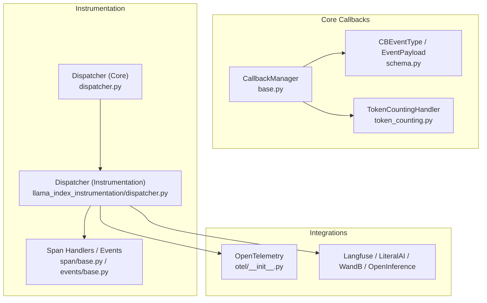
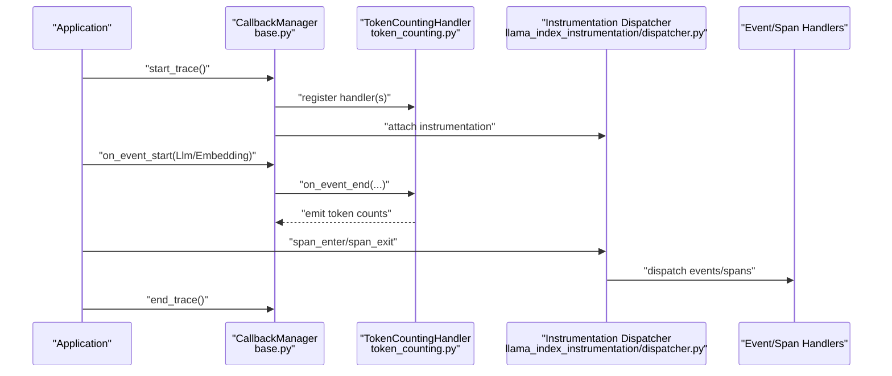
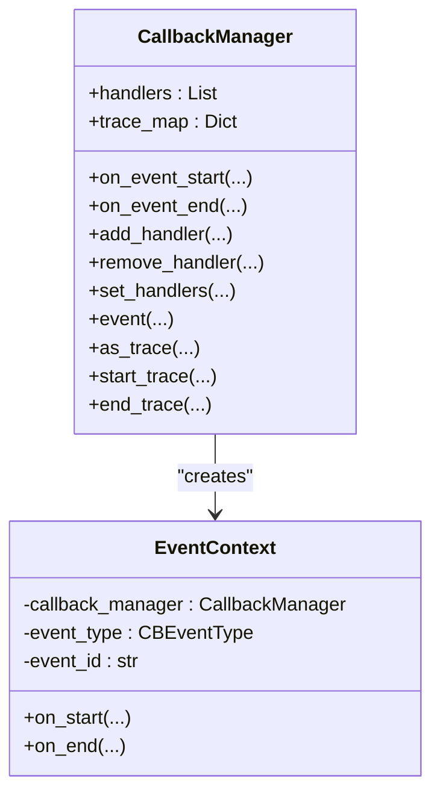
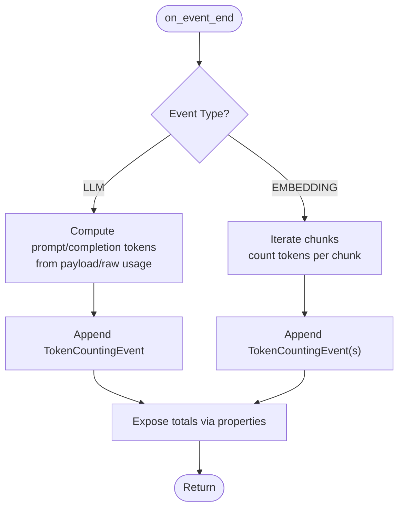
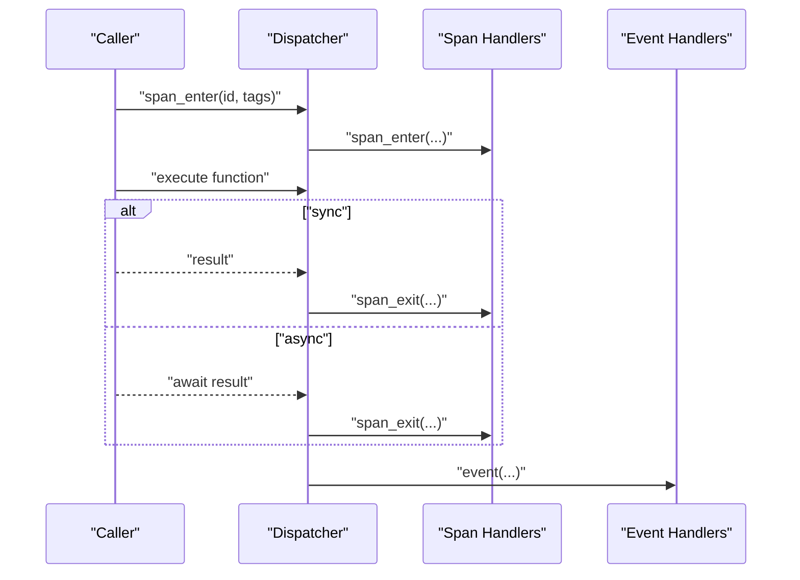
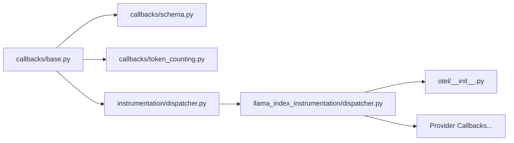

# Monitoring and Observability

<cite>
**Referenced Files in This Document**
- [token_counting.py](file://llama-index-core/llama_index/core/callbacks/token_counting.py)
- [base.py](file://llama-index-core/llama_index/core/callbacks/base.py)
- [schema.py](file://llama-index-core/llama_index/core/callbacks/schema.py)
- [dispatcher.py](file://llama-index-core/llama_index/core/instrumentation/dispatcher.py)
- [base.py](file://llama-index-core/llama_index/core/instrumentation/events/base.py)
- [base.py](file://llama-index-core/llama_index/core/instrumentation/span/base.py)
- [dispatcher.py](file://llama-index-instrumentation/src/llama_index_instrumentation/dispatcher.py)
- [__init__.py](file://llama-index-integrations/observability/llama-index-observability-otel/llama_index/observability/otel/__init__.py)
- [base.py](file://llama-index-integrations/callbacks/llama-index-callbacks-openinference/llama_index/callbacks/openinference/base.py)
- [base.py](file://llama-index-integrations/callbacks/llama-index-callbacks-langfuse/llama_index/callbacks/langfuse/base.py)
- [base.py](file://llama-index-integrations/callbacks/llama-index-callbacks-literalai/llama_index/callbacks/literalai/base.py)
- [base.py](file://llama-index-integrations/callbacks/llama-index-callbacks-wandb/llama_index/callbacks/wandb/base.py)
- [base.py](file://llama-index-integrations/callbacks/llama-index-callbacks-promptlayer/llama_index/callbacks/promptlayer/base.py)
- [base.py](file://llama-index-integrations/callbacks/llama-index-callbacks-uptrain/llama_index/callbacks/uptrain/base.py)
- [base.py](file://llama-index-integrations/callbacks/llama-index-callbacks-agentops/llama_index/callbacks/agentops/base.py)
- [base.py](file://llama-index-integrations/callbacks/llama-index-callbacks-aim/llama_index/callbacks/aim/base.py)
- [base.py](file://llama-index-integrations/callbacks/llama-index-callbacks-argilla/llama_index/callbacks/argilla/base.py)
- [base.py](file://llama-index-integrations/callbacks/llama-index-callbacks-honeyhive/llama_index/callbacks/honeyhive/base.py)
- [base.py](file://llama-index-integrations/callbacks/llama-index-callbacks-opik/llama_index/callbacks/opik/base.py)
</cite>

## Table of Contents
1. [Introduction](#introduction)
2. [Project Structure](#project-structure)
3. [Core Components](#core-components)
4. [Architecture Overview](#architecture-overview)
5. [Detailed Component Analysis](#detailed-component-analysis)
6. [Dependency Analysis](#dependency-analysis)
7. [Performance Considerations](#performance-considerations)
8. [Troubleshooting Guide](#troubleshooting-guide)
9. [Conclusion](#conclusion)
10. [Appendices](#appendices)

## Introduction
This document provides production-grade guidance for monitoring and observability in LlamaIndex deployments. It covers metrics collection, logging strategies, and distributed tracing, along with callback systems for token counting, performance monitoring, and error tracking. It also outlines integrations with external observability platforms (Prometheus/Grafana, APMs) and describes alerting strategies, log aggregation, and profiling approaches. The goal is to help teams build reliable, observable LlamaIndex applications that scale safely in production.

## Project Structure
LlamaIndex’s observability capabilities are primarily implemented in:
- Core callback framework for event-driven telemetry
- Instrumentation subsystem for distributed tracing and spans
- Integration packages for popular observability providers

Key areas:
- Callbacks: event lifecycle hooks, token counting, and payload schemas
- Instrumentation: dispatcher, span creation, and propagation
- Integrations: OpenTelemetry, Langfuse, LiteralAI, WandB, OpenInference, and others

**Diagram sources**
- [base.py](file://llama-index-core/llama_index/core/callbacks/base.py#L28-L303)
- [schema.py](file://llama-index-core/llama_index/core/callbacks/schema.py#L16-L102)
- [token_counting.py](file://llama-index-core/llama_index/core/callbacks/token_counting.py#L143-L270)
- [dispatcher.py](file://llama-index-core/llama_index/core/instrumentation/dispatcher.py#L1-L9)
- [dispatcher.py](file://llama-index-instrumentation/src/llama_index_instrumentation/dispatcher.py#L48-L426)
- [base.py](file://llama-index-core/llama_index/core/instrumentation/events/base.py#L1-L2)
- [base.py](file://llama-index-core/llama_index/core/instrumentation/span/base.py#L1-L2)
- [__init__.py](file://llama-index-integrations/observability/llama-index-observability-otel/llama_index/observability/otel/__init__.py#L1-L6)

**Section sources**
- [base.py](file://llama-index-core/llama_index/core/callbacks/base.py#L28-L303)
- [schema.py](file://llama-index-core/llama_index/core/callbacks/schema.py#L16-L102)
- [token_counting.py](file://llama-index-core/llama_index/core/callbacks/token_counting.py#L143-L270)
- [dispatcher.py](file://llama-index-core/llama_index/core/instrumentation/dispatcher.py#L1-L9)
- [dispatcher.py](file://llama-index-instrumentation/src/llama_index_instrumentation/dispatcher.py#L48-L426)
- [base.py](file://llama-index-core/llama_index/core/instrumentation/events/base.py#L1-L2)
- [base.py](file://llama-index-core/llama_index/core/instrumentation/span/base.py#L1-L2)
- [__init__.py](file://llama-index-integrations/observability/llama-index-observability-otel/llama_index/observability/otel/__init__.py#L1-L6)

## Core Components
- CallbackManager: central orchestrator for event lifecycle, trace stacks, and handler invocation
- Event types and payloads: standardized CBEventType and EventPayload enums for consistent telemetry
- TokenCountingHandler: collects token usage for LLM and embedding operations
- Instrumentation Dispatcher: dispatches events/spans and manages hierarchical traces across threads and async tasks
- Integration callbacks: provider-specific handlers for exporting telemetry to external systems

Key responsibilities:
- Metrics: token counts, latency buckets, throughput
- Logging: structured payloads, timestamps, and exception capture
- Tracing: spans, tags, parent-child relationships, and propagation
- Alerting: thresholds on latency, error rates, and token cost anomalies

**Section sources**
- [base.py](file://llama-index-core/llama_index/core/callbacks/base.py#L28-L303)
- [schema.py](file://llama-index-core/llama_index/core/callbacks/schema.py#L16-L102)
- [token_counting.py](file://llama-index-core/llama_index/core/callbacks/token_counting.py#L143-L270)
- [dispatcher.py](file://llama-index-instrumentation/src/llama_index_instrumentation/dispatcher.py#L48-L426)

## Architecture Overview
The observability architecture combines synchronous and asynchronous event handling, token accounting, and distributed tracing. CallbackManager coordinates event lifecycles; TokenCountingHandler enriches payloads with token metrics; Instrumentation Dispatcher emits spans and events propagated up the call tree.

**Diagram sources**
- [base.py](file://llama-index-core/llama_index/core/callbacks/base.py#L88-L243)
- [token_counting.py](file://llama-index-core/llama_index/core/callbacks/token_counting.py#L197-L244)
- [dispatcher.py](file://llama-index-instrumentation/src/llama_index_instrumentation/dispatcher.py#L181-L262)

## Detailed Component Analysis

### CallbackManager and Event Lifecycle
- Manages trace stacks per task/thread via context variables
- Emits on_event_start/on_event_end to registered handlers
- Supports nested events and leaf events (no children)
- Provides context managers for explicit event and trace scoping

**Diagram sources**
- [base.py](file://llama-index-core/llama_index/core/callbacks/base.py#L28-L303)

**Section sources**
- [base.py](file://llama-index-core/llama_index/core/callbacks/base.py#L28-L303)

### Token Counting Handler
- Tracks LLM and embedding token usage per event
- Extracts token counts from response metadata or falls back to tokenizer estimates
- Aggregates totals and exposes properties for consumption
- Supports verbosity and logging integration

**Diagram sources**
- [token_counting.py](file://llama-index-core/llama_index/core/callbacks/token_counting.py#L197-L244)

**Section sources**
- [token_counting.py](file://llama-index-core/llama_index/core/callbacks/token_counting.py#L143-L270)
- [schema.py](file://llama-index-core/llama_index/core/callbacks/schema.py#L16-L76)

### Instrumentation Dispatcher
- Dispatches events and spans across handler chains
- Supports sync and async wrappers around decorated functions
- Maintains active span context and propagates to parent dispatchers
- Attaches instrument tags to events

**Diagram sources**
- [dispatcher.py](file://llama-index-instrumentation/src/llama_index_instrumentation/dispatcher.py#L181-L262)
- [dispatcher.py](file://llama-index-instrumentation/src/llama_index_instrumentation/dispatcher.py#L264-L403)

**Section sources**
- [dispatcher.py](file://llama-index-instrumentation/src/llama_index_instrumentation/dispatcher.py#L48-L426)
- [base.py](file://llama-index-core/llama_index/core/instrumentation/events/base.py#L1-L2)
- [base.py](file://llama-index-core/llama_index/core/instrumentation/span/base.py#L1-L2)

### Integration Callbacks (APM/ML Ops)
LlamaIndex integrates with multiple observability providers via dedicated callback packages. Typical capabilities include:
- Exporting traces and spans to APM vendors
- Capturing prompts, completions, and token usage
- Publishing metrics to ML experiment tracking platforms

Common integration points:
- OpenTelemetry exporter
- Langfuse, LiteralAI, WandB for LLM observability
- OpenInference for standardized LLM telemetry
- Provider-specific handlers for PromptLayer, UpTrain, AgentOps, AIM, Argilla, Honeyhive, Opik

Note: Integration packages are separate repositories and published under llama-index-integrations. Each package exposes a base callback class that registers with the instrumentation pipeline.

**Section sources**
- [__init__.py](file://llama-index-integrations/observability/llama-index-observability-otel/llama_index/observability/otel/__init__.py#L1-L6)
- [base.py](file://llama-index-integrations/callbacks/llama-index-callbacks-openinference/llama_index/callbacks/openinference/base.py)
- [base.py](file://llama-index-integrations/callbacks/llama-index-callbacks-langfuse/llama_index/callbacks/langfuse/base.py)
- [base.py](file://llama-index-integrations/callbacks/llama-index-callbacks-literalai/llama_index/callbacks/literalai/base.py)
- [base.py](file://llama-index-integrations/callbacks/llama-index-callbacks-wandb/llama_index/callbacks/wandb/base.py)
- [base.py](file://llama-index-integrations/callbacks/llama-index-callbacks-promptlayer/llama_index/callbacks/promptlayer/base.py)
- [base.py](file://llama-index-integrations/callbacks/llama-index-callbacks-uptrain/llama_index/callbacks/uptrain/base.py)
- [base.py](file://llama-index-integrations/callbacks/llama-index-callbacks-agentops/llama_index/callbacks/agentops/base.py)
- [base.py](file://llama-index-integrations/callbacks/llama-index-callbacks-aim/llama_index/callbacks/aim/base.py)
- [base.py](file://llama-index-integrations/callbacks/llama-index-callbacks-argilla/llama_index/callbacks/argilla/base.py)
- [base.py](file://llama-index-integrations/callbacks/llama-index-callbacks-honeyhive/llama_index/callbacks/honeyhive/base.py)
- [base.py](file://llama-index-integrations/callbacks/llama-index-callbacks-opik/llama_index/callbacks/opik/base.py)

## Dependency Analysis
- Core depends on instrumentation dispatcher for span and event emission
- CallbackManager depends on event enums and payload schemas
- TokenCountingHandler depends on TokenCounter and tokenizer utilities
- Integration callbacks depend on their respective vendor SDKs and register into the instrumentation pipeline

**Diagram sources**
- [base.py](file://llama-index-core/llama_index/core/callbacks/base.py#L28-L303)
- [schema.py](file://llama-index-core/llama_index/core/callbacks/schema.py#L16-L102)
- [token_counting.py](file://llama-index-core/llama_index/core/callbacks/token_counting.py#L143-L270)
- [dispatcher.py](file://llama-index-core/llama_index/core/instrumentation/dispatcher.py#L1-L9)
- [dispatcher.py](file://llama-index-instrumentation/src/llama_index_instrumentation/dispatcher.py#L48-L426)
- [__init__.py](file://llama-index-integrations/observability/llama-index-observability-otel/llama_index/observability/otel/__init__.py#L1-L6)

**Section sources**
- [base.py](file://llama-index-core/llama_index/core/callbacks/base.py#L28-L303)
- [schema.py](file://llama-index-core/llama_index/core/callbacks/schema.py#L16-L102)
- [token_counting.py](file://llama-index-core/llama_index/core/callbacks/token_counting.py#L143-L270)
- [dispatcher.py](file://llama-index-core/llama_index/core/instrumentation/dispatcher.py#L1-L9)
- [dispatcher.py](file://llama-index-instrumentation/src/llama_index_instrumentation/dispatcher.py#L48-L426)
- [__init__.py](file://llama-index-integrations/observability/llama-index-observability-otel/llama_index/observability/otel/__init__.py#L1-L6)

## Performance Considerations
- Token counting overhead: minimize repeated tokenization by caching and batching where possible
- Event volume: use ignore lists for frequent leaf events to reduce handler churn
- Async safety: instrumentation dispatcher ensures thread-safe span propagation; avoid blocking handlers
- Payload size: limit large payloads in logs/traces; prefer sampling for high-throughput scenarios
- Trace depth: cap nested event depth to prevent excessive memory usage

[No sources needed since this section provides general guidance]

## Troubleshooting Guide
- Missing token counts: verify TokenCountingHandler is registered and payload contains usage metadata or completion object
- Duplicate handlers: CallbackManager prevents adding multiple handlers of the same type; ensure unique handler instances
- Unfinished events: use EventContext and CallbackManager.as_trace to guarantee on_end is invoked
- Span drops: instrumentation captures SpanDropEvent on exceptions; review span handlers for error handling
- Integration export failures: check provider credentials and network connectivity; confirm handler registration order

**Section sources**
- [base.py](file://llama-index-core/llama_index/core/callbacks/base.py#L64-L84)
- [base.py](file://llama-index-core/llama_index/core/callbacks/base.py#L174-L211)
- [dispatcher.py](file://llama-index-instrumentation/src/llama_index_instrumentation/dispatcher.py#L318-L358)

## Conclusion
LlamaIndex provides a robust foundation for production observability through its callback and instrumentation subsystems. Teams can collect token usage, emit structured logs, and trace distributed workloads with minimal code changes. By integrating provider-specific callbacks and adopting sensible alerting and profiling strategies, organizations can achieve comprehensive visibility into LLM-powered applications.

[No sources needed since this section summarizes without analyzing specific files]

## Appendices

### Metrics Collection Playbook
- Token usage: expose totals from TokenCountingHandler and aggregate per request/session
- Latency: measure event durations via CallbackManager and instrumentation spans
- Throughput: count events per second and bucket by operation type
- Error rate: monitor CBEventType.EXCEPTION occurrences and handler errors

[No sources needed since this section provides general guidance]

### Logging Strategy
- Use structured payloads (EventPayload fields) for consistent downstream processing
- Include trace identifiers and span tags for correlation
- Sample high-volume logs to control cost and noise

[No sources needed since this section provides general guidance]

### Distributed Tracing Implementation
- Wrap hotspots with instrumentation dispatcher spans
- Propagate tags via instrument_tags context manager
- Export to APMs using provider callbacks

[No sources needed since this section provides general guidance]

### Integration Quick Tips
- OpenTelemetry: initialize exporter and attach to instrumentation dispatcher
- Langfuse/LiteralAI/WandB: configure credentials and enable callbacks in your pipeline
- OpenInference: standardizes LLM telemetry across providers

[No sources needed since this section provides general guidance]