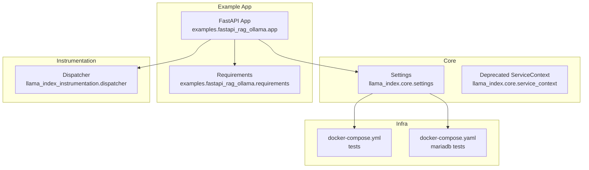
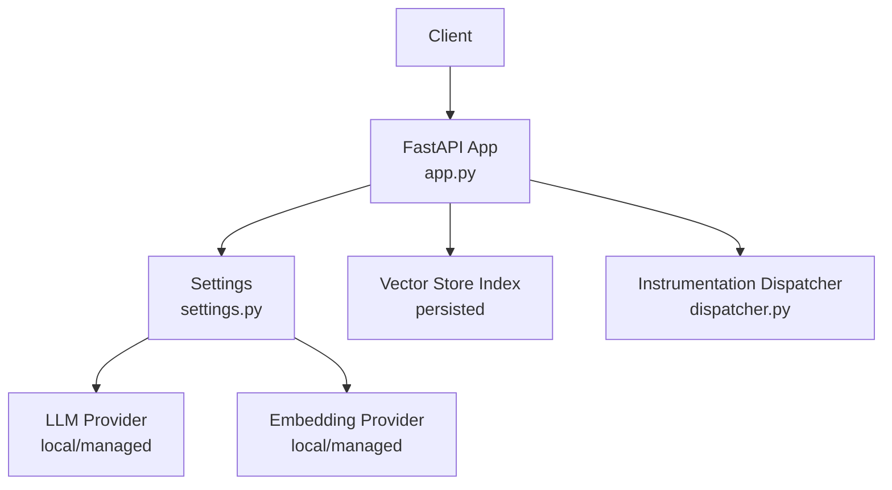
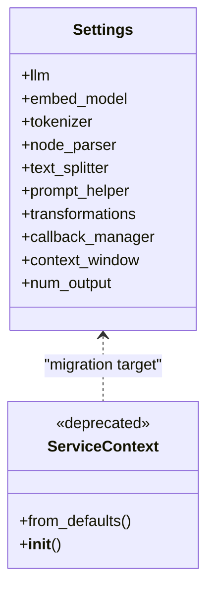
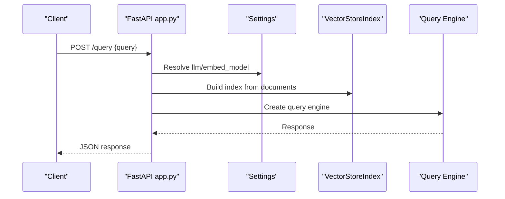
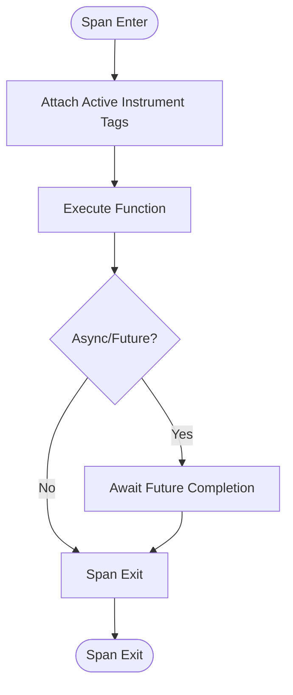
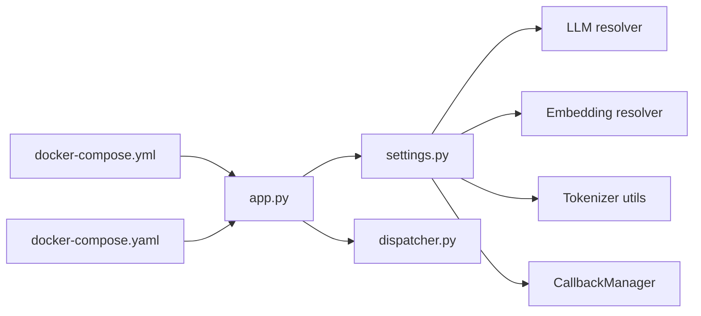

# Production Deployment

<cite>
**Referenced Files in This Document**
- [settings.py](file://llama-index-core/llama_index/core/settings.py)
- [service_context.py](file://llama-index-core/llama_index/core/service_context.py)
- [app.py](file://examples/fastapi_rag_ollama/app.py)
- [requirements.txt](file://examples/fastapi_rag_ollama/requirements.txt)
- [dispatcher.py](file://llama-index-instrumentation/src/llama_index_instrumentation/dispatcher.py)
- [docker-compose.yml](file://llama-index-core/tests/docker-compose.yml)
- [docker-compose.yaml](file://llama-index-integrations/vector_stores/llama-index-vector-stores-mariadb/tests/docker-compose.yaml)
</cite>

## Table of Contents
1. [Introduction](#introduction)
2. [Project Structure](#project-structure)
3. [Core Components](#core-components)
4. [Architecture Overview](#architecture-overview)
5. [Detailed Component Analysis](#detailed-component-analysis)
6. [Dependency Analysis](#dependency-analysis)
7. [Performance Considerations](#performance-considerations)
8. [Troubleshooting Guide](#troubleshooting-guide)
9. [Conclusion](#conclusion)
10. [Appendices](#appendices)

## Introduction
This document provides a comprehensive guide to deploying LlamaIndex applications in production environments. It covers containerization strategies, cloud deployment patterns, infrastructure requirements, service context configuration, environment variable management, configuration validation, monitoring and observability, security, authentication/authorization/data protection, deployment checklists, rollback procedures, maintenance workflows, and high availability and scaling considerations. The guidance is grounded in the repository’s core configuration mechanisms, instrumentation, and example application.

## Project Structure
The repository includes:
- Core configuration and settings for LLMs, embeddings, tokenizers, and pipeline components
- Example FastAPI application demonstrating a minimal production-ready RAG service
- Instrumentation utilities for tracing and event dispatching
- Docker Compose configurations for local testing and development

**Diagram sources**
- [settings.py](file://llama-index-core/llama_index/core/settings.py#L1-L249)
- [service_context.py](file://llama-index-core/llama_index/core/service_context.py#L1-L49)
- [app.py](file://examples/fastapi_rag_ollama/app.py#L1-L30)
- [requirements.txt](file://examples/fastapi_rag_ollama/requirements.txt#L1-L7)
- [dispatcher.py](file://llama-index-instrumentation/src/llama_index_instrumentation/dispatcher.py#L1-L426)
- [docker-compose.yml](file://llama-index-core/tests/docker-compose.yml)
- [docker-compose.yaml](file://llama-index-integrations/vector_stores/llama-index-vector-stores-mariadb/tests/docker-compose.yaml)

**Section sources**
- [settings.py](file://llama-index-core/llama_index/core/settings.py#L1-L249)
- [service_context.py](file://llama-index-core/llama_index/core/service_context.py#L1-L49)
- [app.py](file://examples/fastapi_rag_ollama/app.py#L1-L30)
- [requirements.txt](file://examples/fastapi_rag_ollama/requirements.txt#L1-L7)
- [dispatcher.py](file://llama-index-instrumentation/src/llama_index_instrumentation/dispatcher.py#L1-L426)
- [docker-compose.yml](file://llama-index-core/tests/docker-compose.yml)
- [docker-compose.yaml](file://llama-index-integrations/vector_stores/llama-index-vector-stores-mariadb/tests/docker-compose.yaml)

## Core Components
- Global Settings: Provides centralized configuration for LLMs, embeddings, tokenizers, node parsers, prompt helpers, and transformations. It supports lazy initialization and integrates callback managers.
- Deprecated ServiceContext: Legacy container that is deprecated in favor of Settings and per-call module injection.
- Example FastAPI Application: Demonstrates initializing Settings with local LLM and embeddings, loading documents at startup, and exposing a query endpoint.
- Instrumentation Dispatcher: Enables tracing spans and event dispatching across components for observability.

Key configuration responsibilities:
- LLM selection and callback integration
- Embedding model selection
- Tokenizer and chunking parameters
- Node parsing and transformations
- Prompt helper and context window controls

**Section sources**
- [settings.py](file://llama-index-core/llama_index/core/settings.py#L17-L249)
- [service_context.py](file://llama-index-core/llama_index/core/service_context.py#L4-L49)
- [app.py](file://examples/fastapi_rag_ollama/app.py#L1-L30)
- [dispatcher.py](file://llama-index-instrumentation/src/llama_index_instrumentation/dispatcher.py#L48-L426)

## Architecture Overview
The production-grade deployment architecture centers around a FastAPI service that initializes LlamaIndex components via Settings, loads persistent indexes at startup, and serves queries through a REST endpoint. Observability is integrated via the instrumentation dispatcher.

**Diagram sources**
- [app.py](file://examples/fastapi_rag_ollama/app.py#L1-L30)
- [settings.py](file://llama-index-core/llama_index/core/settings.py#L17-L249)
- [dispatcher.py](file://llama-index-instrumentation/src/llama_index_instrumentation/dispatcher.py#L48-L426)

## Detailed Component Analysis

### Service Context and Settings Migration
- ServiceContext is deprecated and raises errors if instantiated or used via legacy APIs. Migrate to Settings for centralized configuration and module injection.
- Settings encapsulates LLM, embeddings, tokenizer, node parser, prompt helper, and transformations with lazy initialization and callback propagation.

**Diagram sources**
- [settings.py](file://llama-index-core/llama_index/core/settings.py#L17-L249)
- [service_context.py](file://llama-index-core/llama_index/core/service_context.py#L4-L49)

**Section sources**
- [service_context.py](file://llama-index-core/llama_index/core/service_context.py#L4-L49)
- [settings.py](file://llama-index-core/llama_index/core/settings.py#L17-L249)

### Example FastAPI Application
- Initializes Settings with local LLM and embeddings
- Loads documents and builds a VectorStoreIndex at startup
- Exposes a POST endpoint to query the index

**Diagram sources**
- [app.py](file://examples/fastapi_rag_ollama/app.py#L1-L30)

**Section sources**
- [app.py](file://examples/fastapi_rag_ollama/app.py#L1-L30)
- [requirements.txt](file://examples/fastapi_rag_ollama/requirements.txt#L1-L7)

### Instrumentation Dispatcher
- Manages event and span dispatching across components
- Supports synchronous and asynchronous spans
- Integrates with context variables for tagging and active span tracking

**Diagram sources**
- [dispatcher.py](file://llama-index-instrumentation/src/llama_index_instrumentation/dispatcher.py#L181-L398)

**Section sources**
- [dispatcher.py](file://llama-index-instrumentation/src/llama_index_instrumentation/dispatcher.py#L48-L426)

## Dependency Analysis
- The example app depends on Settings for LLM and embedding resolution and on instrumentation for observability.
- Settings depends on LLM and embedding resolvers, tokenizer utilities, and callback manager.
- Docker Compose files support local orchestration for testing and development.

**Diagram sources**
- [app.py](file://examples/fastapi_rag_ollama/app.py#L1-L30)
- [settings.py](file://llama-index-core/llama_index/core/settings.py#L17-L249)
- [dispatcher.py](file://llama-index-instrumentation/src/llama_index_instrumentation/dispatcher.py#L48-L426)
- [docker-compose.yml](file://llama-index-core/tests/docker-compose.yml)
- [docker-compose.yaml](file://llama-index-integrations/vector_stores/llama-index-vector-stores-mariadb/tests/docker-compose.yaml)

**Section sources**
- [app.py](file://examples/fastapi_rag_ollama/app.py#L1-L30)
- [settings.py](file://llama-index-core/llama_index/core/settings.py#L17-L249)
- [dispatcher.py](file://llama-index-instrumentation/src/llama_index_instrumentation/dispatcher.py#L48-L426)
- [docker-compose.yml](file://llama-index-core/tests/docker-compose.yml)
- [docker-compose.yaml](file://llama-index-integrations/vector_stores/llama-index-vector-stores-mariadb/tests/docker-compose.yaml)

## Performance Considerations
- Lazy initialization in Settings reduces startup overhead until components are accessed.
- Chunk size and overlap settings influence indexing throughput and retrieval quality; tune via Settings.node_parser properties.
- Callback manager propagation ensures consistent telemetry across LLM and embedding operations.
- Prefer persisted indexes and warm-up strategies to minimize cold-start latency in production.

[No sources needed since this section provides general guidance]

## Troubleshooting Guide
- ServiceContext deprecation: Replace any usage with Settings and per-call module injection.
- Missing or misconfigured LLM/embedding providers: Verify provider-specific environment variables and credentials are present.
- Index persistence: Ensure the vector store path is writable and accessible by the runtime user.
- Observability: Confirm instrumentation handlers are attached and active to capture spans and events.

**Section sources**
- [service_context.py](file://llama-index-core/llama_index/core/service_context.py#L4-L49)
- [settings.py](file://llama-index-core/llama_index/core/settings.py#L17-L249)
- [dispatcher.py](file://llama-index-instrumentation/src/llama_index_instrumentation/dispatcher.py#L48-L426)

## Conclusion
Deploying LlamaIndex in production requires migrating from deprecated ServiceContext to Settings, configuring LLMs and embeddings centrally, and integrating observability via the instrumentation dispatcher. The example FastAPI application demonstrates a minimal yet robust pattern for serving queries with persistent indexes. Use Docker Compose for local orchestration and extend it to cloud platforms with appropriate secrets management, load balancing, and high availability.

[No sources needed since this section summarizes without analyzing specific files]

## Appendices

### Containerization Strategies
- Build a minimal Python image with the example app and pinned dependencies.
- Use multi-stage builds to reduce attack surface.
- Mount persistent volumes for indexes and logs.

**Section sources**
- [requirements.txt](file://examples/fastapi_rag_ollama/requirements.txt#L1-L7)

### Cloud Deployment Patterns
- Platform-agnostic: Deploy the FastAPI app behind a reverse proxy and scale horizontally.
- Kubernetes: Use Deployments with readiness/liveness probes and Services for load balancing.
- Serverless: Package the app as a container and deploy to managed platforms supporting containers.

[No sources needed since this section provides general guidance]

### Infrastructure Requirements
- Compute: CPU/RAM proportional to model size and concurrency needs.
- Storage: Persistent volumes for indexes and logs; consider network-attached storage for multi-node deployments.
- Networking: Ingress/egress policies, DNS, and TLS termination at the edge.

[No sources needed since this section provides general guidance]

### Environment Variable Management
- Centralize configuration via environment variables mapped to Settings properties.
- Use secret managers for API keys and credentials.
- Validate required variables at startup.

[No sources needed since this section provides general guidance]

### Configuration Validation
- Validate presence of LLM and embedding provider configurations.
- Verify tokenizer and chunking parameters align with model capabilities.
- Test index persistence and query engine readiness during health checks.

[No sources needed since this section provides general guidance]

### Monitoring Setup and Logging
- Enable instrumentation spans and events for end-to-end tracing.
- Export traces and metrics to platform-native backends.
- Log structured application logs with correlation IDs.

**Section sources**
- [dispatcher.py](file://llama-index-instrumentation/src/llama_index_instrumentation/dispatcher.py#L48-L426)

### Security Considerations
- Authentication: Gate traffic with API keys or OAuth/JWT at the ingress.
- Authorization: Enforce tenant isolation and RBAC at the application level.
- Data Protection: Encrypt at rest and in transit; restrict access to indexes and logs.

[No sources needed since this section provides general guidance]

### Horizontal Scaling, Load Balancing, and High Availability
- Stateless app pods behind a load balancer; ensure sticky sessions are not required.
- Use leader-less replicas with shared storage for indexes.
- Implement circuit breakers and retries for upstream LLM/embedding providers.

[No sources needed since this section provides general guidance]

### Deployment Checklist
- Build and test container image locally
- Validate environment variables and secrets
- Run health checks against the index and providers
- Deploy to staging and perform smoke tests
- Promote to production with blue/green or rolling updates
- Monitor SLIs/SLOs and alert thresholds

[No sources needed since this section provides general guidance]

### Rollback Procedures
- Maintain previous image tag and configuration
- Revert rollout if health checks fail
- Restore backups of indexes and configuration

[No sources needed since this section provides general guidance]

### Maintenance Workflows
- Regular updates to base images and dependencies
- Index re-ingestion schedules and retention policies
- Rotation of credentials and certificates

[No sources needed since this section provides general guidance]