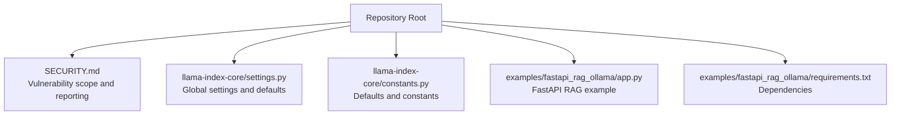
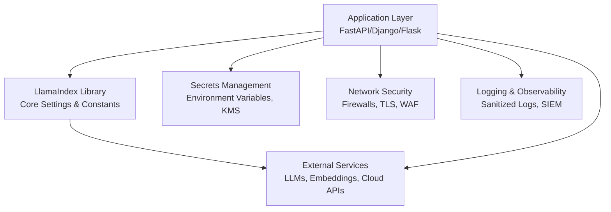
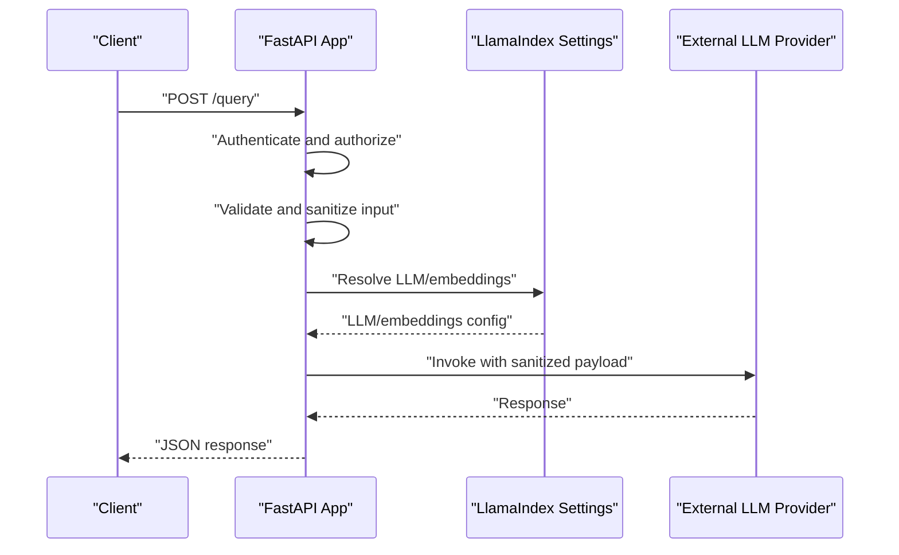
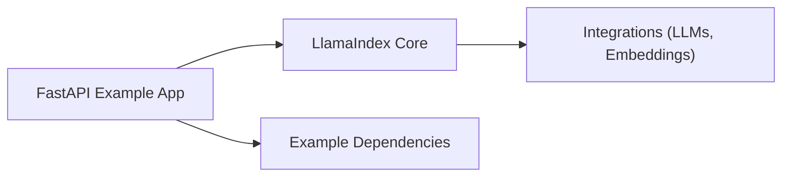

# Security and Compliance

<cite>
**Referenced Files in This Document**
- [SECURITY.md](file://SECURITY.md)
- [README.md](file://README.md)
- [settings.py](file://llama-index-core/llama_index/core/settings.py)
- [constants.py](file://llama-index-core/llama_index/core/constants.py)
- [fastapi_rag_ollama/app.py](file://examples/fastapi_rag_ollama/app.py)
- [fastapi_rag_ollama/requirements.txt](file://examples/fastapi_rag_ollama/requirements.txt)
</cite>

## Table of Contents
1. [Introduction](#introduction)
2. [Project Structure](#project-structure)
3. [Core Components](#core-components)
4. [Architecture Overview](#architecture-overview)
5. [Detailed Component Analysis](#detailed-component-analysis)
6. [Dependency Analysis](#dependency-analysis)
7. [Performance Considerations](#performance-considerations)
8. [Troubleshooting Guide](#troubleshooting-guide)
9. [Conclusion](#conclusion)
10. [Appendices](#appendices)

## Introduction
This document provides comprehensive security and compliance guidance for deploying LlamaIndex applications. It focuses on authentication, authorization, and access control strategies; encryption at rest and in transit; secure credential management and rotation; compliance considerations for GDPR, HIPAA, SOC2, and similar frameworks; network security and firewall configurations; secure API design; security checklists; vulnerability assessment procedures; and incident response plans. The guidance is grounded in the repository’s security policy and the core library’s configuration and constants.

## Project Structure
Security-relevant areas in this repository include:
- Security policy and vulnerability reporting guidance
- Core configuration and defaults that influence security posture
- Example application demonstrating a FastAPI RAG service (for API and deployment guidance)
- Documentation and ecosystem links

**Diagram sources**
- [SECURITY.md](file://SECURITY.md#L1-L88)
- [settings.py](file://llama-index-core/llama_index/core/settings.py#L1-L249)
- [constants.py](file://llama-index-core/llama_index/core/constants.py#L1-L37)
- [fastapi_rag_ollama/app.py](file://examples/fastapi_rag_ollama/app.py)
- [fastapi_rag_ollama/requirements.txt](file://examples/fastapi_rag_ollama/requirements.txt)

**Section sources**
- [SECURITY.md](file://SECURITY.md#L1-L88)
- [README.md](file://README.md#L1-L224)
- [settings.py](file://llama-index-core/llama_index/core/settings.py#L1-L249)
- [constants.py](file://llama-index-core/llama_index/core/constants.py#L1-L37)
- [fastapi_rag_ollama/app.py](file://examples/fastapi_rag_ollama/app.py)
- [fastapi_rag_ollama/requirements.txt](file://examples/fastapi_rag_ollama/requirements.txt)

## Core Components
- Global settings and defaults: Centralized configuration for LLMs, embeddings, tokenization, and prompt helper influences how credentials and data are handled during operations.
- Constants: Defaults for chunk sizes, context windows, and cloud endpoints inform resource limits and external service interactions.
- Security policy: Defines in-scope targets, out-of-scope classes, and reporting channels for vulnerabilities.

Key security-relevant aspects:
- Credential exposure risk: The security policy highlights risks when debug logging is enabled and secrets are written to logs.
- External service trust: Constants define default base URLs for cloud services, which impact trust and transport security.
- Application boundary: The security policy clarifies that web-layer security controls (authentication, authorization, rate limiting) are outside the library’s scope and must be implemented by the hosting application.

**Section sources**
- [settings.py](file://llama-index-core/llama_index/core/settings.py#L1-L249)
- [constants.py](file://llama-index-core/llama_index/core/constants.py#L1-L37)
- [SECURITY.md](file://SECURITY.md#L37-L56)

## Architecture Overview
The security architecture for LlamaIndex deployments centers on:
- Secure configuration management (avoiding hardcoded secrets, using environment variables)
- Least-privilege access to external services
- Transport security (TLS) and data-at-rest protection
- API security (authentication, authorization, rate limiting, input validation)
- Observability and logging hygiene (minimize sensitive data in logs)
- Incident response aligned with the repository’s security policy

[No sources needed since this diagram shows conceptual workflow, not actual code structure]

## Detailed Component Analysis

### Security Policy and Vulnerability Scope
- In-scope and out-of-scope targets define what vulnerabilities are eligible for bug bounties and responsible disclosure.
- The threat model clarifies that the library assumes a trusted execution environment; web-layer controls are outside scope.
- Specific out-of-scope categories include SSRF, deserialization/path traversal, prompt injection, and OWASP Top-10 issues occurring in HTTP handlers rather than within the library.

Recommended actions:
- Implement authentication, authorization, and rate limiting at the application layer.
- Validate and sanitize all user-supplied inputs before they reach the library.
- Avoid disabling TLS verification in outbound requests.
- Disable or carefully manage debug logging to prevent sensitive data exposure.

**Section sources**
- [SECURITY.md](file://SECURITY.md#L5-L56)

### Global Settings and Defaults
- Settings govern how LLMs and embeddings are resolved and configured, impacting credential handling and resource usage.
- Defaults for chunk size, overlap, and context window influence performance and potential denial-of-service vectors.
- Prompt helper defaults affect token budgeting and context window constraints.

Security implications:
- Ensure credentials are supplied via environment variables or secure secret stores, not hard-coded.
- Configure chunk sizes and overlaps to limit memory usage and mitigate resource exhaustion.
- Monitor and constrain outputs to reduce risk of excessive token consumption.

**Section sources**
- [settings.py](file://llama-index-core/llama_index/core/settings.py#L17-L249)

### Constants and External Endpoints
- Constants define default context windows and cloud base URLs.
- Default base URLs indicate trust boundaries and transport expectations.

Security implications:
- Verify TLS certificates for all external endpoints.
- Restrict outbound traffic to approved domains and ports.
- Consider regional endpoints and data residency requirements.

**Section sources**
- [constants.py](file://llama-index-core/llama_index/core/constants.py#L1-L37)

### Example FastAPI Application
The FastAPI example demonstrates a practical deployment target where security controls must be applied:
- API endpoints should enforce authentication and authorization.
- Input validation and rate limiting should be implemented.
- Secrets should be loaded from environment variables or a secret manager.
- TLS termination should be configured at the edge (reverse proxy or platform).

**Diagram sources**
- [fastapi_rag_ollama/app.py](file://examples/fastapi_rag_ollama/app.py)
- [settings.py](file://llama-index-core/llama_index/core/settings.py#L32-L47)

**Section sources**
- [fastapi_rag_ollama/app.py](file://examples/fastapi_rag_ollama/app.py)
- [fastapi_rag_ollama/requirements.txt](file://examples/fastapi_rag_ollama/requirements.txt)

## Dependency Analysis
- The library depends on external LLM and embedding providers, which introduce trust and transport considerations.
- The example application depends on FastAPI and related packages; ensure dependencies are pinned and monitored for vulnerabilities.

**Diagram sources**
- [settings.py](file://llama-index-core/llama_index/core/settings.py#L1-L249)
- [fastapi_rag_ollama/requirements.txt](file://examples/fastapi_rag_ollama/requirements.txt)

**Section sources**
- [settings.py](file://llama-index-core/llama_index/core/settings.py#L1-L249)
- [fastapi_rag_ollama/requirements.txt](file://examples/fastapi_rag_ollama/requirements.txt)

## Performance Considerations
- Resource limits: Configure chunk sizes, overlaps, and context windows to balance performance and security.
- Rate limiting: Apply at the application layer to prevent abuse and resource exhaustion.
- Caching: Use secure, encrypted caches for intermediate artifacts where applicable.

[No sources needed since this section provides general guidance]

## Troubleshooting Guide
Common security-related issues and resolutions:
- Sensitive data in logs: Disable debug logging or sanitize logs to remove secrets.
- TLS verification disabled: Re-enable certificate verification for all external requests.
- Predictable temporary files: Use secure temporary directories and avoid world-readable paths.
- Unvalidated inputs: Implement strict input validation and size limits before invoking the library.

Responsible disclosure:
- Report eligible vulnerabilities per the security policy and use the designated channels for LlamaCloud and general security concerns.

**Section sources**
- [SECURITY.md](file://SECURITY.md#L37-L88)

## Conclusion
Deploying LlamaIndex securely requires treating the library as a trusted component within a broader, secured application stack. The repository’s security policy defines scope and reporting, while core settings and constants influence how credentials and data are processed. By implementing strong authentication, authorization, rate limiting, transport security, and secure logging at the application layer—and by adhering to the security policy—you can achieve a robust, compliant deployment.

[No sources needed since this section summarizes without analyzing specific files]

## Appendices

### Security Checklist for LlamaIndex Deployments
- Environment and secrets
  - Store secrets in environment variables or a secret manager
  - Never hardcode credentials
  - Rotate secrets regularly
- Transport security
  - Enforce TLS for all external communications
  - Pin and verify certificates
- API security
  - Enforce authentication and authorization
  - Implement rate limiting and input validation
  - Sanitize logs to remove sensitive data
- Data protection
  - Encrypt data at rest using platform or KMS
  - Limit data retention and implement deletion policies
- Network security
  - Restrict outbound traffic to approved endpoints
  - Configure firewalls and WAF rules
- Monitoring and incident response
  - Integrate with SIEM and alerting
  - Follow the repository’s security policy for vulnerability reporting

[No sources needed since this section provides general guidance]

### Compliance Guidance
- GDPR
  - Data minimization, purpose limitation, storage limitation
  - Data subject rights (access, rectification, erasure)
  - Data transfers: ensure appropriate safeguards for international data flows
- HIPAA
  - Implement administrative, physical, and technical safeguards
  - Use business associate agreements where applicable
  - Encrypt protected health information at rest and in transit
- SOC 2
  - Focus on security, availability, confidentiality, privacy, and integrity
  - Document and test controls for access management and change management
- Additional frameworks
  - ISO 27001/27002, NIST CSF, PCI DSS (for payment data)

[No sources needed since this section provides general guidance]