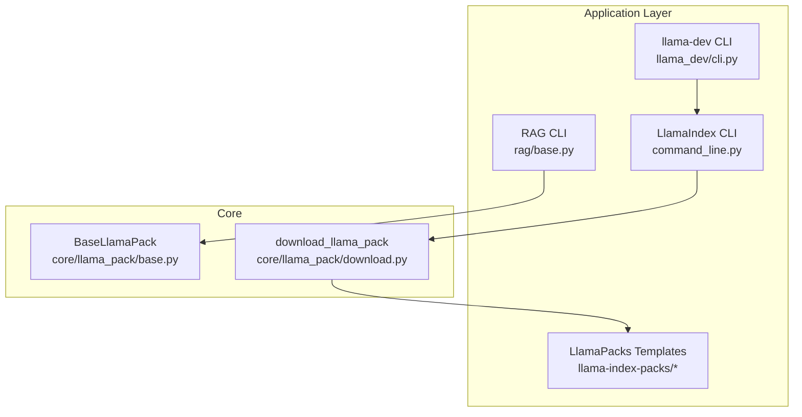
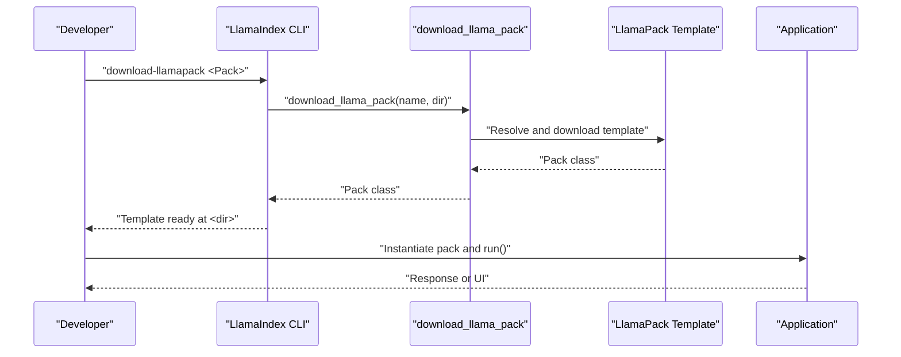
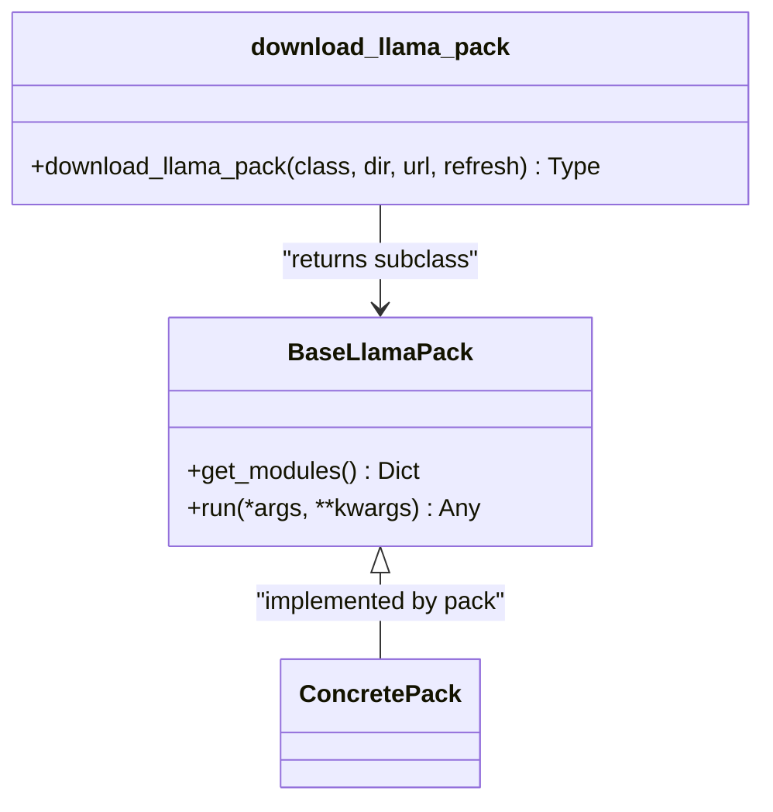
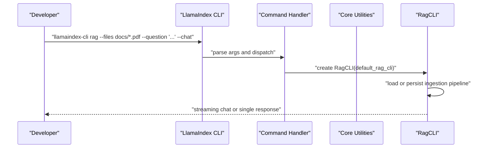
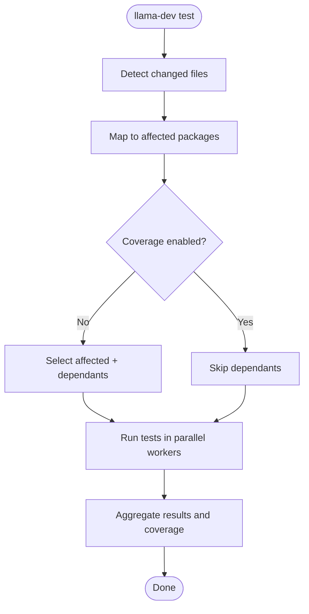
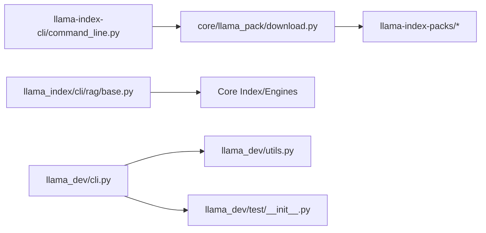

# Application Layer

<cite>
**Referenced Files in This Document**
- [README.md](file://llama-index-packs/README.md)
- [README.md](file://llama-index-cli/README.md)
- [command_line.py](file://llama-index-cli/llama_index/cli/command_line.py)
- [base.py](file://llama-index-cli/llama_index/cli/rag/base.py)
- [README.md](file://llama-dev/README.md)
- [cli.py](file://llama-dev/llama_dev/cli.py)
- [utils.py](file://llama-dev/llama_dev/utils.py)
- [__init__.py](file://llama-index-core/llama_index/core/llama_pack/__init__.py)
- [base.py](file://llama-index-core/llama_index/core/llama_pack/base.py)
- [download.py](file://llama-index-core/llama_index/core/llama_pack/download.py)
- [README.md](file://llama-index-packs/llama-index-packs-zephyr-query-engine/README.md)
- [README.md](file://llama-index-packs/llama-index-packs-streamlit-chatbot/README.md)
</cite>

## Table of Contents
1. [Introduction](#introduction)
2. [Project Structure](#project-structure)
3. [Core Components](#core-components)
4. [Architecture Overview](#architecture-overview)
5. [Detailed Component Analysis](#detailed-component-analysis)
6. [Dependency Analysis](#dependency-analysis)
7. [Performance Considerations](#performance-considerations)
8. [Troubleshooting Guide](#troubleshooting-guide)
9. [Conclusion](#conclusion)

## Introduction
This document explains the LlamaIndex application layer: higher-level abstractions that accelerate building production-ready Retrieval-Augmented Generation (RAG) applications. It covers three pillars:
- LlamaPacks: reusable, production-ready application templates you can install or download as templates for rapid iteration.
- CLI tools: the RAG CLI for quick ingestion and querying, and the LlamaIndex CLI for downloading packs and datasets, upgrading code, and initializing packages.
- Development utilities: the llama-dev CLI for monorepo workflows, including package management, smart testing, and release helpers.

These tools lower the barrier to entry while enabling advanced patterns like templated packs, persistent ingestion pipelines, and scalable testing across the monorepo.

## Project Structure
The application layer spans several packages:
- LlamaPacks: prebuilt templates under llama-index-packs/.
- CLI: RAG CLI and LlamaIndex CLI under llama-index-cli/.
- Development utilities: llama-dev under llama-dev/.

**Diagram sources**
- [command_line.py](file://llama-index-cli/llama_index/cli/command_line.py#L149-L281)
- [base.py](file://llama-index-cli/llama_index/cli/rag/base.py#L53-L350)
- [__init__.py](file://llama-index-core/llama_index/core/llama_pack/__init__.py#L1-L10)
- [base.py](file://llama-index-core/llama_index/core/llama_pack/base.py#L7-L15)
- [download.py](file://llama-index-core/llama_index/core/llama_pack/download.py#L14-L75)

**Section sources**
- [README.md](file://llama-index-cli/README.md#L1-L31)
- [README.md](file://llama-index-packs/README.md#L1-L33)
- [README.md](file://llama-dev/README.md#L1-L99)

## Core Components
- LlamaPacks system
  - Base abstraction defines get_modules() and run() for pack composition and execution.
  - download_llama_pack resolves pack classes, installs via PyPI or downloads templates, validates inheritance, and tracks usage.
- CLI tools
  - LlamaIndex CLI exposes subcommands: rag, download-llamapack, download-llamadataset, upgrade, upgrade-file, new-package.
  - RAG CLI builds an ingestion pipeline, persists vectors, and provides a chat REPL or single-shot queries.
- Development utilities
  - llama-dev orchestrates monorepo tasks: package discovery, smart test selection, parallel execution, coverage enforcement, and release helpers.

**Section sources**
- [base.py](file://llama-index-core/llama_index/core/llama_pack/base.py#L7-L15)
- [download.py](file://llama-index-core/llama_index/core/llama_pack/download.py#L14-L75)
- [command_line.py](file://llama-index-cli/llama_index/cli/command_line.py#L149-L281)
- [base.py](file://llama-index-cli/llama_index/cli/rag/base.py#L53-L350)
- [cli.py](file://llama-dev/llama_dev/cli.py#L24-L45)

## Architecture Overview
The application layer composes core building blocks into end-to-end workflows:
- LlamaPacks encapsulate complete RAG stacks (indexing, retrieval, synthesis, optional UI) as pluggable modules.
- The LlamaIndex CLI integrates with core download utilities to fetch packs and datasets.
- The RAG CLI wires ingestion, vector stores, and chat engines for interactive or scripted use.
- llama-dev coordinates monorepo-wide development, testing, and releases.

**Diagram sources**
- [command_line.py](file://llama-index-cli/llama_index/cli/command_line.py#L30-L45)
- [download.py](file://llama-index-core/llama_index/core/llama_pack/download.py#L14-L75)
- [README.md](file://llama-index-packs/README.md#L13-L33)

## Detailed Component Analysis

### LlamaPacks System
- Purpose: Provide production-ready, reusable application templates for common RAG patterns (query engines, chatbots, evaluators, etc.).
- Usage modes:
  - Install via pip for immediate use.
  - Download as a template for inspection and customization.
- Implementation highlights:
  - BaseLlamaPack enforces get_modules() and run() contracts.
  - download_llama_pack resolves pack class names, maps to installable packages, optionally downloads templates, validates inheritance, and tracks downloads.

**Diagram sources**
- [base.py](file://llama-index-core/llama_index/core/llama_pack/base.py#L7-L15)
- [download.py](file://llama-index-core/llama_index/core/llama_pack/download.py#L14-L75)

Practical examples:
- Installing a pack and using it as a template:
  - See [README.md](file://llama-index-packs/README.md#L5-L33).
- Using a specific pack’s CLI and code usage:
  - See [README.md](file://llama-index-packs/llama-index-packs-zephyr-query-engine/README.md#L7-L53).
- Using a UI pack with a CLI:
  - See [README.md](file://llama-index-packs/llama-index-packs-streamlit-chatbot/README.md#L9-L29).

**Section sources**
- [README.md](file://llama-index-packs/README.md#L1-L33)
- [README.md](file://llama-index-packs/llama-index-packs-zephyr-query-engine/README.md#L1-L53)
- [README.md](file://llama-index-packs/llama-index-packs-streamlit-chatbot/README.md#L1-L29)
- [base.py](file://llama-index-core/llama_index/core/llama_pack/base.py#L7-L15)
- [download.py](file://llama-index-core/llama_index/core/llama_pack/download.py#L14-L75)

### CLI Tools: RAG CLI and LlamaIndex CLI
- LlamaIndex CLI
  - Subcommands: rag, download-llamapack, download-llamadataset, upgrade, upgrade-file, new-package.
  - Delegates to core download utilities for packs and datasets.
- RAG CLI
  - Builds an ingestion pipeline with transformations and a vector store.
  - Persists data to a cache directory and supports a chat REPL or single-shot queries.
  - Can scaffold a LlamaIndex app using create-llama with the ingested data.

**Diagram sources**
- [command_line.py](file://llama-index-cli/llama_index/cli/command_line.py#L149-L281)
- [base.py](file://llama-index-cli/llama_index/cli/rag/base.py#L129-L278)

Practical examples:
- RAG CLI usage patterns:
  - See [README.md](file://llama-index-cli/README.md#L9-L31) and [base.py](file://llama-index-cli/llama_index/cli/rag/base.py#L129-L278).
- LlamaIndex CLI pack download:
  - See [README.md](file://llama-index-cli/README.md#L9-L31) and [command_line.py](file://llama-index-cli/llama_index/cli/command_line.py#L149-L281).

**Section sources**
- [README.md](file://llama-index-cli/README.md#L1-L31)
- [command_line.py](file://llama-index-cli/llama_index/cli/command_line.py#L149-L281)
- [base.py](file://llama-index-cli/llama_index/cli/rag/base.py#L53-L350)

### Development Utilities: llama-dev CLI
- Purpose: Simplify development workflows in the LlamaIndex monorepo.
- Key capabilities:
  - Package management: info and exec across packages.
  - Smart testing: detect changed packages and dependents, run tests in parallel, enforce coverage thresholds.
  - Release helpers: version bumping, changelog, checks, and preparation.
- Underlying utilities:
  - Discover packs, integrations, and utils; compute changed files and dependants; enforce Python version compatibility.

**Diagram sources**
- [utils.py](file://llama-dev/llama_dev/utils.py#L136-L221)
- [test/__init__.py](file://llama-dev/llama_dev/test/__init__.py#L94-L560)

Practical examples:
- Package info and exec:
  - See [README.md](file://llama-dev/README.md#L36-L80).
- Smart testing with coverage and fail-fast:
  - See [README.md](file://llama-dev/README.md#L61-L80) and [test/__init__.py](file://llama-dev/llama_dev/test/__init__.py#L94-L560).

**Section sources**
- [README.md](file://llama-dev/README.md#L1-L99)
- [cli.py](file://llama-dev/llama_dev/cli.py#L24-L45)
- [utils.py](file://llama-dev/llama_dev/utils.py#L136-L221)
- [test/__init__.py](file://llama-dev/llama_dev/test/__init__.py#L94-L560)

## Dependency Analysis
- LlamaIndex CLI depends on core download utilities to resolve and fetch packs and datasets.
- RAG CLI composes ingestion pipelines, vector stores, and chat engines from core modules.
- LlamaPacks rely on BaseLlamaPack contract and are resolved via download utilities.
- llama-dev discovers packages across the monorepo and runs tests with coverage and parallelism.

**Diagram sources**
- [command_line.py](file://llama-index-cli/llama_index/cli/command_line.py#L13-L16)
- [download.py](file://llama-index-core/llama_index/core/llama_pack/download.py#L5-L11)
- [base.py](file://llama-index-cli/llama_index/cli/rag/base.py#L10-L27)
- [cli.py](file://llama-dev/llama_dev/cli.py#L7-L9)
- [utils.py](file://llama-dev/llama_dev/utils.py#L101-L133)
- [test/__init__.py](file://llama-dev/llama_dev/test/__init__.py#L13-L22)

**Section sources**
- [command_line.py](file://llama-index-cli/llama_index/cli/command_line.py#L13-L16)
- [download.py](file://llama-index-core/llama_index/core/llama_pack/download.py#L5-L11)
- [base.py](file://llama-index-cli/llama_index/cli/rag/base.py#L10-L27)
- [cli.py](file://llama-dev/llama_dev/cli.py#L7-L9)
- [utils.py](file://llama-dev/llama_dev/utils.py#L101-L133)
- [test/__init__.py](file://llama-dev/llama_dev/test/__init__.py#L13-L22)

## Performance Considerations
- LlamaPacks: Prefer installing prebuilt packs via pip for faster startup; download templates only when customization is required.
- RAG CLI: Persist ingestion pipelines to avoid reprocessing data; leverage caching and streaming responses for interactive sessions.
- llama-dev: Use parallel workers judiciously; enable coverage selectively to reduce overhead; enforce coverage thresholds to maintain quality without slowing CI.

## Troubleshooting Guide
Common issues and resolutions:
- Missing dependencies for default RAG pipeline:
  - Ensure required packages are installed; the RAG CLI constructs a pipeline using OpenAI embeddings and Chroma vector store.
- Pack download failures:
  - Verify the pack name exists and the download directory is writable; confirm network access to the pack registry.
- llama-dev test failures:
  - Review logs for installation errors, test timeouts, or coverage failures; use debug mode to expand output.

**Section sources**
- [base.py](file://llama-index-cli/llama_index/cli/rag/base.py#L70-L146)
- [download.py](file://llama-index-core/llama_index/core/llama_pack/download.py#L45-L74)
- [test/__init__.py](file://llama-dev/llama_dev/test/__init__.py#L448-L560)

## Conclusion
The LlamaIndex application layer accelerates RAG development through:
- LlamaPacks: production-ready templates you can install or customize.
- CLI tools: streamlined workflows for ingestion, querying, and scaffolding applications.
- Development utilities: robust tooling for monorepo management, testing, and releases.

By combining these components, teams can move quickly from prototype to production while maintaining high standards for reliability and performance.