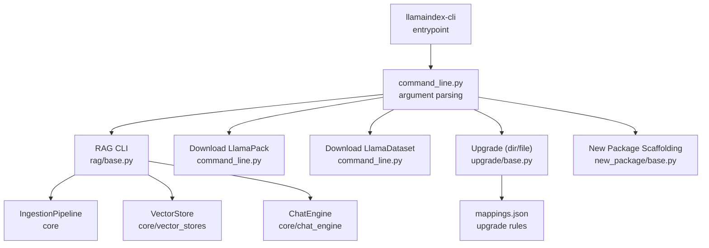
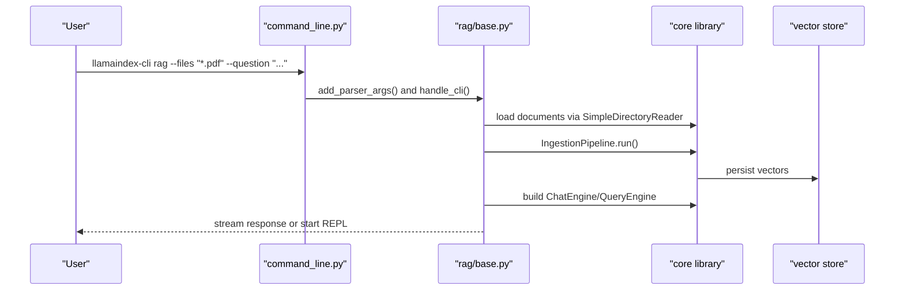
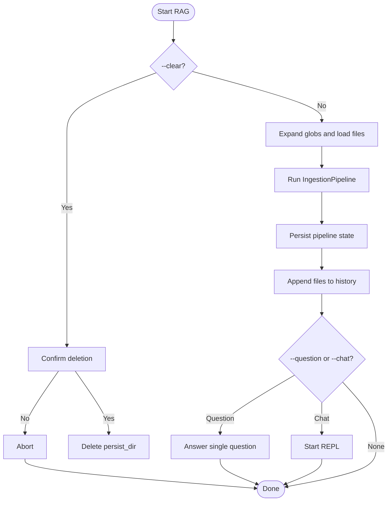
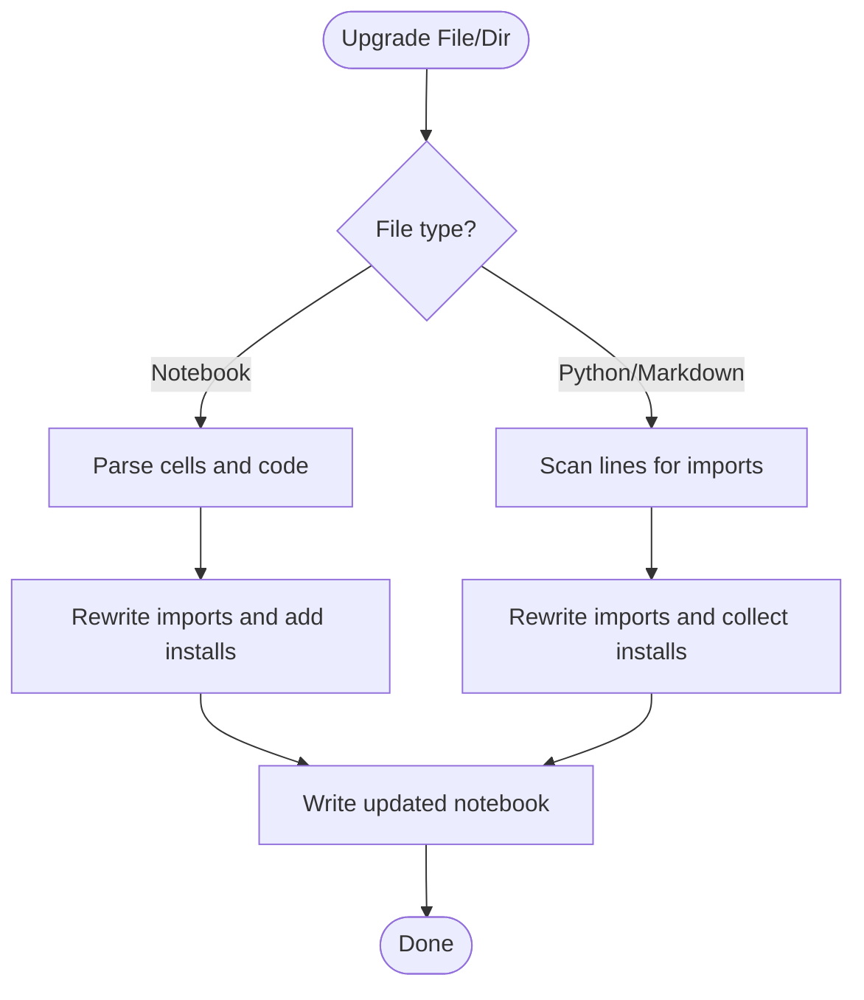
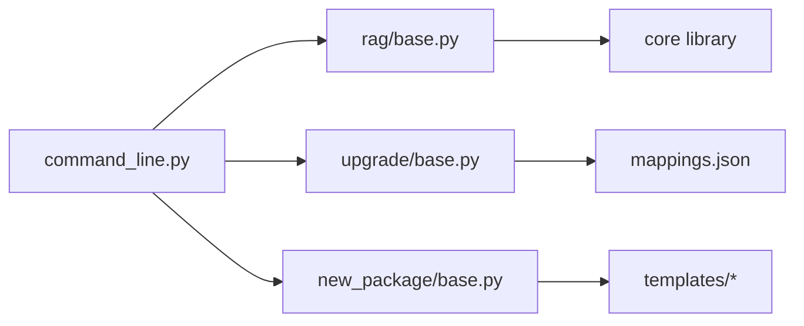

# CLI Tools

<cite>
**Referenced Files in This Document**
- [README.md](file://llama-index-cli/README.md)
- [pyproject.toml](file://llama-index-cli/pyproject.toml)
- [command_line.py](file://llama-index-cli/llama_index/cli/command_line.py)
- [base.py](file://llama-index-cli/llama_index/cli/rag/base.py)
- [base.py](file://llama-index-cli/llama_index/cli/upgrade/base.py)
- [mappings.json](file://llama-index-cli/llama_index/cli/upgrade/mappings.json)
- [base.py](file://llama-index-cli/llama_index/cli/new_package/base.py)
- [Makefile](file://llama-index-cli/llama_index/cli/new_package/common/Makefile)
- [test_rag.py](file://llama-index-cli/tests/test_rag.py)
</cite>

## Table of Contents
1. [Introduction](#introduction)
2. [Project Structure](#project-structure)
3. [Core Components](#core-components)
4. [Architecture Overview](#architecture-overview)
5. [Detailed Component Analysis](#detailed-component-analysis)
6. [Dependency Analysis](#dependency-analysis)
7. [Performance Considerations](#performance-considerations)
8. [Troubleshooting Guide](#troubleshooting-guide)
9. [Conclusion](#conclusion)
10. [Appendices](#appendices)

## Introduction
This document describes the LlamaIndex CLI tools that streamline development workflows. It covers the RAG CLI for rapid prototyping, pack management commands, dataset operations, and upgrade utilities. It explains command syntax, available options, and workflow patterns for common tasks such as creating RAG applications, managing LlamaPacks, downloading datasets, and upgrading installations. It also documents the CLI architecture, plugin/extensibility mechanisms, argument parsing, configuration handling, environment integration, troubleshooting, and best practices for automation and CI/CD.

## Project Structure
The CLI package is organized around a central command router that dispatches to subcommands. Each subcommand encapsulates a focused workflow: RAG chat/ingestion, pack downloads, dataset downloads, Python/Jupyter upgrades, and scaffolding new packages.

**Diagram sources**
- [command_line.py](file://llama-index-cli/llama_index/cli/command_line.py#L149-L281)
- [base.py](file://llama-index-cli/llama_index/cli/rag/base.py#L53-L350)
- [base.py](file://llama-index-cli/llama_index/cli/upgrade/base.py#L1-L287)
- [mappings.json](file://llama-index-cli/llama_index/cli/upgrade/mappings.json#L1-L1099)
- [base.py](file://llama-index-cli/llama_index/cli/new_package/base.py#L29-L121)

**Section sources**
- [README.md](file://llama-index-cli/README.md#L1-L31)
- [pyproject.toml](file://llama-index-cli/pyproject.toml#L49-L50)
- [command_line.py](file://llama-index-cli/llama_index/cli/command_line.py#L149-L281)

## Core Components
- RAG CLI: Interactive chat over ingested documents with optional app scaffolding via create-llama.
- Pack downloader: Fetches a LlamaPack class from LlamaHub.
- Dataset downloader: Downloads a LlamaDataset with LFS support.
- Upgrade utilities: Rewrites imports and installs for legacy notebooks and Python/Markdown files.
- New package scaffolder: Generates a new LlamaIndex integration package layout.

Key capabilities:
- Argument parsing with subparsers and per-command options.
- Default RAG pipeline with OpenAI embeddings and Chroma vector store.
- History tracking for RAG data to enable app generation.
- Security-conscious subprocess invocation for create-llama.

**Section sources**
- [command_line.py](file://llama-index-cli/llama_index/cli/command_line.py#L149-L281)
- [base.py](file://llama-index-cli/llama_index/cli/rag/base.py#L53-L350)
- [base.py](file://llama-index-cli/llama_index/cli/upgrade/base.py#L1-L287)
- [base.py](file://llama-index-cli/llama_index/cli/new_package/base.py#L29-L121)

## Architecture Overview
The CLI follows a modular architecture:
- Central entrypoint parses top-level commands and routes to subparsers.
- Each subcommand encapsulates its own argument parser and handler.
- RAG CLI composes ingestion, vector store, and chat engine abstractions from the core library.
- Upgrade utilities apply rewrite rules from a JSON mapping file.
- New package scaffolding generates boilerplate files and directories.

**Diagram sources**
- [command_line.py](file://llama-index-cli/llama_index/cli/command_line.py#L149-L281)
- [base.py](file://llama-index-cli/llama_index/cli/rag/base.py#L129-L278)

## Detailed Component Analysis

### RAG CLI
Purpose: Rapidly ingest documents, persist embeddings, and chat over them. Optionally scaffold a LlamaIndex app using create-llama.

Key behaviors:
- Accepts file patterns and directories; supports glob expansion.
- Builds an ingestion pipeline with sentence splitting and embeddings.
- Persists pipeline state and maintains a files history file.
- Creates a REPL or answers a single question.
- Generates a LlamaIndex app using create-llama with validated single-source data.

Options summary:
- --files: One or more files/directories (supports globs).
- --question: Single-shot question.
- --chat: Enter REPL mode.
- --verbose: Verbose logging.
- --clear: Clear persisted data after confirmation.
- --create-llama: Generate a FastAPI app from ingested data.

Workflow highlights:
- Default RAG pipeline uses OpenAI embeddings and Chroma vector store.
- If dependencies are missing, instructs installation of required packages.
- History file ensures only a single source is used for app generation.

Security note:
- Uses subprocess with explicit list and check=True to avoid shell injection.

**Diagram sources**
- [base.py](file://llama-index-cli/llama_index/cli/rag/base.py#L129-L278)

**Section sources**
- [command_line.py](file://llama-index-cli/llama_index/cli/command_line.py#L149-L147)
- [base.py](file://llama-index-cli/llama_index/cli/rag/base.py#L53-L350)
- [test_rag.py](file://llama-index-cli/tests/test_rag.py#L25-L112)

### Pack Management Commands
- download-llamapack: Downloads a LlamaPack class to a target directory using LlamaHub URLs.
- download-llamadataset: Downloads a LlamaDataset with LFS and tree URL options.

Options:
- --download-dir: Target directory for downloads.
- --llama-hub-url: Override LlamaHub base URL.
- --llama-datasets-lfs-url: Override datasets LFS URL.

Usage patterns:
- Provide the class name (e.g., a pack or dataset identifier).
- Use custom directories for isolation in CI or monorepos.

**Section sources**
- [command_line.py](file://llama-index-cli/llama_index/cli/command_line.py#L30-L68)

### Upgrade Utilities
- upgrade: Recursively upgrades .py, .ipynb, and .md files under a directory.
- upgrade-file: Upgrades a single file.

Mechanism:
- Reads a mapping of legacy imports to new module locations.
- Rewrites import statements and injects pip install lines for new packages.
- For notebooks, inserts a code cell with install commands at the top.

Rules:
- Uses mappings.json to resolve legacy module names to new packages.
- Detects llama_hub download_loader/download_tool usage and updates accordingly.
- Skips hidden directories and files.

**Diagram sources**
- [base.py](file://llama-index-cli/llama_index/cli/upgrade/base.py#L116-L178)
- [mappings.json](file://llama-index-cli/llama_index/cli/upgrade/mappings.json#L1-L1099)

**Section sources**
- [base.py](file://llama-index-cli/llama_index/cli/upgrade/base.py#L1-L287)
- [mappings.json](file://llama-index-cli/llama_index/cli/upgrade/mappings.json#L1-L1099)

### New Package Scaffolding
- new-package: Initializes a new LlamaIndex integration package with a standardized structure.

Options:
- --kind: Integration kind (e.g., llm, embedding, pack).
- --name: Python package name.
- --prefix: Optional namespace prefix.

Generated layout:
- Package directory with src, tests, examples.
- __init__.py files and pyproject.toml with Poetry configuration.
- README.md and common files (.gitignore, Makefile, BUILD).

**Section sources**
- [command_line.py](file://llama-index-cli/llama_index/cli/command_line.py#L247-L271)
- [base.py](file://llama-index-cli/llama_index/cli/new_package/base.py#L29-L121)
- [Makefile](file://llama-index-cli/llama_index/cli/new_package/common/Makefile#L1-L18)

## Dependency Analysis
Runtime dependencies:
- Core CLI entrypoint depends on submodules for RAG, upgrade, and new package scaffolding.
- RAG CLI depends on ingestion pipeline, vector stores, and chat engines from the core library.
- Upgrade utilities depend on mappings.json for rewriting rules.
- New package scaffolding depends on templates and common assets.

**Diagram sources**
- [command_line.py](file://llama-index-cli/llama_index/cli/command_line.py#L1-L281)
- [base.py](file://llama-index-cli/llama_index/cli/rag/base.py#L1-L350)
- [base.py](file://llama-index-cli/llama_index/cli/upgrade/base.py#L1-L287)
- [base.py](file://llama-index-cli/llama_index/cli/new_package/base.py#L1-L121)
- [mappings.json](file://llama-index-cli/llama_index/cli/upgrade/mappings.json#L1-L1099)

**Section sources**
- [pyproject.toml](file://llama-index-cli/pyproject.toml#L43-L47)
- [command_line.py](file://llama-index-cli/llama_index/cli/command_line.py#L1-L281)

## Performance Considerations
- RAG ingestion cost scales with document volume and chunk size; use verbose mode to monitor progress.
- Vector store persistence occurs after ingestion; ensure sufficient disk space in the cache directory.
- Upgrade operations scan and rewrite files; prefer running on targeted directories to minimize overhead.
- New package scaffolding writes many small files; avoid running in extremely large repositories.

## Troubleshooting Guide
Common issues and resolutions:
- Missing vector store dependency for default RAG pipeline:
  - Symptom: Import error indicating missing Chroma client.
  - Resolution: Install the Chroma vector store package as indicated by the CLI message.
- Missing OpenAI embeddings/Llama model dependency:
  - Symptom: Import error for OpenAI embedding/model.
  - Resolution: Install the required packages as instructed by the CLI.
- Permission problems:
  - Symptom: Failures when writing to cache/persist directories.
  - Resolution: Ensure write permissions to the cache directory and target download directories.
- Platform-specific considerations:
  - Symptom: npx not found when using --create-llama.
  - Resolution: Install Node.js/npm and ensure npx is available on PATH.
- Subprocess security:
  - Behavior: CLI invokes external commands with shell=False and check=True to prevent injection and surface errors.
  - Validation: Tests confirm secure invocation patterns and error propagation.

Operational tips:
- Use --clear to reset cached embeddings when switching datasets.
- Limit --files to a single source for --create-llama to avoid ambiguity.
- For notebooks, review injected install cells before committing.

**Section sources**
- [command_line.py](file://llama-index-cli/llama_index/cli/command_line.py#L70-L147)
- [base.py](file://llama-index-cli/llama_index/cli/rag/base.py#L193-L252)
- [test_rag.py](file://llama-index-cli/tests/test_rag.py#L25-L112)

## Conclusion
The LlamaIndex CLI provides a cohesive toolkit for rapid RAG prototyping, dataset and pack acquisition, modernization of legacy notebooks and code, and scaffolding new integrations. Its modular design, robust argument parsing, and security-conscious subprocess usage make it suitable for interactive development and automated workflows.

## Appendices

### Command Reference and Examples
- RAG CLI
  - Syntax: llamaindex-cli rag [--files <paths...>] [--question <text>] [--chat] [--verbose] [--clear] [--create-llama]
  - Example: llamaindex-cli rag --files "./docs/*.pdf" --question "What is RAG?"
  - Example: llamaindex-cli rag --files "./data" --chat
- Download LlamaPack
  - Syntax: llamaindex-cli download-llamapack <PackClassName> [-d/--download-dir <path>] [--llama-hub-url <url>]
  - Example: llamaindex-cli download-llamapack GmailOpenAIAgentPack -d ./my_packs
- Download LlamaDataset
  - Syntax: llamaindex-cli download-llamadataset <DatasetClassName> [-d/--download-dir <path>] [--llama-hub-url <url>] [--llama-datasets-lfs-url <url>]
  - Example: llamaindex-cli download-llamadataset PaulGrahamEssayDataset -d ./datasets
- Upgrade
  - Syntax: llamaindex-cli upgrade <directory>
  - Example: llamaindex-cli upgrade ./notebooks
  - Syntax: llamaindex-cli upgrade-file <path>
  - Example: llamaindex-cli upgrade-file ./script.py
- New Package
  - Syntax: llamaindex-cli new-package [-k/--kind <type>] [-n/--name <name>] [-p/--prefix <prefix>]
  - Example: llamaindex-cli new-package -k pack -n my-pack -p myorg

### Configuration and Environment
- Entry point: The console script llamaindex-cli maps to the main function in command_line.py.
- Version and dependencies: Managed in pyproject.toml; ensure compatible versions of core and integrations.
- Cache/persist directory: Defaults to a cache directory under the OS-specific cache path; override behavior is implemented in the RAG CLI.

**Section sources**
- [README.md](file://llama-index-cli/README.md#L1-L31)
- [pyproject.toml](file://llama-index-cli/pyproject.toml#L49-L50)
- [command_line.py](file://llama-index-cli/llama_index/cli/command_line.py#L45-L147)

### Automation and CI/CD Best Practices
- Pre-install dependencies: Ensure required vector stores and LLM/embedding packages are installed in CI images.
- Cache artifacts: Persist the RAG pipeline directory between jobs to avoid re-ingestion.
- Isolate downloads: Use dedicated --download-dir options for packs/datasets to simplify cleanup.
- Notebook hygiene: Run upgrade on notebooks prior to linting and testing to keep imports current.
- Security: Avoid shell=True in subprocess; the CLI already enforces safe invocation patterns.

[No sources needed since this section provides general guidance]