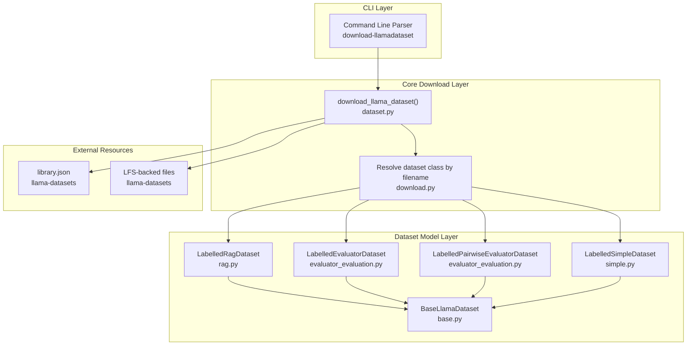
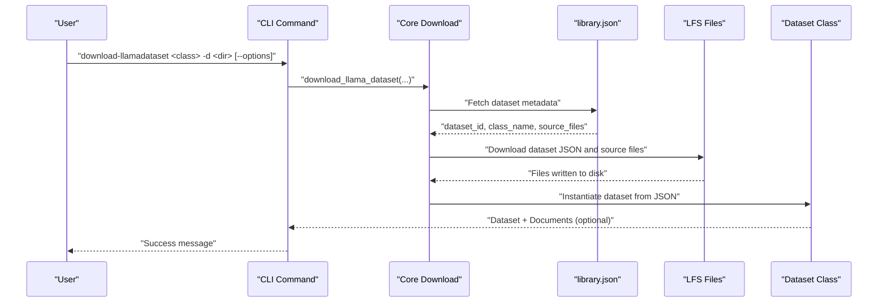
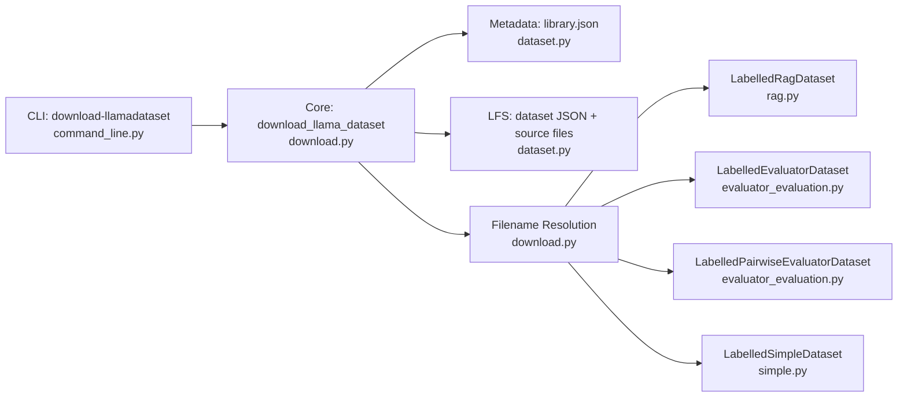

# Dataset Operations

<cite>
**Referenced Files in This Document**
- [command_line.py](file://llama-index-cli/llama_index/cli/command_line.py)
- [download.py](file://llama-index-core/llama_index/core/llama_dataset/download.py)
- [dataset.py](file://llama-index-core/llama_index/core/download/dataset.py)
- [base.py](file://llama-index-core/llama_index/core/llama_dataset/base.py)
- [rag.py](file://llama-index-core/llama_index/core/llama_dataset/rag.py)
- [evaluator_evaluation.py](file://llama-index-core/llama_index/core/llama_dataset/evaluator_evaluation.py)
- [simple.py](file://llama-index-core/llama_index/core/llama_dataset/simple.py)
- [downloading_llama_datasets.ipynb](file://docs/examples/llama_dataset/downloading_llama_datasets.ipynb)
- [library.json](file://llama-datasets/library.json)
</cite>

## Table of Contents
1. [Introduction](#introduction)
2. [Project Structure](#project-structure)
3. [Core Components](#core-components)
4. [Architecture Overview](#architecture-overview)
5. [Detailed Component Analysis](#detailed-component-analysis)
6. [Dependency Analysis](#dependency-analysis)
7. [Performance Considerations](#performance-considerations)
8. [Troubleshooting Guide](#troubleshooting-guide)
9. [Conclusion](#conclusion)
10. [Appendices](#appendices)

## Introduction
This document explains how to operate datasets using the CLI tools, focusing on the download-llamadataset command. It covers the llama_dataset_class parameter, download directory configuration, URL customization options, and how to access benchmark datasets for RAG evaluation and performance testing. Practical examples demonstrate dataset download workflows, verification processes, and integration with evaluation frameworks. It also documents supported dataset types, size considerations, storage requirements, and best practices for dataset organization, version management, and team collaboration.

## Project Structure
The dataset operation capability spans three layers:
- CLI layer: exposes the download-llamadataset command and parses arguments.
- Core dataset download layer: resolves dataset metadata, downloads dataset JSON and source files, and loads dataset objects.
- Dataset model layer: defines dataset classes (RAG, evaluator, simple) and prediction workflows.

**Diagram sources**
- [command_line.py](file://llama-index-cli/llama_index/cli/command_line.py#L190-L223)
- [download.py](file://llama-index-core/llama_index/core/llama_dataset/download.py#L35-L95)
- [dataset.py](file://llama-index-core/llama_index/core/download/dataset.py#L184-L261)
- [base.py](file://llama-index-core/llama_index/core/llama_dataset/base.py#L130-L357)
- [rag.py](file://llama-index-core/llama_index/core/llama_dataset/rag.py#L118-L187)
- [evaluator_evaluation.py](file://llama-index-core/llama_index/core/llama_dataset/evaluator_evaluation.py#L150-L266)
- [simple.py](file://llama-index-core/llama_index/core/llama_dataset/simple.py#L77-L142)

**Section sources**
- [command_line.py](file://llama-index-cli/llama_index/cli/command_line.py#L190-L223)
- [download.py](file://llama-index-core/llama_index/core/llama_dataset/download.py#L35-L95)
- [dataset.py](file://llama-index-core/llama_index/core/download/dataset.py#L184-L261)

## Core Components
- CLI command: download-llamadataset accepts the dataset class name, download directory, and URL customization options. It delegates to the core download function and prints a success message.
- Core download: fetches dataset metadata from library.json, determines dataset-specific filenames, downloads dataset JSON and source files, and constructs a dataset object. For RAG datasets, it can optionally load Documents from source_files.
- Dataset models: define typed examples and predictions for RAG, evaluator, pairwise evaluator, and simple classification tasks. They support synchronous and asynchronous prediction workflows and export to pandas.

Key parameters and behaviors:
- llama_dataset_class: The dataset class identifier (e.g., PaulGrahamEssayDataset).
- download_dir: Target directory for downloaded dataset artifacts.
- URL customization: llama-hub URL, datasets LFS URL, and GitHub tree URL for source files listing.
- Load behavior: For RAG datasets, Documents can be loaded from source_files if requested.

**Section sources**
- [command_line.py](file://llama-index-cli/llama_index/cli/command_line.py#L47-L67)
- [download.py](file://llama-index-core/llama_index/core/llama_dataset/download.py#L35-L95)
- [dataset.py](file://llama-index-core/llama_index/core/download/dataset.py#L184-L261)
- [base.py](file://llama-index-core/llama_index/core/llama_dataset/base.py#L211-L350)
- [rag.py](file://llama-index-core/llama_index/core/llama_dataset/rag.py#L118-L187)

## Architecture Overview
End-to-end flow for downloading and using a LlamaDataset:

**Diagram sources**
- [command_line.py](file://llama-index-cli/llama_index/cli/command_line.py#L47-L67)
- [download.py](file://llama-index-core/llama_index/core/llama_dataset/download.py#L35-L95)
- [dataset.py](file://llama-index-core/llama_index/core/download/dataset.py#L184-L261)

## Detailed Component Analysis

### CLI: download-llamadataset
- Arguments:
  - llama_dataset_class: Required dataset class name.
  - -d/--download-dir: Target directory (defaults to ./llama_datasets).
  - --llama-hub-url: Overrides default LlamaHub URL.
  - --llama-datasets-lfs-url: Overrides default LFS URL for dataset files.
- Behavior:
  - Validates inputs.
  - Calls the core download function with show_progress enabled and load_documents disabled by default.
  - Prints a success message upon completion.

Practical example (conceptual):
- Download a dataset to a custom directory and verify the presence of dataset JSON and source_files.

Verification steps:
- Confirm dataset JSON exists under the dataset’s ID subfolder.
- Confirm source_files directory exists and contains expected files.

**Section sources**
- [command_line.py](file://llama-index-cli/llama_index/cli/command_line.py#L190-L223)
- [command_line.py](file://llama-index-cli/llama_index/cli/command_line.py#L47-L67)

### Core Download: download_llama_dataset
- Responsibilities:
  - Resolve dataset metadata from library.json.
  - Determine dataset-specific JSON filename based on class name.
  - Download dataset JSON and source files (when applicable).
  - Instantiate the correct dataset class from JSON.
  - Optionally load Documents from source_files for RAG datasets.
- Key constants and URLs:
  - LLAMA_DATASETS_URL, LLAMA_DATASETS_LFS_URL, LLAMA_DATASETS_SOURCE_FILES_GITHUB_TREE_URL.
- Output:
  - Returns a tuple of (dataset JSON path, source_files directory path).

Notes:
- For LabelledRagDataset, Documents are loaded only when load_documents is True.
- Progress reporting is controlled by show_progress.

**Section sources**
- [download.py](file://llama-index-core/llama_index/core/llama_dataset/download.py#L35-L95)
- [dataset.py](file://llama-index-core/llama_index/core/download/dataset.py#L184-L261)

### Dataset Models: Supported Types and Workflows
- LabelledRagDataset
  - Purpose: Benchmark datasets with queries, reference contexts, and reference answers.
  - Prediction: Uses a BaseQueryEngine to produce response and contexts.
  - Export: to_pandas() yields query, reference_contexts, reference_answer, etc.
- LabelledEvaluatorDataset
  - Purpose: Evaluate responses against ground-truth answers using evaluators.
  - Prediction: Uses a BaseEvaluator to produce feedback and scores.
  - Export: to_pandas() yields query, answer, contexts, reference feedback/score, etc.
- LabelledPairwiseEvaluatorDataset
  - Purpose: Compare two responses and derive an ordering judgment.
  - Prediction: Uses a BaseEvaluator with pairwise comparison.
  - Export: to_pandas() includes ordering information.
- LabelledSimpleDataset
  - Purpose: Simple classification tasks with text and reference labels.
  - Prediction: Intended for LLM-based labeling; current implementation raises NotImplementedError for direct prediction.

Common capabilities:
- Synchronous and asynchronous prediction workflows.
- Batch processing with configurable batch_size and sleep intervals.
- Caching of partial predictions to resume interrupted runs.
- Export to pandas for downstream analysis.

**Section sources**
- [rag.py](file://llama-index-core/llama_index/core/llama_dataset/rag.py#L118-L187)
- [evaluator_evaluation.py](file://llama-index-core/llama_index/core/llama_dataset/evaluator_evaluation.py#L150-L266)
- [evaluator_evaluation.py](file://llama-index-core/llama_index/core/llama_dataset/evaluator_evaluation.py#L360-L493)
- [simple.py](file://llama-index-core/llama_index/core/llama_dataset/simple.py#L77-L142)
- [base.py](file://llama-index-core/llama_index/core/llama_dataset/base.py#L211-L350)

### Practical Workflow Examples
- Download a benchmark dataset and inspect its structure:
  - Use download-llamadataset to fetch dataset JSON and source files.
  - Load the dataset and convert to pandas for inspection.
- Build a baseline RAG pipeline and evaluate:
  - Load Documents from source_files for RAG datasets.
  - Build an index and query engine.
  - Generate predictions and compute evaluation metrics (e.g., correctness, relevancy, faithfulness, context similarity).
- Use evaluation packs:
  - Download and run evaluation packs for streamlined evaluation.

Note: The notebook demonstrates end-to-end evaluation using a query engine and multiple evaluators.

**Section sources**
- [downloading_llama_datasets.ipynb](file://docs/examples/llama_dataset/downloading_llama_datasets.ipynb#L49-L174)
- [downloading_llama_datasets.ipynb](file://docs/examples/llama_dataset/downloading_llama_datasets.ipynb#L244-L333)
- [downloading_llama_datasets.ipynb](file://docs/examples/llama_dataset/downloading_llama_datasets.ipynb#L426-L464)

### Supported Dataset Types and Library
- The library enumerates available datasets and maps class names to dataset IDs and keywords.
- Example entries include PaulGrahamEssayDataset, MiniTruthfulQADataset, Llama2PaperDataset, and others.

Use the dataset class name as the llama_dataset_class argument to the CLI.

**Section sources**
- [library.json](file://llama-datasets/library.json#L1-L88)

### Size Considerations and Storage Requirements
- LFS-backed files are downloaded from the LFS URL; expect larger files for PDFs and large corpora.
- Source files are stored under a dedicated source_files directory per dataset.
- Plan disk space accordingly, especially for datasets with many PDFs or large text corpora.

[No sources needed since this section provides general guidance]

### Accessing Benchmark Datasets and Evaluating RAG Systems
- Use LabelledRagDataset for RAG benchmarking.
- Generate predictions via amake_predictions_with or make_predictions_with.
- Evaluate using standard evaluators (Correctness, Relevancy, Faithfulness) and context similarity.
- Compare against published benchmark scores and interpret results.

**Section sources**
- [rag.py](file://llama-index-core/llama_index/core/llama_dataset/rag.py#L118-L187)
- [downloading_llama_datasets.ipynb](file://docs/examples/llama_dataset/downloading_llama_datasets.ipynb#L370-L464)

### Conducting Performance Testing
- Batch predictions with adjustable batch_size and sleep intervals to avoid rate limits.
- Resume interrupted evaluations using cached predictions.
- Export evaluation results to JSON and compute aggregated metrics.

**Section sources**
- [base.py](file://llama-index-core/llama_index/core/llama_dataset/base.py#L211-L350)

### Dataset Organization, Version Management, and Sharing
- Organization:
  - Each dataset is placed under a dataset-specific subfolder named by its dataset_id.
  - Dataset JSON and source_files are co-located.
- Versioning:
  - The library.json acts as a registry; updates propagate via remote fetching.
  - Use refresh_cache to bypass local cache and fetch latest metadata.
- Sharing:
  - Distribute dataset JSON and source_files among team members.
  - Use consistent download_dir conventions to ensure reproducibility.

**Section sources**
- [dataset.py](file://llama-index-core/llama_index/core/download/dataset.py#L184-L261)

## Dependency Analysis
The CLI depends on the core download function, which in turn depends on dataset metadata resolution and file downloads. Dataset classes depend on the base dataset abstraction and are resolved by filename patterns.

**Diagram sources**
- [command_line.py](file://llama-index-cli/llama_index/cli/command_line.py#L47-L67)
- [download.py](file://llama-index-core/llama_index/core/llama_dataset/download.py#L35-L95)
- [dataset.py](file://llama-index-core/llama_index/core/download/dataset.py#L184-L261)
- [rag.py](file://llama-index-core/llama_index/core/llama_dataset/rag.py#L118-L187)
- [evaluator_evaluation.py](file://llama-index-core/llama_index/core/llama_dataset/evaluator_evaluation.py#L150-L266)
- [simple.py](file://llama-index-core/llama_index/core/llama_dataset/simple.py#L77-L142)

**Section sources**
- [command_line.py](file://llama-index-cli/llama_index/cli/command_line.py#L47-L67)
- [download.py](file://llama-index-core/llama_index/core/llama_dataset/download.py#L35-L95)
- [dataset.py](file://llama-index-core/llama_index/core/download/dataset.py#L184-L261)

## Performance Considerations
- Batch size and sleep intervals:
  - Tune batch_size and sleep_time_in_seconds to avoid rate limits during predictions.
- Progress reporting:
  - Enable show_progress to monitor long-running downloads and predictions.
- Document loading:
  - For RAG datasets, loading Documents from source_files can be expensive; consider lazy loading or caching strategies.

[No sources needed since this section provides general guidance]

## Troubleshooting Guide
Common issues and resolutions:
- Network errors during download:
  - Verify URLs and connectivity; retry with refresh_cache to bypass stale cache.
- Insufficient disk space:
  - Ensure sufficient free space for LFS-backed files and source_files.
- Rate limit errors during evaluation:
  - Reduce batch_size and increase sleep_time_in_seconds; the prediction workflow caches partial results to resume later.
- Unknown dataset class:
  - Confirm the class name exists in library.json and matches the expected casing.
- Missing Documents for RAG:
  - Ensure load_documents is enabled when calling the core download function for RAG datasets.

**Section sources**
- [base.py](file://llama-index-core/llama_index/core/llama_dataset/base.py#L328-L341)
- [dataset.py](file://llama-index-core/llama_index/core/download/dataset.py#L184-L261)

## Conclusion
The download-llamadataset command provides a streamlined way to access curated benchmark datasets, download dataset JSON and source files, and integrate them into RAG evaluation workflows. By leveraging dataset classes and evaluation tools, teams can benchmark models, conduct performance testing, and validate research hypotheses efficiently. Proper organization, versioning, and sharing practices ensure reproducibility and collaboration across projects.

[No sources needed since this section summarizes without analyzing specific files]

## Appendices

### Appendix A: CLI Options Summary
- llama_dataset_class: Required dataset class name.
- -d/--download-dir: Target directory for downloads.
- --llama-hub-url: Override default LlamaHub URL.
- --llama-datasets-lfs-url: Override default LFS URL for dataset files.

**Section sources**
- [command_line.py](file://llama-index-cli/llama_index/cli/command_line.py#L190-L223)

### Appendix B: Supported Dataset Classes (Selected)
- LabelledRagDataset (e.g., PaulGrahamEssayDataset)
- LabelledEvaluatorDataset
- LabelledPairwiseEvaluatorDataset
- LabelledSimpleDataset

**Section sources**
- [library.json](file://llama-datasets/library.json#L1-L88)
- [rag.py](file://llama-index-core/llama_index/core/llama_dataset/rag.py#L118-L187)
- [evaluator_evaluation.py](file://llama-index-core/llama_index/core/llama_dataset/evaluator_evaluation.py#L150-L266)
- [simple.py](file://llama-index-core/llama_index/core/llama_dataset/simple.py#L77-L142)