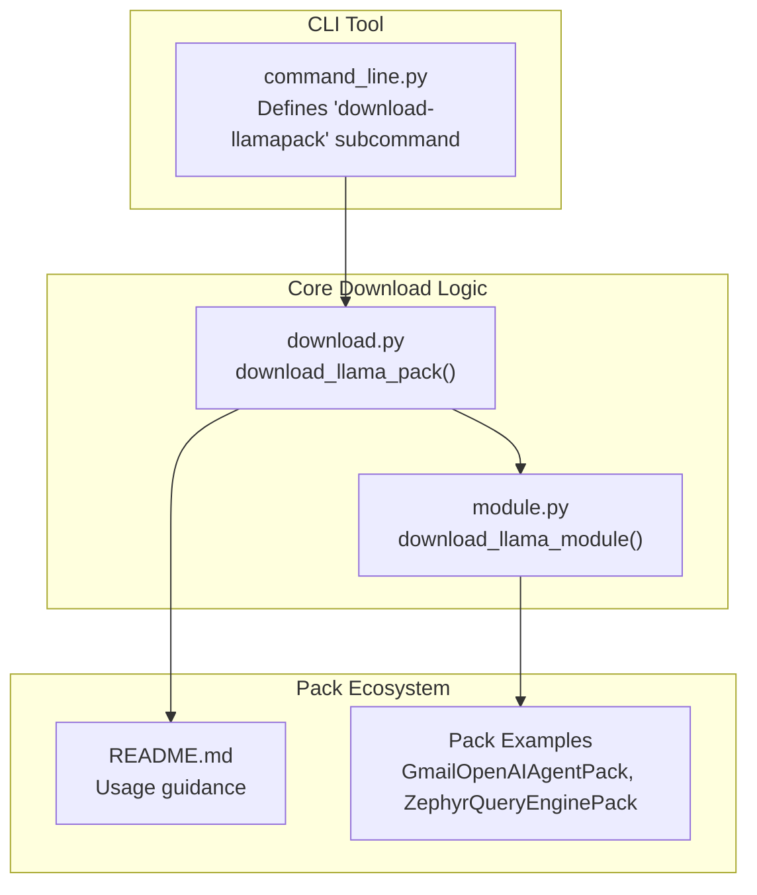
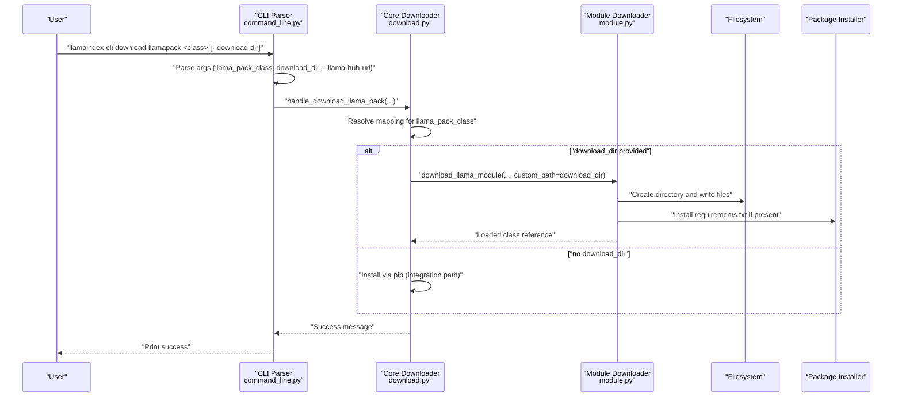
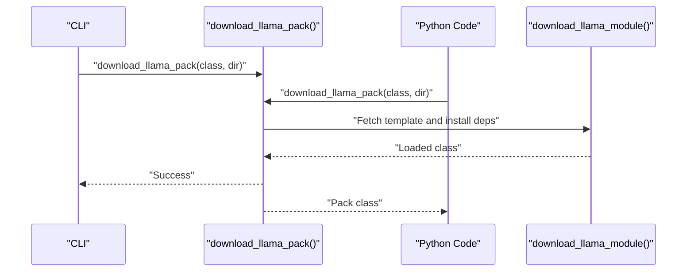
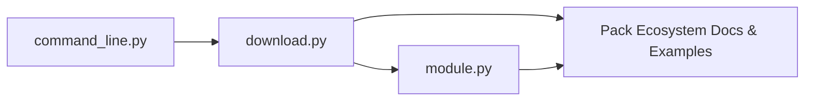

# Pack Management

<cite>
**Referenced Files in This Document**
- [README.md](file://llama-index-cli/README.md)
- [pyproject.toml](file://llama-index-cli/pyproject.toml)
- [command_line.py](file://llama-index-cli/llama_index/cli/command_line.py)
- [README.md](file://llama-index-packs/README.md)
- [README.md](file://llama-index-packs/llama-index-packs-gmail-openai-agent/README.md)
- [pyproject.toml](file://llama-index-packs/llama-index-packs-gmail-openai-agent/pyproject.toml)
- [README.md](file://llama-index-packs/llama-index-packs-zephyr-query-engine/README.md)
- [download.py](file://llama-index-core/llama_index/core/llama_pack/download.py)
- [module.py](file://llama-index-core/llama_index/core/download/module.py)
</cite>

## Table of Contents
1. [Introduction](#introduction)
2. [Project Structure](#project-structure)
3. [Core Components](#core-components)
4. [Architecture Overview](#architecture-overview)
5. [Detailed Component Analysis](#detailed-component-analysis)
6. [Dependency Analysis](#dependency-analysis)
7. [Performance Considerations](#performance-considerations)
8. [Troubleshooting Guide](#troubleshooting-guide)
9. [Conclusion](#conclusion)
10. [Appendices](#appendices)

## Introduction
This document explains how to manage LlamaPacks using the LlamaIndex CLI, focusing on the download-llamapack command. It covers command syntax, parameters, download directory options, URL configuration, discovering available packs, understanding pack dependencies, integrating downloaded packs into projects, and bridging CLI downloads with direct code usage. Practical examples demonstrate downloading specific packs (for example, GmailOpenAIAgentPack), configuring download locations, verifying successful installation, managing pack versions, resolving dependencies, troubleshooting failures, and customizing packs for contribution back to the community.

## Project Structure
The LlamaPack management capability spans three areas:
- CLI tooling that exposes the download-llamapack command
- Core download logic that resolves pack classes to Python packages and downloads templates
- Pack ecosystem repositories that host ready-to-use pack packages and templates

**Diagram sources**
- [command_line.py](file://llama-index-cli/llama_index/cli/command_line.py#L149-L281)
- [download.py](file://llama-index-core/llama_index/core/llama_pack/download.py#L14-L75)
- [module.py](file://llama-index-core/llama_index/core/download/module.py#L179-L261)
- [README.md](file://llama-index-packs/README.md#L1-L33)
- [README.md](file://llama-index-packs/llama-index-packs-gmail-openai-agent/README.md#L1-L51)
- [README.md](file://llama-index-packs/llama-index-packs-zephyr-query-engine/README.md#L1-L53)

**Section sources**
- [README.md](file://llama-index-cli/README.md#L1-L31)
- [pyproject.toml](file://llama-index-cli/pyproject.toml#L49-L50)
- [command_line.py](file://llama-index-cli/llama_index/cli/command_line.py#L149-L281)
- [README.md](file://llama-index-packs/README.md#L1-L33)

## Core Components
- CLI command definition and argument parsing for download-llamapack
- Core download function that maps pack class names to installable packages or templates
- Module-level downloader that fetches pack templates and installs dependencies
- Pack ecosystem documentation and examples for usage and customization

Key responsibilities:
- CLI: parse llama_pack_class, download_dir, and optional URL configuration; invoke the core download handler
- Core: resolve pack class to a Python package or template; download and validate
- Module: fetch files from remote, write to disk, install requirements, and load the class
- Packs: provide ready-to-install packages or templates for customization

**Section sources**
- [command_line.py](file://llama-index-cli/llama_index/cli/command_line.py#L161-L188)
- [download.py](file://llama-index-core/llama_index/core/llama_pack/download.py#L14-L75)
- [module.py](file://llama-index-core/llama_index/core/download/module.py#L179-L261)
- [README.md](file://llama-index-packs/README.md#L1-L33)

## Architecture Overview
The download-llamapack flow connects CLI arguments to core pack resolution and template fetching.

**Diagram sources**
- [command_line.py](file://llama-index-cli/llama_index/cli/command_line.py#L161-L188)
- [download.py](file://llama-index-core/llama_index/core/llama_pack/download.py#L14-L75)
- [module.py](file://llama-index-core/llama_index/core/download/module.py#L179-L261)

## Detailed Component Analysis

### CLI Command: download-llamapack
- Purpose: Download a LlamaPack template to a local directory for inspection and customization
- Required positional argument:
  - llama_pack_class: the pack class name to download (for example, GmailOpenAIAgentPack)
- Options:
  - --download-dir (-d): target directory for the downloaded template (defaults to a specific path)
  - --llama-hub-url: override the default LlamaHub URL used for fetching pack templates
- Behavior:
  - Validates presence of llama_pack_class and download_dir
  - Delegates to the core download function with defaults and provided options
  - Prints a success message upon completion

Practical example:
- Download GmailOpenAIAgentPack to a custom directory:
  - llamaindex-cli download-llamapack GmailOpenAIAgentPack --download-dir ./gmail_pack

Verification:
- Confirm the directory exists and contains the expected pack files and requirements

**Section sources**
- [command_line.py](file://llama-index-cli/llama_index/cli/command_line.py#L161-L188)
- [README.md](file://llama-index-packs/README.md#L18-L21)

### Core Download Function: download_llama_pack
- Purpose: Resolve a pack class to either an installable Python package or a template, then download and validate
- Key steps:
  - Load mappings to translate llama_pack_class into a package name
  - If download_dir is provided, download the template via the module downloader
  - Track the download for analytics
  - Validate that the loaded class is a subclass of BaseLlamaPack
- Parameters:
  - llama_pack_class: the pack class to download
  - download_dir: optional; if omitted, the integration path installs via pip
  - llama_pack_url: URL for pack contents (defaults to a constant)
  - refresh_cache: controls whether to bypass local caches

Notes:
- When download_dir is omitted, the function installs the pack as a Python package using the integration path
- When download_dir is provided, it downloads a template and installs dependencies locally

**Section sources**
- [download.py](file://llama-index-core/llama_index/core/llama_pack/download.py#L14-L75)

### Module-Level Template Downloader: download_llama_module
- Purpose: Fetch pack templates from LlamaHub, write files locally, and install dependencies
- Steps:
  - Determine the directory path for the download
  - Retrieve module info (module_id and extra_files) from library.json
  - Download the base file and any extra files
  - Write requirements.txt if present and install dependencies if missing
  - Load the module and return the requested class

Options:
- refresh_cache: bypass local cache and fetch fresh data
- custom_dir/custom_path: control where files are written
- library_path/base_file_name/use_gpt_index_import/disable_library_cache/override_path/skip_load: advanced controls for fetching and loading

**Section sources**
- [module.py](file://llama-index-core/llama_index/core/download/module.py#L179-L261)

### Discovering Available LlamaPacks and Understanding Dependencies
- Discovering packs:
  - Use the CLI to download a template for inspection and customization
  - Browse the pack ecosystem documentation for ready-to-install packages
- Understanding dependencies:
  - Templates may include a requirements.txt that is automatically installed
  - Pack-specific packages declare their dependencies in their own metadata

Examples:
- Ready-to-install pack package: llama-index-packs-gmail-openai-agent
- Template download example: ZephyrQueryEnginePack and GmailOpenAIAgentPack

**Section sources**
- [README.md](file://llama-index-packs/README.md#L5-L11)
- [README.md](file://llama-index-packs/llama-index-packs-gmail-openai-agent/README.md#L1-L51)
- [pyproject.toml](file://llama-index-packs/llama-index-packs-gmail-openai-agent/pyproject.toml#L42-L45)
- [README.md](file://llama-index-packs/llama-index-packs-zephyr-query-engine/README.md#L1-L53)

### Integrating Downloaded Packs Into Projects
- After downloading a template, inspect the generated files and requirements
- Modify the template to fit your needs
- Use the pack in your project by importing the class from the downloaded directory
- For production, consider packaging your customized pack and distributing it

Example workflow:
- Download a template to ./my_pack
- Review requirements and adjust as needed
- Import and instantiate the pack class in your application
- Run queries or agent interactions using the pack’s interface

**Section sources**
- [README.md](file://llama-index-packs/README.md#L13-L33)
- [README.md](file://llama-index-packs/llama-index-packs-gmail-openai-agent/README.md#L17-L31)

### Relationship Between CLI Downloads and Direct Code Usage
- CLI and code both rely on the same core download function
- CLI: llamaindex-cli download-llamapack <class> --download-dir <dir>
- Code: download_llama_pack("<class>", "<dir>") returns the pack class for instantiation

**Diagram sources**
- [command_line.py](file://llama-index-cli/llama_index/cli/command_line.py#L30-L44)
- [download.py](file://llama-index-core/llama_index/core/llama_pack/download.py#L14-L75)
- [module.py](file://llama-index-core/llama_index/core/download/module.py#L179-L261)

**Section sources**
- [command_line.py](file://llama-index-cli/llama_index/cli/command_line.py#L30-L44)
- [README.md](file://llama-index-packs/README.md#L22-L32)

### Practical Examples

#### Example 1: Download GmailOpenAIAgentPack
- Command:
  - llamaindex-cli download-llamapack GmailOpenAIAgentPack --download-dir ./gmail_pack
- Verify:
  - Check ./gmail_pack for files and requirements
  - Optionally install dependencies manually if needed
- Use in code:
  - Import the class from the downloaded directory and instantiate it

**Section sources**
- [README.md](file://llama-index-packs/llama-index-packs-gmail-openai-agent/README.md#L9-L13)
- [README.md](file://llama-index-packs/README.md#L18-L21)

#### Example 2: Download ZephyrQueryEnginePack
- Command:
  - llamaindex-cli download-llamapack ZephyrQueryEnginePack --download-dir ./zephyr_pack
- Verify:
  - Confirm the template files and dependencies are present
- Use in code:
  - Instantiate the returned class with documents and run queries

**Section sources**
- [README.md](file://llama-index-packs/llama-index-packs-zephyr-query-engine/README.md#L9-L13)
- [README.md](file://llama-index-packs/README.md#L18-L21)

### Version Management and Dependency Resolution
- Version management:
  - For ready-to-install packs, rely on the package manager to resolve compatible versions
  - For templates, pin versions in requirements.txt or pyproject.toml within the downloaded directory
- Dependency resolution:
  - Templates may include requirements.txt; the downloader installs missing dependencies automatically
  - Pack-specific packages declare dependencies in their own metadata

Best practices:
- Keep templates in version control alongside your project
- Pin versions in requirements.txt for reproducibility
- Prefer installing ready-to-use packages for production stability

**Section sources**
- [module.py](file://llama-index-core/llama_index/core/download/module.py#L163-L177)
- [pyproject.toml](file://llama-index-packs/llama-index-packs-gmail-openai-agent/pyproject.toml#L42-L45)

### Customization, Modification, and Contribution
- Customize templates by editing files in the downloaded directory
- Add or modify dependencies in requirements.txt or pyproject.toml
- Contribute back by publishing your own pack package or submitting improvements to the ecosystem

Guidance:
- Follow the pack’s internal structure and naming conventions
- Include clear documentation and examples
- Test across environments and document compatibility

**Section sources**
- [README.md](file://llama-index-packs/README.md#L13-L33)

## Dependency Analysis
The CLI depends on the core download module, which in turn depends on the module-level downloader and pack ecosystem metadata.

**Diagram sources**
- [command_line.py](file://llama-index-cli/llama_index/cli/command_line.py#L1-L281)
- [download.py](file://llama-index-core/llama_index/core/llama_pack/download.py#L1-L75)
- [module.py](file://llama-index-core/llama_index/core/download/module.py#L1-L279)
- [README.md](file://llama-index-packs/README.md#L1-L33)

**Section sources**
- [command_line.py](file://llama-index-cli/llama_index/cli/command_line.py#L1-L281)
- [download.py](file://llama-index-core/llama_index/core/llama_pack/download.py#L1-L75)
- [module.py](file://llama-index-core/llama_index/core/download/module.py#L1-L279)

## Performance Considerations
- Network latency and bandwidth affect template downloads; consider caching and local mirrors if frequently re-downloading
- Installing dependencies can be time-consuming; keep requirements minimal and pinned
- Using ready-to-install packages avoids repeated template downloads and dependency installation

## Troubleshooting Guide
Common issues and resolutions:
- Missing llama_pack_class or download_dir:
  - Ensure both are provided when using the template path
- Network errors during template download:
  - Retry after checking connectivity; consider using a mirror or offline cache
- Dependency installation failures:
  - Review requirements.txt and install manually if needed
  - Align Python version and environment with pack requirements
- Class not a subclass of BaseLlamaPack:
  - Verify the downloaded template matches the expected structure
- Pack not found in mappings:
  - Confirm the pack class name and availability in the ecosystem

**Section sources**
- [command_line.py](file://llama-index-cli/llama_index/cli/command_line.py#L30-L44)
- [download.py](file://llama-index-core/llama_index/core/llama_pack/download.py#L45-L72)
- [module.py](file://llama-index-core/llama_index/core/download/module.py#L163-L177)

## Conclusion
The LlamaIndex CLI provides a straightforward way to download LlamaPack templates for inspection and customization, while the core download logic ensures reliable resolution, fetching, and validation. By combining CLI usage with direct code integration, teams can quickly adopt, adapt, and distribute LlamaPacks. Following best practices for versioning, dependency management, and customization helps maintain robust and reusable pack ecosystems.

## Appendices

### Appendix A: Command Reference
- llamaindex-cli download-llamapack <llama_pack_class> [--download-dir <dir>] [--llama-hub-url <url>]

Behavior:
- Validates inputs and delegates to the core downloader
- Prints a success message upon completion

**Section sources**
- [command_line.py](file://llama-index-cli/llama_index/cli/command_line.py#L161-L188)
- [README.md](file://llama-index-cli/README.md#L14-L29)

### Appendix B: Pack Ecosystem References
- Ready-to-install pack packages: see pack-specific READMEs and pyproject.toml for dependencies
- Template downloads: use the CLI or the core function to fetch templates for customization

**Section sources**
- [README.md](file://llama-index-packs/README.md#L5-L11)
- [README.md](file://llama-index-packs/llama-index-packs-gmail-openai-agent/README.md#L1-L51)
- [pyproject.toml](file://llama-index-packs/llama-index-packs-gmail-openai-agent/pyproject.toml#L42-L45)
- [README.md](file://llama-index-packs/llama-index-packs-zephyr-query-engine/README.md#L1-L53)