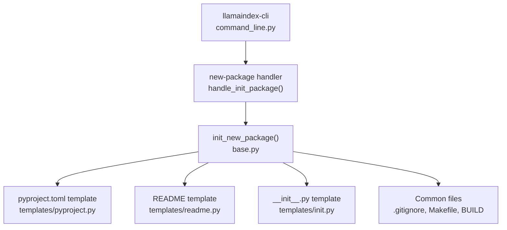
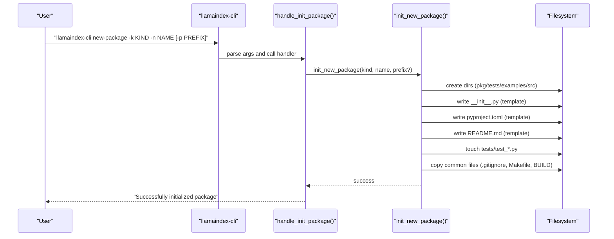
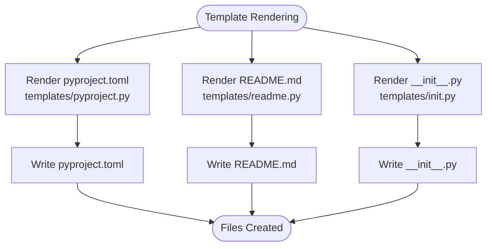
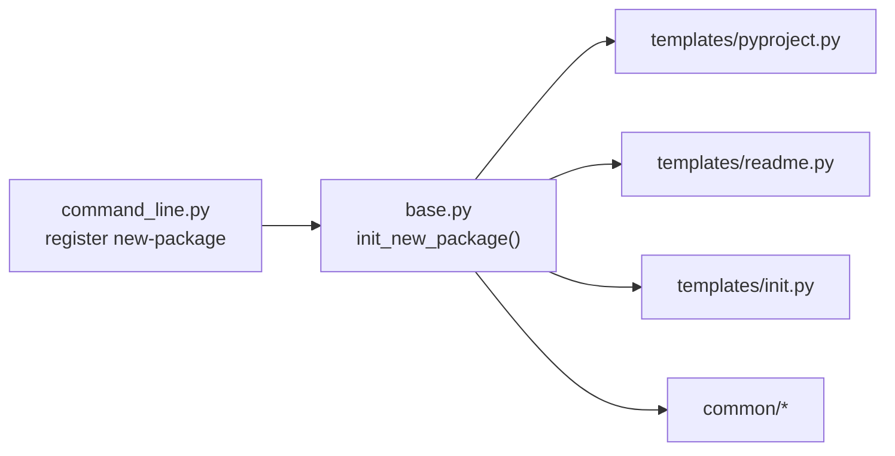

# Package Initialization

<cite>
**Referenced Files in This Document**
- [README.md](file://llama-index-cli/README.md)
- [pyproject.toml](file://llama-index-cli/pyproject.toml)
- [command_line.py](file://llama-index-cli/llama_index/cli/command_line.py)
- [base.py](file://llama-index-cli/llama_index/cli/new_package/base.py)
- [templates/init.py](file://llama-index-cli/llama_index/cli/new_package/templates/init.py)
- [templates/pyproject.py](file://llama-index-cli/llama_index/cli/new_package/templates/pyproject.py)
- [templates/readme.py](file://llama-index-cli/llama_index/cli/new_package/templates/readme.py)
- [common/.gitignore](file://llama-index-cli/llama_index/cli/new_package/common/.gitignore)
- [common/Makefile](file://llama-index-cli/llama_index/cli/new_package/common/Makefile)
- [common/_build](file://llama-index-cli/llama_index/cli/new_package/common/_build)
- [CONTRIBUTING.md](file://CONTRIBUTING.md)
</cite>

## Table of Contents
1. [Introduction](#introduction)
2. [Project Structure](#project-structure)
3. [Core Components](#core-components)
4. [Architecture Overview](#architecture-overview)
5. [Detailed Component Analysis](#detailed-component-analysis)
6. [Dependency Analysis](#dependency-analysis)
7. [Performance Considerations](#performance-considerations)
8. [Troubleshooting Guide](#troubleshooting-guide)
9. [Conclusion](#conclusion)
10. [Appendices](#appendices)

## Introduction
This document explains how to initialize new LlamaIndex packages using the new-package command. It covers the command syntax, parameters, generated project structure, template system, metadata and dependency configuration, testing setup, naming and versioning guidance, and best practices for documentation and community contribution. It also describes how package initialization fits into the broader LlamaIndex ecosystem.

## Project Structure
The new-package functionality lives in the CLI package and generates a standardized project layout for new LlamaIndex integrations and components. The CLI registers the new-package subcommand and delegates to a dedicated initialization routine that creates directories, files, and boilerplate based on templates.

**Diagram sources**
- [command_line.py](file://llama-index-cli/llama_index/cli/command_line.py#L23-L28)
- [base.py](file://llama-index-cli/llama_index/cli/new_package/base.py#L29-L121)
- [templates/pyproject.py](file://llama-index-cli/llama_index/cli/new_package/templates/pyproject.py#L1-L58)
- [templates/readme.py](file://llama-index-cli/llama_index/cli/new_package/templates/readme.py#L1-L3)
- [templates/init.py](file://llama-index-cli/llama_index/cli/new_package/templates/init.py#L1-L12)
- [common/.gitignore](file://llama-index-cli/llama_index/cli/new_package/common/.gitignore#L1-L154)
- [common/Makefile](file://llama-index-cli/llama_index/cli/new_package/common/Makefile#L1-L18)
- [common/_build](file://llama-index-cli/llama_index/cli/new_package/common/_build#L1-L2)

**Section sources**
- [README.md](file://llama-index-cli/README.md#L1-L31)
- [pyproject.toml](file://llama-index-cli/pyproject.toml#L49-L50)
- [command_line.py](file://llama-index-cli/llama_index/cli/command_line.py#L247-L271)
- [base.py](file://llama-index-cli/llama_index/cli/new_package/base.py#L29-L121)

## Core Components
- Command registration and parsing: The CLI defines the new-package subcommand with parameters for kind, name, and optional prefix.
- Initialization routine: Creates directories, writes boilerplate files, and applies templates.
- Template system: Provides reusable content for pyproject.toml, README, and package __init__.py.
- Common assets: Copies shared development and build files (.gitignore, Makefile, BUILD).

Key behaviors:
- Generates a package name and source path based on kind, name, and optional prefix.
- Writes a minimal package __init__.py that exposes placeholders for future exports.
- Produces a pyproject.toml configured for Poetry-based builds and dev tooling.
- Adds a README with a placeholder title and a skeleton test file under a tests directory.

**Section sources**
- [command_line.py](file://llama-index-cli/llama_index/cli/command_line.py#L247-L271)
- [base.py](file://llama-index-cli/llama_index/cli/new_package/base.py#L29-L121)
- [templates/init.py](file://llama-index-cli/llama_index/cli/new_package/templates/init.py#L1-L12)
- [templates/pyproject.py](file://llama-index-cli/llama_index/cli/new_package/templates/pyproject.py#L1-L58)
- [templates/readme.py](file://llama-index-cli/llama_index/cli/new_package/templates/readme.py#L1-L3)
- [common/.gitignore](file://llama-index-cli/llama_index/cli/new_package/common/.gitignore#L1-L154)
- [common/Makefile](file://llama-index-cli/llama_index/cli/new_package/common/Makefile#L1-L18)
- [common/_build](file://llama-index-cli/llama_index/cli/new_package/common/_build#L1-L2)

## Architecture Overview
The new-package workflow is a thin orchestration around a templated file generator.

**Diagram sources**
- [command_line.py](file://llama-index-cli/llama_index/cli/command_line.py#L23-L28)
- [base.py](file://llama-index-cli/llama_index/cli/new_package/base.py#L29-L121)

## Detailed Component Analysis

### Command Syntax and Parameters
- Command: new-package
- Parameters:
  - --kind (-k): Type of package (e.g., llm, embedding, pack). Used in naming and metadata.
  - --name (-n): Human-readable name for the package. Used in naming and metadata.
  - --prefix (-p): Optional namespace prefix for the package path (e.g., vendor or domain).
- Behavior:
  - Creates a top-level directory named with a standardized prefix and normalized kind/name.
  - Generates a source tree under a normalized path derived from kind and name (with optional prefix).
  - Writes boilerplate files and copies common assets.

Practical examples:
- Initialize an LLM integration: llamaindex-cli new-package -k llm -n "My Provider"
- Initialize an embedding integration with a vendor prefix: llamaindex-cli new-package -k embedding -n "Cloud Embedder" -p vendor
- Initialize a reusable pack: llamaindex-cli new-package -k pack -n "Custom Retriever Pack"

Notes:
- Kind and name are normalized to lowercase and spaces/underscores are converted to hyphens for directory names and lowercase underscores for module paths.
- Prefix is optional and affects both the directory name and the source path.

**Section sources**
- [command_line.py](file://llama-index-cli/llama_index/cli/command_line.py#L247-L271)
- [base.py](file://llama-index-cli/llama_index/cli/new_package/base.py#L29-L84)

### Generated Project Structure and Files
After running new-package, the following structure is produced:
- Top-level:
  - pyproject.toml (Poetry configuration)
  - README.md (placeholder title)
  - .gitignore (standardized ignores)
  - Makefile (development tasks)
  - BUILD (build configuration)
- Source:
  - llama_index/<prefix>/<kind>/<name>/__init__.py (placeholder exports)
- Tests:
  - tests/test_<prefix>_<kind>_<name>.py (empty test file)
- Examples:
  - examples/ (empty directory for runnable examples)

Directory normalization:
- Directory names: hyphenated, lowercase, spaces/underscores normalized to hyphens.
- Module paths: underscores used for Python identifiers; prefix optional.

**Section sources**
- [base.py](file://llama-index-cli/llama_index/cli/new_package/base.py#L35-L121)
- [templates/init.py](file://llama-index-cli/llama_index/cli/new_package/templates/init.py#L1-L12)
- [templates/readme.py](file://llama-index-cli/llama_index/cli/new_package/templates/readme.py#L1-L3)
- [common/.gitignore](file://llama-index-cli/llama_index/cli/new_package/common/.gitignore#L1-L154)
- [common/Makefile](file://llama-index-cli/llama_index/cli/new_package/common/Makefile#L1-L18)
- [common/_build](file://llama-index-cli/llama_index/cli/new_package/common/_build#L1-L2)

### Template System
- pyproject.toml template:
  - Sets build backend to poetry-core.
  - Includes dev tooling (black, codespell, mypy, pytest, ruff, etc.).
  - Declares llama-index-core as a dependency.
  - Configures package inclusion for "llama_index/".
- README template:
  - Provides a placeholder title indicating the integration category and name.
- __init__.py template:
  - Imports a base class/module placeholder and exposes it via __all__.
  - Supports both plain and prefixed layouts.

**Diagram sources**
- [templates/pyproject.py](file://llama-index-cli/llama_index/cli/new_package/templates/pyproject.py#L1-L58)
- [templates/readme.py](file://llama-index-cli/llama_index/cli/new_package/templates/readme.py#L1-L3)
- [templates/init.py](file://llama-index-cli/llama_index/cli/new_package/templates/init.py#L1-L12)

**Section sources**
- [templates/pyproject.py](file://llama-index-cli/llama_index/cli/new_package/templates/pyproject.py#L1-L58)
- [templates/readme.py](file://llama-index-cli/llama_index/cli/new_package/templates/readme.py#L1-L3)
- [templates/init.py](file://llama-index-cli/llama_index/cli/new_package/templates/init.py#L1-L12)

### Package Types and Requirements
Supported kinds (package types) include, but are not limited to:
- llm
- embedding
- pack
- retriever
- reader
- vector_store
- callback
- instrumentation
- response_synthesizer
- evaluator
- node_parser
- postprocessor
- selector
- tool
- graph_store
- storage
- memory
- voice_agent
- observability
- program
- protocols
- sparse_embeddings
- utils

These kinds drive:
- Naming conventions for directories and module paths.
- Metadata in pyproject.toml (description and tool.llamahub entries).
- Guidance for implementing the corresponding LlamaIndex interfaces.

Note: The CLI does not enforce a strict whitelist; you can pass arbitrary kinds. The generated structure remains consistent, and you should align your implementation with the relevant LlamaIndex interface(s) for the chosen kind.

**Section sources**
- [base.py](file://llama-index-cli/llama_index/cli/new_package/base.py#L35-L84)
- [templates/pyproject.py](file://llama-index-cli/llama_index/cli/new_package/templates/pyproject.py#L26-L37)

### Practical Examples
- Initializing a new LLM integration:
  - Command: llamaindex-cli new-package -k llm -n "OpenAI-Compatible"
  - Outcome: Creates a directory named with the llm kind and a normalized provider name; sets up a source tree under llama_index/llm/<provider>.
- Initializing a vendor-prefixed embedding integration:
  - Command: llamaindex-cli new-package -k embedding -n "Azure-OpenAI" -p azure
  - Outcome: Creates a directory with the vendor prefix and sets up a source tree under llama_index/azure/embedding/<name>.
- Initializing a reusable pack:
  - Command: llamaindex-cli new-package -k pack -n "Multi-Retriever-Fusion"
  - Outcome: Creates a directory suitable for a reusable pack with a tests file and examples directory.

After generation, implement the integration according to the relevant LlamaIndex interface and update the __init__.py to export your public classes.

**Section sources**
- [command_line.py](file://llama-index-cli/llama_index/cli/command_line.py#L247-L271)
- [base.py](file://llama-index-cli/llama_index/cli/new_package/base.py#L35-L84)

### Package Metadata and Dependency Management
- pyproject.toml metadata:
  - name: Derived from the normalized kind/name and optional prefix.
  - description: Indicates the integration type and name.
  - packages: Includes "llama_index/" for distribution.
  - dependencies:
    - python: >=3.8.1,<4.0
    - llama-index-core: ^0.10.0 (align with your target LlamaIndex version)
  - dev dependencies: Formatting, linting, and testing tools configured for consistent quality.
- Tool configuration:
  - mypy, codespell, and other tools are configured for pre-commit and CI-friendly checks.
- Poetry backend:
  - Uses poetry-core for building and publishing.

Recommendations:
- Align llama-index-core version with your target LlamaIndex release.
- Pin dev dependencies to versions compatible with your environment.
- Keep tool configurations aligned with the repository’s standards.

**Section sources**
- [templates/pyproject.py](file://llama-index-cli/llama_index/cli/new_package/templates/pyproject.py#L26-L57)

### Testing Setup
- Skeleton test file:
  - A test file is created under tests/ with a normalized name based on kind, name, and optional prefix.
  - The file is empty and serves as a starting point for unit tests.
- Development tasks:
  - Makefile provides targets for formatting, linting, and running tests.
  - Use pytest to execute tests locally.

Best practices:
- Add unit tests for core functionality.
- Mock external services during tests.
- Maintain test coverage targets consistent with the repository’s expectations.

**Section sources**
- [base.py](file://llama-index-cli/llama_index/cli/new_package/base.py#L105-L113)
- [common/Makefile](file://llama-index-cli/llama_index/cli/new_package/common/Makefile#L13-L14)

### Project Structure Conventions
- Directory naming:
  - Lowercase, hyphen-separated; spaces and underscores converted to hyphens.
- Module naming:
  - Underscore-separated identifiers for Python modules; prefix optional.
- Layout:
  - Source under llama_index/<prefix>/<kind>/<name>/__init__.py
  - Tests under tests/
  - Examples under examples/
  - Shared assets copied from common/

**Section sources**
- [base.py](file://llama-index-cli/llama_index/cli/new_package/base.py#L35-L84)
- [common/.gitignore](file://llama-index-cli/llama_index/cli/new_package/common/.gitignore#L1-L154)

### Naming Conventions, Versioning, and Distribution
- Naming:
  - Use hyphenated, lowercase names for directories.
  - Use underscore-separated identifiers for module paths.
  - Include a vendor prefix when applicable.
- Versioning:
  - Initial version is set to 0.1.0 in the template; increment according to semantic versioning.
- Distribution:
  - Configure tool.poetry.group.dev.dependencies and tool.mypy settings per project needs.
  - Use the provided Makefile targets to prepare artifacts and validate builds.

**Section sources**
- [templates/pyproject.py](file://llama-index-cli/llama_index/cli/new_package/templates/pyproject.py#L27-L28)
- [common/Makefile](file://llama-index-cli/llama_index/cli/new_package/common/Makefile#L1-L18)

### Best Practices for Documentation, Contribution, and Community
- Documentation:
  - Update README.md with a meaningful description, installation steps, usage examples, and contribution notes.
  - Include a changelog and version history.
- Contribution:
  - Follow the repository’s contribution guidelines, including environment setup with uv, running tests, and adhering to code quality standards.
  - Engage with the community via the documented channels.
- Community:
  - Encourage users to report issues and propose features.
  - Provide clear examples and links to related integrations.

**Section sources**
- [CONTRIBUTING.md](file://CONTRIBUTING.md#L1-L231)

## Dependency Analysis
The CLI registers the new-package command and delegates to the initialization routine. The initialization routine depends on:
- Template strings for pyproject.toml, README, and __init__.py.
- Common assets for development and build.
- Standard filesystem operations to create directories and write files.

**Diagram sources**
- [command_line.py](file://llama-index-cli/llama_index/cli/command_line.py#L247-L271)
- [base.py](file://llama-index-cli/llama_index/cli/new_package/base.py#L29-L121)
- [templates/pyproject.py](file://llama-index-cli/llama_index/cli/new_package/templates/pyproject.py#L1-L58)
- [templates/readme.py](file://llama-index-cli/llama_index/cli/new_package/templates/readme.py#L1-L3)
- [templates/init.py](file://llama-index-cli/llama_index/cli/new_package/templates/init.py#L1-L12)
- [common/.gitignore](file://llama-index-cli/llama_index/cli/new_package/common/.gitignore#L1-L154)
- [common/Makefile](file://llama-index-cli/llama_index/cli/new_package/common/Makefile#L1-L18)
- [common/_build](file://llama-index-cli/llama_index/cli/new_package/common/_build#L1-L2)

**Section sources**
- [command_line.py](file://llama-index-cli/llama_index/cli/command_line.py#L247-L271)
- [base.py](file://llama-index-cli/llama_index/cli/new_package/base.py#L29-L121)

## Performance Considerations
- Generation speed: The new-package operation performs a small number of filesystem writes and template renders; it is very fast.
- Template rendering cost: Minimal overhead; caching is unnecessary.
- Recommendations:
  - Keep template strings concise.
  - Avoid heavy computation in the initialization routine.

[No sources needed since this section provides general guidance]

## Troubleshooting Guide
- Command not found:
  - Ensure the CLI is installed and the executable is available in PATH.
  - Verify the new-package subcommand appears in the help output.
- Permission errors when writing files:
  - Check write permissions in the target directory.
- Unexpected directory or module names:
  - Confirm that spaces and underscores in kind/name are normalized to hyphens for directories and underscores for modules.
- Missing dependencies after generation:
  - Install dev dependencies defined in the generated pyproject.toml.
  - Use the Makefile targets to run formatting, linting, and tests.

**Section sources**
- [README.md](file://llama-index-cli/README.md#L1-L31)
- [base.py](file://llama-index-cli/llama_index/cli/new_package/base.py#L29-L121)

## Conclusion
The new-package command streamlines creation of new LlamaIndex integrations and components by generating a consistent project structure, boilerplate files, and development assets. By following the naming conventions, updating metadata and dependencies, and adhering to testing and documentation best practices, you can quickly produce high-quality packages that integrate seamlessly with the LlamaIndex ecosystem.

[No sources needed since this section summarizes without analyzing specific files]

## Appendices

### Appendix A: Command Reference
- Command: llamaindex-cli new-package
- Options:
  - -k, --kind: Package kind (e.g., llm, embedding, pack)
  - -n, --name: Package name
  - -p, --prefix: Optional vendor or domain prefix

**Section sources**
- [command_line.py](file://llama-index-cli/llama_index/cli/command_line.py#L247-L271)