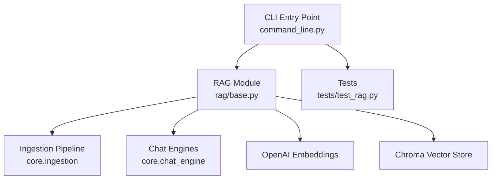
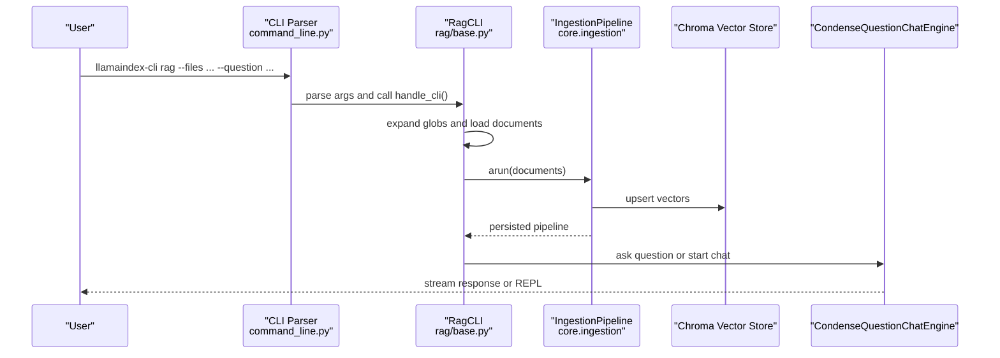
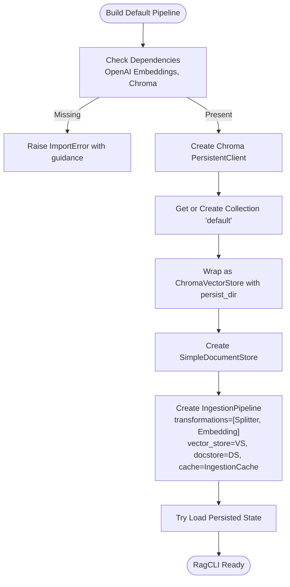
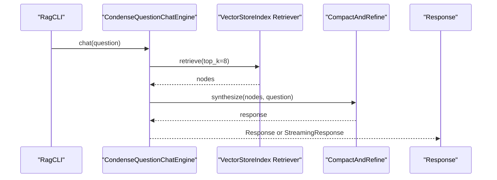
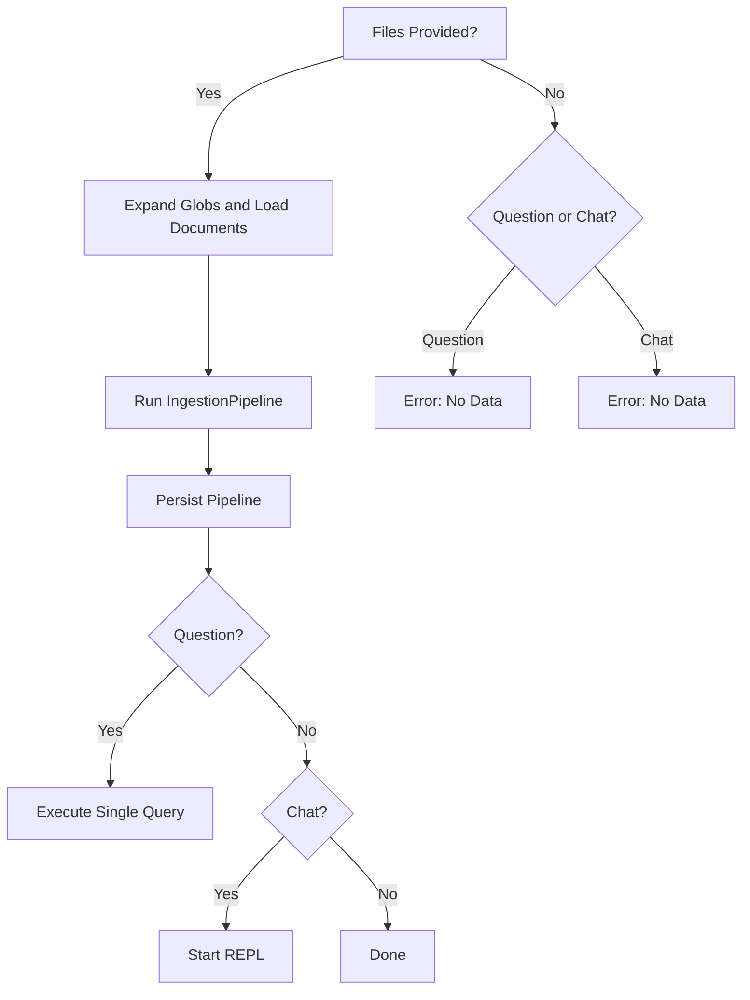
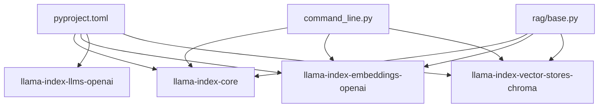

# RAG CLI

<cite>
**Referenced Files in This Document**
- [README.md](file://llama-index-cli/README.md)
- [pyproject.toml](file://llama-index-cli/pyproject.toml)
- [command_line.py](file://llama-index-cli/llama_index/cli/command_line.py)
- [base.py](file://llama-index-cli/llama_index/cli/rag/base.py)
- [test_rag.py](file://llama-index-cli/tests/test_rag.py)
- [ingestion/__init__.py](file://llama-index-core/llama_index/core/ingestion/__init__.py)
- [chat_engine/__init__.py](file://llama-index-core/llama_index/core/chat_engine/__init__.py)
</cite>

## Table of Contents
1. [Introduction](#introduction)
2. [Project Structure](#project-structure)
3. [Core Components](#core-components)
4. [Architecture Overview](#architecture-overview)
5. [Detailed Component Analysis](#detailed-component-analysis)
6. [Dependency Analysis](#dependency-analysis)
7. [Performance Considerations](#performance-considerations)
8. [Troubleshooting Guide](#troubleshooting-guide)
9. [Conclusion](#conclusion)
10. [Appendices](#appendices)

## Introduction
This document provides comprehensive guidance for the RAG CLI tool that enables rapid prototyping and interactive querying of documents. It explains the rag command syntax, argument options, and workflow patterns for asking questions to single files or entire directories. It also covers the default RAG pipeline setup using OpenAI embeddings and Chroma vector store with persistent storage, along with practical examples for ingestion, querying, and result interpretation. Additional topics include interactive mode, batch processing, provider integrations, common use cases, troubleshooting, and best practices.

## Project Structure
The RAG CLI is implemented as a Python package with a focused CLI entry point and a dedicated rag module. The CLI integrates with the core ingestion pipeline and chat/query engines to deliver a streamlined RAG experience.

**Diagram sources**
- [command_line.py](file://llama-index-cli/llama_index/cli/command_line.py#L149-L276)
- [base.py](file://llama-index-cli/llama_index/cli/rag/base.py#L10-L27)
- [ingestion/__init__.py](file://llama-index-core/llama_index/core/ingestion/__init__.py#L1-L16)
- [chat_engine/__init__.py](file://llama-index-core/llama_index/core/chat_engine/__init__.py#L1-L22)

**Section sources**
- [README.md](file://llama-index-cli/README.md#L1-L31)
- [pyproject.toml](file://llama-index-cli/pyproject.toml#L43-L47)
- [command_line.py](file://llama-index-cli/llama_index/cli/command_line.py#L149-L276)
- [base.py](file://llama-index-cli/llama_index/cli/rag/base.py#L10-L27)

## Core Components
- CLI entry point defines subcommands and argument parsing, including the rag command.
- RAG module encapsulates ingestion, querying, and chat capabilities with defaults for OpenAI and Chroma.
- Ingestion pipeline performs chunking, embedding, and vector store persistence.
- Chat/query engines provide question answering and conversational modes.

Key responsibilities:
- Command routing and argument handling
- Default pipeline construction with OpenAI embeddings and Chroma
- Document ingestion and persistence
- Question answering and streaming chat
- Optional scaffolding of a LlamaIndex application from ingested data

**Section sources**
- [command_line.py](file://llama-index-cli/llama_index/cli/command_line.py#L149-L276)
- [base.py](file://llama-index-cli/llama_index/cli/rag/base.py#L53-L128)
- [ingestion/__init__.py](file://llama-index-core/llama_index/core/ingestion/__init__.py#L1-L16)
- [chat_engine/__init__.py](file://llama-index-core/llama_index/core/chat_engine/__init__.py#L1-L22)

## Architecture Overview
The RAG CLI composes a default pipeline using OpenAI embeddings and Chroma vector store. It supports:
- Single-file and directory ingestion with glob expansion
- Persistent caching and vector store persistence
- Query execution via a retriever-backed query engine
- Interactive chat REPL with streaming responses

**Diagram sources**
- [command_line.py](file://llama-index-cli/llama_index/cli/command_line.py#L149-L276)
- [base.py](file://llama-index-cli/llama_index/cli/rag/base.py#L129-L278)
- [ingestion/__init__.py](file://llama-index-core/llama_index/core/ingestion/__init__.py#L1-L16)

## Detailed Component Analysis

### Command Syntax and Options
The rag command supports the following options:
- --files/-f: One or more files or directories (supports glob patterns). Directories are recursively scanned.
- --question/-q: A single question to ask after ingestion.
- --chat/-c: Launch an interactive chat REPL.
- --verbose/-v: Enable verbose logging during ingestion and queries.
- --clear: Clear persisted data under the default cache directory.
- --create-llama: Scaffold a LlamaIndex application using the last ingested dataset.

Behavior highlights:
- Files are expanded using globbing; directories are loaded with filename_as_id enabled.
- After ingestion, the pipeline persists to a cache-backed directory.
- The history of ingested files is recorded for downstream tooling.

**Section sources**
- [base.py](file://llama-index-cli/llama_index/cli/rag/base.py#L280-L332)
- [command_line.py](file://llama-index-cli/llama_index/cli/command_line.py#L149-L159)

### Default Pipeline: OpenAI Embeddings and Chroma
The default pipeline uses:
- SentenceSplitter for chunking
- OpenAIEmbedding for embeddings
- ChromaVectorStore with persistent client
- SimpleDocumentStore for document storage
- IngestionCache for caching

Persistence:
- Persist directory is derived from the cache directory under a dedicated rag_cli subfolder.
- On startup, the pipeline attempts to load previously persisted state.

**Diagram sources**
- [command_line.py](file://llama-index-cli/llama_index/cli/command_line.py#L70-L147)

**Section sources**
- [command_line.py](file://llama-index-cli/llama_index/cli/command_line.py#L70-L147)

### Query Processing and Results
- Query execution uses a retriever-backed query engine configured with a compact-and-refine synthesizer.
- Responses can be streamed or printed depending on type.
- The chat engine supports a REPL with streaming chat.

**Diagram sources**
- [base.py](file://llama-index-cli/llama_index/cli/rag/base.py#L113-L127)
- [chat_engine/__init__.py](file://llama-index-core/llama_index/core/chat_engine/__init__.py#L1-L22)

**Section sources**
- [base.py](file://llama-index-cli/llama_index/cli/rag/base.py#L113-L127)
- [base.py](file://llama-index-cli/llama_index/cli/rag/base.py#L259-L278)

### Interactive Mode and Batch Processing
- Interactive mode starts a REPL that streams responses.
- Batch processing occurs when --files are provided followed by optional --question or --chat.
- Glob patterns are expanded prior to loading documents.

**Diagram sources**
- [base.py](file://llama-index-cli/llama_index/cli/rag/base.py#L129-L278)

**Section sources**
- [base.py](file://llama-index-cli/llama_index/cli/rag/base.py#L129-L278)

### Integration with Different LLM Providers
- The default chat engine uses an OpenAI LLM configured for streaming.
- To integrate other providers, supply a compatible LLM instance to the RagCLI constructor or adjust the pipeline accordingly.
- Embedding and vector store choices can be swapped by constructing a custom pipeline.

Note: Provider-specific packages are not bundled by default; install them separately.

**Section sources**
- [base.py](file://llama-index-cli/llama_index/cli/rag/base.py#L30-L40)
- [pyproject.toml](file://llama-index-cli/pyproject.toml#L43-L47)

### Practical Examples
- Ingest a directory and ask a single question:
  - llamaindex-cli rag -f ./docs --question "What is the purpose of this project?"
- Ingest a file and start an interactive chat:
  - llamaindex-cli rag -f ./paper.pdf --chat
- Ingest with verbose output:
  - llamaindex-cli rag -f ./slides --verbose
- Clear persisted data and re-ingest:
  - llamaindex-cli rag --clear
  - llamaindex-cli rag -f ./data
- Create a LlamaIndex application scaffold from ingested data:
  - llamaindex-cli rag -f ./corpus --create-llama

[No sources needed since this section provides usage examples without quoting specific code]

## Dependency Analysis
The CLI depends on core modules for ingestion and chat engines, and on optional integrations for embeddings and vector stores. The default pipeline requires OpenAI embeddings and Chroma.

**Diagram sources**
- [pyproject.toml](file://llama-index-cli/pyproject.toml#L43-L47)
- [command_line.py](file://llama-index-cli/llama_index/cli/command_line.py#L1-L20)
- [base.py](file://llama-index-cli/llama_index/cli/rag/base.py#L10-L27)

**Section sources**
- [pyproject.toml](file://llama-index-cli/pyproject.toml#L43-L47)
- [command_line.py](file://llama-index-cli/llama_index/cli/command_line.py#L1-L20)
- [base.py](file://llama-index-cli/llama_index/cli/rag/base.py#L10-L27)

## Performance Considerations
- Chunking and embedding cost: Adjust chunk size and overlap to balance recall and latency.
- Retrieval top-k: Lower similarity_top_k reduces retrieval cost but may reduce accuracy.
- Streaming responses: Keep streaming enabled for large outputs to improve perceived performance.
- Persistence: Reuse persisted pipelines to avoid re-embedding on subsequent runs.
- Vector store backend: Chroma is optimized for development; consider production-grade alternatives for scale.

[No sources needed since this section provides general guidance]

## Troubleshooting Guide
Common issues and resolutions:
- Missing dependencies for default pipeline:
  - Symptom: ImportError indicating missing chromadb or OpenAI packages.
  - Resolution: Install required packages as indicated by the error message.
- Authentication problems:
  - Symptom: Errors when initializing OpenAI LLM or embeddings.
  - Resolution: Set the appropriate environment variables for the provider.
- Performance optimization:
  - Symptom: Slow ingestion or queries.
  - Resolution: Reduce chunk size, lower top-k, enable caching, and reuse persisted pipelines.
- Clearing cached data:
  - Use --clear to remove persisted embeddings and start fresh.
- Creating a LlamaIndex application scaffold:
  - Ensure a single ingested path exists; glob patterns are not supported for this feature.

Security and correctness notes:
- The create-llama feature invokes external tooling with explicit arguments and checks; it avoids shell=True to prevent injection risks.

**Section sources**
- [command_line.py](file://llama-index-cli/llama_index/cli/command_line.py#L78-L83)
- [base.py](file://llama-index-cli/llama_index/cli/rag/base.py#L142-L157)
- [test_rag.py](file://llama-index-cli/tests/test_rag.py#L25-L112)
- [test_rag.py](file://llama-index-cli/tests/test_rag.py#L175-L233)

## Conclusion
The RAG CLI offers a streamlined path to prototype retrieval-augmented applications with minimal setup. By leveraging the default OpenAI embeddings and Chroma vector store, users can quickly ingest documents, ask targeted questions, and engage in interactive chats. The modular design allows swapping providers and backends, while persistence and caching support iterative experimentation and performance tuning.

[No sources needed since this section summarizes without analyzing specific files]

## Appendices

### Appendix A: Command Reference
- llamaindex-cli rag
  - -f, --files: One or more files or directories (supports globs)
  - -q, --question: A single question to ask
  - -c, --chat: Start an interactive chat REPL
  - -v, --verbose: Verbose output
  - --clear: Clear persisted data
  - --create-llama: Scaffold a LlamaIndex application from ingested data

**Section sources**
- [base.py](file://llama-index-cli/llama_index/cli/rag/base.py#L280-L332)
- [command_line.py](file://llama-index-cli/llama_index/cli/command_line.py#L149-L159)

### Appendix B: Default Pipeline Details
- Transformations: SentenceSplitter, OpenAIEmbedding
- Vector store: ChromaVectorStore backed by a persistent collection
- Document store: SimpleDocumentStore
- Cache: IngestionCache
- Query engine: RetrieverQueryEngine with CompactAndRefine synthesizer
- Chat engine: CondenseQuestionChatEngine with streaming

**Section sources**
- [command_line.py](file://llama-index-cli/llama_index/cli/command_line.py#L93-L98)
- [base.py](file://llama-index-cli/llama_index/cli/rag/base.py#L113-L127)