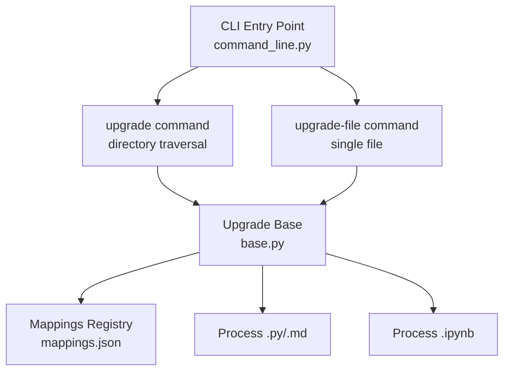
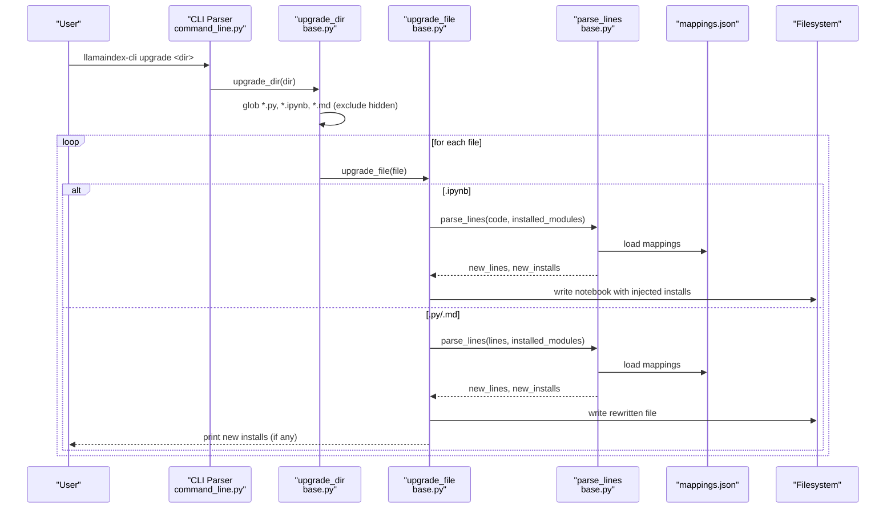
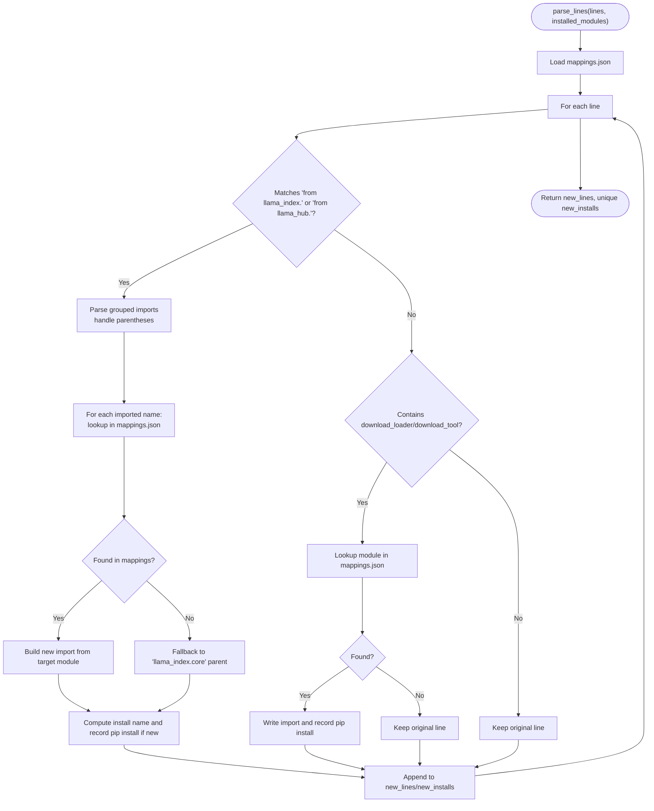
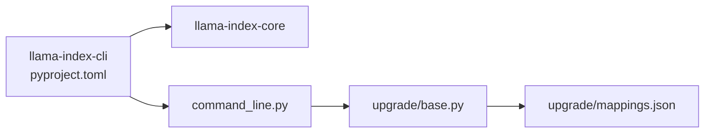

# Upgrade Utilities

<cite>
**Referenced Files in This Document**
- [command_line.py](file://llama-index-cli/llama_index/cli/command_line.py)
- [base.py](file://llama-index-cli/llama_index/cli/upgrade/base.py)
- [mappings.json](file://llama-index-cli/llama_index/cli/upgrade/mappings.json)
- [README.md](file://llama-index-cli/README.md)
- [pyproject.toml](file://llama-index-cli/pyproject.toml)
- [upgrade.py](file://llama-index-core/llama_index/core/command_line/upgrade.py)
</cite>

## Table of Contents
1. [Introduction](#introduction)
2. [Project Structure](#project-structure)
3. [Core Components](#core-components)
4. [Architecture Overview](#architecture-overview)
5. [Detailed Component Analysis](#detailed-component-analysis)
6. [Dependency Analysis](#dependency-analysis)
7. [Performance Considerations](#performance-considerations)
8. [Troubleshooting Guide](#troubleshooting-guide)
9. [Conclusion](#conclusion)
10. [Appendices](#appendices)

## Introduction
This document explains the upgrade utilities that help migrate codebases to newer LlamaIndex versions. It covers the upgrade and upgrade-file commands, directory traversal, file processing, and the mapping system used for code transformations. It also provides practical examples for upgrading notebooks and Python files, handling breaking changes, maintaining backward compatibility, and validating functionality after migration.

## Project Structure
The upgrade utilities live in the CLI package and leverage a shared mapping registry to transform import statements and related constructs. The CLI registers two commands:
- upgrade: traverse a directory recursively and upgrade all .py, .ipynb, and .md files
- upgrade-file: upgrade a single file based on its extension

**Diagram sources**
- [command_line.py](file://llama-index-cli/llama_index/cli/command_line.py#L225-L246)
- [base.py](file://llama-index-cli/llama_index/cli/upgrade/base.py#L279-L287)
- [mappings.json](file://llama-index-cli/llama_index/cli/upgrade/mappings.json#L1-L1099)

**Section sources**
- [command_line.py](file://llama-index-cli/llama_index/cli/command_line.py#L225-L246)
- [README.md](file://llama-index-cli/README.md#L21-L30)

## Core Components
- CLI command registration for upgrade and upgrade-file
- Directory traversal for .py, .ipynb, and .md files
- Import and loader/tool transformation via mappings
- Notebook-specific processing and pip-install injection
- Python/Markdown file rewriting with transformed imports

Key responsibilities:
- upgrade: walk the directory tree, filter hidden paths, and apply per-file upgrade logic
- upgrade-file: dispatch to notebook or Python/Markdown processor based on extension
- parse_lines: scan lines for import patterns and llama_hub downloads, rewrite imports, and collect new pip installs
- upgrade_nb_file: inject pip install cells and remove legacy llama_hub install cells
- upgrade_py_md_file: rewrite imports and optionally print new pip install commands

**Section sources**
- [command_line.py](file://llama-index-cli/llama_index/cli/command_line.py#L225-L246)
- [base.py](file://llama-index-cli/llama_index/cli/upgrade/base.py#L279-L287)
- [base.py](file://llama-index-cli/llama_index/cli/upgrade/base.py#L266-L273)
- [base.py](file://llama-index-cli/llama_index/cli/upgrade/base.py#L204-L248)
- [base.py](file://llama-index-cli/llama_index/cli/upgrade/base.py#L250-L264)
- [base.py](file://llama-index-cli/llama_index/cli/upgrade/base.py#L116-L178)

## Architecture Overview
The upgrade pipeline consists of:
- CLI argument parsing and command dispatch
- File discovery and filtering
- Per-file transformation using mappings
- Notebook-specific install-cell injection and cleanup
- Output writing and optional pip install reporting

**Diagram sources**
- [command_line.py](file://llama-index-cli/llama_index/cli/command_line.py#L225-L246)
- [base.py](file://llama-index-cli/llama_index/cli/upgrade/base.py#L279-L287)
- [base.py](file://llama-index-cli/llama_index/cli/upgrade/base.py#L266-L273)
- [base.py](file://llama-index-cli/llama_index/cli/upgrade/base.py#L116-L178)
- [mappings.json](file://llama-index-cli/llama_index/cli/upgrade/mappings.json#L1-L1099)

## Detailed Component Analysis

### CLI Commands and Dispatch
- upgrade: registers a subparser that accepts a directory path and invokes the directory upgrade routine
- upgrade-file: registers a subparser that accepts a single file path and invokes the file upgrade routine

Behavior:
- Both commands rely on the upgrade routines in base.py
- The CLI ensures only .py, .ipynb, and .md files are processed

**Section sources**
- [command_line.py](file://llama-index-cli/llama_index/cli/command_line.py#L225-L246)

### Directory Traversal and Filtering
- Recursively discovers .py, .ipynb, and .md files under the given directory
- Skips hidden paths (names starting with a dot)
- Invokes upgrade_file for each discovered file

**Section sources**
- [base.py](file://llama-index-cli/llama_index/cli/upgrade/base.py#L279-L287)
- [base.py](file://llama-index-cli/llama_index/cli/upgrade/base.py#L275-L277)

### File Processing Logic
- upgrade_file dispatches based on extension:
  - .ipynb → upgrade_nb_file
  - .py/.md → upgrade_py_md_file
- parse_lines performs:
  - Detecting import blocks starting with “from llama_index.” or “from llama_hub.”
  - Parsing grouped imports (including parenthesized lists)
  - Rewriting imports according to mappings.json
  - Collecting new pip install entries for newly mapped modules
  - Handling download_loader/download_tool invocations and injecting imports accordingly

**Diagram sources**
- [base.py](file://llama-index-cli/llama_index/cli/upgrade/base.py#L116-L178)
- [base.py](file://llama-index-cli/llama_index/cli/upgrade/base.py#L10-L87)
- [base.py](file://llama-index-cli/llama_index/cli/upgrade/base.py#L90-L114)
- [mappings.json](file://llama-index-cli/llama_index/cli/upgrade/mappings.json#L1-L1099)

**Section sources**
- [base.py](file://llama-index-cli/llama_index/cli/upgrade/base.py#L116-L178)
- [base.py](file://llama-index-cli/llama_index/cli/upgrade/base.py#L10-L87)
- [base.py](file://llama-index-cli/llama_index/cli/upgrade/base.py#L90-L114)

### Notebook Processing
- Reads the notebook JSON, iterates code cells
- Applies parse_lines to each code cell’s source
- Injects a pip install cell at the first code cell if new installs were detected
- Removes cells that match legacy llama_hub install patterns

Notes:
- The notebook writer preserves indentation and ASCII encoding
- A verbose mode is conditionally enabled for specific test notebooks

**Section sources**
- [base.py](file://llama-index-cli/llama_index/cli/upgrade/base.py#L204-L248)
- [base.py](file://llama-index-cli/llama_index/cli/upgrade/base.py#L181-L202)

### Python/Markdown Processing
- Reads file lines, applies parse_lines, writes back transformed lines
- Prints collected pip install commands if any were generated

**Section sources**
- [base.py](file://llama-index-cli/llama_index/cli/upgrade/base.py#L250-L264)

### Mapping System
- mappings.json is a registry mapping old symbol names to their new fully qualified module paths
- Supports:
  - Core classes/functions moved under llama_index.core
  - Feature areas moved to dedicated subpackages (e.g., agent, callbacks, chat_engine, indices, retrievers)
  - Reader/tool names moved to llama_hub and mapped to integration packages
  - Vector stores, retrievers, tools, and other components mapped to their respective integration packages

Examples of mapping categories:
- Core reorganization: StorageContext, ComposableGraph, Prompt, Document, Settings, etc.
- Feature modules: AgentRunner → llama_index.core.agent, CallbackManager → llama_index.core.callbacks, etc.
- Indices: VectorStoreIndex → llama_index.core.indices, etc.
- Readers/Tools: download_loader/download_tool targets → integration packages
- Vector stores: QdrantVectorStore → llama_index.vector_stores.qdrant, etc.

**Section sources**
- [mappings.json](file://llama-index-cli/llama_index/cli/upgrade/mappings.json#L1-L1099)

### Practical Examples

#### Upgrading a Directory of Notebooks and Python Files
- Command: llamaindex-cli upgrade <directory>
- Behavior:
  - Recursively finds .py, .ipynb, .md files
  - Rewrites imports and injects pip install cells for notebooks
  - Writes back modified files

#### Upgrading a Single Notebook
- Command: llamaindex-cli upgrade-file <notebook.ipynb>
- Behavior:
  - Parses code cells, rewrites imports
  - Injects pip install cell(s) at the top
  - Removes legacy llama_hub install cells
  - Writes the notebook

#### Upgrading a Single Python/Markdown File
- Command: llamaindex-cli upgrade-file <file.py or file.md>
- Behavior:
  - Rewrites imports according to mappings
  - Optionally prints new pip install commands

**Section sources**
- [command_line.py](file://llama-index-cli/llama_index/cli/command_line.py#L225-L246)
- [base.py](file://llama-index-cli/llama_index/cli/upgrade/base.py#L266-L273)
- [base.py](file://llama-index-cli/llama_index/cli/upgrade/base.py#L204-L248)
- [base.py](file://llama-index-cli/llama_index/cli/upgrade/base.py#L250-L264)

### Handling Breaking Changes and Backward Compatibility
- Module reorganization:
  - Imports from “from llama_index.” are rewritten to their new qualified locations
  - If a symbol is not found in mappings, it falls back to “llama_index.core” parent
- Reader/Tool downloads:
  - download_loader(download_tool) invocations are mapped to new integration packages and imports are injected
- Legacy patterns:
  - Notebook cells installing llama-hub or importing download_loader/download_tool are removed after rewriting

**Section sources**
- [base.py](file://llama-index-cli/llama_index/cli/upgrade/base.py#L42-L64)
- [base.py](file://llama-index-cli/llama_index/cli/upgrade/base.py#L90-L114)
- [base.py](file://llama-index-cli/llama_index/cli/upgrade/base.py#L181-L202)

### Testing Upgraded Code and Validating Functionality
- After running upgrade:
  - Review injected pip install cells in notebooks
  - Run the notebook to ensure imports resolve and runtime works
  - For Python/Markdown files, verify imports and run unit tests or integration tests
- If new pip installs were printed, install the required packages before running

**Section sources**
- [base.py](file://llama-index-cli/llama_index/cli/upgrade/base.py#L260-L264)

## Dependency Analysis
- CLI depends on base.py for upgrade logic
- base.py depends on mappings.json for transformations
- CLI is packaged separately from core and depends on llama-index-core

**Diagram sources**
- [pyproject.toml](file://llama-index-cli/pyproject.toml#L43-L47)
- [command_line.py](file://llama-index-cli/llama_index/cli/command_line.py#L5-L6)
- [base.py](file://llama-index-cli/llama_index/cli/upgrade/base.py#L7)
- [mappings.json](file://llama-index-cli/llama_index/cli/upgrade/mappings.json#L1-L1099)

**Section sources**
- [pyproject.toml](file://llama-index-cli/pyproject.toml#L43-L47)
- [command_line.py](file://llama-index-cli/llama_index/cli/command_line.py#L5-L6)

## Performance Considerations
- Directory traversal is O(N) over discovered files
- parse_lines scans each line once; group import parsing avoids redundant processing via a skip counter
- Notebook processing reads and writes JSON; overhead is proportional to cell count and source length
- Mappings lookup is O(1) average via dictionary

[No sources needed since this section provides general guidance]

## Troubleshooting Guide
Common issues and resolutions:
- Unsupported file type:
  - The upgrade routines raise an exception for unsupported extensions; ensure only .py, .ipynb, .md are targeted
- Missing new pip installs:
  - If new installs were generated, they are printed for Python/Markdown files; install them manually before running
- Legacy llama_hub cells remain in notebooks:
  - upgrade_nb_file removes cells that match partial statements for llama-hub installs; verify notebook after upgrade
- Hidden directories ignored:
  - upgrade_dir skips hidden paths; ensure target files are not nested under hidden directories

**Section sources**
- [base.py](file://llama-index-cli/llama_index/cli/upgrade/base.py#L271-L273)
- [base.py](file://llama-index-cli/llama_index/cli/upgrade/base.py#L260-L264)
- [base.py](file://llama-index-cli/llama_index/cli/upgrade/base.py#L181-L202)
- [base.py](file://llama-index-cli/llama_index/cli/upgrade/base.py#L275-L277)

## Conclusion
The upgrade utilities provide a robust, automated way to migrate codebases to newer LlamaIndex versions by transforming import statements, mapping deprecated APIs to new locations, and injecting necessary package installations for notebooks. By leveraging the mapping registry and applying consistent processing across notebooks and Python/Markdown files, teams can streamline migrations while preserving functionality and reducing manual effort.

## Appendices

### Appendix A: Mapping Categories Overview
- Core reorganization: StorageContext, ComposableGraph, Prompt, Document, Settings, etc.
- Feature modules: agent, callbacks, chat_engine, data_structs, embeddings, evaluation, extractors, graph_stores, indices, ingestion, llama_dataset, llama_pack, llms, memory, multi_modal_llms, node_parser, objects, output_parsers, playground, postprocessor, program, prompts, query_engine, query_pipeline, question_gen, readers, response_synthesizers, retrievers, selectors, tools, vector_stores
- Readers/Tools: download_loader/download_tool targets mapped to integration packages
- Vector stores, retrievers, tools, and other components mapped to integration packages

**Section sources**
- [mappings.json](file://llama-index-cli/llama_index/cli/upgrade/mappings.json#L1-L1099)

### Appendix B: CLI Usage Summary
- llamaindex-cli upgrade <directory>: upgrade all .py, .ipynb, .md files under the directory
- llamaindex-cli upgrade-file <path>: upgrade a single file based on extension

**Section sources**
- [README.md](file://llama-index-cli/README.md#L21-L30)