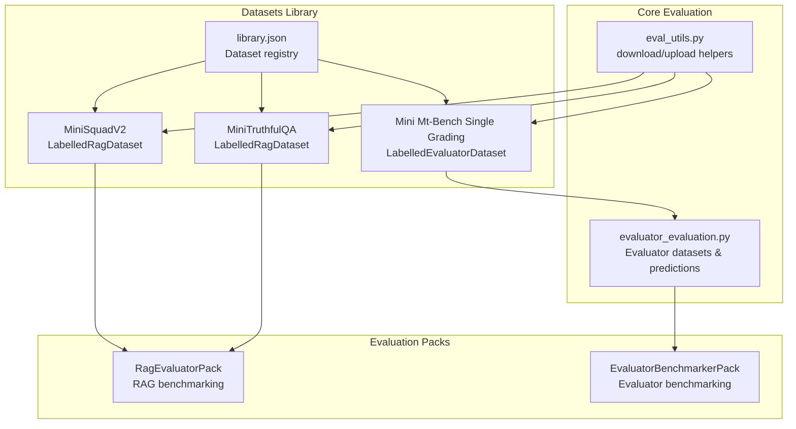
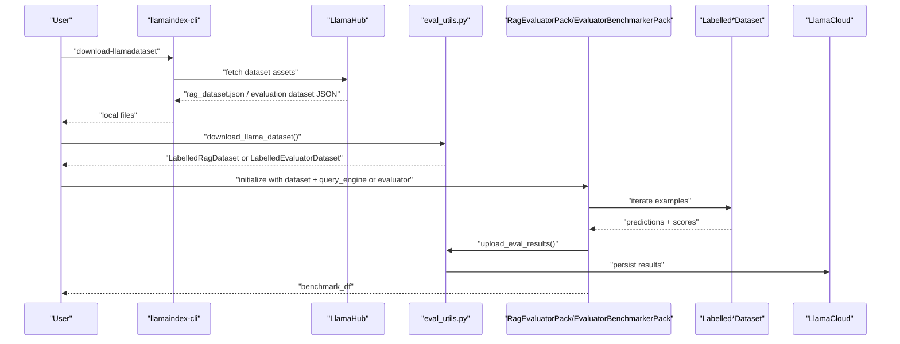
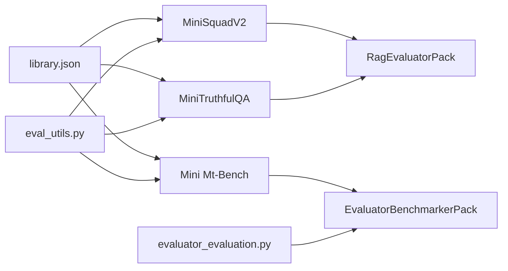

# Benchmark Datasets

<cite>
**Referenced Files in This Document**
- [library.json](file://llama-datasets/library.json)
- [evaluator_evaluation.py](file://llama-index-core/llama_index/core/llama_dataset/evaluator_evaluation.py)
- [eval_utils.py](file://llama-index-core/llama_index/core/evaluation/eval_utils.py)
- [README.md (MiniSquadV2)](file://llama-datasets/mini_squadv2/README.md)
- [card.json (MiniSquadV2)](file://llama-datasets/mini_squadv2/card.json)
- [README.md (MiniTruthfulQA)](file://llama-datasets/mini_truthfulqa/README.md)
- [card.json (MiniTruthfulQA)](file://llama-datasets/mini_truthfulqa/card.json)
- [README.md (MiniMtBenchSingleGrading)](file://llama-datasets/mini_mt_bench_singlegrading/README.md)
- [card.json (MiniMtBenchSingleGrading)](file://llama-datasets/mini_mt_bench_singlegrading/card.json)
- [README.md (RagEvaluatorPack)](file://llama-index-packs/llama-index-packs-rag-evaluator/README.md)
- [README.md (EvaluatorBenchmarkerPack)](file://llama-index-packs/llama-index-packs-evaluator-benchmarker/README.md)
</cite>

## Table of Contents
1. [Introduction](#introduction)
2. [Project Structure](#project-structure)
3. [Core Components](#core-components)
4. [Architecture Overview](#architecture-overview)
5. [Detailed Component Analysis](#detailed-component-analysis)
6. [Dependency Analysis](#dependency-analysis)
7. [Performance Considerations](#performance-considerations)
8. [Troubleshooting Guide](#troubleshooting-guide)
9. [Conclusion](#conclusion)
10. [Appendices](#appendices)

## Introduction
This document describes the LlamaIndex benchmark datasets ecosystem used to evaluate Retrieval-Augmented Generation (RAG) systems and related evaluators. It covers:
- The dataset library and catalog
- Built-in datasets for SQuAD, TruthfulQA, and MT-Bench single grading
- Evaluation workflows using built-in packs and evaluators
- Metrics and scoring methodologies
- Practical examples for dataset loading, evaluation runs, and result interpretation
- Guidance on creating custom datasets and evaluation scripts
- Versioning, licensing, and reproducibility considerations
- Troubleshooting dataset and evaluation issues

## Project Structure
The benchmark datasets are organized as downloadable packages with metadata cards and baseline configurations. The core evaluation infrastructure resides in the LlamaIndex core module, while ready-to-use packs provide turnkey evaluation pipelines.

**Diagram sources**
- [library.json](file://llama-datasets/library.json#L1-L88)
- [evaluator_evaluation.py](file://llama-index-core/llama_index/core/llama_dataset/evaluator_evaluation.py#L1-L500)
- [eval_utils.py](file://llama-index-core/llama_index/core/evaluation/eval_utils.py#L1-L246)
- [README.md (MiniSquadV2)](file://llama-datasets/mini_squadv2/README.md#L1-L80)
- [README.md (MiniTruthfulQA)](file://llama-datasets/mini_truthfulqa/README.md#L1-L75)
- [README.md (MiniMtBenchSingleGrading)](file://llama-datasets/mini_mt_bench_singlegrading/README.md#L1-L83)
- [README.md (RagEvaluatorPack)](file://llama-index-packs/llama-index-packs-rag-evaluator/README.md#L1-L74)
- [README.md (EvaluatorBenchmarkerPack)](file://llama-index-packs/llama-index-packs-evaluator-benchmarker/README.md#L1-L83)

**Section sources**
- [library.json](file://llama-datasets/library.json#L1-L88)
- [evaluator_evaluation.py](file://llama-index-core/llama_index/core/llama_dataset/evaluator_evaluation.py#L1-L500)
- [eval_utils.py](file://llama-index-core/llama_index/core/evaluation/eval_utils.py#L1-L246)
- [README.md (MiniSquadV2)](file://llama-datasets/mini_squadv2/README.md#L1-L80)
- [README.md (MiniTruthfulQA)](file://llama-datasets/mini_truthfulqa/README.md#L1-L75)
- [README.md (MiniMtBenchSingleGrading)](file://llama-datasets/mini_mt_bench_singlegrading/README.md#L1-L83)
- [README.md (RagEvaluatorPack)](file://llama-index-packs/llama-index-packs-rag-evaluator/README.md#L1-L74)
- [README.md (EvaluatorBenchmarkerPack)](file://llama-index-packs/llama-index-packs-evaluator-benchmarker/README.md#L1-L83)

## Core Components
- Dataset registry: A JSON catalog enumerating available datasets and their identifiers.
- Dataset classes: LabelledRagDataset and LabelledEvaluatorDataset define the schema for RAG and evaluator benchmarking respectively.
- Evaluation utilities: Helpers for downloading datasets from hub, uploading results, and parsing evaluation responses.
- Evaluation packs: Prebuilt llamapacks to run end-to-end benchmarking for RAG and evaluator pipelines.

Key responsibilities:
- Registry and discovery of datasets
- Structured dataset representation and conversion to tabular formats
- Async/sync evaluation orchestration and result aggregation
- Upload of results to LlamaCloud for centralized tracking

**Section sources**
- [library.json](file://llama-datasets/library.json#L1-L88)
- [evaluator_evaluation.py](file://llama-index-core/llama_index/core/llama_dataset/evaluator_evaluation.py#L150-L267)
- [eval_utils.py](file://llama-index-core/llama_index/core/evaluation/eval_utils.py#L84-L176)

## Architecture Overview
The benchmarking architecture connects dataset downloads, pipeline execution, and evaluation scoring via packs and core evaluation utilities.

**Diagram sources**
- [eval_utils.py](file://llama-index-core/llama_index/core/evaluation/eval_utils.py#L84-L176)
- [README.md (RagEvaluatorPack)](file://llama-index-packs/llama-index-packs-rag-evaluator/README.md#L18-L53)
- [README.md (EvaluatorBenchmarkerPack)](file://llama-index-packs/llama-index-packs-evaluator-benchmarker/README.md#L22-L65)

## Detailed Component Analysis

### Dataset Library and Catalog
- The registry maps human-readable dataset names to internal ids and metadata.
- Example entries include MiniTruthfulQA, MiniSquadV2, and Mini Mt-Bench Single Grading.

Practical usage:
- Discover datasets via the registry
- Use dataset ids to download via CLI or programmatically

**Section sources**
- [library.json](file://llama-datasets/library.json#L1-L88)

### Built-in Datasets: SQuAD, TruthfulQA, MT-Bench Single Grading
- MiniSquadV2: A subset of SQuAD v2 with 195 examples; includes baseline metrics and configuration.
- MiniTruthfulQA: A subset of TruthfulQA with 152 examples; includes baseline metrics and configuration.
- Mini Mt-Bench Single Grading: A subset of MT-Bench single grading with 160 examples; includes multiple baseline results across judge LLMs.

Loading and usage:
- CLI download commands are provided in dataset READMEs.
- Programmatic download via core utilities is supported.
- Baseline configurations and metrics are documented in each dataset’s card.

**Section sources**
- [README.md (MiniSquadV2)](file://llama-datasets/mini_squadv2/README.md#L7-L24)
- [card.json (MiniSquadV2)](file://llama-datasets/mini_squadv2/card.json#L1-L28)
- [README.md (MiniTruthfulQA)](file://llama-datasets/mini_truthfulqa/README.md#L3-L20)
- [card.json (MiniTruthfulQA)](file://llama-datasets/mini_truthfulqa/card.json#L1-L28)
- [README.md (MiniMtBenchSingleGrading)](file://llama-datasets/mini_mt_bench_singlegrading/README.md#L3-L21)
- [card.json (MiniMtBenchSingleGrading)](file://llama-datasets/mini_mt_bench_singlegrading/card.json#L1-L56)

### Evaluation Workflows and Results Interpretation
- RAG benchmarking:
  - Load dataset and source documents
  - Build a simple RAG pipeline (e.g., VectorStoreIndex + query engine)
  - Run RagEvaluatorPack to compute per-metric means
  - Interpret outputs such as correctness, faithfulness, relevancy, and context similarity

- Evaluator benchmarking (MT-Bench single grading):
  - Load LabelledEvaluatorDataset
  - Define an evaluator (e.g., CorrectnessEvaluator with a judge LLM)
  - Run EvaluatorBenchmarkerPack to produce agreement rates and counts

Results:
- CSV outputs and raw evaluation artifacts are saved by the packs for inspection and further analysis.

**Section sources**
- [README.md (RagEvaluatorPack)](file://llama-index-packs/llama-index-packs-rag-evaluator/README.md#L18-L74)
- [README.md (MiniSquadV2)](file://llama-datasets/mini_squadv2/README.md#L26-L63)
- [README.md (MiniTruthfulQA)](file://llama-datasets/mini_truthfulqa/README.md#L22-L61)
- [README.md (MiniMtBenchSingleGrading)](file://llama-datasets/mini_mt_bench_singlegrading/README.md#L23-L69)
- [README.md (EvaluatorBenchmarkerPack)](file://llama-index-packs/llama-index-packs-evaluator-benchmarker/README.md#L22-L83)

### Evaluation Metrics and Methodologies
- RAG metrics (commonly observed in dataset cards and packs):
  - Correctness: alignment with ground-truth answers
  - Faithfulness: consistency with provided context
  - Relevancy: relevance of retrieved context
  - Context similarity: similarity between retrieved and ground-truth context

- Evaluator metrics (observed in MT-Bench single grading baseline):
  - Invalid predictions count
  - Correlation with human/judge LLM
  - Mean absolute error
  - Hamming distance

Interpretation tips:
- Lower mean absolute error and fewer invalid predictions indicate higher reliability.
- Agreement rates exclude inconclusive outcomes; tie-handling affects agreement calculations.

**Section sources**
- [card.json (MiniSquadV2)](file://llama-datasets/mini_squadv2/card.json#L18-L23)
- [card.json (MiniTruthfulQA)](file://llama-datasets/mini_truthfulqa/card.json#L18-L23)
- [card.json (MiniMtBenchSingleGrading)](file://llama-datasets/mini_mt_bench_singlegrading/card.json#L18-L51)
- [README.md (EvaluatorBenchmarkerPack)](file://llama-index-packs/llama-index-packs-evaluator-benchmarker/README.md#L67-L75)

### Using Built-in Datasets for Performance Testing
- SQuAD:
  - Download via CLI or programmatically
  - Build a minimal RAG pipeline
  - Evaluate using RagEvaluatorPack
  - Inspect benchmark CSV and raw evaluation JSON

- TruthfulQA:
  - Same workflow as SQuAD
  - Pay attention to faithfulness and relevancy trade-offs

- MT-Bench Single Grading:
  - Download LabelledEvaluatorDataset
  - Configure an evaluator with a judge LLM
  - Run EvaluatorBenchmarkerPack
  - Review agreement rates and per-example feedback

**Section sources**
- [README.md (MiniSquadV2)](file://llama-datasets/mini_squadv2/README.md#L26-L63)
- [README.md (MiniTruthfulQA)](file://llama-datasets/mini_truthfulqa/README.md#L22-L61)
- [README.md (MiniMtBenchSingleGrading)](file://llama-datasets/mini_mt_bench_singlegrading/README.md#L23-L69)
- [README.md (RagEvaluatorPack)](file://llama-index-packs/llama-index-packs-rag-evaluator/README.md#L18-L53)
- [README.md (EvaluatorBenchmarkerPack)](file://llama-index-packs/llama-index-packs-evaluator-benchmarker/README.md#L22-L65)

### Custom Dataset Creation and Evaluation Script Development
- Create a dataset:
  - Prepare a LabelledRagDataset or LabelledEvaluatorDataset with required fields
  - Serialize to JSON and distribute via LlamaHub or locally
- Evaluation scripts:
  - Use download_llama_dataset to fetch your dataset
  - Build a query engine or evaluator pipeline
  - Run RagEvaluatorPack or EvaluatorBenchmarkerPack
  - Parse results and upload to LlamaCloud for centralized tracking

**Section sources**
- [eval_utils.py](file://llama-index-core/llama_index/core/evaluation/eval_utils.py#L84-L176)
- [evaluator_evaluation.py](file://llama-index-core/llama_index/core/llama_dataset/evaluator_evaluation.py#L150-L267)
- [README.md (RagEvaluatorPack)](file://llama-index-packs/llama-index-packs-rag-evaluator/README.md#L18-L53)
- [README.md (EvaluatorBenchmarkerPack)](file://llama-index-packs/llama-index-packs-evaluator-benchmarker/README.md#L22-L65)

### Data Formatting Requirements
- LabelledRagDataset:
  - Fields include query, contexts, reference answer, and provenance metadata
- LabelledEvaluatorDataset:
  - Fields include query, answer, optional second_answer for pairwise comparisons, contexts, and reference evaluation
- Tabular export:
  - Both dataset classes support to_pandas() for inspection and reporting

**Section sources**
- [evaluator_evaluation.py](file://llama-index-core/llama_index/core/llama_dataset/evaluator_evaluation.py#L53-L194)
- [evaluator_evaluation.py](file://llama-index-core/llama_index/core/llama_dataset/evaluator_evaluation.py#L343-L414)

### Dataset Versioning, Licensing, and Reproducibility
- Versioning:
  - Datasets include metadata such as number of observations and source URLs
  - Baseline configurations and metrics enable reproducible comparisons
- Licensing:
  - Datasets reference original sources; consult each dataset’s README for citations and usage terms
- Reproducibility:
  - Use baseline configurations from dataset cards to replicate results
  - Save and share benchmark CSV and raw evaluation JSON for auditability

**Section sources**
- [card.json (MiniSquadV2)](file://llama-datasets/mini_squadv2/card.json#L1-L28)
- [card.json (MiniTruthfulQA)](file://llama-datasets/mini_truthfulqa/card.json#L1-L28)
- [card.json (MiniMtBenchSingleGrading)](file://llama-datasets/mini_mt_bench_singlegrading/card.json#L1-L56)
- [README.md (MiniSquadV2)](file://llama-datasets/mini_squadv2/README.md#L65-L80)
- [README.md (MiniTruthfulQA)](file://llama-datasets/mini_truthfulqa/README.md#L63-L75)
- [README.md (MiniMtBenchSingleGrading)](file://llama-datasets/mini_mt_bench_singlegrading/README.md#L71-L83)

### Performance Benchmarking Across Providers, Embeddings, and Retrieval Strategies
- Provider comparisons:
  - Swap judge LLMs in evaluator configurations (e.g., GPT-3.5 vs GPT-4 vs Gemini)
  - Compare agreement rates and error metrics
- Embedding models:
  - Adjust embedding model in baseline configs and re-run evaluations
- Retrieval strategies:
  - Tune chunk sizes, similarityTopK, and reranking to optimize metrics like relevancy and context similarity

**Section sources**
- [card.json (MiniSquadV2)](file://llama-datasets/mini_squadv2/card.json#L12-L17)
- [card.json (MiniTruthfulQA)](file://llama-datasets/mini_truthfulqa/card.json#L12-L17)
- [card.json (MiniMtBenchSingleGrading)](file://llama-datasets/mini_mt_bench_singlegrading/card.json#L14-L17)

## Dependency Analysis
The evaluation pipeline depends on dataset classes, packs, and core utilities.

**Diagram sources**
- [library.json](file://llama-datasets/library.json#L1-L88)
- [eval_utils.py](file://llama-index-core/llama_index/core/evaluation/eval_utils.py#L84-L176)
- [evaluator_evaluation.py](file://llama-index-core/llama_index/core/llama_dataset/evaluator_evaluation.py#L150-L267)
- [README.md (RagEvaluatorPack)](file://llama-index-packs/llama-index-packs-rag-evaluator/README.md#L18-L53)
- [README.md (EvaluatorBenchmarkerPack)](file://llama-index-packs/llama-index-packs-evaluator-benchmarker/README.md#L22-L65)

**Section sources**
- [library.json](file://llama-datasets/library.json#L1-L88)
- [eval_utils.py](file://llama-index-core/llama_index/core/evaluation/eval_utils.py#L84-L176)
- [evaluator_evaluation.py](file://llama-index-core/llama_index/core/llama_dataset/evaluator_evaluation.py#L150-L267)
- [README.md (RagEvaluatorPack)](file://llama-index-packs/llama-index-packs-rag-evaluator/README.md#L18-L53)
- [README.md (EvaluatorBenchmarkerPack)](file://llama-index-packs/llama-index-packs-evaluator-benchmarker/README.md#L22-L65)

## Performance Considerations
- Rate limits and batching:
  - Use batch_size and sleep_time_in_seconds to respect provider quotas
- Asynchronous execution:
  - Prefer async run methods where available to improve throughput
- Resource allocation:
  - Scale chunk sizes and similarityTopK based on embedding model and retrieval latency targets

[No sources needed since this section provides general guidance]

## Troubleshooting Guide
Common issues and resolutions:
- Dataset download failures:
  - Ensure llamaindex-cli is installed and accessible
  - Verify dataset id matches registry entries
- Empty or missing evaluation results:
  - Confirm dataset JSON paths and that to_pandas() is called on the correct dataset class
- Upload errors:
  - Check credentials and project name; ensure overwrite/append flags are set appropriately
- Invalid predictions:
  - Inspect invalid_reason fields and adjust prompt or evaluator configuration

**Section sources**
- [eval_utils.py](file://llama-index-core/llama_index/core/evaluation/eval_utils.py#L84-L176)
- [evaluator_evaluation.py](file://llama-index-core/llama_index/core/llama_dataset/evaluator_evaluation.py#L200-L256)
- [README.md (MiniSquadV2)](file://llama-datasets/mini_squadv2/README.md#L50-L62)
- [README.md (MiniTruthfulQA)](file://llama-datasets/mini_truthfulqa/README.md#L49-L60)
- [README.md (MiniMtBenchSingleGrading)](file://llama-datasets/mini_mt_bench_singlegrading/README.md#L57-L68)

## Conclusion
LlamaIndex provides a robust, extensible framework for RAG and evaluator benchmarking. With curated datasets, ready-to-use packs, and core evaluation utilities, teams can quickly assess system performance, compare configurations across providers and embeddings, and maintain reproducibility through dataset cards and baseline configurations.

[No sources needed since this section summarizes without analyzing specific files]

## Appendices

### Quick Reference: Dataset IDs and Classes
- MiniTruthfulQA → LabelledRagDataset
- MiniSquadV2 → LabelledRagDataset
- Mini Mt-Bench Single Grading → LabelledEvaluatorDataset

**Section sources**
- [library.json](file://llama-datasets/library.json#L22-L81)