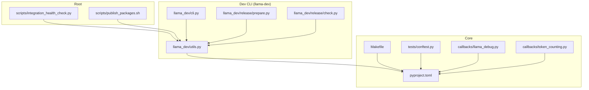
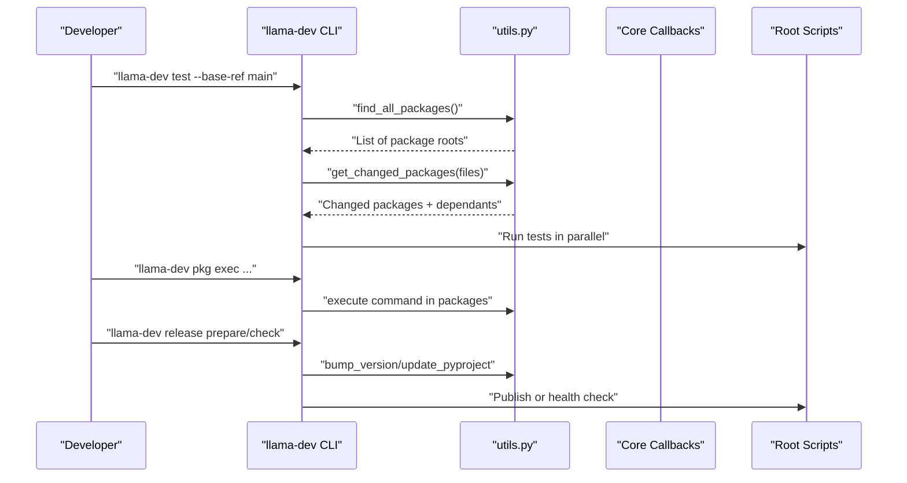
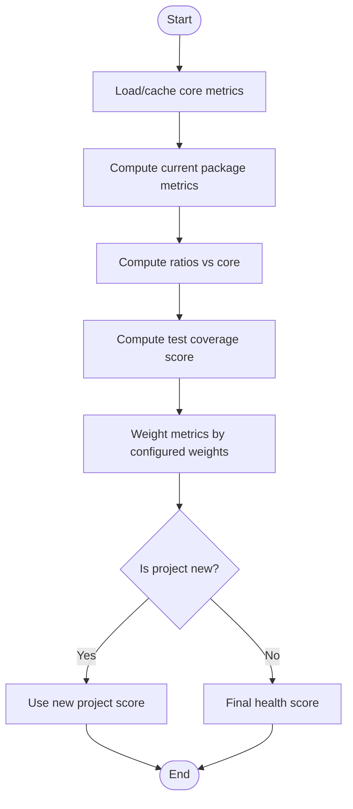
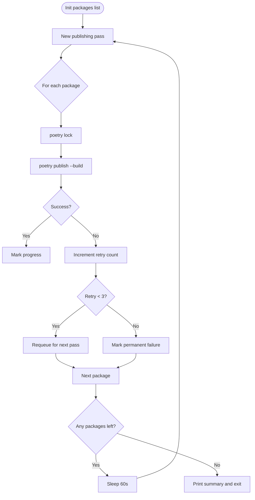
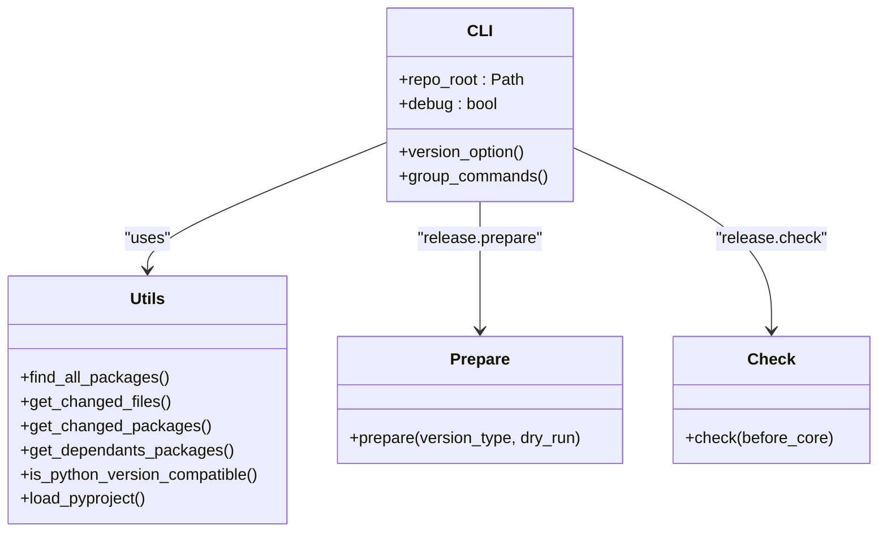
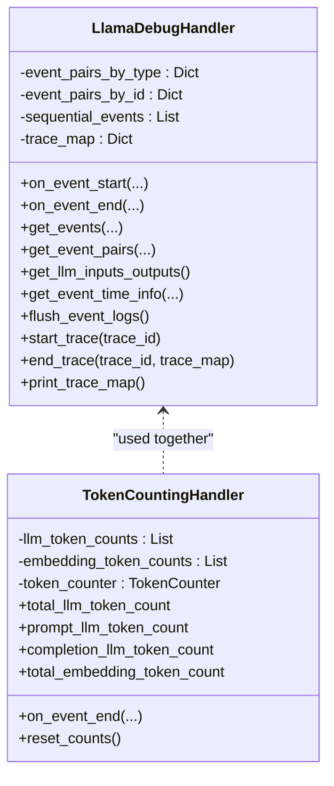
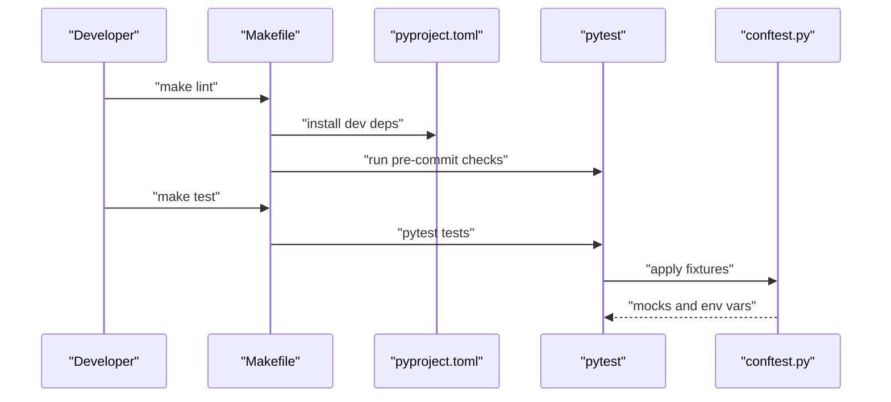
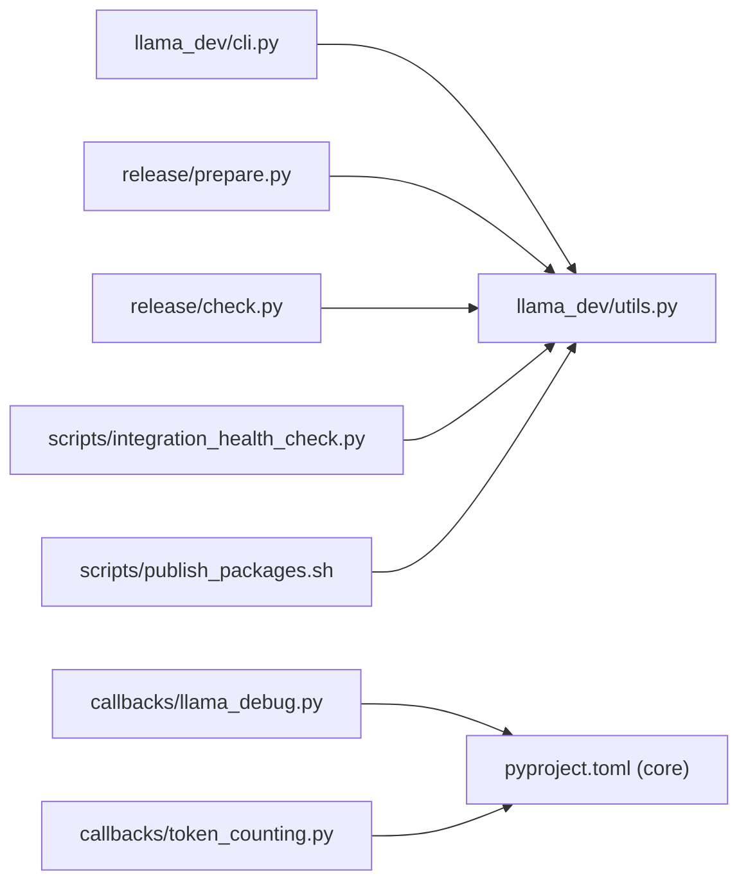

# Development Tools

<cite>
**Referenced Files in This Document**
- [README.md](file://README.md)
- [CONTRIBUTING.md](file://CONTRIBUTING.md)
- [scripts/integration_health_check.py](file://scripts/integration_health_check.py)
- [scripts/publish_packages.sh](file://scripts/publish_packages.sh)
- [llama-dev/README.md](file://llama-dev/README.md)
- [llama-dev/pyproject.toml](file://llama-dev/pyproject.toml)
- [llama-dev/llama_dev/cli.py](file://llama-dev/llama_dev/cli.py)
- [llama-dev/llama_dev/utils.py](file://llama-dev/llama_dev/utils.py)
- [llama-dev/llama_dev/release/prepare.py](file://llama-dev/llama_dev/release/prepare.py)
- [llama-dev/llama_dev/release/check.py](file://llama-dev/llama_dev/release/check.py)
- [llama-index-core/llama_index/core/callbacks/llama_debug.py](file://llama-index-core/llama_index/core/callbacks/llama_debug.py)
- [llama-index-core/llama_index/core/callbacks/token_counting.py](file://llama-index-core/llama_index/core/callbacks/token_counting.py)
- [llama-index-core/Makefile](file://llama-index-core/Makefile)
- [llama-index-core/pyproject.toml](file://llama-index-core/pyproject.toml)
- [llama-index-core/tests/conftest.py](file://llama-index-core/tests/conftest.py)
</cite>

## Table of Contents
1. [Introduction](#introduction)
2. [Project Structure](#project-structure)
3. [Core Components](#core-components)
4. [Architecture Overview](#architecture-overview)
5. [Detailed Component Analysis](#detailed-component-analysis)
6. [Dependency Analysis](#dependency-analysis)
7. [Performance Considerations](#performance-considerations)
8. [Troubleshooting Guide](#troubleshooting-guide)
9. [Conclusion](#conclusion)
10. [Appendices](#appendices)

## Introduction
This document describes the development tools, debugging utilities, profiling tools, and automation workflows used in the LlamaIndex monorepo. It covers:
- Development helper utilities and CLI (llama-dev)
- Version bumping and release preparation tools
- Debugging and tracing of complex RAG pipelines
- Token usage tracking and performance profiling
- Automated testing workflows and environment setup
- Code quality tools, linting, and static analysis integration
- Best practices and contribution workflows

## Project Structure
The repository is a monorepo with multiple packages. Development tooling spans:
- Root scripts for integration health checks and publishing
- A dedicated CLI package (llama-dev) for package management, smart testing, and release preparation
- Core callbacks for debugging and token counting
- Core Makefile and pyproject.toml for formatting, linting, and testing
- Test fixtures and markers for deterministic test runs

**Diagram sources**
- [scripts/integration_health_check.py](file://scripts/integration_health_check.py#L1-L463)
- [scripts/publish_packages.sh](file://scripts/publish_packages.sh#L1-L114)
- [llama-dev/llama_dev/cli.py](file://llama-dev/llama_dev/cli.py#L1-L45)
- [llama-dev/llama_dev/utils.py](file://llama-dev/llama_dev/utils.py#L1-L221)
- [llama-dev/llama_dev/release/prepare.py](file://llama-dev/llama_dev/release/prepare.py#L1-L72)
- [llama-dev/llama_dev/release/check.py](file://llama-dev/llama_dev/release/check.py#L1-L95)
- [llama-index-core/Makefile](file://llama-index-core/Makefile#L1-L18)
- [llama-index-core/pyproject.toml](file://llama-index-core/pyproject.toml#L1-L149)
- [llama-index-core/tests/conftest.py](file://llama-index-core/tests/conftest.py#L1-L192)
- [llama-index-core/llama_index/core/callbacks/llama_debug.py](file://llama-index-core/llama_index/core/callbacks/llama_debug.py#L1-L211)
- [llama-index-core/llama_index/core/callbacks/token_counting.py](file://llama-index-core/llama_index/core/callbacks/token_counting.py#L1-L270)

**Section sources**
- [README.md](file://README.md#L1-L224)
- [CONTRIBUTING.md](file://CONTRIBUTING.md#L1-L231)

## Core Components
- Integration Health Check: Calculates a health score for packages relative to core using download trends, commit activity, and test coverage.
- Publishing Automation: Bash script to lock and publish packages with retry/backoff logic.
- Dev CLI (llama-dev): Centralized CLI for package info/exec, smart testing, and release helpers.
- Debugging and Tracing: LlamaDebugHandler tracks and prints traces of pipeline events.
- Token Counting: TokenCountingHandler aggregates LLM and embedding token usage.
- Formatting/Linting/Test: Makefile targets and pyproject.toml dev dependencies define the toolchain.

**Section sources**
- [scripts/integration_health_check.py](file://scripts/integration_health_check.py#L1-L463)
- [scripts/publish_packages.sh](file://scripts/publish_packages.sh#L1-L114)
- [llama-dev/README.md](file://llama-dev/README.md#L1-L99)
- [llama-dev/llama_dev/cli.py](file://llama-dev/llama_dev/cli.py#L1-L45)
- [llama-dev/llama_dev/utils.py](file://llama-dev/llama_dev/utils.py#L1-L221)
- [llama-dev/llama_dev/release/prepare.py](file://llama-dev/llama_dev/release/prepare.py#L1-L72)
- [llama-dev/llama_dev/release/check.py](file://llama-dev/llama_dev/release/check.py#L1-L95)
- [llama-index-core/llama_index/core/callbacks/llama_debug.py](file://llama-index-core/llama_index/core/callbacks/llama_debug.py#L1-L211)
- [llama-index-core/llama_index/core/callbacks/token_counting.py](file://llama-index-core/llama_index/core/callbacks/token_counting.py#L1-L270)
- [llama-index-core/Makefile](file://llama-index-core/Makefile#L1-L18)
- [llama-index-core/pyproject.toml](file://llama-index-core/pyproject.toml#L1-L149)

## Architecture Overview
The development toolchain integrates:
- CLI orchestration (llama-dev) drives package discovery, command execution, and release checks
- Core callbacks provide runtime diagnostics for RAG pipelines
- Scripts automate health checks and publishing
- Makefile and pyproject.toml standardize formatting, linting, and testing

**Diagram sources**
- [llama-dev/llama_dev/cli.py](file://llama-dev/llama_dev/cli.py#L1-L45)
- [llama-dev/llama_dev/utils.py](file://llama-dev/llama_dev/utils.py#L125-L221)
- [llama-dev/llama_dev/release/prepare.py](file://llama-dev/llama_dev/release/prepare.py#L1-L72)
- [llama-dev/llama_dev/release/check.py](file://llama-dev/llama_dev/release/check.py#L1-L95)
- [scripts/integration_health_check.py](file://scripts/integration_health_check.py#L357-L400)
- [scripts/publish_packages.sh](file://scripts/publish_packages.sh#L39-L95)

## Detailed Component Analysis

### Integration Health Check
Purpose:
- Compute a normalized health score for packages relative to core using download trends, commit activity, and test coverage.

Key behaviors:
- Uses PyPI stats for monthly downloads and applies exponential time weighting
- Analyzes commit frequency and consistency over six months
- Counts test functions across common test locations to derive a coverage score
- Compares metrics against core to compute ratios and weighted composite score

**Diagram sources**
- [scripts/integration_health_check.py](file://scripts/integration_health_check.py#L264-L342)

**Section sources**
- [scripts/integration_health_check.py](file://scripts/integration_health_check.py#L1-L463)

### Publishing Automation Script
Purpose:
- Lock and publish multiple packages with retry/backoff and progress tracking.

Key behaviors:
- Iteratively publishes packages, tracking retries per package
- Stops after three failures or when no packages remain
- Sleeps between passes to allow registry stabilization

**Diagram sources**
- [scripts/publish_packages.sh](file://scripts/publish_packages.sh#L58-L95)

**Section sources**
- [scripts/publish_packages.sh](file://scripts/publish_packages.sh#L1-L114)

### Dev CLI (llama-dev)
Purpose:
- Unified CLI for package management, smart testing, and release preparation.

Key commands and capabilities:
- Package info and exec across packages
- Smart test detection based on changed files and dependants
- Coverage reporting and enforcement
- Release prepare/check helpers

**Diagram sources**
- [llama-dev/llama_dev/cli.py](file://llama-dev/llama_dev/cli.py#L24-L45)
- [llama-dev/llama_dev/utils.py](file://llama-dev/llama_dev/utils.py#L125-L221)
- [llama-dev/llama_dev/release/prepare.py](file://llama-dev/llama_dev/release/prepare.py#L27-L72)
- [llama-dev/llama_dev/release/check.py](file://llama-dev/llama_dev/release/check.py#L38-L95)

**Section sources**
- [llama-dev/README.md](file://llama-dev/README.md#L1-L99)
- [llama-dev/llama_dev/cli.py](file://llama-dev/llama_dev/cli.py#L1-L45)
- [llama-dev/llama_dev/utils.py](file://llama-dev/llama_dev/utils.py#L1-L221)
- [llama-dev/llama_dev/release/prepare.py](file://llama-dev/llama_dev/release/prepare.py#L1-L72)
- [llama-dev/llama_dev/release/check.py](file://llama-dev/llama_dev/release/check.py#L1-L95)

### Debugging Utilities for RAG Pipelines
Two complementary handlers enable pipeline introspection and performance insights:
- LlamaDebugHandler: Tracks event lifecycles, pairs start/end events by ID, computes timing stats, and prints trace maps for debugging.
- TokenCountingHandler: Aggregates token usage for LLM and embedding events, optionally verbose printing.

**Diagram sources**
- [llama-index-core/llama_index/core/callbacks/llama_debug.py](file://llama-index-core/llama_index/core/callbacks/llama_debug.py#L17-L211)
- [llama-index-core/llama_index/core/callbacks/token_counting.py](file://llama-index-core/llama_index/core/callbacks/token_counting.py#L143-L270)

**Section sources**
- [llama-index-core/llama_index/core/callbacks/llama_debug.py](file://llama-index-core/llama_index/core/callbacks/llama_debug.py#L1-L211)
- [llama-index-core/llama_index/core/callbacks/token_counting.py](file://llama-index-core/llama_index/core/callbacks/token_counting.py#L1-L270)

### Automated Testing Workflows and Environment Setup
- uv is the package manager; tests are run via pytest
- conftest defines fixtures for mocking LLMs, embeddings, and environment variables
- Makefile targets provide format, lint, and test shortcuts
- pyproject.toml lists dev dependencies for formatting, linting, and testing

**Diagram sources**
- [llama-index-core/Makefile](file://llama-index-core/Makefile#L10-L14)
- [llama-index-core/pyproject.toml](file://llama-index-core/pyproject.toml#L5-L31)
- [llama-index-core/tests/conftest.py](file://llama-index-core/tests/conftest.py#L32-L192)

**Section sources**
- [CONTRIBUTING.md](file://CONTRIBUTING.md#L11-L71)
- [llama-index-core/Makefile](file://llama-index-core/Makefile#L1-L18)
- [llama-index-core/pyproject.toml](file://llama-index-core/pyproject.toml#L1-L149)
- [llama-index-core/tests/conftest.py](file://llama-index-core/tests/conftest.py#L1-L192)

## Dependency Analysis
- CLI depends on utils for package discovery and changed-file analysis
- Release prepare/check rely on utils for version bumping and pyproject parsing
- Core callbacks are used by applications to instrument and profile pipelines
- Scripts depend on external services (PyPI stats) and local git repos

**Diagram sources**
- [llama-dev/llama_dev/cli.py](file://llama-dev/llama_dev/cli.py#L1-L45)
- [llama-dev/llama_dev/utils.py](file://llama-dev/llama_dev/utils.py#L1-L221)
- [llama-dev/llama_dev/release/prepare.py](file://llama-dev/llama_dev/release/prepare.py#L1-L72)
- [llama-dev/llama_dev/release/check.py](file://llama-dev/llama_dev/release/check.py#L1-L95)
- [llama-index-core/llama_index/core/callbacks/llama_debug.py](file://llama-index-core/llama_index/core/callbacks/llama_debug.py#L1-L211)
- [llama-index-core/llama_index/core/callbacks/token_counting.py](file://llama-index-core/llama_index/core/callbacks/token_counting.py#L1-L270)
- [scripts/integration_health_check.py](file://scripts/integration_health_check.py#L1-L463)
- [scripts/publish_packages.sh](file://scripts/publish_packages.sh#L1-L114)

**Section sources**
- [llama-dev/llama_dev/utils.py](file://llama-dev/llama_dev/utils.py#L125-L221)
- [llama-dev/llama_dev/release/prepare.py](file://llama-dev/llama_dev/release/prepare.py#L1-L72)
- [llama-dev/llama_dev/release/check.py](file://llama-dev/llama_dev/release/check.py#L1-L95)
- [scripts/integration_health_check.py](file://scripts/integration_health_check.py#L1-L463)
- [scripts/publish_packages.sh](file://scripts/publish_packages.sh#L1-L114)

## Performance Considerations
- Token counting: Use TokenCountingHandler to monitor prompt/completion token usage and embedding throughput; reset counters between runs to avoid accumulation.
- Trace timing: LlamaDebugHandler computes per-event timings and can print trace maps to identify slow stages.
- Test coverage: Enforce coverage thresholds to ensure critical paths are exercised.
- Parallelism: The CLI supports parallel workers for tests; tune based on CI resources and package interdependencies.
- Formatting/linting: Pre-commit enforces style and catches issues early; run make lint locally to reduce CI churn.

[No sources needed since this section provides general guidance]

## Troubleshooting Guide
Common development environment issues and resolutions:
- uv not installed: Follow installation steps in the contribution guide to install uv and initialize the environment.
- Python version mismatch: Use utils.is_python_version_compatible to filter incompatible packages; ensure your interpreter meets project requires-python.
- Missing test fixtures: conftest sets environment variables and mocks; ensure tests run from the correct working directory.
- Integration tests: Use the --integration flag to run tests that require external services; mock them when offline.
- Publishing failures: The script retries up to three times; inspect transient network errors and retry later.
- Health check anomalies: If PyPI stats are unavailable, the analyzer falls back to conservative estimates; rerun when connectivity improves.

**Section sources**
- [CONTRIBUTING.md](file://CONTRIBUTING.md#L11-L71)
- [llama-dev/llama_dev/utils.py](file://llama-dev/llama_dev/utils.py#L177-L202)
- [llama-index-core/tests/conftest.py](file://llama-index-core/tests/conftest.py#L121-L192)
- [scripts/publish_packages.sh](file://scripts/publish_packages.sh#L74-L95)
- [scripts/integration_health_check.py](file://scripts/integration_health_check.py#L82-L123)

## Conclusion
The LlamaIndex development toolchain combines a powerful CLI (llama-dev), robust debugging/tracing utilities, and automation scripts to streamline development, testing, and releases. By leveraging these tools—especially the health checks, token counting, and trace maps—you can debug complex RAG pipelines, optimize performance, and maintain high code quality across the monorepo.

[No sources needed since this section summarizes without analyzing specific files]

## Appendices

### Practical Usage Examples
- Debugging a RAG pipeline:
  - Attach LlamaDebugHandler to capture event traces and print trace maps
  - Optionally attach TokenCountingHandler to quantify token usage
- Smart testing:
  - Run tests filtered to changed packages and their dependants using the CLI
  - Enforce coverage thresholds and fail fast on errors
- Release preparation:
  - Use release prepare to bump versions and update core dependency constraints
  - Use release check to validate branch and version alignment with PyPI

**Section sources**
- [llama-dev/README.md](file://llama-dev/README.md#L26-L80)
- [llama-index-core/llama_index/core/callbacks/llama_debug.py](file://llama-index-core/llama_index/core/callbacks/llama_debug.py#L164-L198)
- [llama-index-core/llama_index/core/callbacks/token_counting.py](file://llama-index-core/llama_index/core/callbacks/token_counting.py#L177-L244)
- [llama-dev/llama_dev/release/prepare.py](file://llama-dev/llama_dev/release/prepare.py#L27-L72)
- [llama-dev/llama_dev/release/check.py](file://llama-dev/llama_dev/release/check.py#L38-L95)