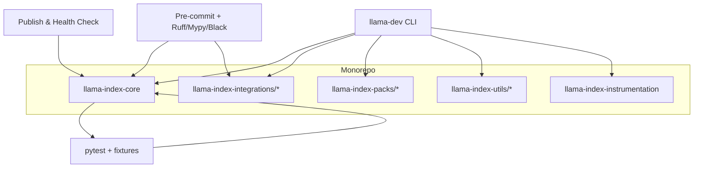
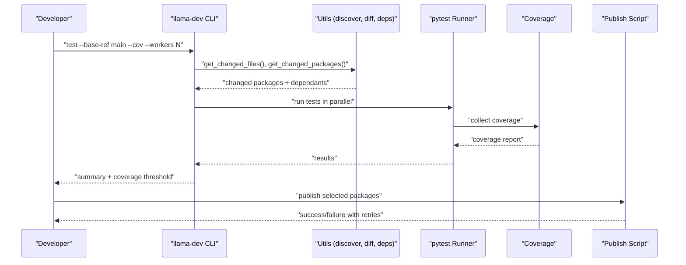
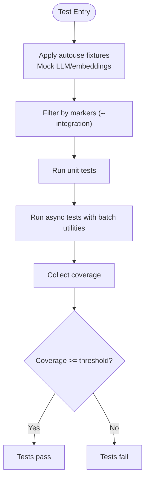
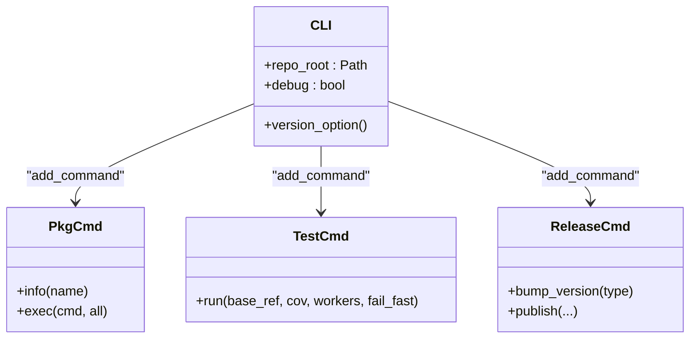
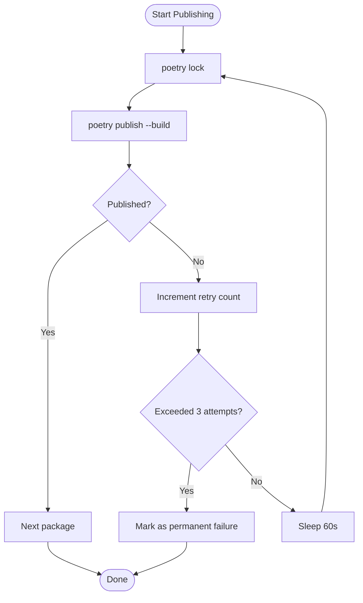
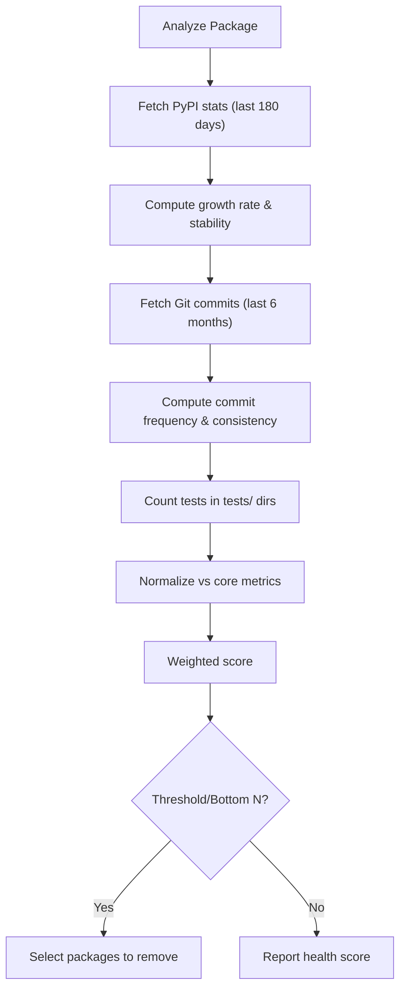
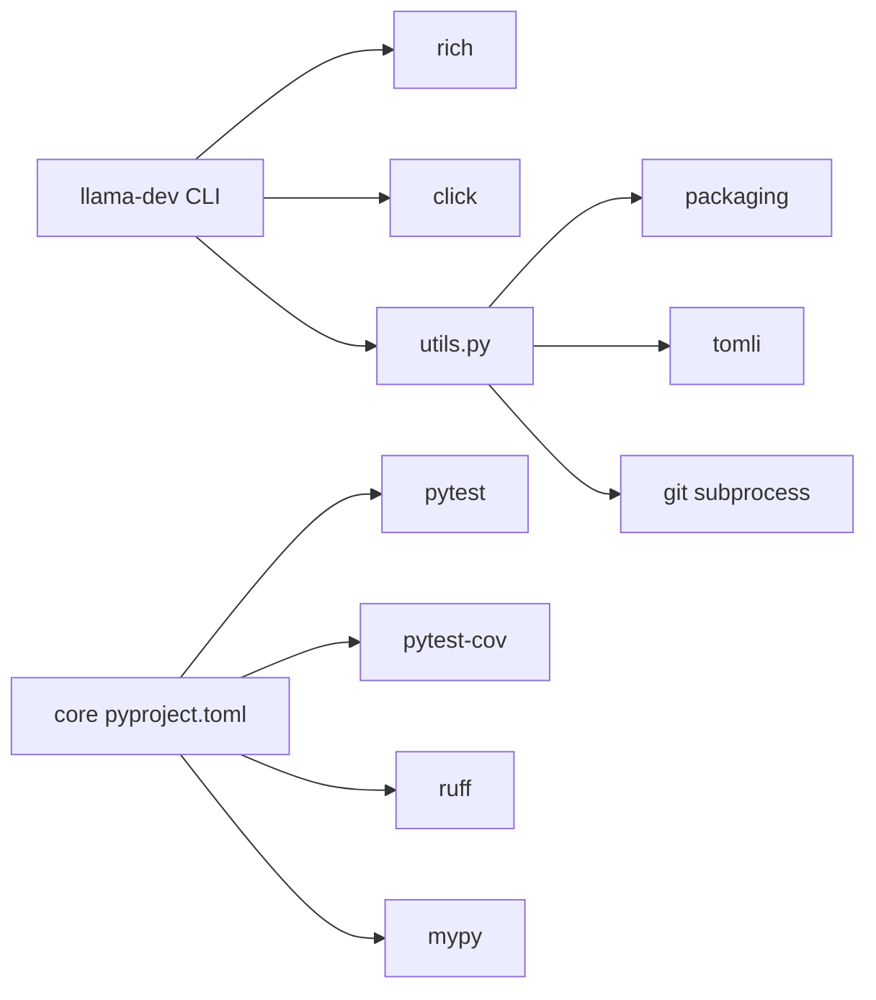

# Development Utilities

<cite>
**Referenced Files in This Document**
- [CONTRIBUTING.md](file://CONTRIBUTING.md)
- [README.md](file://README.md)
- [llama-dev/README.md](file://llama-dev/README.md)
- [llama-dev/pyproject.toml](file://llama-dev/pyproject.toml)
- [llama-dev/llama_dev/cli.py](file://llama-dev/llama_dev/cli.py)
- [llama-dev/llama_dev/utils.py](file://llama-dev/llama_dev/utils.py)
- [scripts/publish_packages.sh](file://scripts/publish_packages.sh)
- [scripts/integration_health_check.py](file://scripts/integration_health_check.py)
- [llama-index-core/pyproject.toml](file://llama-index-core/pyproject.toml)
- [llama-index-core/tests/conftest.py](file://llama-index-core/tests/conftest.py)
- [llama-index-core/tests/test_utils.py](file://llama-index-core/tests/test_utils.py)
- [llama-index-core/tests/test_async_utils.py](file://llama-index-core/tests/test_async_utils.py)
- [.pre-commit-config.yaml](file://.pre-commit-config.yaml)
</cite>

## Table of Contents
1. [Introduction](#introduction)
2. [Project Structure](#project-structure)
3. [Core Components](#core-components)
4. [Architecture Overview](#architecture-overview)
5. [Detailed Component Analysis](#detailed-component-analysis)
6. [Dependency Analysis](#dependency-analysis)
7. [Performance Considerations](#performance-considerations)
8. [Troubleshooting Guide](#troubleshooting-guide)
9. [Conclusion](#conclusion)
10. [Appendices](#appendices)

## Introduction
This document describes the development utilities that support testing, debugging, and release management in the LlamaIndex monorepo. It covers the testing framework, benchmark datasets, development tools, and quality assurance processes. It explains unit and integration testing patterns, performance benchmarking methodologies, and provides practical examples for writing tests, running benchmark suites, validating package functionality, and contributing to the project. It also outlines development workflows, code quality checks, continuous integration setup, debugging and profiling techniques, and release procedures.

## Project Structure
The repository is a monorepo with multiple packages under core, integrations, packs, and utilities. Development utilities are centered around:
- A dedicated CLI tool for package management, testing, and automation
- A robust testing harness in the core package
- Pre-commit hooks and linters for code quality
- Scripts for publishing and integration health assessment

**Diagram sources**
- [llama-dev/README.md](file://llama-dev/README.md#L1-L99)
- [llama-index-core/pyproject.toml](file://llama-index-core/pyproject.toml#L1-L149)
- [.pre-commit-config.yaml](file://.pre-commit-config.yaml#L1-L121)

**Section sources**
- [README.md](file://README.md#L1-L224)
- [llama-dev/README.md](file://llama-dev/README.md#L1-L99)

## Core Components
- Development CLI (llama-dev): Centralized tool for package discovery, execution, smart testing, coverage enforcement, and release helpers.
- Testing framework: pytest-based harness with shared fixtures, async utilities, and integration markers.
- Quality gates: pre-commit hooks, linters, type checking, and coverage configuration.
- Release automation: shell scripts for publishing packages with retries and dependency-aware ordering.
- Integration health scoring: automated metrics and scoring for integration packages.

Key capabilities:
- Discover packages across categories (core, integrations, packs, utils)
- Detect changed packages and dependents for targeted testing
- Enforce coverage thresholds and parallelize test runs
- Publish packages with retry logic and dependency resolution awareness

**Section sources**
- [llama-dev/README.md](file://llama-dev/README.md#L1-L99)
- [llama-dev/llama_dev/utils.py](file://llama-dev/llama_dev/utils.py#L125-L221)
- [llama-index-core/tests/conftest.py](file://llama-index-core/tests/conftest.py#L169-L192)
- [scripts/publish_packages.sh](file://scripts/publish_packages.sh#L1-L114)
- [scripts/integration_health_check.py](file://scripts/integration_health_check.py#L1-L463)

## Architecture Overview
The development utilities form a layered system:
- CLI orchestrates operations across the monorepo
- Utilities provide package discovery, version bumping, and dependency analysis
- Testing framework executes unit and integration tests with fixtures and async support
- Quality gates enforce standards via pre-commit hooks and CI
- Release pipeline publishes packages with resilience against transient failures

**Diagram sources**
- [llama-dev/llama_dev/utils.py](file://llama-dev/llama_dev/utils.py#L136-L221)
- [llama-index-core/tests/conftest.py](file://llama-index-core/tests/conftest.py#L169-L192)
- [scripts/publish_packages.sh](file://scripts/publish_packages.sh#L58-L95)

## Detailed Component Analysis

### Testing Framework and Patterns
- Unit testing: pytest with fixtures for mocking LLMs, embeddings, and text splitters; environment isolation; deterministic tokenization.
- Integration testing: marker-based filtering; optional network allowance; selective execution via CLI.
- Async testing: utilities for batching and contextvar propagation in async loops.
- Retry and backoff utilities: configurable retry decorators and helpers for transient errors.

Practical patterns:
- Use autouse fixtures to set environment flags and mock LLMs/embeddings globally.
- Mark integration tests and gate them behind a CLI flag to avoid flaky external dependencies.
- Prefer deterministic tokenization and mocked predictors for reproducible tests.
- Leverage async utilities for batched execution and context preservation.

**Diagram sources**
- [llama-index-core/tests/conftest.py](file://llama-index-core/tests/conftest.py#L32-L98)
- [llama-index-core/tests/conftest.py](file://llama-index-core/tests/conftest.py#L169-L192)
- [llama-index-core/tests/test_async_utils.py](file://llama-index-core/tests/test_async_utils.py#L1-L40)

**Section sources**
- [llama-index-core/tests/conftest.py](file://llama-index-core/tests/conftest.py#L1-L192)
- [llama-index-core/tests/test_utils.py](file://llama-index-core/tests/test_utils.py#L1-L310)
- [llama-index-core/tests/test_async_utils.py](file://llama-index-core/tests/test_async_utils.py#L1-L40)

### Benchmark Datasets and Evaluation
- Benchmark datasets are curated under llama-datasets with standardized cards and baseline implementations.
- Example notebooks demonstrate evaluation workflows for tool selection and model-specific benchmarks.
- Integration pack “Evaluator Benchmarker” provides reusable evaluation utilities.

Guidance:
- Use dataset cards to understand evaluation tasks and baselines.
- Reproduce baselines locally to establish performance baselines.
- Integrate custom components with the evaluator benchmarker pack for standardized comparisons.

**Section sources**
- [README.md](file://README.md#L1-L224)

### Development CLI (llama-dev)
Capabilities:
- Package discovery across core, integrations, packs, and utils
- Exec commands across packages (sync, install, test)
- Smart testing: detect changed packages and dependents, parallel execution, coverage enforcement, fail-fast
- Python version compatibility filtering
- Version bump helpers and dependency analysis

Usage examples:
- Info and exec across packages
- Run tests with coverage and parallel workers
- Enforce coverage thresholds

**Diagram sources**
- [llama-dev/llama_dev/cli.py](file://llama-dev/llama_dev/cli.py#L24-L45)
- [llama-dev/README.md](file://llama-dev/README.md#L36-L89)

**Section sources**
- [llama-dev/README.md](file://llama-dev/README.md#L1-L99)
- [llama-dev/llama_dev/cli.py](file://llama-dev/llama_dev/cli.py#L1-L45)
- [llama-dev/llama_dev/utils.py](file://llama-dev/llama_dev/utils.py#L125-L221)

### Quality Assurance and Code Quality Checks
- Pre-commit hooks: TOML sorting, Ruff (format and lint), mypy, black (docs), codespell, toml-sort.
- Linters and formatters configured per package; static assets excluded from certain checks.
- Coverage configuration in core package; coverage run exclusions for instrumentation and workflows.

Best practices:
- Run pre-commit hooks locally before pushing.
- Keep pyproject.toml sorted and formatted.
- Resolve mypy errors and address type hints.
- Maintain coverage thresholds and improve tests for new features.

**Section sources**
- [.pre-commit-config.yaml](file://.pre-commit-config.yaml#L1-L121)
- [llama-index-core/pyproject.toml](file://llama-index-core/pyproject.toml#L99-L149)

### Release Management
- Shell script for publishing packages with retry logic and dependency-aware ordering.
- Iterative passes with backoff to handle transient failures and dependency conflicts.
- Summarize successes and persistent failures.

**Diagram sources**
- [scripts/publish_packages.sh](file://scripts/publish_packages.sh#L58-L95)

**Section sources**
- [scripts/publish_packages.sh](file://scripts/publish_packages.sh#L1-L114)

### Integration Health Scoring
- Metrics include PyPI download trends, commit activity, and test coverage.
- Scores are normalized relative to core package metrics with configurable weights.
- Parallel analysis across integration and pack packages; supports bottom percentile, bottom N, or threshold-based filtering.

**Diagram sources**
- [scripts/integration_health_check.py](file://scripts/integration_health_check.py#L264-L342)

**Section sources**
- [scripts/integration_health_check.py](file://scripts/integration_health_check.py#L1-L463)

## Dependency Analysis
- CLI depends on rich for output theming, click for CLI, and internal modules for pkg, test, and release commands.
- Utilities rely on packaging for version parsing/specifiers, tomli for pyproject parsing, and subprocess/git for change detection.
- Core package defines dev dependencies for pytest, coverage, linters, and type checking.

**Diagram sources**
- [llama-dev/pyproject.toml](file://llama-dev/pyproject.toml#L12-L26)
- [llama-dev/llama_dev/utils.py](file://llama-dev/llama_dev/utils.py#L1-L12)
- [llama-index-core/pyproject.toml](file://llama-index-core/pyproject.toml#L5-L31)

**Section sources**
- [llama-dev/pyproject.toml](file://llama-dev/pyproject.toml#L1-L41)
- [llama-dev/llama_dev/utils.py](file://llama-dev/llama_dev/utils.py#L1-L12)
- [llama-index-core/pyproject.toml](file://llama-index-core/pyproject.toml#L5-L31)

## Performance Considerations
- Prefer deterministic tokenization and mocked components to reduce variability in tests.
- Use async utilities for efficient batch processing in tests.
- Enforce coverage thresholds to ensure critical paths are exercised.
- Parallelize tests via the CLI to speed up feedback cycles.
- Use integration health scoring to identify under-maintained packages and focus efforts.

[No sources needed since this section provides general guidance]

## Troubleshooting Guide
Common issues and resolutions:
- Environment setup
  - Ensure uv is installed and virtual environments are activated before running CLI or tests.
  - Use editable installs for development packages to reflect changes immediately.
- Testing failures
  - Run integration tests with the explicit flag to enable external dependencies.
  - Use mocks for LLMs and embeddings to avoid flaky network calls.
  - Increase verbosity with debug flags in the CLI for detailed logs.
- Coverage failures
  - Add unit tests for new features and ensure coverage meets thresholds.
  - Review coverage exclusions and adjust as needed.
- Publishing failures
  - Re-run the publish script; it retries transient failures up to three times.
  - Investigate dependency conflicts and resolve them before re-running.
- Pre-commit hook failures
  - Fix formatting with Ruff/black; resolve mypy errors; correct typos with codespell.
  - Re-run hooks after applying fixes.

**Section sources**
- [CONTRIBUTING.md](file://CONTRIBUTING.md#L1-L231)
- [llama-dev/README.md](file://llama-dev/README.md#L1-L99)
- [scripts/publish_packages.sh](file://scripts/publish_packages.sh#L58-L95)
- [.pre-commit-config.yaml](file://.pre-commit-config.yaml#L1-L121)

## Conclusion
The LlamaIndex development utilities provide a cohesive toolkit for testing, benchmarking, and releasing changes across a large monorepo. The llama-dev CLI streamlines package management and targeted testing, while the core testing framework and quality gates ensure reliability and consistency. The integration health scoring and publishing scripts further automate maintenance and release workflows. Following the documented patterns and troubleshooting steps will help contributors deliver high-quality changes efficiently.

[No sources needed since this section summarizes without analyzing specific files]

## Appendices

### Practical Examples

- Writing unit tests for custom components
  - Use shared fixtures to mock LLMs and embeddings.
  - Keep tests deterministic by controlling tokenization and predictor behavior.
  - Validate async behavior with batch utilities and contextvar handling.

  **Section sources**
  - [llama-index-core/tests/conftest.py](file://llama-index-core/tests/conftest.py#L32-L98)
  - [llama-index-core/tests/test_async_utils.py](file://llama-index-core/tests/test_async_utils.py#L1-L40)

- Running benchmark suites
  - Explore benchmark notebooks and datasets under docs/examples/benchmarks and llama-datasets.
  - Reproduce baselines locally and compare with custom components using the evaluator benchmarker pack.

  **Section sources**
  - [README.md](file://README.md#L1-L224)

- Validating package functionality
  - Use the CLI to run tests with coverage and parallel workers.
  - Enforce coverage thresholds and filter integration tests as needed.

  **Section sources**
  - [llama-dev/README.md](file://llama-dev/README.md#L61-L89)
  - [llama-index-core/tests/conftest.py](file://llama-index-core/tests/conftest.py#L169-L192)

- Contributing and code review
  - Follow the contribution guide for environment setup, branching, and PR submission.
  - Ensure tests pass, coverage is sufficient, and pre-commit hooks succeed.

  **Section sources**
  - [CONTRIBUTING.md](file://CONTRIBUTING.md#L1-L231)

- Debugging and profiling
  - Use pytest markers to isolate integration tests.
  - Employ retry utilities for transient failures during tests.
  - Analyze integration health scores to prioritize maintenance.

  **Section sources**
  - [llama-index-core/tests/conftest.py](file://llama-index-core/tests/conftest.py#L169-L192)
  - [llama-index-core/tests/test_utils.py](file://llama-index-core/tests/test_utils.py#L58-L180)
  - [scripts/integration_health_check.py](file://scripts/integration_health_check.py#L264-L342)